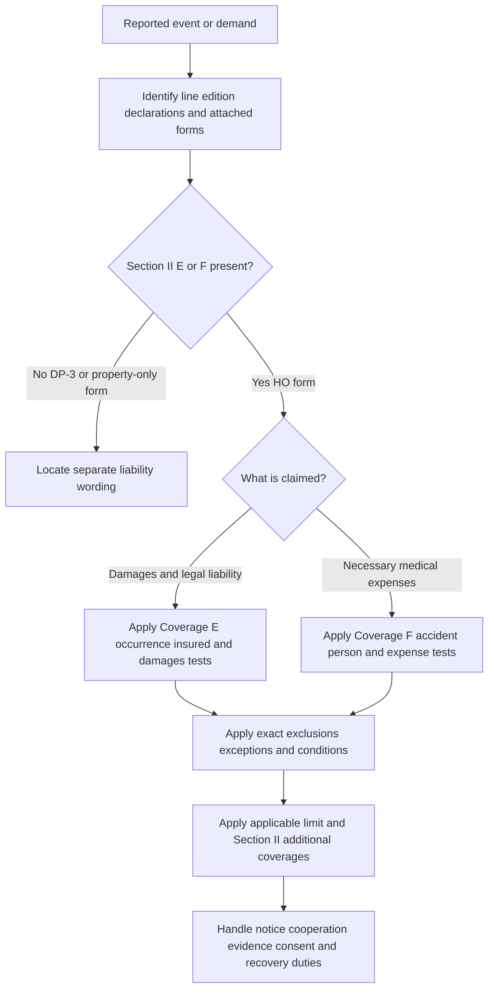

# Liability and Medical Payments Coverages E–F

## Scope and authority

This is a **coverage** reference to the contract wording in the supplied editions. The declarations, the base form in force on the occurrence date, attached endorsements, applicable state forms, facts, and law control. Claims guidance and bulletins can organize handling or administration; they do not grant Coverage E or F, remove an exclusion, change a limit, or replace the issued policy.

“Coverage E” is not a reliable line identifier by itself. Section I can use the same letter for a property coverage, while Section II Coverage E is Personal Liability. Always identify the line, section, edition, declarations, and attached forms before applying a limit or exclusion.

## First gate: is there a Section II E/F grant?

| Base line and supplied edition | Section II result |
|---|---|
| DP-3 2012-11 and 2020-08 | No Section II Coverage E or F. The opening agreement and definitions describe direct physical loss to covered property. |
| DP-3 2026-01 | No Section II Coverage E or F. Its Section I Coverage E is Additional Living Expense, not Personal Liability; Coverage A is the dwelling-property entrypoint. |
| HO-3 2024-03, HO-4 2021-10, HO-5 2022-06, and HO-6 2023-02 | Each has `II.E — Coverage E — Personal Liability` and `II.F — Coverage F — Medical Payments to Others`. |

The DP-3 result is structural, not an inference from an underwriting label: the supplied DP-3 files do not contain the Section II E/F headings and instead describe property insurance. A DP-3 property-liability or medical-payment question therefore requires a separate liability form or attached endorsement; do not import homeowners Section II language into DP-3. ([DP-3 2012-11](repo://forms/DP/MS/DP-3/2012-11.md#L13-L39); [DP-3 2020-08](repo://forms/DP/MS/DP-3/2020-08.md#L13-L33); [DP-3 2026-01](repo://forms/DP/MS/DP-3/2026-01.md#L13-L39); [DP-3 2026-01 Coverage E](repo://forms/DP/MS/DP-3/2026-01.md#L696-L740); [DP-3 2026-01 coverage list](repo://forms/DP/MS/DP-3/2026-01.md#L834-L841))

*Caption: This flow separates form selection from the distinct Coverage E and Coverage F tests; it is a contract-analysis sequence, not claims authority or a promise to pay.*

## Coverage E — Personal Liability

### Shared function, different wording

The common function is occurrence-based liability: the insurer pays covered damages for which an insured is legally liable because of bodily injury or property damage caused by an occurrence, and the form supplies a defense subject to its own wording. This does not mean the four forms have the same trigger, insured status, exclusions, defense-cost treatment, or exhaustion rule.

| Form | Grant, defense, and limit behavior |
|---|---|
| **HO-3 2024-03** | Pays “on behalf of” an insured for legally owed damages caused by an occurrence and provides an insurer-paid defense against a claim or suit seeking covered damages. The defense ends when paid damages exhaust the applicable limit; the form separately places coverage at an insured location or in an insured’s personal activities and applies insurance separately to each insured without increasing the limit. ([E.1–E.6](repo://forms/HO/MS/HO-3/2024-03.md#L933-L945)) |
| **HO-4 2021-10** | Pays damages for which an insured is legally liable and provides a defense by counsel of the insurer’s choice against a covered claim or suit. It expressly addresses expenses incurred at the insurer’s request, taxed costs, bond premiums, and judgment interest; the defense ends when judgments or settlements exhaust the applicable limit. ([E.1–E.5](repo://forms/HO/MS/HO-4/2021-10.md#L1007-L1017)) |
| **HO-5 2022-06** | Uses the same legal-liability and occurrence grant, counsel-of-choice defense, exhaustion rule, and defense-cost provisions as its own form. Coverage applies only to injury or damage during the policy period and within the stated territory. ([E.1–E.7](repo://forms/HO/MS/HO-5/2022-06.md#L1129-L1143)) |
| **HO-6 2023-02** | Pays damages for which an insured is legally liable because of bodily injury or property damage caused by a covered occurrence and provides a defense against a covered suit. Its defense ends when the applicable limit is exhausted by judgments or settlements; it also separately states occurrence notice, legal-paper forwarding, cooperation, consent, and recovery duties. ([E.1–E.7](repo://forms/HO/MS/HO-6/2023-02.md#L1016-L1030); [E.4–E.7](repo://forms/HO/MS/HO-6/2023-02.md#L1024-L1030)) |

The declarations supply the applicable Coverage E limit. “Each insured” wording is not a second limit: HO-3, HO-4, HO-5, and HO-6 each state separate application to an insured without increasing the occurrence limit. Defense expenses, taxed costs, bond premiums, interest, and claim expenses must be taken from the edition’s exact provision rather than assumed to be unlimited or automatically inside the damages limit. ([HO-3 separate insurance and applicable limit](repo://forms/HO/MS/HO-3/2024-03.md#L931-L945); [HO-4 separate insurance](repo://forms/HO/MS/HO-4/2021-10.md#L1071-L1073); [HO-5 separate insurance](repo://forms/HO/MS/HO-5/2022-06.md#L1191-L1195); [HO-6 separate insurance](repo://forms/HO/MS/HO-6/2023-02.md#L1057-L1062))

### Insured status is form-specific

The person whose liability is asserted must qualify as an insured under the applicable form or an attached endorsement. The definitions are similar but not interchangeable:

- **HO-3 2024-03** includes the named insured and household residents who are relatives or in the insured’s care, and includes a person using covered property with permission when coverage applies to that use; a visitor who is not a household resident and a person outside the permission are not included by that definition. ([DEF.5](repo://forms/HO/MS/HO-3/2024-03.md#L51-L63))
- **HO-4 2021-10** includes you and qualifying household residents, but expressly does not include a tenant, boarder, or unrelated roommate who is not in your care. ([DEF.4–DEF.6](repo://forms/HO/MS/HO-4/2021-10.md#L49-L55))
- **HO-5 2022-06** includes you and qualifying household residents and excludes a tenant, boarder, or guest who is not a household resident or in your care. ([DEF.4–DEF.6](repo://forms/HO/MS/HO-5/2022-06.md#L52-L65))
- **HO-6 2023-02** includes you and qualifying household residents and separately includes a person having custody of covered property after your death, but only for that property; a temporary occupant does not become an insured merely by staying at the residence. ([DEF.4–DEF.6](repo://forms/HO/MS/HO-6/2023-02.md#L46-L55))

An endorsement can change the covered activity or injury, but it does not automatically make a non-insured person an insured. For example, the business-pursuit and personal-injury endorsements below use the policy’s insured status rather than creating a new insured class. Verify the endorsement’s own definitions and scope.

### Exclusions and exceptions that change the answer

The following are issue-spotting categories, not a substitute for the complete Section II text:

- **Expected or intended injury or damage:** each supplied base form excludes it; HO-3, HO-4, HO-5, and HO-6 state a reasonable-force exception for bodily injury in their Coverage E wording. ([HO-3 E.7](repo://forms/HO/MS/HO-3/2024-03.md#L947-L947); [HO-4 E.8](repo://forms/HO/MS/HO-4/2021-10.md#L1023-L1023); [HO-5 E.8](repo://forms/HO/MS/HO-5/2022-06.md#L1145-L1145); [HO-6 E.8](repo://forms/HO/MS/HO-6/2023-02.md#L1032-L1032))
- **Business and professional services:** HO-3 preserves activities ordinarily incident to nonbusiness pursuits in its business exclusion; HO-4 and HO-5 separately exclude business and professional services; HO-6 excludes business unless coverage is expressly provided by the policy. ([HO-3 E.8–E.11](repo://forms/HO/MS/HO-3/2024-03.md#L949-L955); [HO-4 E.9–E.11](repo://forms/HO/MS/HO-4/2021-10.md#L1025-L1031); [HO-5 E.9–E.11](repo://forms/HO/MS/HO-5/2022-06.md#L1147-L1151); [HO-6 E.10–E.11](repo://forms/HO/MS/HO-6/2023-02.md#L1034-L1038))
- **Vehicles and watercraft:** the exceptions and thresholds are not portable. For example, the reviewed HO-3 Section II exclusions address outboard watercraft above 50 horsepower and sailing vessels above 30 feet, while HO-4, HO-5, and HO-6 contain their own vehicle, watercraft, registration, charge, business-use, and “otherwise provided” wording. ([HO-3 watercraft exclusions](repo://forms/HO/MS/HO-3/2024-03.md#L1031-L1053); [HO-4 E.11–E.20](repo://forms/HO/MS/HO-4/2021-10.md#L1029-L1047); [HO-5 E.12–E.20](repo://forms/HO/MS/HO-5/2022-06.md#L1153-L1169); [HO-6 E.12–E.14](repo://forms/HO/MS/HO-6/2023-02.md#L1040-L1046))
- **Property and premises:** all four forms restrict damage to property owned, rented, occupied, used, borrowed, or in an insured’s care, custody, or control, but exceptions differ. HO-4 and HO-5 expressly preserve fire, smoke, or explosion exceptions for some property; HO-3 and HO-6 use different property and premises wording. ([HO-3 E.14–E.15](repo://forms/HO/MS/HO-3/2024-03.md#L961-L963); [HO-4 E.20–E.31](repo://forms/HO/MS/HO-4/2021-10.md#L1057-L1069); [HO-5 E.20–E.26](repo://forms/HO/MS/HO-5/2022-06.md#L1169-L1181); [HO-6 E.18–E.20](repo://forms/HO/MS/HO-6/2023-02.md#L1052-L1056))
- **Expanded Section II catalogs:** the later forms add or reorganize exclusions for communicable disease, abuse, pollutants, electronic data or privacy, criminal conduct, punitive or uninsurable damages, animals, rental, and business-entity exposures. A definition or exclusion reference to personal injury is not itself a personal-injury grant; review an attached personal-injury endorsement if that offense-based harm is alleged. ([HO-3 Section II exclusions](repo://forms/HO/MS/HO-3/2024-03.md#L1025-L1089); [HO-5 Section II exclusions](repo://forms/HO/MS/HO-5/2022-06.md#L1253-L1353); [HO-6 Section II exclusions](repo://forms/HO/MS/HO-6/2023-02.md#L1120-L1220); [HO 24 82 grant](repo://forms/HO/MS/HO-24-82/2011-05.md#L47-L63))

## Coverage F — Medical Payments to Others

Coverage F is separate from Coverage E. It generally pays necessary and reasonable medical expenses for qualifying third-party bodily injury caused by an accident, without regard to the insured’s legal liability, and payment is not an admission of Coverage E liability. The injured person, location or activity connection, time period, exclusions, and cap are form-specific.

| Form | Trigger and handling distinction |
|---|---|
| **HO-3 2024-03** | Pays necessary expenses for accidental bodily injury without regard to an insured’s legal liability; expenses must be incurred or medically ascertained within three years. It covers persons on an insured location with permission and specified off-location condition, activity, residence-employee, and animal injuries, with direct-payment and medical-record provisions. ([F.1–F.13](repo://forms/HO/MS/HO-3/2024-03.md#L983-L1009)) |
| **HO-4 2021-10** | Pays reasonable and necessary expenses incurred within three years, without regard to fault. Its on-location trigger requires permission and injury arising from the location’s condition or an insured’s activities; its off-location provisions separately address a residence-premises condition, insured activity, residence employee, and animal. ([F.1–F.8](repo://forms/HO/MS/HO-4/2021-10.md#L1075-L1085)) |
| **HO-5 2022-06** | Uses the same three-year, no-fault structure and adds its own listed medical services, location, activity, residence-employee, and animal wording. Payment reduces the amount available for the bodily injury and can be made to the injured person or provider. ([F.1–F.13](repo://forms/HO/MS/HO-5/2022-06.md#L1197-L1223)) |
| **HO-6 2023-02** | Pays necessary expenses incurred within three years without regard to legal liability. A person on an insured location must not be an insured; for off-location injury from an insured-location condition, the condition must be caused by an insured’s negligence. ([F.1–F.7](repo://forms/HO/MS/HO-6/2023-02.md#L1064-L1078)) |

The common Coverage F exclusions include injury to you or a regular household resident, workers compensation or similar benefits, business and professional services, motor vehicles, watercraft, aircraft, expected or intended injury, controlled substances, communicable disease, abuse, war, and nuclear hazards. Exceptions matter: residence-employee treatment, dead-storage or location exceptions, and business or nonbusiness-pursuit exceptions differ across forms. ([HO-3 F.14–F.20](repo://forms/HO/MS/HO-3/2024-03.md#L1011-L1023); [HO-4 F.8–F.18](repo://forms/HO/MS/HO-4/2021-10.md#L1091-L1111); [HO-5 F.14–F.27](repo://forms/HO/MS/HO-5/2022-06.md#L1225-L1251); [HO-6 F.8–F.22](repo://forms/HO/MS/HO-6/2023-02.md#L1080-L1108))

Do not assume that “medical payments” means every medical bill or that the Coverage F limit is a per-accident limit. The declarations provide the applicable limit, while the form determines whether it applies to all expenses from an accident, injury to one person, or the amount remaining after payment. The claimant may have to provide bills, records, authorizations, a medical examination, or an examination under oath. ([HO-3 medical duties](repo://forms/HO/MS/HO-3/2024-03.md#L1005-L1009); [HO-4 medical duties](repo://forms/HO/MS/HO-4/2021-10.md#L1113-L1115); [HO-5 payment and duties](repo://forms/HO/MS/HO-5/2022-06.md#L1215-L1223); [HO-6 medical duties](repo://forms/HO/MS/HO-6/2023-02.md#L1110-L1118))

## Section II additional coverages and sublimits

Section II additional coverages do not silently increase the Coverage E or F limit. Depending on the edition, they pay defense or investigation expenses, taxed costs, bonds, judgment interest, emergency aid or first aid, damage to property of others, and loss assessments. Each provision has its own trigger, exclusions, conditions, and sublimit:

| Edition | Examples of operative additional coverage |
|---|---|
| HO-3 2024-03 | Emergency aid and damage to property of others in an insured’s care, with a stated $2,000 maximum for that property-damage provision. ([II.1–II.8](repo://forms/HO/MS/HO-3/2024-03.md#L1139-L1155)) |
| HO-4 2021-10 | Defense expenses, bonds, post-judgment interest, emergency medical assistance, and $1,500 for property damage to property of others; the provision is available regardless of legal liability and retains its own property exclusions. ([II.1–II.18](repo://forms/HO/MS/HO-4/2021-10.md#L1261-L1295)) |
| HO-5 2022-06 | Defense expenses, bonds, interest, attendance expenses, first aid, and property damage to property of others. The supplied 2022-06 text states a $2,500 maximum for that property-damage coverage. ([II.1–II.17](repo://forms/HO/MS/HO-5/2022-06.md#L1357-L1387)) |
| HO-6 2023-02 | Investigation and defense assistance, first aid, $1,000 property damage to property of others, loss assessment, and other property-side additional coverages, each subject to the Section II conditions and exclusions. ([II.1–II.36](repo://forms/HO/MS/HO-6/2023-02.md#L1224-L1294)) |

These payments are not a substitute for Coverage E indemnity, and the property-of-others provisions do not turn property owned by, rented to, occupied by, used by, or in an insured’s care into covered liability property. Payments also do not establish legal liability or waive defenses where the form says otherwise. ([HO-3 additional coverage](repo://forms/HO/MS/HO-3/2024-03.md#L1149-L1155); [HO-4 additional coverage](repo://forms/HO/MS/HO-4/2021-10.md#L1273-L1285); [HO-5 additional coverage](repo://forms/HO/MS/HO-5/2022-06.md#L1379-L1387); [HO-6 additional coverage](repo://forms/HO/MS/HO-6/2023-02.md#L1242-L1254))

## Liability-focused endorsements and line variants

An endorsement is part of the contract only when attached. Use the exact relationship stated by the endorsement: it may **modify**, **extend**, **write back**, or **preserve** a term, but it does not change unrelated Section II language by implication. The 2011-05 liability endorsements below remain relevant only to a policy to which they are actually attached.

### Endorsements that change the liability subject matter

- **HO 04 96 No Section II — Liability Coverages (2011-05)** is internally conflicting. Its title says “No Section II,” but W.1 expressly provides personal-liability and medical-payments coverage, including a defense and no-fault medical payments. The supplied text therefore requires reconciliation with the attached policy and declarations; the title alone is not enough to conclude that E/F was removed. ([HO 04 96 title and attachment](repo://forms/HO/MS/HO-04-96/2011-05.md#L1-L13); [HO 04 96 operative W.1](repo://forms/HO/MS/HO-04-96/2011-05.md#L57-L81); [HO-3 Section II E/F](repo://forms/HO/MS/HO-3/2024-03.md#L933-L985))
- **HO 24 71 Business Pursuits (2011-05) extends** personal liability and medical-payments coverage to a described business pursuit. It states a $100,000 business-pursuit limit that is not increased by multiple insureds, claimants, claims, or suits, while professional services, products, completed work, employee, vehicle, watercraft, and other exclusions remain subject to the endorsement. ([HO 24 71 grant and exclusions](repo://forms/HO/MS/HO-24-71/2011-05.md#L57-L93); [HO 24 71 limit](repo://forms/HO/MS/HO-24-71/2011-05.md#L151-L169); [HO-3 business exclusion](repo://forms/HO/MS/HO-3/2024-03.md#L947-L951))
- **HO 24 73 Farmers Personal Liability extends** personal liability and medical payments to covered farming and farm-premises risks and defines the relevant insureds, premises, and farming activity. It preserves the stated business, professional-service, employee, property-in-care, vehicle, pollutant, abuse, and electronic-data exclusions and applies collective limit rules. ([HO 24 73 grant and insured status](repo://forms/HO/MS/HO-24-73/2011-05.md#L41-L75); [HO 24 73 exclusions](repo://forms/HO/MS/HO-24-73/2011-05.md#L79-L125); [HO-3 base E/F](repo://forms/HO/MS/HO-3/2024-03.md#L933-L985))
- **HO 24 82 Personal Injury Coverage adds** an offense-based personal-injury grant for false arrest, malicious prosecution, wrongful eviction or entry, invasion of private occupancy, defamation, and privacy violations. It provides a defense for covered claims or suits, does not expand insured status, and states that attachment does not increase the applicable limits. This is distinct from the base forms’ bodily-injury/property-damage Coverage E grants. ([HO 24 82 attachment and grant](repo://forms/HO/MS/HO-24-82/2011-05.md#L15-L29); [HO 24 82 personal-injury grant](repo://forms/HO/MS/HO-24-82/2011-05.md#L41-L63); [base Coverage E](repo://forms/HO/MS/HO-3/2024-03.md#L933-L945))

### Property endorsements that do not create E/F

The supplied changed endorsements are line-specific property endorsements, not Section II liability endorsements:

- **HO 04 48 Other Structures — Increased Limits (2026-06) modifies** HO-3 Coverage B by increasing the limit for covered other-structures loss. It expressly says the changed insurance applies only when attached, does not change the property to which coverage applies, and leaves other provisions unchanged. It therefore does not create or enlarge Section II E/F. ([HO 04 48 attachment and scope](repo://forms/HO/MS/HO-04-48/2026-06.md#L13-L27); [HO 04 48 Coverage B](repo://forms/HO/MS/HO-04-48/2026-06.md#L29-L47); [HO-3 Section II E/F](repo://forms/HO/MS/HO-3/2024-03.md#L933-L985))
- **HO 04 90 Water Backup and Sump Discharge or Overflow (2027-01) modifies** HO-3 property coverage only when attached. It writes back stated water-backup and sump-discharge property coverage, sets a $10,000 maximum, and applies a $1,000 endorsement deductible; it also says the insured identity and all unmodified policy provisions remain unchanged. It does not modify HO-3 Coverage E or F. ([HO 04 90 attachment and preservation](repo://forms/HO/MS/HO-04-90/2027-01.md#L14-L60); [HO 04 90 coverage](repo://forms/HO/MS/HO-04-90/2027-01.md#L62-L117); [HO 04 90 limit and deductible](repo://forms/HO/MS/HO-04-90/2027-01.md#L254-L276); [HO 04 90 deductible](repo://forms/HO/MS/HO-04-90/2027-01.md#L391-L412); [HO-3 E/F](repo://forms/HO/MS/HO-3/2024-03.md#L933-L985))
- **HO 04 91 Water Backup — Unit-Owners (2019-03) modifies** HO-6 property coverage for direct physical loss caused by water backup or sump overflow. Its stated limit is $7,500 and its deductible section states a $750 amount; it does not change who is an insured or create Section II liability or medical-payments coverage. Apply the endorsement with the applicable HO-6 property and Section II wording, and escalate any internal text conflict rather than borrowing a different line’s amount. ([HO 04 91 coverage and scope](repo://forms/HO/MS/HO-04-91/2019-03.md#L13-L59); [HO 04 91 limit](repo://forms/HO/MS/HO-04-91/2019-03.md#L113-L129); [HO 04 91 deductible wording](repo://forms/HO/MS/HO-04-91/2019-03.md#L161-L173); [HO-6 E/F](repo://forms/HO/MS/HO-6/2023-02.md#L1016-L1118))
- **HO 04 92 Water Backup — Tenants (2019-03) modifies** HO-4 personal-property coverage for direct physical loss caused by water backup or sump overflow. Its limit is $2,500 and its deductible is $250; the endorsement preserves all policy exclusions, limitations, conditions, and duties unless it expressly changes them. It does not create or modify Section II Coverage E or F. ([HO 04 92 scope and preservation](repo://forms/HO/MS/HO-04-92/2019-03.md#L13-L39); [HO 04 92 coverage and limit](repo://forms/HO/MS/HO-04-92/2019-03.md#L41-L55); [HO 04 92 limit and deductible](repo://forms/HO/MS/HO-04-92/2019-03.md#L113-L127); [HO 04 92 deductible](repo://forms/HO/MS/HO-04-92/2019-03.md#L181-L199); [HO-4 E/F](repo://forms/HO/MS/HO-4/2021-10.md#L1007-L1079))

The endorsement line metadata matters: HO 04 48 and HO 04 90 are HO-3 forms, HO 04 91 is an HO-6 form, and HO 04 92 is an HO-4 form. Do not attach a line-specific property endorsement to a different line by analogy. ([HO 04 48 metadata](repo://forms/HO/MS/HO-04-48/2026-06.md#L1-L6); [HO 04 90 metadata](repo://forms/HO/MS/HO-04-90/2027-01.md#L1-L6); [HO 04 91 metadata](repo://forms/HO/MS/HO-04-91/2019-03.md#L1-L6); [HO 04 92 metadata](repo://forms/HO/MS/HO-04-92/2019-03.md#L1-L6))

## Claim-handling boundary

The forms impose contract duties. Across the reviewed editions, those duties include prompt notice of an occurrence or accident, forwarding demands and legal papers, cooperation, records or examinations, consent before voluntary payments or assumed obligations, and protection of evidence and recovery rights. The precise failure standard, legal-action condition, other-insurance provision, fraud language, and whether an examination or authorization is required depend on the edition. ([HO-3 E/F duties](repo://forms/HO/MS/HO-3/2024-03.md#L975-L1009); [HO-4 E/F duties](repo://forms/HO/MS/HO-4/2021-10.md#L1113-L1115); [HO-5 E/F duties](repo://forms/HO/MS/HO-5/2022-06.md#L1183-L1223); [HO-6 E/F duties](repo://forms/HO/MS/HO-6/2023-02.md#L1024-L1030))

The linked [Liability Claim Handling Guidance](/openwiki/claims/guidelines/liability-claim-handling.md) is internal workflow, not contract language. It directs policy retrieval, allegation and fact separation, coverage review, defense escalation, evidence preservation, authority, settlement, recovery, and closure; it expressly says the policy, declarations, endorsements, facts, and law determine coverage. ([Liability Claim Handling Guidance](repo://guidelines/claims/liability-claim-handling.md#L26-L44); [coverage-review sequence](repo://guidelines/claims/liability-claim-handling.md#L106-L135); [defense boundary](repo://guidelines/claims/liability-claim-handling.md#L163-L169))

For a reported matter, use this order:

1. Select the line and edition in force on the occurrence date.
2. Retrieve the declarations, all attached endorsements, and any line-appropriate state amendatory form.
3. Identify each person seeking protection and apply the actual insured definition.
4. For Coverage E, test occurrence, territory or location, bodily injury or property damage, legal liability, damages, and the defense wording.
5. For Coverage F, test accident, qualifying person, location or activity connection, necessary medical expenses, timing, and the form’s no-admission rule.
6. Apply every relevant exclusion and exception before applying the limit; then review Section II additional coverages separately.
7. Preserve notice, legal papers, evidence, cooperation, consent, other-insurance, and recovery requirements. Use claims guidance for handling controls, not as a coverage grant.

## Related references

- [Liability Claim Handling Guidance](/openwiki/claims/guidelines/liability-claim-handling.md) — intake, coverage review, investigation, defense, authority, recovery, and closure.
- [Liability Specialty and Recovery Manual](/openwiki/claims/manual/liability-specialty-and-recovery.md) — specialty liability investigation, recovery, and closure controls.
- [Incidental Business and Personal Injury](/openwiki/coverage/liability/incidental-business-and-personal-injury.md) — business, farming, incidental occupancy, and personal-injury endorsement analysis.
- [HO-3 Form Editions](/openwiki/coverage/forms/ho-3.md) and [HO-4 Contents Broad Form Editions](/openwiki/coverage/forms/ho-4.md) — edition and policy-assembly context.
