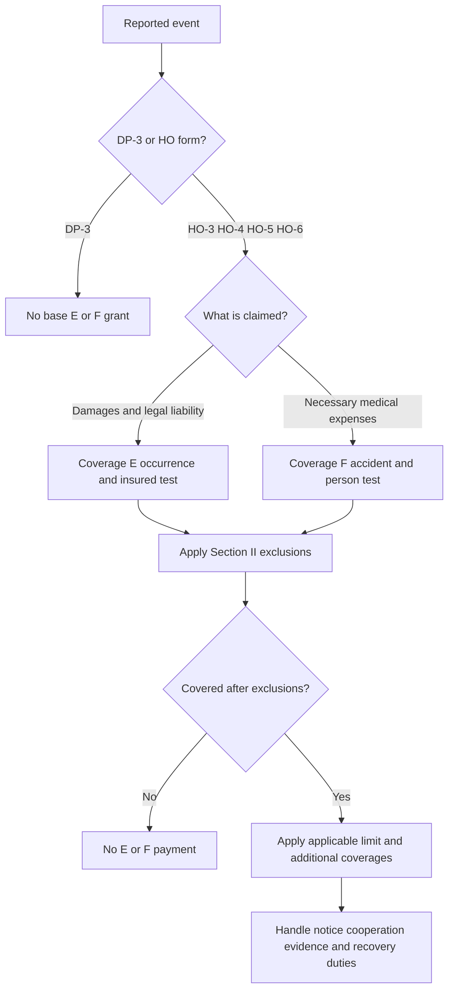

# Liability and Medical Payments Coverages E–F

## Scope and type coverage

This is a **coverage concept** page. It describes the controlling form language for liability and medical-payments decisions; it is not an underwriting appetite guide or a substitute for the declarations, attached endorsements, or applicable law.

The first distinction is form selection:

| Base line | Section II Coverage E/F result |
|---|---|
| DP-3, 2012-11 | No Section II Coverage E or F. The form is organized around the dwelling-property agreement, definitions, and property Coverages A onward. |
| DP-3, 2020-08 | No Section II Coverage E or F. Its agreement says it pays direct physical loss to covered property, and its definitions are property-policy definitions. |
| DP-3, 2026-01 | No Section II Coverage E or F. Its agreement likewise insures direct physical loss to covered property and its first coverage is Coverage A—Dwelling. |
| HO-3, HO-4, HO-5, HO-6 | Each supplied edition contains `## II.E — Coverage E — Personal Liability` and `## II.F — Coverage F — Medical Payments to Others`. |

The DP-3 conclusion is structural, not an inference from training material: the three supplied DP-3 forms have no `II.E` or `II.F` headings, while their opening provisions describe property loss rather than a liability grant ([DP-3 2012-11](repo://forms/DP/MS/DP-3/2012-11.md#L13-L39), [DP-3 2020-08](repo://forms/DP/MS/DP-3/2020-08.md#L13-L33), [DP-3 2026-01](repo://forms/DP/MS/DP-3/2026-01.md#L13-L39)). Do not treat a DP-3 property liability or medical-payment decision as though Coverage E/F were present; verify a separate liability form or endorsement instead.

## The claim decision path

Coverage E and F use different liability tests. Coverage E asks whether the insured is legally liable for covered bodily injury or property damage caused by an occurrence. Coverage F asks whether a qualifying person incurred necessary medical expenses because of an accidental bodily injury, generally without regard to fault. Both paths still pass through the form's exclusions, limits, and insured duties.

*This flow shows the form-selection and claim-triage sequence supported by the supplied grants, exclusions, limits, and conditions.*

### Coverage E — Personal Liability

Across the homeowners lines, the core Coverage E grant is payment of damages for which an insured is legally liable because of bodily injury or property damage caused by an occurrence, together with a defense at the insurer's expense against a covered claim or suit. The exact trigger and defense wording changes by edition:

* **HO-3 2011-05** states the legal-liability grant, an occurrence during the policy period, a defense, investigation and settlement authority, and termination of the defense when the applicable limit is exhausted ([HO-3 2011-05](repo://forms/HO/MS/HO-3/2011-05.md#L1021-L1029)).
* **HO-3 2018-09** defines bodily injury, property damage, occurrence, claim, suit, and coverage territory inside Coverage E, and limits the coverage to injury or damage occurring within the coverage territory from conditions existing during the policy period ([HO-3 2018-09](repo://forms/HO/MS/HO-3/2018-09.md#L1075-L1095)).
* **HO-3 2024-03** ties the grant to an occurrence at an insured location or the personal activities of an insured, applies the insurance separately to each insured without increasing the limit, and ends the defense after payment exhausts the limit ([HO-3 2024-03](repo://forms/HO/MS/HO-3/2024-03.md#L1023-L1035)).
* **HO-4 2013-07** uses the same legal-liability and occurrence structure and expressly describes counsel of the insurer's choice; **HO-4 2021-10** retains the grant but adds defense costs, taxed costs, bond premiums, and post-judgment interest language ([HO-4 2013-07](repo://forms/HO/MS/HO-4/2013-07.md#L1005-L1013), [HO-4 2021-10](repo://forms/HO/MS/HO-4/2021-10.md#L1087-L1099)).
* **HO-5 2015-01** identifies the occurrence, defines the principal liability terms, and states that the applicable limit is the most payable for all damages from that occurrence ([HO-5 2015-01](repo://forms/HO/MS/HO-5/2015-01.md#L986-L1004)). **HO-5 2022-06** keeps the occurrence grant but expressly includes defense expenses, taxed costs, bond premiums, and interest while the defense duty exists ([HO-5 2022-06](repo://forms/HO/MS/HO-5/2022-06.md#L1167-L1199)).
* **HO-6 2014-04** states the legal-liability grant, occurrence, defense, and a limit applicable to all damages from the occurrence ([HO-6 2014-04](repo://forms/HO/MS/HO-6/2014-04.md#L1004-L1020)). **HO-6 2023-02** retains that grant but expressly defines damages as compensatory sums, distinguishes claims from suits, and includes separate notice, cooperation, examination-under-oath, other-insurance, and recovery duties in Coverage E ([HO-6 2023-02](repo://forms/HO/MS/HO-6/2023-02.md#L1133-L1199)).

The recurring Coverage E exclusions are not a single generic checklist. The applicable edition must be read for its wording and exceptions. Common claim gates include expected or intended injury or damage (with a reasonable-force exception in several editions), business and professional services, motor vehicle, aircraft, watercraft, contractual liability, workers compensation or employee injury, damage to property owned or controlled by an insured, pollutants, communicable disease, abuse or molestation, controlled substances, war, and nuclear hazards. The 2018–2024 HO-3 text and the later HO-4, HO-5, and HO-6 text also contain materially expanded exclusion catalogs, including communicable disease, electronic-data or privacy-related risks, punitive or uninsurable damages, and additional premises or business restrictions ([HO-3 2018-09](repo://forms/HO/MS/HO-3/2018-09.md#L1097-L1139), [HO-3 2024-03](repo://forms/HO/MS/HO-3/2024-03.md#L1037-L1063), [HO-5 2022-06](repo://forms/HO/MS/HO-5/2022-06.md#L1199-L1233), [HO-6 2023-02](repo://forms/HO/MS/HO-6/2023-02.md#L1145-L1199)). The claim decision must use the actual edition, not a remembered standard-form exclusion.

### Coverage F — Medical Payments to Others

Coverage F is first-party payment to an injured third person, not an admission that the insured is liable. The supplied editions generally require necessary and reasonable medical expenses caused by accidental bodily injury, impose a three-year incurred-or-medically-ascertained period, and exclude the insured or regular household residents subject to residence-employee exceptions. The qualifying connection may be the insured location, a condition or adjoining way, an insured's activities, a residence employee, or an animal in the insured's care.

Edition differences can change both eligibility and payment handling:

* **HO-3 2011-05** lists on-location permission and off-location condition, activities, residence-employee, and animal triggers; it states payment is without regard to legal liability and makes the applicable limit the most payable for all medical expenses from an accident ([HO-3 2011-05](repo://forms/HO/MS/HO-3/2011-05.md#L1071-L1107)).
* **HO-3 2018-09** retains the three-year period and no-fault payment, but expressly makes the injured person a non-insured and separately lists on-location, activity, residence-employee, and animal triggers and medical-examination duties ([HO-3 2018-09](repo://forms/HO/MS/HO-3/2018-09.md#L1141-L1195)). **HO-3 2024-03** uses the same basic triggers but states the limit as the most payable for bodily injury to any one person and expressly permits direct payment to the person incurring the expense or the provider ([HO-3 2024-03](repo://forms/HO/MS/HO-3/2024-03.md#L1073-L1113)).
* **HO-4 2013-07** covers a permitted person on an insured location and qualifying off-location injury from premises conditions, adjoining ways, insured activities, a residence employee, or an animal; **HO-4 2021-10** keeps those triggers and states that the applicable limit is the most payable for all medical expenses to any person from the bodily injury ([HO-4 2013-07](repo://forms/HO/MS/HO-4/2013-07.md#L1071-L1119), [HO-4 2021-10](repo://forms/HO/MS/HO-4/2021-10.md#L1155-L1195)).
* **HO-5 2015-01** makes the three-year period, no-fault payment, and per-person applicable limit explicit; **HO-5 2022-06** adds a more detailed list of reimbursable items, including pharmaceuticals, eyeglasses, contact lenses, and hearing aids, while preserving the location, activity, residence-employee, and animal triggers ([HO-5 2015-01](repo://forms/HO/MS/HO-5/2015-01.md#L1054-L1090), [HO-5 2022-06](repo://forms/HO/MS/HO-5/2022-06.md#L1235-L1261)).
* **HO-6 2014-04** covers necessary and reasonable expenses within three years, without regard to fault, for qualifying on- or off-location injury; **HO-6 2023-02** retains those triggers and adds explicit proof, medical-record authorization, and a cap at actual covered expenses ([HO-6 2014-04](repo://forms/HO/MS/HO-6/2014-04.md#L1052-L1106), [HO-6 2023-02](repo://forms/HO/MS/HO-6/2023-02.md#L1201-L1255)).

Coverage F exclusions commonly remove injury to an insured or regular resident, workers compensation and similar benefits, business and professional services, motor vehicles, watercraft, aircraft, expected or intended injury, controlled substances, communicable disease, abuse, war, nuclear hazards, and pollutants. The exceptions and scope change by edition; for example, HO-5 2022-06 expressly treats some watercraft, animal, and business situations differently from the HO-5 2015-01 wording, while HO-6 2023-02 adds detailed electronic, premises, animal, and concurrent-cause exclusions ([HO-5 2015-01](repo://forms/HO/MS/HO-5/2015-01.md#L1092-L1125), [HO-5 2022-06](repo://forms/HO/MS/HO-5/2022-06.md#L1263-L1289), [HO-6 2023-02](repo://forms/HO/MS/HO-6/2023-02.md#L1257-L1357)).

## Limits and Section II additional coverages

The declarations supply the applicable Coverage E and Coverage F limits; the form provisions determine what the limit means and when it is exhausted. The recurring invariant is one applicable limit for the occurrence or covered medical expense set, regardless of the number of insureds, claimants, claims, suits, or injured persons, with the separate-insurance-to-each-insured wording not increasing the limit. Coverage E defense generally ends when payment of judgments or settlements exhausts the applicable limit. Coverage F is separately capped according to the edition's wording—often all expenses from an accident, and in some editions injury to one person. Compare the actual form before reserving or tendering limits ([HO-3 2011-05](repo://forms/HO/MS/HO-3/2011-05.md#L1023-L1029), [HO-3 2024-03](repo://forms/HO/MS/HO-3/2024-03.md#L1025-L1035), [HO-5 2022-06](repo://forms/HO/MS/HO-5/2022-06.md#L1157-L1167)).

Section II additional coverages are not interchangeable with the Coverage E limit. Depending on line and edition, they include:

* insurer claim-investigation and defense expenses, taxed costs, bond premiums, post-judgment interest, and reasonable expenses incurred at the insurer's request;
* emergency aid or first-aid expenses for others at the time of bodily injury, without turning the payment into an admission of liability; and
* limited damage to property of others and loss-assessment payments, each subject to its own wording, exclusions, and stated sublimit.

The supplied editions show meaningful sublimit changes: HO-3 2011-05 states $1,000 for damage to property of others and contains loss-assessment provisions; HO-3 2024-03 states $2,000 ([HO-3 2011-05](repo://forms/HO/MS/HO-3/2011-05.md#L1251-L1327), [HO-3 2024-03](repo://forms/HO/MS/HO-3/2024-03.md#L1227-L1247)). HO-5 2015-01 states $1,000, while HO-5 2022-06 states $1,500 ([HO-5 2015-01](repo://forms/HO/MS/HO-5/2015-01.md#L1234-L1305), [HO-5 2022-06](repo://forms/HO/MS/HO-5/2022-06.md#L1339-L1385)). HO-6 2014-04 and HO-6 2023-02 each state $1,000 for property damage of others but differ in their first-aid, assessment, and exclusion wording ([HO-6 2014-04](repo://forms/HO/MS/HO-6/2014-04.md#L1359-L1407), [HO-6 2023-02](repo://forms/HO/MS/HO-6/2023-02.md#L1210-L1282)). These payments do not create Coverage E or F when the base line lacks it.

## Conditions that control claim handling

Across the editions, the liability handler should preserve the following control points:

1. Give prompt notice of an occurrence, accident, claim, or suit and promptly forward demands, summonses, complaints, and other legal papers.
2. Cooperate with investigation, settlement, and defense; provide records, witnesses, authorizations, statements, and examinations under oath when reasonably required.
3. Do not voluntarily pay, assume an obligation, admit liability, settle, or incur expense without consent, except for narrowly described emergency assistance or protection measures.
4. Preserve damaged property and other evidence, permit inspection, and preserve rights of recovery or subrogation.
5. Apply the legal-action, final-judgment or signed-agreement, bankruptcy, other-insurance, separate-insurance, fraud, and material-misrepresentation conditions in the edition actually attached.

These are claim conditions, not underwriting recommendations. The later editions tend to place more of these duties directly in Coverage E/F or Section II Conditions. For example, HO-3 2024-03 states prompt notice, forwarding of legal papers, cooperation, and no-voluntary-payment duties in Coverage E and medical examination and authorization duties in Coverage F ([HO-3 2024-03](repo://forms/HO/MS/HO-3/2024-03.md#L1065-L1101)); HO-6 2023-02 makes prompt notice, cooperation, examination under oath, records, no-voluntary-payment, and legal-action conditions explicit in Section II ([HO-6 2023-02](repo://forms/HO/MS/HO-6/2023-02.md#L1284-L1348)). A failure is not automatically a coverage denial: use the edition's prejudice, fraud, or other stated standard and applicable law.

## Liability-focused endorsements

An endorsement changes the base policy only as its operative text says. The acting document is named first below, and the relationship verb is deliberately lower-case:

* **HO 04 96 No Section II — Liability Coverages modifies the HO-3 liability structure.** Its title says “No Section II,” but its operative W.1 provisions expressly provide personal liability coverage and medical payments coverage, including a defense, no-fault medical payments, location/activity triggers, and medical-examination duties ([HO 04 96](repo://forms/HO/MS/HO-04-96/2011-05.md#L57-L81)). Do not decide that E/F has been removed from the title alone; reconcile the endorsement's operative provisions with the attached policy and declarations. Its stated limit provisions also apply collectively across insureds, claimants, claims, and suits ([HO 04 96](repo://forms/HO/MS/HO-04-96/2011-05.md#L199-L239)).
* **HO 24 71 Business Pursuits extends liability and medical-payments coverage to a described business pursuit.** It grants damages for bodily injury or property damage arising from the insured's business pursuit, provides related no-fault medical payments, preserves the policy's other exclusions, and states that its $100,000 business-pursuit limit is not increased by the number of insureds, claimants, claims, suits, or occurrences ([HO 24 71](repo://forms/HO/MS/HO-24-71/2011-05.md#L57-L93), [HO 24 71](repo://forms/HO/MS/HO-24-71/2011-05.md#L163-L185)). This changes the business-exclusion claim question; it does not automatically cover every professional service, employee injury, property-in-care claim, or excluded vehicle exposure.
* **HO 24 73 Farmers Personal Liability expands the liability subject to the endorsement to covered farming and farm-premises risks.** It defines farm premises and farming, grants personal liability and medical payments for covered personal activities, farming, and farm premises, and retains exclusions for business, professional services, employee injury, property in care, vehicles, pollutants, abuse, electronic data, and other listed risks ([HO 24 73](repo://forms/HO/MS/HO-24-73/2011-05.md#L41-L75), [HO 24 73](repo://forms/HO/MS/HO-24-73/2011-05.md#L79-L125)). The endorsement's limit wording is collective and its medical-expense limit is distinct from the damages limit ([HO 24 73](repo://forms/HO/MS/HO-24-73/2011-05.md#L139-L181)).
* **HO 24 82 Personal Injury Coverage adds a personal-injury grant to the policy's liability protection.** It covers damages for offenses such as false arrest, malicious prosecution, wrongful eviction or entry, invasion of private occupancy, defamation, and privacy violations, and provides a defense for covered claims and suits ([HO 24 82](repo://forms/HO/MS/HO-24-82/2011-05.md#L47-L63)). Its exclusions include knowing rights violations, knowingly false publication, prior publication, criminal acts, business, professional services, vehicles, abuse, pollutants, employment-related practices, and electronic-data/privacy risks ([HO 24 82](repo://forms/HO/MS/HO-24-82/2011-05.md#L65-L107), [HO 24 82](repo://forms/HO/MS/HO-24-82/2011-05.md#L121-L145)). It does not increase the applicable liability limit; the endorsement's limit is one limit for damages from an occurrence regardless of the number of insureds, claimants, claims, or suits ([HO 24 82](repo://forms/HO/MS/HO-24-82/2011-05.md#L205-L239)).

### Operational and underwriting boundary

For claim operations, identify the base line and edition, confirm the declarations' limits, inventory attached endorsements, classify the alleged injury or expense, apply the operative grant and exclusions, then apply duties and sublimits. For underwriting operations, the evidence supports only form-and-endorsement decisions: a DP-3 does not itself supply E/F, a business pursuit or farming exposure requires checking for the corresponding endorsement, and personal-injury exposure requires checking for HO 24 82 or equivalent wording. Appetite, referral, inspection, and eligibility decisions belong in underwriting guidance; they must not be presented as Section II coverage conclusions.
