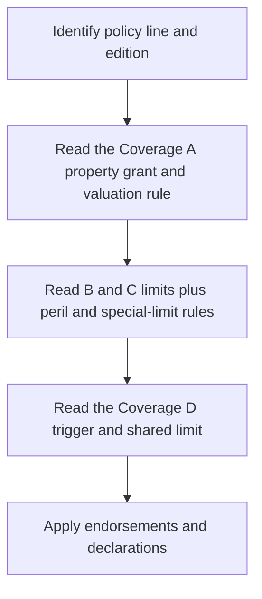

# Property Coverages A–D Across Policy Lines

This page compares the forms supplied in the repository, not an assumed ISO baseline. A percentage is a percentage of the Coverage A limit only when the cited edition says so. A form's declarations, deductible, state attachment, and endorsements still control the issued contract. The recurring claim-handling invariant is that the insured must protect property from further damage, preserve damaged property when reasonably possible, provide records, and allow inspection; the details vary by edition (for example, DP-3 2026 Coverage A duties at [I.A.22–I.A.25](repo://forms/DP/MS/DP-3/2026-01.md#L253-L273) and HO-6 2023 Coverage A duties at [I.A.12–I.A.18](repo://forms/HO/MS/HO-6/2023-02.md#L145-L159)).

*This decision flow shows the order for mapping a form's A–D architecture; it does not replace the issued declarations or attached endorsements.*

## Coverage A — Dwelling

### What Coverage A insures

Coverage A is building property, not a general promise to pay for every value associated with a residence. The normal boundary is the dwelling, permanently attached structures, fixtures, installed equipment, and qualifying materials and supplies; land is excluded. The policy line changes what “dwelling” means:

| Edition and form | Coverage A position, limit, and settlement | Important exclusions or boundaries |
|---|---|---|
| **DP-3 2012-11** | Covers the private-residence dwelling, attached structures, materials, alterations, fixtures, appliances, and installed equipment under the applicable declared limit (§ I.A.1–I.A.11). The form requires insurance of at least **80%** of replacement cost for replacement-cost settlement; otherwise the form pays ACV until repair or replacement (§ I.A.29–I.A.33). (Sources: [I.A.1–I.A.11](repo://forms/DP/MS/DP-3/2012-11.md#L71-L91), [I.A.29–I.A.33](repo://forms/DP/MS/DP-3/2012-11.md#L127-L135).) | Land, detached structures, earth movement, flood/surface water, below-ground water, and off-premises power failure are excluded in the cited provisions (§ I.A.8–I.A.9, I.A.19–I.A.22). (Source: [I.A.8–I.A.9, I.A.19–I.A.22](repo://forms/DP/MS/DP-3/2012-11.md#L85-L113).) |
| **DP-3 2020-08** | Covers the dwelling, attached structures, installed equipment, additions, decks/porches/patios, and structural components (§ I.A.1–I.A.9). This edition requires **90%** of full replacement cost, may pay ACV while work is incomplete, and pays the lesser of the limit, replacement cost, or necessary spend (§ I.A.16–I.A.20). (Sources: [I.A.1–I.A.9](repo://forms/DP/MS/DP-3/2020-08.md#L109-L139), [I.A.16–I.A.20](repo://forms/DP/MS/DP-3/2020-08.md#L139-L147).) | Land, wear/deterioration, settling, ordinance or law, earth movement, flood, sewer backup, below-ground water, pollutants, and governmental action are expressly excluded or limited (§ I.A.10–I.A.30). (Source: [I.A.10–I.A.30](repo://forms/DP/MS/DP-3/2020-08.md#L127-L167).) |
| **DP-3 2026-01** | Covers the dwelling, attached structures, permanently installed equipment, and qualifying materials (§ I.A.1–I.A.5). A.1 states that the most paid under Coverage A is **80%** and applies the policy's loss-settlement provisions; it does not use the earlier editions' “insured-to-value threshold” wording (§ I.A.1–I.A.5). (Sources: [I.A.1–I.A.5](repo://forms/DP/MS/DP-3/2026-01.md#L154-L182).) | Land, business property, ordinance or law, defective construction, wear, settling, water, and vacancy-related hazards are addressed in § I.A.6–I.A.15 and I.A.21–I.A.26. (Source: [I.A.6–I.A.15, I.A.21–I.A.26](repo://forms/DP/MS/DP-3/2026-01.md#L184-L228), [I.A.21–I.A.26](repo://forms/DP/MS/DP-3/2026-01.md#L253-L273).) |
| **HO-3 2011-05** | Covers the dwelling and attached structures. Replacement cost applies without depreciation when Coverage A is at least **80%** of full replacement cost; ACV may be paid pending repair/replacement (§ I.A.1–I.A.7). (Source: [I.A.1–I.A.7](repo://forms/HO/MS/HO-3/2011-05.md#L63-L77).) | The 2011 form excludes land, water damage, earth movement, ordinance/law increased cost, wear, settling, faulty construction, and several animal/pollution conditions, while preserving ensuing covered physical loss where stated (§ I.A.8–I.A.24). (Source: [I.A.8–I.A.24](repo://forms/HO/MS/HO-3/2011-05.md#L79-L111).) |
| **HO-3 2018-09** | Covers the dwelling, attached structures, materials, fixtures, installed equipment, and service property (§ I.A.1–I.A.4). The **80%** threshold controls replacement cost; if not met, the form settles at ACV, and it may pay ACV before completion (§ I.A.19–I.A.24). (Sources: [I.A.1–I.A.4](repo://forms/HO/MS/HO-3/2018-09.md#L99-L105), [I.A.19–I.A.24](repo://forms/HO/MS/HO-3/2018-09.md#L135-L147).) | Land, ordinance/law, defective planning or construction, wear, settling, pollution, vacancy/freeze, and theft/vandalism conditions are excluded or limited (§ I.A.5–I.A.18). (Source: [I.A.5–I.A.18](repo://forms/HO/MS/HO-3/2018-09.md#L107-L127).) |
| **HO-3 2024-03** | Covers the dwelling and attached structures, materials, fixtures, permanently installed machinery/equipment, and service property (§ I.A.1–I.A.4). It requires **80%** of full replacement cost; otherwise settlement is ACV until repair/replacement (§ I.A.19–I.A.26). (Sources: [I.A.1–I.A.4](repo://forms/HO/MS/HO-3/2024-03.md#L99-L105), [I.A.19–I.A.26](repo://forms/HO/MS/HO-3/2024-03.md#L135-L151).) | Land, business property, separate insurance, ordinance/law, defective construction, wear, settling, pollution, vacancy/freeze, and vacant-dwelling theft/vandalism are limited or excluded (§ I.A.5–I.A.15). (Source: [I.A.5–I.A.15](repo://forms/HO/MS/HO-3/2024-03.md#L107-L127).) |
| **HO-4 2013-07** | This renters form expressly says there is **no Coverage A** and no building-property replacement-cost or ACV settlement (§ I.A.17–I.A.36). The form nevertheless contains a Coverage B section for other structures; that section must not be mistaken for Coverage A. (Sources: [I.A.17–I.A.36](repo://forms/HO/MS/HO-4/2013-07.md#L101-L139), [I.B.1–I.B.3](repo://forms/HO/MS/HO-4/2013-07.md#L141-L149).) | No person’s ownership, mortgage, liability, or endorsement claim creates Coverage A unless the form expressly provides it in writing (§ I.A.31–I.A.36). (Source: [I.A.31–I.A.36](repo://forms/HO/MS/HO-4/2013-07.md#L129-L139).) |
| **HO-4 2021-10** | This edition likewise states that no insurance is provided for a building or structure under Coverage A (§ I.A.26–I.A.38). It therefore has no Coverage A replacement-cost threshold or building settlement basis. (Source: [I.A.26–I.A.38](repo://forms/HO/MS/HO-4/2021-10.md#L123-L147).) | The no-Coverage-A rule is explicit and cannot be created merely by an ownership interest or a claim for loss of use (§ I.A.32–I.A.38). (Source: [I.A.32–I.A.38](repo://forms/HO/MS/HO-4/2021-10.md#L135-L147).) |
| **HO-5 2015-01** | Covers the dwelling, attached structures, materials, fixtures, and equipment (§ I.A.1–I.A.4). Replacement cost applies at **80%** of full replacement cost; otherwise payment is capped at ACV until repair/replacement (§ I.A.5–I.A.7). (Sources: [I.A.1–I.A.4](repo://forms/HO/MS/HO-5/2015-01.md#L108-L116), [I.A.5–I.A.7](repo://forms/HO/MS/HO-5/2015-01.md#L116-L123).) | Land, ordinance/law, earth movement, water damage, sewer backup, pollutants, power failure away from the premises, and defective construction are excluded in the base Coverage A wording (§ I.A.8–I.A.32). (Source: [I.A.8–I.A.32](repo://forms/HO/MS/HO-5/2015-01.md#L123-L170).) |
| **HO-5 2022-06** | Covers the dwelling and attached property, materials, fixtures, and installed service equipment (§ I.A.1–I.A.5). Replacement cost requires **80%** of replacement cost; until completion the carrier may pay ACV (§ I.A.9–I.A.20). (Sources: [I.A.1–I.A.5](repo://forms/HO/MS/HO-5/2022-06.md#L109-L121), [I.A.9–I.A.20](repo://forms/HO/MS/HO-5/2022-06.md#L125-L147).) | Land, ordinance/law, earth movement, flood, sewer backup, below-ground water, pollutants, intentional loss, and governmental action are excluded or limited (§ I.A.6, I.A.21–I.A.30). (Source: [I.A.6, I.A.21–I.A.30](repo://forms/HO/MS/HO-5/2022-06.md#L119-L167).) |
| **HO-6 2014-04** | Coverage A is the condominium unit’s building property: alterations, fixtures, appliances, improvements, interior surfaces, and property for which the unit owner is responsible (§ I.A.1–I.A.9). Replacement cost requires **80%** of full replacement cost; otherwise the form pays ACV, with a default Coverage A limit of **$5,000** in this edition (§ I.A.19–I.A.34). (Sources: [I.A.1–I.A.9](repo://forms/HO/MS/HO-6/2014-04.md#L123-L141), [I.A.19–I.A.34](repo://forms/HO/MS/HO-6/2014-04.md#L159-L189).) | The owner’s common-element interest is covered only to the extent of legal responsibility or ownership interest; land is excluded (§ I.A.6–I.A.9). (Source: [I.A.6–I.A.9](repo://forms/HO/MS/HO-6/2014-04.md#L133-L141).) |
| **HO-6 2023-02** | Covers the unit, improvements, fixtures, appliances, materials, and qualifying property owned in common for which the unit owner is responsible (§ I.A.1–I.A.9). The **80%** condition controls replacement cost, ACV applies if it is unmet, and the stated default Coverage A limit is **$5,000** (§ I.A.19–I.A.34). (Sources: [I.A.1–I.A.9](repo://forms/HO/MS/HO-6/2023-02.md#L123-L143), [I.A.19–I.A.34](repo://forms/HO/MS/HO-6/2023-02.md#L159-L189).) | Coverage is limited to the owner’s interest or legal responsibility in common property; land and property not part of a building/structure are excluded (§ I.A.8–I.A.11). (Source: [I.A.8–I.A.11](repo://forms/HO/MS/HO-6/2023-02.md#L135-L143).) |

**HO-3 specified additional insurance endorsement.** HO 04 20 (2016-08) acts on the HO-3 Coverage A base rather than rewriting the property grant: it increases the Coverage A limit by the specified additional amount, applies only after the base Coverage A limit is exhausted, and expressly leaves causes of loss, valuation, exclusions, and limitations unchanged (§ W.0 and W.1). Thus it writes back to the base limit but preserves the base Coverage A settlement method and exclusions. (Compare the HO-3 2018 base’s 80%/ACV provisions at [I.A.19–I.A.24](repo://forms/HO/MS/HO-3/2018-09.md#L135-L147) with HO 04 20 [W.0–W.1](repo://forms/HO/MS/HO-04-20/2016-08.md#L13-L49) and its **25%** amount at [W.2](repo://forms/HO/MS/HO-04-20/2016-08.md#L133-L149).) The endorsement expressly does **not** increase personal property or loss-of-use limits (§ W.1.23–W.1.25). (Source: [W.1.23–W.1.25](repo://forms/HO/MS/HO-04-20/2016-08.md#L75-L83).)

**HO-6 special Coverage A endorsement.** HO 17 33 (2014-04) changes the HO-6 base Coverage A from the base’s covered-peril grant to a “risk of direct physical loss” grant subject to exclusions and limitations, and supplies a **$25,000** Coverage A limit. It therefore writes back to both the base grant and its default limit; it does not erase the endorsement’s listed exclusions or the policy deductible. (Compare base HO-6 2014 [I.A.1–I.A.18](repo://forms/HO/MS/HO-6/2014-04.md#L123-L159) with HO 17 33 [W.0–W.1](repo://forms/HO/MS/HO-17-33/2014-04.md#L13-L49) and [W.2.1–W.2.6](repo://forms/HO/MS/HO-17-33/2014-04.md#L137-L151).)

## Coverage B — Other Structures

Coverage B normally follows the “clear space” boundary: a detached structure or one connected only by a fence, utility line, or similar connection is an other structure; a structure physically attached beyond that boundary belongs in Coverage A. The most important controls are the percentage limit, rental/business use, land, and whether the form treats the limit as additional insurance.

| Edition and form | Grant and limit | Settlement and recurring exclusions |
|---|---|---|
| **DP-3 2012-11** | Covers other structures on the residence premises; the limit is **10% of Coverage A** and applies collectively (§ I.B.1–I.B.6). (Source: [I.B.1–I.B.6](repo://forms/DP/MS/DP-3/2012-11.md#L149-L159).) | Land, non-tenant rental use, business use, and business-property storage are excluded, with private-garage exceptions; the form pays according to applicable loss-settlement provisions (§ I.B.7–I.B.22). (Source: [I.B.7–I.B.22](repo://forms/DP/MS/DP-3/2012-11.md#L161-L191).) |
| **DP-3 2020-08** | Covers qualifying structures and materials at the residence premises; the limit is **10% of Coverage A** and is separate from the dwelling limit (§ I.B.1–I.B.4). (Source: [I.B.1–I.B.4](repo://forms/DP/MS/DP-3/2020-08.md#L185-L191).) | The form excludes land, non-tenant rental, business, agricultural/commercial use, and business storage, while allowing specified private-garage exceptions (§ I.B.7–I.B.18). (Source: [I.B.7–I.B.18](repo://forms/DP/MS/DP-3/2020-08.md#L197-L209).) |
| **DP-3 2026-01** | Covers other structures separated by clear space or connected only by a fence, utility line, or similar connection; the limit increases to **15% of Coverage A** (§ I.B.1–I.B.3). (Source: [I.B.1–I.B.3](repo://forms/DP/MS/DP-3/2026-01.md#L291-L306).) | Rental to a non-tenant, business, farming, lodging/dwelling use, land, and outdoor property are excluded or limited (§ I.B.7–I.B.19). (Sources: [I.B.7–I.B.19](repo://forms/DP/MS/DP-3/2026-01.md#L323-L368), [I.B.22–I.B.24](repo://forms/DP/MS/DP-3/2026-01.md#L392-L408).) |
| **HO-3 2011-05** | Covers structures on the residence premises separated by clear space; the limit is **10% of Coverage A** (§ I.B.1–I.B.6). (Source: [I.B.1–I.B.6](repo://forms/HO/MS/HO-3/2011-05.md#L139-L155).) | Business use, non-tenant rental, business-property storage, land, and outdoor property are excluded, with a private-garage exception (§ I.B.7–I.B.14). (Source: [I.B.7–I.B.14](repo://forms/HO/MS/HO-3/2011-05.md#L157-L175).) |
| **HO-3 2018-09** | The limit is **10% of Coverage A** and is additional insurance (§ I.B.1–I.B.2). (Source: [I.B.1–I.B.6](repo://forms/HO/MS/HO-3/2018-09.md#L163-L175).) | The form excludes land, business use, non-tenant rental, business storage, farming, and a detached structure used as a dwelling (§ I.B.4–I.B.11). (Source: [I.B.4–I.B.11](repo://forms/HO/MS/HO-3/2018-09.md#L171-L185).) |
| **HO-3 2024-03** | The limit is **10% of Coverage A** and is additional insurance (§ I.B.1–I.B.3). (Source: [I.B.1–I.B.3](repo://forms/HO/MS/HO-3/2024-03.md#L153-L169).) | The 2024 form excludes non-tenant rental, business, business storage, farming, dwelling use, land, and outdoor property (§ I.B.4–I.B.11). (Source: [I.B.4–I.B.11](repo://forms/HO/MS/HO-3/2024-03.md#L169-L177).) |
| **HO-4 2013-07** | The renters form has a Coverage B section covering direct physical loss to qualifying other structures on the residence premises, but the supplied § I.B text does **not state a Coverage B percentage**. The applicable limit must therefore be read from the issued policy/declarations rather than inferred from Coverage A, which does not exist in this form. (Source: [I.B.1–I.B.7](repo://forms/HO/MS/HO-4/2013-07.md#L141-L155).) | It excludes land, rental structures, non-insured residential use, business use, and related conditions (§ I.B.6–I.B.13). (Source: [I.B.6–I.B.13](repo://forms/HO/MS/HO-4/2013-07.md#L153-L167).) |
| **HO-4 2021-10** | Contains Coverage B for other structures and makes payment subject to its applicable limit, but the supplied § I.B text does **not state a percentage or a Coverage A-based limit** (§ I.B.1–I.B.33). (Source: [I.B.1–I.B.9](repo://forms/HO/MS/HO-4/2021-10.md#L149-L169), [I.B.29–I.B.33](repo://forms/HO/MS/HO-4/2021-10.md#L207-L215).) | Rental, business, farming, land, water-adjacent property, and ordinance/law exclusions apply; the base form expressly preserves the private-garage exception in the cited provisions (§ I.B.8–I.B.21). (Source: [I.B.8–I.B.21](repo://forms/HO/MS/HO-4/2021-10.md#L165-L191).) |
| **HO-5 2015-01** | Covers other structures on the residence premises; the limit is **10% of the dwelling limit** and does not increase Coverage A (§ I.B.1–I.B.6). (Source: [I.B.1–I.B.6](repo://forms/HO/MS/HO-5/2015-01.md#L186-L204).) | Appurtenance, land, rental, business, construction-condition, pollution, and governmental-action limits apply (§ I.B.7–I.B.25). (Source: [I.B.7–I.B.25](repo://forms/HO/MS/HO-5/2015-01.md#L204-L249).) |
| **HO-5 2022-06** | Covers qualifying other structures and materials; the limit is **10% of Coverage A** (§ I.B.1–I.B.7). (Source: [I.B.1–I.B.7](repo://forms/HO/MS/HO-5/2022-06.md#L183-L205).) | The form excludes business, non-tenant rental, land, outdoor property, farming/commercial use, and ordinance/law increased cost (§ I.B.8–I.B.19). (Source: [I.B.8–I.B.19](repo://forms/HO/MS/HO-5/2022-06.md#L205-L222).) |
| **HO-6 2014-04** | Covers the unit owner’s interest in a separate structure on the residence premises; no Coverage B percentage is stated in the supplied section, so the applicable declared limit controls (§ I.B.1–I.B.15). (Source: [I.B.1–I.B.15](repo://forms/HO/MS/HO-6/2014-04.md#L199-L229).) | It excludes land, rental use other than the private-garage exception, business use, common/association-owned structures, and personal property merely stored in the structure (§ I.B.5–I.B.15). (Source: [I.B.5–I.B.15](repo://forms/HO/MS/HO-6/2014-04.md#L209-L229).) |
| **HO-6 2023-02** | Covers other structures separated from the dwelling; no Coverage B percentage is stated in the supplied section, so use the applicable policy limit (§ I.B.1–I.B.15). (Source: [I.B.1–I.B.15](repo://forms/HO/MS/HO-6/2023-02.md#L199-L229).) | It excludes land, rental use other than private garages, business use, business storage, and agricultural/commercial use (§ I.B.6–I.B.18). (Source: [I.B.6–I.B.18](repo://forms/HO/MS/HO-6/2023-02.md#L219-L249).) |

**HO-3 rental-structure endorsement.** HO 04 40 (2011-05) is an acting document against the HO-3 2011 rental exclusion. The base excludes an other structure rented or held for rental to a non-tenant, while the endorsement expressly covers a covered rental structure on the residence premises and its attached fixtures/materials. It therefore writes back rental-structure coverage but preserves the base policy’s remaining terms and does not create liability or loss-of-use coverage. (Compare base [I.B.9–I.B.10](repo://forms/HO/MS/HO-3/2011-05.md#L157-L163) with HO 04 40 [W.0–W.1](repo://forms/HO/MS/HO-04-40/2011-05.md#L13-L65) and its $5,000 landlord-furnishings sublimit at [W.2](repo://forms/HO/MS/HO-04-40/2011-05.md#L141-L149).)

**HO-3 increased Other Structures limit.** HO 04 48 (2026-06) replaces—not merely supplements—the base HO-3 2024 Coverage B limit: the base says **10% of Coverage A**, while the endorsement says **20% of Coverage A**. The endorsement preserves the property definition, exclusions, duties, deductible, and other Coverage B terms. (Compare base [I.B.1–I.B.3](repo://forms/HO/MS/HO-3/2024-03.md#L153-L169) with HO 04 48 [W.0–W.1](repo://forms/HO/MS/HO-04-48/2026-06.md#L13-L49) and [W.2](repo://forms/HO/MS/HO-04-48/2026-06.md#L129-L157).)

## Coverage C — Personal Property

Coverage C follows the insured’s personal property rather than the building. The cross-line questions are: whether property is covered worldwide or only at the residence premises; whether the form uses named perils or a covered-risk/open-peril grant; whether special limits are inside the Coverage C limit; and whether the form promises replacement cost or leaves valuation to ACV/applicable loss-settlement provisions.

| Edition and form | Grant and limit | Settlement basis, special limits, and exclusions |
|---|---|---|
| **DP-3 2012-11** | Covers personal property owned or used by an insured anywhere in the world, but the form states a **0% of Coverage A** Coverage C limit (§ I.C.1–I.C.6). (Source: [I.C.1–I.C.6](repo://forms/DP/MS/DP-3/2012-11.md#L209-L223).) | It says ACV may be paid and applies the applicable limit; it excludes, among other things, separately insured property, animals, aircraft, vehicles, tenants’ property, and various valuable papers/business property (§ I.C.7–I.C.20). (Source: [I.C.7–I.C.20](repo://forms/DP/MS/DP-3/2012-11.md#L223-L251).) |
| **DP-3 2020-08** | Covers personal property at the residence premises or elsewhere and states a **0% of Coverage A** limit (§ I.C.1–I.C.9). (Source: [I.C.1–I.C.9](repo://forms/DP/MS/DP-3/2020-08.md#L231-L249).) | The form uses listed-peril wording for Coverage C (§ I.C.10–I.C.42), values property at ACV with depreciation where applicable, and applies special limits within the stated limit (§ I.C.44–I.C.49). (Sources: [I.C.10–I.C.42](repo://forms/DP/MS/DP-3/2020-08.md#L249-L301), [I.C.44–I.C.49](repo://forms/DP/MS/DP-3/2020-08.md#L319-L341).) |
| **DP-3 2026-01** | Covers personal property at the residence premises and in specified temporary or away-from-premises situations; the form states a **0% of Coverage A** limit (§ I.C.1–I.C.4). (Source: [I.C.1–I.C.4](repo://forms/DP/MS/DP-3/2026-01.md#L410-L430).) | The section describes covered personal-property categories and covered-peril conditions, but the cited edition does not provide the older forms' separate numeric special-limit schedule. It states that jewelry is subject to the Coverage C limit unless another limitation applies (§ I.C.10–I.C.28), and provides inventory, inspection, and settlement duties (§ I.C.55–I.C.58). (Sources: [I.C.10–I.C.28](repo://forms/DP/MS/DP-3/2026-01.md#L462-L545), [I.C.55–I.C.58](repo://forms/DP/MS/DP-3/2026-01.md#L675-L694).) |
| **HO-3 2011-05** | Covers personal property owned or used by an insured anywhere in the world; the limit is **50% of Coverage A**, subject to special limits (§ I.C.1–I.C.8). (Source: [I.C.1–I.C.8](repo://forms/HO/MS/HO-3/2011-05.md#L189-L205).) | The edition includes inside-limit special limits such as $200 money, $1,000 jewelry theft, $2,000 firearms theft, $1,000 watercraft, and $2,500 business property (§ I.C.22–I.C.43). (Source: [I.C.22–I.C.43](repo://forms/HO/MS/HO-3/2011-05.md#L233-L275).) |
| **HO-3 2018-09** | Covers personal property at the residence premises or elsewhere; the limit is **50% of Coverage A** (§ I.C.1–I.C.4). (Source: [I.C.1–I.C.4](repo://forms/HO/MS/HO-3/2018-09.md#L231-L239).) | It uses a named-peril list beginning with fire, windstorm, explosion, riot, aircraft, vehicle, smoke, vandalism, theft, falling objects, water discharge, freezing, electrical current, and volcanic eruption (§ I.C.13–I.C.28); special limits are inside Coverage C (§ I.C.5–I.C.12). (Sources: [I.C.5–I.C.12](repo://forms/HO/MS/HO-3/2018-09.md#L241-L255), [I.C.13–I.C.28](repo://forms/HO/MS/HO-3/2018-09.md#L257-L287).) |
| **HO-3 2024-03** | Covers personal property anywhere in the world; the limit is **50% of Coverage A** (§ I.C.1–I.C.3). (Source: [I.C.1–I.C.3](repo://forms/HO/MS/HO-3/2024-03.md#L219-L233).) | Special limits are inside Coverage C, including $300 money, $2,000 jewelry theft, $3,000 firearms theft, $1,500 watercraft, and $3,000 business property (§ I.C.9–I.C.18). Exclusions include separately insured property, illegal possession, business use, data, and property of non-insured occupants (§ I.C.19–I.C.39). (Sources: [I.C.9–I.C.18](repo://forms/HO/MS/HO-3/2024-03.md#L237-L255), [I.C.19–I.C.39](repo://forms/HO/MS/HO-3/2024-03.md#L257-L297).) |
| **HO-4 2013-07** | Covers personal property owned or used by an insured anywhere in the world; the supplied Coverage C section gives an applicable limit and special limits but does **not state a Coverage C percentage** (§ I.C.1–I.C.6). (Source: [I.C.1–I.C.6](repo://forms/HO/MS/HO-4/2013-07.md#L209-L223).) | The form’s special limits include $200 money, $1,500 jewelry theft, $2,000 firearms theft, $1,000 watercraft, $2,500 silverware theft, $2,500 business property, and $1,000 vehicle-installed electronics (§ I.C.14–I.C.22). (Source: [I.C.14–I.C.22](repo://forms/HO/MS/HO-4/2013-07.md#L235-L253).) |
| **HO-4 2021-10** | Covers personal property at the residence premises or anywhere in the world, including certain guest/employee and temporarily removed property, but the supplied section states only an applicable limit and does **not state a percentage** (§ I.C.1–I.C.13). (Source: [I.C.1–I.C.13](repo://forms/HO/MS/HO-4/2021-10.md#L217-L245).) | Special limits and exclusions are in § I.C.14 onward; the form applies a covered-peril grant and keeps special limits within the applicable limit (§ I.C.14–I.C.22). (Source: [I.C.14–I.C.22](repo://forms/HO/MS/HO-4/2021-10.md#L245-L263).) |
| **HO-5 2015-01** | Covers personal property anywhere in the world; the limit is **50% of Coverage A** (§ I.C.1–I.C.8). (Source: [I.C.1–I.C.8](repo://forms/HO/MS/HO-5/2015-01.md#L252-L269).) | The section supplies inside-limit special limits, ACV-aware inventory/valuation duties, and exclusions for separately insured property, animals, vehicles, tenants, data, water, earth movement, business property, and other listed causes (§ I.C.9–I.C.49). (Source: [I.C.9–I.C.49](repo://forms/HO/MS/HO-5/2015-01.md#L269-L347).) |
| **HO-5 2022-06** | Covers personal property anywhere in the world; the limit is **50% of Coverage A** (§ I.C.1–I.C.10). (Source: [I.C.1–I.C.10](repo://forms/HO/MS/HO-5/2022-06.md#L251-L271).) | The form uses a covered-risk grant unless excluded, and its special limits are inside Coverage C: for example $300 money, $3,000 jewelry theft, $3,500 firearms theft, $2,000 watercraft, $5,000 silverware theft, and $5,000 business property (§ I.C.26–I.C.32). (Source: [I.C.26–I.C.32](repo://forms/HO/MS/HO-5/2022-06.md#L309-L321).) |
| **HO-6 2014-04** | Covers personal property anywhere in the world and property temporarily away from the unit; the supplied section makes coverage subject to the applicable limit and special limits but does not state a Coverage C percentage in the cited section (§ I.C.1–I.C.6). (Source: [I.C.1–I.C.6](repo://forms/HO/MS/HO-6/2014-04.md#L251-L267).) | Special limits include $200 money, $1,500 jewelry theft, $2,000 firearms theft, $1,000 watercraft, $2,500 silverware theft, $2,500 business property, and $1,000 vehicle electronics (§ I.C.22–I.C.31). Valuation considers age, condition, usefulness, and depreciation (§ I.C.4–I.C.5). (Sources: [I.C.4–I.C.5](repo://forms/HO/MS/HO-6/2014-04.md#L255-L261), [I.C.22–I.C.31](repo://forms/HO/MS/HO-6/2014-04.md#L293-L311).) |
| **HO-6 2023-02** | Covers personal property worldwide and temporarily away; the supplied section gives an applicable limit and special limits but does **not state a Coverage C percentage** (§ I.C.1–I.C.9). (Source: [I.C.1–I.C.9](repo://forms/HO/MS/HO-6/2023-02.md#L251-L269).) | It values property at the time of loss, permits repair/replacement or payment, and applies special limits inside Coverage C (§ I.C.4–I.C.6, I.C.22). (Sources: [I.C.4–I.C.6](repo://forms/HO/MS/HO-6/2023-02.md#L255-L261), [I.C.22–I.C.30](repo://forms/HO/MS/HO-6/2023-02.md#L291-L309).) |

For scheduled, high-value, or business property, do not treat a special limit as a separate pot of insurance: the HO-3 2018 form says special limits are subject to Coverage C, and HO-5 2022 says the same for its listed categories. (Sources: [HO-3 2018 I.C.5–I.C.12](repo://forms/HO/MS/HO-3/2018-09.md#L241-L255), [HO-5 2022 I.C.9–I.C.18](repo://forms/HO/MS/HO-5/2022-06.md#L237-L287).)

## Coverage D — Loss of Use, Additional Living Expense, and Fair Rental Value

Coverage D is consequential property coverage: it responds only when a covered physical loss makes the residence, or a rented part of it, unfit or unavailable. Additional living expense (ALE) is the necessary increase above normal living costs; Fair Rental Value (FRV) is lost rent reduced by expenses that stop during unfitness. Civil-authority coverage generally requires a prohibition caused by covered damage to nearby property, not a recommendation or voluntary move.

| Edition and form | Limit and covered loss-of-use components | Time, valuation, and exclusions |
|---|---|---|
| **DP-3 2012-11** | Coverage D is titled **Fair Rental Value and E — Additional Living Expense**. FRV is available for a rented or held-for-rental part made unfit by a covered loss, with a **20% of Coverage A** FRV limit (§ I.D.1–I.D.6). ALE is separately described in § I.D.10–I.D.19. (Source: [I.D.1–I.D.19](repo://forms/DP/MS/DP-3/2012-11.md#L327-L365).) | FRV lasts while the part is unfit and excludes avoidable market/tenant loss; ALE is limited to the necessary increase and normal standard of living. The cited DP-3 architecture does not state a separate global ALE percentage in § I.D. (Source: [I.D.7–I.D.19](repo://forms/DP/MS/DP-3/2012-11.md#L341-L365).) |
| **DP-3 2020-08** | The same combined D/E architecture covers FRV and ALE. This edition states a **25% of Coverage A** limit specifically for FRV (§ I.D.1–I.D.15). (Source: [I.D.1–I.D.15](repo://forms/DP/MS/DP-3/2020-08.md#L397-L455).) | FRV is reduced by noncontinuing expenses and ends when the part is fit or available; ALE is reasonable, necessary, and tied to the unfit residence. The cited section does not state a separate global ALE percentage. (Source: [I.D.1–I.D.15](repo://forms/DP/MS/DP-3/2020-08.md#L397-L455).) |
| **DP-3 2026-01** | Coverage D has a **30% of Coverage A** aggregate limit and covers fair rental value and additional living expense in its combined D/E section (§ I.D.1–I.D.17). (Source: [I.D.1–I.D.17](repo://forms/DP/MS/DP-3/2026-01.md#L696-L735).) | FRV covers actual lost rental value while the rental part is unfit; ALE covers the necessary increase while the residence is unfit. Both end when the affected property is fit or use can reasonably resume, and the section requires mitigation and records (§ I.D.3–I.D.24). (Sources: [I.D.3–I.D.24](repo://forms/DP/MS/DP-3/2026-01.md#L730-L780), [I.D.11–I.D.24](repo://forms/DP/MS/DP-3/2026-01.md#L790-L840).) |
| **HO-3 2011-05** | Coverage D is **20% of Coverage A** and collectively covers ALE, FRV, and Prohibited Use (§ I.D.1–I.D.17). (Source: [I.D.1–I.D.17](repo://forms/HO/MS/HO-3/2011-05.md#L307-L341).) | ALE is the necessary increase to maintain normal living; FRV is lost rent less noncontinuing expenses; Prohibited Use requires a civil-authority prohibition caused by covered damage to neighboring premises (§ I.D.2–I.D.17). (Source: [I.D.2–I.D.17](repo://forms/HO/MS/HO-3/2011-05.md#L311-L341).) |
| **HO-3 2018-09** | Coverage D is **20% of the covered dwelling limit** and payments reduce the amount remaining (§ I.D.1–I.D.4). (Source: [I.D.1–I.D.4](repo://forms/HO/MS/HO-3/2018-09.md#L345-L355).) | It covers ALE, FRV, and civil authority loss only when directly caused by covered loss; it excludes ordinary expenses, voluntary relocation, tenant default, market demand, and delay within the insured’s control (§ I.D.5–I.D.24). (Source: [I.D.5–I.D.24](repo://forms/HO/MS/HO-3/2018-09.md#L355-L399).) |
| **HO-3 2024-03** | Coverage D is **20% of Coverage A** (§ I.D.1–I.D.3). (Source: [I.D.1–I.D.3](repo://forms/HO/MS/HO-3/2024-03.md#L361-L369).) | ALE and FRV require uninhabitability and direct causation; civil authority requires nearby covered damage and a prohibition. Payments stop when the premises is fit or access is restored (§ I.D.4–I.D.14). (Source: [I.D.4–I.D.14](repo://forms/HO/MS/HO-3/2024-03.md#L365-L389).) |
| **HO-4 2013-07** | Coverage D is **30% of the form’s stated Coverage A limit**, even though the same form says Coverage A is unavailable. It covers ALE, FRV, and civil authority loss (§ I.D.1–I.D.18). The percentage must therefore be read as the form’s literal position, not as proof that a building limit exists. (Source: [I.D.1–I.D.18](repo://forms/HO/MS/HO-4/2013-07.md#L325-L357).) | ALE is the necessary increase above normal living costs; FRV is rent less noncontinuing expenses; the civil-authority trigger requires a prohibition from covered nearby damage (§ I.D.4–I.D.18). (Source: [I.D.4–I.D.18](repo://forms/HO/MS/HO-4/2013-07.md#L333-L357).) |
| **HO-4 2021-10** | Coverage D is **40% of the Coverage A limit**, and payments for ALE, FRV, and civil authority share that limit (§ I.D.1–I.D.4). Because the edition separately provides no Coverage A, the percentage is an unresolved form dependency to be reconciled with the issued declarations/attachments. (Source: [I.D.1–I.D.4](repo://forms/HO/MS/HO-4/2021-10.md#L381-L401).) | It covers necessary increased living expenses and FRV only while the premises is unfit, and ends on fitness or permanent relocation; civil authority requires direct damage to nearby property (§ I.D.5–I.D.24). (Source: [I.D.5–I.D.24](repo://forms/HO/MS/HO-4/2021-10.md#L391-L429).) |
| **HO-5 2015-01** | Coverage D is **20% of Coverage A** and collectively funds all loss-of-use payments (§ I.D.1–I.D.4). (Source: [I.D.1–I.D.4](repo://forms/HO/MS/HO-5/2015-01.md#L368-L379).) | ALE, FRV, and civil authority are payable only for necessary, reasonable, directly caused loss and are reduced by payments under the same coverage (§ I.D.5–I.D.24). (Source: [I.D.5–I.D.24](repo://forms/HO/MS/HO-5/2015-01.md#L378-L416).) |
| **HO-5 2022-06** | Coverage D is **20% of Coverage A** (§ I.D.1–I.D.2). It covers ALE, FRV, and civil authority loss subject to that limit (§ I.D.3–I.D.22). (Sources: [I.D.1–I.D.2](repo://forms/HO/MS/HO-5/2022-06.md#L413-L423), [I.D.3–I.D.22](repo://forms/HO/MS/HO-5/2022-06.md#L419-L457).) | ALE is the necessary increase above ordinary living costs; FRV is lost rent less expenses that do not continue; both end when the affected property is fit, and mitigation/records are required (§ I.D.3–I.D.22). (Source: [I.D.3–I.D.22](repo://forms/HO/MS/HO-5/2022-06.md#L419-L457).) |
| **HO-6 2014-04** | Coverage D is **50% of Coverage A** (§ I.D.1–I.D.2). It covers ALE, FRV, and civil authority loss (§ I.D.3–I.D.31). (Source: [I.D.1–I.D.31](repo://forms/HO/MS/HO-6/2014-04.md#L365-L427).) | It requires a covered loss, unfitness, necessary increased expenses or actual lost rent, mitigation, and records; payments do not increase another coverage limit (§ I.D.3–I.D.31). (Source: [I.D.3–I.D.31](repo://forms/HO/MS/HO-6/2014-04.md#L371-L427).) |
| **HO-6 2023-02** | Coverage D is **50% of Coverage A** (§ I.D.1–I.D.2). It covers ALE, FRV, and civil authority loss (§ I.D.3–I.D.19). (Source: [I.D.1–I.D.19](repo://forms/HO/MS/HO-6/2023-02.md#L300-L338).) | ALE and FRV require unfitness caused by a covered loss, stop when the unit is fit, and exclude ordinary expenses, improvement, voluntary relocation, and delay; civil authority requires nearby covered damage and a prohibition (§ I.D.3–I.D.22). (Source: [I.D.3–I.D.22](repo://forms/HO/MS/HO-6/2023-02.md#L306-L344).) |

### Practical control points

1. **Do not carry a homeowner percentage into a renters, condominium, or dwelling-fire form without checking the edition.** HO-3 and HO-5 consistently show 50% Coverage C and 20% Coverage D in the cited editions, but the DP-3 editions in this set state 0% for Coverage C and change Coverage B/D treatment; HO-4 and HO-6 sections may leave a coverage limit to the declarations rather than state a percentage.
2. **Do not confuse the settlement basis with the coverage grant.** Coverage A commonly has an 80% replacement-cost condition, but DP-3 2020 uses 90%; HO-4 has no Coverage A at all. Replacement-cost endorsements or specified additional insurance can change the amount payable without making excluded property covered.
3. **Keep special limits inside the parent Coverage C limit unless the form says otherwise.** Scheduling or a separate endorsement is the normal route for jewelry, firearms, collectibles, watercraft, business property, and similar exposure; the base-form examples above expressly state that special limits do not increase Coverage C.
4. **Treat endorsements as control-flow documents.** First identify the base grant, limit, valuation rule, and exclusion; then apply the endorsement’s conflict rule. HO 04 20 increases only Coverage A, HO 04 40 writes back rental-structure coverage, HO 04 48 replaces the HO-3 Coverage B percentage, and HO 17 33 rewrites HO-6 Coverage A’s grant and limit. Each leaves other base provisions in force unless it expressly changes them.
