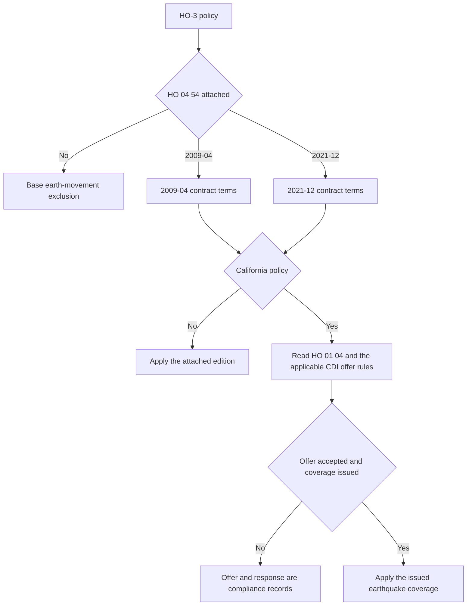

# Earthquake Coverage and California Offer Requirements

## Scope and the central distinction

The standard HO-3 form excludes loss caused by earth movement, including earthquake. HO 04 54 is the contract mechanism that changes that result when the endorsement is actually attached. An earthquake offer, notice, or declination is not itself earthquake coverage: the coverage grant comes from the policy and the attached endorsement, subject to its edition, limits, deductible, exclusions, and conditions.

*This flow separates the contract grant from California's offer-and-response process.*

The base HO-3 exclusion is in the 2024-03 form at [P.8](repo://forms/HO/MS/HO-3/2024-03.md#L557-L579). The two endorsement editions are [HO 04 54 2009-04](repo://forms/HO/MS/HO-04-54/2009-04.md#L1-L9) and [HO 04 54 2021-12](repo://forms/HO/MS/HO-04-54/2021-12.md#L1-L8).

## Edition control

Both forms are HO-3-line endorsements, and each applies only while attached to the insurance contract. Do not select an edition by the date of loss alone; verify the policy's effective date, the endorsement shown in the policy package, and any state amendment.

| Edition | Which policy it governs | Edition-specific anchor |
| --- | --- | --- |
| **2009-04** | Policies written under the 2009-04 endorsement. The source marks it superseded by 2021-12 for policies effective on or after 2021-12-01, while preserving it for policies written under the earlier edition. | Effective 2009-04-01; attachment, conflict, and period-of-coverage rules appear in W.0. |
| **2021-12** | Policies to which the 2021-12 endorsement is attached, effective 2021-12-01 and later unless the policy package identifies another applicable form. | The form applies only to loss involving an Earthquake and only while the attachment remains applicable. |

The 2009 form's supersession notice and attachment rules are at [W.0](repo://forms/HO/MS/HO-04-54/2009-04.md#L8-L55). The 2021 form's effective date and attachment rules are at [W.0](repo://forms/HO/MS/HO-04-54/2021-12.md#L1-L53). A renewal or change should not silently mix the grant, deductible, or conditions from the other edition.

## Contract grant: what the endorsement covers

### HO 04 54 2009-04

The 2009-04 grant is direct physical loss to covered property caused by an earthquake. Its earthquake definition includes shaking, trembling, displacement, land shock waves, tremors, and earth movement from natural geologic forces, including movement before, during, or after a volcanic eruption. Related earth shocks from the same movement are one earthquake loss.

The covered-property list includes the building, separated structures, personal property at the insured location, permanently installed equipment, repair materials and supplies, fixtures, improvements, and resulting physical damage when an earthquake damages a supporting foundation, wall, roof, floor, or ceiling. Falling, collapse, debris removal, and reasonable emergency measures are included when they directly result from the covered earthquake loss. See [2009-04 W.1](repo://forms/HO/MS/HO-04-54/2009-04.md#L57-L99).

The 2009-04 loss-settlement section permits repair, replacement, or actual-cash-value settlement, subject to the covered-property basis and the endorsement limit. Personal property is settled on a replacement-cost basis when coverage applies; like kind and quality, insurable interest, direct physical damage, and documentation still control. See [2009-04 W.7](repo://forms/HO/MS/HO-04-54/2009-04.md#L817-L899).

### HO 04 54 2021-12

The 2021-12 grant is direct physical loss to covered property caused by a sudden and accidental physical earthquake event. It expressly includes natural or artificial seismic forces, shaking, tremors, vibration, seismic waves, aftershocks, and related earth movement from the same event.

Its grant expressly reaches physical damage caused by earthquake-related subsidence, settlement, sinking, rising, shifting, cracking, or displacement of earth, and collapse of a building or structure when covered property is damaged. It enumerates the dwelling, other structures, personal property, property of others in the insured's care, fixtures, equipment, appliances, materials, improvements, foundations, retaining walls, drives, walks, patios, fences, underground lines, attached outdoor equipment, trees and plants when covered, and property temporarily removed or at a temporary location. It also covers certain ensuing or resulting direct physical losses, including fire, explosion, smoke, falling objects, accidental water or steam discharge, freezing, electrical injury, and power surge when the stated earthquake connection exists. See [2021-12 W.1](repo://forms/HO/MS/HO-04-54/2021-12.md#L55-L167).

The 2021-12 loss-settlement section applies the deductible after exclusions and limitations, uses replacement cost for covered personal property, permits an election to repair, rebuild, or replace, and keeps the payment subject to the endorsement limit. See [2021-12 W.7](repo://forms/HO/MS/HO-04-54/2021-12.md#L741-L817).

## Limits of liability

Neither edition supplies a numeric dollar amount in the form text. The applicable earthquake limit must therefore be taken from the policy's declarations, schedule, or filed endorsement package; it is not safe to infer it from Coverage A or from a California offer notice without checking the issued documents.

Both editions make the earthquake limit an aggregate ceiling for the earthquake occurrence. Multiple insureds, claims, damaged items, structures, or locations do not create extra limits, and payments reduce what remains. Covered expenses such as emergency measures and debris removal are within the limit rather than an automatic additional amount. The 2009-04 rules are at [W.2](repo://forms/HO/MS/HO-04-54/2009-04.md#L171-L245); the 2021-12 rules are at [W.2](repo://forms/HO/MS/HO-04-54/2021-12.md#L169-L243).

## Deductibles: do not blend editions

| Edition or overlay | Exact deductible rule | Occurrence treatment |
| --- | --- | --- |
| **2009-04** | **5% of the applicable limit for the dwelling.** If no dwelling limit applies, use the highest limit applying to property damaged by the earthquake. | One deductible for the earthquake occurrence; related continuing movement and separately reported claims from the same occurrence are combined. Separate occurrences get separate deductibles. |
| **2021-12** | **10% of the Coverage A limit of liability.** It applies to the total covered earthquake loss, whether real property, personal property, or both. | One deductible for related loss from the same earthquake, including damage at multiple locations or under multiple property coverages; it is not combined with another deductible. |
| **California state overlay** | HO 01 04 2021-06 states that the earthquake deductible is **15% of the applicable covered property value** and applies it to a covered earthquake loss. The 2022 CDI bulletin separately requires the offer to state a **15% seismic deductible of applicable covered loss**. | HO 01 04 treats damage from the same earthquake occurrence together. Confirm the issued California policy and filed offer package rather than carrying forward the 2009 or 2021 base percentage. |

The 2009-04 percentage and aggregation rules are [W.3](repo://forms/HO/MS/HO-04-54/2009-04.md#L247-L309). The 2021-12 percentage and aggregation rules are [W.3](repo://forms/HO/MS/HO-04-54/2021-12.md#L245-L307). The California contract overlay is [HO 01 04 T.8-T.10](repo://forms/HO/CA/HO-01-04/2021-06.md#L689-L709), and the 2022 offer disclosure requirement is [CDI-2022-03 B.2.7-B.2.11](repo://bulletins/CA/cdi-2022-03-earthquake-offer.md#L69-L81).

## Earth movement and other exclusions

The practical boundary is **earthquake-caused physical damage to covered property**, not every condition that can be described as earth movement.

* Under **2009-04**, the endorsement covers the defined earthquake loss but leaves other earth movement excluded, including volcanic eruption, landslide, mine subsidence, mudflow, and earth sinking, rising, or shifting. It also excludes settling, cracking, shrinking, bulging, or expansion of listed building and pavement components, land value, ordinary maintenance, preexisting conditions, and loss caused solely by flood, surface water, mudflow, or underground water. Its later exclusions specifically address post-earthquake deterioration, theft, vandalism, neglect, loss of use, and preexisting structural weakness. See [2009-04 W.4](repo://forms/HO/MS/HO-04-54/2009-04.md#L311-L481).
* Under **2021-12**, the grant expressly covers the listed earthquake-caused ground movement, but the exclusion section preserves a sharp distinction between that grant and non-earthquake movement. It excludes flood and surface water, overflow and below-ground water, land subsidence and sinkhole activity, landslide, mudslide, mudflow, debris flow, volcanic action, tsunami and wave action, ordinary settlement, construction and design defects, wear and deterioration, land and remediation costs, utility failures, post-loss delay or loss of use unless expressly covered, and many forms of preexisting, progressive, cosmetic, or unsupported damage. See [2021-12 W.4](repo://forms/HO/MS/HO-04-54/2021-12.md#L309-L499).

The 2021-12 W.4 grant and W.41 exclusion should be read together with the rest of the edition. In particular, the edition contains broad W.1-W.2 earth-movement exclusion language as well as the specific earthquake grant. A coverage decision should use the full issued endorsement and any applicable state amendment, not a shorthand rule that “all earth movement” is covered or excluded.

## Conditions and claim control points

These are claim conditions, not optional handling tips. They control whether the insurer can investigate cause and amount and whether payment is owed.

### 2009-04 conditions

The insured must report an earthquake loss within **90 days after it is discovered**, identify the property and location, protect property with reasonable temporary repairs, preserve damaged property, permit inspection, keep repair records, cooperate with investigation and examinations under oath, provide a sworn proof of loss when requested, distinguish prior from earthquake damage, disclose other insurance and interests, and preserve recovery rights. The conditions also require access to repair and valuation evidence and prohibit concealment, misrepresentation, intentional loss, and prejudicing subrogation. See [2009-04 W.5](repo://forms/HO/MS/HO-04-54/2009-04.md#L483-L691).

### 2021-12 conditions

The 2021-12 edition requires prompt notice and a report within **90 days after the loss occurs**, protection against further damage, records of temporary repairs, preservation of damaged property until inspection, cooperation, inventories, examination under oath, sworn proof of loss, information about prior repairs and other insurance, and preservation of evidence and recovery rights. It bars permanent repair, replacement, alteration, or disposal before a reasonable inspection opportunity except for emergency action. The conditions state that coverage denial for noncompliance is limited by applicable law and material prejudice. See [2021-12 W.5](repo://forms/HO/MS/HO-04-54/2021-12.md#L501-L651) and [Special Requirements](repo://forms/HO/MS/HO-04-54/2021-12.md#L653-L739).

A safe first notice of loss should capture the date and location, sequence of shaking and damage, affected property, apparent ground movement, water or fire involvement, preexisting damage, emergency measures, and the state and edition shown in the policy package. Do not promise payment before the applicable endorsement, deductible, limit, exclusions, and evidence have been reviewed.

## California state overlay: offer and disclosure are separate from coverage

### Contract overlay

The California HO 01 04 amendatory endorsement applies to property and interests located in California, controls when it conflicts with otherwise applicable insurance, and otherwise makes the provisions operate together under California law. Its scope and precedence are at [T.0](repo://forms/HO/CA/HO-01-04/2021-06.md#L13-L43).

For the earthquake position, HO 01 04 states the 15% earthquake deductible, treats earthquake loss as earth movement subject to earthquake coverage, and groups damage arising from the same earthquake occurrence. It also states a 100% insured-to-value condition for replacement-cost settlement of a covered building. These are contract-overlay terms, not merely marketing disclosures. See [T.8 T.7-T.19](repo://forms/HO/CA/HO-01-04/2021-06.md#L689-L729).

### Regulator offer and disclosure overlay

The California Department of Insurance bulletin governs the insurer's transaction and communications obligation. It does **not** turn an unendorsed HO-3 policy into earthquake coverage.

* **CDI-2014-06** was effective 2014-06-30 and is marked superseded by CDI-2022-03 for policies effective on or after 2022-03-14. Under the earlier edition, an admitted insurer offering residential property insurance in California had to make a clear, separate earthquake offer, describe material coverages and limitations, disclose a **10% seismic deductible**, provide a reasonable acceptance method, and preserve offer and response records. See [2014 B.1-B.2](repo://bulletins/CA/cdi-2014-06-earthquake-offer.md#L13-L57) and [B.2](repo://bulletins/CA/cdi-2014-06-earthquake-offer.md#L59-L111).
* **CDI-2022-03** is effective 2022-03-14. It requires an offer when issuing or renewing eligible residential property insurance, in clear written form or electronically with consent. The offer must identify the insurer and related policy, property, limits, premium or rating basis, material exclusions, conditions, and the **15% seismic deductible**. Acceptance must be affirmative; silence is not acceptance. Acceptance and declination must be confirmed and retained, and eligibility decisions must be supported by records. See [B.2](repo://bulletins/CA/cdi-2022-03-earthquake-offer.md#L59-L129).

The 2022 notice rules require a clear and conspicuous written offer, a statement that earthquake damage may not be covered by the residential property policy unless purchased, a way to request coverage, material limitations and deductible information, and a meaningful opportunity to consider the offer. The insurer must not treat silence as acceptance, must not treat a request for information as a declination, and must retain evidence of the offer and response. See [B.3](repo://bulletins/CA/cdi-2022-03-earthquake-offer.md#L181-L251).

The operational boundary is therefore:

1. **Identify eligibility and applicable versions.** Use the California state exception and filed underwriting rules; do not suppress an offer because acceptance seems unlikely.
2. **Present and explain the offer.** Keep it separate from the underlying policy, state the material terms, and distinguish the offer from coverage already in force.
3. **Record the response.** Record delivery, recipient, edition or material used, acceptance, declination, or ineligibility basis. Silence does not authorize issuance.
4. **Issue or decline consistently.** If accepted, issue documentation that matches the accepted offer and the attached contract terms. If declined, preserve the written declination and do not describe the underlying policy as covering earthquake.
5. **Maintain the filed control.** The 2022 bulletin requires filing of the forms, endorsements, notices, applications, elections, and related materials used for the offer, and keeps the insurer responsible when a producer, vendor, or other person performs the work. See [B.5](repo://bulletins/CA/cdi-2022-03-earthquake-offer.md#L315-L347).

## Focused verification checklist

For underwriting, policy assembly, service, and claim review, verify these items rather than relying on a generic “earthquake covered” flag:

- Is HO 04 54 attached, and is its edition 2009-04 or 2021-12?
- What effective date and state attachment govern the transaction?
- What earthquake limit is shown in the issued declarations or schedule, and does it include covered expenses within the aggregate limit?
- Which deductible rule applies: 2009-04 5%, 2021-12 10%, or the California overlay and filed offer terms?
- Is the reported movement an earthquake under the edition, or another excluded movement, water event, land condition, defect, or progressive condition?
- Is there direct physical damage to covered property, and can the insured distinguish it from prior damage and maintenance?
- Were notice, protection, inspection, documentation, sworn proof, and other edition-specific conditions satisfied?
- For California, can the insurer produce the correct bulletin-era offer, disclosure, affirmative response or declination, eligibility basis, and issued coverage document?

### Source map

- Contract grant and edition: `forms/HO/MS/HO-04-54/2009-04.md` and `forms/HO/MS/HO-04-54/2021-12.md`
- California contract amendment: `forms/HO/CA/HO-01-04/2021-06.md`
- California offer rules: `bulletins/CA/cdi-2014-06-earthquake-offer.md` and `bulletins/CA/cdi-2022-03-earthquake-offer.md`
- Underlying HO-3 earth-movement exclusion: `forms/HO/MS/HO-3/2024-03.md`
- Related coverage and assembly context: `/openwiki/coverage/forms/ho-3.md`, `/openwiki/policy-assembly/editions-and-state-attachments.md`, `/openwiki/state-overlays/california.md`
