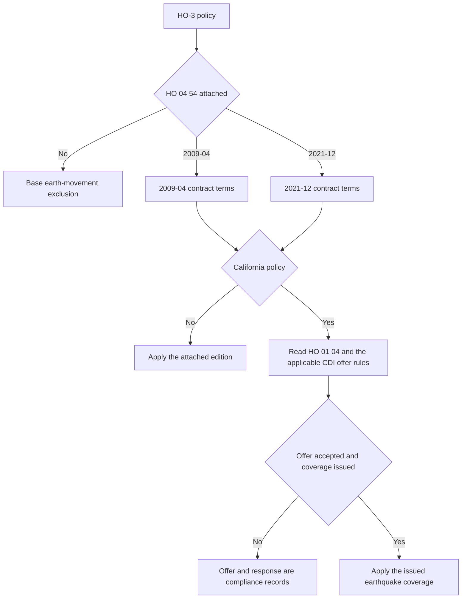

# Earthquake Coverage and California Offer Requirements

## Scope and the central distinction

The standard HO-3 form excludes loss caused by earth movement, including earthquake. HO 04 54 is the contract mechanism that changes that result when the endorsement is actually attached. An earthquake offer, notice, or declination is not itself earthquake coverage: the coverage grant comes from the policy and attached endorsement, subject to the applicable edition, limits, deductible, exclusions, and conditions.

*This flow separates the contract grant from California’s offer-and-response process.*

The underlying HO-3 earth-movement exclusion appears at [P.8](repo://forms/HO/MS/HO-3/2024-03.md#L579-L601). The relevant earthquake endorsements are [HO 04 54 2009-04](repo://forms/HO/MS/HO-04-54/2009-04.md#L1-L9) and [HO 04 54 2021-12](repo://forms/HO/MS/HO-04-54/2021-12.md#L1-L33).

Three roles must remain separate:

- **Contract:** the issued policy, attached HO 04 54 edition, declarations, and applicable state form determine whether a loss is covered and how payment is calculated.
- **California transaction compliance:** the applicable CDI bulletin controls the mandatory offer, disclosure, response, filing, and records process. It does not amend an unendorsed policy into earthquake coverage; the offer must identify that earthquake damage may not be covered unless purchased ([CDI-2022-03 B.3.5](repo://bulletins/CA/cdi-2022-03-earthquake-offer.md#L373-L379)), while the endorsement applies only when attached ([HO 04 54 W.0](repo://forms/HO/MS/HO-04-54/2021-12.md#L13-L39)).
- **Internal underwriting:** carrier guidance controls eligibility, authority, referral, and file documentation. It is not a coverage grant or a claims determination.

## Edition control

Both forms are HO-3-line endorsements, and each applies only while attached to the insurance contract. Do not select an edition by the date of loss alone; verify the policy effective date, the endorsement shown in the policy package, and any applicable state amendment.

| Edition | Applicability and transition | Important control |
| --- | --- | --- |
| **2009-04** | Effective 2009-04-01. The source marks it superseded by 2021-12 for policies effective on or after 2021-12-01, while preserving it for policies written under the earlier edition. | Its terms apply only while attached; its grant, five-percent deductible wording, exclusions, and conditions must not be mixed with 2021-12. |
| **2021-12** | Effective 2021-12-01. It applies only to loss involving an Earthquake and only while the attached form remains applicable to the policy package. | Confirm that this is the edition attached to the issued contract before applying its grant, ten-percent deductible wording, exclusions, or conditions. |

The 2009 supersession and attachment rules are at [W.0](repo://forms/HO/MS/HO-04-54/2009-04.md#L8-L55). The 2021 effective date and attachment rules are at [W.0](repo://forms/HO/MS/HO-04-54/2021-12.md#L1-L55). A renewal or change should not silently mix the grant, deductible, limit, or conditions from the other edition.

## Contract grant: what the endorsement covers

### HO 04 54 2009-04

The 2009-04 grant covers direct physical loss to covered property caused by an earthquake. Its definition includes shaking, trembling, displacement, land shock waves, tremors, and earth movement from natural geologic forces, including movement before, during, or after a volcanic eruption. Related earth shocks from the same movement are treated as one earthquake loss.

The covered-property provisions reach buildings, separated structures, personal property at the insured location, permanently installed equipment, materials and supplies, fixtures, improvements, and physical damage resulting when an earthquake damages a supporting foundation, wall, roof, floor, or ceiling. Falling, collapse, debris removal, and reasonable emergency measures are included when they directly result from the covered earthquake loss. See [2009-04 W.1](repo://forms/HO/MS/HO-04-54/2009-04.md#L57-L99).

The 2009 settlement provisions permit repair, replacement, or actual-cash-value treatment according to the covered property and applicable policy terms. They do not eliminate the endorsement limit, deductible, exclusions, or proof requirements. See [2009-04 W.1 and W.5-W.7](repo://forms/HO/MS/HO-04-54/2009-04.md#L119-L159) and [loss settlement](repo://forms/HO/MS/HO-04-54/2009-04.md#L817-L899).

### HO 04 54 2021-12

The 2021-12 grant covers direct physical loss to covered property caused by a sudden and accidental physical earthquake event. It expressly includes natural or artificial seismic forces, shaking, tremors, vibration, seismic waves, aftershocks, and related earth movement from the same event.

It expressly reaches physical damage caused by earthquake-related subsidence, settlement, sinking, rising, shifting, cracking, or displacement of earth, and collapse of a building or structure when covered property is damaged. The enumerated property includes the dwelling, other structures, personal property, property of others in the insured’s care, fixtures, equipment, appliances, materials, improvements, foundations, retaining walls, drives, walks, patios, fences, underground lines, attached outdoor equipment, trees and plants when covered, and property temporarily removed or at a temporary location. Specified ensuing direct physical losses include fire, explosion, smoke, falling objects, accidental water or steam discharge, freezing, electrical injury, and power surge when the stated earthquake connection exists. See [2021-12 W.1](repo://forms/HO/MS/HO-04-54/2021-12.md#L80-L225).

The 2021-12 settlement provisions apply the deductible after the covered loss is determined, use the applicable valuation terms, and keep payment subject to the applicable limit. See [2021-12 loss settlement](repo://forms/HO/MS/HO-04-54/2021-12.md#L1480-L1535).

## Limits of liability

Neither edition supplies a numeric dollar amount for the earthquake limit in the form text. The applicable amount must be taken from the declarations, schedule, or filed endorsement package; it is not safe to infer it from Coverage A or from a California offer notice.

Both editions prevent the number of insureds, claims, or damaged items from creating extra payment under the same applicable limit, and payments reduce what remains for the covered loss. Covered expenses are not automatically additional insurance. In the 2009 edition, costs based on covered damage, including debris removal and protective expenses, are included within the applicable limit ([W.2](repo://forms/HO/MS/HO-04-54/2009-04.md#L171-L229)). In the 2021 edition, the applicable limit is applied to the relevant property and covered loss, does not increase for separate premises, insureds, claims, or items, and includes covered debris removal under the affected property limit ([W.2](repo://forms/HO/MS/HO-04-54/2021-12.md#L297-L346), [W.2 continuation](repo://forms/HO/MS/HO-04-54/2021-12.md#L441-L480)).

Do not describe the two forms as creating one universal limit across every property coverage without checking the policy. The 2021 text distinguishes limits for residence premises, other structures, personal property, and property away from the residence premises, while still preventing an occurrence from generating duplicate limits. The policy’s specific limits and any additional-insurance provisions control.

## Deductibles: do not blend editions

| Edition or overlay | What the supplied wording says | Operational consequence |
| --- | --- | --- |
| **2009-04** | The earthquake deductible is **5%** of covered earthquake loss. The W.3 provision says the covered loss is determined first and applies the deductible to dwelling, other structures, personal property, and loss involving more than one class of covered property. The supplied W.3 text does **not** state a dwelling-limit or “highest applicable limit” basis. | Use the issued policy and schedule for the calculation basis. Related shocks are treated as one earthquake loss in W.1, and W.3 applies to a covered earthquake occurrence, but do not import a separate-per-occurrence or dwelling-limit rule that is not stated in the supplied edition. See [2009-04 W.1](repo://forms/HO/MS/HO-04-54/2009-04.md#L57-L65) and [W.3](repo://forms/HO/MS/HO-04-54/2009-04.md#L263-L317). |
| **2021-12** | The applicable earthquake deductible percentage is **10%**. It is applied to covered Earthquake loss before payment, regardless of the number of damaged items, after exclusions and other coverage terms are applied. The supplied W.3 text does **not** state a Coverage A basis or a single aggregate across every property class. | Apply the deductible to the covered loss determined under the issued policy and endorsement. A loss at multiple property types or locations still requires analysis of the applicable limits and coverage provisions; the form does not authorize treating excluded loss as part of the deductible base. See [2021-12 W.2](repo://forms/HO/MS/HO-04-54/2021-12.md#L297-L480) and [W.3](repo://forms/HO/MS/HO-04-54/2021-12.md#L482-L555). |
| **California contract overlay** | HO 01 04 2021-06 states that the earthquake deductible is **15% of the applicable covered property value** and applies it to a covered earthquake loss. It also treats damage arising from the same earthquake occurrence together. | This is a California contract term when the form applies. Reconcile it with the issued declarations and filed offer package rather than carrying forward the 2009 or 2021 multistate percentage. See [HO 01 04 T.8-T.10](repo://forms/HO/CA/HO-01-04/2021-06.md#L689-L709). |
| **California offer disclosure** | CDI-2022-03 requires the offer to state a **15% seismic deductible of applicable covered loss** and explain its application. | This is a disclosure requirement for the offer, not a substitute for the attached contract wording. See [CDI-2022-03 B.2.7-B.2.12](repo://bulletins/CA/cdi-2022-03-earthquake-offer.md#L134-L159). |

A deductible never creates coverage for excluded property or excluded causes. The 2021 form expressly says the deductible is applied only after the covered loss is determined and does not convert excluded loss into covered loss ([W.3](repo://forms/HO/MS/HO-04-54/2021-12.md#L516-L522)).

## Earth movement and other exclusions

The practical boundary is earthquake-caused direct physical damage to covered property, not every condition that can be described as earth movement.

- **2009-04:** the endorsement covers the defined earthquake loss but leaves other earth movement excluded, including volcanic eruption, landslide, mine subsidence, mudflow, and earth sinking, rising, or shifting. It also excludes settling, cracking, shrinking, bulging, or expansion of listed building and pavement components, land value, ordinary maintenance, preexisting conditions, and loss caused solely by flood, surface water, mudflow, or underground water. Later exclusions address post-earthquake deterioration, theft, vandalism, neglect, loss of use, and preexisting structural weakness. See [2009-04 W.4](repo://forms/HO/MS/HO-04-54/2009-04.md#L351-L481) and [W.4 continuation](repo://forms/HO/MS/HO-04-54/2009-04.md#L455-L521).
- **2021-12:** the form contains an important textual tension. W.1 grants earthquake coverage and W.1-W.4 describe earthquake-caused movement and resulting damage, but W.4 W.1-W.2 broadly say that earthquake loss caused by earth movement and earth movement including shaking, tremors, aftershocks, or shifting is excluded. That language must be read in the full issued form and any applicable state amendment; it should not be reduced to the shorthand that all earth movement is either covered or excluded. See [grant](repo://forms/HO/MS/HO-04-54/2021-12.md#L80-L97) and [W.4 W.1-W.3](repo://forms/HO/MS/HO-04-54/2021-12.md#L632-L645).

The 2021 exclusions also expressly address flood and surface water, water below ground, overflow and sewer or sump discharge, land subsidence and sinkhole activity, landslide, mudslide, mudflow, debris flow, volcanic and wave events, ordinary settlement, defects, wear and deterioration, land and remediation costs, utility failures, progressive or preexisting damage, unsupported estimates, and consequential loss. See [2021-12 W.4](repo://forms/HO/MS/HO-04-54/2021-12.md#L647-L738) and [W.4 continuation](repo://forms/HO/MS/HO-04-54/2021-12.md#L1006-L1030).

## Conditions and claim control points

These are contract conditions, not optional handling tips. They control the evidence available to investigate cause and amount and may affect payment subject to the applicable law and form.

### 2009-04 conditions

The insured must give prompt notice and notice within **90 days after discovery**, identify the property and location, protect property with reasonable temporary repairs, preserve damaged property, permit inspection, keep repair records, cooperate with investigation and examinations under oath, provide a signed or sworn proof when requested, distinguish prior from earthquake damage, disclose other insurance and interests, and preserve recovery rights. See [2009-04 W.5](repo://forms/HO/MS/HO-04-54/2009-04.md#L523-L621) and [continuation](repo://forms/HO/MS/HO-04-54/2009-04.md#L657-L723).

### 2021-12 conditions

The 2021-12 edition requires prompt notice and a report within **90 days after the loss occurs**, protection against further damage, records of temporary repairs, preservation of damaged property until inspection except for emergency action, cooperation, inventories, examination under oath, sworn proof of loss, information about prior repairs and other insurance, and preservation of evidence and recovery rights. It bars permanent repair, replacement, alteration, or disposal before a reasonable inspection opportunity except for emergency measures. The conditions state that denial for noncompliance is limited by applicable law and material prejudice. See [2021-12 W.5](repo://forms/HO/MS/HO-04-54/2021-12.md#L1032-L1093) and [conditions continuation](repo://forms/HO/MS/HO-04-54/2021-12.md#L1095-L1165).

A safe first notice of loss should capture the date and location, sequence of shaking and damage, affected property, apparent ground movement, water or fire involvement, preexisting damage, emergency measures, and the state and edition shown in the policy package. Do not promise payment before the applicable endorsement, deductible, limit, exclusions, and evidence have been reviewed.

## California state overlay: contract, offer, and claims layers

### California contract overlay

The California HO 01 04 amendatory endorsement applies to property and interests located in California, controls when it conflicts with otherwise applicable insurance, and otherwise makes the provisions operate together under California law. Its scope and precedence are at [T.0](repo://forms/HO/CA/HO-01-04/2021-06.md#L13-L29).

For earthquake, HO 01 04 states the 15% deductible, treats earthquake loss as earth movement subject to earthquake coverage, and groups damage arising from the same earthquake occurrence. It also states a 100% insured-to-value condition for replacement-cost settlement of a covered building. These are contract-overlay terms, not merely marketing disclosures. See [HO 01 04 T.8](repo://forms/HO/CA/HO-01-04/2021-06.md#L689-L729).

HO 01 04 does not replace the separate earthquake endorsement. Confirm that HO 04 54 is attached and identify its edition before applying coverage, limit, deductible, exclusion, or claim-condition language.

### CDI-2014-06: earlier bulletin position

CDI-2014-06 was effective 2014-06-30 and is marked superseded by CDI-2022-03 for policies effective on or after 2022-03-14; it remains relevant to policies written under its position. For its transactions, an admitted insurer offering or issuing California residential property insurance had to make a clear, separate, verifiable earthquake offer, explain material coverages and limitations, disclose a **10% seismic deductible**, provide reasonable acceptance and declination methods, and preserve offer and response records. The offer had to distinguish earthquake coverage from the underlying policy and not be suppressed because acceptance seemed unlikely. See [metadata](repo://bulletins/CA/cdi-2014-06-earthquake-offer.md#L1-L9), [B.1](repo://bulletins/CA/cdi-2014-06-earthquake-offer.md#L13-L60), [B.2](repo://bulletins/CA/cdi-2014-06-earthquake-offer.md#L113-L205), and [B.3](repo://bulletins/CA/cdi-2014-06-earthquake-offer.md#L367-L491).

The earlier bulletin also required claims procedures for prompt, fair, and equitable handling, reasonable investigation, qualified personnel, written decisions identifying policy provisions and the basis for the decision, distinction between covered and noncovered damage, payment of undisputed covered amounts, and claim records. See [CDI-2014-06 B.4](repo://bulletins/CA/cdi-2014-06-earthquake-offer.md#L535-L624).

### CDI-2022-03: current offer and disclosure controls

CDI-2022-03 is effective 2022-03-14. It requires an earthquake offer when issuing or renewing eligible residential property insurance. The offer must be written, or electronic with consent, and must identify the insurer and related policy, property, limits, material terms, exclusions, conditions, premium or rating basis, and the **15% seismic deductible of applicable covered loss**. Acceptance must be affirmative; silence is not acceptance. Acceptance and declination must be confirmed and retained, and the underwriting basis for ineligibility must be preserved. Coverage is issued only after the required acceptance and premium arrangement, with documentation consistent with the offer. See [B.1-B.2](repo://bulletins/CA/cdi-2022-03-earthquake-offer.md#L16-L59), [B.2](repo://bulletins/CA/cdi-2022-03-earthquake-offer.md#L106-L226), and [B.2.38-B.2.39](repo://bulletins/CA/cdi-2022-03-earthquake-offer.md#L262-L267).

The notice must state that earthquake damage may not be covered by the residential property policy unless earthquake coverage is purchased, explain how to request coverage, identify material limitations and deductibles, disclose underwriting requirements and separate premium when applicable, identify the issuing entity, and be provided early enough to give a **meaningful opportunity to consider the offer**. Silence is not affirmative acceptance, and a request for information is not a declination. See [B.3](repo://bulletins/CA/cdi-2022-03-earthquake-offer.md#L356-L461).

The 2022 bulletin also requires prompt acknowledgment and reasonable investigation of earthquake claims, clear communications, relevant evidence requests, written explanations for denials or limitations, payment of covered amounts without unreasonable delay after the amount is determined, consideration of alternative evidence when records are unavailable through no fault of the claimant, supplemental-information opportunities, catastrophe-claim supervision, and claim records. See [B.4](repo://bulletins/CA/cdi-2022-03-earthquake-offer.md#L517-L635).

Before use, the insurer must file the forms, endorsements, notices, offers, applications, elections, rejection or acknowledgment documents, and related materials. Unfiled or superseded materials may not be used, effective filings must be applied consistently, and the insurer remains responsible when a producer, vendor, or other person prepares, delivers, or administers the offer. See [B.5](repo://bulletins/CA/cdi-2022-03-earthquake-offer.md#L637-L704).

### Transaction sequence

1. Identify the policy effective date, California applicability, applicable bulletin position, HO 01 04 attachment, and HO 04 54 edition.
2. Make the required clear offer and disclosure separately from the underlying homeowners policy. State the material terms, limit, premium or rating basis, exclusions, conditions, and applicable deductible.
3. Obtain and record affirmative acceptance before issuing earthquake coverage under the 2022 position. Record delivery, response, declination, or the documented eligibility basis.
4. Assemble the issued contract so the California form, earthquake endorsement, declarations, limits, and deductible match the filed offer and accepted terms.
5. For a claim, apply the issued contract first, then document the facts, causation, covered property, deductible basis, limits, conditions, and applicable CDI claims standards.

### Internal underwriting handoff

Internal guidance is not regulatory text and does not change the policy. The underwriting manual requires review of risk location and construction characteristics and the quake deductible before completing an earthquake-related attachment ([Rule 400.AH](repo://manuals/underwriting/manual.md#L5289-L5293)); it prohibits altering, waiving, or negotiating the quake deductible without authorized direction ([Rule 520.AB](repo://manuals/underwriting/manual.md#L6741-L6745)); and it requires a complete file recording facts, sources, analysis, and authority action for referrals, exceptions, and adverse decisions ([Rule 520.AT](repo://manuals/underwriting/manual.md#L6849-L6853). The California appetite guide likewise describes itself as internal guidance that does not alter insuring agreements, exclusions, conditions, or endorsements ([H.0.1-H.0.6](repo://guidelines/appetite/ca-homeowners.md#L16-L40)).

Accordingly, an underwriter may refer, approve, decline, or require evidence under internal authority, but may not turn an appetite rule into a contract exclusion, change a stated deductible without authority, or treat an underwriting referral as a coverage decision.

## Focused verification checklist

For underwriting, policy assembly, service, and claim review, verify these items rather than relying on a generic “earthquake covered” flag:

- Is HO 04 54 attached, and is its edition 2009-04 or 2021-12?
- What effective date, state attachment, and policy package govern the transaction?
- What earthquake limit or limits are shown in the issued declarations or schedule, and are covered expenses subject to those limits?
- Which deductible rule applies: 2009-04 5%, 2021-12 10%, or the California contract and filed-offer overlay?
- Is the reported movement an earthquake under the applicable edition, or another excluded movement, water event, land condition, defect, or progressive condition? For 2021-12, has the internal tension between the grant and W.4 earth-movement language been escalated rather than simplified?
- Is there direct physical damage to covered property, and can the insured distinguish it from prior damage, maintenance, deterioration, and unsupported consequential loss?
- Were notice, protection, inspection, documentation, sworn proof, and other edition-specific conditions satisfied?
- For California, can the insurer produce the correct bulletin-era offer, disclosure, affirmative response or declination, eligibility basis, filed material, and issued coverage document?
- Are internal underwriting evidence and authority records kept separate from the policy and claim coverage analysis?

### Source map

- Contract grant, limits, deductibles, exclusions, and conditions: `forms/HO/MS/HO-04-54/2009-04.md` and `forms/HO/MS/HO-04-54/2021-12.md`
- California contract amendment: `forms/HO/CA/HO-01-04/2021-06.md`
- California offer and claims rules: `bulletins/CA/cdi-2014-06-earthquake-offer.md` and `bulletins/CA/cdi-2022-03-earthquake-offer.md`
- Underlying HO-3 earth-movement exclusion: `forms/HO/MS/HO-3/2024-03.md`
- Internal authority and appetite boundary: `manuals/underwriting/manual.md` and `guidelines/appetite/ca-homeowners.md`
- Related wiki context: `/openwiki/coverage/parts/property-a-d.md`, `/openwiki/state-overlays/california.md`, and `/openwiki/underwriting/guidelines/california-appetite.md`
