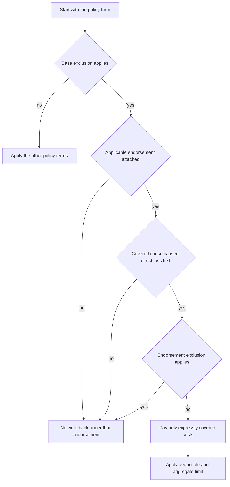

# Fungi, Wet Rot, Dry Rot, and Bacteria

## Read the coverage in composition order

Treat a fungi-related claim as a composed contract question, not as a claim for a generic “mold limit.” Start with the policy form in force on the date of loss, then read every attached endorsement and the applicable state amendatory form. The declarations, definitions, exclusions, conditions, deductibles, and limits continue to matter unless the attached endorsement changes them.

The decision sequence is:

*This flow summarizes the HO 04 81 composition rules; it does not replace the policy, the attached endorsement, or a state-specific amendment.*

## Base-form exclusion comes first

The base form is the starting point. For example, HO-3 2024-03 separately excludes loss caused by fungi, wet rot, dry rot, or bacteria and says that the microbial remediation limit does not create coverage for loss excluded by that provision (**X.28–X.29**). HO-4 2021-10 likewise excludes fungi, wet rot, dry rot, and bacteria, including when the condition is visible or concealed (**X.32**). HO-5 2022-06 excludes fungi except as provided by a limited fungi endorsement, separately excludes fungi testing and remediation costs unless applicable coverage exists, and excludes bacteria, virus, or other microorganism loss (**X.29–X.31**). HO-6 2023-02 excludes fungi, wet rot, dry rot, and bacteria except as provided by a limited fungi endorsement (**X.22**). The dwelling-property DP-3 2026-01 excludes loss caused by the presence, growth, proliferation, spread, or removal of fungi, wet rot, dry rot, bacteria, or other microorganisms, regardless of the cause of contributing moisture (**X.9–X.10**).

These provisions are not interchangeable across editions. A fungi, mold, wet-rot, dry-rot, or bacterial condition is not covered merely because a form contains a “microbial remediation limit,” because water caused it, or because a vendor labels the work remediation. Confirm the exact policy form, edition, declarations, and attached endorsement before applying any limit.

### Composed result with HO 04 81

The base HO-3 exclusion must be read before the write-back. HO-3 2024-03 excludes the fungi, wet-rot, dry-rot, and bacteria loss in **X.28–X.29**, while HO 04 81 Limited Fungi, Wet or Dry Rot, or Bacteria Coverage (2018-09) modifies the policy and provides coverage only on its express terms (**W.0**, **W.1**). Together, those documents produce a narrow exception to the base exclusion—not blanket fungi coverage.

Under HO 04 81, the covered cause of loss must first cause direct physical loss to covered property; the fungi-related loss must result from that physical loss and occur after the covered cause (**W.1 W.2–W.6**). The endorsement therefore does not convert an excluded or otherwise uncovered water source into a covered cause. It also does not override a separate policy exclusion merely because fungi are present: the endorsement says that otherwise applicable exclusions and limitations continue unless it expressly changes them (**W.0**, **W.1 W.39 and W.54–W.55**).

The same composition principle applies to another base form: the HO-4 2021-10 exclusion and any attached endorsement must be read together. An attached endorsement can change the result only to the extent its own language grants coverage; an endorsement reference or a remediation limit is not itself a coverage grant.

## What HO 04 81 can cover

The 2018-09 HO 04 81 endorsement defines “fungi” for this coverage to include fungi, wet or dry rot, bacteria, and any form, type, or substance produced by those organisms (**W.1 W.1**). Its definitions also include mold, mildew, spores, mycotoxins, scents, and byproducts, and define wet or dry rot as fungal decay of wood, whether visible or concealed (**W.8**, Definitions).

When its covered-cause and direct-physical-loss requirements are met, the endorsement can cover:

- direct physical loss to covered property caused by fungi-related conditions;
- reasonable and necessary removal of fungi from covered property;
- tear-out and replacement of building parts needed to access covered fungi;
- repair-related tear-out and replacement needed to repair covered property damaged by covered fungi;
- reasonable air or property testing after covered removal, repair, replacement, restoration, or remediation, but only when there is reason to believe fungi remain; and
- reasonable and necessary remediation related to covered direct physical loss (**W.1 W.2–W.5**, **W.1 W.10–W.16**).

“Remediation” is broad as a work description—it includes removing, containing, treating, cleaning, disposing of, or otherwise addressing fungi—but the coverage is narrow. Remediation is payable only when reasonable and necessary for fungi for which the endorsement provides coverage and when related to covered direct physical loss (**W.1 W.15–W.16**).

## What remains outside the write-back

HO 04 81 does not cover fungi loss arising from constant or repeated seepage or leakage, constant or repeated discharge or overflow of water or steam, or flood (**W.1 W.7–W.9**). It also excludes preexisting fungi, wet or dry rot, bacteria, deterioration, and decay, as well as wear, tear, neglect, inadequate maintenance, and defective work (**W.1 W.24–W.29**).

The remediation boundary is equally important:

- no monitoring, preventive maintenance, routine cleaning, or periodic inspection when no covered direct physical loss has occurred (**W.1 W.22**);
- no testing, investigation, removal, treatment, cleanup, or disposal expense except as expressly provided and necessary because of covered direct physical loss (**W.1 W.23**);
- no replacement of undamaged property solely because fungi are present or suspected, and no improvement, upgrade, redesign, or alteration beyond reasonable repair, replacement, restoration, or remediation of covered property (**W.1 W.33–W.34**);
- no cost to remove, repair, replace, restore, or remediate property that is not covered property (**W.1 W.41**); and
- no loss otherwise excluded by the policy, and no cost or expense that the endorsement does not expressly cover (**W.4 W.66–W.67**).

The endorsement also excludes bodily injury and health-related testing or treatment, diminished value and stigma, governmental fines and regulatory-compliance costs, and costs to test people for exposure (**W.1 W.30–W.32**). A claim for property work must therefore be separated from health, valuation, code, maintenance, and betterment requests.

## Limit, deductible, and exhaustion

For HO 04 81 edition 2018-09, the fungi, wet or dry rot, or bacteria aggregate limit is **$10,000 for all covered loss during the policy term** (**W.2 W.1–W.2**). The aggregate applies to covered property and related covered costs, including direct physical loss, removal, treatment, testing, cleaning, repair, replacement, restoration, access, and protective measures (**W.2 W.3–W.22**).

The $10,000 is one aggregate, not a separate amount per room, item, insured, location, claim, report, material, source, cause, or occurrence. Payments reduce the amount remaining and do not restore it; costs above the aggregate remain outside the coverage (**W.2 W.23–W.2 W.52**). The applicable policy deductible applies to covered fungi-related loss under the endorsement’s deductible section (**W.3 W.1–W.2**). Do not substitute a different form’s fungi limit or deductible.

### Other endorsements are not interchangeable

HO 04 27 Limited Water Damage Coverage (2016-05) is primarily a water-damage endorsement. It covers specified accidental discharge or overflow and certain breaking, cracking, burning, bulging, or freezing of listed systems or appliances (**W.1 W.1–W.8**), but it expressly excludes loss caused by the presence, growth, proliferation, spread, or activity of fungi, wet rot, dry rot, or bacteria (**W.1 W.15**). Its **W.2 W.3** also states a $5,000 amount for loss caused by fungi, wet or dry rot, or bacteria. Read together, the endorsement’s express exclusion controls the scope: the $5,000 figure must not be treated by itself as a fungi coverage grant. Its separate water limits and exclusions also remain subject to its own terms (**W.2 W.1–W.14**).

The North Carolina HO 01 32 amendatory endorsement (2018-05) is another edition-specific contract document. It states a **$5,000 maximum for all loss caused by fungi, wet or dry rot, or bacteria**, regardless of the number of insureds, claims, damaged properties, or occurrences, and says such loss is not covered unless coverage is expressly provided (**T.8–T.9**). It defines fungi to include mold, mildew, and mycotoxins and wet rot as moisture-caused decomposition, including damage from fungi (**T.28–T.29**). Apply this form only when it is part of the policy; do not replace HO 04 81’s $10,000 aggregate with this $5,000 amount.

## Claim responsibilities and evidence boundary

For an HO 04 81 claim, the insured must give prompt notice and, under the endorsement’s conditions, report a loss involving fungi, wet or dry rot, or bacteria within 30 days. Notice must identify the insured, affected property, location, reported condition, and known circumstances (**W.5 W.1–W.4**). The insured must protect property from further damage, take reasonable protective repairs, retain damaged property when reasonably possible, preserve evidence, permit inspection and testing, cooperate, and provide relevant records, photographs, invoices, estimates, reports, and proof of loss (**W.5 W.6–W.22**, **W.5 W.29–W.38**).

Those duties preserve the coverage investigation; they do not create coverage. An inspection, sample, testing request, mitigation authorization, or payment does not waive an exclusion or increase the aggregate. Keep the file able to answer four separate questions:

1. What caused the direct physical loss, and was that cause covered?
2. Did the covered cause occur before the fungi-related physical loss?
3. Which property and expenses are covered, versus preexisting, undamaged, preventive, maintenance, health, code, betterment, or otherwise excluded?
4. What deductible and remaining aggregate apply after prior payments?

For the operational water-loss sequence—notice, mitigation, source/path/duration investigation, evidence preservation, scope separation, valuation, escalation, and payment—see [Water Loss Claim Handling Guidance](/openwiki/claims/guidelines/water-loss-handling.md). That guidance is operational and does not replace the form or endorsement.

## North Carolina disclosure and regulatory overlay

The North Carolina disclosure requirements are regulatory obligations, not additional policy coverage language. Keep them on the [North Carolina state overlay](/openwiki/state-overlays/north-carolina.md) and use the overlay for implementation details.

The NCDOI-2018-03 bulletin states that an admitted insurer writing property insurance in North Carolina must provide a clear, prominent, understandable disclosure when the policy contains a fungi, wet-or-dry-rot, or bacteria limitation. The disclosure must identify the limitation, affected coverage, material conditions and exclusions, and must remain consistent with the policy and any modifying endorsement (**B.1**, **B.2.1–B.2.8**, **B.3.2–B.3.13**). It must be available before the applicant accepts new coverage and must be updated for material renewal changes or policy changes that add or modify the limit (**B.3.15–B.3.22**).

The bulletin also requires controls and records showing which notice was used and how it was delivered, with insurer responsibility continuing when agents or producers deliver the material (**B.3.19–B.3.26**). For claims, it says not to deny or limit solely because fungi are alleged or observed: investigate the reported facts, evaluate whether a covered cause produced the condition, distinguish fungi damage from other covered damage, explain the policy basis for a limitation or partial denial in writing, and preserve the claim-file basis for the decision (**B.4.1–B.4.20**). Those are regulatory handling and communication standards; the applicable policy and attached endorsements still determine the contractual result.

## Related coverage context

- [Water damage and related perils](/openwiki/coverage/perils/water-damage.md) — use for the initiating water cause and water exclusions.
- [Property A–D coverage parts](/openwiki/coverage/parts/property-a-d.md) — use for covered-property and loss-of-use context.
- [North Carolina state overlay](/openwiki/state-overlays/north-carolina.md) — use for state-specific disclosure and regulatory requirements.
