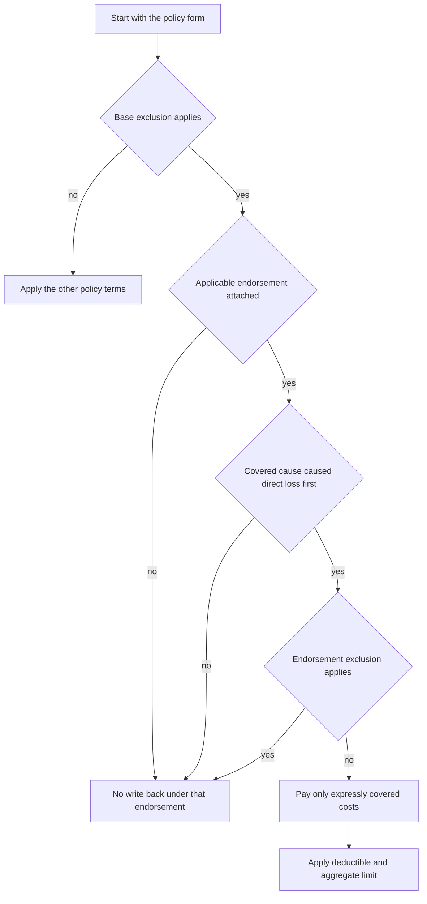

# Fungi and Bacteria

## Read the policy assembly in order

A fungi-related claim is a composed contract question, not a generic “mold limit.” Identify the policy form and edition in force on the date of loss, then identify every attached endorsement and applicable state form. Read the declarations, definitions, exclusions, conditions, deductibles, and limits together; an endorsement changes the base form only to the extent its wording does so.

The practical sequence is:

*This flow summarizes the HO 04 81 composition rules; it is not a policy, an endorsement, or a state-specific coverage determination.*

## HO 04 81 writes back narrowly to the HO-3 exclusion

**HO 04 81 Limited Fungi, Wet or Dry Rot, or Bacteria Coverage, edition 2018-09 (line HO-3),** is an endorsement. It says, “This ‘endorsement’ modifies the insurance provided by your ‘policy’,” that the policy’s “terms, limitations, exclusions, and conditions” continue unless changed, and, “This endorsement does not expand coverage beyond its express terms” (**W.0**). It therefore must be read with the **HO-3 Homeowners 3 — Special Form, edition 2024-03**, not used as a free-standing mold policy.

The endorsement’s coverage trigger is sequential. It defines fungi to include “fungi, wet or dry rot, or bacteria” and their products or byproducts; requires a covered cause to cause direct physical loss to covered property; requires the fungi to result from that loss; and requires the covered cause to occur first (**W.1 W.1–W.6**). Its operative exception is: “We cover loss caused by fungi only when the requirements of this coverage are met. We do not cover loss caused by fungi that does not result from a covered cause of loss” (**W.1 W.6**).

The HO-3 base form then supplies the exclusion that the endorsement can modify only on its own terms:

> **X.28:** “We do not cover loss caused by ‘fungi,’ wet rot, dry rot, or bacteria.”
>
> **X.29:** “We do not cover loss caused by fungi, wet rot, dry rot, or bacteria, except as provided by a limited fungi endorsement.” The same provision adds: “The ‘microbial remediation limit’ does not create coverage for loss excluded by this provision.”

Those provisions are an exception/write-back relationship, not blanket fungi coverage. The endorsement does not override a separate exclusion unless it expressly changes it, and the form and endorsement must both be attached and applicable.

### HO 04 81 covered work and remediation boundary

When its trigger is satisfied, HO 04 81 covers only expressly described costs: direct physical loss to covered property; reasonable and necessary removal of fungi; building tear-out and replacement needed to access fungi; tear-out and replacement needed to repair covered property damaged by fungi; post-work air or property testing when there is reason to believe fungi remain; and reasonable and necessary remediation related to covered direct physical loss (**W.1 W.10–W.16**).

“Remediation” means measures “to remove, contain, treat, clean, dispose of, or otherwise address fungi.” That broad work description is not a grant by itself: remediation is covered only when reasonable and necessary for fungi for which the endorsement provides coverage and related to covered direct physical loss (**W.1 W.15–W.16**).

The endorsement excludes fungi arising from constant or repeated seepage or leakage, constant or repeated discharge or overflow, or flood (**W.1 W.7–W.9**). It also excludes preexisting fungi, wet or dry rot, bacteria, deterioration, decay, wear, neglect, inadequate maintenance, and defective work (**W.1 W.24–W.29**).

It further states exact remediation boundaries:

- no monitoring when no covered direct physical loss has occurred, preventive maintenance, routine cleaning, or periodic inspection (**W.1 W.22**);
- no testing, investigation, removal, treatment, cleanup, or disposal expense except as provided and necessary because of covered direct physical loss (**W.1 W.23**);
- no replacement of undamaged property solely because fungi are present or suspected, and no improvement, upgrade, redesign, or alteration beyond reasonable repair, replacement, restoration, or remediation of covered property (**W.1 W.33–W.34**);
- no work on property that is not covered property (**W.1 W.41**); and
- no loss otherwise excluded by the policy and no cost or expense not expressly covered by the endorsement (**W.4 W.66–W.67**).

Bodily injury, sickness, disease, health-related testing or treatment, diminished value, stigma, governmental fines, regulatory-compliance costs, and testing people for exposure are also outside this property write-back (**W.1 W.30–W.32**). Separate property repair, health, code, maintenance, and betterment requests before evaluating them under the endorsement.

### HO 04 81 limit, deductible, and claim duties

For HO 04 81 edition 2018-09, the most payable for “fungi, wet or dry rot, or bacteria” is **$10,000**, and it is the total for all covered loss involving those conditions regardless of the number of claims, insureds, or items of property; it is not additional insurance (**W.2 W.1–W.2**). The same aggregate applies to covered property at separate locations and to personal and real property that otherwise qualifies (**W.2 W.5–W.6**). It includes covered property damage and related covered access, removal, treatment, testing, cleaning, repair, replacement, restoration, and protective costs (**W.2 W.3–W.22**). Payments reduce the remaining amount and do not restore it; the endorsement does not cover loss after exhaustion (**W.1 W.51–W.52**). Apply the applicable policy deductible to covered loss; the deductible does not enlarge the aggregate (**W.2 W.24; W.3 W.1–W.2**).

The endorsement requires prompt notice and says, “An insured must report the loss within thirty days.” Notice must identify the insured, affected property, location, reported condition, and known circumstances (**W.5 W.1–W.5**). The insured must protect property, make reasonable protective repairs, retain damaged property and evidence when reasonably possible, permit inspection and testing, cooperate, and provide records, photographs, invoices, estimates, reports, samples, and remediation information (**W.5 W.6–W.22; W.5 W.29–W.38**). Compliance preserves the investigation; it does not create coverage or increase the aggregate (**W.5 W.1**).

## Other attached endorsements do not create the same write-back

### DP 04 95 comes before the DP-3 water-backup provision

**DP 04 95 Water Backup — Dwelling Property, edition 2021-05 (line DP-3),** modifies the policy only for water backup and sump overflow. It covers direct physical loss from water backing up through a sewer or drain or overflowing from a sump or related equipment (**W.0; W.1 W.1**). Its exact microbial exclusion is:

> **W.1 W.16:** “We do not cover loss caused by mold, fungus, wet rot, dry rot, bacteria, or virus. We also do not cover loss consisting of remediation, removal, testing, monitoring, or treatment of those conditions.”

The endorsement’s **W.2 W.2** says, “The most we will pay for ‘Water Backup and Sump Overflow’ is five thousand dollars.” That is a water-backup limit, not a fungi write-back or fungi limit. Read with **W.1 W.16**, it does not create fungi coverage. The endorsement also leaves unchanged any condition, exclusion, or limitation it does not expressly modify (**W.1 W.35**).

### HO 04 27 comes before the HO-4 base provision

**HO 04 27 Limited Water Damage Coverage, edition 2016-05 (line HO-4),** covers specified sudden accidental water or steam discharge, overflow, and listed system or appliance events (**W.1 W.1–W.8**). It expressly excludes: “We do not cover loss caused by condensation, humidity, or vapor. We do not cover loss caused by the presence, growth, proliferation, spread, or any activity of fungi, wet rot, dry rot, or bacteria” (**W.1 W.15**).

Its **W.2 W.11** says, “The most we will pay for loss caused by fungi, wet or dry rot, or bacteria is five thousand dollars,” but immediately limits that amount to covered loss and says, “We do not pay for loss caused by fungi, wet or dry rot, or bacteria when the loss is otherwise excluded.” Its W.1 exclusion controls the scope; the $5,000 wording cannot be read alone as a fungi coverage grant. The endorsement also says coverage is subject to applicable exclusions and does not change provisions except where it says so (**W.0 W.5–W.6; W.0 W.10–W.13**).

The **HO-4 Homeowners 4 — Contents Broad Form, edition 2021-10**, contains its own resulting-loss and fungi provisions. P.53 says:

> “We do not cover loss caused by mold, fungus, wet rot, dry rot, or bacteria. We do cover direct physical loss caused by a covered peril that results from mold, fungus, wet rot, dry rot, or bacteria.”

X.32 separately says:

> “We do not cover loss caused by ‘fungi’, wet rot, dry rot, or bacteria except as provided by a limited fungi endorsement.” This exclusion applies “whether the fungi, wet rot, dry rot, or bacteria are visible or concealed.”

P.53 and X.32 must be read together with any actually attached endorsement and the rest of the policy. Do not import HO 04 81’s $10,000 aggregate, HO 04 27’s water terms, or DP 04 95’s $5,000 water-backup limit into HO-4 without the applicable contract wording.

## Resulting-loss wording is edition-specific

The **HO-3 2024-03** form’s P.19 says, “We do not cover loss caused by smog, rust, corrosion, mold, wet rot, dry rot, decay, deterioration, or contamination. We cover ensuing direct physical loss caused by a peril that is not otherwise excluded.” Its X.28–X.29 fungi provisions are quoted above. The **HO-4 2021-10** form’s P.53 and X.32 are also quoted above. These provisions should not be collapsed into a generalized rule that water, a covered peril, visible mold, or a remediation limit automatically establishes fungi coverage.

## Claims handling is an operational layer, not a coverage grant

The [Mold Claim Handling Guidance](/openwiki/claims/guidelines/mold-claim-handling.md) is internal operational material, not part of a policy contract. The Property Claims Handling Manual likewise directs internal handling and authority; it does not alter coverage or create obligations. Policy language, attached endorsements, applicable state forms, and applicable law remain the sources of contractual coverage.

The handling workflow should:

1. identify fungi or mold when the report indicates moisture, water intrusion, concealed damage, odor, staining, or growth, and distinguish direct physical loss from fungi-related damage (**guidance H.0.3–H.0.10**);
2. acknowledge the report, ask when and how the moisture condition developed, advise reasonable protection from further damage, and separate emergency extraction, drying, containment, and debris handling from permanent repair or replacement (**guidance H.6.1–H.6.7**);
3. collect source, timing, inspection, photographs, invoices, repair, remediation, and estimate evidence; preserve samples and removed materials when relevant; and use qualified experts when source, extent, contamination, or repair method cannot be reliably determined (**guidance H.6.8–H.6.18**);
4. keep the coverage determination open while cause and policy provisions are evaluated, make targeted information requests, apply the policy deductible only after identifying covered payment, and explain a limitation or denial using the applicable policy language and material facts (**guidance H.6.23–H.6.35**); and
5. stay within assigned authority. Inspection, mitigation, vendor assignment, testing, remediation approval, or payment does not itself establish coverage; unusual, disputed, technically complex, or authority-limited matters require referral (**guidance H.7.1–H.7.28; manual 1.F–1.J**).

These practices preserve the evidence needed to compare competing provisions. They do not decide whether a cause, resulting loss, remediation expense, or limit applies.

## North Carolina disclosure and claims overlay

The **NCDOI-2018-03 North Carolina bulletin** is a regulatory layer, not a contract grant. It applies to an admitted insurer writing property insurance in North Carolina when a policy contains a limitation applicable to fungi, wet or dry rot, or bacteria. The bulletin requires a clear, prominent, understandable, policy-consistent disclosure and says the notice must identify the limitation, affected coverage, material conditions, and material exclusions (**B.1; B.2.1–B.2.8; B.3.2–B.3.13**). The required amount statement is exact: **“The most we will pay is $5,000 (five thousand dollars)”** (**B.2.10**).

The notice must be available before an applicant accepts new coverage, supplied at renewal when the limitation materially differs, and supplied when a policy change or endorsement adds or changes the limitation (**B.3.15–B.3.18**). The insurer must retain the notice and delivery records, maintain controls matching the notice to the policy and endorsements, and remains responsible when an agent or producer delivers it (**B.3.19–B.3.26**). A disclosure cannot create, waive, or alter coverage (**B.3.12–B.3.13**).

For an alleged fungi loss, the bulletin requires fact review and reasonable investigation rather than an automatic denial. The insurer must evaluate whether a covered cause produced the condition, distinguish fungi damage from other covered damage, provide a clear written explanation for a limitation or partial denial, and preserve the claim-file basis (**B.4.1–B.4.20**). Those are regulatory handling and communication requirements; the applicable policy and attached endorsements determine the contractual result.

## Related coverage context

- [Water damage and related perils](/openwiki/coverage/perils/water-damage.md) — use for the initiating water cause and water exclusions.
- [HO-3 form](/openwiki/coverage/forms/ho-3.md) — use for the base-form provisions and edition context.
- [Water loss claim handling](/openwiki/claims/guidelines/water-loss-handling.md) — use for operational water-loss investigation and mitigation.
- [North Carolina state overlay](/openwiki/state-overlays/north-carolina.md) — use for state-specific implementation context.
