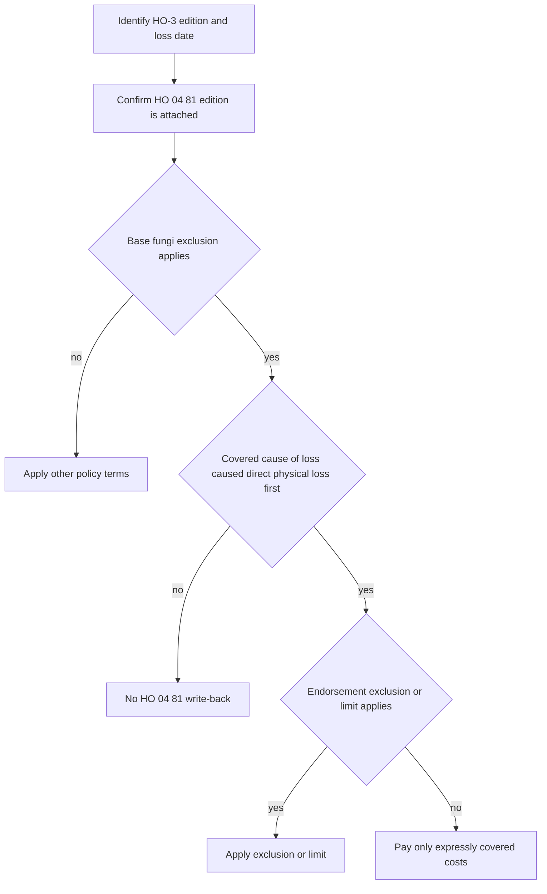

# Fungi, Wet or Dry Rot, and Bacteria Coverage

## Read the policy assembly in order

This is a composed-contract analysis. Identify the HO-3 edition in force, confirm that HO 04 81 is attached, and then apply the endorsement together with the base form, declarations, definitions, exclusions, conditions, deductible, and limits. Training and memoranda can guide handling, but do not replace the form.

```mermaid
flowchart TD
    A["Identify HO-3 edition and loss date"] --> B["Confirm HO 04 81 edition is attached"]
    B --> C{"Base fungi exclusion applies"}
    C -->|"no"| D["Apply other policy terms"]
    C -->|"yes"| E{"Covered cause of loss caused direct physical loss first"}
    E -->|"no"| F["No HO 04 81 write-back"]
    E -->|"yes"| G{"Endorsement exclusion or limit applies"}
    G -->|"yes"| H["Apply exclusion or limit"]
    G -->|"no"| I["Pay only expressly covered costs"]
```

## The base exclusion and the HO 04 81 write-back

**HO 04 81 Limited Fungi, Wet or Dry Rot, or Bacteria Coverage, edition 2018-09 (HO-3), writes back** narrowly to the base form. Its preamble says it modifies the policy, leaves policy terms in place unless changed, and “does not expand coverage beyond its express terms” ([2018-09 endorsement, W.0](repo://forms/HO/MS/HO-04-81/2018-09.md#L17-L47)). The **HO-3 2024-03** base form says, “We do not cover loss caused by ‘fungi,’ wet rot, dry rot, or bacteria,” and adds an exception “except as provided by a limited fungi endorsement”; its microbial remediation limit does not itself create coverage ([2024-03 HO-3, X.28-X.29](repo://forms/HO/MS/HO-3/2024-03.md#L631-L638)). Thus a limit is not a grant, and the endorsement must actually be attached and applicable.

The **2018-09 endorsement** defines “fungi” to include fungi, wet or dry rot, bacteria, and their products or byproducts. It covers “direct physical loss” to “covered property” caused by fungi only when the fungi results from a “covered cause of loss”; the covered cause must cause direct physical loss first, and the fungi must result from that loss ([2018-09 endorsement, W.1](repo://forms/HO/MS/HO-04-81/2018-09.md#L49-L61)). The endorsement therefore does not cover an independently originating mold, rot, or bacteria condition merely because a covered peril is later identified.

**HO 04 81 edition 2026-09 preserves** that causation structure. It applies to policies written or renewed on or after 2026-10-01, replaces 2018-09 for those policies, and expressly leaves policies written under 2018-09 governed by that edition ([2026-09 endorsement](repo://forms/HO/MS/HO-04-81/2026-09.md#L1-L7)). Its coverage wording again requires direct physical loss to covered property caused by fungi resulting from a “covered cause of loss” occurring before the fungi caused the loss ([2026-09 endorsement, W.1-W.2](repo://forms/HO/MS/HO-04-81/2026-09.md#L9-L21)). Do not use the 2026-09 limit on a policy governed by 2018-09.

## Covered remediation and boundaries

Under **HO 04 81 edition 2018-09**, when the causation requirements are met, the endorsement covers direct physical loss and reasonable, necessary costs to remove fungi; tear out and replace building parts needed to access fungi; tear out and replace building parts needed to repair covered property damaged by fungi; and air or property testing after covered work when there is reason to believe fungi remain ([2018-09 endorsement, W.1](repo://forms/HO/MS/HO-04-81/2018-09.md#L69-L81)). “Remediation” includes measures to remove, contain, treat, clean, dispose of, or otherwise address fungi, but is covered only when reasonable and necessary for covered fungi damage and related to covered direct physical loss.

The **2026-09 edition preserves** those covered-work categories: removal, access tear-out and replacement, and post-remediation testing ([2026-09 endorsement, W.3](repo://forms/HO/MS/HO-04-81/2026-09.md#L14-L21)). Its W.6 says the only change from 2018-09 is the liability limit ([2026-09 endorsement, W.6](repo://forms/HO/MS/HO-04-81/2026-09.md#L30-L33)). Accordingly, edition-dependent cost boundaries remain those of the 2018-09 wording for a 2018-09 policy and are preserved by 2026-09 for a 2026-09 policy.

For **both editions**, the write-back does not pay preventive monitoring, routine cleaning, periodic inspection, testing or remediation unrelated to covered direct physical loss, replacement of undamaged property merely because fungi are present or suspected, improvements or upgrades, work on non-covered property, bodily injury or health treatment, exposure testing, stigma or diminished value, governmental fines, or costs excluded elsewhere in the policy ([2018-09 endorsement, W.22-W.41](repo://forms/HO/MS/HO-04-81/2018-09.md#L93-L131)). The 2018-09 form also excludes preexisting fungi, deterioration, neglect, inadequate maintenance, defective work, and fungi arising from constant or repeated seepage, leakage, discharge, overflow, or flood ([2018-09 endorsement, W.7-W.9 and W.24-W.29](repo://forms/HO/MS/HO-04-81/2018-09.md#L63-L67); [2018-09 endorsement, W.24-W.29](repo://forms/HO/MS/HO-04-81/2018-09.md#L97-L107)). The 2026-09 edition preserves those exclusions through its “only change” statement ([2026-09 endorsement, W.4 and W.6](repo://forms/HO/MS/HO-04-81/2026-09.md#L20-L21); [2026-09 endorsement, W.6](repo://forms/HO/MS/HO-04-81/2026-09.md#L30-L33)).

## Aggregate limit and edition applicability

For **HO 04 81 edition 2018-09**, the most payable for “fungi, wet or dry rot, or bacteria” is **$10,000**. It is one aggregate for all covered loss involving those conditions, regardless of claims, insureds, property, or location, and is not additional insurance. Covered property damage and covered access, removal, remediation, testing, repair, replacement, and restoration expenses consume the same aggregate; payments reduce the remaining amount and do not restore it ([2018-09 endorsement, W.2](repo://forms/HO/MS/HO-04-81/2018-09.md#L161-L181); [2018-09 endorsement, W.51-W.52](repo://forms/HO/MS/HO-04-81/2018-09.md#L151-L153)). The applicable deductible is applied to covered loss and does not enlarge the aggregate ([2018-09 endorsement, W.3](repo://forms/HO/MS/HO-04-81/2018-09.md#L239-L255)).

For **HO 04 81 edition 2026-09**, the aggregate is **$25,000**, with the same all-claims, all-insureds, and all-items structure and no additional insurance ([2026-09 endorsement, W.5](repo://forms/HO/MS/HO-04-81/2026-09.md#L23-L28)). The 2026-09 form expressly states that raising the limit from $10,000 to $25,000 is its only change, so the 2018-09 causation, covered-work, exclusion, and limit mechanics are preserved for the 2026-09 edition ([2026-09 endorsement, W.6](repo://forms/HO/MS/HO-04-81/2026-09.md#L30-L33)).

## Adjustment discipline

Claims handling should identify the initiating event, timing, moisture path, direct physical damage, preexisting conditions, and requested remediation; preserve photographs, samples, removed materials, estimates, invoices, testing, and expert evidence; and separate emergency protection from permanent repair. Those are operational practices, not coverage grants. The governing result comes from the applicable HO-3 edition, the attached HO 04 81 edition, and their quoted causation and exclusion language. A payment, inspection, vendor assignment, or remediation approval does not itself waive an exclusion or create coverage.

## Related pages

- [HO-3 form](/openwiki/coverage/forms/ho-3.md) — base-form editions and exclusions.
- [Water damage and related perils](/openwiki/coverage/perils/water-damage.md) — initiating water causes and exclusions.
- [Mold claim handling](/openwiki/claims/guidelines/mold-claim-handling.md) — operational investigation guidance.
- [Editions and state attachments](/openwiki/policy-assembly/editions-and-state-attachments.md) — applicability and assembly context.
