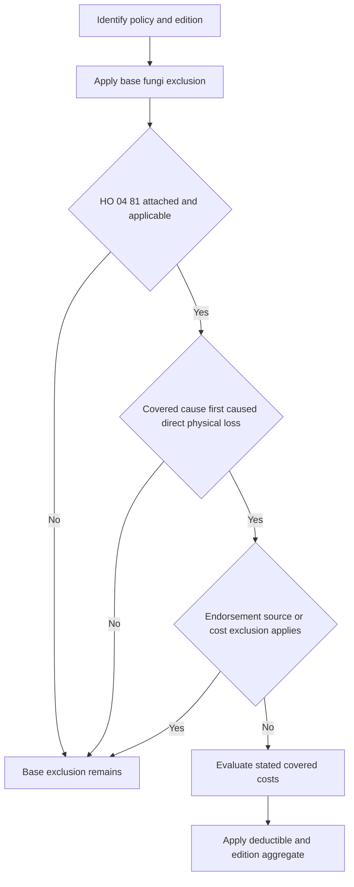

# Fungi, Wet or Dry Rot, and Bacteria Coverage

## Contract architecture

Start with the policy form and edition in force, then confirm that HO 04 81 is attached and applicable. HO 04 81 is contract language, not a general mold benefit: the endorsement says the policy's terms, limitations, exclusions, and conditions continue unless it changes them, and that it does not expand coverage beyond its express terms (**HO 04 81 (2018-09), W.0, lines 17–33**). The endorsement writes back only the stated base-form exclusion and preserves exclusions it does not change.

```mermaid
flowchart TD
    A["Identify policy and edition"] --> B["Apply base fungi exclusion"]
    B --> C{"HO 04 81 attached and applicable"}
    C -->|"No"| D["Base exclusion remains"]
    C -->|"Yes"| E{"Covered cause first caused direct physical loss"}
    E -->|"No"| D
    E -->|"Yes"| F{"Endorsement source or cost exclusion applies"}
    F -->|"Yes"| D
    F -->|"No"| G["Evaluate stated covered costs"]
    G --> H["Apply deductible and edition aggregate"]
```

*This diagram summarizes the contract decision path; it is not itself coverage wording.*

## Base-form exclusion and narrow write-back

The HO-3 2018-09 form excludes loss caused by mold, fungi, wet rot, dry rot, bacteria, or other microbial matter; its microbial-remediation limit applies only as provided by its terms (**HO-3 2018-09, X.40, lines 705–705**). The HO-3 2024-03 form likewise excludes loss caused by fungi, wet rot, dry rot, or bacteria except as provided by a limited fungi endorsement, and says the microbial remediation limit does not create coverage for otherwise excluded loss (**HO-3 2024-03, X.28–X.29, lines 635–637**).

HO 04 81 defines “fungi” to include fungi, wet or dry rot, bacteria, and substances produced by them. Its write-back requires a covered cause of loss to cause direct physical loss to covered property, the fungi to result from that loss, and the covered cause to occur before the fungi causes its direct physical loss (**HO 04 81 (2018-09), W.1, lines 49–61**). Thus, the endorsement does not convert an excluded condition into blanket coverage: only loss satisfying that sequence and the endorsement's other terms is eligible.

## Sources and costs that remain excluded

The endorsement excludes fungi arising from constant or repeated seepage or leakage, constant or repeated discharge or overflow, and flood (**HO 04 81 (2018-09), W.1, lines 63–67**). It also excludes preexisting fungi, rot, bacteria, deterioration, decay, wear, neglect, inadequate maintenance, defective work, and related specified conditions (**HO 04 81 (2018-09), W.1, lines 97–107**).

When the trigger is satisfied, covered work is limited to reasonable and necessary removal; building tear-out and replacement needed to access fungi; tear-out and replacement needed to repair covered property damaged by fungi; post-work air or property testing when there is reason to believe fungi remain; and remediation related to covered direct physical loss (**HO 04 81 (2018-09), W.1, lines 69–81**). “Remediation” includes removing, containing, treating, cleaning, disposing of, or otherwise addressing fungi, but the definition does not independently grant coverage (**HO 04 81 (2018-09), W.1, lines 79–81**).

The boundary is material: no monitoring without covered direct physical loss, preventive maintenance, routine cleaning, periodic inspection, or otherwise unnecessary testing, investigation, removal, treatment, cleanup, or disposal (**HO 04 81 (2018-09), W.1, lines 93–95**). The endorsement also excludes replacing undamaged property merely because fungi are present or suspected, improvements or redesign, work on property that is not covered property, bodily injury and health treatment, governmental fines and compliance costs, and testing people for exposure (**HO 04 81 (2018-09), W.1, lines 109–117, 131–131**).

## Edition limits and effective dates

### 2018-09 edition

For HO 04 81 edition 2018-09, the most payable for fungi, wet or dry rot, or bacteria is **$10,000**. It is the total aggregate for all covered loss involving those conditions, regardless of the number of claims, insureds, or items of property, and is not additional insurance (**HO 04 81 (2018-09), W.2, lines 161–165**). Payments for covered property damage and related covered expenses reduce the remaining aggregate; exhaustion ends payment for later fungi loss (**HO 04 81 (2018-09), W.1, lines 151–153**).

That edition is effective **2018-09-01**. It is superseded by the 2026-09 edition for policies written on or after **2026-10-01**, but remains governing for policies written under it, including a loss reported later (**HO 04 81 (2018-09), front matter, lines 1–12**).

### 2026-09 edition

For HO 04 81 edition 2026-09, the most payable is **$25,000**, with the same total aggregate structure and no additional insurance (**HO 04 81 (2026-09), W.2, lines 23–28**). The edition states that its only change from 2018-09 is increasing the limit from $10,000 to $25,000; the other provisions remain unchanged (**HO 04 81 (2026-09), W.3, lines 30–33**). It applies to policies written or renewed on or after **2026-10-01**; policies written under 2018-09 remain governed by that prior edition (**HO 04 81 (2026-09), lines 1–7**).

The 2026-09 edition retains the qualifying trigger—fungi must result from a covered cause that occurred before the fungi caused the loss—and retains the seepage, leakage, and flood exclusions (**HO 04 81 (2026-09), W.1, lines 9–21**). Its expressly described covered work remains removal, access tear-out and replacement, and testing after covered remediation (**HO 04 81 (2026-09), W.1, lines 14–18**).

## Practical reading rule

Do not infer fungi coverage from a water loss, a microbial-remediation limit, a remediation estimate, or the existence of a $10,000 or $25,000 aggregate. First establish the applicable edition, the covered-cause-first sequence, and covered property; then test each requested cost against the endorsement's express write-back and preserved exclusions. The aggregate limits payment; it does not create coverage.

For claims operations, investigation, documentation, and referral procedures, use the [mold claim handling guidance](/openwiki/claims/guidelines/mold-claim-handling.md) as operational material only. It cannot expand or replace the contract wording above.

## Related coverage

- [Water damage](/openwiki/coverage/perils/water-damage.md) — initiating water causes and their exclusions.
- [Property perils and loss types](/openwiki/claims/manual/property-perils-and-loss-types.md) — classification context.
- [Editions and state attachments](/openwiki/policy-assembly/editions-and-state-attachments.md) — policy-assembly context.
