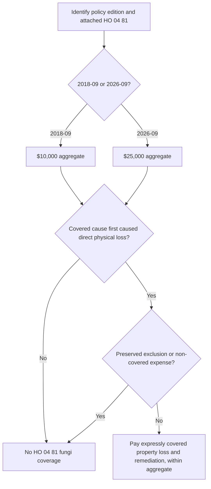

# Fungi, Wet or Dry Rot, and Bacteria

## Which edition governs

<!-- openwiki: broken internal link [../../../forms/HO/MS/HO-04-81/2018-09.md#L17-L47] heading anchor "L17-L47" does not exist in "../../../forms/HO/MS/HO-04-81/2018-09.md". Fix the href or restore the target, then delete this comment. -->
HO 04 81 is an endorsement, not a stand-alone mold policy. The 2018-09 endorsement says, “This ‘endorsement’ modifies the insurance provided by your ‘policy’,” preserves the policy’s terms unless changed, and provides that a conflict is controlled by the endorsement. It also says, “This endorsement does not expand coverage beyond its express terms.” Read it with the attached HO-3 form and the policy in force. [HO 04 81 2018-09](../../../forms/HO/MS/HO-04-81/2018-09.md#L17-L47)

<!-- openwiki: broken internal link [../../../forms/HO/MS/HO-04-81/2026-09.md#L1-L7] heading anchor "L1-L7" does not exist in "../../../forms/HO/MS/HO-04-81/2026-09.md". Fix the href or restore the target, then delete this comment. -->
<!-- openwiki: broken internal link [../../../forms/HO/MS/HO-04-81/2026-09.md#L23-L33] heading anchor "L23-L33" does not exist in "../../../forms/HO/MS/HO-04-81/2026-09.md". Fix the href or restore the target, then delete this comment. -->
The 2026-09 edition applies to policies written or renewed on or after 2026-10-01 and “replaces edition 2018-09 for those policies”; policies written under 2018-09 remain governed by that edition. The 2026 form identifies itself as a multistate endorsement to HO-3 and says its only change is the limit: $10,000 becomes $25,000. Thus, do not rewrite the 2018-09 position away: apply 2018-09 to policies written under it, including later-reported losses, and apply 2026-09 to the stated post-2026-10-01 policies. [HO 04 81 2026-09](../../../forms/HO/MS/HO-04-81/2026-09.md#L1-L7), [2026 change](../../../forms/HO/MS/HO-04-81/2026-09.md#L23-L33)

```mermaid
flowchart TD
  A[Identify policy edition and attached HO 04 81] --> B{2018-09 or 2026-09?}
  B -->|2018-09| C[$10,000 aggregate]
  B -->|2026-09| D[$25,000 aggregate]
  C --> E{Covered cause first caused direct physical loss?}
  D --> E
  E -->|No| F[No HO 04 81 fungi coverage]
  E -->|Yes| G{Preserved exclusion or non-covered expense?}
  G -->|Yes| F
  G -->|No| H[Pay expressly covered property loss and remediation, within aggregate]
```

## The coverage trigger is sequential

<!-- openwiki: broken internal link [../../../forms/HO/MS/HO-04-81/2018-09.md#L49-L61] heading anchor "L49-L61" does not exist in "../../../forms/HO/MS/HO-04-81/2018-09.md". Fix the href or restore the target, then delete this comment. -->
<!-- openwiki: broken internal link [../../../forms/HO/MS/HO-04-81/2026-09.md#L9-L21] heading anchor "L9-L21" does not exist in "../../../forms/HO/MS/HO-04-81/2026-09.md". Fix the href or restore the target, then delete this comment. -->
Both editions define “fungi” to include fungi, wet or dry rot, or bacteria and substances produced by them. The controlling prerequisite is that fungi-related direct physical loss to covered property must result from a “covered cause of loss” that occurred before the fungi caused the loss. The 2018 wording states: “We cover loss caused by fungi only when the requirements of this coverage are met. We do not cover loss caused by fungi that does not result from a covered cause of loss.” The 2026 wording states the same sequence in condensed form. [2018 W.1](../../../forms/HO/MS/HO-04-81/2018-09.md#L49-L61), [2026 W.1-W.2](../../../forms/HO/MS/HO-04-81/2026-09.md#L9-L21)

<!-- openwiki: broken internal link [../../../forms/HO/MS/HO-3/2024-03.md#L629-L640] heading anchor "L629-L640" does not exist in "../../../forms/HO/MS/HO-3/2024-03.md". Fix the href or restore the target, then delete this comment. -->
<!-- openwiki: broken internal link [../../../forms/HO/MS/HO-04-81/2018-09.md#L17-L33] heading anchor "L17-L33" does not exist in "../../../forms/HO/MS/HO-04-81/2018-09.md". Fix the href or restore the target, then delete this comment. -->
The HO-3 2024-03 base form supplies the exclusion that the acting endorsement modifies only as stated: **X.28** says, “We do not cover loss caused by ‘fungi,’ wet rot, dry rot, or bacteria.” **X.29** says, “We do not cover loss caused by fungi, wet rot, dry rot, or bacteria, except as provided by a limited fungi endorsement,” and adds that the “microbial remediation limit” does not create coverage for loss excluded by the provision. HO 04 81 writes back only within its express trigger and terms; it does not write back separate exclusions or create coverage by implication. [HO-3 X.28-X.29](../../../forms/HO/MS/HO-3/2024-03.md#L629-L640), [2018 W.0](../../../forms/HO/MS/HO-04-81/2018-09.md#L17-L33)

## What remediation covers—and what it does not

<!-- openwiki: broken internal link [../../../forms/HO/MS/HO-04-81/2018-09.md#L69-L81] heading anchor "L69-L81" does not exist in "../../../forms/HO/MS/HO-04-81/2018-09.md". Fix the href or restore the target, then delete this comment. -->
<!-- openwiki: broken internal link [../../../forms/HO/MS/HO-04-81/2026-09.md#L14-L21] heading anchor "L14-L21" does not exist in "../../../forms/HO/MS/HO-04-81/2026-09.md". Fix the href or restore the target, then delete this comment. -->
When the covered-cause sequence is satisfied, HO 04 81 covers reasonable and necessary direct physical loss to covered property and expressly described work. The 2018 endorsement lists removal of fungi, tear-out and replacement needed to gain access, tear-out and replacement needed to repair covered property damaged by fungi, and air or property testing after covered removal, repair, replacement, restoration, or remediation when there is reason to believe fungi remain. It defines remediation as measures “to remove, contain, treat, clean, dispose of, or otherwise address fungi,” but says remediation is covered only when reasonable and necessary and related to covered direct physical loss. The 2026 edition expressly retains the core removal, access, and post-remediation testing costs. [2018 W.10-W.16](../../../forms/HO/MS/HO-04-81/2018-09.md#L69-L81), [2026 W.3](../../../forms/HO/MS/HO-04-81/2026-09.md#L14-L21)

<!-- openwiki: broken internal link [../../../forms/HO/MS/HO-04-81/2018-09.md#L93-L117] heading anchor "L93-L117" does not exist in "../../../forms/HO/MS/HO-04-81/2018-09.md". Fix the href or restore the target, then delete this comment. -->
<!-- openwiki: broken internal link [../../../forms/HO/MS/HO-04-81/2018-09.md#L109-L113] heading anchor "L109-L113" does not exist in "../../../forms/HO/MS/HO-04-81/2018-09.md". Fix the href or restore the target, then delete this comment. -->
The 2018 endorsement preserves material boundaries: no monitoring without covered direct physical loss, preventive maintenance, routine cleaning, or periodic inspection; no testing, investigation, abatement, cleanup, or disposal expense except as provided and necessary because of covered direct physical loss; no replacement of undamaged property solely because fungi are present or suspected; and no improvement, upgrade, redesign, or alteration beyond reasonable restoration. It also excludes preexisting fungi, deterioration, decay, wear, neglect, inadequate maintenance, defective work, bodily injury and health expenses, governmental fines or compliance costs, and testing people for exposure. Property not insured as covered property is outside the write-back. [2018 W.22-W.34 and W.41](../../../forms/HO/MS/HO-04-81/2018-09.md#L93-L117), [2018 W.30-W.32](../../../forms/HO/MS/HO-04-81/2018-09.md#L109-L113)

<!-- openwiki: broken internal link [../../../forms/HO/MS/HO-04-81/2018-09.md#L63-L67] heading anchor "L63-L67" does not exist in "../../../forms/HO/MS/HO-04-81/2018-09.md". Fix the href or restore the target, then delete this comment. -->
<!-- openwiki: broken internal link [../../../forms/HO/MS/HO-04-81/2026-09.md#L20-L21] heading anchor "L20-L21" does not exist in "../../../forms/HO/MS/HO-04-81/2026-09.md". Fix the href or restore the target, then delete this comment. -->
Both editions preserve the exclusion for fungi arising from constant or repeated seepage or leakage of water or steam, and from flood. The 2018 text states the flood exclusion applies “regardless of any other cause or event contributing concurrently or in any sequence to the loss.” [2018 W.7-W.9](../../../forms/HO/MS/HO-04-81/2018-09.md#L63-L67), [2026 W.4](../../../forms/HO/MS/HO-04-81/2026-09.md#L20-L21)

## Limits and payment mechanics

<!-- openwiki: broken internal link [../../../forms/HO/MS/HO-04-81/2018-09.md#L161-L181] heading anchor "L161-L181" does not exist in "../../../forms/HO/MS/HO-04-81/2018-09.md". Fix the href or restore the target, then delete this comment. -->
<!-- openwiki: broken internal link [../../../forms/HO/MS/HO-04-81/2018-09.md#L151-L153] heading anchor "L151-L153" does not exist in "../../../forms/HO/MS/HO-04-81/2018-09.md". Fix the href or restore the target, then delete this comment. -->
For a policy governed by HO 04 81 edition 2018-09, the most payable is **$10,000** for “fungi, wet or dry rot, or bacteria.” It is one aggregate for all covered loss regardless of the number of claims, insureds, or items of property, and it is not additional insurance. Covered property damage and related covered removal, access, treatment, testing, repair, replacement, restoration, and protective expenses consume the same aggregate; payments reduce the remaining amount and do not restore it. [2018 W.2](../../../forms/HO/MS/HO-04-81/2018-09.md#L161-L181), [2018 W.51-W.52](../../../forms/HO/MS/HO-04-81/2018-09.md#L151-L153)

<!-- openwiki: broken internal link [../../../forms/HO/MS/HO-04-81/2026-09.md#L23-L33] heading anchor "L23-L33" does not exist in "../../../forms/HO/MS/HO-04-81/2026-09.md". Fix the href or restore the target, then delete this comment. -->
For a policy governed by edition 2026-09, the corresponding aggregate is **$25,000**, with the same all-covered-loss, all-claims, non-additional-insurance wording. The 2026 filing therefore changes the amount, not the covered-cause prerequisite, remediation concept, or preserved exclusions. [2026 W.5-W.6](../../../forms/HO/MS/HO-04-81/2026-09.md#L23-L33)

<!-- openwiki: broken internal link [../../../forms/HO/MS/HO-04-81/2018-09.md#L121-L129] heading anchor "L121-L129" does not exist in "../../../forms/HO/MS/HO-04-81/2018-09.md". Fix the href or restore the target, then delete this comment. -->
<!-- openwiki: broken internal link [../../../forms/HO/MS/HO-04-81/2018-09.md#L239-L255] heading anchor "L239-L255" does not exist in "../../../forms/HO/MS/HO-04-81/2018-09.md". Fix the href or restore the target, then delete this comment. -->
The applicable policy deductible and loss-settlement terms still apply; the deductible does not enlarge the endorsement aggregate. The 2018 endorsement says payment remains subject to the policy’s terms, conditions, exclusions, and limitations and that no payment restores exhausted coverage. [2018 W.0 W.39-W.41](../../../forms/HO/MS/HO-04-81/2018-09.md#L121-L129), [2018 W.3](../../../forms/HO/MS/HO-04-81/2018-09.md#L239-L255)

## Investigation is not a coverage grant

<!-- openwiki: broken internal link [../../../training/water-losses-101.md#L13-L39] heading anchor "L13-L39" does not exist in "../../../training/water-losses-101.md". Fix the href or restore the target, then delete this comment. -->
<!-- openwiki: broken internal link [../../../training/water-losses-101.md#L81-L99] heading anchor "L81-L99" does not exist in "../../../training/water-losses-101.md". Fix the href or restore the target, then delete this comment. -->
Water-loss investigation should separate the water source from resulting damage, establish timing and movement, document visible and concealed conditions, and distinguish emergency mitigation from permanent repair. Stains, odor, swelling, and mold-like growth are clues rather than proof of cause; preserve failed parts, photographs, invoices, and repair findings when possible. [Water Losses 101](../../../training/water-losses-101.md#L13-L39), [source and evidence guidance](../../../training/water-losses-101.md#L81-L99)

<!-- openwiki: broken internal link [../../../forms/HO/MS/HO-04-81/2018-09.md#L83-L91] heading anchor "L83-L91" does not exist in "../../../forms/HO/MS/HO-04-81/2018-09.md". Fix the href or restore the target, then delete this comment. -->
<!-- openwiki: broken internal link [../../../forms/HO/MS/HO-04-81/2018-09.md#L121-L129] heading anchor "L121-L129" does not exist in "../../../forms/HO/MS/HO-04-81/2018-09.md". Fix the href or restore the target, then delete this comment. -->
Inspection, testing, vendor assignment, mitigation, or remediation approval does not itself establish coverage. The contractual result comes from the applicable HO-3, attached HO 04 81 edition, and facts. The 2018 endorsement preserves investigation and cooperation duties and states that insurer investigation does not waive a condition, exclusion, or limitation. [2018 W.17-W.21 and W.36-W.39](../../../forms/HO/MS/HO-04-81/2018-09.md#L83-L91), [2018 W.36-W.39](../../../forms/HO/MS/HO-04-81/2018-09.md#L121-L129)

<!-- openwiki: broken internal link [../../../memoranda/HO-04-90-2027-01.md#L13-L19] heading anchor "L13-L19" does not exist in "../../../memoranda/HO-04-90-2027-01.md". Fix the href or restore the target, then delete this comment. -->
<!-- openwiki: broken internal link [../../../memoranda/HO-04-90-2027-01.md#L37-L65] heading anchor "L37-L65" does not exist in "../../../memoranda/HO-04-90-2027-01.md". Fix the href or restore the target, then delete this comment. -->
The 2027-01 HO 04 90 memorandum is explanatory filing material: it describes clarification of the relationship between covered causes and exclusions, conditions, payment, and property-protection duties, but it does not replace the HO 04 81 text. [HO 04 90 memorandum](../../../memoranda/HO-04-90-2027-01.md#L13-L19), [relationship clarification](../../../memoranda/HO-04-90-2027-01.md#L37-L65)

## Working rule

Identify the governing edition first. Then prove the covered cause occurred first and caused direct physical loss to covered property; test the fungi loss against the endorsement’s preserved exclusions; separate expressly covered remediation from maintenance, health, code, betterment, and non-covered property costs; and apply the edition-specific aggregate and deductible. A water event, visible mold, or a remediation invoice alone does not establish fungi coverage.
