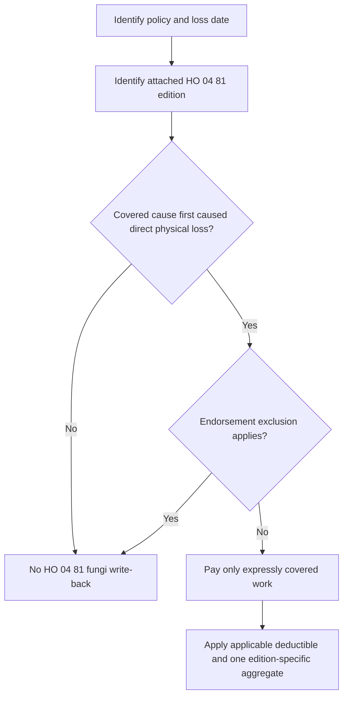

# Fungi, Wet or Dry Rot, and Bacteria

## Edition and policy assembly

Coverage depends on the HO-3 edition, the applicable HO 04 81 edition, the policy period, and the forms actually attached. The endorsement is not a stand-alone mold policy: HO 04 81 edition 2018-09 says it modifies the policy, leaves its terms and exclusions in effect unless changed, and “does not expand coverage beyond its express terms” (**2018-09 W.0, lines 19–33**). The 2026-09 endorsement applies to policies written or renewed on or after 2026-10-01; it replaces 2018-09 for those policies, while policies written under 2018-09 remain governed by that edition (**2026-09 lines 1–7**).

```mermaid
flowchart TD
 A[Identify policy and loss date] --> B[Identify attached HO 04 81 edition]
 B --> C{Covered cause first caused direct physical loss?}
 C -->|No| D[No HO 04 81 fungi write-back]
 C -->|Yes| E{Endorsement exclusion applies?}
 E -->|Yes| D
 E -->|No| F[Pay only expressly covered work]
 F --> G[Apply applicable deductible and one edition-specific aggregate]
```

The base form remains important. HO-3 edition 2018-09 excludes mold, fungi, wet rot, dry rot, bacteria, and other microbial matter, with its microbial remediation limit applying only by its terms (**2018-09 X.40, lines 705–705**). HO-3 edition 2024-03 says, “We do not cover loss caused by ‘fungi,’ wet rot, dry rot, or bacteria,” except as provided by a limited fungi endorsement, and says the microbial remediation limit does not create coverage for otherwise excluded loss (**2024-03 X.28–X.29, lines 635–637**). Thus an attached HO 04 81 endorsement can modify the base exclusion only within its own wording; a base-form remediation limit is not itself a coverage grant.

## HO 04 81 trigger and covered work

For **HO 04 81 edition 2018-09**, “fungi” means fungi, wet or dry rot, bacteria, and substances produced by them (**2018-09 W.1, lines 49–51**). The endorsement covers direct physical loss to covered property caused by fungi only when a covered cause of loss causes direct physical loss first and the fungi results from that loss (**2018-09 W.1, lines 53–61**). A covered water event therefore does not automatically establish covered fungi damage; the cause, sequence, property, and exclusions must still satisfy the endorsement and HO-3.

For **HO 04 81 edition 2026-09**, the same trigger is stated more compactly: fungi must result from a covered cause of loss that occurred before fungi caused the loss (**2026-09 W.1–W.2, lines 9–15**). The 2026-09 text says its only change from 2018-09 is the limit, raised from $10,000 to $25,000, and that all other provisions are unchanged (**2026-09 W.6, lines 30–33**). Accordingly, the 2018-09 trigger and exclusions described below remain the controlling substantive terms for 2026-09 where the 2026-09 form states they are unchanged.

For **2018-09**, when the trigger is met, covered work includes reasonable and necessary removal of fungi; building tear-out and replacement needed to access fungi; tear-out and replacement needed to repair covered property damaged by fungi; and post-work air or property testing when there is reason to believe fungi remain (**2018-09 W.1, lines 69–77**). “Remediation” includes measures “to remove, contain, treat, clean, dispose of, or otherwise address fungi,” but is covered only when reasonable and necessary for covered fungi and related to covered direct physical loss (**2018-09 W.1, lines 79–81**). The 2026-09 edition preserves these covered-work terms because it expressly identifies only the limit as changed (**2026-09 lines 30–33**); the 2026-09 summary separately confirms removal, access tear-out, and testing after covered remediation (**2026-09 W.3, lines 17–18**).

## Excluded causes and remediation boundaries

For **2018-09**, fungi arising from constant or repeated seepage or leakage, constant or repeated discharge or overflow, or flood is excluded (**2018-09 W.1, lines 63–67**). The endorsement also excludes preexisting fungi, wet or dry rot, bacteria, deterioration, decay, wear, neglect, inadequate maintenance, defective work, and specified settling, cracking, pollutants, mechanical, and inherent-defect causes (**2018-09 W.1, lines 97–107**). The 2026-09 edition preserves those exclusions because its only stated change is the limit (**2026-09 lines 30–33**), while its express summary retains the seepage, leakage, and flood exclusions (**2026-09 W.4, lines 20–21**).

For **both editions**, as established by the 2018-09 wording preserved by 2026-09, the endorsement does not pay monitoring without covered direct physical loss, preventive maintenance, routine cleaning, or periodic inspection; testing or cleanup not necessary because of covered direct physical loss; replacement of undamaged property merely because fungi are present or suspected; improvement, upgrade, redesign, or alteration; or work on property that is not covered property (**2018-09 W.1, lines 93–95, 115–117, 129–131**; **2026-09 lines 30–33**). It also excludes bodily injury, health testing or treatment, governmental fines and compliance costs, and testing people for exposure (**2018-09 W.1, lines 109–113**). Emergency protection duties and policy conditions remain applicable; mitigation or insurer investigation does not waive an exclusion or create coverage (**2018-09 W.0, lines 35–47; W.1, lines 83–91, 121–127**).

## Aggregate limit: do not combine editions

For **HO 04 81 edition 2018-09**, “The most we will pay for ‘fungi, wet or dry rot, or bacteria’ is ten thousand dollars.” The limit is the total for all covered loss involving those conditions, regardless of claims, insureds, or property, and “is not an additional amount of insurance” (**2018-09 W.2, lines 161–165**). It applies across locations and to qualifying personal and real property (**2018-09 W.2, lines 169–175**). Covered property damage, access, removal, remediation, repair, replacement, restoration, and testing expenses are inside the same aggregate (**2018-09 W.2, lines 179–187**). Payments reduce the remaining amount and do not restore it; no further fungi payment is owed after exhaustion (**2018-09 W.1, lines 151–153**). The applicable deductible is applied under the endorsement and does not increase the aggregate (**2018-09 W.2, lines 207–209**).

For **HO 04 81 edition 2026-09**, the corresponding limit is **$25,000**, with the same aggregate structure: it applies to the total of all covered fungi, wet or dry rot, or bacteria loss regardless of claims, insureds, or property and is not additional insurance (**2026-09 W.5, lines 23–28**). Do not combine the 2018-09 $10,000 limit and the 2026-09 $25,000 limit. Select the endorsement edition applicable to the policy; the 2026-09 limit does not retroactively enlarge a policy written under 2018-09 (**2026-09 lines 1–7, 30–33**).

## Unchanged terms and handling

For **both HO 04 81 editions**, all policy terms not changed by the endorsement remain applicable, including covered-property requirements, loss settlement, deductible, policy limits, notice, cooperation, inspection, evidence preservation, and applicable exclusions (**2018-09 W.0, lines 23–47; 2026-09 lines 30–33**). Claims handling should therefore establish the initiating cause and sequence, separate covered direct physical loss from fungi-related work, document timing and extent, preserve affected materials when reasonably possible, and evaluate each requested remediation item against the applicable edition. These are operational steps, not a coverage grant; the attached contract language controls.

- [Mold claim handling guidance](/openwiki/claims/guidelines/mold-claim-handling.md) — operational investigation and remediation workflow.
- [Water loss handling](/openwiki/claims/guidelines/water-loss-handling.md) — operational handling of the initiating water event.
- [Water damage and related perils](/openwiki/coverage/perils/water-damage.md) — coverage analysis for the underlying water cause.
