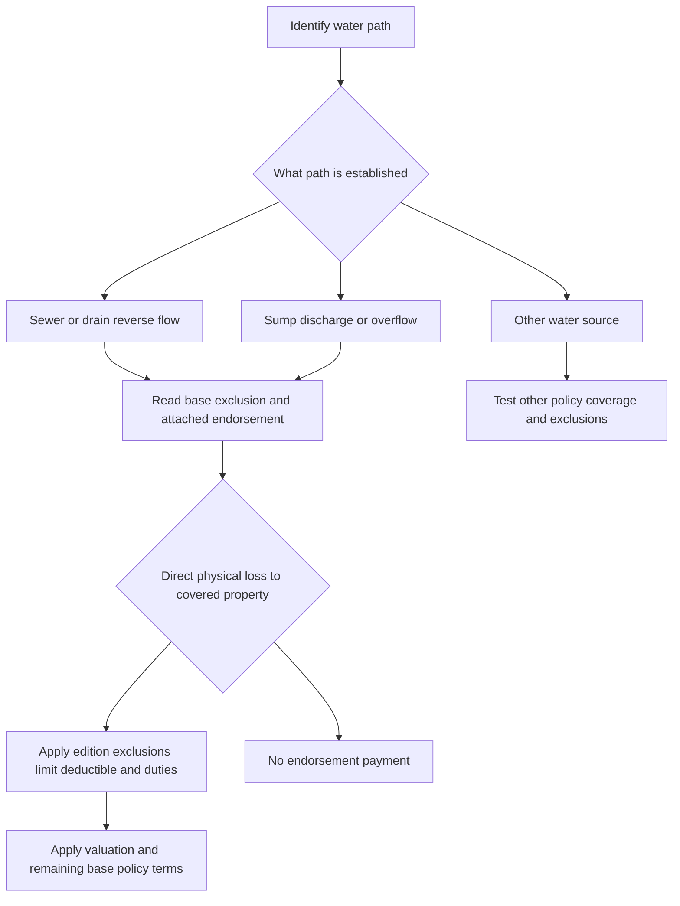

# Water Backup and Sump Discharge

## Short answer

A sewer or drain backup is water moving in reverse through a sewer or drain. Sump discharge or overflow is water released from, or overflowing from, a sump, sump pump, or related equipment. They are related but not interchangeable causes of loss. The first coverage question is the path of the water; the second is whether the applicable base form excludes that path and an attached endorsement writes back coverage for it.

These forms generally cover resulting direct physical loss to property that the base policy already insures. They do not automatically pay to replace the failed sewer, drain, sump, pump, valve, or related equipment. Flood, surface water, groundwater or water below ground, seepage or repeated leakage, maintenance or defective-condition losses, and avoidable post-loss damage remain recurring boundaries, but the exact wording varies by edition.

> **Do not use the training figures as policy terms.** The training material describes a $10,000 limit and $1,000 deductible, but the live form editions below state different amounts. Use the declarations, attached endorsement, base form, and applicable state overlay for the policy at issue. Source: repo://training/water-losses-101.md#L93-L107, repo://training/water-losses-101.md#L323-L329

## Coverage decision path

*This flow shows the source, attachment, covered-property, and adjustment sequence grounded in the cited forms.*

1. **Identify the water path.** Document whether water backed up through a sewer or drain, discharged or overflowed from a sump system, escaped from a plumbing fixture or appliance, entered through an opening, or came from flood, surface water, or subsurface water. Water near a drain or sump is not, by itself, proof of backup. Source: repo://training/water-losses-101.md#L61-L71, repo://training/water-losses-101.md#L93-L103
2. **Identify the property and insured interest.** Confirm whether the claim is for dwelling or building property, unit improvements and betterments, tenant personal property, contents, or another class already insured by the base policy.
3. **Read the base exclusion and the acting endorsement together.** The base forms exclude backup or sump loss and then point to the applicable endorsement. The endorsement writes back only the coverage it states; it does not turn excluded property, flood, groundwater, or an excluded maintenance condition into covered property.
4. **Apply the edition-specific event test, exclusions, limit, and deductible.** Then apply the valuation and loss-of-use provisions that remain in the base policy.
5. **Handle the claim duties while investigating.** Mitigate safely, preserve damaged property and failed components where reasonably possible, give notice within the applicable period, provide access and records, and preserve recovery rights. Do not treat an inspection or partial payment as a coverage admission.

## Comparison at a glance

| Form and acting endorsement | Base-form treatment | What the endorsement writes back | Limit and deductible | Distinctive duty or boundary |
| --- | --- | --- | --- | --- |
| **HO-3 — HO 04 90 (2010-10)**, effective 2010-10-01; superseded for policies effective on or after 2027-01-01, but still in force for policies written under it | HO-3 2024-03 excludes sewer/drain backup and sump overflow or discharge in X.8-X.9 | Direct physical loss to covered property caused by water backup or sump discharge/overflow; precipitation and system-repair costs remain excluded | **$5,000** aggregate; **$500** endorsement deductible | Accidental event; repeated seepage/leakage, precipitation, flood/surface water, subsurface water, and failed-equipment repair remain excluded. Source: repo://forms/HO/MS/HO-04-90/2010-10.md#L35-L105, repo://forms/HO/MS/HO-04-90/2010-10.md#L107-L215, repo://forms/HO/MS/HO-3/2024-03.md#L681-L691 |
| **HO-3 — HO 04 90 (2027-01)**, effective 2027-01-01 | HO-3 2024-03 X.8-X.9 excludes the same causes unless the water-backup endorsement is attached | Separately defines Water Backup and Sump Discharge or Overflow; covers direct physical loss and reasonable protective measures; expressly recognizes accidental sudden or gradual occurrence, subject to exclusions | **$10,000** aggregate; **$1,000** deductible per covered occurrence | Sump-system maintenance, known-obstruction, and below-grade backwater-valve duties; power failure and mechanical/electrical breakdown remain exclusion issues even though W.8 describes them as possible causes of an accidental sump event. Source: repo://forms/HO/MS/HO-04-90/2027-01.md#L41-L137, repo://forms/HO/MS/HO-04-90/2027-01.md#L139-L243, repo://forms/HO/MS/HO-04-90/2027-01.md#L291-L297, repo://forms/HO/MS/HO-04-90/2027-01.md#L399-L407, repo://forms/HO/MS/HO-04-90/2027-01.md#L497-L519 |
| **HO-6 — HO 04 91 (2019-03)**, effective 2019-03-01 | HO-6 2023-02 X.3 excludes water or sewage backing up through sewers, drains, sump systems, or related equipment unless the endorsement is attached | Water Backup includes sewer/drain backup and sump, pump, or related-equipment overflow/discharge; applies to covered building property, personal property, improvements and betterments, and listed reasonable water-removal, cleaning, drying, and debris expenses | **$7,500** aggregate; **$750** deductible | Notice must be given within **60 days after discovery**; unit-owner duties include access to common systems and cooperation with a property manager or condominium association. Source: repo://forms/HO/MS/HO-04-91/2019-03.md#L41-L111, repo://forms/HO/MS/HO-04-91/2019-03.md#L113-L203, repo://forms/HO/MS/HO-04-91/2019-03.md#L293-L307, repo://forms/HO/MS/HO-6/2023-02.md#L656-L666 |
| **HO-4 — HO 04 92 (2019-03)**, effective 2019-03-01 | HO-4 2021-10 X.14 excludes sewer/drain backup and sump overflow unless the endorsement is attached; X.15 says a sublimit alone does not create coverage | Direct physical loss to the tenant's **covered personal property** caused by water backup, including sewer/drain backup and sump discharge/overflow; it does not insure the landlord's building | **$2,500** aggregate; **$250** deductible | Notice must be given within **90 days after discovery**; the endorsement does not itself add a loss-of-use grant. Source: repo://forms/HO/MS/HO-04-92/2019-03.md#L41-L113, repo://forms/HO/MS/HO-04-92/2019-03.md#L115-L215, repo://forms/HO/MS/HO-04-92/2019-03.md#L293-L313, repo://forms/HO/MS/HO-4/2021-10.md#L746-L759 |
| **DP-3 — DP 04 95 (2021-05)**, effective 2021-05-01 | DP-3 2026-01 X.6 excludes sewer/drain backup and sump overflow unless the endorsement is attached; X.7 separately caps loss subject to a backup-and-sump-overflow limit | Direct physical loss to covered property caused by sewer/drain backup or sump, pump, or related-equipment overflow/discharge; emergency protection is covered when necessary and reasonable | **$5,000** aggregate; **$1,000** deductible per covered water-backup loss | Notice within **30 days after loss**; failed-system repair is excluded, while resulting direct physical loss can be covered. Source: repo://forms/DP/MS/DP-04-95/2021-05.md#L41-L111, repo://forms/DP/MS/DP-04-95/2021-05.md#L113-L215, repo://forms/DP/MS/DP-04-95/2021-05.md#L339-L359, repo://forms/DP/MS/DP-3/2026-01.md#L726-L741 |

The limit in each row is an aggregate endorsement limit, not a limit per room, item, insured, claim, or occurrence unless the cited edition says otherwise. A payment reduces the remaining amount. Always check the policy declarations for attachment and any scheduled or state-specific change.

## What each endorsement covers

### HO 04 90 (2010-10) — legacy HO-3

**HO 04 90 (2010-10) writes back** direct physical loss to covered property caused by water backing up through a sewer or drain, or water discharged or overflowing from a sump, sump pump, or related equipment. The 2010 wording requires the event to be accidental and pays only where the water event causes direct physical loss. Necessary, supported expenses to protect covered property from further damage may be included in settlement. Source: repo://forms/HO/MS/HO-04-90/2010-10.md#L35-L75, repo://forms/HO/MS/HO-04-90/2010-10.md#L499-L509

The endorsement **modifies** the base HO-3 exclusion by supplying this limited write-back; it does not replace the base form. The current supplied HO-3 base wording **preserves** the exclusion unless a water-backup endorsement is attached and separately says sump overflow or discharge is excluded. Source: repo://forms/HO/MS/HO-3/2024-03.md#L681-L691

The 2010 edition has a **$5,000** limit for all covered loss, shared by all insureds and covered property, and a **$500** water-backup endorsement deductible applied to the total covered loss from one occurrence. The deductible is applied after covered loss is determined and is not applied separately to each damaged item. Source: repo://forms/HO/MS/HO-04-90/2010-10.md#L107-L127, repo://forms/HO/MS/HO-04-90/2010-10.md#L175-L205

The write-back does not cover precipitation, including precipitation entering through an opening, or precipitation merely contacting a sewer, drain, sump, or related equipment. It does not pay solely to repair, replace, clear, or correct the sewer, drain, sump, pump, or related equipment; it pays resulting direct physical loss to covered property when the covered water event caused it. Flood, surface water, subsurface water, repeated or continuous seepage, pollutants, mold, and neglect to protect property remain excluded. Source: repo://forms/HO/MS/HO-04-90/2010-10.md#L77-L105, repo://forms/HO/MS/HO-04-90/2010-10.md#L217-L301

### HO 04 90 (2027-01) — current HO-3 edition in the repository

**HO 04 90 (2027-01) writes back** two named causes: Water Backup through a sewer or drain, and Sump Discharge or Overflow from a sump, sump pump, or related equipment. The sump system definition includes the pit, basin, discharge line, valve, alarm, and related equipment. The endorsement covers direct physical loss and reasonable, necessary protective measures after either covered event. The 2027 wording expressly says the event may occur suddenly or gradually, but it still requires direct physical loss during the policy period. Source: repo://forms/HO/MS/HO-04-90/2027-01.md#L41-L69

The 2027 endorsement **modifies** the base HO-3 exclusions identified in X.8-X.9: the base form excludes backup and sump discharge unless the endorsement is attached, and the endorsement supplies the limited grant. It **preserves** the rest of the base policy unless expressly changed. Source: repo://forms/HO/MS/HO-3/2024-03.md#L681-L691, repo://forms/HO/MS/HO-04-90/2027-01.md#L15-L39

The 2027 edition raises the aggregate limit to **$10,000** and the endorsement deductible to **$1,000**. The limit includes direct physical loss and covered expenses, is reduced by payments, and is not increased by multiple insureds, locations, claims, or types of property. The deductible applies once to damage from the same occurrence and is subtracted from covered direct physical damage before payment. Source: repo://forms/HO/MS/HO-04-90/2027-01.md#L139-L179, repo://forms/HO/MS/HO-04-90/2027-01.md#L189-L243

The 2027 edition **preserves** exclusions for flood, surface water that has not backed up through a sewer or drain, subsurface water, openings, runoff, repeated leakage or continuous discharge, pollutants and microbial conditions, failed or inadequately maintained systems, power failure, mechanical or electrical breakdown, and repair or improvement of the failed equipment. It also requires a backwater valve for finished areas below grade and requires the insured to maintain any required valve in operable condition. A sump event therefore requires a fact-specific separation between the covered water-caused property damage and an excluded failed component or excluded contributing condition. Source: repo://forms/HO/MS/HO-04-90/2027-01.md#L71-L137, repo://forms/HO/MS/HO-04-90/2027-01.md#L245-L365, repo://forms/HO/MS/HO-04-90/2027-01.md#L497-L519

This edition is effective **2027-01-01**. The supplied 2010-10 edition is explicitly marked **superseded by the 2027-01 edition for policies effective on or after 2027-01-01**, while remaining in force for policies written under the older edition. Do not apply the 2027 limit or deductible to a policy governed by the 2010-10 endorsement. Source: repo://forms/HO/MS/HO-04-90/2010-10.md#L1-L9, repo://forms/HO/MS/HO-04-90/2027-01.md#L1-L8

### HO 04 90 (2027-01) filing memorandum

The filing memorandum is explanatory filing material, not a substitute for the attached endorsement. It identifies the revised **$10,000** maximum, **$1,000** deductible, and requirement for a backwater valve in finished areas below grade; it also explains revisions clarifying backup or overflow exclusions, sump-discharge wording, notice information, and post-loss duties. Apply the filed form as the contract: the endorsement says it is effective only when attached and controls a conflicting policy provision, while unmodified policy terms remain in effect. Source: repo://memoranda/HO-04-90-2027-01.md#L143-L151, repo://memoranda/HO-04-90-2027-01.md#L463-L465, repo://memoranda/HO-04-90-2027-01.md#L499-L519, repo://forms/HO/MS/HO-04-90/2027-01.md#L13-L39

Do not conflate the form's **30-day notice-after-discovery** condition with later proof-of-loss requirements. The memorandum separately describes a signed, sworn proof of loss due within **60 days after loss** and says notice and proof of loss are distinct duties; verify the operative policy definitions and applicable law for the claim. Source: repo://forms/HO/MS/HO-04-90/2027-01.md#L367-L379, repo://memoranda/HO-04-90-2027-01.md#L499-L521, repo://memoranda/HO-04-90-2027-01.md#L641-L649

### HO 04 91 (2019-03) — unit-owner HO-6

**HO 04 91 (2019-03) writes back** Water Backup defined to include sewer or drain backup and overflow or discharge from a sump, sump pump, or related equipment. It covers direct physical loss to covered property, including covered building property in which the unit owner has an insurable interest, personal property, improvements and betterments, permanently installed fixtures, appliances, floor coverings, interior finishes, and reasonable water-removal, cleaning, drying, and debris expenses. Source: repo://forms/HO/MS/HO-04-91/2019-03.md#L41-L79

The endorsement **modifies** the HO-6 base exclusion. The HO-6 2023-02 base form **preserves** its exclusion for water or sewage backing up through sewers, drains, sump systems, or related equipment unless HO 04 91 is attached. Source: repo://forms/HO/MS/HO-6/2023-02.md#L656-L666

The endorsement limit is **$7,500** for the sum of covered water-backup and sump-overflow losses, regardless of the number of insureds, claims, locations, or items. The **$750** deductible applies to the total covered loss and covered expense from the same water-backup loss, after exclusions are applied. Source: repo://forms/HO/MS/HO-04-91/2019-03.md#L113-L161, repo://forms/HO/MS/HO-04-91/2019-03.md#L163-L203

Flood, surface water, water below ground, body-of-water overflow, openings, continuous or repeated leakage, neglect, known uncorrected conditions, and failed-system repair remain excluded. The endorsement also says the base policy's property eligibility and legal-responsibility boundaries remain in place. Source: repo://forms/HO/MS/HO-04-91/2019-03.md#L81-L111, repo://forms/HO/MS/HO-04-91/2019-03.md#L205-L291

The unit owner must give notice within **60 days after discovering the loss**, protect property, preserve damaged property and evidence, provide records and access, and cooperate with inspection and adjustment. The special requirements add practical condominium duties: cooperate with the property manager or association, report defects in common plumbing or drainage systems, and obtain access to common areas when reasonably necessary. Source: repo://forms/HO/MS/HO-04-91/2019-03.md#L293-L421, repo://forms/HO/MS/HO-04-91/2019-03.md#L423-L499

### HO 04 92 (2019-03) — tenant HO-4

**HO 04 92 (2019-03) writes back** direct physical loss to the tenant's covered personal property caused by sewer/drain backup or sump, pump, or related-equipment overflow/discharge. It does not insure the landlord's building, and it does not create coverage for property that the HO-4 base policy does not cover. Source: repo://forms/HO/MS/HO-04-92/2019-03.md#L41-L65, repo://forms/HO/MS/HO-04-92/2019-03.md#L101-L113

The endorsement **modifies** HO-4's exclusion. The HO-4 2021-10 base form **preserves** the exclusion unless HO 04 92 is attached and warns that a water-backup sublimit by itself does not create coverage. Source: repo://forms/HO/MS/HO-4/2021-10.md#L746-L759

The HO-4 endorsement's aggregate limit is **$2,500**. Its **$250** deductible applies only to covered water-backup loss, after the covered amount is determined, and no payment is made when the covered amount does not exceed the deductible. Source: repo://forms/HO/MS/HO-04-92/2019-03.md#L115-L163, repo://forms/HO/MS/HO-04-92/2019-03.md#L165-L215

The endorsement preserves exclusions for flood and surface water, groundwater, precipitation through openings, plumbing-fixture or appliance water that is not a backup, wear and tear, failed maintenance, mold or bacteria, pollutants, contamination, and avoidable additional damage. It expressly allows the backup to result from a blockage, obstruction, or mechanical breakdown, but it does not cover loss consisting solely of wear, deterioration, corrosion, or mechanical failure of equipment, or the cost to repair failed sump equipment. Source: repo://forms/HO/MS/HO-04-92/2019-03.md#L55-L73, repo://forms/HO/MS/HO-04-92/2019-03.md#L217-L301

The tenant must give notice within **90 days after discovery**, protect and preserve property, keep an inventory when requested, provide records and a sworn proof of loss when requested, and preserve recovery rights. The endorsement's grant is personal-property coverage; it does not itself add Coverage D loss-of-use benefits. Any additional living expense or fair-rental-value question must be tested against the base HO-4 Coverage D terms and the definition of covered loss, not assumed from the backup endorsement. Source: repo://forms/HO/MS/HO-04-92/2019-03.md#L303-L395, repo://forms/HO/MS/HO-04-92/2019-03.md#L451-L499, repo://forms/HO/MS/HO-4/2021-10.md#L381-L409

### DP 04 95 (2021-05) — dwelling property

**DP 04 95 (2021-05) writes back** direct physical loss to covered property caused by water or waterborne material backing up through a sewer or drain, or overflowing or discharging from a sump, sump pump, or related equipment. It covers reasonable emergency measures necessary to protect covered property and **preserves** the policy's other terms unless the endorsement modifies them. Source: repo://forms/DP/MS/DP-04-95/2021-05.md#L13-L39, repo://forms/DP/MS/DP-04-95/2021-05.md#L41-L59

The endorsement **modifies** DP-3's base exclusion. DP-3 2026-01 **preserves** the exclusion in X.6 but expressly directs the reader to DP 04 95 for the endorsement write-back; X.7 separately says loss subject to a backup-and-sump-overflow limit is not covered beyond that limit. Source: repo://forms/DP/MS/DP-3/2026-01.md#L726-L741

DP 04 95 has a **$5,000** aggregate limit for water backup and sump overflow, reduced by payments, and a **$1,000** deductible applied once to the covered water-backup loss. The limit does not increase for multiple insureds, claims, damaged properties, or related loss; the deductible does not apply to excluded damage. Source: repo://forms/DP/MS/DP-04-95/2021-05.md#L113-L145, repo://forms/DP/MS/DP-04-95/2021-05.md#L175-L215

The endorsement preserves exclusions for openings, flood and surface water, subsurface water, gradual or continuous seepage, pollutants, mold and bacteria, inadequate maintenance, power or utility interruption, mechanical or electrical breakdown, defective or improperly installed systems, freezing in a vacant dwelling, and the cost to repair or improve the failed sewer, drain, sump, pump, or related equipment. Resulting direct physical loss may be covered when the water backup itself is covered. Source: repo://forms/DP/MS/DP-04-95/2021-05.md#L61-L81, repo://forms/DP/MS/DP-04-95/2021-05.md#L217-L337

The DP endorsement requires prompt notice, reasonable protection and emergency repairs, preservation of damaged property and evidence, inspection access, records and cooperation, and maintenance of the drainage system, sump, pump, alarm, and related equipment. Its detailed conditions include a **30-day** reporting requirement. Source: repo://forms/DP/MS/DP-04-95/2021-05.md#L339-L375, repo://forms/DP/MS/DP-04-95/2021-05.md#L441-L495

### DP-3 2026-01's internal additional-coverage issue

DP-3 2026-01 also contains a separate base-form additional-coverage provision, E.67, that says it will pay direct physical loss caused by sudden-and-accidental water backup through a sewer, drain, sump, or related system. E.68 excludes neglect, lack of maintenance, deterioration, known conditions, flood, surface water, body-of-water overflow, and below-ground water. However, the same edition's X.6 says backup and sump overflow are excluded unless DP 04 95 is attached, and X.7 refers to a backup-and-sump-overflow limit. The form does not state a standalone amount in E.67. Treat this as an edition-specific control point: verify the declarations and attachment, then apply DP 04 95's explicit $5,000/$1,000 terms when that endorsement is attached rather than inferring a limit from E.67. Source: repo://forms/DP/MS/DP-3/2026-01.md#L541-L557, repo://forms/DP/MS/DP-3/2026-01.md#L726-L741, repo://forms/DP/MS/DP-04-95/2021-05.md#L113-L123

## Exclusions that commonly decide the claim

| Reported fact | Coverage significance |
| --- | --- |
| Water rose through a floor drain, toilet, or other drain opening | Potential sewer/drain backup; establish the first appearance and path, then apply the attached endorsement's definition. A blocked drain is not automatically a backup. Source: repo://training/water-losses-101.md#L93-L103, repo://training/water-losses-101.md#L283-L301 |
| Water overflowed from a sump pit or sump pump | Potential sump discharge/overflow; inspect the pit, pump, discharge path, power, alarm, and equipment. Separate resulting property damage from excluded repair or replacement of the failed equipment. Source: repo://training/water-losses-101.md#L101-L107, repo://forms/HO/MS/HO-04-90/2027-01.md#L49-L65 |
| Rain or runoff entered through a window, foundation, roof, wall, or exterior opening | Usually the precipitation, flood, surface-water, opening, or subsurface-water exclusion—not backup—unless the exact edition says the covered backup directly caused the loss. Source: repo://forms/HO/MS/HO-04-90/2010-10.md#L77-L89, repo://forms/HO/MS/HO-04-90/2027-01.md#L71-L79 |
| A pump failed, power was interrupted, or a drain was not maintained | Determine whether the edition treats the event as an accidental source while separately excluding loss caused by failure to maintain, power failure, mechanical breakdown, or an inadequately installed system. Do not equate equipment failure with covered water damage. Source: repo://forms/HO/MS/HO-04-90/2027-01.md#L55-L83, repo://forms/HO/MS/HO-04-90/2027-01.md#L289-L297 |
| The claim is for clearing a clog, replacing a pump, installing a backwater valve, or upgrading drainage | These are generally repair, maintenance, prevention, or improvement costs, not resulting direct physical loss to covered property. Source: repo://forms/HO/MS/HO-04-90/2027-01.md#L99-L103, repo://forms/DP/MS/DP-04-95/2021-05.md#L71-L81, repo://forms/HO/MS/HO-04-92/2019-03.md#L65-L73 |
| Damage is described only as staining, odor, mold, contamination, or loss of use | Establish direct physical loss and the covered water event first. Mold, microbial remediation, contamination, consequential loss, and loss of use may be separately excluded or require a base-policy grant. Source: repo://forms/HO/MS/HO-04-90/2027-01.md#L279-L285, repo://forms/HO/MS/HO-04-92/2019-03.md#L263-L281, repo://bulletins/IL/idoi-2017-10-water-backup-disclosure.md#L39-L41 |

The source, path, and resulting damage must be documented separately. A visible stain or the claimant's use of the word “flood” does not establish the cause. Preserve photographs, plumber or municipal reports, repair invoices, failed components, moisture records, and the timeline of discovery and mitigation. Source: repo://training/water-losses-101.md#L85-L99, repo://training/water-losses-101.md#L177-L195, repo://training/water-losses-101.md#L281-L301

## Duties after loss and investigation controls

Across these endorsements, the operational sequence is consistent even though deadlines differ:

1. **Make the site safe and mitigate.** Use reasonable emergency measures to remove standing water, dry or protect property, and stop an active source when safe. Do not promise coverage while directing mitigation. Source: repo://training/water-losses-101.md#L185-L195, repo://forms/HO/MS/HO-04-90/2027-01.md#L81-L97
2. **Notify on time.** Use the exact endorsement deadline: HO-3 2010 and 2027—30 days under the cited conditions; HO-6—60 days after discovery; HO-4—90 days after discovery; DP 04 95—30 days after loss. Prompt notice is still the safer operational rule. Source: repo://forms/HO/MS/HO-04-90/2010-10.md#L303-L315, repo://forms/HO/MS/HO-04-90/2027-01.md#L367-L379, repo://forms/HO/MS/HO-04-91/2019-03.md#L293-L307, repo://forms/HO/MS/HO-04-92/2019-03.md#L303-L313, repo://forms/DP/MS/DP-04-95/2021-05.md#L339-L359
3. **Preserve proof.** Keep damaged property, failed pumps/valves/pipes and other components when reasonably possible; if health, safety, or emergency repairs require disposal, preserve photographs, reports, invoices, and other evidence. Source: repo://forms/HO/MS/HO-04-90/2027-01.md#L89-L97, repo://forms/HO/MS/HO-04-91/2019-03.md#L103-L109, repo://forms/HO/MS/HO-04-92/2019-03.md#L75-L93
4. **Establish cause and scope.** The insured must identify or support the water path and direct physical damage; the insurer may inspect the premises, equipment, records, estimates, and repairs. An inspection is not an admission of coverage. Source: repo://forms/HO/MS/HO-04-90/2027-01.md#L125-L137, repo://forms/HO/MS/HO-04-90/2027-01.md#L367-L425
5. **Apply limits and recovery rules.** Aggregate endorsement limits are reduced by payment; deductibles apply only to covered amounts; other insurance and subrogation can affect payment but do not increase the endorsement limit. Source: repo://forms/HO/MS/HO-04-90/2027-01.md#L139-L179, repo://forms/HO/MS/HO-04-91/2019-03.md#L113-L161, repo://forms/DP/MS/DP-04-95/2021-05.md#L113-L145

## Valuation, loss of use, and failed equipment

- **Failed system versus resulting damage:** The cost to repair or replace the failed sewer, drain, sump, pump, valve, or related equipment is excluded in the cited endorsements. Resulting direct physical loss to covered property may be payable if the water event is covered. Source: repo://forms/HO/MS/HO-04-90/2010-10.md#L89-L105, repo://forms/HO/MS/HO-04-90/2027-01.md#L99-L103, repo://forms/DP/MS/DP-04-95/2021-05.md#L71-L81
- **Property class matters:** HO 04 91 expressly reaches unit building property, improvements and betterments, fixtures, appliances, floor coverings, interior finishes, and covered personal property. HO 04 92 is limited to the tenant's covered personal property. The DP endorsement applies only to property already covered under the DP policy. Source: repo://forms/HO/MS/HO-04-91/2019-03.md#L53-L79, repo://forms/HO/MS/HO-04-92/2019-03.md#L41-L65, repo://forms/DP/MS/DP-04-95/2021-05.md#L29-L35
- **Valuation remains edition-specific:** The DP endorsement settles personal property at actual cash value. The tenant endorsement likewise states actual-cash-value settlement for personal property. Do not turn an endorsement limit into replacement-cost entitlement. Source: repo://forms/DP/MS/DP-04-95/2021-05.md#L497-L509, repo://forms/HO/MS/HO-04-92/2019-03.md#L451-L479
- **Loss of use is not automatic:** The backup endorsements' coverage grants are direct-physical-loss grants to stated property, not a generic promise of additional living expense or fair rental value. Analyze the base Coverage D terms, the covered-property class, and any applicable exclusion. In Illinois, the disclosure must not state or suggest that water backup includes living expenses unless the policy provides that protection. Source: repo://forms/HO/MS/HO-04-92/2019-03.md#L41-L49, repo://forms/HO/MS/HO-3/2024-03.md#L363-L411, repo://forms/HO/MS/HO-4/2021-10.md#L381-L409, repo://forms/HO/MS/HO-6/2023-02.md#L300-L366, repo://bulletins/IL/idoi-2017-10-water-backup-disclosure.md#L39-L41

## Illinois disclosure overlay — not contract language

Illinois Bulletin IDOI-2017-10 is a **state-overlay disclosure and claims-handling requirement**, not a replacement for the policy or endorsement. For personal-lines property insurance issued or renewed by an admitted insurer in Illinois, it requires a clear, conspicuous, plain-language disclosure when water backup is included, limited, excluded, available by endorsement, or unavailable. The disclosure must distinguish backup from flood, surface water, seepage, and other water damage; identify whether sewer, drain, or sump events are addressed; state the applicable limit and deductible; and identify material exclusions and conditions. Source: repo://bulletins/IL/idoi-2017-10-water-backup-disclosure.md#L13-L43, repo://bulletins/IL/idoi-2017-10-water-backup-disclosure.md#L47-L71, repo://bulletins/IL/idoi-2017-10-water-backup-disclosure.md#L133-L171

The bulletin says the disclosure must identify the most the insurer will pay and states **$5,000** in B.2.6. That is a disclosure-overlay statement; it does not replace the contract's edition-specific limit. The cited endorsements state $2,500, $5,000, $7,500, or $10,000 depending on form and edition. Resolve any apparent mismatch by applying the filed policy and attached endorsement, not by importing the bulletin amount into every policy. Source: repo://bulletins/IL/idoi-2017-10-water-backup-disclosure.md#L55-L65, repo://forms/HO/MS/HO-04-92/2019-03.md#L115-L123, repo://forms/HO/MS/HO-04-91/2019-03.md#L113-L121, repo://forms/HO/MS/HO-04-90/2027-01.md#L139-L151

The bulletin also requires disclosure in connection with sale, issuance, renewal, or a material endorsement change, a retainable paper or electronic format, records of the version delivered and the applicant's selection or rejection, and consistency among declarations, quotations, producer communications, policy language, and claims handling. Source: repo://bulletins/IL/idoi-2017-10-water-backup-disclosure.md#L67-L101, repo://bulletins/IL/idoi-2017-10-water-backup-disclosure.md#L231-L261

For a water-backup claim, the bulletin requires a reasonable investigation before denial or limitation, evaluation of the actual policy and endorsement, a written explanation identifying the relied-on provision and its application to known facts, and payment of any undisputed covered portion unless barred by policy or law. Those standards govern Illinois claim handling; they do not create coverage that the contract excludes. Source: repo://bulletins/IL/idoi-2017-10-water-backup-disclosure.md#L189-L229

## Edition and attachment checklist

Before accepting or denying a claim, record:

- base form and edition (HO-3, HO-4, HO-6, or DP-3);
- acting endorsement number, edition, effective date, and whether it was attached for the loss date;
- whether the policy is governed by HO 04 90 (2010-10) or HO 04 90 (2027-01), including the 2027 supersession rule;
- the exact water path and whether the water event was sudden, accidental, gradual, repeated, or continuous under that edition;
- covered property class and the insured's ownership or legal responsibility;
- applicable aggregate limit, remaining limit, deductible, valuation basis, and any base-policy loss-of-use provision;
- excluded source or contributing condition, including flood, surface water, groundwater, opening, maintenance, power, mechanical failure, failed equipment, or contamination; and
- notice date, mitigation, preservation, inspection, proof-of-loss, other-insurance, and recovery-rights compliance.

If the facts do not establish the source, do not label the loss from the visible damage alone. Investigate the water path and preserve the evidence needed to distinguish sewer/drain backup, sump discharge, plumbing discharge, surface water, and subsurface water. Source: repo://training/water-losses-101.md#L257-L279, repo://training/water-losses-101.md#L399-L425
