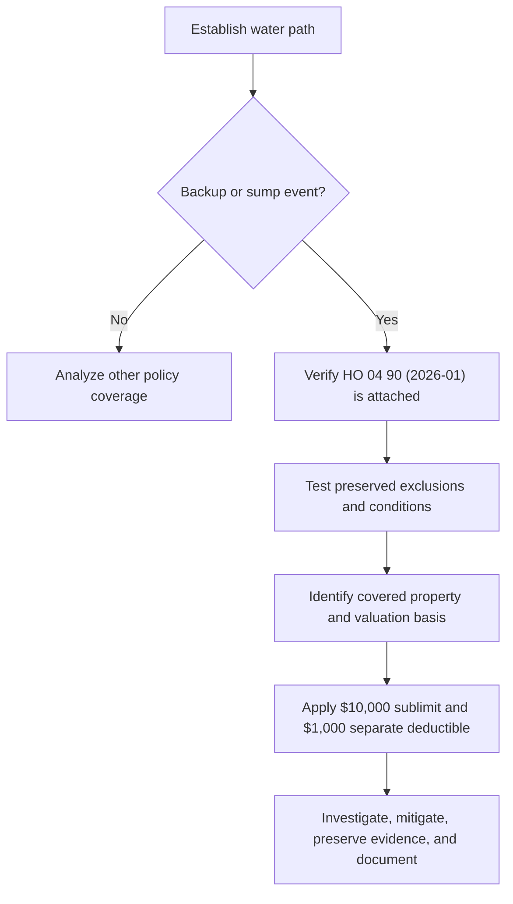

# Water Backup and Sump Overflow

## Short answer

**HO 04 90 (2026-01)** is an HO-3 endorsement. It replaces the 2010-10 edition for policies written on or after **2026-01-01**, and applies only when attached. It covers direct physical loss to property insured under Coverages A, B, and C caused by water that backs up through a sewer or drain, or that overflows or is discharged from a sump, sump pump, or related equipment—even when the event results from mechanical breakdown. Source: `repo://forms/HO/MS/HO-04-90/2026-01.md#L1-L11`

The endorsement provides a **$10,000 maximum for all loss in one policy period**, unless the Declarations show a higher endorsement limit. That sublimit is part of, not additional to, the Coverage A, B, and C limits. A separate **$1,000 deductible applies to each loss**; the Section I deductible does not apply to this coverage. Source: `repo://forms/HO/MS/HO-04-90/2026-01.md#L13-L23`

> Training material may use illustrative figures. Do not import those figures as policy terms; use the attached endorsement, Declarations, base form, and applicable state requirements. Source: `repo://training/water-losses-101.md#L93-L107`

## Decision path

```mermaid
flowchart TD
  A["Establish water path"] --> B{"Backup or sump event?"}
  B -- No --> C["Analyze other policy coverage"]
  B -- Yes --> D["Verify HO 04 90 (2026-01) is attached"]
  D --> E["Test preserved exclusions and conditions"]
  E --> F["Identify covered property and valuation basis"]
  F --> G["Apply $10,000 sublimit and $1,000 separate deductible"]
  G --> H["Investigate, mitigate, preserve evidence, and document"]
```

A visible stain or a report that the loss was a “flood” does not establish the cause. Confirm whether water reversed through a drain or sewer, escaped from a sump system, entered through an opening, or came from surface or below-ground water. Source: `repo://training/water-losses-101.md#L89-L103`; `repo://manuals/claims/manual.md#L87-L103`

## HO 04 90 (2026-01): grant and boundaries

### Coverage grant

The operative trigger is: **“We cover direct physical loss to property insured by this policy”** caused by Water Backup or Sump Discharge or Overflow. Water Backup is water backing up through a sewer or drain; Sump Discharge or Overflow is water discharging or overflowing from a sump, sump pump, or related equipment located on the residence premises. A Sump System includes the pit, basin, discharge line, valve, alarm, and connected equipment. Source: `repo://forms/HO/MS/HO-04-90/2026-01.md#L62-L103`

The event may result from mechanical failure, electrical interruption, obstruction, accidental activation, or inability of the sump system to remove water, but **“the cause of the discharge or overflow must be accidental.”** The endorsement covers resulting direct physical damage, including damage from the force, weight, pressure, movement, or waterborne material accompanying covered water. It also covers reasonable and necessary measures to protect insured property from further direct physical loss. Source: `repo://forms/HO/MS/HO-04-90/2026-01.md#L82-L117`

The 2026 wording covers loss occurring **“suddenly or gradually,”** provided direct physical loss occurs during the policy period. This does not eliminate the endorsement's exclusions or conditions. Source: `repo://forms/HO/MS/HO-04-90/2026-01.md#L113-L117`

### Preserved flood and groundwater exclusions

The endorsement **preserves** the HO-3 flood exclusion: it says, **“We do not cover loss caused by flood,”** including concurrent or sequential contribution. It also excludes surface water that has not backed up through a sewer or drain. Source: `repo://forms/HO/MS/HO-04-90/2026-01.md#L119-L126`

It **preserves** the below-ground-water boundary: water that seeps, leaks, flows, or presses through a building is excluded, except for loss otherwise caused by Water Backup. Thus, evidence that water was below grade does not by itself establish a covered backup; the covered backup must be the cause of the direct physical loss. Source: `repo://forms/HO/MS/HO-04-90/2026-01.md#L128-L130`

Other source boundaries include plumbing-fixture or appliance overflow, roof drains and exterior drainage, and loss not directly caused by the covered water event. The exact exceptions for a loss caused by Water Backup or Sump Discharge or Overflow must be read with the causation requirement. Source: `repo://forms/HO/MS/HO-04-90/2026-01.md#L132-L138;L175-L179`

### Maintenance and backflow conditions

The endorsement excludes loss caused by failure to maintain a Sump System when that failure materially contributes to the loss. It requires reasonable care to keep the system serviceable, promptly repair known damage or malfunction, and keep accessible drains, discharge lines, and related openings free from known obstructions when safely accessible. Source: `repo://forms/HO/MS/HO-04-90/2026-01.md#L140-L150`

For a residence with a finished area below grade, coverage applies only if a backwater valve or equivalent backflow-prevention device was installed and operable on the sewer line serving the premises at the time of loss. This requirement is new in 2026-01 and did not appear in 2010-10. Source: `repo://forms/HO/MS/HO-04-90/2026-01.md#L42-L47`

These provisions distinguish resulting property damage from repair, maintenance, or improvement of the failed system. The claim file should separately identify the water path, failed component, maintenance history, valve condition, and resulting damage. Preserve equipment and records when reasonably possible. Source: `repo://forms/HO/MS/HO-04-90/2026-01.md#L152-L170`; `repo://manuals/claims/manual.md#L75-L103`

## Limits, deductible, and valuation

- **Sublimit:** $10,000 for all endorsement loss in one policy period, unless a higher amount appears in the Declarations; it is part of the Coverage A, B, and C limits. Source: `repo://forms/HO/MS/HO-04-90/2026-01.md#L13-L18`
- **Separate deductible:** $1,000 for each loss; the Section I deductible does not apply. Source: `repo://forms/HO/MS/HO-04-90/2026-01.md#L20-L23`
- **Coverage A and B valuation:** the basis stated in the policy to which the endorsement attaches. Source: `repo://forms/HO/MS/HO-04-90/2026-01.md#L49-L52`
- **Coverage C valuation:** actual cash value, even if a replacement-cost personal-property endorsement exists, unless the Declarations state otherwise for this endorsement. Source: `repo://forms/HO/MS/HO-04-90/2026-01.md#L51-L54`

Do not convert the endorsement sublimit into replacement-cost entitlement, and do not apply the Section I deductible in addition to the endorsement deductible. Determine covered damage first, then apply the applicable valuation and limits. The claims manual likewise requires coverage analysis and damage evaluation to remain distinct. Source: `repo://manuals/claims/manual.md#L63-L73`

## Relationship to the HO-3 base exclusions

HO-3 2024-03 **excludes** water backing up through sewers, drains, or sump systems unless a water-backup endorsement is attached, and **excludes** sump overflow or discharge; its “backup and sump overflow limit” does not itself create coverage. HO 04 90 (2026-01) **modifies** those exclusions by supplying only the stated endorsement grant. The base form **preserves** flood, surface-water, and below-ground-water exclusions, while the endorsement adds its own detailed boundaries. Read both documents together; attachment does not create broader coverage than the endorsement and policy state. Source: `repo://forms/HO/MS/HO-3/2024-03.md#L593-L601`; `repo://forms/HO/MS/HO-04-90/2026-01.md#L1-L4;L25-L33`

The directional relationship is therefore: the HO-3 base form **excludes** the peril; HO 04 90 (2026-01) **modifies** that exclusion with a limited grant; and the endorsement **preserves** unmodified policy terms. The endorsement controls only where it conflicts with the policy. Source: `repo://forms/HO/MS/HO-04-90/2026-01.md#L25-L36`

## Neighboring editions

| Edition | Material terms |
| --- | --- |
| HO 04 90 (2010-10) | Covered accidental direct physical loss from backup or sump discharge/overflow; **$5,000** limit and **$500** deductible. It excludes precipitation, repeated or continuous seepage, and repair or replacement of the failed system. Source: `repo://forms/HO/MS/HO-04-90/2010-10.md#L35-L59;L77-L105;L107-L127;L157-L167` |
| **HO 04 90 (2026-01)** | **$10,000** policy-period sublimit and **$1,000** separate deductible; sudden or gradual covered events; new finished-below-grade backwater-valve requirement; Coverage C actual-cash-value settlement unless the Declarations say otherwise. Source: `repo://forms/HO/MS/HO-04-90/2026-01.md#L13-L23;L42-L54;L113-L150` |
| HO 04 90 (2027-01) | Later repository edition, effective 2027-01-01. It uses different wording and must not be backdated to a 2026-01 policy. Source: `repo://forms/HO/MS/HO-04-90/2027-01.md#L1-L8` |

The governing policy is the edition attached and effective for the loss—not the training material, a neighboring form, or a later filing. Record the base form, endorsement edition, effective date, attachment, Declarations limit, water path, property class, valuation basis, deductible, maintenance facts, valve condition, and mitigation evidence. Source: `repo://manuals/claims/manual.md#L39-L49;L87-L103`
