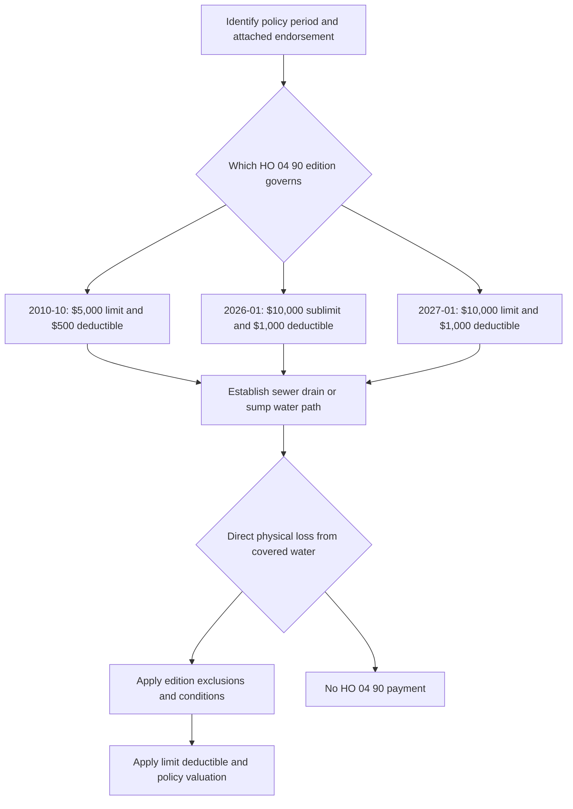

# Water Backup and Sump Overflow

## Short answer

Start with the **governing attached endorsement edition and its effective-date applicability**, then establish the water path. HO 04 90 is limited coverage for direct physical loss to insured or covered property caused by water backing up through a sewer or drain, or water discharged or overflowing from a sump, sump pump, or related equipment. It is not a general flood endorsement and does not automatically pay to repair the failed system.

The key edition change is material: **HO 04 90 (2010-10)** applies to policies written under that edition and has a $5,000 limit and $500 deductible; **HO 04 90 (2026-01)** replaces 2010-10 for policies written on or after 2026-01-01 and states a $10,000 sublimit and $1,000 deductible; **HO 04 90 (2027-01)** is effective 2027-01-01, states a $10,000 limit and $1,000 deductible, and is the applicable later edition when attached under its policy package. Do not apply a newer edition retroactively. Source: repo://forms/HO/MS/HO-04-90/2010-10.md#L1-L9, repo://forms/HO/MS/HO-04-90/2026-01.md#L1-L4, repo://forms/HO/MS/HO-04-90/2027-01.md#L1-L6

## Coverage decision flow

```mermaid
flowchart TD
  A["Identify policy period and attached endorsement"] --> B{"Which HO 04 90 edition governs"}
  B --> C["2010-10: $5,000 limit and $500 deductible"]
  B --> D["2026-01: $10,000 sublimit and $1,000 deductible"]
  B --> E["2027-01: $10,000 limit and $1,000 deductible"]
  C --> F["Establish sewer drain or sump water path"]
  D --> F
  E --> F
  F --> G{"Direct physical loss from covered water"}
  G --> H["Apply edition exclusions and conditions"]
  G --> I["No HO 04 90 payment"]
  H --> J["Apply limit deductible and policy valuation"]
```

*This flow shows the edition-first coverage sequence; the cited endorsement controls the exact result.*

## Edition control and authority boundary

### HO 04 90 (2010-10)

**HO 04 90 (2010-10) modifies** the applicable policy by covering accidental direct physical loss to covered property caused by water backing up through a sewer or drain, or water discharged or overflowing from a sump, sump pump, or related equipment. The water event must cause the direct physical loss; the endorsement does not pay merely because water is present. It **preserves** the policy terms and exclusions except where it expressly changes them. Source: repo://forms/HO/MS/HO-04-90/2010-10.md#L13-L33, repo://forms/HO/MS/HO-04-90/2010-10.md#L35-L75

The 2010-10 edition has a **$5,000** maximum for covered water-backup and sump-overflow loss and a separate **$500** deductible applied to covered loss. It excludes precipitation, flood and surface water, subsurface water, repeated or continuous seepage, maintenance or neglect, and the cost to repair, replace, clear, or correct the failed sewer, drain, sump, pump, or related equipment. Resulting direct physical loss may be covered when the water event itself qualifies. Source: repo://forms/HO/MS/HO-04-90/2010-10.md#L77-L105, repo://forms/HO/MS/HO-04-90/2010-10.md#L107-L127, repo://forms/HO/MS/HO-04-90/2010-10.md#L157-L167, repo://forms/HO/MS/HO-04-90/2010-10.md#L211-L235

### HO 04 90 (2026-01)

**HO 04 90 (2026-01) replaces** the 2010-10 edition for policies written on or after **2026-01-01**. Its grant covers direct physical loss to Coverage A, B, and C property caused by water or waterborne material backing up through sewers or drains, or overflowing or being discharged from a sump, sump pump, or related equipment, including when the event results from mechanical breakdown. Source: repo://forms/HO/MS/HO-04-90/2026-01.md#L1-L11

The 2026-01 edition states a **$10,000 sublimit** for all loss under the endorsement in one policy period, unless a higher endorsement limit appears in the Declarations. The sublimit is part of, not additional to, the Coverage A, B, and C limits. A separate **$1,000 deductible** applies to each loss, and the Section I deductible does not apply to this coverage. Source: repo://forms/HO/MS/HO-04-90/2026-01.md#L13-L23

**HO 04 90 (2026-01) preserves** flood, surface water, waves, tidal water, storm surge, body-of-water overflow, and Section I Exclusions A.1. It also preserves water below ground, including water exerting pressure on or seeping or leaking through a building, foundation, or pool, under Section I Exclusions A.2. Source: repo://forms/HO/MS/HO-04-90/2026-01.md#L25-L33

The 2026-01 maintenance condition excludes loss when the event resulted from the insured's failure to maintain the sewer line, drain, sump, or sump pump, the failure was known before loss, and a reasonable person would have remedied it. Where the premises has a finished area below grade, coverage applies only if a backwater valve or equivalent backflow-prevention device was installed and operable on the serving sewer line at the time of loss. The form identifies that backflow requirement as new compared with 2010-10. Source: repo://forms/HO/MS/HO-04-90/2026-01.md#L35-L47

### HO 04 90 (2027-01)

**HO 04 90 (2027-01) modifies** the policy only when attached and **preserves** all unmodified policy provisions. It covers direct physical loss caused by Water Backup or Sump Discharge or Overflow. Water Backup is water backing up through a sewer or drain; Sump Discharge or Overflow is water discharged or overflowing from a sump, sump pump, or related equipment. The form includes the sump pit, basin, discharge line, valve, alarm, and connected equipment in its Sump System definition. Source: repo://forms/HO/MS/HO-04-90/2027-01.md#L14-L60, repo://forms/HO/MS/HO-04-90/2027-01.md#L62-L99

The 2027-01 edition covers sudden or gradual covered water events when they cause direct physical loss during the policy period, and it covers reasonable and necessary measures to protect insured property from further direct physical loss. It does not cover repair or replacement of equipment merely because it failed, wore out, corroded, deteriorated, or became defective, nor redesign, upgrade, improvement, or preventive replacement. Source: repo://forms/HO/MS/HO-04-90/2027-01.md#L101-L117, repo://forms/HO/MS/HO-04-90/2027-01.md#L175-L187

The 2027-01 edition states a **$10,000** maximum regardless of the number of insured persons, claims, or items, and a **$1,000** deductible for each covered loss. The limit and deductible are applied after determining what loss is covered; valuation remains governed by the policy and endorsement terms. Source: repo://forms/HO/MS/HO-04-90/2027-01.md#L254-L271, repo://forms/HO/MS/HO-04-90/2027-01.md#L391-L412

**HO 04 90 (2027-01) preserves** exclusions for flood, surface water that has not backed up through a sewer or drain, below-ground water, continuous or repeated seepage, and damage caused by inadequate maintenance. The form also requires reasonable care to maintain the Sump System, promptly repair known damage or malfunction, keep accessible drains and discharge lines free of known obstructions when safe, and mitigate after loss. It addresses power or mechanical failure as possible causes in the coverage provisions, but does not make failed equipment or excluded maintenance damage payable. Source: repo://forms/HO/MS/HO-04-90/2027-01.md#L119-L154, repo://forms/HO/MS/HO-04-90/2027-01.md#L214-L220, repo://forms/HO/MS/HO-04-90/2027-01.md#L278-L300

The repository expressly identifies 2010-10 as superseded by the 2027-01 edition for policies effective on or after **2027-01-01**. Separately, the 2026-01 form says it replaces 2010-10 for policies written on or after **2026-01-01**. These are applicability rules, not retroactive expansion of an earlier policy. The repository does not state that 2027-01 retroactively governs a policy issued under 2026-01; verify the attached form, declarations, and policy effective date. Source: repo://forms/HO/MS/HO-04-90/2010-10.md#L1-L9, repo://forms/HO/MS/HO-04-90/2026-01.md#L1-L4, repo://forms/HO/MS/HO-04-90/2027-01.md#L1-L6

## Form versus filing memorandum

The **form is the contract authority**. The 2027-01 endorsement says it is effective only when attached, controls a conflicting policy provision, and leaves unmodified policy provisions unchanged. The **2027-01 filing memorandum is explanatory filing material**: it describes revisions and identifies the $10,000 maximum, $1,000 deductible, and below-grade backwater-valve requirement, but it does not replace or expand the attached endorsement. Source: repo://forms/HO/MS/HO-04-90/2027-01.md#L16-L39, repo://memoranda/HO-04-90-2027-01.md#L143-L151

Use the memorandum to understand filing changes and drafting intent, not to import terms into a policy whose attached form says otherwise. The memorandum describes the $10,000 amount, $1,000 deductible, and backwater-valve requirement as revisions; the form supplies the enforceable grant, exclusions, conditions, limit, and deductible. Source: repo://memoranda/HO-04-90-2027-01.md#L143-L151, repo://memoranda/HO-04-90-2027-01.md#L463-L465, repo://forms/HO/MS/HO-04-90/2027-01.md#L254-L321

## Investigation checklist

1. Confirm the base form, policy period, declarations, attached HO 04 90 edition, and effective date.
2. Establish whether water backed up through a sewer or drain or discharged or overflowed from a sump system. Water near a drain or sump is not enough by itself. Source: repo://forms/HO/MS/HO-04-90/2027-01.md#L230-L242.
3. Separate resulting direct physical loss and reasonable mitigation from repair, replacement, clearing, maintenance, or improvement of the failed system.
4. Test flood, surface water, groundwater, seepage, maintenance, obstruction, and other edition-specific exclusions.
5. For 2026-01 or 2027-01, verify any finished below-grade area and whether the required backwater valve or equivalent device was installed and operable at loss; for 2027-01 also document maintenance and known obstructions.
6. Apply the governing edition's limit and deductible, then apply the policy's valuation terms. Preserve damaged equipment, photographs, invoices, maintenance records, and water-path evidence where reasonably possible. Source: repo://forms/HO/MS/HO-04-90/2027-01.md#L152-L173.
