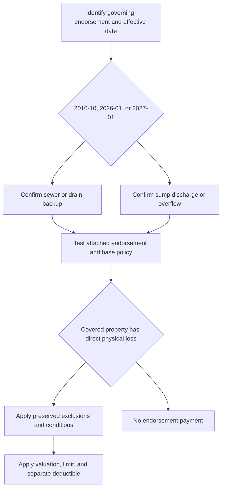

# Water Backup and Sump Overflow

## Short answer

The attached endorsement and its governing effective date control. **HO 04 90 (2026-01)** applies to HO-3 policies written on or after **2026-01-01** and provides a **$10,000** policy-period sublimit and a separate **$1,000** deductible. It adds a maintenance condition and, for a residence with a finished area below grade, requires an operable backwater valve or equivalent device. It also states that Coverage C loss is settled at **actual cash value**, unless the endorsement declarations say otherwise.

**HO 04 90 (2010-10)** remains the governing legacy edition for policies written under it: **$5,000** limit and **$500** deductible. **HO 04 90 (2027-01)** is effective **2027-01-01** and is a later edition; do not apply either the 2026-01 or 2010-10 amounts to a policy governed by 2027-01. The endorsement does not create flood, surface-water, subsurface-water, maintenance, or equipment-repair coverage merely because water is present.

## Decision flow

```mermaid
flowchart TD
  A["Identify governing endorsement and effective date"] --> B{"2010-10, 2026-01, or 2027-01"}
  B --> C["Confirm sewer or drain backup"]
  B --> D["Confirm sump discharge or overflow"]
  C --> E["Test attached endorsement and base policy"]
  D --> E
  E --> F{"Covered property has direct physical loss"}
  F --> G["Apply preserved exclusions and conditions"]
  G --> H["Apply valuation, limit, and separate deductible"]
  F --> I["No endorsement payment"]
```

*This flow shows edition selection, cause, covered property, exclusions, and adjustment order.*

1. Establish the loss date, policy effective date, attached endorsement, and base form.
2. Establish whether water backed up through a sewer or drain, or discharged or overflowed from a sump system. Water near a drain or sump is not proof of either cause.
3. Establish direct physical loss to property insured by the policy. The endorsement does not insure the failed sewer, drain, sump, pump, or related equipment merely because it caused the event.
4. Apply the edition's exclusions and conditions, then its valuation, sublimit, and separate deductible.

## Edition comparison

| Acting document and boundary | Coverage position | Limit and deductible |
|---|---|---|
| **HO 04 90 (2010-10)**, effective 2010-10-01; remains applicable to policies written under that edition | **HO 04 90 (2010-10) writes back** direct physical loss to covered property caused by accidental water backup or sump discharge or overflow. **HO 04 90 (2010-10) preserves** exclusions for precipitation, flood, surface or subsurface water, repeated seepage, neglect, and repair or maintenance of the failed equipment. | **$5,000** aggregate; **$500** deductible. Sources: `repo://forms/HO/MS/HO-04-90/2010-10.md#L35-L59`, `repo://forms/HO/MS/HO-04-90/2010-10.md#L77-L105`, `repo://forms/HO/MS/HO-04-90/2010-10.md#L107-L127`, `repo://forms/HO/MS/HO-04-90/2010-10.md#L157-L167` |
| **HO 04 90 (2026-01)**, effective 2026-01-01 for policies written on or after that date | **HO 04 90 (2026-01) writes back** direct physical loss to Coverage A, B, and C property caused by water or waterborne material backing up through sewers or drains, or overflowing or discharging from a sump, sump pump, or related equipment, “whether or not the backup, overflow, or discharge results from mechanical breakdown of that equipment.” **HO 04 90 (2026-01) preserves** the flood/wind and below-ground-water exclusions and adds the maintenance and below-grade backflow conditions. | **$10,000** per policy period unless a higher endorsement limit appears in the Declarations; **$1,000** separate deductible per loss. Sources: `repo://forms/HO/MS/HO-04-90/2026-01.md#L1-L4`, `repo://forms/HO/MS/HO-04-90/2026-01.md#L6-L23`, `repo://forms/HO/MS/HO-04-90/2026-01.md#L25-L47` |
| **HO 04 90 (2027-01)**, effective 2027-01-01 | **HO 04 90 (2027-01) modifies** the policy only when attached and covers the defined Water Backup and Sump Discharge or Overflow. **HO 04 90 (2027-01) preserves** policy provisions not modified and expressly constrains construction to its terms; its detailed exclusions include flood, surface water, below-ground water, maintenance, repeated leakage, and failed-equipment repair. | **$10,000**; **$1,000** deductible per covered loss. Sources: `repo://forms/HO/MS/HO-04-90/2027-01.md#L14-L60`, `repo://forms/HO/MS/HO-04-90/2027-01.md#L62-L117`, `repo://forms/HO/MS/HO-04-90/2027-01.md#L254-L321`, `repo://forms/HO/MS/HO-04-90/2027-01.md#L391-L412` |

## HO 04 90 (2026-01): controlling provisions

**HO 04 90 (2026-01) writes back** direct physical loss to property described in Coverages A, B, and C from the stated backup or sump event. The grant is limited to the endorsement and the policy; it is not a general water-damage grant. Source: `repo://forms/HO/MS/HO-04-90/2026-01.md#L6-L11`.

**HO 04 90 (2026-01) sets** a $10,000 sublimit for all endorsement loss in one policy period, unless the Declarations show a higher endorsement limit. The sublimit is “part of, and not in addition to” the Coverage A, B, and C limits. **HO 04 90 (2026-01) sets** a separate $1,000 deductible for each loss; the Section I deductible does not apply to this loss. Sources: `repo://forms/HO/MS/HO-04-90/2026-01.md#L13-L23`.

**HO 04 90 (2026-01) preserves** the flood and wind-related boundary verbatim: “This endorsement does not provide coverage for loss caused by flood, surface water, waves, tidal water, storm surge, or overflow of a body of water, whether or not driven by wind.” **HO 04 90 (2026-01) preserves** the below-grade boundary: “This endorsement does not provide coverage for loss caused by water below the surface of the ground,” including water that “exerts pressure on or seeps or leaks through a building, foundation, or swimming pool.” Sources: `repo://forms/HO/MS/HO-04-90/2026-01.md#L25-L33`.

**HO 04 90 (2026-01) constrains** the grant through its maintenance condition: “We do not cover loss under this endorsement if the backup, overflow, or discharge resulted from an insured's failure to maintain the sewer line, drain, sump, or sump pump serving the residence premises, where that failure was known to the insured before the loss and a reasonable person would have remedied it.” Source: `repo://forms/HO/MS/HO-04-90/2026-01.md#L35-L40`.

**HO 04 90 (2026-01) constrains** coverage for a finished area below grade: “coverage under this endorsement applies only if a backwater valve or equivalent backflow prevention device was installed and operable on the sewer line serving the premises at the time of loss.” The form identifies this requirement as new in 2026-01 and absent from 2010-10. Source: `repo://forms/HO/MS/HO-04-90/2026-01.md#L42-L47`.

**HO 04 90 (2026-01) modifies** valuation for Coverage C: “Loss to property covered under Coverage C is settled at actual cash value regardless of any replacement cost personal property endorsement, unless the Declarations state otherwise for this endorsement.” Coverages A and B remain settled on the policy's stated basis. Source: `repo://forms/HO/MS/HO-04-90/2026-01.md#L49-L56`.

## 2010-10 and 2027-01 comparison

**HO 04 90 (2010-10) writes back** accidental direct physical loss from sewer/drain backup or sump discharge/overflow and **preserves** the $5,000 limit, $500 deductible, precipitation exclusions, and exclusion of repair or replacement of the failed system. It has no 2026-01 backwater-valve requirement. Sources: `repo://forms/HO/MS/HO-04-90/2010-10.md#L35-L59`, `repo://forms/HO/MS/HO-04-90/2010-10.md#L77-L105`, `repo://forms/HO/MS/HO-04-90/2010-10.md#L107-L127`.

**HO 04 90 (2027-01) modifies** the attached policy with a $10,000 limit and $1,000 deductible and **preserves** unmodified policy terms. Its text covers sudden or gradual events but requires direct physical loss during the policy period. **HO 04 90 (2027-01) preserves** these precise boundaries: “We do not cover loss caused by flood”; “We do not cover loss caused by surface water that has not backed up through a sewer or drain”; and “We do not cover loss caused by the failure of an insured to maintain a Sump System.” Sources: `repo://forms/HO/MS/HO-04-90/2027-01.md#L26-L60`, `repo://forms/HO/MS/HO-04-90/2027-01.md#L113-L150`.

**HO 04 90 (2027-01) preserves** the failed-equipment boundary: “We do not cover the cost of repairing or replacing a sump pump or other equipment that failed because of mechanical or electrical breakdown.” It separately **writes back** resulting damage when covered water enters insured property after loss of power or mechanical function; that does not make the failed component payable. Sources: `repo://forms/HO/MS/HO-04-90/2027-01.md#L218-L220`, `repo://forms/HO/MS/HO-04-90/2027-01.md#L308-L321`.

## Claims handling versus contract terms

Claims guidance is not contract language. Investigate the water path, preserve failed components and photographs, obtain maintenance and valve records, mitigate safely, and apply the exact attached edition. Do not treat a plumber's label, visible staining, or the presence of a sump as proof of a covered cause. The contract controls whether the resulting physical damage, failed equipment, or mitigation expense is payable.

For 2026-01, record whether a finished below-grade area existed and whether the required device was installed and operable at the time of loss. Record the policy effective date because 2026-01 expressly replaces 2010-10 for policies written on or after 2026-01-01, while 2027-01 has its own 2027-01-01 effective boundary. Sources: `repo://forms/HO/MS/HO-04-90/2026-01.md#L1-L4`, `repo://forms/HO/MS/HO-04-90/2026-01.md#L42-L47`, `repo://forms/HO/MS/HO-04-90/2027-01.md#L1-L6`.

### Checklist

- Identify the attached endorsement edition and policy effective date.
- Establish sewer/drain backup versus sump discharge/overflow versus flood, surface, or below-ground water.
- Identify damaged property as Coverage A, B, or C and apply the governing valuation rule.
- Test the 2026-01 maintenance condition and below-grade backflow-prevention requirement when applicable.
- Exclude repair, replacement, correction, or improvement of failed equipment unless the governing text expressly provides otherwise.
- Apply the endorsement sublimit and separate deductible, not the ordinary Section I deductible where the edition displaces it.
