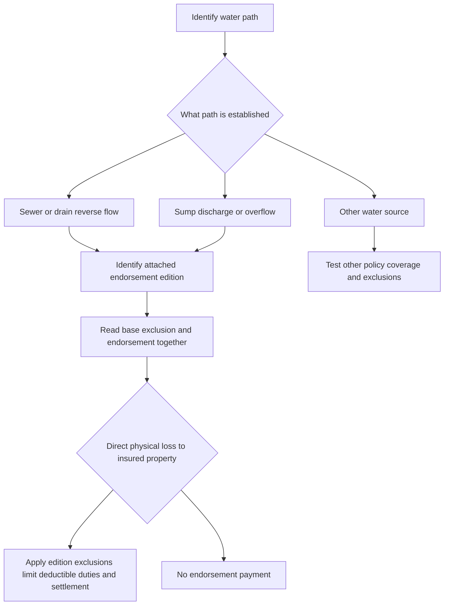

# Water Backup and Sump Overflow

## Short answer

A sewer or drain backup is water moving in reverse through a sewer or drain. Sump discharge or overflow is water released from, or overflowing from, a sump, sump pump, or related equipment. The first coverage question is the path of the water; the next is whether the applicable base form excludes that path and an attached endorsement writes back coverage. Water near a drain or sump is not, by itself, proof of backup. The insured must establish the covered water event and direct physical loss. Source: `repo://forms/HO/MS/HO-04-90/2027-01.md#L230-L242`, `repo://forms/HO/MS/HO-04-90/2027-01.md#L64-L99`, `repo://forms/HO/MS/HO-3/2024-03.md#L595-L603`

These endorsements generally cover resulting direct physical loss to property already insured by the base policy. They do not automatically pay to replace the failed sewer, drain, sump, pump, valve, or related equipment. Flood, surface water, below-ground water, seepage, maintenance or defective-condition losses, and avoidable post-loss damage remain recurring boundaries, but the exact wording varies by edition. Source: `repo://forms/HO/MS/HO-04-90/2010-10.md#L77-L105`, `repo://forms/HO/MS/HO-04-90/2026-01.md#L25-L40`, `repo://forms/HO/MS/HO-04-90/2027-01.md#L278-L321`

> **Do not use training figures as policy terms.** The training material describes a $10,000 limit and $1,000 deductible, but the governing declarations and attached edition control. Source: `repo://training/water-losses-101.md#L93-L107`, `repo://training/water-losses-101.md#L323-L329`

## Coverage decision path

```mermaid
flowchart TD
  A["Identify water path"] --> B{"What path is established"}
  B --> C["Sewer or drain reverse flow"]
  B --> D["Sump discharge or overflow"]
  B --> E["Other water source"]
  C --> F["Identify attached endorsement edition"]
  D --> F
  E --> G["Test other policy coverage and exclusions"]
  F --> H["Read base exclusion and endorsement together"]
  H --> I{"Direct physical loss to insured property"}
  I --> J["Apply edition exclusions limit deductible duties and settlement"]
  I --> K["No endorsement payment"]
```

*This flow shows the source, attachment, covered-property, and adjustment sequence grounded in the cited forms.*

1. **Identify the water path.** Document whether water backed up through a sewer or drain, discharged or overflowed from a sump system, escaped from a fixture or appliance, entered through an opening, or came from flood, surface water, or subsurface water. Source: `repo://training/water-losses-101.md#L61-L71`, `repo://training/water-losses-101.md#L93-L103`
2. **Identify property and insured interest.** Confirm whether the claim concerns dwelling or building property, unit improvements, tenant personal property, contents, or another class already insured by the base policy.
3. **Read the base exclusion and acting endorsement together.** The base forms exclude backup or sump loss and point to an applicable endorsement. The endorsement writes back only its stated coverage; a sublimit reference alone is not a grant. Source: `repo://forms/HO/MS/HO-3/2024-03.md#L593-L601`, `repo://forms/HO/MS/HO-4/2021-10.md#L746-L759`
4. **Apply the edition-specific event test, exclusions, limit, deductible, and valuation.** Then apply the base policy's remaining loss-of-use and other provisions.
5. **Handle duties while investigating.** Mitigate safely, preserve damaged property and failed components where reasonably possible, give notice within the applicable period, provide access and records, and preserve recovery rights. An inspection or partial payment is not a coverage admission. Source: `repo://forms/HO/MS/HO-04-90/2027-01.md#L793-L825`

## HO 04 90 edition map

| Edition | Express source relationship and application | Grant | Limit and deductible | Important boundaries |
| --- | --- | --- | --- | --- |
| **2010-10** | The 2010-10 form says it is superseded by the 2027-01 edition for policies effective on or after 2027-01-01 and remains in force for policies written under it. The 2026-01 form separately says it replaces 2010-10 for policies written on or after 2026-01-01. Do not infer a 2026-versus-2027 priority from filenames; verify the policy's attached edition and effective/writing rule. | Accidental direct physical loss to covered property from sewer/drain backup or sump discharge/overflow; reasonable protective expenses can be included. | $5,000 aggregate; $500 endorsement deductible. | Precipitation, failed-equipment repair, flood/surface water, below-ground water, repeated leakage, and neglect remain excluded. Source: `repo://forms/HO/MS/HO-04-90/2010-10.md#L1-L9`, `repo://forms/HO/MS/HO-04-90/2010-10.md#L35-L105`, `repo://forms/HO/MS/HO-04-90/2010-10.md#L107-L205`, `repo://forms/HO/MS/HO-04-90/2010-10.md#L211-L301`, `repo://forms/HO/MS/HO-04-90/2026-01.md#L1-L4` |
| **2026-01** | The 2026-01 form states: “Replaces edition 2010-10 of this endorsement for policies written on or after 2026-01-01.” It attaches to HO-3 and modifies Section I—Exclusions A.3. That is the express relationship; the supplied text does not state that 2027-01 supersedes or replaces 2026-01. | Direct physical loss to Coverage A, B, and C property from sewer/drain backup or sump/sump-pump/related-equipment overflow or discharge, **whether or not** the event results from mechanical breakdown. | $10,000 for all endorsement loss in one policy period unless a higher endorsement limit appears in the Declarations; it is part of, not in addition to, Coverage A/B/C limits. Separate $1,000 deductible per loss; the Section I deductible does not apply. | Flood, surface water, waves, tidal water, body-of-water overflow, and Section I A.1 remain excluded; below-ground water and Section I A.2 remain excluded; known unreasonable failure to maintain is excluded; finished below-grade areas require an installed and operable backwater valve or equivalent. Source: `repo://forms/HO/MS/HO-04-90/2026-01.md#L1-L4`, `repo://forms/HO/MS/HO-04-90/2026-01.md#L6-L23`, `repo://forms/HO/MS/HO-04-90/2026-01.md#L25-L47` |
| **2027-01** | The 2010-10 form expressly identifies 2027-01 as superseding it for policies effective on or after 2027-01-01. The 2027-01 endorsement itself says it is effective only when attached and controls conflicts while unmodified policy terms remain unchanged. The supplied 2027-01 text does not expressly describe its relationship to 2026-01. | Water Backup and Sump Discharge or Overflow causing direct physical loss, including reasonable protective and water-removal expenses; sudden or gradual occurrence is allowed, subject to exclusions. | $10,000; $1,000 deductible per covered loss. | Maintenance, known obstructions, below-grade valve, flood/surface/below-ground water, repeated leakage, power and mechanical/electrical breakdown, and failed-equipment repair require careful application of the detailed wording. Source: `repo://forms/HO/MS/HO-04-90/2010-10.md#L1-L9`, `repo://forms/HO/MS/HO-04-90/2027-01.md#L16-L39`, `repo://forms/HO/MS/HO-04-90/2027-01.md#L105-L117`, `repo://forms/HO/MS/HO-04-90/2027-01.md#L254-L321` |

### The changed 2026-01 contract source

**HO 04 90 (2026-01) writes back** direct physical loss to property described in Coverage A, Coverage B, and Coverage C when water backs up through sewers or drains or overflows or discharges from a sump, sump pump, or related equipment. The grant expressly applies “whether or not” the event results from mechanical breakdown. This is materially different from treating mechanical failure as automatically outside the grant; the endorsement's own exclusions and the base policy still govern. Source: `repo://forms/HO/MS/HO-04-90/2026-01.md#L6-L11`, `repo://forms/HO/MS/HO-04-90/2026-01.md#L25-L40`

**HO 04 90 (2026-01) modifies HO-3 Section I—Exclusions A.3** and applies only to the extent stated. **HO 04 90 (2026-01) preserves** the base policy's other provisions through its “All other provisions of the policy apply” clause. The supplied HO-3 2024-03 form, however, points X.8 to HO 04 90 (2027-01), not 2026-01. Therefore, the 2026-01 endorsement's attachment, governing base-form package, and policy issue/writing rule must be verified rather than assumed from a generic HO-3 reference. Source: `repo://forms/HO/MS/HO-04-90/2026-01.md#L1-L4`, `repo://forms/HO/MS/HO-04-90/2026-01.md#L56-L56`, `repo://forms/HO/MS/HO-3/2024-03.md#L593-L597`

**HO 04 90 (2026-01) sets** a $10,000 policy-period sublimit unless the Declarations show a higher endorsement limit. The sublimit is part of, not additional to, Coverage A, B, and C limits. **HO 04 90 (2026-01) applies** a separate $1,000 deductible to each loss and excludes the Section I deductible for this coverage. The form does not state that the sublimit is per room, item, insured, or occurrence. Source: `repo://forms/HO/MS/HO-04-90/2026-01.md#L13-L23`

**HO 04 90 (2026-01) preserves** the base Section I settlement rule for Coverage A and B property. **HO 04 90 (2026-01) modifies** Coverage C settlement by requiring actual cash value regardless of a replacement-cost personal-property endorsement, unless the Declarations state otherwise for this endorsement. This is a valuation rule, not an expansion of the property classes insured by the HO-3 policy. Source: `repo://forms/HO/MS/HO-04-90/2026-01.md#L49-L56`

**HO 04 90 (2026-01) excludes** flood, surface water, waves, tidal water, and body-of-water overflow, and **preserves** Section I A.1. It also excludes below-ground water that presses, seeps, or leaks through a building, foundation, or pool, and **preserves** Section I A.2. It further excludes a known, unreasonable failure to maintain the serving sewer line, drain, sump, or pump. Source: `repo://forms/HO/MS/HO-04-90/2026-01.md#L25-L40`

**HO 04 90 (2026-01) constrains** coverage in a finished below-grade area to premises having a backwater valve or equivalent device installed and operable on the serving sewer line at the time of loss. The form calls this requirement new in 2026-01 and says it did not appear in 2010-10. Source: `repo://forms/HO/MS/HO-04-90/2026-01.md#L42-L47`

### 2010-10 and 2027-01 boundaries

**HO 04 90 (2010-10) writes back** accidental direct physical loss to covered property and **preserves** the older edition's distinctions between resulting damage and repair or clearing of the failed system. Its $5,000 limit is shared by all insureds and covered property, and its $500 deductible applies after covered loss is determined. Source: `repo://forms/HO/MS/HO-04-90/2010-10.md#L35-L75`, `repo://forms/HO/MS/HO-04-90/2010-10.md#L89-L105`, `repo://forms/HO/MS/HO-04-90/2010-10.md#L107-L127`, `repo://forms/HO/MS/HO-04-90/2010-10.md#L157-L177`

**HO 04 90 (2027-01) writes back** direct physical loss from Water Backup or Sump Discharge or Overflow and **modifies** HO-3 2024-03 X.8-X.9 only when attached. It covers reasonable protective and water-removal expenses within the applicable limit and recognizes sudden or gradual occurrence. Its W.8 lists mechanical failure or electrical interruption as possible accidental causes, while W.8 and W.12 in the limit/exclusion material exclude loss caused by mechanical/electrical breakdown and failed-equipment repair; W.40 separately addresses covered water entering insured property after loss of power or mechanical function. Read those provisions together rather than treating repair of the failed component as covered. Source: `repo://forms/HO/MS/HO-04-90/2027-01.md#L64-L117`, `repo://forms/HO/MS/HO-04-90/2027-01.md#L214-L220`, `repo://forms/HO/MS/HO-04-90/2027-01.md#L254-L321`

**HO 04 90 (2027-01) requires** notice within 30 days after discovery, mitigation, inspection access, preservation of damaged property, records, photographs, cooperation, and evidence concerning the sump system and backwater valve. Source: `repo://forms/HO/MS/HO-04-90/2027-01.md#L791-L825`, `repo://forms/HO/MS/HO-04-90/2027-01.md#L851-L861`

## Cross-line comparison

| Form and endorsement | Base-form relationship | Grant and property class | Limit / deductible | Distinctive boundary |
| --- | --- | --- | --- | --- |
| **HO-5 2022-06 — HO 04 90 (2027-01)** | HO 04 90 (2027-01) writes back the limited coverage excluded by HO-5 X.5-X.6; HO-5 X.9 and endorsement exclusions remain. | Covered HO-5 property for the defined water events. | $10,000 / $1,000. | Flood, below-ground water, maintenance, failed equipment, and repair costs remain boundaries. Source: `repo://forms/HO/MS/HO-5/2022-06.md#L713-L731`, `repo://forms/HO/MS/HO-04-90/2027-01.md#L16-L39`, `repo://forms/HO/MS/HO-04-90/2027-01.md#L254-L321` |
| **HO-6 — HO 04 91 (2019-03)** | HO 04 91 modifies the HO-6 exclusion; HO-6 2023-02 preserves the exclusion unless attached. | Unit building property in which the owner has an insurable interest, improvements and betterments, fixtures, appliances, floor coverings, interior finishes, and personal property, plus stated removal/cleaning/drying/debris expenses. | $7,500 / $750. | Notice within 60 days after discovery; common-system and association cooperation duties. Source: `repo://forms/HO/MS/HO-04-91/2019-03.md#L41-L111`, `repo://forms/HO/MS/HO-04-91/2019-03.md#L113-L203`, `repo://forms/HO/MS/HO-04-91/2019-03.md#L293-L421`, `repo://forms/HO/MS/HO-6/2023-02.md#L656-L666` |
| **HO-4 — HO 04 92 (2019-03)** | HO 04 92 modifies HO-4's exclusion; HO-4 2021-10 says a sublimit alone does not create coverage. | Tenant's covered personal property only; not the landlord's building. | $2,500 / $250. | Notice within 90 days after discovery; no endorsement-created loss-of-use grant. Source: `repo://forms/HO/MS/HO-04-92/2019-03.md#L41-L113`, `repo://forms/HO/MS/HO-04-92/2019-03.md#L115-L215`, `repo://forms/HO/MS/HO-4/2021-10.md#L746-L759` |
| **DP-3 — DP 04 95 (2021-05)** | DP 04 95 modifies DP-3; DP-3 2026-01 X.6 excludes the loss unless attached and X.7 caps it at the applicable limit. | Property already covered by DP-3, plus necessary reasonable emergency measures. | $5,000 / $1,000. | Notice within 30 days after loss; failed-system repair excluded. Source: `repo://forms/DP/MS/DP-04-95/2021-05.md#L13-L81`, `repo://forms/DP/MS/DP-04-95/2021-05.md#L113-L145`, `repo://forms/DP/MS/DP-04-95/2021-05.md#L347-L375`, `repo://forms/DP/MS/DP-3/2026-01.md#L1459-L1466` |

The limit in each row is an endorsement limit, not a limit per room, item, insured, claim, or occurrence unless the cited edition says otherwise. Verify declarations and attachment; a base-form reference to a “backup and sump overflow limit” is not itself a grant. Source: `repo://forms/HO/MS/HO-4/2021-10.md#L746-L759`, `repo://forms/DP/MS/DP-3/2026-01.md#L1459-L1466`

## Common exclusions and settlement controls

- **Failed system versus resulting damage:** The cost to repair, replace, clear, or improve the failed sewer, drain, sump, pump, valve, or related equipment is generally excluded; resulting direct physical loss may be payable when the water event is covered. Source: `repo://forms/HO/MS/HO-04-90/2010-10.md#L89-L105`, `repo://forms/HO/MS/HO-04-90/2026-01.md#L35-L40`, `repo://forms/HO/MS/HO-04-90/2027-01.md#L318-L321`
- **Rain, runoff, flood, and below-ground water:** Rain through an opening, surface water, flood, and water below ground are not converted into backup merely because they reach a drain or sump. Apply the exact edition wording. Source: `repo://forms/HO/MS/HO-04-90/2010-10.md#L77-L89`, `repo://forms/HO/MS/HO-04-90/2026-01.md#L25-L33`, `repo://forms/HO/MS/HO-04-90/2027-01.md#L119-L138`
- **Property class and valuation:** HO 04 91 reaches listed unit-owner building interests and contents; HO 04 92 is personal-property-only. DP 04 95 settles personal property at actual cash value, as does HO 04 92. HO 04 90 (2026-01) separately imposes actual-cash-value settlement on Coverage C unless Declarations say otherwise. Source: `repo://forms/HO/MS/HO-04-91/2019-03.md#L53-L79`, `repo://forms/HO/MS/HO-04-92/2019-03.md#L41-L65`, `repo://forms/DP/MS/DP-04-95/2021-05.md#L497-L509`, `repo://forms/HO/MS/HO-04-92/2019-03.md#L451-L479`, `repo://forms/HO/MS/HO-04-90/2026-01.md#L49-L54`
- **Loss of use:** The backup endorsements are direct-physical-loss grants to stated property, not a generic promise of additional living expense or fair rental value. Test base Coverage D terms and the covered-loss requirement. Source: `repo://forms/HO/MS/HO-04-92/2019-03.md#L41-L49`, `repo://forms/HO/MS/HO-3/2024-03.md#L363-L411`, `repo://forms/HO/MS/HO-4/2021-10.md#L315-L329`, `repo://bulletins/IL/idoi-2017-10-water-backup-disclosure.md#L39-L41`

## Duties and Illinois overlay

Across the endorsements, the insured should make the site safe, mitigate without unnecessarily increasing loss, notify on the exact deadline, preserve damaged property and failed components where possible, provide access and records, cooperate, and preserve recovery rights. The cited deadlines are 30 days for HO 04 90 (2010-10), 30 days after discovery for HO 04 90 (2027-01), 60 days after discovery for HO 04 91, 90 days after discovery for HO 04 92, and 30 days for DP 04 95. Source: `repo://forms/HO/MS/HO-04-90/2010-10.md#L301-L319`, `repo://forms/HO/MS/HO-04-90/2027-01.md#L791-L825`, `repo://forms/HO/MS/HO-04-91/2019-03.md#L307-L355`, `repo://forms/HO/MS/HO-04-92/2019-03.md#L323-L355`, `repo://forms/DP/MS/DP-04-95/2021-05.md#L347-L397`

Illinois Bulletin IDOI-2017-10 is a state-overlay disclosure and claims-handling requirement, not a replacement for the policy or endorsement. It requires clear, conspicuous, retainable disclosure of availability, sewer/drain/sump scope, limits, deductibles, exclusions, and conditions, with records and consistency across policy communications. For claims received on or after 2017-10-02 it requires reasonable investigation, evaluation of the actual policy and endorsements, a written explanation when coverage is denied or limited, and payment of an undisputed covered portion unless barred by policy or law. It does not create coverage excluded by the contract. Source: `repo://bulletins/IL/idoi-2017-10-water-backup-disclosure.md#L1-L7`, `repo://bulletins/IL/idoi-2017-10-water-backup-disclosure.md#L13-L43`, `repo://bulletins/IL/idoi-2017-10-water-backup-disclosure.md#L189-L229`

The bulletin states $5,000 in B.2.6 as the amount to identify in the disclosure. That overlay figure does not replace contract limits of $2,500, $5,000, $7,500, or $10,000 in the cited endorsements; resolve a mismatch from the filed policy, declarations, and attached edition. Source: `repo://bulletins/IL/idoi-2017-10-water-backup-disclosure.md#L55-L65`, `repo://forms/HO/MS/HO-04-90/2026-01.md#L13-L23`, `repo://forms/HO/MS/HO-04-91/2019-03.md#L113-L121`, `repo://forms/HO/MS/HO-04-92/2019-03.md#L115-L123`

## Edition and attachment checklist

Before accepting or denying a claim, record:

- base form and edition;
- endorsement number, edition, effective date, and whether it was attached for the loss date;
- for HO 04 90, whether 2010-10, 2026-01, or 2027-01 governs under the form's express relationship and policy-writing/effective rule;
- exact water path and whether the event was sudden, accidental, gradual, repeated, or continuous under that edition;
- covered property class and insured interest;
- applicable declarations limit, remaining sublimit, deductible, valuation basis, and any base-policy loss-of-use provision;
- excluded source or contributing condition, including flood, surface water, groundwater, opening, maintenance, power, mechanical failure, failed equipment, or contamination; and
- notice, mitigation, preservation, inspection, proof-of-loss, other-insurance, and recovery-rights compliance.

If the facts do not establish the source, do not label the loss from visible damage alone. Preserve photographs, plumber or municipal reports, repair invoices, failed components, moisture records, and the discovery/mitigation timeline. Source: `repo://training/water-losses-101.md#L257-L279`, `repo://training/water-losses-101.md#L399-L425`
