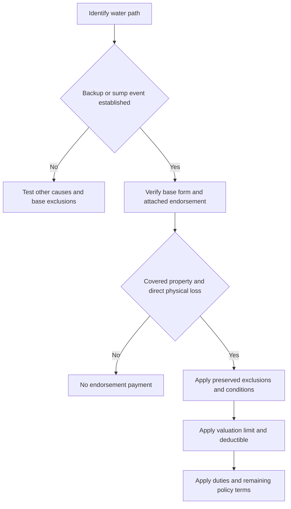

# Water Backup and Sump Overflow

## Short answer

Water backup is water or waterborne material backing up through a sewer or drain. Sump discharge or overflow is water released from or overflowing from a sump, sump pump, or related equipment. Identify the path first; standing water near a drain or sump does not establish the cause. Then read the applicable base form and the attached endorsement together. An endorsement writes back only its stated coverage and does not make excluded property or excluded causes covered.

For this page, **HO 04 90 (2026-01)** is the controlling new HO-3 endorsement edition in the repository. It is effective for policies written on or after 2026-01-01 and replaces the 2010-10 edition for that interval; it is not HO 04 90 (2027-01). The 2026 form provides a $10,000 policy-period sublimit, a $1,000 deductible per loss, a known-maintenance condition, a below-grade backwater-valve requirement, and actual-cash-value settlement for Coverage C unless the Declarations say otherwise. Source: repo://forms/HO/MS/HO-04-90/2026-01.md#L1-L4, repo://forms/HO/MS/HO-04-90/2026-01.md#L6-L23, repo://forms/HO/MS/HO-04-90/2026-01.md#L35-L54

## Coverage decision path

```mermaid
flowchart TD
  A["Identify water path"] --> B{"Backup or sump event established"}
  B -->|"No"| C["Test other causes and base exclusions"]
  B -->|"Yes"| D["Verify base form and attached endorsement"]
  D --> E{"Covered property and direct physical loss"}
  E -->|"No"| F["No endorsement payment"]
  E -->|"Yes"| G["Apply preserved exclusions and conditions"]
  G --> H["Apply valuation limit and deductible"]
  H --> I["Apply duties and remaining policy terms"]
```

*This flow shows the required cause, attachment, property, exclusion, and adjustment sequence.*

1. Establish whether water backed up through a sewer or drain, or discharged or overflowed from a sump system. Separately document flood, surface water, below-ground water, openings, plumbing discharges, and runoff.
2. Verify the base form, endorsement number and edition, policy effective date, loss date, attachment, Declarations, and covered-property class.
3. Determine direct physical loss to property already eligible under the base policy. The endorsement does not insure the failed sewer, drain, sump, pump, or valve merely because it caused the event.
4. Apply the endorsement's conditions and exclusions, then its limit, deductible, and valuation rule. Preserve all base-policy terms not modified by the endorsement.

## Cross-line comparison

| Line and endorsement | Base-form relationship | Grant and key limits |
|---|---|---|
| **HO-3 — HO 04 90 (2026-01)** | HO 04 90 (2026-01) modifies the HO-3 water exclusions only when attached; HO-3 property eligibility and unmodified exclusions remain applicable. | Direct physical loss to Coverage A, B, and C property from sewer/drain backup or sump discharge/overflow. $10,000 per-policy-period sublimit unless a higher Declarations limit applies; $1,000 per covered loss. Coverage C is actual cash value unless Declarations provide otherwise. |
| **HO-3 — HO 04 90 (2010-10)** | Legacy edition; it remains applicable to policies written under it and must not receive 2026 amounts. | $5,000 limit and $500 deductible. It requires an accidental event and does not cover precipitation or failed-equipment repair. Source: repo://forms/HO/MS/HO-04-90/2010-10.md#L1-L9, repo://forms/HO/MS/HO-04-90/2010-10.md#L35-L59, repo://forms/HO/MS/HO-04-90/2010-10.md#L107-L127, repo://forms/HO/MS/HO-04-90/2010-10.md#L157-L167 |
| **HO-4 2021-10 — HO 04 92 (2019-03)** | HO 04 92 modifies the tenant-form exclusion only when attached. | Covered tenant personal property only; $2,500 aggregate and $250 deductible. It does not insure the landlord's building or automatically add Coverage D. Source: repo://forms/HO/MS/HO-4/2021-10.md#L746-L759, repo://forms/HO/MS/HO-04-92/2019-03.md#L41-L65, repo://forms/HO/MS/HO-04-92/2019-03.md#L115-L163 |
| **HO-5 2022-06 — attached water-backup endorsement** | HO-5 X.5-X.6 exclude sewer/drain and sump loss; a referenced limit is not itself a grant. An attached endorsement writes back only its terms. | Test the issued attachment and HO-5 property coverage. Do not import HO 04 90 (2026-01) into HO-5 without evidence of attachment. Source: repo://forms/HO/MS/HO-5/2022-06.md#L713-L731 |
| **HO-6 2023-02 — HO 04 91 (2019-03)** | HO 04 91 modifies the HO-6 exclusion when attached. | Unit building property, improvements, betterments, and covered personal property; $7,500 aggregate and $750 deductible. Source: repo://forms/HO/MS/HO-6/2023-02.md#L656-L666, repo://forms/HO/MS/HO-04-91/2019-03.md#L41-L79, repo://forms/HO/MS/HO-04-91/2019-03.md#L113-L161 |
| **DP-3 2026-01 — DP 04 95 (2021-05)** | DP-3 X.6 excludes backup and sump overflow unless DP 04 95 is attached; X.7 does not create coverage. | Covered DP property and reasonable emergency protection; $5,000 aggregate and $1,000 deductible. Source: repo://forms/DP/MS/DP-3/2026-01.md#L1459-L1466, repo://forms/DP/MS/DP-04-95/2021-05.md#L41-L59, repo://forms/DP/MS/DP-04-95/2021-05.md#L113-L145 |

The acting document must be named first when describing composition: **HO 04 90 (2026-01) writes back** the stated HO-3 water coverage, **preserves** unmodified policy terms, and **constrains** payment by its sublimit and conditions. The policy-assembly guidance requires verification of edition and actual attachment; a title, quote, schedule entry, or memorandum is not attachment. Source: repo://openwiki/policy-assembly/editions-and-state-attachments.md#L53-L59, repo://openwiki/policy-assembly/editions-and-state-attachments.md#L100-L107

## HO 04 90 (2026-01): controlling rules

### Grant, sublimit, and deductible

The endorsement covers direct physical loss to property described in Coverage A, Coverage B, and Coverage C caused by sewer/drain backup or sump, sump-pump, or related-equipment discharge or overflow, including when mechanical breakdown causes the event. Its most payable amount is $10,000 in one policy period unless a higher Declarations limit applies; that sublimit is part of, not in addition to, Coverage A, B, and C limits. A separate $1,000 deductible applies to each loss, and the Section I deductible does not apply to this endorsement. Source: repo://forms/HO/MS/HO-04-90/2026-01.md#L6-L23

### Conditions and valuation

If the residence has a finished area below grade, coverage applies only if a backwater valve or equivalent device was installed and operable on the serving sewer line at the time of loss. The condition is new in 2026-01 and was absent from 2010-10. The endorsement also excludes loss when the event resulted from a known failure to maintain the serving sewer, drain, sump, or pump that a reasonable person would have remedied. Source: repo://forms/HO/MS/HO-04-90/2026-01.md#L35-L47

Coverage A and B property uses the valuation basis in the attached policy. Coverage C property is settled at actual cash value regardless of a replacement-cost personal-property endorsement, unless the Declarations state otherwise for this endorsement. Source: repo://forms/HO/MS/HO-04-90/2026-01.md#L49-L56

### Preserved exclusions

HO 04 90 (2026-01) expressly preserves flood, surface water, waves, tidal water, storm surge, and body-of-water overflow exclusions, and preserves the exclusion for water below ground, including pressure, seepage, or leakage through a building, foundation, or pool. It does not convert those causes into backup coverage. Source: repo://forms/HO/MS/HO-04-90/2026-01.md#L25-L33

All other policy provisions apply. Accordingly, distinguish the endorsement's grant from the base form's property eligibility and exclusions, and do not pay solely for replacing a failed pump, valve, drain, sewer, or other equipment. Source: repo://forms/HO/MS/HO-04-90/2026-01.md#L49-L56, repo://forms/HO/MS/HO-04-90/2010-10.md#L89-L105

## Edition control and claim guidance

Do not conflate HO 04 90 (2026-01) with HO 04 90 (2010-10) or HO 04 90 (2027-01). The repository's 2010 form is superseded by the 2027 form for policies effective on or after 2027-01-01, while the supplied 2026 form independently states its 2026-01 replacement of 2010-10 for policies written on or after 2026-01-01. Resolve a real file by its policy effective date, attached form, and Declarations rather than by a later form's title. Source: repo://forms/HO/MS/HO-04-90/2010-10.md#L1-L9, repo://forms/HO/MS/HO-04-90/2026-01.md#L1-L4, repo://forms/HO/MS/HO-04-90/2027-01.md#L1-L9

The 2027-01 form is not controlling for this page's 2026-01 comparison. Its different wording, including its own event and exclusion structure, must not be used to add a 2027 condition or limit to a 2026 policy. Source: repo://forms/HO/MS/HO-04-90/2027-01.md#L6-L18

For a claim, preserve photographs, plumber or municipal reports, moisture records, failed components, invoices, and the timeline of discovery and mitigation. Separate source and path from resulting property damage; inspect whether the below-grade device was installed and operable and whether a known maintenance condition contributed. Apply the applicable notice, cooperation, inspection, proof-of-loss, other-insurance, and recovery-rights provisions in the attached edition. An Illinois disclosure or filing memorandum is regulatory or explanatory material, not a substitute for the attached contract. Source: repo://openwiki/policy-assembly/editions-and-state-attachments.md#L127-L129, repo://forms/HO/MS/HO-04-90/2026-01.md#L35-L56

## Pre-decision checklist

- Confirm base line and edition, policy and loss dates, attachment, and Declarations.
- Establish sewer/drain backup or sump discharge/overflow rather than inferring cause from staining or standing water.
- Identify Coverage A, B, or C property and apply the base form's eligibility rules.
- Test flood, surface water, below-ground water, maintenance, device, and failed-equipment boundaries.
- For HO 04 90 (2026-01), verify the $10,000 policy-period sublimit, $1,000 per-loss deductible, below-grade backwater valve, known maintenance condition, and Coverage C actual-cash-value rule.
- Preserve evidence and apply the attached edition's duties without treating investigation or mitigation as a coverage admission.
