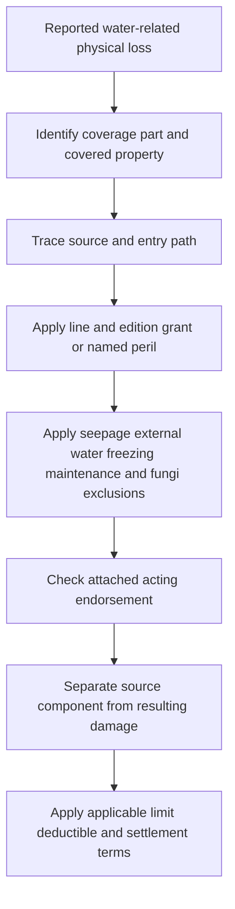

# Water Damage, Plumbing Discharge, and Seepage

## Read the policy assembly first

Water is not one peril. Identify the **coverage part**, the **line and edition**, the source and route of the water, whether the damage is direct or resulting, and every attached endorsement. The base form in force for the policy remains controlling for that policy; an endorsement changes it only to the extent the endorsement says so.

*This diagram shows the coverage-ordering method reflected in the cited forms; it is not a substitute for the policy assembly.*

The supplied Mississippi editions organize the insured property differently:

- **DP-3 2026-01:** Coverage A is the dwelling, B is other structures, and C is personal property. Coverage C is expressly a named-peril coverage; its water perils are not a general grant for every DP-3 property part ([DP-3 A–C](repo://forms/DP/MS/DP-3/2026-01.md#L97-L125), [Coverage C](repo://forms/DP/MS/DP-3/2026-01.md#L199-L219)). Its Additional Coverages section also contains express water-discharge and freezing provisions ([DP-3 2026-01 E.67–E.75](repo://forms/DP/MS/DP-3/2026-01.md#L547-L563)).
- **HO-3 2024-03:** Coverage A covers the dwelling and permanently installed plumbing and equipment, B covers qualifying other structures, and D covers loss of use only when a covered loss makes the premises uninhabitable ([HO-3 A](repo://forms/HO/MS/HO-3/2024-03.md#L97-L127), [HO-3 B](repo://forms/HO/MS/HO-3/2024-03.md#L149-L163), [HO-3 D](repo://forms/HO/MS/HO-3/2024-03.md#L361-L397)).
- **HO-4 2021-10:** Coverage A is expressly not provided, so damage to the dwelling, its plumbing, and its fixtures is not a Coverage A payment. The form does provide Coverage B and Coverage C; the water analysis must still be applied to the property part actually insured ([HO-4 A not provided](repo://forms/HO/MS/HO-4/2021-10.md#L71-L101), [HO-4 B](repo://forms/HO/MS/HO-4/2021-10.md#L149-L155), [HO-4 D](repo://forms/HO/MS/HO-4/2021-10.md#L381-L419)).
- **HO-5 2022-06:** Coverage A covers the dwelling and permanently installed plumbing and equipment, B covers other structures, and D covers loss of use only when direct physical loss by a peril insured against makes covered property unfit ([HO-5 A](repo://forms/HO/MS/HO-5/2022-06.md#L71-L99), [HO-5 B](repo://forms/HO/MS/HO-5/2022-06.md#L149-L163), [HO-5 D](repo://forms/HO/MS/HO-5/2022-06.md#L413-L447)).
- **HO-6 2023-02:** Coverage A covers unit property for which the insured is responsible, B covers qualifying other structures, and D is derivative of a covered loss to property at the residence premises ([HO-6 A](repo://forms/HO/MS/HO-6/2023-02.md#L71-L117), [HO-6 B](repo://forms/HO/MS/HO-6/2023-02.md#L149-L185), [HO-6 D](repo://forms/HO/MS/HO-6/2023-02.md#L300-L334)).

## Coverage A and B: building property and the source component

### Sudden or accidental discharge

For the current line editions, an accidental system discharge is treated as a covered water pathway only under the applicable grant and subject to the exclusions below; it is not coverage for every leak or for the failed component itself.

- **DP-3 2026-01:** Coverage C expressly covers accidental discharge or overflow from plumbing, heating, air-conditioning, and automatic sprinkler systems, and separately covers accidental discharge from a household appliance; the appliance or system from which water escaped is not covered under the corresponding property-peril wording ([DP-3 2026-01 C.23–C.30](repo://forms/DP/MS/DP-3/2026-01.md#L243-L267), [C.23 and C.27](repo://forms/DP/MS/DP-3/2026-01.md#L245-L253)). For direct physical loss addressed under Additional Coverages E, E.71 pays for accidental discharge or overflow from a plumbing, heating, air-conditioning, sprinkler, or household-appliance system and includes reasonable access, while E.72 excludes repair of the source system or appliance ([DP-3 2026-01 E.67–E.75](repo://forms/DP/MS/DP-3/2026-01.md#L547-L563)).
- **HO-3 2024-03:** the base form covers direct physical loss from accidental discharge or overflow from the listed systems or a household appliance, but not the system or appliance from which the water escaped. It also covers an off-premises plumbing discharge that damages covered property at an insured location, not repair of the off-premises system ([HO-3 2024-03 P.28–P.33](repo://forms/HO/MS/HO-3/2024-03.md#L609-L625)).
- **HO-4 2021-10:** the named-peril section covers accidental discharge or overflow from a plumbing, heating, air-conditioning, sprinkler, or household-appliance system and the direct physical loss to other covered property; the source system or appliance is excluded ([HO-4 2021-10 P.28–P.30](repo://forms/HO/MS/HO-4/2021-10.md#L568-L578)). This does not insure a dwelling because HO-4 2021-10 has no Coverage A ([HO-4 A.1–A.2](repo://forms/HO/MS/HO-4/2021-10.md#L71-L75)).
- **HO-5 2022-06:** the named-peril section uses the phrase **“accidental discharge or overflow”** and covers direct physical loss, but not the system or appliance from which water escaped; sudden and accidental tearing apart or cracking is separately addressed ([HO-5 2022-06 P.28–P.34](repo://forms/HO/MS/HO-5/2022-06.md#L568-L582)).
- **HO-6 2023-02:** the form covers accidental discharge or overflow from the listed systems and appliances, covers the resulting damage to other covered property, and excludes the source system or appliance. It also covers a sudden and accidental system failure with resulting water or steam damage ([HO-6 2023-02 P.31–P.38](repo://forms/HO/MS/HO-6/2023-02.md#L645-L659)).

“Resulting damage” is therefore a separate question from the failed pipe, hose, valve, appliance, pump, or system. A source-component exclusion does not by itself exclude direct physical damage to otherwise covered property; conversely, a covered-looking source does not pay for repairs that the applicable edition excludes. The line-specific grants and exclusions above control that split.

### Repeated seepage, leakage, wear, and maintenance

A present-day stain does not turn a long-running condition into a sudden event. **HO-3 2024-03** excludes continuous or repeated seepage or leakage from the listed systems and appliances, excludes repeated seepage or leakage from other systems, and separately excludes discharge, overflow, or leakage from systems and leakage from roofs, walls, doors, windows, foundations, or similar openings ([HO-3 2024-03 X.33–X.35](repo://forms/HO/MS/HO-3/2024-03.md#L733-L741)). **HO-4 2021-10** excludes repeated seepage or leakage, freezing, and discharge or leakage from systems and building openings ([HO-4 2021-10 X.11–X.17](repo://forms/HO/MS/HO-4/2021-10.md#L747-L759)). **HO-5 2022-06** excludes gradual water damage but preserves direct physical loss caused by a sudden and accidental covered peril; it also excludes water from drainage systems when the source is excluded ([HO-5 2022-06 P.65–P.70](repo://forms/HO/MS/HO-5/2022-06.md#L713-L723), [P.57–P.65](repo://forms/HO/MS/HO-5/2022-06.md#L628-L645)). **HO-6 2023-02** excludes constant or repeated seepage or leakage and repeated appliance or plumbing discharge, while its grant covers accidental discharge and resulting damage ([HO-6 2023-02 P.28–P.37](repo://forms/HO/MS/HO-6/2023-02.md#L570-L586), [X.11–X.13](repo://forms/HO/MS/HO-6/2023-02.md#L747-L753)).

**DP-3 2026-01** separately excludes repeated seepage or leakage, continuous or repeated discharge, source-system repair, and discharge or leakage through building openings ([DP-3 2026-01 X.29–X.35](repo://forms/DP/MS/DP-3/2026-01.md#L781-L793)). Its water-backup additional coverage also excludes neglect, lack of maintenance, deterioration, and a known condition ([DP-3 2026-01 E.67–E.73](repo://forms/DP/MS/DP-3/2026-01.md#L547-L559)). **HO 04 27 (2016-05)** is narrower than its title might suggest: it covers specified accidental discharge or overflow and source-system breakage, cracking, bulging, or freezing, but excludes constant or repeated seepage or leakage, backup, below-ground water, flood and surface water, and faulty maintenance-related sources ([HO 04 27 W.1](repo://forms/HO/MS/HO-04-27/2016-05.md#L41-L87), [HO 04 27 W.4](repo://forms/HO/MS/HO-04-27/2016-05.md#L207-L247)).

Maintenance is not a substitute for causation. A policy may exclude deterioration, defective installation, or failure to maintain the source while still covering ensuing direct physical loss when the applicable line and edition expressly preserves it. The attached endorsement must be read with the base exclusion; do not use a maintenance duty or a repair invoice as an independent coverage grant.

### Freezing

Freezing has its own protective-condition analysis. **DP-3 2026-01** covers freezing of listed systems only when an insured used reasonable care to maintain heat or shut off water and drain the system; the exclusion applies while the dwelling is vacant ([DP-3 2026-01 E.74–E.75](repo://forms/DP/MS/DP-3/2026-01.md#L561-L563), [X.29](repo://forms/DP/MS/DP-3/2026-01.md#L779-L783)). **HO-3 2024-03** covers freezing of a listed system but excludes freezing while the premises is unoccupied unless the insured maintains heat or shuts off water and drains the system ([HO-3 2024-03 P.27–P.32](repo://forms/HO/MS/HO-3/2024-03.md#L601-L623), [X.34](repo://forms/HO/MS/HO-3/2024-03.md#L733-L739)). **HO-4 2021-10** covers freezing only with reasonable heat or shutoff-and-drain precautions; **HO-5 2022-06** has the same vacant-building protective condition; and **HO-6 2023-02** covers freezing but excludes it when the insured failed to maintain heat or shut off and drain the system ([HO-4 2021-10 P.39–P.40](repo://forms/HO/MS/HO-4/2021-10.md#L661-L664), [HO-5 2022-06 P.35–P.36](repo://forms/HO/MS/HO-5/2022-06.md#L584-L586), [HO-6 2023-02 P.39–P.40](repo://forms/HO/MS/HO-6/2023-02.md#L661-L663)).

## Coverage C: personal property and resulting loss

Coverage C does not inherit the building result automatically. Under **DP-3 2026-01**, Coverage C is expressly named peril: accidental system discharge and freezing are listed, while flood, backup, and below-ground water are excluded ([DP-3 2026-01 C.10–C.30](repo://forms/DP/MS/DP-3/2026-01.md#L219-L261)). The current HO forms likewise state the water pathway in their peril sections: **HO-3 2024-03** P.30–P.33, **HO-4 2021-10** P.28–P.32, **HO-5 2022-06** P.28–P.36, and **HO-6 2023-02** P.31–P.35 ([HO-3](repo://forms/HO/MS/HO-3/2024-03.md#L617-L633), [HO-4](repo://forms/HO/MS/HO-4/2021-10.md#L570-L594), [HO-5](repo://forms/HO/MS/HO-5/2022-06.md#L570-L602), [HO-6](repo://forms/HO/MS/HO-6/2023-02.md#L645-L664)).

For a contents claim, establish that the water peril directly damaged covered personal property. Do not pay undamaged property merely because matching is inconvenient, and do not treat the appliance or system that released the water as damaged contents when the applicable line excludes that source. DP-3 2026-01 states the named-peril and direct-physical-loss boundary expressly ([DP-3 2026-01 C.1–C.10](repo://forms/DP/MS/DP-3/2026-01.md#L199-L219)); the HO-6 2023-02 peril section similarly covers resulting damage to other covered property but not the source system or appliance ([HO-6 2023-02 P.30–P.38](repo://forms/HO/MS/HO-6/2023-02.md#L628-L659)).

## Coverage D and E: loss of use is derivative

Loss of use does not create coverage for an excluded water event. **HO-3 2024-03 D.2–D.4** requires a covered loss to make the premises uninhabitable; **HO-4 2021-10 D.1 and D.5–D.7** requires direct physical loss caused by a covered peril; **HO-5 2022-06 D.1–D.7** requires direct physical loss by a peril insured against; and **HO-6 2023-02 D.1–D.7** requires a covered loss to property at the residence premises ([HO-3 D](repo://forms/HO/MS/HO-3/2024-03.md#L361-L397), [HO-4 D](repo://forms/HO/MS/HO-4/2021-10.md#L381-L399), [HO-5 D](repo://forms/HO/MS/HO-5/2022-06.md#L413-L429), [HO-6 D](repo://forms/HO/MS/HO-6/2023-02.md#L300-L318)). DP-3 2026-01 similarly requires a covered loss to make the rented part or residence unfit before Coverage D or E responds ([DP-3 2026-01 D.1–D.12](repo://forms/DP/MS/DP-3/2026-01.md#L363-L393)).

## External water, roof entry, and water backup

### Flood, surface water, and groundwater

The current base exclusions are consistent on the major external-water boundary. **DP-3 2026-01** excludes flood, surface water, waves, tidal water, body-of-water overflow, spray, and below-ground water, and states that the flood exclusion applies **“whether the water is driven by wind or otherwise”** ([DP-3 2026-01 P.13–P.14](repo://forms/DP/MS/DP-3/2026-01.md#L645-L650), [X.4–X.6](repo://forms/DP/MS/DP-3/2026-01.md#L729-L739)). **HO-3 2024-03** excludes flood and surface water whether driven by wind or another force, plus below-ground water ([HO-3 2024-03 P.10–P.11](repo://forms/HO/MS/HO-3/2024-03.md#L575-L581)). **HO-4 2021-10, HO-5 2022-06, and HO-6 2023-02** contain the corresponding flood, surface-water, and below-ground-water exclusions ([HO-4](repo://forms/HO/MS/HO-4/2021-10.md#L594-L602), [HO-5](repo://forms/HO/MS/HO-5/2022-06.md#L594-L602), [HO-6](repo://forms/HO/MS/HO-6/2023-02.md#L664-L666)).

The exclusions also reach excluded-water consequences. For example, HO-3 2024-03 excludes waterborne material moved by excluded water and water entering through an opening created by excluded water; its general exclusion applies **“directly or indirectly”** and regardless of another contributing cause ([HO-3 2024-03 X.1 and X.7–X.11](repo://forms/HO/MS/HO-3/2024-03.md#L671-L691)). A covered plumbing discharge does not become flood coverage because wind, rain, or surface water is also present.

### Roof and other openings

Rain, snow, sleet, sand, or dust entering through a roof or wall is not an all-purpose water grant. **DP-3 2026-01 P.18** covers interior entry only when wind, hail, or another covered peril first damages the building and creates an opening. **HO-3 2024-03 P.38** and **HO-6 2023-02 P.10** require direct wind or hail damage that creates the opening; **HO-5 2022-06 P.10** uses the same wind-or-hail opening rule ([DP-3](repo://forms/DP/MS/DP-3/2026-01.md#L655-L659), [HO-3](repo://forms/HO/MS/HO-3/2024-03.md#L631-L635), [HO-5](repo://forms/HO/MS/HO-5/2022-06.md#L530-L536), [HO-6](repo://forms/HO/MS/HO-6/2023-02.md#L530-L535)). HO 04 27 preserves this boundary by excluding water entering through a roof, wall, window, door, or foundation unless a covered cause created the opening ([HO 04 27 W.14](repo://forms/HO/MS/HO-04-27/2016-05.md#L67-L73)).

### Sewer, drain, and sump backup

Absent an acting endorsement, the base form exclusions apply: DP-3 2026-01 excludes sewer, drain, sump, and related-system backup; HO-3, HO-4, HO-5, and HO-6 exclude the same pathways in their current editions ([DP-3 X.6](repo://forms/DP/MS/DP-3/2026-01.md#L733-L737), [HO-3 X.8–X.9](repo://forms/HO/MS/HO-3/2024-03.md#L683-L691), [HO-4 X.14–X.15](repo://forms/HO/MS/HO-4/2021-10.md#L751-L759), [HO-5 P.40](repo://forms/HO/MS/HO-5/2022-06.md#L687-L691), [HO-6 X.3](repo://forms/HO/MS/HO-6/2023-02.md#L656-L666)).

**DP 04 95 Water Backup — Dwelling Property (2021-05)** is the acting endorsement for a DP policy when attached. It writes back the DP base sewer/drain/sump boundary only for direct physical loss caused by water or waterborne material backing up through a sewer or drain or overflowing or discharging from a sump, sump pump, or related equipment. It preserves the direct-cause requirement and excludes openings, flood, surface water, below-ground water, maintenance failure, repeated seepage, fungi, and repair of the failed equipment ([DP 04 95 W.1](repo://forms/DP/MS/DP-04-95/2021-05.md#L39-L75)). Its Water Backup limit is **$5,000** and its endorsement deductible is **$1,000**, subject to the attached policy and the endorsement's one-loss application ([DP 04 95 W.2](repo://forms/DP/MS/DP-04-95/2021-05.md#L113-L127), [DP 04 95 W.3](repo://forms/DP/MS/DP-04-95/2021-05.md#L175-L197)).

Do not apply DP 04 95 to an HO policy. Do not treat an HO-3 or other HO base-form reference to a water-backup limit as coverage unless the applicable water-backup endorsement is actually attached; a limit cannot create coverage that the base exclusion removes ([HO-3 2024-03 X.8–X.9](repo://forms/HO/MS/HO-3/2024-03.md#L683-L691)).

## Fungi, wet rot, dry rot, and bacteria

The base fungi exclusion comes before any write-back. **DP-3 2026-01** excludes fungi, wet rot, dry rot, bacteria, and microorganisms, while preserving only a covered-peril resulting loss when the form says so ([DP-3 2026-01 P.27–P.30](repo://forms/DP/MS/DP-3/2026-01.md#L675-L681)). **HO-3 2024-03** excludes fungi, wet rot, dry rot, and bacteria except as provided by the limited fungi endorsement; HO-4 2021-10, HO-5 2022-06, and HO-6 2023-02 contain their own edition-specific fungi exclusions ([HO-3 X.28–X.29](repo://forms/HO/MS/HO-3/2024-03.md#L719-L727), [HO-4 X.32](repo://forms/HO/MS/HO-4/2021-10.md#L727-L735), [HO-5 X.29–X.31](repo://forms/HO/MS/HO-5/2022-06.md#L801-L817), [HO-6 X.22](repo://forms/HO/MS/HO-6/2023-02.md#L694-L704)).

**HO 04 81 Limited Fungi, Wet or Dry Rot, or Bacteria Coverage (2018-09)** is the acting endorsement for an HO policy when attached. It writes back the base fungi exclusion only when a covered cause first causes direct physical loss to covered property and the fungi loss results from that loss. It does not write back constant or repeated seepage, constant or repeated discharge or overflow, flood, preexisting conditions, neglect, inadequate maintenance, or defective work ([HO 04 81 W.0](repo://forms/HO/MS/HO-04-81/2018-09.md#L13-L27), [W.1 W.1–W.9](repo://forms/HO/MS/HO-04-81/2018-09.md#L45-L67)).

When those conditions are met, HO 04 81 can cover direct fungi damage, necessary removal, access tear-out, repair-related tear-out, necessary remediation, and limited post-remediation testing. It does not cover preventive monitoring, routine cleaning, undamaged-property replacement, upgrades, or otherwise excluded water damage ([HO 04 81 W.1 W.10–W.23](repo://forms/HO/MS/HO-04-81/2018-09.md#L65-L91), [W.1 W.33–W.40](repo://forms/HO/MS/HO-04-81/2018-09.md#L111-L137), [W.4](repo://forms/HO/MS/HO-04-81/2018-09.md#L351-L419)). The aggregate is **$10,000 for all covered fungi, wet-or-dry-rot, or bacteria loss during the policy term**, and covered payments reduce the remaining amount ([HO 04 81 W.2](repo://forms/HO/MS/HO-04-81/2018-09.md#L157-L179), [W.1 W.47–W.52](repo://forms/HO/MS/HO-04-81/2018-09.md#L139-L149)).

HO 04 27 is not interchangeable with HO 04 81. HO 04 27's water section excludes fungi, wet rot, dry rot, and bacteria, even though it states a separate **$5,000** fungi-related limit; that number does not override the express exclusion ([HO 04 27 W.1 W.15](repo://forms/HO/MS/HO-04-27/2016-05.md#L69-L77), [HO 04 27 W.2](repo://forms/HO/MS/HO-04-27/2016-05.md#L93-L107)).

## Coverage boundary checklist

1. Identify the line, edition, coverage part, declarations, and attached endorsement.
2. Trace the water to its source and route: system or appliance discharge, repeated seepage, roof or wall opening, sewer/drain/sump backup, flood or surface water, or below-ground water.
3. Apply the applicable base grant or named peril, then the base exclusion. Quote the controlling wording—**“sudden and accidental,” “directly or indirectly,”** and **“whether the water is driven by wind or otherwise”** where it determines the result.
4. Read the acting endorsement against the base provision. DP 04 95 is DP water-backup coverage; HO 04 27 is limited water-damage coverage; HO 04 81 is limited fungi coverage. None is a blanket water endorsement.
5. Separate source-component repair, direct resulting damage, mitigation or access, fungi-related work, loss of use, and excluded maintenance or betterment.
6. Apply the exact edition's limit, deductible, and settlement provisions only after the covered portion is established. A limit is not a coverage grant.

## Source set

- [DP-3 2026-01](repo://forms/DP/MS/DP-3/2026-01.md)
- [DP 04 95 Water Backup — Dwelling Property (2021-05)](repo://forms/DP/MS/DP-04-95/2021-05.md)
- [HO-3 2024-03](repo://forms/HO/MS/HO-3/2024-03.md)
- [HO-4 2021-10](repo://forms/HO/MS/HO-4/2021-10.md)
- [HO-5 2022-06](repo://forms/HO/MS/HO-5/2022-06.md)
- [HO-6 2023-02](repo://forms/HO/MS/HO-6/2023-02.md)
- [HO 04 27 Limited Water Damage Coverage (2016-05)](repo://forms/HO/MS/HO-04-27/2016-05.md)
- [HO 04 81 Limited Fungi, Wet or Dry Rot, or Bacteria Coverage (2018-09)](repo://forms/HO/MS/HO-04-81/2018-09.md)
