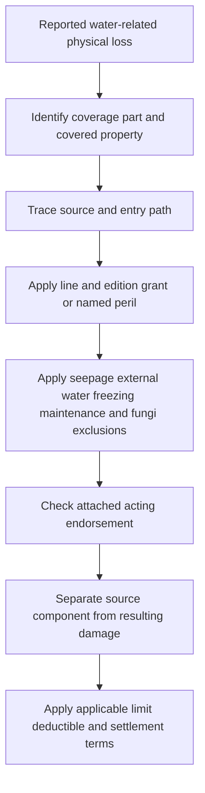

# Water Damage

## Read the policy assembly first

Water is not one peril. Identify the **coverage part**, the **line and edition**, the source and route of the water, whether the damage is direct or resulting, and every attached endorsement. The base form in force for the policy remains controlling for that policy; an endorsement changes it only to the extent the endorsement says so.

*This diagram shows the coverage-ordering method reflected in the cited forms; it is not a substitute for the policy assembly.*

The supplied Mississippi editions organize the insured property differently:

- **DP-3 2026-01:** Coverage A insures the dwelling for direct physical loss, while Coverage C insures personal property only for direct physical loss caused by a covered peril. The edition states a **zero-percent Coverage C limit**, so a contents analysis must check the declarations and limit as well as the water peril ([DP-3 Coverage A](repo://forms/DP/MS/DP-3/2026-01.md#L154-L159), [Coverage C.1](repo://forms/DP/MS/DP-3/2026-01.md#L410-L415)). Coverage D and E require a covered loss before fair rental value or additional living expense responds ([DP-3 Coverage D/E](repo://forms/DP/MS/DP-3/2026-01.md#L696-L752)).
- **HO-3 2024-03:** Coverage A covers the dwelling and permanently installed plumbing and equipment, B covers qualifying other structures, and D covers loss of use only when a covered loss makes the premises uninhabitable ([HO-3 A](repo://forms/HO/MS/HO-3/2024-03.md#L97-L127), [HO-3 B](repo://forms/HO/MS/HO-3/2024-03.md#L155-L175), [HO-3 D](repo://forms/HO/MS/HO-3/2024-03.md#L361-L397)).
- **HO-4 2021-10:** Coverage A is expressly not provided, so damage to the dwelling, its plumbing, and its fixtures is not a Coverage A payment. The form does provide Coverage B and Coverage C; the water analysis must still be applied to the property part actually insured ([HO-4 A not provided](repo://forms/HO/MS/HO-4/2021-10.md#L71-L101), [HO-4 B](repo://forms/HO/MS/HO-4/2021-10.md#L149-L155), [HO-4 D](repo://forms/HO/MS/HO-4/2021-10.md#L381-L419)).
- **HO-5 2022-06:** Coverage A covers the dwelling and permanently installed plumbing and equipment, B covers other structures, and D covers loss of use only when direct physical loss by a peril insured against makes covered property unfit ([HO-5 A](repo://forms/HO/MS/HO-5/2022-06.md#L71-L99), [HO-5 B](repo://forms/HO/MS/HO-5/2022-06.md#L149-L163), [HO-5 D](repo://forms/HO/MS/HO-5/2022-06.md#L413-L447)).
- **HO-6 2023-02:** Coverage A covers unit property for which the insured is responsible, B covers qualifying other structures, and D is derivative of a covered loss to property at the residence premises ([HO-6 A](repo://forms/HO/MS/HO-6/2023-02.md#L71-L117), [HO-6 B](repo://forms/HO/MS/HO-6/2023-02.md#L149-L185), [HO-6 D](repo://forms/HO/MS/HO-6/2023-02.md#L300-L334)).

## Coverage A and B: building property and the source component

### Sudden or accidental discharge

For the current line editions, an accidental system discharge is a covered water pathway only under the applicable grant and subject to the exclusions below; it is not coverage for every leak or for the failed component itself.

- **DP-3 2026-01:** The water grants are in the Perils Insured Against section, not in the water-specific Additional Coverages previously used by older DP wording. P.29 covers sudden and accidental discharge or overflow from plumbing, heating, air-conditioning, sprinkler, or household-appliance systems, while P.30 separately addresses household-appliance discharge; the source system or appliance is excluded ([DP-3 P.29–P.30](repo://forms/DP/MS/DP-3/2026-01.md#L1342-L1353)). P.38 also covers plumbing-system discharge but excludes water entering through openings not created by a covered peril ([DP-3 P.38](repo://forms/DP/MS/DP-3/2026-01.md#L1379-L1381)). Additional Coverages E.16 and E.17 cover reasonable water removal and drying **after a covered loss**, and E.32 covers necessary emergency system work; those provisions do not create an independent discharge grant ([DP-3 E.16–E.17](repo://forms/DP/MS/DP-3/2026-01.md#L919-L926), [E.32](repo://forms/DP/MS/DP-3/2026-01.md#L996-L999)).
- **HO-3 2024-03:** the base form covers direct physical loss from accidental discharge or overflow from the listed systems or a household appliance, but not the system or appliance from which the water escaped. It also covers an off-premises plumbing discharge that damages covered property at an insured location, not repair of the off-premises system ([HO-3 P.28–P.33](repo://forms/HO/MS/HO-3/2024-03.md#L523-L533)).
- **HO-4 2021-10:** the named-peril section covers accidental discharge or overflow from plumbing, heating, air-conditioning, sprinkler, or household-appliance systems; the form also covers resulting damage but excludes the source system ([HO-4 P.31–P.38](repo://forms/HO/MS/HO-4/2021-10.md#L565-L579)). This does not insure a dwelling because HO-4 2021-10 has no Coverage A ([HO-4 A.1–A.2](repo://forms/HO/MS/HO-4/2021-10.md#L71-L75)).
- **HO-5 2022-06:** Coverage C states that accidental discharge or overflow of water or steam must be sudden and accidental and excludes continuous or repeated seepage or leakage. Building and personal-property claims remain subject to the form's open-peril and exclusion provisions ([HO-5 C.49–C.54](repo://forms/HO/MS/HO-5/2022-06.md#L355-L365), [HO-5 P.1–P.10](repo://forms/HO/MS/HO-5/2022-06.md#L573-L593)).
- **HO-6 2023-02:** the form covers accidental discharge or overflow and the direct physical loss it causes, excludes constant or repeated seepage, and excludes the system or appliance from which water escaped while covering damage to other covered property ([HO-6 P.28–P.34](repo://forms/HO/MS/HO-6/2023-02.md#L582-L594)).

“Resulting damage” is therefore a separate question from the failed pipe, hose, valve, appliance, pump, or system. A source-component exclusion does not by itself exclude direct physical damage to otherwise covered property; conversely, a covered-looking source does not pay for repairs that the applicable edition excludes. The line-specific grants and exclusions above control that split.

### Repeated seepage, leakage, wear, and maintenance

A present-day stain does not turn a long-running condition into a sudden event. **HO-3 2024-03** excludes continuous or repeated seepage or leakage from the listed systems and separately excludes discharge or leakage from systems and building openings ([HO-3 P.28–P.30](repo://forms/HO/MS/HO-3/2024-03.md#L523-L529), [HO-3 X.33–X.35](repo://forms/HO/MS/HO-3/2024-03.md#L643-L649)). **HO-4 2021-10** excludes continuous or repeated system discharge and repeated seepage or leakage, plus freezing and other water exclusions ([HO-4 P.31–P.40](repo://forms/HO/MS/HO-4/2021-10.md#L565-L583), [HO-4 X.11–X.17](repo://forms/HO/MS/HO-4/2021-10.md#L667-L679)). **HO-5 2022-06** excludes continuous or repeated seepage, leakage, overflow, or discharge and separately excludes fixture seepage ([HO-5 P.3 and P.10](repo://forms/HO/MS/HO-5/2022-06.md#L577-L593), [HO-5 X.37–X.38](repo://forms/HO/MS/HO-5/2022-06.md#L787-L789)). **HO-6 2023-02** excludes constant or repeated seepage or leakage and repeated discharge, while its grant covers accidental discharge and resulting damage ([HO-6 P.28–P.30](repo://forms/HO/MS/HO-6/2023-02.md#L582-L588), [HO-6 X.11–X.13](repo://forms/HO/MS/HO-6/2023-02.md#L667-L671)).

**DP-3 2026-01** excludes repeated seepage or leakage, continuous or repeated discharge, source-system repair, and discharge or leakage through building openings ([DP-3 P.28–P.30](repo://forms/DP/MS/DP-3/2026-01.md#L1342-L1353), [DP-3 P.38](repo://forms/DP/MS/DP-3/2026-01.md#L1379-L1381), [DP-3 X.30–X.35](repo://forms/DP/MS/DP-3/2026-01.md#L1557-L1582)). **HO 04 27 (2016-05)** is narrower than its title might suggest: it covers specified accidental discharge or overflow and source-system breakage, cracking, bulging, or freezing, but excludes constant or repeated seepage or leakage, backup, below-ground water, flood and surface water, and faulty maintenance-related sources ([HO 04 27 W.1](repo://forms/HO/MS/HO-04-27/2016-05.md#L41-L87), [HO 04 27 W.4](repo://forms/HO/MS/HO-04-27/2016-05.md#L207-L247)).

Maintenance is not a substitute for causation. A policy may exclude deterioration, defective installation, or failure to maintain the source while still covering ensuing direct physical loss when the applicable line and edition expressly preserves it. The attached endorsement must be read with the base exclusion; do not use a maintenance duty or a repair invoice as an independent coverage grant.

### Freezing

Freezing has its own protective-condition analysis. **DP-3 2026-01** places freezing in an exclusion: it excludes freezing of listed systems, requires maintaining heat or shutting off the water and draining the systems, and separately applies that protective condition when the dwelling is vacant ([DP-3 P.19](repo://forms/DP/MS/DP-3/2026-01.md#L1301-L1304), [X.29](repo://forms/DP/MS/DP-3/2026-01.md#L1550-L1555)). **HO-3 2024-03** covers freezing but applies the unoccupied-building condition; **HO-4 2021-10** conditions freezing on reasonable heat or shutoff-and-drain precautions; **HO-5 2022-06** states freezing coverage in Coverage C and separately protects against freezing in a vacant or unoccupied building; and **HO-6 2023-02** covers freezing subject to the vacant-premises and reasonable-care wording ([HO-3 P.28 and P.32](repo://forms/HO/MS/HO-3/2024-03.md#L523-L531), [HO-4 P.39–P.40](repo://forms/HO/MS/HO-4/2021-10.md#L581-L583), [HO-5 C.50 and P.27](repo://forms/HO/MS/HO-5/2022-06.md#L355-L357), [HO-5 P.27](repo://forms/HO/MS/HO-5/2022-06.md#L623-L627), [HO-6 P.35–P.36](repo://forms/HO/MS/HO-6/2023-02.md#L596-L598)).

## Coverage C: personal property and resulting loss

Coverage C does not inherit the building result automatically. Under **DP-3 2026-01**, Coverage C.1 requires direct physical loss caused by a covered peril and states a zero-percent Coverage C limit; C.49 covers personal property damage that results directly from a covered loss. The water pathway therefore comes from the DP-3 Perils and Exclusions sections, not from an unsupported assumption that every building water grant applies to contents ([DP-3 C.1](repo://forms/DP/MS/DP-3/2026-01.md#L410-L415), [C.49](repo://forms/DP/MS/DP-3/2026-01.md#L645-L648), [P.29–P.30](repo://forms/DP/MS/DP-3/2026-01.md#L1346-L1353)). The current HO forms likewise state water pathways in their coverage or peril sections: **HO-3 2024-03** C.57, **HO-4 2021-10** P.31–P.37, **HO-5 2022-06** C.49–C.54, and **HO-6 2023-02** P.28–P.35 ([HO-3](repo://forms/HO/MS/HO-3/2024-03.md#L331-L333), [HO-4](repo://forms/HO/MS/HO-4/2021-10.md#L565-L579), [HO-5](repo://forms/HO/MS/HO-5/2022-06.md#L355-L365), [HO-6](repo://forms/HO/MS/HO-6/2023-02.md#L582-L598)).

For a contents claim, establish that the water peril directly damaged covered personal property. Do not pay undamaged property merely because matching is inconvenient, and do not treat the appliance or system that released the water as damaged contents when the applicable line excludes that source. The DP-3 direct-physical-loss and resulting-loss boundary is explicit ([DP-3 C.1 and C.49](repo://forms/DP/MS/DP-3/2026-01.md#L410-L415), [repo://forms/DP/MS/DP-3/2026-01.md#L645-L648)).

## Coverage D and E: loss of use is derivative

Loss of use does not create coverage for an excluded water event. **HO-3 2024-03 D.2–D.4** requires a covered loss to make the premises uninhabitable; **HO-4 2021-10 D.1 and D.5–D.7** requires direct physical loss caused by a covered peril; **HO-5 2022-06 D.1–D.7** requires direct physical loss by a peril insured against; and **HO-6 2023-02 D.1–D.7** requires a covered loss to property at the residence premises ([HO-3 D](repo://forms/HO/MS/HO-3/2024-03.md#L361-L397), [HO-4 D](repo://forms/HO/MS/HO-4/2021-10.md#L381-L399), [HO-5 D](repo://forms/HO/MS/HO-5/2022-06.md#L413-L429), [HO-6 D](repo://forms/HO/MS/HO-6/2023-02.md#L300-L318)). DP-3 2026-01 similarly requires a covered loss to make the rented part or residence unfit before Coverage D or E responds ([DP-3 D.1–D.12](repo://forms/DP/MS/DP-3/2026-01.md#L696-L752)).

## External water, roof entry, and water backup

### Flood, surface water, and groundwater

The current base exclusions are consistent on the major external-water boundary. **DP-3 2026-01** excludes flood, surface water, waves, tidal water, body-of-water overflow, spray, and below-ground water; its X.5 exclusion applies **“whether the water is driven by wind or otherwise”** ([DP-3 P.13–P.14](repo://forms/DP/MS/DP-3/2026-01.md#L1274-L1282), [X.4–X.5](repo://forms/DP/MS/DP-3/2026-01.md#L1451-L1457)). **HO-3 2024-03** excludes flood and surface water whether driven by wind or another force, plus below-ground water ([HO-3 P.10](repo://forms/HO/MS/HO-3/2024-03.md#L487-L489), [HO-3 X.7 and X.10–X.11](repo://forms/HO/MS/HO-3/2024-03.md#L593-L601)). **HO-4 2021-10, HO-5 2022-06, and HO-6 2023-02** contain the corresponding flood, surface-water, and below-ground-water exclusions ([HO-4 X.16–X.17](repo://forms/HO/MS/HO-4/2021-10.md#L677-L679), [HO-5 P.7–P.9](repo://forms/HO/MS/HO-5/2022-06.md#L583-L593), [HO-6 P.40](repo://forms/HO/MS/HO-6/2023-02.md#L606-L610)).

The exclusions also reach excluded-water consequences. For example, HO-3 2024-03 excludes waterborne material moved by excluded water and water entering through an opening created by excluded water; its general exclusion applies **“directly or indirectly”** and regardless of another contributing cause ([HO-3 X.1 and X.7–X.11](repo://forms/HO/MS/HO-3/2024-03.md#L581-L601)). A covered plumbing discharge does not become flood coverage because wind, rain, or surface water is also present.

### Roof and other openings

Rain, snow, sleet, sand, or dust entering through a roof or wall is not an all-purpose water grant. **DP-3 2026-01 P.18** covers interior entry only when wind, hail, or another covered peril first damages the building and creates an opening. **HO-3 2024-03 P.38**, **HO-5 2022-06 P.48**, and **HO-6 2023-02 P.10** preserve the same opening boundary ([DP-3](repo://forms/DP/MS/DP-3/2026-01.md#L1296-L1299), [HO-3](repo://forms/HO/MS/HO-3/2024-03.md#L541-L545), [HO-5](repo://forms/HO/MS/HO-5/2022-06.md#L667-L669), [HO-6](repo://forms/HO/MS/HO-6/2023-02.md#L544-L548)). HO 04 27 preserves this boundary by excluding water entering through a roof, wall, window, door, or foundation unless a covered cause created the opening ([HO 04 27 W.14](repo://forms/HO/MS/HO-04-27/2016-05.md#L67-L73)).

### Sewer, drain, and sump backup

Absent an acting endorsement, the base form exclusions apply: DP-3 2026-01 excludes sewer, drain, sump, and related-system backup; HO-3, HO-4, HO-5, and HO-6 exclude the same pathways in their current editions ([DP-3 X.6](repo://forms/DP/MS/DP-3/2026-01.md#L1459-L1463), [HO-3 X.8–X.9](repo://forms/HO/MS/HO-3/2024-03.md#L595-L601), [HO-4 X.14](repo://forms/HO/MS/HO-4/2021-10.md#L673-L675), [HO-5 P.40](repo://forms/HO/MS/HO-5/2022-06.md#L649-L653), [HO-6 X.3](repo://forms/HO/MS/HO-6/2023-02.md#L672-L679)).

**DP 04 95 Water Backup — Dwelling Property (2021-05)** is the acting endorsement for a DP policy when attached. It writes back the DP base sewer/drain/sump boundary only for direct physical loss caused by water or waterborne material backing up through a sewer or drain or overflowing or discharging from a sump, sump pump, or related equipment. It preserves the direct-cause requirement and excludes openings, flood, surface water, below-ground water, maintenance failure, repeated seepage, fungi, and repair of the failed equipment ([DP 04 95 W.1](repo://forms/DP/MS/DP-04-95/2021-05.md#L41-L81)). Its Water Backup limit is **$5,000** and its endorsement deductible is **$1,000**, subject to the attached policy and the endorsement's one-loss application ([DP 04 95 W.2](repo://forms/DP/MS/DP-04-95/2021-05.md#L115-L121), [W.3](repo://forms/DP/MS/DP-04-95/2021-05.md#L183-L187)).

Do not apply DP 04 95 to an HO policy. Do not treat an HO-3 or other HO base-form reference to a water-backup limit as coverage unless the applicable water-backup endorsement is actually attached; a limit cannot create coverage that the base exclusion removes ([HO-3 2024-03 X.8–X.9](repo://forms/HO/MS/HO-3/2024-03.md#L595-L601)).

### Attachment and endorsement interaction control

Before stating an outcome, record the base form and edition, coverage part and covered property, declarations, loss date, and **every endorsement attached and effective for that loss**. The three endorsement paths in this source set are different modifications:

- **DP-3 2026-01 + DP 04 95 (2021-05):** DP-3 X.6 excludes backup and sump overflow **“unless a water backup endorsement is attached.”** DP 04 95 W.1 then says, **“We cover direct physical loss to covered property caused by water or waterborne material that backs up through a sewer or drain,”** and separately covers sump overflow or discharge. That write-back remains subject to the endorsement's exclusions and the base policy; W.17 says, **“We do not cover the cost to repair, replace, or improve”** the failed sewer, drain, sump, pump, or related equipment, while resulting direct physical loss may be covered ([DP-3 X.6–X.7](repo://forms/DP/MS/DP-3/2026-01.md#L1459-L1466), [DP 04 95 W.1 and W.17](repo://forms/DP/MS/DP-04-95/2021-05.md#L41-L81)).
- **HO-4 2021-10 + HO 04 27 (2016-05):** HO-4 X.14 points to a water-backup endorsement for sewer, drain, and sump backup, but HO 04 27 is a limited Water Damage endorsement, not a backup write-back: its W.11 says, **“We do not cover loss caused by water that backs up through sewers, drains, sump systems, or related equipment.”** Its W.1–W.8 instead cover specified accidental discharge and, unusually, state, **“We also cover the cost to repair the portion of the system”** or appliance from which water escaped. Apply that source-repair exception only to the HO 04 27 grant and only after the base form's exclusions and covered-property terms are satisfied ([HO-4 X.11–X.17](repo://forms/HO/MS/HO-4/2021-10.md#L667-L679), [HO 04 27 W.1–W.11](repo://forms/HO/MS/HO-04-27/2016-05.md#L41-L65)).
- **HO-3 2024-03 + HO 04 81 (2018-09):** HO-3 X.29 excludes fungi **“except as provided by a limited fungi endorsement.”** HO 04 81 W.3–W.5 supplies that narrow exception only where a covered cause first causes direct physical loss to covered property and the fungi results from that loss. The endorsement's W.7–W.9 then keeps out fungi arising from repeated seepage, repeated discharge or overflow, and flood ([HO-3 X.28–X.29](repo://forms/HO/MS/HO-3/2024-03.md#L633-L637), [HO 04 81 W.3–W.9](repo://forms/HO/MS/HO-04-81/2018-09.md#L49-L63)).

The attachment check is substantive, not clerical: HO 04 27 cannot be substituted for a water-backup endorsement, DP 04 95 cannot be transferred to an HO line, and HO 04 81 does not make an excluded water event covered merely because fungi is later present. Read the cited base provision and the attached endorsement together; neither a limit nor an endorsement title is a blanket water-damage grant.

## Fungi, wet rot, dry rot, and bacteria

The base fungi exclusion comes before any write-back. **DP-3 2026-01** excludes fungi, wet rot, dry rot, bacteria, and microbes in P.27, while preserving resulting direct physical loss caused by a covered peril; X.9 separately excludes the fungal condition regardless of the source of moisture ([DP-3 P.27](repo://forms/DP/MS/DP-3/2026-01.md#L1338-L1340), [X.9–X.10](repo://forms/DP/MS/DP-3/2026-01.md#L1472-L1477)). **HO-3 2024-03** excludes fungi, wet rot, dry rot, and bacteria except as provided by the limited fungi endorsement; HO-4 2021-10, HO-5 2022-06, and HO-6 2023-02 contain their own edition-specific fungi exclusions ([HO-3 X.28–X.29](repo://forms/HO/MS/HO-3/2024-03.md#L633-L637), [HO-4 X.32](repo://forms/HO/MS/HO-4/2021-10.md#L707-L715), [HO-5 X.29–X.31](repo://forms/HO/MS/HO-5/2022-06.md#L769-L777), [HO-6 X.22](repo://forms/HO/MS/HO-6/2023-02.md#L712-L715)).

**HO 04 81 Limited Fungi, Wet or Dry Rot, or Bacteria Coverage (2018-09)** is the acting endorsement for an HO policy when attached. It writes back the base fungi exclusion only when a covered cause first causes direct physical loss to covered property and the fungi loss results from that loss. It does not write back constant or repeated seepage, constant or repeated discharge or overflow, flood, preexisting conditions, neglect, inadequate maintenance, or defective work ([HO 04 81 W.0 and W.1](repo://forms/HO/MS/HO-04-81/2018-09.md#L13-L67)).

When those conditions are met, HO 04 81 can cover direct fungi damage, necessary removal, access tear-out, repair-related tear-out, necessary remediation, and limited post-remediation testing. It does not cover preventive monitoring, routine cleaning, undamaged-property replacement, upgrades, or otherwise excluded water damage ([HO 04 81 W.1](repo://forms/HO/MS/HO-04-81/2018-09.md#L65-L91), [W.1 W.33–W.40](repo://forms/HO/MS/HO-04-81/2018-09.md#L111-L137), [W.4](repo://forms/HO/MS/HO-04-81/2018-09.md#L346-L419)). The aggregate is **$10,000 for all covered fungi, wet-or-dry-rot, or bacteria loss during the policy term**, and covered payments reduce the remaining amount ([HO 04 81 W.2](repo://forms/HO/MS/HO-04-81/2018-09.md#L157-L179), [W.1 W.47–W.52](repo://forms/HO/MS/HO-04-81/2018-09.md#L139-L149)).

HO 04 27 is not interchangeable with HO 04 81. HO 04 27's water section excludes fungi, wet rot, dry rot, and bacteria, even though it states a separate **$5,000** fungi-related limit; that number does not override the express exclusion ([HO 04 27 W.1 W.15](repo://forms/HO/MS/HO-04-27/2016-05.md#L69-L77), [HO 04 27 W.2](repo://forms/HO/MS/HO-04-27/2016-05.md#L109-L115)).

## Coverage boundary checklist

1. Identify the line, edition, coverage part, declarations, loss date, and every endorsement attached and effective for that loss.
2. Trace the water to its source and route: system or appliance discharge, repeated seepage, roof or wall opening, sewer/drain/sump backup, flood or surface water, or below-ground water.
3. Apply the applicable base grant or named peril, then the base exclusion. Quote the controlling wording—**“sudden and accidental,” “directly or indirectly,”** and **“whether the water is driven by wind or otherwise”** where it determines the result.
4. Read the acting endorsement against the base provision. DP 04 95 is DP water-backup coverage; HO 04 27 is limited water-damage coverage; HO 04 81 is limited fungi coverage. None is a blanket water endorsement.
5. Separate source-component repair, direct resulting damage, mitigation or access, fungi-related work, loss of use, and excluded maintenance or betterment.
6. Apply the exact edition's limit, deductible, and settlement provisions only after the covered portion is established. A limit is not a coverage grant.

## Source set

- [DP-3 2026-01](repo://forms/DP/MS/DP-3/2026-01.md)
- [DP 04 95 Water Backup — Dwelling Property (2021-05)](repo://forms/DP/MS/DP-04-95/2021-05.md)
- [HO-3 2024-03](repo://forms/HO/MS/HO-3/2024-03.md)
- [HO-4 2021-10](repo://forms/HO/MS/HO-4/2021-10.md)
- [HO-5 2022-06](repo://forms/HO/MS/HO-5/2022-06.md)
- [HO-6 2023-02](repo://forms/HO/MS/HO-6/2023-02.md)
- [HO 04 27 Limited Water Damage Coverage (2016-05)](repo://forms/HO/MS/HO-04-27/2016-05.md)
- [HO 04 81 Limited Fungi, Wet or Dry Rot, or Bacteria Coverage (2018-09)](repo://forms/HO/MS/HO-04-81/2018-09.md)
