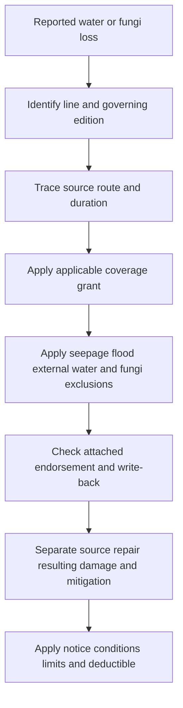

# Water Damage, Seepage, and Fungi Interactions

## Start with the policy assembly

Water is not a single peril. Identify the policy line, the form edition governing the loss, the coverage part and property, the physical source and route of the water, the loss date, and every endorsement attached and effective for that loss. The declarations, base form, and endorsement must be read together; an endorsement changes the policy only to the extent its wording says so.

```mermaid
flowchart TD
  report["Reported water or fungi loss"] --> edition["Identify line and governing edition"]
  edition --> facts["Trace source route and duration"]
  facts --> grant["Apply applicable coverage grant"]
  grant --> exclusions["Apply seepage flood external water and fungi exclusions"]
  exclusions --> endorsement["Check attached endorsement and write-back"]
  endorsement --> result["Separate source repair resulting damage and mitigation"]
  result --> amount["Apply notice conditions limits and deductible"]
```

*This flow is a coverage-ordering aid, not a substitute for the policy wording.*

For the supplied HO materials, the governing edition is the edition applicable to the policy and loss—not whichever form is easiest to find. HO-3 2018-09 says it is superseded by 2024-03 for policies effective on or after 2024-03-01, while remaining in force for policies written under it ([HO-3 2018-09](repo://forms/HO/MS/HO-3/2018-09.md#L1-L9)). HO 04 81 2018-09 is superseded by the 2026-09 edition for policies written on or after 2026-10-01, but remains governing for policies written under it regardless of when the loss is reported ([HO 04 81 2018-09](repo://forms/HO/MS/HO-04-81/2018-09.md#L8-L12)). The 2026-09 endorsement states that it applies to policies written or renewed on or after 2026-10-01 and replaces 2018-09 for those policies ([HO 04 81 2026-09](repo://forms/HO/MS/HO-04-81/2026-09.md#L1-L7)). If the policy date or attachment is unclear, escalate rather than infer the edition.

## Water causation: sudden discharge is not repeated seepage

The investigation should establish what the insured saw, when it was discovered, where water first appeared, what failed, and whether repair evidence indicates a gradual condition. Training guidance emphasizes separating the source from resulting damage and treating a stain or discovery date as evidence, not proof of when the loss began ([Water Losses 101](repo://training/water-losses-101.md#L15-L25), [source and duration](repo://training/water-losses-101.md#L77-L91), [hidden leaks](repo://training/water-losses-101.md#L165-L175)).

Under HO-3 2018-09, personal property water damage must result from a covered cause, and continuous or repeated seepage is excluded unless another applicable provision provides coverage ([HO-3 2018-09](repo://forms/HO/MS/HO-3/2018-09.md#L281-L297)). Its building provisions separately exclude backup, below-ground water, flood or surface water, while preserving ensuing loss only when otherwise covered and caused by a covered peril ([HO-3 2018-09](repo://forms/HO/MS/HO-3/2018-09.md#L103-L125)). HO-3 2024-03 likewise requires direct physical loss and excludes faulty maintenance while preserving an otherwise covered ensuing loss; it does not turn a maintenance expense or failed component into a coverage grant ([HO-3 2024-03](repo://forms/HO/MS/HO-3/2024-03.md#L97-L153)).

Keep two questions separate:

1. **Source component:** the pipe, hose, valve, appliance, drain, pump, roof, or other item that released or admitted water. Its repair may be excluded even when other property is damaged.
2. **Resulting direct physical damage:** covered property damaged after water escaped, if the applicable grant and exclusions permit it.

A sudden event label does not erase evidence of repeated leakage, and a source exclusion does not automatically answer the separate question of resulting damage. Conversely, a covered-looking resulting area does not establish coverage for the source. The forms do not resolve every causation or allocation dispute; preserve the factual ambiguity and escalate where the evidence cannot distinguish sudden release from gradual seepage.

## Repeated seepage, leakage, and notice

Repeated or constant seepage and leakage are distinct exclusion paths, not merely a less severe form of sudden discharge. HO 04 27 (2016-05) covers specified accidental discharge or overflow and certain breaking, cracking, bulging, or freezing of a system or appliance, but expressly excludes constant or repeated seepage or leakage from systems, appliances, roofs, walls, windows, foundations, or other openings ([HO 04 27](repo://forms/HO/MS/HO-04-27/2016-05.md#L41-L63)). It also excludes gradual or repeated seepage in its remaining exclusions ([HO 04 27](repo://forms/HO/MS/HO-04-27/2016-05.md#L287-L297)). Its source-repair language is an endorsement-specific exception: it covers repair of the portion from which water escaped only for the specified endorsement grant ([HO 04 27](repo://forms/HO/MS/HO-04-27/2016-05.md#L53-L59)). Do not transfer that exception to a base HO-3 claim or to HO 04 81.

Notice is a condition and an evidence-control issue. HO-3 2018-09 requires prompt notice identifying the dwelling, loss, time, and place, plus preservation, access, records, cooperation, and proof-of-loss duties ([HO-3 2018-09](repo://forms/HO/MS/HO-3/2018-09.md#L127-L137)). HO-3 2024-03 requires prompt notice, preservation, access, records, cooperation, and consent before permanent repairs when work could affect coverage or valuation ([HO-3 2024-03](repo://forms/HO/MS/HO-3/2024-03.md#L133-L147)). HO 04 27 separately requires prompt notice, showing damaged property, information, preservation of damaged property, and preservation of cause evidence ([HO 04 27](repo://forms/HO/MS/HO-04-27/2016-05.md#L79-L91)). These duties support investigation; they do not independently create coverage. Emergency measures to prevent further damage should not be confused with a final coverage decision ([Water Losses 101](repo://training/water-losses-101.md#L185-L203)).

## Flood, surface water, groundwater, and openings

The base HO-3 exclusions distinguish interior system discharge from external water. HO-3 2018-09 excludes sewer or drain backup, sump discharge, below-ground water, flood, surface water, waves, tidal water, and body-of-water overflow; the cited provisions preserve ensuing loss only when another covered peril independently causes it ([HO-3 2018-09](repo://forms/HO/MS/HO-3/2018-09.md#L103-L125)). HO-3 2024-03 excludes flood and surface water whether driven by wind or another force, and excludes below-ground water and related entry paths ([HO-3 2024-03](repo://forms/HO/MS/HO-3/2024-03.md#L581-L601)). A reported “flood” is not enough to classify the event: inspect whether water rose through a drain, entered through an opening, came from a plumbing system, or spread across normally dry land ([Water Losses 101](repo://training/water-losses-101.md#L141-L155), [worked examples](repo://training/water-losses-101.md#L281-L301)).

Rain or snow entering through a roof or wall is not an all-purpose water grant. The opening and the peril that created it must be identified under the governing edition. HO 04 27 excludes entry through a roof, wall, window, door, or foundation unless the opening resulted from a covered cause ([HO 04 27](repo://forms/HO/MS/HO-04-27/2016-05.md#L65-L73)). Preserve uncertainty when the evidence shows only staining or moisture but does not establish the entry path.

## HO 04 81: fungi write-back, not water-loss coverage

The base fungi exclusion must be applied before the endorsement. HO 04 81 does not make an excluded water event covered merely because fungi appears later. Under the 2018-09 edition, fungi coverage requires that a covered cause first cause direct physical loss to covered property and that the fungi result from that loss ([HO 04 81 2018-09](repo://forms/HO/MS/HO-04-81/2018-09.md#L49-L61)). The endorsement separately excludes fungi arising from constant or repeated seepage or leakage, constant or repeated discharge or overflow, and flood ([HO 04 81 2018-09](repo://forms/HO/MS/HO-04-81/2018-09.md#L63-L67)). It also excludes preexisting conditions, neglect, inadequate maintenance, and defective work ([HO 04 81 2018-09](repo://forms/HO/MS/HO-04-81/2018-09.md#L93-L107)).

When its trigger is satisfied, 2018-09 covers reasonable and necessary removal, access tear-out, repair-related tear-out, remediation, and limited post-remediation testing, but not preventive monitoring, routine cleaning, undamaged-property replacement, upgrades, or unrelated expense ([HO 04 81 2018-09](repo://forms/HO/MS/HO-04-81/2018-09.md#L69-L95), [limitations](repo://forms/HO/MS/HO-04-81/2018-09.md#L115-L127)). Its aggregate is **$10,000** for all covered fungi, wet-or-dry-rot, or bacteria loss during the policy term, and payments reduce the remaining amount ([HO 04 81 2018-09](repo://forms/HO/MS/HO-04-81/2018-09.md#L143-L153), [limit](repo://forms/HO/MS/HO-04-81/2018-09.md#L161-L169)). Notice and preservation duties also apply to a fungi loss ([HO 04 81 2018-09](repo://forms/HO/MS/HO-04-81/2018-09.md#L83-L91)).

The 2026-09 edition retains the same basic sequencing: fungi must result from a covered cause that occurred before the fungi caused the loss; reasonable removal, access tear-out, and post-remediation testing are described; repeated seepage, leakage, and flood remain excluded ([HO 04 81 2026-09](repo://forms/HO/MS/HO-04-81/2026-09.md#L9-L21)). Its stated change is material but narrow: the aggregate rises from **$10,000 to $25,000**, and the endorsement says all other provisions are unchanged ([HO 04 81 2026-09](repo://forms/HO/MS/HO-04-81/2026-09.md#L23-L33)). Do not use the 2026 limit for a policy governed by 2018-09.

The source also contains drafting anomalies in the 2018-09 limit provisions (for example, duplicated “inup to the aggregate in” wording) ([HO 04 81 2018-09](repo://forms/HO/MS/HO-04-81/2018-09.md#L139-L151)). The unambiguous stated dollar limit and edition rule support the amounts above, but any dispute about the anomaly should be escalated rather than silently rewritten.

## Coverage and escalation checklist

1. Confirm the policy line, governing base-form edition, endorsement edition, effective dates, declarations, coverage part, and covered property.
2. Document the source, route, timing, first discovery, repair findings, weather or outside conditions, and whether evidence suggests repeated seepage or a sudden event.
3. Apply the base grant and every applicable exclusion separately. Quote the exact repeated-seepage, flood, opening, and fungi wording that controls.
4. Separate source-component repair, resulting direct physical damage, emergency mitigation, access or tear-out, fungi work, loss of use, and betterment.
5. For HO 04 81, prove the covered-cause-first sequence before discussing fungi coverage; then apply the edition-specific aggregate and remaining balance.
6. Verify prompt notice, preservation, access, records, cooperation, and repair-consent duties. A missed fact or ambiguous route is an escalation issue, not permission to infer coverage.
7. Apply limits and deductibles only after covered loss is identified. A stated fungi or water limit is not itself a coverage grant.

## Source set

- [HO-3 2018-09](repo://forms/HO/MS/HO-3/2018-09.md)
- [HO-3 2024-03](repo://forms/HO/MS/HO-3/2024-03.md)
- [HO 04 27 (2016-05)](repo://forms/HO/MS/HO-04-27/2016-05.md)
- [HO 04 81 (2018-09)](repo://forms/HO/MS/HO-04-81/2018-09.md)
- [HO 04 81 (2026-09)](repo://forms/HO/MS/HO-04-81/2026-09.md)
- [Water Losses 101](repo://training/water-losses-101.md)
