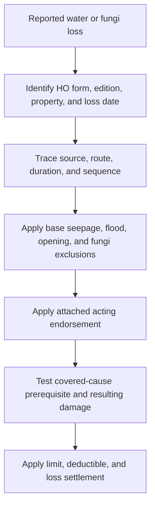

# Water Damage and Fungi Interactions

## Read the policy assembly in order

Name the policy form and edition, then identify the coverage part, source and route of water, loss date, declarations, and every attached endorsement effective for that loss. Apply the base grant and exclusions first, then the acting endorsement only to the extent its express terms change the base form. A limit or endorsement title is not a blanket water-damage grant.

```mermaid
flowchart TD
  loss["Reported water or fungi loss"] --> base["Identify HO form, edition, property, and loss date"]
  base --> cause["Trace source, route, duration, and sequence"]
  cause --> exclusions["Apply base seepage, flood, opening, and fungi exclusions"]
  exclusions --> endorsement["Apply attached acting endorsement"]
  endorsement --> sequence["Test covered-cause prerequisite and resulting damage"]
  sequence --> amount["Apply limit, deductible, and loss settlement"]
```

For operational handling, preserve failed components and photographs, separate mitigation from permanent repair, document duration and source, and request only claim-related evidence ([Water Loss Claim Handling Guidance](repo://guidelines/claims/water-loss-handling.md#L15-L43), [guidance on source and evidence](repo://guidelines/claims/water-loss-handling.md#L61-L87)).

## Base HO water position

Under **HO-3 2024-03**, the base form covers direct physical loss from accidental discharge or overflow from plumbing, heating, air-conditioning, automatic fire-protective sprinkler, or household-appliance systems, but not the system or appliance from which water escaped. It also covers off-premises plumbing discharge damaging covered property at an insured location, not repair of the off-premises system ([HO-3 P.29–P.33](repo://forms/HO/MS/HO-3/2024-03.md#L525-L533)). The base form separately excludes **“continuous or repeated seepage or leakage”** ([HO-3 P.29](repo://forms/HO/MS/HO-3/2024-03.md#L525-L527)) and requires a covered opening for interior rain entry ([HO-3 P.38](repo://forms/HO/MS/HO-3/2024-03.md#L541-L545)).

The HO-3 base exclusions preserve the external-water boundary: flood, surface water, and below-ground water remain excluded, including water **“whether the water is driven by wind or otherwise”**; water entering through an opening created by excluded water and waterborne material moved by excluded water are also excluded ([HO-3 X.7, X.10–X.11](repo://forms/HO/MS/HO-3/2024-03.md#L593-L601)). Sewer, drain, and sump backup remain excluded unless the applicable water-backup endorsement is attached ([HO-3 X.8–X.9](repo://forms/HO/MS/HO-3/2024-03.md#L595-L597)).

## Acting endorsements and required relationships

### HO 04 27 — limited water damage (HO-4, 2016-05)

**HO 04 27 Limited Water Damage Coverage (2016-05)** is the acting document when attached to an HO-4 policy. It covers direct physical loss from accidental discharge or overflow, and its specified system or appliance breakage, cracking, burning, bulging, or freezing provisions also cover repair of the portion from which water escaped ([HO 04 27 W.1–W.8](repo://forms/HO/MS/HO-04-27/2016-05.md#L41-L57)). HO 04 27 preserves the exclusions for **“constant or repeated seepage or leakage,”** sewer/drain/sump backup, below-ground water, and flood or surface water **“whether the water is driven by wind or otherwise”** ([HO 04 27 W.10–W.14](repo://forms/HO/MS/HO-04-27/2016-05.md#L61-L69)). It also expressly excludes fungi, wet rot, dry rot, and bacteria ([HO 04 27 W.15](repo://forms/HO/MS/HO-04-27/2016-05.md#L69-L73)). Its $5,000 fungi-related limit does not override that exclusion ([HO 04 27 W.11–W.12](repo://forms/HO/MS/HO-04-27/2016-05.md#L115-L117)).

### HO 04 90 — water backup and sump (HO-3, 2027-01)

**HO 04 90 Water Backup and Sump Discharge or Overflow (2027-01)** is the acting document when attached to an HO-3 policy. It covers direct physical loss caused by water backing up through a sewer or drain and by accidental sump discharge or overflow from equipment on the residence premises, including resulting damage and reasonable protective measures ([HO 04 90 W.1 W.2–W.14](repo://forms/HO/MS/HO-04-90/2027-01.md#L62-L117)). It preserves the flood exclusion, excludes surface water that has not backed up through a sewer or drain, and preserves below-ground water and maintenance exclusions ([HO 04 90 W.15–W.23](repo://forms/HO/MS/HO-04-90/2027-01.md#L119-L154)). The endorsement requires the covered water event to be the direct cause of direct physical loss ([HO 04 90 W.29](repo://forms/HO/MS/HO-04-90/2027-01.md#L175-L179)). Therefore HO 04 90 modifies the HO-3 backup and sump exclusions only for its stated grant; it does not convert flood, groundwater, or ordinary fixture overflow into covered water damage ([HO-3 X.7–X.10](repo://forms/HO/MS/HO-3/2024-03.md#L593-L601)).

### HO 04 81 — limited fungi coverage and edition control

**HO 04 81 Limited Fungi, Wet or Dry Rot, or Bacteria Coverage (2018-09)** is the acting document for policies written under that edition. It modifies the HO-3 fungi exclusion only where its requirements are met. The covered-cause prerequisite is exact: **“We cover direct physical loss caused by fungi when the fungi results from a ‘covered cause of loss.’”** The covered cause must first cause direct physical loss to covered property, and the fungi must result from that loss ([HO 04 81 2018-09 W.3–W.6](repo://forms/HO/MS/HO-04-81/2018-09.md#L53-L61); [HO-3 X.28–X.29](repo://forms/HO/MS/HO-3/2024-03.md#L633-L637)).

The 2018-09 endorsement preserves the repeated-water and flood exclusions: it does not cover fungi arising from **“constant or repeated seepage or leakage,”** **“constant or repeated discharge or overflow,”** or flood ([HO 04 81 2018-09 W.7–W.9](repo://forms/HO/MS/HO-04-81/2018-09.md#L63-L67); [HO-3 X.7, X.28–X.29](repo://forms/HO/MS/HO-3/2024-03.md#L593-L597), [HO-3 X.33–X.35](repo://forms/HO/MS/HO-3/2024-03.md#L643-L649)). When the sequence qualifies, the endorsement covers specified direct fungi damage, removal, access tear-out, necessary remediation, and post-remediation testing, subject to a $10,000 aggregate ([HO 04 81 2018-09 W.10–W.16](repo://forms/HO/MS/HO-04-81/2018-09.md#L69-L81), [W.1 W.47–W.52](repo://forms/HO/MS/HO-04-81/2018-09.md#L143-L153)).

**HO 04 81 (2026-09)** governs policies written or renewed on or after **2026-10-01**; it replaces 2018-09 for those policies. Policies written under 2018-09 remain governed by that edition ([HO 04 81 2026-09](repo://forms/HO/MS/HO-04-81/2026-09.md#L1-L7)). The 2026-09 edition preserves the same covered-cause sequence and repeated seepage, leakage, and flood exclusions, but raises the aggregate from $10,000 to $25,000 ([HO 04 81 2026-09 W.2–W.5](repo://forms/HO/MS/HO-04-81/2026-09.md#L9-L28), [W.6](repo://forms/HO/MS/HO-04-81/2026-09.md#L30-L33); [HO-3 X.7, X.28–X.35](repo://forms/HO/MS/HO-3/2024-03.md#L593-L597), [repo://forms/HO/MS/HO-3/2024-03.md#L633-L649)). Every composed fungi proposition must use the governing HO 04 81 edition together with the HO-3 base provisions; do not apply the $25,000 limit to a policy governed by 2018-09, or the $10,000 limit to a policy governed by 2026-09.

## Decision checklist

1. Identify the HO form, edition, policy-written/renewed date, coverage part, property, loss date, and attached endorsements.
2. Determine whether water was sudden and accidental, repeated seepage or leakage, backup/sump discharge, flood or surface water, groundwater, or entry through an opening.
3. Apply the exact base-form grant and quote the controlling exclusion; discovery of damage does not make a gradual condition sudden.
4. Name the acting document first: HO 04 27 for its attached HO-4 water grant, HO 04 90 for its attached HO-3 backup/sump grant, or the governing HO 04 81 edition for an attached HO fungi claim.
5. For fungi, prove the order: a covered cause first causes direct physical loss to covered property; fungi then results from that loss. Repeated seepage, repeated discharge/overflow, and flood remain excluded under the applicable base form and HO 04 81 edition.
6. Separate source-component repair, resulting damage, mitigation, fungi remediation, and loss of use. Apply the applicable edition’s limit and deductible only after coverage is established.

## Sources

- [HO-3 2024-03](repo://forms/HO/MS/HO-3/2024-03.md)
- [HO 04 27 2016-05](repo://forms/HO/MS/HO-04-27/2016-05.md)
- [HO 04 81 2018-09](repo://forms/HO/MS/HO-04-81/2018-09.md)
- [HO 04 81 2026-09](repo://forms/HO/MS/HO-04-81/2026-09.md)
- [HO 04 90 2027-01](repo://forms/HO/MS/HO-04-90/2027-01.md)
- [Water Loss Claim Handling Guidance](repo://guidelines/claims/water-loss-handling.md)
- [Filing Memorandum — HO-3 Edition 2024-03](repo://memoranda/HO-3-2024-03.md)
