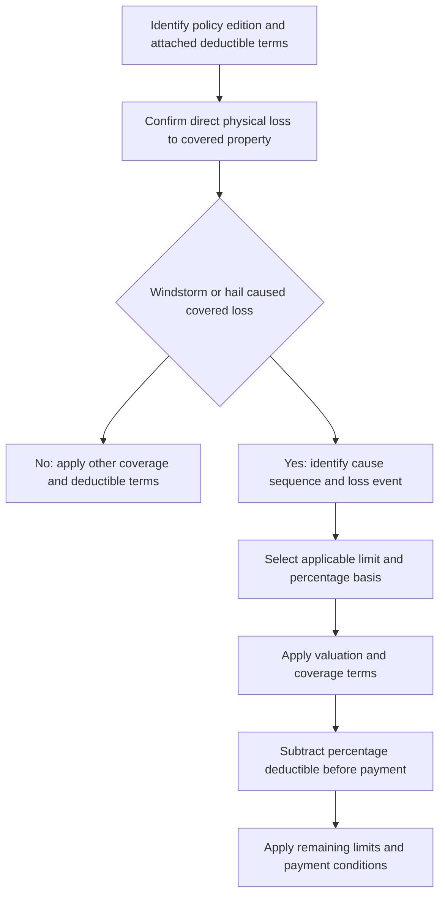

# Wind and Hail Deductibles

A windstorm, hail, named-storm, or percentage deductible is a **contractual allocation of a covered loss**, not a coverage grant. The applicable policy form, attached endorsement, edition, declarations, state amendatory form, named-storm-period definition, and any controlling state requirement must be identified before the claim is adjusted. A superseded edition continues to govern policies written under it; do not blend its percentage, limit basis, occurrence rule, storm period, or notice period with a later edition. For example, HO 23 77 (2014-02), effective February 1, 2014, is superseded by HO 23 77 (2022-07), effective July 1, 2022, for policies effective on or after July 1, 2022, while the earlier edition remains applicable to policies written under it ([2014-02, W.0](repo://forms/HO/MS/HO-23-77/2014-02.md#L1-L9), [2022-07 metadata](repo://forms/HO/MS/HO-23-77/2022-07.md#L1-L7)).

### Authority order

The **Declarations and attached policy form or endorsement impose the deductible** for the insured contract. A state amendatory endorsement can modify that contract within its stated scope; the state bulletin is a regulatory overlay for disclosure, filing, notice, and claims administration, not a free-standing payment term. Carrier underwriting manuals and endorsement-attachment rules are internal selection and issuance controls: they may restrict which option the carrier offers or attaches, but they do not change the deductible shown in the issued policy or create claim coverage ([Texas contract, regulatory, and internal layers](repo://openwiki/state-overlays/texas.md#L25-L29), [Florida layers](repo://openwiki/state-overlays/florida.md#L25-L29), [underwriting manual boundary](repo://manuals/underwriting/manual.md#L21-L37)).

### Base-form and endorsement relationship

Read the base form, Declarations, and attached endorsement as one issued contract. HO 23 77 (2022-07) **modifies** the policy for windstorm or hail loss, **controls** a conflicting policy term within that scope, and leaves other policy provisions unchanged; it does not create coverage for property or loss that the base policy does not cover ([HO 23 77 attachment and precedence](repo://forms/HO/MS/HO-23-77/2022-07.md#L14-L20), [conflict and coverage boundary](repo://forms/HO/MS/HO-23-77/2022-07.md#L61-L81)). The HO-3 base form **provides** the covered-peril grant and separately **retains** exclusions and conditions, including the wind-and-hail opening rule and cosmetic-roof exclusion ([HO-3 2024-03, P.37-P.41](repo://forms/HO/MS/HO-3/2024-03.md#L541-L549)). Therefore, the endorsement changes the deductible and related storm mechanics; it does not turn an excluded roof or water loss into a covered loss. The same contract-first reading applies to state amendatory forms: for example, Colorado HO 01 05 **implements** DOI-2019-05 for its contractual deductible, while the bulletin continues to **constrain** disclosure and administration ([HO 01 05 implementation](repo://forms/HO/CO/HO-01-05/2022-10.md#L59-L67), [Colorado overlay](repo://openwiki/state-overlays/colorado.md#L24-L28)).

## Coverage gate: what must be covered first

The deductible applies only after the policy establishes **direct physical loss to covered property** caused by windstorm or hail. The 2024-03 HO-3 form covers direct physical loss caused by windstorm and hail, subject to its exclusions and conditions ([HO-3 2024-03, P.37](repo://forms/HO/MS/HO-3/2024-03.md#L541-L549)). The same form preserves important boundaries:

- Rain, snow, sleet, sand, or dust entering a building is covered only when the direct force of wind or hail first damages the building and creates an opening; the deductible does not make otherwise uncovered water damage payable ([HO-3 2024-03, P.38](repo://forms/HO/MS/HO-3/2024-03.md#L541-L545), [HO 23 77 2022-07, W.1-W.8](repo://forms/HO/MS/HO-23-77/2022-07.md#L85-L117)).
- Roof surfacing cosmetic damage that does not impair the ability to shed water is excluded, while covered direct physical loss that impairs that ability is treated differently ([HO-3 2024-03, P.40-P.41](repo://forms/HO/MS/HO-3/2024-03.md#L545-L549)).
- An endorsement may modify the base policy's deductible or conditions, but it does not automatically restore an exclusion. The 2022-07 HO 23 77 expressly says that it does not provide coverage for property, loss, or damage that the policy does not otherwise cover ([HO 23 77 2022-07, W.0](repo://forms/HO/MS/HO-23-77/2022-07.md#L46-L77)).

Thus, “wind-driven rain claim” is not enough by itself. Establish the opening, the direct physical damage that created it, the resulting covered damage, and the applicable form language. If the loss is excluded, the deductible is not a substitute for coverage.

## Claim decision flow

The practical order is to identify the governing contract, establish coverage and causation, determine the applicable event and limit, then calculate and subtract the deductible. The forms require investigation from the facts and available evidence rather than application based only on a storm label or nearby weather ([HO 01 05 2022-10, T.16 and T.28](repo://forms/HO/CO/HO-01-05/2022-10.md#L89-L91), [L.115](repo://forms/HO/CO/HO-01-05/2022-10.md#L113-L115)).

*This flow shows the coverage, causation, calculation, and payment sequence reflected in the cited forms.*

## Calculation and limit basis

A percentage deductible is not normally a percentage of the repair estimate. The controlling form determines the percentage, the applicable limit or insured value, the covered-loss amount to which the deduction is applied, and whether separate limits must be calculated separately.

The common calculation is:

> **Deductible = selected percentage × applicable limit**  
> **Payment before other remaining limits or conditions = covered adjusted loss − deductible, but not less than zero**

The 2014-02 HO 23 77 determines the deductible from the applicable limit for the damaged property and applies it after the applicable coverage terms determine the covered amount ([HO 23 77 2014-02, W.1-W.11](repo://forms/HO/MS/HO-23-77/2014-02.md#L47-L67)). The 2022-07 edition likewise calculates from the Coverage A limit shown in the Declarations, does not reduce that limit for the loss, and subtracts the deductible from the covered amount ([HO 23 77 2022-07, W.2-W.6](repo://forms/HO/MS/HO-23-77/2022-07.md#L650-L676)). Its limit-allocation rules use the limit applicable to the damaged property and do not combine limits unless the applicable basis requires it ([HO 23 77 2022-07, W.33-W.35](repo://forms/HO/MS/HO-23-77/2022-07.md#L217-L229)).

**Illustration.** If the controlling terms use a $400,000 applicable limit and a selected 2 percent deductible, the deductible is $8,000. A $30,000 covered adjusted loss leaves $22,000 before any other applicable limit, sublimit, or payment condition. A $6,000 covered loss produces no payment under a form that does not pay when the adjusted loss does not exceed the deductible. This is an arithmetic illustration, not a universal policy result: the actual form controls the limit basis, allocation, and payment order.

When more than one applicable limit is involved, allocate the loss to the property or coverage to which each limit applies. The 2022-07 HO 23 77 requires the limit applicable to the damaged property and forbids combining limits unless the applicable basis requires it ([HO 23 77 2022-07, W.33-W.35](repo://forms/HO/MS/HO-23-77/2022-07.md#L217-L229)). A later change to the applicable limit does not retroactively change the deductible for that loss ([HO 23 77 2022-07, W.4](repo://forms/HO/MS/HO-23-77/2022-07.md#L662-L665)).

## Trigger, causation, and loss-event rules

The deductible trigger is a causal requirement, not merely the presence of wind, hail, rain, or a named storm nearby.

- Windstorm or hail may be the sole cause or may combine with another cause. The deductible applies to the covered portion for which windstorm or hail caused direct physical loss; it does not apply to a portion attributable only to an unrelated or excluded cause ([HO 01 17 Louisiana 2020-09, T.16-T.17](repo://forms/HO/LA/HO-01-17/2020-09.md#L91-L93), [HO 23 77 2022-07, W.10-W.12](repo://forms/HO/MS/HO-23-77/2022-07.md#L125-L143)).
- Wind-driven rain follows the opening rule. The Louisiana amendatory form applies its deductible to covered rain damage only when windstorm or hail created the opening, and the Texas DP form likewise requires an opening created by windstorm for covered wind-driven rain ([HO 01 17 Louisiana 2020-09, T.4-T.16](repo://forms/HO/LA/HO-01-17/2020-09.md#L61-L91), [DP 01 45 Texas 2022-01, T.20](repo://forms/DP/TX/DP-01-45/2022-01.md#L125-L127)).
- Related damage is generally grouped under the form's occurrence or loss-event rule. HO 23 77 (2022-07) treats related loss from the same weather event as one loss occurrence and applies the deductible to covered loss discovered after the storm without changing the cause determination ([HO 23 77 2022-07, W.12-W.14 and W.75-W.76](repo://forms/HO/MS/HO-23-77/2022-07.md#L1492-L1507), [W.75-W.76](repo://forms/HO/MS/HO-23-77/2022-07.md#L395-L403)). Louisiana's 2020-09 form treats related damage from the same event as one occurrence but permits separate weather events to be separate occurrences ([HO 01 17 Louisiana 2020-09, T.18-T.20](repo://forms/HO/LA/HO-01-17/2020-09.md#L95-L99)).
- Named-storm periods are edition- and form-specific. HO 23 77 (2014-02) begins the period when the governmental designation begins and continues **72 hours** after it ends; HO 23 77 (2022-07) begins when the designation becomes effective and continues **96 hours** after it ends. A subsequent designation may establish a separate period under the 2022-07 endorsement; neither period replaces the requirement to establish covered causation ([2014-02, W.5-W.7](repo://forms/HO/MS/HO-23-77/2014-02.md#L657-L663), [2022-07, W.6-W.9](repo://forms/HO/MS/HO-23-77/2022-07.md#L1473-L1487)).
- Texas HO 01 45 (2022-01) applies the deductible to an occurrence involving windstorm or hail and recognizes that wind and hail damage may arise from the same occurrence ([HO 01 45 Texas 2022-01, T.16-T.17](repo://forms/HO/TX/HO-01-45/2022-01.md#L91-L95)).

The claim file should therefore record the alleged event, the physical evidence, the sequence of causes, any covered and noncovered allocation, and the policy provision that makes the event one occurrence or loss event.

## Other deductibles and covered related expenses

The wind or hail deductible does not automatically replace every other deductible, and it must not be duplicated merely because several items or coverages are involved. The controlling form decides whether another deductible applies to a separate cause, remains applicable by its own terms, or is excluded for the same loss.

- The 2022-07 HO 23 77 says not to apply another deductible to the same covered windstorm or hail loss unless its terms require it, while preserving another deductible when its own terms apply ([HO 23 77 2022-07, W.38-W.39](repo://forms/HO/MS/HO-23-77/2022-07.md#L243-L249)).
- Texas HO 01 45 (2022-01) makes the windstorm or hail deductible separate from a deductible for another peril and says the applicable amount is determined from the coverage and cause of loss ([HO 01 45 Texas 2022-01, T.1-T.3](repo://forms/HO/TX/HO-01-45/2022-01.md#L61-L67)). Texas B-2021-08 also prohibits more than one deductible for the same covered loss unless the policy clearly permits it ([Texas Bulletin B-2021-08, B.2.19-B.2.20](repo://bulletins/TX/b-2021-08-windstorm-deductibles.md#L81-L89)).
- Covered emergency measures, temporary or reasonable protective repairs, debris removal, loss of use, and other related expenses remain subject to the deductible when the applicable policy covers them. They do not become covered merely because a deductible applies. HO 23 77 (2022-07) addresses emergency measures and temporary repairs directly ([HO 23 77 2022-07, W.51-W.55](repo://forms/HO/MS/HO-23-77/2022-07.md#L297-L315)); the Louisiana form separately includes covered debris removal, reasonable protective repairs, and covered loss of use ([HO 01 17 Louisiana 2020-09, T.48-T.52](repo://forms/HO/LA/HO-01-17/2020-09.md#L155-L163)).

Apply valuation and coverage conditions before calculating the covered amount, then apply the deductible in the order specified by the controlling form. Do not use emergency work, a supplemental estimate, debris removal, or a separate coverage limit as a device to avoid a deductible that the form applies to the same occurrence.

## Edition-specific contractual ranges and notice rules

These are contractual terms from the identified editions, not a universal industry range.

| Form and edition (effective date) | Contractual percentage or limit rule | Trigger, basis, storm period, and notice rule |
|---|---|---|
| HO 23 77, 2014-02 (**2014-02-01**) | Selected percentage is **1% to 5%**. Deductible uses the applicable limit for the damaged property. | Applies to each covered windstorm or hail loss; named-storm period continues **72 hours** after designation ends; notice is prompt and no later than **90 days after loss begins** ([W.1-W.11](repo://forms/HO/MS/HO-23-77/2014-02.md#L47-L67), [named storm](repo://forms/HO/MS/HO-23-77/2014-02.md#L657-L667), [conditions](repo://forms/HO/MS/HO-23-77/2014-02.md#L439-L449)). |
| HO 23 77, 2022-07 (**2022-07-01**) | Selected percentage is **2% to 10%**. Deductible uses the Coverage A limit shown in the Declarations and does not reduce that limit. | Related loss from the same weather event is one loss occurrence; named-storm period continues **96 hours** after designation ends; notice is as soon as practicable. Separate limits are not combined unless the applicable basis requires it ([W.3-W.6](repo://forms/HO/MS/HO-23-77/2022-07.md#L655-L676), [occurrence and named storm](repo://forms/HO/MS/HO-23-77/2022-07.md#L1473-L1507), [notice](repo://forms/HO/MS/HO-23-77/2022-07.md#L1524-L1528)). |
| Florida DP 01 09, 2021-03 (**2021-03-01**) | Windstorm and hail deductible is **2% to 10%** and uses the amount of insurance applicable to damaged property. | Applied to the covered loss for the occurrence and not reduced because multiple items are damaged. The form requires at least **45 days' notice** before an increase ([DP 01 09 Florida 2021-03-01, T.1-T.7](repo://forms/DP/FL/DP-01-09/2021-03.md#L97-L123), [T.2 notice](repo://forms/DP/FL/DP-01-09/2021-03.md#L318-L335)). |
| Florida HO 01 09, 2023-07 (**2023-07-01**) | Windstorm and hail deductible is **2% to 15%**. | Applies to covered loss and is separate from another deductible; wind-driven rain requires an opening caused by wind. This edition requires **60 days' written notice** before an increase ([metadata](repo://forms/HO/FL/HO-01-09/2023-07.md#L1-L9), [T.1-T.10](repo://forms/HO/FL/HO-01-09/2023-07.md#L57-L77), [T.2 notice](repo://forms/HO/FL/HO-01-09/2023-07.md#L169-L175)). |
| Texas HO 01 45, 2022-01 (**2022-01-01**) | Windstorm and hail deductible is **1% to 10%**. | Applies to covered direct physical loss, including resulting covered damage, and uses the applicable limit of liability for the damaged property; the form requires **45 days' notice** before an increase ([metadata](repo://forms/HO/TX/HO-01-45/2022-01.md#L1-L7), [T.1-T.15](repo://forms/HO/TX/HO-01-45/2022-01.md#L61-L89), [T.2 notice](repo://forms/HO/TX/HO-01-45/2022-01.md#L169-L183)). |
| Texas DP 01 45, 2022-01 (**2022-01-01**) | Windstorm and hail deductible shown in the Declarations is **1% to 5%**. | Uses the applicable amount of insurance and applies to the covered loss from the occurrence; the form requires **30 days' notice** before an increase ([metadata](repo://forms/DP/TX/DP-01-45/2022-01.md#L1-L7), [T.1-T.9](repo://forms/DP/TX/DP-01-45/2022-01.md#L94-L128), [T.2 notice](repo://forms/DP/TX/DP-01-45/2022-01.md#L380-L398)). |
| Colorado HO 01 05, 2022-10 (**2022-10-01**) | Windstorm and hail deductible is **1% to 5%**. | HO 01 05 **implements** Colorado Bulletin DOI-2019-05 for the deductible range and applies the deduction to covered loss, including a loss with another cause; its notice provision requires **30 days** before an increase ([metadata](repo://forms/HO/CO/HO-01-05/2022-10.md#L1-L9), [T.1-T.8](repo://forms/HO/CO/HO-01-05/2022-10.md#L59-L75), [T.2 notice](repo://forms/HO/CO/HO-01-05/2022-10.md#L211-L225)). |
| Louisiana HO 01 17, 2020-09 (**2020-09-01**) | Windstorm and hail deductible is **2% to 5%**. | Applies to covered direct physical loss, including covered wind-driven rain through a storm-created opening; related damage is one occurrence. The form requires **30 days' notice** before an increase and defines a named-storm period continuing **72 hours** after designation ends ([metadata](repo://forms/HO/LA/HO-01-17/2020-09.md#L1-L7), [T.1-T.20](repo://forms/HO/LA/HO-01-17/2020-09.md#L59-L99), [notice and named storm](repo://forms/HO/LA/HO-01-17/2020-09.md#L211-L273)). |

The Texas HO row and Texas DP row must not be collapsed: they are different contract editions and have different maximums and notice periods. Likewise, the Florida HO and DP forms differ even though both are Florida contracts.

## State overlays: contractual terms versus regulatory constraints

A state bulletin is not the policy's deductible calculation unless the contract or amendatory form makes it so. Treat the sources in two layers:

1. **Contract layer:** read the declarations and attached form or endorsement to determine the deductible, limit basis, trigger, occurrence, and payment order.
2. **Regulatory layer:** check the bulletin for disclosure, filing, recordkeeping, consistency, claims-investigation, and advance-notice constraints. A bulletin may constrain how a deductible is offered or administered without changing the coverage grant.

### Colorado

Colorado Bulletin DOI-2013-01 was issued and effective **January 15, 2013**. It is superseded by DOI-2019-05 for policies effective on or after **May 20, 2019**, while the earlier bulletin remains relevant to policies written under it ([metadata and supersession](repo://bulletins/CO/doi-2013-01-hail-deductibles.md#L1-L9)). Under that earlier overlay, a windstorm or hail deductible could not exceed **3% of the applicable property coverage limit**, and the insurer had to disclose the trigger, basis, and relationship to another deductible ([DOI-2013-01, B.2.1-B.2.10](repo://bulletins/CO/doi-2013-01-hail-deductibles.md#L111-L152)).

DOI-2019-05 was issued and effective **May 20, 2019**. It applies prospectively to post-effective-date forms, endorsements, underwriting, sales, and claim practices and does not retroactively change an already issued policy ([DOI-2019-05, B.1.3-B.1.4](repo://bulletins/CO/doi-2019-05-hail-deductibles.md#L20-L30)). It now constrains the windstorm and hail deductible to no more than **5% of applicable covered loss**, requires the value stated in the policy for the percentage calculation, and requires a **30-day written notice** before an increase in a windstorm deductible ([DOI-2019-05, B.2.1-B.2.9](repo://bulletins/CO/doi-2019-05-hail-deductibles.md#L115-L149), [B.3.1-B.3.3](repo://bulletins/CO/doi-2019-05-hail-deductibles.md#L300-L313)). HO 01 05 (2022-10) implements that bulletin in the contract by setting a 1% to 5% range ([HO 01 05, T.1-T.3](repo://forms/HO/CO/HO-01-05/2022-10.md#L59-L67)).

### Florida

Florida OIR-2022-01 was issued and effective **January 20, 2022**. It is primarily a disclosure overlay. It requires the disclosure to identify the trigger, separate the hurricane deductible from other deductibles, describe the calculation basis, and state a named-storm minimum of **2%** and hurricane maximum of **10%** ([metadata](repo://bulletins/FL/oir-2022-01-hurricane-deductible.md#L1-L7), [B.2.1-B.2.10](repo://bulletins/FL/oir-2022-01-hurricane-deductible.md#L59-L81)). The bulletin expressly says that it does **not** establish a minimum Section I deductible or other unrelated policy term ([OIR-2022-01, B.1.12-B.1.14](repo://bulletins/FL/oir-2022-01-hurricane-deductible.md#L35-L41)). Do not therefore replace the Florida HO 01 09 2023-07 contract's 2% to 15% windstorm-and-hail range with the bulletin's 10% statement without first determining whether the policy's deductible is the hurricane or named-storm deductible addressed by the bulletin.

The form remains the contract. Florida HO 01 09 2023-07 requires 60 days' written notice before an increase, while DP 01 09 2021-03 requires 45 days ([HO notice](repo://forms/HO/FL/HO-01-09/2023-07.md#L167-L175), [DP notice](repo://forms/DP/FL/DP-01-09/2021-03.md#L167-L175)). Both forms define a Named Storm Period from the governmental designation through **72 hours after it ends**; the period identifies when the storm provisions may apply but does not itself establish covered causation ([Florida HO named-storm period](repo://forms/HO/FL/HO-01-09/2023-07.md#L217-L245), [Florida DP named-storm period](repo://forms/DP/FL/DP-01-09/2021-03.md#L432-L455)). OIR-2022-01 additionally requires records supporting delivery of the disclosure and the disclosure version used ([OIR-2022-01, B.2.12-B.2.21](repo://bulletins/FL/oir-2022-01-hurricane-deductible.md#L81-L101)).

### Texas

Texas Bulletin B-2016-04 was issued and effective **August 19, 2016**. It is superseded by B-2021-08 for policies effective on or after **August 19, 2021**, while remaining relevant to policies written under the earlier position ([metadata and supersession](repo://bulletins/TX/b-2016-04-windstorm-deductibles.md#L1-L9)). The earlier overlay required a minimum **1%** windstorm or hail deductible, capped a hurricane deductible at **3%** of applicable insured value, required the policy to state the occurrence or related-occurrence basis, and required **30 days' notice** before an increase in a windstorm deductible ([B-2016-04, B.2.1-B.2.10](repo://bulletins/TX/b-2016-04-windstorm-deductibles.md#L59-L79), [B.3.1-B.3.9](repo://bulletins/TX/b-2016-04-windstorm-deductibles.md#L147-L165)).

B-2021-08 was issued and effective **August 19, 2021**. It supplies the later overlay: named-storm windstorm and hail deductibles must be at least **1%**, hurricane deductibles cannot exceed **5%**, and a seacoast-territory windstorm deductible cannot exceed **10%** ([metadata](repo://bulletins/TX/b-2021-08-windstorm-deductibles.md#L1-L7), [B.2.1-B.2.6](repo://bulletins/TX/b-2021-08-windstorm-deductibles.md#L47-L59)). It also requires disclosure of the separate deductible, trigger, relationship to another deductible, and policy value or limit used for calculation; it prohibits more than one deductible for the same covered loss unless the policy clearly permits it and requires claim documentation supporting the application ([B.2.7-B.2.21](repo://bulletins/TX/b-2021-08-windstorm-deductibles.md#L61-L89)). Its disclosure section requires **30 days' notice** before increasing a windstorm deductible and a **72-hour continuation** after a named-storm designation ends when the policy uses a named-storm period ([B.3.12-B.3.23](repo://bulletins/TX/b-2021-08-windstorm-deductibles.md#L157-L181)). The Texas HO 01 45 and DP 01 45 contract forms also define a named-storm period that continues **72 hours** after the designation ends, with the loss timing determined from the facts rather than the report date ([Texas HO named-storm period](repo://forms/HO/TX/HO-01-45/2022-01.md#L217-L241), [Texas DP named-storm period](repo://forms/DP/TX/DP-01-45/2022-01.md#L485-L517)). The Texas HO and DP forms provide their own contract notice rules, so use the form edition in force for the policy rather than substituting the bulletin period.

### Louisiana

Louisiana Bulletin LDI-2012-05 was issued and effective **May 1, 2012**. It is superseded by LDI-2020-07 for policies effective on or after **July 15, 2020**, while the earlier bulletin remains relevant to policies written under it ([metadata and supersession](repo://bulletins/LA/ldi-2012-05-hurricane-deductible.md#L1-L9)). The 2012 overlay required the hurricane deductible to be disclosed separately and capped a windstorm and hail deductible at **5% of insured value** ([LDI-2012-05, B.2.1-B.2.12](repo://bulletins/LA/ldi-2012-05-hurricane-deductible.md#L47-L71)). It did **not** prescribe a fixed named-storm period or 72-hour continuation; it required the notice to explain the declaration or designation trigger and the event used to determine applicability ([LDI-2012-05, B.2.4-B.2.8](repo://bulletins/LA/ldi-2012-05-hurricane-deductible.md#L53-L65)).

LDI-2020-07 was issued and effective **July 15, 2020**. It keeps the disclosure and administration focus, caps the hurricane deductible at **5% of applicable covered loss**, requires a **30-day** advance written notice before increasing a windstorm deductible, and requires the named-storm period to continue for **72 hours** after the designation ends ([metadata and applicability](repo://bulletins/LA/ldi-2020-07-hurricane-deductible.md#L1-L7), [B.2.7-B.2.16](repo://bulletins/LA/ldi-2020-07-hurricane-deductible.md#L71-L97), [B.3.1-B.3.21](repo://bulletins/LA/ldi-2020-07-hurricane-deductible.md#L179-L221)). Louisiana HO 01 17 (2020-09) implements the operative contract terms, including the same 72-hour named-storm period, while the bulletin constrains notice and disclosure administration ([HO 01 17, T.2-T.3 and T.1-T.7](repo://forms/HO/LA/HO-01-17/2020-09.md#L211-L231), [T.3 named storm](repo://forms/HO/LA/HO-01-17/2020-09.md#L261-L275)).

## Operational checklist

Before applying a windstorm or hail deductible, preserve these decisions in the underwriting or claim record:

1. **Contract identity:** policy line, state, policy effective date, declarations, attached endorsement or amendatory form, edition, and the form's effective date. Confirm whether a later edition supersedes the cited form for this policy.
2. **Regulatory regime:** bulletin edition and effective period for the policy or claim activity. Keep a superseded bulletin's thresholds and notices with the policies or transactions to which it still applies; do not backdate a later overlay.
3. **Coverage:** covered property and direct physical loss. Separate covered wind or hail damage from wear, deterioration, cosmetic roof damage, flood, surface water, or other excluded causes.
4. **Causation:** whether windstorm or hail directly caused the loss, whether it combined with another cause, and whether wind created the opening required for wind-driven rain.
5. **Event basis:** one occurrence or loss event versus separate weather events, including the named-storm designation and continuation period and related damage discovered later.
6. **Calculation basis:** selected percentage, applicable limit or insured value, property or coverage allocation, and whether the limit is measured before the loss.
7. **Other deductibles:** whether another deductible applies to a separate cause, whether the contract prevents duplication, and whether a state overlay requires a specific disclosure.
8. **Covered expenses:** emergency measures, temporary repairs, debris removal, loss of use, and supplemental payments only to the extent the policy covers them and the form subjects them to the deductible.
9. **Notice and evidence:** contract and bulletin advance-notice periods for a deductible increase, prompt loss notice or numeric reporting deadline, photographs, weather information, inspection access, estimates, and records.

### Training context, not contract authority

The state-deductibles training supplies a plain-language workflow aid: identify the policy, declarations, endorsements, location, cause, timing, and supporting evidence; keep coverage analysis separate from payment calculation; explain the result clearly; and escalate when the record does not support a clear answer ([training objectives](repo://training/state-deductibles-explained.md#L13-L53), [training workflow and escalation](repo://training/state-deductibles-explained.md#L79-L109), [training uncertainty guidance](repo://training/state-deductibles-explained.md#L814-L828)). Use that material to organize intake, file notes, and communications only. It does not establish a percentage, deductible basis, notice period, occurrence rule, or coverage outcome; those come from the governing form, bulletin, and edition identified for the loss.

The final payment explanation should identify the controlling form provision, the covered amount before the deductible, the selected percentage and limit basis, the deductible arithmetic, any occurrence allocation, and any other deductible or limit that affected payment. Regulatory bulletins require clear, consistent explanations and records supporting the factual and contractual basis for applying a storm or hail deductible ([Colorado DOI-2019-05, B.2.9-B.2.10](repo://bulletins/CO/doi-2019-05-hail-deductibles.md#L75-L79), [Texas B-2021-08, B.4.1-B.4.6](repo://bulletins/TX/b-2021-08-windstorm-deductibles.md#L213-L225), [Louisiana LDI-2020-07, B.2.21-B.2.24](repo://bulletins/LA/ldi-2020-07-hurricane-deductible.md#L99-L107)).
