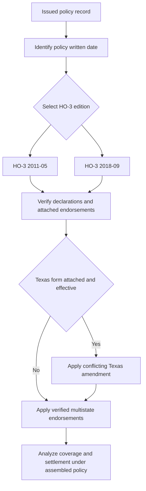

## Purpose and authority boundary

This is a form-selection and policy-assembly reference for the synthetic corpus, not a substitute for the issued policy. The corpus treats forms and bulletins as frozen authority: a revision is issued as a new edition rather than changing the prior file, and the prior edition continues to govern policies written under it. The repository also expressly warns that its operative language is invented and is not a real carrier product, ISO form, or legal advice. [Corpus authority model](repo://README.md#L3-L9) · [Frozen-authority lifecycle](repo://README.md#L28-L35)

The governing base form is determined by the **policy-written date**, not by the loss-report date, a later form's publication date, or an adjuster's preference. HO-3 **2011-05** applies to multistate policies written on or after 2011-05-01. Although superseded for policies written on or after 2018-09-01, it remains in force for policies written under it and governs adjustment of a loss under that policy regardless of when the loss is reported. HO-3 **2018-09** is the multistate base form for policies written on or after 2018-09-01 and supersedes 2011-05 prospectively. [HO-3 2011-05, title and applicability](repo://forms/HO/MS/HO-3/2011-05.md#L1-L7) · [HO-3 2018-09, title and applicability](repo://forms/HO/MS/HO-3/2018-09.md#L1-L4)

| Policy-written date | Governing HO-3 base form | Safe consequence |
| --- | --- | --- |
| 2011-05-01 through 2018-08-31 | **HO-3 2011-05** | Keep applying the 2011 wording to a loss under that policy, even when reported after the later edition was issued. |
| On or after 2018-09-01 | **HO-3 2018-09** | Apply the 2018 wording; it is the edition that introduced, among other provisions, A.4 and the Section I perils-insured-against section. |
| Date cannot be established | **Unresolved** | Obtain the issued policy or other reliable policy-record evidence before deciding coverage or settlement. Neither form supplies a rule that lets a later edition substitute for an unknown written date. |

The first two rows follow the forms' explicit effective and supersession language; the final row is a control against unsupported form substitution. [HO-3 2011-05, supersession and continuing-force notice](repo://forms/HO/MS/HO-3/2011-05.md#L3-L7) · [HO-3 2018-09, applicability](repo://forms/HO/MS/HO-3/2018-09.md#L1-L4)

## Assembly sequence

A coverage conclusion requires a selected base edition plus the policy-specific layers that are actually in force. A form's phrase “if ... attached” is a condition, not proof of attachment. For example, 2011-05 A.3 makes water-backup coverage conditional on attached HO 04 90; 2018-09 A.3 does the same and identifies the endorsement sublimit; 2018-09 A.4 routes wind/hail roof-surfacing settlement to an ACV roof schedule only if that endorsement is attached. [HO-3 2011-05, Exclusion A.3](repo://forms/HO/MS/HO-3/2011-05.md#L59-L66) · [HO-3 2018-09, Exclusion A.3](repo://forms/HO/MS/HO-3/2018-09.md#L69-L77) · [HO-3 2018-09, A.3-A.4](repo://forms/HO/MS/HO-3/2018-09.md#L25-L34)

*Policy assembly starts with the written-date-controlled HO-3 edition, then adds only verified attached forms; a conflicting attached Texas amendment governs over the base form.* [HO-3 2011-05, applicability](repo://forms/HO/MS/HO-3/2011-05.md#L3-L7) · [HO-3 2018-09, applicability and roof attachment condition](repo://forms/HO/MS/HO-3/2018-09.md#L1-L4) [HO-3 2018-09, A.4](repo://forms/HO/MS/HO-3/2018-09.md#L31-L34) · [HO 01 45 2022-01, attachment, effective date, and conflict rule](repo://forms/HO/TX/HO-01-45/2022-01.md#L1-L4)

Use this order:

1. **Select the HO-3 edition.** Apply the written-date rule above; do not borrow an absent section from the later form.
2. **Read the Declarations and issued forms.** Identify limits, deductibles, and whether each endorsement was attached. Base-form settlement and deductible provisions themselves refer to the Declarations. [HO-3 2011-05, A.3 and S.4](repo://forms/HO/MS/HO-3/2011-05.md#L27-L34) [HO-3 2011-05, S.4](repo://forms/HO/MS/HO-3/2011-05.md#L83-L92) · [HO-3 2018-09, A.3 and S.5](repo://forms/HO/MS/HO-3/2018-09.md#L25-L34) [HO-3 2018-09, S.5](repo://forms/HO/MS/HO-3/2018-09.md#L101-L112)
3. **Match each verified endorsement to its stated target.** HO 04 90 names Section I Exclusion A.3; HO 04 16 names Exclusion D.1; HO 04 81 names Exclusion C.2; and HO 23 74 names A.4. [HO 04 90 2010-10, attachment target](repo://forms/HO/MS/HO-04-90/2010-10.md#L1-L4) · [HO 04 16 2018-09, attachment target](repo://forms/HO/MS/HO-04-16/2018-09.md#L1-L4) · [HO 04 81 2018-09, attachment target](repo://forms/HO/MS/HO-04-81/2018-09.md#L1-L4) · [HO 23 74 2018-09, attachment target](repo://forms/HO/MS/HO-23-74/2018-09.md#L1-L4)
4. **Apply a state amendment only when it is part of the policy and within its stated temporal scope.** HO 01 45 is a Texas endorsement effective for policies with an effective date on or after 2022-01-01; where it conflicts with the HO-3 to which it attaches, it governs. Its date trigger is an **effective date**, which is distinct from the HO-3 base-form written-date trigger. [HO 01 45 2022-01, introductory provision](repo://forms/HO/TX/HO-01-45/2022-01.md#L1-L4) · [HO-3 2018-09, base-form written-date applicability](repo://forms/HO/MS/HO-3/2018-09.md#L1-L4)
5. **Apply the resulting text in dependency order.** Establish the coverage grant and exclusions, then the endorsement-specific grant or exception, then settlement, limits, deductibles, conditions, and any state conflict rule. This ordering avoids treating a settlement endorsement as an initial coverage grant. For example, HO 04 16 requires a covered underlying Section I loss and applies after damaged-property settlement; HO 23 74 is limited to roof-surfacing settlement. [HO 04 16 2018-09, O.1 and O.6](repo://forms/HO/MS/HO-04-16/2018-09.md#L5-L9) [HO 04 16 2018-09, O.6](repo://forms/HO/MS/HO-04-16/2018-09.md#L33-L37) · [HO 23 74 2018-09, R.1-R.2](repo://forms/HO/MS/HO-23-74/2018-09.md#L5-L15)

### Cross-reference invariant

Do not retrofit 2018-only targets into a 2011-05 policy. The 2011 edition's Coverage A settlement provision says roof surfacing is settled at replacement cost with no separate settlement basis, while 2018-09 places roof settlement in A.3 subject to new A.4. Likewise, ordinance-or-law Exclusion D.1 and the continuous-leakage rule C.3 appear in 2018-09 but not in the 2011-05 exclusion structure. Therefore a 2011-05 analysis cannot simply invoke HO 23 74's A.4 target, HO 04 16's D.1 target, or HO 04 81's 2018 P.2/C.3 cross-references without policy-record support and a compatible issued form. [HO-3 2011-05, A.3](repo://forms/HO/MS/HO-3/2011-05.md#L27-L34) · [HO-3 2018-09, A.3-A.4](repo://forms/HO/MS/HO-3/2018-09.md#L25-L34) · [HO-3 2011-05, exclusions](repo://forms/HO/MS/HO-3/2011-05.md#L57-L79) · [HO-3 2018-09, C.3 and D.1](repo://forms/HO/MS/HO-3/2018-09.md#L83-L97) · [HO 04 81 2018-09, M.2](repo://forms/HO/MS/HO-04-81/2018-09.md#L11-L17)

## Material differences between the HO-3 editions

The following differences are not a reason to apply 2018-09 to an older policy. They identify questions whose answer changes after the selected edition changes.

| Analysis area | HO-3 2011-05 policy | HO-3 2018-09 policy |
| --- | --- | --- |
| **Roof settlement** | A.3 settles the dwelling, including roof surfacing, at replacement cost (subject to its 80-percent insurance condition and deductible) and states that there is no separate roof-surfacing settlement basis. | A.3 retains the dwelling replacement-cost baseline but makes it subject to A.4. A.4 separately routes windstorm/hail roof surfacing to replacement cost unless an attached ACV roof schedule governs that surfacing only; non-surfacing components stay under A.3. [2011 A.3](repo://forms/HO/MS/HO-3/2011-05.md#L27-L34) · [2018 A.3-A.4](repo://forms/HO/MS/HO-3/2018-09.md#L25-L34) |
| **Property coverage framework and limits** | The form states Coverage A/B/C/D provisions but has no separately labeled Section I perils-insured-against section. Coverage B is structures separated by clear space, and the listed Coverage C special limits are lower. | P.1 expressly covers direct physical loss to A/B property except exclusions, while P.2 lists named Coverage C perils. Coverage B also recognizes certain fence/utility-line connections and excludes specified rental structures; Coverage C raises listed watercraft, jewelry, and firearms theft limits and adds an on-premises business-property limit. [2011 B.1 and C.3](repo://forms/HO/MS/HO-3/2011-05.md#L35-L47) · [2018 B.1-B.3 and C.3](repo://forms/HO/MS/HO-3/2018-09.md#L35-L50) · [2018 P.1-P.2](repo://forms/HO/MS/HO-3/2018-09.md#L59-L64) |
| **Water and gradual-loss analysis** | A.3 excludes sewer/drain backup and sump events unless HO 04 90 is attached; A.1 and A.2 exclude flood/surface water and subsurface water. | A.3 expressly retains the backup exclusion even when mechanical breakdown is involved, subject to an attached HO 04 90 and its sublimit; A.4 adds concurrent/sequential-cause wording for A.1-A.3. C.3 separately excludes weeks-, months-, or years-long seepage/leakage but preserves loss that is sudden and accidental as defined. [2011 A.1-A.3](repo://forms/HO/MS/HO-3/2011-05.md#L59-L66) · [2018 A.1-A.4](repo://forms/HO/MS/HO-3/2018-09.md#L69-L77) · [2018 Definition 5 and C.3](repo://forms/HO/MS/HO-3/2018-09.md#L19-L20) [2018 C.3](repo://forms/HO/MS/HO-3/2018-09.md#L83-L90) |
| **Code-driven costs and intentional loss** | There is no separately stated ordinance-or-law exclusion. The intentional-loss exclusion is D.1 and is stated as applying to the insured who commits or conspires to commit the act. | D.1 excludes ordinance-or-law increased construction, demolition, or repair cost unless an ordinance endorsement is attached. Intentional loss is E.1 and expressly applies to all insureds whether or not a particular insured participated. [2011 D.1](repo://forms/HO/MS/HO-3/2011-05.md#L77-L80) · [2018 D.1 and E.1](repo://forms/HO/MS/HO-3/2018-09.md#L91-L98) |
| **Loss handling and deductible routing** | S.1 requires prompt notice and property protection; S.4 applies the Declarations deductible to each Section I loss. | S.1 additionally requires a damaged-personal-property inventory; S.3 states adjustment and payment timing after proof of loss plus agreement, appraisal award, or judgment. S.5 recognizes a separate state-required wind/hail deductible and, absent a superseding state form, selects only the larger when both apply. [2011 S.1-S.4](repo://forms/HO/MS/HO-3/2011-05.md#L83-L92) · [2018 S.1-S.5](repo://forms/HO/MS/HO-3/2018-09.md#L101-L112) |
| **Section II scope** | Medical payments applies to necessary expenses within three years for injury to a person other than an insured; the business exclusion has no stated occasional-rental exception. | Medical payments also requires that injury arise from a condition on the insured location or insured activities. The business exclusion permits occasional rental of the residence premises for fewer than 15 days in a policy year, and L.3 excludes Coverage E property damage to property owned by or rented to an insured. [2011 F.1 and L.1](repo://forms/HO/MS/HO-3/2011-05.md#L101-L111) · [2018 F.1 and L.1-L.3](repo://forms/HO/MS/HO-3/2018-09.md#L121-L133) |

2018-09 also defines ACV using depreciation based on age, condition, and remaining useful life immediately before loss, defines replacement cost at the time of loss, and adds a definition of “sudden and accidental.” The 2011-05 definitions use shorter ACV and replacement-cost definitions and have no Definition 5. These are inputs to the 2018-specific provisions; they do not revise a 2011-05 policy. [HO-3 2011-05, Definitions 1-4](repo://forms/HO/MS/HO-3/2011-05.md#L13-L22) · [HO-3 2018-09, Definitions 1-5](repo://forms/HO/MS/HO-3/2018-09.md#L9-L20)

## Endorsement effects after attachment is verified

The following forms are not automatic components of every HO-3 policy. Their headings identify them as endorsements that attach to HO-3 and name the base target; use the matrix only after the attachment check and selected-edition cross-reference check.

### Corpus availability is not policy issuance

The repository's “Current contents” list is an inventory of available frozen-authority documents. It does **not** establish that any listed endorsement was issued with a particular policy. For an individual policy, treat a form as part of the assembled contract only when the issued policy record or Declarations verifies its attachment and edition. This matters even where the base form names an endorsement: HO-3 makes the water-backup and roof-schedule paths conditional on an endorsement being attached, while each supplied endorsement identifies itself as attaching to HO-3. [Corpus inventory](repo://README.md#L65-L86) · [HO-3 2018-09, attachment conditions](repo://forms/HO/MS/HO-3/2018-09.md#L31-L34) [A.3](repo://forms/HO/MS/HO-3/2018-09.md#L69-L77) · [HO 04 16, HO 04 81, HO 04 90, and HO 23 74, attachment statements](repo://forms/HO/MS/HO-04-16/2018-09.md#L1-L4) · [HO 04 81](repo://forms/HO/MS/HO-04-81/2018-09.md#L1-L4) · [HO 04 90](repo://forms/HO/MS/HO-04-90/2010-10.md#L1-L4) · [HO 23 74](repo://forms/HO/MS/HO-23-74/2018-09.md#L1-L4)

| Verified attached form | Effect on the applicable base wording | Key boundaries for analysis |
| --- | --- | --- |
| **HO 04 90, 2010-10 — Water Backup and Sump Discharge or Overflow** | Changes the A.3 water-backup exclusion by covering direct physical loss to A/B/C property from backup through sewers or drains or sump-related overflow/discharge, including where mechanical breakdown causes it. Both HO-3 editions identify attached HO 04 90 as the exception to A.3. [Endorsement W.1](repo://forms/HO/MS/HO-04-90/2010-10.md#L1-L8) · [2011 A.3](repo://forms/HO/MS/HO-3/2011-05.md#L59-L66) · [2018 A.3](repo://forms/HO/MS/HO-3/2018-09.md#L69-L77) | Default aggregate policy-period sublimit is $5,000 unless a higher Declarations limit is shown, and the separate $500 deductible replaces the Section I deductible. Flood/surface-water and subsurface-water exclusions remain; known, unremedied maintenance failure can bar this endorsement's coverage. A/B follows the attached policy's settlement basis; C is ACV unless its Declarations say otherwise. [W.2-W.6](repo://forms/HO/MS/HO-04-90/2010-10.md#L9-L31) |
| **HO 04 81, 2018-09 — Limited Fungi, Wet or Dry Rot, or Bacteria Coverage** | Provides limited Section I property coverage notwithstanding C.2, but only when the fungi, rot, or bacteria resulted from an underlying insured peril during the policy period. It does not remove flood/surface-water, subsurface-water, or long-term seepage barriers to the underlying loss. [Endorsement M.1-M.2](repo://forms/HO/MS/HO-04-81/2018-09.md#L1-L17) · [2018 C.2-C.3 and A.1-A.2](repo://forms/HO/MS/HO-3/2018-09.md#L69-L74) [2018 C.2-C.3](repo://forms/HO/MS/HO-3/2018-09.md#L83-L90) | $10,000 per policy period by default, aggregate across occurrences, claims, and locations; it is within—not additional to—A/B/C limits. The limit includes removal, access, testing, and related Coverage D increase. A separate mitigation condition applies, and Section II liability coverage is unchanged. [M.3-M.6](repo://forms/HO/MS/HO-04-81/2018-09.md#L19-L37) |
| **HO 04 16, 2018-09 — Ordinance or Law Coverage** | Removes the 2018-09 D.1 exclusion to the stated extent for increased repair, rebuild, or demolition cost caused by an in-force ordinance/law, if the underlying Section I loss is covered. It also addresses code-required removal of undamaged portions, including undamaged roof surfacing required to repair the damaged part. [Endorsement O.1 and O.3](repo://forms/HO/MS/HO-04-16/2018-09.md#L5-L19) · [2018 D.1](repo://forms/HO/MS/HO-3/2018-09.md#L91-L94) | Default limit is an additional 10% of Coverage A unless a higher percentage is shown. The work must be timely completed, it pays only increased cost actually incurred after settlement of the damaged property, and O.4 retains listed restrictions. [O.2 and O.4-O.6](repo://forms/HO/MS/HO-04-16/2018-09.md#L11-L37) |
| **HO 23 74, 2018-09 — ACV Loss Settlement for Roof Surfacing** | Changes 2018-09 A.4's windstorm/hail roof-surfacing settlement path to ACV under its schedule, leaving all non-surfacing dwelling components under A.3. It does not apply to a roof-surfacing loss caused by another covered peril. [Endorsement R.1-R.2](repo://forms/HO/MS/HO-23-74/2018-09.md#L5-L15) · [2018 A.3-A.4](repo://forms/HO/MS/HO-3/2018-09.md#L25-L34) | “Roof surfacing” has a defined component boundary. The schedule uses material and documented age, has a 25% pre-deductible floor, and treats unsupported age as the dwelling's age. Code-required undamaged surfacing is not payable under this schedule unless an ordinance endorsement is attached. [R.1 and R.3-R.6](repo://forms/HO/MS/HO-23-74/2018-09.md#L5-L10) [R.3-R.6](repo://forms/HO/MS/HO-23-74/2018-09.md#L17-L41) |
| **HO 01 45, 2022-01 — Texas Amendatory Endorsement** | For a Texas policy effective on or after 2022-01-01 to which it is attached, this form controls over a conflicting HO-3 provision. It amends the base deductible treatment: a windstorm/hail loss receives only the separate wind/hail deductible rather than also the all-other-perils deductible. [Texas attachment/conflict rule and T.1](repo://forms/HO/TX/HO-01-45/2022-01.md#L1-L11) · [2018 S.5 default](repo://forms/HO/MS/HO-3/2018-09.md#L101-L112) | The percentage is generally 1%-5% of Coverage A, with a 10% maximum in stated seacoast territories; T.1 also specifies mixed-peril allocation. T.2 preserves the prior percentage for a renewal if 30-day notice of an increase was not given. T.4 changes S.4's action period to two years and one day, and T.5 establishes claim acknowledgement, decision, and payment deadlines. [T.1-T.5](repo://forms/HO/TX/HO-01-45/2022-01.md#L5-L27) |

For Texas, HO 01 45 says its T.1 implements Bulletin B-2021-08. The bulletin applies to Texas residential property policies effective on or after 2022-01-01, independently requires disclosure and restricts applying both deductibles to the same wind/hail loss, and requires an insurer to file the amendatory endorsement and rate rule before applying that deductible. These regulatory requirements do not prove that HO 01 45 is attached to a particular policy; apply its contractual changes only after the policy assembly check. [HO 01 45 2022-01, T.1](repo://forms/HO/TX/HO-01-45/2022-01.md#L5-L11) · [Texas Bulletin B-2021-08, applicability and B.3-B.4](repo://bulletins/TX/2021-08-windstorm-deductible.md#L1-L25) · [Texas Bulletin B-2021-08, B.7](repo://bulletins/TX/2021-08-windstorm-deductible.md#L35-L37)

## File-review controls and focused scenarios

Before issuing an analysis, record: policy-written date; policy effective date; state; exact HO-3 edition; Declarations limits and deductible(s); each attached endorsement and edition; loss date and cause; and, where relevant, the factual inputs required by an endorsement. This record separates an evidence-backed issued-policy conclusion from a conclusion imported from a later form. The sources make loss settlement, deductibles, and endorsement limits dependent on policy or Declarations values. [HO-3 2018-09, A.3-A.4 and S.5](repo://forms/HO/MS/HO-3/2018-09.md#L25-L34) [HO-3 2018-09, S.5](repo://forms/HO/MS/HO-3/2018-09.md#L101-L112) · [HO 04 90 2010-10, W.2-W.3](repo://forms/HO/MS/HO-04-90/2010-10.md#L9-L15) · [HO 04 16 2018-09, O.2](repo://forms/HO/MS/HO-04-16/2018-09.md#L11-L14)

Use these focused review scenarios to catch unsafe assembly:

1. **Late-reported 2011 policy:** Select HO-3 2011-05 from the written date and confirm that its A.3, not 2018 A.4, governs roof surfacing. [HO-3 2011-05, continuing-force notice and A.3](repo://forms/HO/MS/HO-3/2011-05.md#L3-L7) [HO-3 2011-05, A.3](repo://forms/HO/MS/HO-3/2011-05.md#L27-L34)
2. **2018 wind/hail roof claim:** Require proof that HO 23 74 is attached before scheduling roof surfacing; if it is attached, keep decking, trusses, rafters, sheathing, and interior finish out of its surfacing schedule. [HO-3 2018-09, A.4](repo://forms/HO/MS/HO-3/2018-09.md#L31-L34) · [HO 23 74 2018-09, R.1-R.2](repo://forms/HO/MS/HO-23-74/2018-09.md#L5-L15)
3. **Backup followed by fungi:** Verify HO 04 90 for the backup and HO 04 81 for fungi/rot/bacteria; then test the underlying water source, aggregate fungi limit, separate water-backup deductible, and mitigation condition rather than assuming either endorsement restores all water loss. [HO 04 90 2010-10, W.1-W.5](repo://forms/HO/MS/HO-04-90/2010-10.md#L5-L25) · [HO 04 81 2018-09, M.1-M.5](repo://forms/HO/MS/HO-04-81/2018-09.md#L5-L31)
4. **Code-required undamaged roof work:** Separate the scheduled damaged surfacing from the ordinance-driven undamaged work; confirm HO 04 16, its additional limit, completion time, and incurred-cost/post-settlement conditions. [HO 23 74 2018-09, R.6](repo://forms/HO/MS/HO-23-74/2018-09.md#L37-L41) · [HO 04 16 2018-09, O.1-O.6](repo://forms/HO/MS/HO-04-16/2018-09.md#L5-L37)
5. **Texas wind/hail loss:** Confirm the Texas endorsement's attachment and effective-date condition before replacing the base deductible rule; if applicable, apply T.1's non-stacking and mixed-peril rules, then test renewal-notice facts if a higher percentage is asserted. [HO 01 45 2022-01, introductory provision and T.1-T.2](repo://forms/HO/TX/HO-01-45/2022-01.md#L1-L15) · [HO-3 2018-09, S.5](repo://forms/HO/MS/HO-3/2018-09.md#L101-L112)

The core invariant is simple: **a later form is a new authority, not a retroactive patch.** First preserve the HO-3 edition issued for the policy-written date; then add only compatible, actually attached endorsements and any applicable conflicting state amendment. That sequence preserves both the continuing force of 2011-05 policies and the specific changes the 2018-09 edition and later endorsements make. [Corpus frozen-authority model](repo://README.md#L28-L35) · [HO-3 2011-05, continuing-force notice](repo://forms/HO/MS/HO-3/2011-05.md#L3-L7) · [HO-3 2018-09, supersession](repo://forms/HO/MS/HO-3/2018-09.md#L1-L4)
