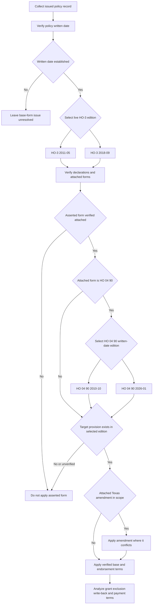

## Purpose and authority boundary

This page assembles an issued policy in the synthetic corpus; it is not a substitute for that policy, a real insurance product, or legal advice. The corpus's forms and bulletins are frozen authority. A revision is issued as a new file, leaving the earlier edition in force for policies written under it; internal guidance is a different, living authority layer. [Corpus scope and authority model](repo://README.md#L3-L9) · [Frozen-authority lifecycle](repo://README.md#L28-L36)

The controlling contract is the selected HO-3 edition, its Declarations, and only those endorsements or amendments verified as attached to that policy. A repository file, an underwriting configuration rule, or a bulletin can establish availability or constrain insurer conduct; none proves attachment to an individual policy. [Corpus inventory and cross-reference model](repo://README.md#L65-L86)

## Select the live base edition

**HO-3 2018-09 supersedes HO-3 2011-05** for policies written on or after **2018-09-01**. The supersession is prospective: HO-3 2011-05 remains in force for policies written under it and governs adjustment of their losses regardless of the reporting date. The policy-written date—not the loss-report date, policy effective date, or a later form's publication date—therefore selects the base form. [HO-3 2018-09, applicability and supersession](repo://forms/HO/MS/HO-3/2018-09.md#L1-L4) · [HO-3 2011-05, supersession marker, continuing force, and applicability](repo://forms/HO/MS/HO-3/2011-05.md#L1-L7)

| Policy-written date | Live base form | Assembly consequence |
| --- | --- | --- |
| 2011-05-01 through 2018-08-31 | **HO-3 2011-05** | Continue to apply 2011-05 wording, including after a later-reported loss. Do not supply a later section that this edition does not contain. |
| On or after 2018-09-01 | **HO-3 2018-09** | Apply the 2018-09 wording and then test its attached-form exceptions, including its A.4 roof-surfacing route. |
| Written date unverified | **Unresolved** | Obtain the issued policy or reliable policy-record evidence before reaching a coverage, settlement, or deductible conclusion. |

The first two rows follow the forms' express written-date scopes and supersession notices. The unresolved result is a file-review control: neither form authorizes replacing an unknown edition with the newer text. [HO-3 2011-05, continuing force and applicability](repo://forms/HO/MS/HO-3/2011-05.md#L3-L7) · [HO-3 2018-09, applicability](repo://forms/HO/MS/HO-3/2018-09.md#L1-L4)

### Why the selection changes analysis

The selected edition changes the available provisions, rather than merely their labels:

- **Roof settlement:** HO-3 2011-05 A.3 settles the dwelling, including roof surfacing, at replacement cost and says no separate roof-surfacing settlement basis applies. HO-3 2018-09 A.3 makes the dwelling baseline subject to A.4, and A.4 routes windstorm/hail roof surfacing to an attached actual-cash-value schedule if one exists. [2011 A.3](repo://forms/HO/MS/HO-3/2011-05.md#L27-L34) · [2018 A.3-A.4](repo://forms/HO/MS/HO-3/2018-09.md#L25-L34)
- **Property and water gates:** HO-3 2018-09 adds the P.1 direct-physical-loss grant for Coverages A/B, the P.2 named-peril gate for Coverage C, A.4 concurrent/sequential-cause language for water exclusions, and C.3 long-duration leakage wording. These provisions do not occur in the supplied HO-3 2011-05 exclusion structure. [2018 P.1-P.2 and A.1-A.4](repo://forms/HO/MS/HO-3/2018-09.md#L59-L77) · [2018 C.3](repo://forms/HO/MS/HO-3/2018-09.md#L83-L90) · [2011 property coverages and exclusions](repo://forms/HO/MS/HO-3/2011-05.md#L25-L80)
- **Ordinance and conditions:** HO-3 2018-09 adds Section I Exclusion D.1 for ordinance-or-law cost and places the action limitation in S.4 and deductible treatment in S.5. In 2011-05, D.1 is intentional loss, S.3 is the action limitation, and S.4 is the deductible. [2018 D.1 and S.3-S.5](repo://forms/HO/MS/HO-3/2018-09.md#L91-L112) · [2011 D.1 and S.3-S.4](repo://forms/HO/MS/HO-3/2011-05.md#L77-L92)

These differences are compatibility controls, not a license to retrofit 2018-09 outcomes into a 2011-05 policy.

## Select the HO 04 90 endorsement edition

The HO-3 selection and the water-backup endorsement selection are separate written-date controls. Select the base form first using the HO-3 **2018-09-01** rule. Then, only after the issued-policy record verifies that **HO 04 90** is attached, select the attached endorsement edition using HO 04 90's own **2026-01-01** replacement rule. A policy written before 2026-01-01 can therefore use the 2018-09 HO-3 base form with the continuing 2010-10 water-backup endorsement; the 2026 endorsement rule does not reselect the base form. [HO-3 2018-09, applicability](repo://forms/HO/MS/HO-3/2018-09.md#L1-L4) · [HO 04 90 2010-10, supersession and continuing force](repo://forms/HO/MS/HO-04-90/2010-10.md#L1-L7) · [HO 04 90 2026-01, replacement rule](repo://forms/HO/MS/HO-04-90/2026-01.md#L1-L4)

| Verified attached HO 04 90 and policy-written date | Governing endorsement edition | Assembly consequence |
| --- | --- | --- |
| 2010-10 edition, written before 2026-01-01 | **HO 04 90 2010-10** | This edition remains in force for policies written under it and governs their adjustment regardless of when the loss is reported. Apply W.1-W.6, including its $5,000 default policy-period sublimit, $500 separate deductible, and W.6 settlement rule. |
| 2026-01 edition, written on or after 2026-01-01 | **HO 04 90 2026-01** | Apply W.1-W.7, including its $10,000 default policy-period sublimit, $1,000 separate deductible, new W.6 finished-below-grade backflow-prevention requirement, and W.7 settlement rule. |
| Attachment or endorsement edition unverified | **Unresolved** | Do not substitute a repository edition or infer the payment and condition terms from the base-form date. Obtain the issued endorsement and Declarations. |

The endorsement's shared W.1 coverage route, W.4 retained exclusions, and W.5 maintenance condition do not select an edition. The payment terms differ: 2010-10 W.2/W.3 set the $5,000/$500 terms and W.6 contains the settlement rule; 2026-01 W.2/W.3 set the $10,000/$1,000 terms, new W.6 adds the below-grade condition, and W.7 contains the settlement rule. In both editions, the stated sublimit is within—not additional to—the A/B/C limits, the separate deductible displaces the Section I Declarations deductible for covered endorsement loss, and Coverage C is actual cash value unless the endorsement Declarations say otherwise. [HO 04 90 2010-10 W.2-W.6](repo://forms/HO/MS/HO-04-90/2010-10.md#L13-L35) · [HO 04 90 2026-01 W.2-W.7](repo://forms/HO/MS/HO-04-90/2026-01.md#L13-L56)

For 2026-01 only, W.6 applies when the residence premises has a finished area below grade: a backwater valve or equivalent backflow-prevention device must have been installed and operable on the serving sewer line at the time of loss. Retain the below-grade status, device type and location, installation record, and at-loss operability evidence before deciding that condition. It is expressly new to 2026-01; do not impose it on a 2010-10 claim. [HO 04 90 2026-01 W.6](repo://forms/HO/MS/HO-04-90/2026-01.md#L42-L47)

## Assembly sequence

*The assembly flow selects the HO-3 base edition from its written-date rule, verifies attachment, then selects a verified HO 04 90 from its separate written-date rule before testing compatibility. It admits only verified compatible forms and gives an in-scope attached Texas amendment effect only at a conflicting provision.* [HO-3 2011-05, applicability and continuing force](repo://forms/HO/MS/HO-3/2011-05.md#L3-L7) · [HO-3 2018-09, applicability](repo://forms/HO/MS/HO-3/2018-09.md#L1-L4) · [HO 04 90 2010-10, continuing force](repo://forms/HO/MS/HO-04-90/2010-10.md#L1-L7) · [HO 04 90 2026-01, replacement rule](repo://forms/HO/MS/HO-04-90/2026-01.md#L1-L4) · [HO 01 45, attachment, effective-date scope, and conflict rule](repo://forms/HO/TX/HO-01-45/2022-01.md#L1-L4)

Use this sequence:

1. **Establish the base-form record.** Retain the policy-written date, selected HO-3 edition, state, policy effective date, full Declarations, limits, deductibles, and exact attached-form editions. The base forms make settlement and deductible application depend on the Declarations. [HO-3 2011-05 A.3 and S.4](repo://forms/HO/MS/HO-3/2011-05.md#L27-L34) · [HO-3 2011-05 S.4](repo://forms/HO/MS/HO-3/2011-05.md#L89-L92) · [HO-3 2018-09 A.3-A.4 and S.5](repo://forms/HO/MS/HO-3/2018-09.md#L25-L34) · [HO-3 2018-09 S.5](repo://forms/HO/MS/HO-3/2018-09.md#L109-L112)
2. **Verify attachment before reading an exception.** “If attached” in a base form is a condition to an exception, not evidence that the endorsement was issued. For example, HO-3 2011-05 and 2018-09 A.3 each make their water-backup exception conditional on attached HO 04 90; 2018-09 A.4 makes the roof-schedule route conditional on an attached endorsement. [2011 A.3](repo://forms/HO/MS/HO-3/2011-05.md#L63-L66) · [2018 A.3-A.4](repo://forms/HO/MS/HO-3/2018-09.md#L31-L34) · [2018 A.3](repo://forms/HO/MS/HO-3/2018-09.md#L75-L77)
3. **Select the verified HO 04 90 edition separately.** For an attached HO 04 90, retain the attached edition and test its own 2026-01-01 written-date replacement rule. This is an endorsement check after attachment, not a second HO-3 selection and not a replacement for the HO-3 2018-09-01 rule. If attachment, edition, or written date cannot be established, leave the water-backup payment and condition issue unresolved. [HO 04 90 2010-10, supersession and continuing force](repo://forms/HO/MS/HO-04-90/2010-10.md#L1-L7) · [HO 04 90 2026-01, replacement rule](repo://forms/HO/MS/HO-04-90/2026-01.md#L1-L4)
4. **Match the directed target.** Confirm that the endorsement's target provision exists and has the stated function in the selected edition. Do not infer compatibility from a shared HO-3 form number or the repository's inventory.
5. **Apply the correct layer in dependency order.** Establish the selected base grant and exclusions; apply a verified narrow write-back and its preserved barriers; then apply its limit, deductible, condition, and settlement mechanics. Apply an attached in-scope state amendment where it conflicts with the base provision. A settlement term never becomes the initial coverage grant merely because it is attached. [HO 04 16 O.1 and O.6](repo://forms/HO/MS/HO-04-16/2018-09.md#L5-L9) · [HO 04 16 O.6](repo://forms/HO/MS/HO-04-16/2018-09.md#L33-L37) · [HO 23 74 R.1-R.2](repo://forms/HO/MS/HO-23-74/2018-09.md#L5-L15) · [HO 01 45, conflict rule](repo://forms/HO/TX/HO-01-45/2022-01.md#L1-L4)

## Verified-attachment relationship matrix

The relationships below use the target provision named in the form. They apply only after the issued-policy attachment and edition checks; the source files' presence in the corpus establishes neither fact.

| Attached form and directed relationship | What the relationship does | Assembly boundary |
| --- | --- | --- |
| **HO 04 90 2010-10 or 2026-01 W.1 writes back HO-3 Section I Exclusions A.3.** | In either verified attached edition, W.1 supplies the same narrow direct-physical-loss path for the stated sewer/drain backup and sump overflow/discharge events, including an event involving mechanical breakdown. Both HO-3 editions make A.3's exception conditional on attachment. [HO 04 90 2010-10 W.1](repo://forms/HO/MS/HO-04-90/2010-10.md#L9-L12) · [HO 04 90 2026-01 W.1](repo://forms/HO/MS/HO-04-90/2026-01.md#L6-L11) · [HO-3 2011-05 A.3](repo://forms/HO/MS/HO-3/2011-05.md#L63-L66) · [HO-3 2018-09 A.3](repo://forms/HO/MS/HO-3/2018-09.md#L75-L77) | **HO 04 90 2010-10 or 2026-01 W.4 preserves HO-3 Section I Exclusions A.1 and A.2**: it does not write back flood/surface-water or subsurface-water loss. **2010-10 W.2 and W.3 modify the W.1 route's payment terms** with a $5,000 default policy-period sublimit within A/B/C limits and a $500 separate deductible; **2010-10 W.6 modifies Coverage C settlement** to ACV unless its endorsement Declarations say otherwise. **2026-01 W.2 and W.3 modify those payment terms** to a $10,000 default sublimit and $1,000 separate deductible; **2026-01 W.7 modifies Coverage C settlement** to the same stated ACV result. **2026-01 W.6 modifies the W.1 route's eligibility** for a residence with finished below-grade area: the serving sewer line must have had an installed, operable backwater valve or equivalent device at loss. **2010-10 and 2026-01 W.5 modify the W.1 route's eligibility** with the same known, unremedied maintenance condition. [HO 04 90 2010-10 W.2-W.6](repo://forms/HO/MS/HO-04-90/2010-10.md#L13-L35) · [HO 04 90 2026-01 W.2-W.7](repo://forms/HO/MS/HO-04-90/2026-01.md#L13-L56) |
| **HO 04 81 M.1 writes back HO-3 2018-09 Section I Exclusions C.2.** | M.1 restores limited A/B/C property coverage for fungi, rot, or bacteria only when it results from an underlying Section I insured peril during the policy period. [HO 04 81 M.1](repo://forms/HO/MS/HO-04-81/2018-09.md#L5-L10) · [HO-3 2018-09 C.2](repo://forms/HO/MS/HO-3/2018-09.md#L83-L88) | **HO 04 81 M.2 preserves HO-3 2018-09 A.1, A.2, and C.3** by requiring an underlying covered moisture event and denying this route for flood/surface water, subsurface water, and weeks-/months-/years-long leakage. M.3-M.5 modify the M.1 write-back with a default $10,000 within-limit aggregate and a separate mitigation condition. P.2 and C.3 are 2018-09 targets; do not retrofit those references into 2011-05. [HO 04 81 M.2-M.5](repo://forms/HO/MS/HO-04-81/2018-09.md#L11-L31) · [HO-3 2018-09 P.2](repo://forms/HO/MS/HO-3/2018-09.md#L61-L64) · [HO-3 2018-09 A.1-A.2 and C.3](repo://forms/HO/MS/HO-3/2018-09.md#L69-L74) · [HO-3 2018-09 C.3](repo://forms/HO/MS/HO-3/2018-09.md#L83-L90) · [HO-3 2011-05 exclusions](repo://forms/HO/MS/HO-3/2011-05.md#L57-L80) |
| **HO 04 16 O.1 writes back HO-3 2018-09 Section I Exclusions D.1.** | O.1 restores the stated increased repair, rebuild, or demolition cost where the ordinance is in force and the underlying Section I loss is covered. O.3 extends that write-back to the described undamaged portions, including undamaged roof surfacing required to repair the damaged portion. [HO 04 16 O.1 and O.3](repo://forms/HO/MS/HO-04-16/2018-09.md#L5-L19) · [HO-3 2018-09 D.1](repo://forms/HO/MS/HO-3/2018-09.md#L91-L94) | O.2 and O.4-O.6 modify the O.1 write-back's payment mechanics: the default additional limit is 10% of Coverage A, exclusions remain, work is time-limited, and payment follows damaged-property settlement and only for increased cost actually incurred. D.1 is not an ordinance exclusion in 2011-05—there it is intentional loss—so do not attach this target logic to a 2011-05 analysis without compatible issued-form evidence. [HO 04 16 O.2 and O.4-O.6](repo://forms/HO/MS/HO-04-16/2018-09.md#L11-L37) · [HO-3 2018-09 D.1](repo://forms/HO/MS/HO-3/2018-09.md#L91-L94) · [HO-3 2011-05 D.1](repo://forms/HO/MS/HO-3/2011-05.md#L77-L80) |
| **HO 23 74 R.1-R.2 modifies HO-3 2018-09 Section I A.4.** | It changes only the 2018 A.4 windstorm/hail roof-surfacing settlement branch to ACV under R.3's schedule. R.1 preserves HO-3 2018-09 A.3 replacement-cost settlement for components other than defined roof surfacing, and R.2 preserves replacement cost for roof-surfacing loss caused by another covered peril. [HO 23 74 R.1-R.2](repo://forms/HO/MS/HO-23-74/2018-09.md#L5-L15) · [HO-3 2018-09 A.3-A.4](repo://forms/HO/MS/HO-3/2018-09.md#L25-L34) | R.6 preserves HO-3 2018-09 D.1 for ordinance-required undamaged surfacing; the roof schedule does not pay it unless an ordinance endorsement is attached. A.4 does not exist in supplied 2011-05, whose A.3 expressly has no separate roof-surfacing basis. [HO 23 74 R.6](repo://forms/HO/MS/HO-23-74/2018-09.md#L37-L41) · [HO-3 2018-09 D.1](repo://forms/HO/MS/HO-3/2018-09.md#L91-L94) · [HO-3 2011-05 A.3](repo://forms/HO/MS/HO-3/2011-05.md#L27-L34) |

### Compatibility invariant

An endorsement header naming “HO-3” does not erase its stated target or its own edition rule. In particular, do not apply HO 23 74's A.4 route, HO 04 16's D.1 ordinance write-back, or HO 04 81's P.2/C.3-dependent M.2 analysis to a 2011-05 policy merely because the 2018 endorsement is available. Conversely, both HO 04 90 editions expressly target A.3, which exists in both supplied HO-3 editions, but the issued record must prove attachment and identify whether 2010-10 or 2026-01 governs the endorsement's payment and condition terms. [HO 23 74, attachment target](repo://forms/HO/MS/HO-23-74/2018-09.md#L1-L4) · [HO 04 16, attachment target](repo://forms/HO/MS/HO-04-16/2018-09.md#L1-L4) · [HO 04 81, attachment target and M.2](repo://forms/HO/MS/HO-04-81/2018-09.md#L1-L4) · [HO 04 81 M.2](repo://forms/HO/MS/HO-04-81/2018-09.md#L11-L17) · [HO 04 90 2010-10, attachment target and status](repo://forms/HO/MS/HO-04-90/2010-10.md#L1-L7) · [HO 04 90 2026-01, attachment target and replacement rule](repo://forms/HO/MS/HO-04-90/2026-01.md#L1-L4) · [HO-3 2011-05 A.3](repo://forms/HO/MS/HO-3/2011-05.md#L63-L66) · [HO-3 2018-09 A.3](repo://forms/HO/MS/HO-3/2018-09.md#L75-L77)

## Texas amendment and bulletin: separate contract and constraint layers

HO 01 45 is a Texas endorsement that attaches to HO-3, applies only to policies with an effective date on or after **2022-01-01**, and governs when it conflicts with the form to which it attaches. Its effective-date gate is distinct from the HO-3 policy-**written**-date gate. Verify both dates and attachment; the Texas form does not choose the base edition. [HO 01 45, attachment, effective date, and conflict rule](repo://forms/HO/TX/HO-01-45/2022-01.md#L1-L4) · [HO-3 2018-09, written-date scope](repo://forms/HO/MS/HO-3/2018-09.md#L1-L4)

- **HO 01 45 T.1 implements Texas Bulletin B-2021-08 B.3 and modifies HO-3 2018-09 Section I Conditions S.5.** T.1 replaces the base rule for windstorm/hail loss with only the separate wind/hail deductible, and supplies the same mixed-peril allocation rule stated in B.3. Cite the amendment and its base target when explaining the contract result; cite the bulletin for the regulatory constraint. [HO 01 45 T.1](repo://forms/HO/TX/HO-01-45/2022-01.md#L5-L11) · [HO-3 2018-09 S.5](repo://forms/HO/MS/HO-3/2018-09.md#L109-L112) · [Bulletin B.3](repo://bulletins/TX/2021-08-windstorm-deductible.md#L15-L19)
- **HO 01 45 T.4 modifies HO-3 2018-09 Section I Conditions S.4.** It changes the action period from two years after loss to two years and one day. T.4 names S.4; on 2011-05 S.4 is instead the deductible provision and the action limitation is S.3. Do not silently transpose that cross-reference to an older policy. [HO 01 45 T.4](repo://forms/HO/TX/HO-01-45/2022-01.md#L21-L23) · [HO-3 2018-09 S.4](repo://forms/HO/MS/HO-3/2018-09.md#L107-L110) · [HO-3 2011-05 S.3-S.4](repo://forms/HO/MS/HO-3/2011-05.md#L87-L92)
- **HO 01 45 T.5 adds Texas claim milestones but does not identify HO-3 2018-09 S.3 as a provision it modifies.** Track T.5's 15-day acknowledgement, 15-business-day decision, and five-business-day post-approval payment milestones separately from S.3's proof-of-loss-plus-resolution payment trigger. [HO 01 45 T.5](repo://forms/HO/TX/HO-01-45/2022-01.md#L25-L27) · [HO-3 2018-09 S.3](repo://forms/HO/MS/HO-3/2018-09.md#L105-L108)
- **Bulletin B-2021-08 B.2, B.4, and B.7 constrain insurer deductible configuration, disclosure, and filing.** They govern insurer conduct for in-scope Texas policies, but they do not amend an issued contract or prove that HO 01 45 is attached. The bulletin applies to Texas residential property policies delivered or issued for delivery with an effective date on or after 2022-01-01. [Bulletin applicability](repo://bulletins/TX/2021-08-windstorm-deductible.md#L1-L7) · [Bulletin B.2](repo://bulletins/TX/2021-08-windstorm-deductible.md#L9-L13) · [Bulletin B.4](repo://bulletins/TX/2021-08-windstorm-deductible.md#L21-L25) · [Bulletin B.7](repo://bulletins/TX/2021-08-windstorm-deductible.md#L35-L37)

For an attached, in-scope HO 01 45, also verify whether T.7's separately attached exclusion and signed acknowledgement remove windstorm/hail from the policy; if so, T.7 says T.1 does not apply. This is a separate assembly branch, not evidence that every Texas policy has either the deductible or the exclusion. [HO 01 45 T.7](repo://forms/HO/TX/HO-01-45/2022-01.md#L33-L37)

## File-review tests and handoffs

Before a coverage position, payment estimate, or Texas deductible conclusion, run these focused tests:

1. **Late-reported older policy:** Select 2011-05 from the written date and use its A.3 roof baseline. Reject an argument that treats 2018 A.4 or HO 23 74 as an automatic retroactive patch. [HO-3 2011-05, continuing force and A.3](repo://forms/HO/MS/HO-3/2011-05.md#L3-L7) · [HO-3 2011-05 A.3](repo://forms/HO/MS/HO-3/2011-05.md#L27-L34)
2. **Water backup followed by fungi:** Independently verify HO 04 90 and HO 04 81, then establish the water source, W.4 preserved exclusions, W.5 maintenance facts, M.2 underlying-peril facts, and both endorsements' separate payment terms. For HO 04 90, select 2010-10 or 2026-01 after attachment; on 2026-01 also establish the finished-below-grade and at-loss backflow-device facts required by W.6. [HO 04 90 2010-10 W.1-W.5](repo://forms/HO/MS/HO-04-90/2010-10.md#L9-L29) · [HO 04 90 2026-01 W.1-W.6](repo://forms/HO/MS/HO-04-90/2026-01.md#L6-L47) · [HO 04 81 M.1-M.5](repo://forms/HO/MS/HO-04-81/2018-09.md#L5-L31)
3. **Wind/hail roof plus code work:** For a 2018-09 policy, keep the covered-loss decision, A.4/HO 23 74 settlement path, and HO 04 16 ordinance path distinct. Verify each attachment; R.6 does not itself pay undamaged surfacing. [HO-3 2018-09 A.3-A.4 and D.1](repo://forms/HO/MS/HO-3/2018-09.md#L25-L34) · [HO-3 2018-09 D.1](repo://forms/HO/MS/HO-3/2018-09.md#L91-L94) · [HO 23 74 R.6](repo://forms/HO/MS/HO-23-74/2018-09.md#L37-L41) · [HO 04 16 O.1-O.6](repo://forms/HO/MS/HO-04-16/2018-09.md#L5-L37)
4. **Texas mixed-peril loss:** Separately verify Texas delivery/effective-date facts for the bulletin and attachment/effective-date facts for HO 01 45. If T.1 governs, allocate deductibles by separately determinable damage portions or use the larger single deductible if they cannot be determined; test renewal-notice facts before applying an increased percentage. [Bulletin B.3-B.4](repo://bulletins/TX/2021-08-windstorm-deductible.md#L15-L25) · [HO 01 45 T.1-T.2](repo://forms/HO/TX/HO-01-45/2022-01.md#L5-L15)

For detailed subject analysis after assembly, use [Coverage A — Dwelling](coverage-a/dwelling.md), [Water Damage Exclusions and Water Backup Write-Back](property/water-damage-and-backup.md), [Section I Claim Conditions, Payment, and Deductibles](property/claim-conditions-and-deductibles.md), and [Texas Windstorm and Hail Deductible Overlay](../state-overlays/texas.md). Start at the [Coverage Wiki Quickstart](../quickstart.md) when the question is not yet classified.

**Core invariant:** A later form is new authority, not a retroactive patch. Select the written-date HO-3 edition first; verify attachment and compatibility for every additional form; for attached HO 04 90, separately select its 2010-10 or 2026-01 edition before applying its payment and condition terms; distinguish a contractual write-back or modification from a regulatory constraint; and use an attached state amendment only within its own scope and conflict rule. [Corpus frozen-authority model](repo://README.md#L28-L35) · [HO-3 2018-09 supersession](repo://forms/HO/MS/HO-3/2018-09.md#L1-L4) · [HO-3 2011-05 continuing force](repo://forms/HO/MS/HO-3/2011-05.md#L3-L7) · [HO 04 90 2010-10 continuing force](repo://forms/HO/MS/HO-04-90/2010-10.md#L1-L7) · [HO 04 90 2026-01 replacement rule](repo://forms/HO/MS/HO-04-90/2026-01.md#L1-L4)
