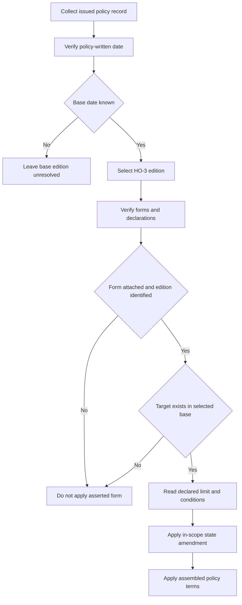

## Purpose and authority boundary

This is an assembly aid for the synthetic corpus, not an issued policy, insurance product, or legal advice. Forms and bulletins are frozen authority: a revision is a new file and an earlier form remains operative for policies written under it; internal guidance is a different, living layer. ([Corpus conventions](repo://README.md#L28-L36))

The issued policy record—not the repository inventory—must establish the selected base form, Declarations, attachments, editions, limits, deductibles, and relevant state facts. An available form proves only that the corpus contains it; it does **not** prove attachment, a declared limit, or applicability to a particular policy. ([Corpus layout and inventory](repo://README.md#L11-L18) [policy-specific attachment conditions](repo://forms/HO/MS/HO-3/2018-09.md#L31-L34))

## Select the base edition first

HO-3 2018-09 applies to policies written on or after 2018-09-01 and supersedes 2011-05; 2011-05 remains the governing edition for policies written under it regardless of when a loss is reported. ([HO-3 2018-09, heading](repo://forms/HO/MS/HO-3/2018-09.md#L1-L4) [HO-3 2011-05, heading](repo://forms/HO/MS/HO-3/2011-05.md#L1-L7)) Therefore, use the **policy-written date**, not a loss-report date or the publication of a later file, to choose the base form.

| Policy-written date | Base form | Result |
| --- | --- | --- |
| 2011-05-01 through 2018-08-31 | HO-3 2011-05 | Retain 2011-05 wording. Its Coverage A settlement includes roof surfacing at replacement cost and has no separate roof-surfacing basis. ([HO-3 2011-05 A.3](repo://forms/HO/MS/HO-3/2011-05.md#L27-L34)) |
| On or after 2018-09-01 | HO-3 2018-09 | Apply 2018-09 wording. A.4 permits an attached roof-schedule endorsement to govern only windstorm- or hail-caused roof surfacing. ([HO-3 2018-09 A.3-A.4](repo://forms/HO/MS/HO-3/2018-09.md#L25-L34)) |
| Unverified | Unresolved | Obtain reliable issued-policy evidence before reaching a coverage, settlement, or deductible conclusion. The forms supply selection rules only for known written dates. ([HO-3 edition headings](repo://forms/HO/MS/HO-3/2011-05.md#L1-L7)) |

This selection is substantive. The 2018 edition adds the A/B direct-physical-loss grant, Coverage C named-peril gate, water anti-concurrent-or-sequential-cause language, long-term leakage provision, ordinance exclusion, and differently numbered conditions; those features cannot be imported into 2011-05. ([HO-3 2018-09 P.1-P.2](repo://forms/HO/MS/HO-3/2018-09.md#L59-L64) [2018 exclusions](repo://forms/HO/MS/HO-3/2018-09.md#L69-L94) [2018 conditions](repo://forms/HO/MS/HO-3/2018-09.md#L101-L112) [2011 exclusions and conditions](repo://forms/HO/MS/HO-3/2011-05.md#L57-L91))

## Attachment, target, and declared-limit controls

An “if attached” base-form exception is a condition on that exception, not proof that an endorsement was issued. This applies to HO 04 90 in both base editions and to the 2018 roof-surfacing route. ([HO-3 2011-05 A.3](repo://forms/HO/MS/HO-3/2011-05.md#L59-L66) [HO-3 2018-09 A.3-A.4](repo://forms/HO/MS/HO-3/2018-09.md#L25-L34) [HO-3 2018-09 A.3](repo://forms/HO/MS/HO-3/2018-09.md#L69-L77))

For every asserted endorsement, retain its exact edition and verify: (1) attachment in the issued record, (2) the stated target exists in the selected base edition, (3) any form-specific date or state gate, and (4) the applicable amount in the endorsement Declarations. A default amount in form text is not evidence that a particular policy issued with that amount where the endorsement permits a declared alternative. ([HO 04 90 2026-01 W.2](repo://forms/HO/MS/HO-04-90/2026-01.md#L13-L18) [HO 04 48 OS.1](repo://forms/HO/MS/HO-04-48/2026-06.md#L7-L11))

The flow keeps base selection, verified attachment, target compatibility, declared limit, and state-amendment scope as distinct controls.

## Relationship matrix

The acting endorsement provision is named first below. Each relationship applies only after the verification controls above.

| Acting provision and relationship | Effect and boundary |
| --- | --- |
| **HO 04 48 (2026-06) OS.1 modifies HO-3 2018-09 Coverage B B.2 only.** | This **net-new** endorsement attaches only to HO-3 2018-09; no earlier edition exists. OS.1 replaces B.2 with the amount shown for the endorsement in the Declarations, subject to a floor of 10% of Coverage A, and makes that amount additional insurance. ([HO 04 48 heading and OS.1](repo://forms/HO/MS/HO-04-48/2026-06.md#L1-L11) [HO-3 2018-09 B.2](repo://forms/HO/MS/HO-3/2018-09.md#L35-L41)) It does **not** modify B.1, B.3, another Section I property coverage, any exclusion, or any condition; B.3 rental treatment remains in force. The extra premium is shown in the Declarations and all other policy provisions apply. ([HO 04 48 OS.2-OS.3](repo://forms/HO/MS/HO-04-48/2026-06.md#L13-L23) [HO-3 2018-09 B.1-B.3](repo://forms/HO/MS/HO-3/2018-09.md#L35-L41)) Do not apply it to HO-3 2011-05: the endorsement names only the 2018-09 base, even though that older base also has B.2. ([HO 04 48 heading](repo://forms/HO/MS/HO-04-48/2026-06.md#L1-L5) [HO-3 2011-05 B.2](repo://forms/HO/MS/HO-3/2011-05.md#L35-L40)) |
| **HO 04 90 W.1 modifies HO-3 Section I Exclusions A.3.** | W.1 supplies the stated A/B/C water-backup or sump-event coverage; W.4 preserves A.1 and A.2, while the edition-specific sublimit, deductible, conditions, and settlement provisions remain controlling. ([HO 04 90 2010-10 W.1-W.6](repo://forms/HO/MS/HO-04-90/2010-10.md#L7-L35) [HO 04 90 2026-01 W.1-W.7](repo://forms/HO/MS/HO-04-90/2026-01.md#L3-L56) [HO-3 2018-09 A.1-A.3](repo://forms/HO/MS/HO-3/2018-09.md#L69-L77)) Select its edition separately: 2026-01 replaces 2010-10 for policies written on or after 2026-01-01, while 2010-10 remains in force for policies written under it. ([HO 04 90 edition headings](repo://forms/HO/MS/HO-04-90/2010-10.md#L1-L7) [HO 04 90 2026-01 heading](repo://forms/HO/MS/HO-04-90/2026-01.md#L1-L4)) |
| **HO 04 81 M.1 modifies HO-3 2018-09 Section I Exclusions C.2.** | It restores limited A/B/C property coverage for fungi, rot, or bacteria from an underlying Section I insured peril. M.2 retains the A.1, A.2, and C.3 barriers; M.3-M.5 add its aggregate limit and mitigation condition. ([HO 04 81 M.1-M.5](repo://forms/HO/MS/HO-04-81/2018-09.md#L3-L31) [HO-3 2018-09 exclusions](repo://forms/HO/MS/HO-3/2018-09.md#L69-L89)) Its P.2/C.3 references are 2018-09 compatibility dependencies. ([HO 04 81 M.2](repo://forms/HO/MS/HO-04-81/2018-09.md#L11-L17) [HO-3 2018-09 P.2 and C.3](repo://forms/HO/MS/HO-3/2018-09.md#L61-L64)) |
| **HO 04 16 O.1 modifies HO-3 2018-09 Section I Exclusions D.1.** | It supplies stated ordinance-or-law cost coverage after a covered Section I loss; O.3 reaches the stated undamaged portions. O.2 and O.4-O.6 impose its limit, exclusions, time limit, and incurred-cost-after-settlement mechanics. ([HO 04 16 O.1-O.6](repo://forms/HO/MS/HO-04-16/2018-09.md#L3-L37) [HO-3 2018-09 D.1](repo://forms/HO/MS/HO-3/2018-09.md#L91-L94)) D.1 is intentional loss in 2011-05, so this directed relationship is not transferable there. ([HO-3 2011-05 D.1](repo://forms/HO/MS/HO-3/2011-05.md#L77-L80)) |
| **HO 23 74 R.1-R.2 modifies HO-3 2018-09 Section I A.4.** | It applies ACV only to windstorm- or hail-caused roof surfacing; other dwelling components and other-peril surfacing remain on the A.3 replacement-cost path. R.6 leaves ordinance-required undamaged surfacing subject to D.1 unless an ordinance endorsement is attached. ([HO 23 74 R.1-R.2 and R.6](repo://forms/HO/MS/HO-23-74/2018-09.md#L3-L15) [HO 23 74 R.6](repo://forms/HO/MS/HO-23-74/2018-09.md#L37-L41) [HO-3 2018-09 A.3-A.4](repo://forms/HO/MS/HO-3/2018-09.md#L25-L34)) |

## Texas: amendment versus regulatory constraint

**HO 01 45 T.1 modifies HO-3 2018-09 Section I Conditions S.5** for an attached Texas HO-3 policy effective on or after 2022-01-01; where the amendment conflicts with its attached form, it governs. T.1 supplies the separate deductible and mixed-peril allocation rule, while T.4 modifies the 2018 S.4 action period and T.5 separately supplies claim milestones. ([HO 01 45 scope and conflict rule](repo://forms/HO/TX/HO-01-45/2022-01.md#L1-L4) [HO 01 45 T.1, T.4-T.5](repo://forms/HO/TX/HO-01-45/2022-01.md#L5-L27) [HO-3 2018-09 S.4-S.5](repo://forms/HO/MS/HO-3/2018-09.md#L107-L112)) Its targets cannot be silently transposed to 2011-05, where S.3 is the action provision and S.4 is the deductible. ([HO-3 2011-05 S.3-S.4](repo://forms/HO/MS/HO-3/2011-05.md#L83-L92))

The bulletin separately regulates in-scope Texas residential-property deductible configuration, application, disclosure, and filing; it does not amend an issued contract or prove HO 01 45 attachment. ([Bulletin scope and B.2-B.4](repo://bulletins/TX/2021-08-windstorm-deductible.md#L1-L25) [Bulletin B.7](repo://bulletins/TX/2021-08-windstorm-deductible.md#L35-L37)) For a verified HO 01 45, also test T.7: an attached exclusion plus signed acknowledgement can remove windstorm/hail and makes T.1 inapplicable. ([HO 01 45 T.7](repo://forms/HO/TX/HO-01-45/2022-01.md#L33-L35))

## Focused assembly tests

1. **HO 04 48 request:** verify HO-3 2018-09, issued attachment, and the endorsement Declarations amount. Apply OS.1 only to B.2; retain B.1/B.3, exclusions, conditions, and every other provision. ([HO 04 48 OS.1-OS.3](repo://forms/HO/MS/HO-04-48/2026-06.md#L7-L23))
2. **Late-reported older policy:** choose 2011-05 from the written date and reject a retrofit of 2018 A.4, HO 23 74, or HO 04 48. ([HO-3 2011-05 heading and A.3](repo://forms/HO/MS/HO-3/2011-05.md#L1-L7) [HO 04 48 heading](repo://forms/HO/MS/HO-04-48/2026-06.md#L1-L5))
3. **Water backup followed by fungi:** independently verify both endorsements, select the HO 04 90 edition, and test retained exclusions, maintenance, and—only in 2026-01—finished-below-grade backflow protection before payment terms. ([HO 04 90 2026-01 W.4-W.7](repo://forms/HO/MS/HO-04-90/2026-01.md#L25-L54) [HO 04 81 M.1-M.5](repo://forms/HO/MS/HO-04-81/2018-09.md#L5-L31))
4. **Texas mixed peril:** verify the Texas effective-date and attachment gates separately; if T.1 governs, allocate separately determinable damage or use the larger single deductible. ([HO 01 45 scope and T.1](repo://forms/HO/TX/HO-01-45/2022-01.md#L1-L11))

**Core invariant:** select the base edition first; then independently prove attachment, target compatibility, declared limit, and scope for each additional form. A later or available form is not a retroactive patch and never establishes a policy-specific attachment or limit. ([HO-3 edition rules](repo://forms/HO/MS/HO-3/2011-05.md#L1-L7) [HO 04 48 heading and OS.1](repo://forms/HO/MS/HO-04-48/2026-06.md#L1-L11))
