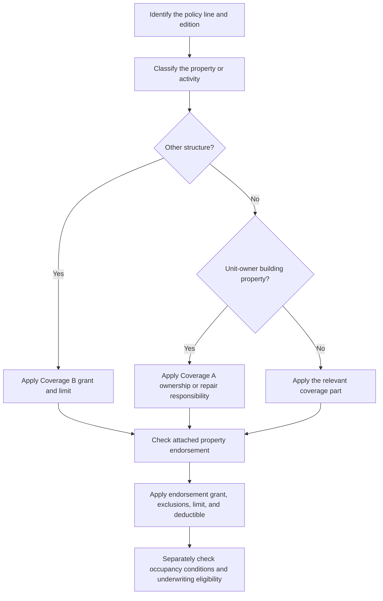

# Other Structures, Additional Interests, and Occupancy Endorsements

## Read the policy in layers

These provisions do different jobs. Coverage B classifies and limits building property. An **additional interest** receives a property-loss interest without becoming an insured. An **additional insured** receives stated liability insured status. An occupancy endorsement changes the treatment of a disclosed use; it is not, by itself, an underwriting approval. Start with the governing base-form edition and declarations, then apply an attached endorsement only to the extent its text changes the base policy.

*This flow separates property classification and endorsement application from the separate underwriting decision about whether the occupancy is acceptable.*

## Coverage B baseline: other structures

For **HO-3 2024-03**, Coverage B covers an “other structure” on the residence premises. It must be separated from the dwelling by clear space, or connected only by a fence, utility line, or similar connection. The base limit is **10% of Coverage A** and is additional insurance. The structure must be owned by the insured or rented to the insured and used in connection with the residence premises. The base form excludes business use, business-property storage, farming, a structure used as a dwelling, land, and outdoor property. [HO-3 2024-03 B.1–B.11](repo://forms/HO/MS/HO-3/2024-03.md#L153-L177)

For **HO-6 2023-02**, Coverage B likewise requires a separate structure, but it covers only an other structure owned by an insured. The form excludes a rented or held-for-rental structure except a private garage, a structure from which business is conducted subject to its private-garage storage exception, and any structure owned by a condominium association, another person, or another entity. No Coverage B percentage is stated in the supplied section; use the applicable policy limit rather than importing the HO-3 10% rule. [HO-6 2023-02 B.1–B.9](repo://forms/HO/MS/HO-6/2023-02.md#L134-L152)

These exclusions are classification boundaries, not merely limit reductions. A Coverage B endorsement can change a limit or restore a stated use, but it does not turn personal property, land, an attached structure, or an excluded cause of loss into covered property unless its text expressly does so.

## HO 04 48: increased Coverage B limit

**What it modifies.** HO 04 48 (2026-06) changes the HO-3 Coverage B limit to **20% of the Coverage A limit**, replacing the otherwise applicable limit. It applies to covered direct physical loss to qualifying Other Structures, remains separate from Coverage A, and is the most payable for all covered loss from an occurrence, regardless of the number of structures, insureds, claimants, or causes. [HO 04 48 W.0–W.1](repo://forms/HO/MS/HO-04-48/2026-06.md#L13-L39) · [HO 04 48 W.2.1–W.2.7](repo://forms/HO/MS/HO-04-48/2026-06.md#L129-L143)

**What remains excluded.** The endorsement expressly says it does not change the property to which coverage applies. Its increased limit does not modify an exclusion, condition, or limitation; it applies only after the loss is otherwise covered. Business use, non-incidental rental, farming, excluded property, and the base Coverage B cause-of-loss exclusions therefore remain relevant. [HO 04 48 W.1.5–W.1.10](repo://forms/HO/MS/HO-04-48/2026-06.md#L39-L49) · [HO 04 48 W.2.12–W.2.14](repo://forms/HO/MS/HO-04-48/2026-06.md#L151-L157)

**Limit and condition.** The 20% limit is collective for Coverage B; more than one interest does not increase it, and repair, replacement, rebuilding, debris removal, and other covered Coverage B expenses consume that limit. The applicable deductible still applies. [HO 04 48 W.2.5–W.2.10](repo://forms/HO/MS/HO-04-48/2026-06.md#L137-L149) · [HO 04 48 W.3.1–W.3.8](repo://forms/HO/MS/HO-04-48/2026-06.md#L179-L195)

## HO 04 40: structures rented to others

**What it modifies.** The HO-3 2011-05 base form excludes an other structure rented or held for rental to a non-tenant, subject to its private-garage exception. HO 04 40 (2011-05) writes back a defined rental-structure property grant: a separate structure on the residence premises that is rented or held for rental to another person. It covers the insured’s interest in direct physical loss caused by a covered cause of loss, permanently installed fixtures and equipment, additions and alterations, and insured-owned repair materials. [HO-3 2011-05 B.1–B.10](repo://forms/HO/MS/HO-3/2011-05.md#L139-L163) · [HO 04 40 W.1.1–W.1.12](repo://forms/HO/MS/HO-04-40/2011-05.md#L41-L65)

**What remains excluded.** The structure must remain on the residence premises and the endorsement does not cover the dwelling, ordinary personal property, or liability and loss-of-use claims. It preserves exclusions for unlawful use, flood and surface water, earth movement, sewer or sump backup, vacancy-related vandalism, tenant or occupant property, business pursuits, and repeated seepage or leakage. It also states that tenant property does not become covered merely because it is in or near the rented structure. [HO 04 40 W.1.13–W.1.17 and W.1.34–W.1.37](repo://forms/HO/MS/HO-04-40/2011-05.md#L67-L75) · [HO 04 40 W.4.1–W.4.15 and W.4.29–W.4.42](repo://forms/HO/MS/HO-04-40/2011-05.md#L247-L277) · [HO 04 40 W.4.29–W.4.42](repo://forms/HO/MS/HO-04-40/2011-05.md#L303-L333)

**Limit and condition.** Landlord’s furnishings have a **$5,000** limit for all covered loss from the same event; loss of use, loss of income, multiple items, and related property do not enlarge it. The insured must be able to show that the structure was rented or held for rental at the time of loss. [HO 04 40 W.2.1–W.2.8](repo://forms/HO/MS/HO-04-40/2011-05.md#L141-L165) · [HO 04 40 W.1.46–W.1.49](repo://forms/HO/MS/HO-04-40/2011-05.md#L131-L139)

## Property interests are not insured status

### HO 04 10: additional interest

**What it modifies.** HO 04 10 (2011-05) recognizes a person or organization with a lawful financial interest in property at the residence premises when identified in an acceptable manner. It provides coverage only for that interest in covered property and only when the policyholder has an insurable interest at the time of loss. Recognition does **not** make the additional interest an insured, transfer ownership, or give it the policyholder’s rights and duties. [HO 04 10 W.0.1–W.0.17](repo://forms/HO/MS/HO-04-10/2011-05.md#L13-L47) · [HO 04 10 W.1.1–W.1.6](repo://forms/HO/MS/HO-04-10/2011-05.md#L49-L61)

**What remains excluded.** The additional interest cannot recover more than its lawful interest or recover for property, perils, liability, penalties, assessments, or obligations that are not otherwise covered for the policyholder. An invalid, unenforceable, fraudulent, fictitious, transferred-after-loss, or ended interest is not covered. [HO 04 10 W.1.17–W.1.24](repo://forms/HO/MS/HO-04-10/2011-05.md#L81-L97) · [HO 04 10 W.4.44–W.4.67](repo://forms/HO/MS/HO-04-10/2011-05.md#L415-L461)

**Limit and condition.** There is no separate limit unless expressly provided. Payment may be joint or direct once the interest is established, but every payment reduces the same applicable limit and the maximum is the lesser of the covered loss, that limit, or the additional interest’s financial interest. The additional interest must cooperate, provide evidence, permit inspection, and preserve recovery rights. [HO 04 10 W.2.1–W.2.14](repo://forms/HO/MS/HO-04-10/2011-05.md#L161-L189) · [HO 04 10 W.1.7–W.1.16](repo://forms/HO/MS/HO-04-10/2011-05.md#L61-L81)

### HO 04 41: additional insured

**What it modifies.** HO 04 41 (2011-05) acts on **liability**, not property insurance. The scheduled person or organization is an insured only with respect to the residence premises and receives coverage for covered bodily injury or property damage liability arising from ownership, maintenance, or use of that premises, including a defense to a covered suit. [HO 04 41 W.0](repo://forms/HO/MS/HO-04-41/2011-05.md#L13-L55) · [HO 04 41 W.1.1–W.1.8](repo://forms/HO/MS/HO-04-41/2011-05.md#L57-L73)

**What remains excluded.** The endorsement does not provide property insurance for the additional insured and does not cover liability unrelated to the residence premises, business or professional services, intentional or criminal acts, vehicles, watercraft, aircraft, or damage to property owned by, occupied by, or in the custody or control of the relevant insured. The additional insured has no greater rights than the policy provides and cannot change, cancel, or direct the policy merely because it is scheduled. [HO 04 41 W.0.21–W.0.37](repo://forms/HO/MS/HO-04-41/2011-05.md#L99-L137) · [HO 04 41 W.1.57–W.1.60](repo://forms/HO/MS/HO-04-41/2011-05.md#L171-L177)

**Limit and condition.** The applicable liability limit is shared by all damages arising from the occurrence; adding an additional insured, adding claimants, or stating multiple theories does not increase it. The additional insured must give prompt notice, forward suit papers, cooperate, and report changes in ownership, use, or occupancy. [HO 04 41 W.2.1–W.2.10 and W.2.19–W.2.25](repo://forms/HO/MS/HO-04-41/2011-05.md#L215-L235) · [HO 04 41 W.1.41–W.1.57](repo://forms/HO/MS/HO-04-41/2011-05.md#L139-L171)

## HO 04 42: permitted incidental occupancies

**What it modifies.** HO 04 42 (2011-05) changes the policy for a scheduled incidental occupancy conducted by an insured at premises used with the residence. The occupancy must be subordinate to residential use, lawful, and not materially change the premises’ residential character. The endorsement provides stated liability coverage for bodily injury, property damage, and personal injury arising from an occurrence connected with that occupancy, and its limit clause addresses covered property used in the occupancy. [HO 04 42 W.1.1–W.1.7](repo://forms/HO/MS/HO-04-42/2011-05.md#L35-L49) · [HO 04 42 W.2.1–W.2.10](repo://forms/HO/MS/HO-04-42/2011-05.md#L135-L155)

**What remains excluded.** The endorsement does not cover an unpermitted, materially different, unlawful, non-residential, or off-premises occupancy, or a business other than the permitted occupancy. It also excludes many higher-hazard or specialized exposures, including professional and medical services, care for a fee, products and completed work, entrusted/customer property, vehicles, aircraft, watercraft, animals, food and alcohol, pollution, employment practices, and cyber/data risks. [HO 04 42 W.4.1–W.4.7](repo://forms/HO/MS/HO-04-42/2011-05.md#L257-L271) · [HO 04 42 W.4.13–W.4.44](repo://forms/HO/MS/HO-04-42/2011-05.md#L283-L345)

**Limit and condition.** The supplied endorsement text does not state a dollar amount for its “applicable limit”; it defines that limit as the most payable for covered property and says the limit is not increased by the number of insureds, claims, locations, or items. It also expressly does not increase the other-structures, contents, ALE, or debris-removal percentages. The insured must conduct only the scheduled activity, maintain required licenses and approvals, notify material changes, keep records, and permit inspection. [HO 04 42 W.2.2–W.2.8](repo://forms/HO/MS/HO-04-42/2011-05.md#L137-L151) · [HO 04 42 W.4.8–W.4.12](repo://forms/HO/MS/HO-04-42/2011-05.md#L273-L281) · [HO 04 42 W.5.1–W.5.12](repo://forms/HO/MS/HO-04-42/2011-05.md#L377-L405)

## HO-6 unit-owner arrangements

**Rental unit.** HO 17 32 (2014-04) applies only while an HO-6 unit is rented or held available for rental. It changes the covered-property treatment for the owner’s permanently installed property, appliances, furnishings, equipment, improvements, maintenance property, and qualifying property of others for which the owner is legally responsible. It also provides loss of rent when a covered loss makes the unit unfit, but tenant personal property is not covered merely because it is in the unit. [HO 17 32 W.0](repo://forms/HO/MS/HO-17-32/2014-04.md#L13-L39) · [HO 17 32 W.1.1–W.1.22](repo://forms/HO/MS/HO-17-32/2014-04.md#L41-L85)

The landlord’s-furnishings limit is **$5,000** for covered loss from the same event, with no increase for multiple items, loss of use, loss of income, or multiple interests. The insured must provide rental agreements, rent records, or tenant communications when reasonably requested to show that the unit was rented or held available at the time of loss. [HO 17 32 W.2.1–W.2.10](repo://forms/HO/MS/HO-17-32/2014-04.md#L139-L159) · [HO 17 32 W.1.47–W.1.48](repo://forms/HO/MS/HO-17-32/2014-04.md#L131-L137)

**Unit-owner building property.** The HO-6 2023-02 base form covers building property the unit owner must insure under an agreement and excludes association- or third-party-owned property unless the insured is responsible under an agreement to repair or replace it. Its Coverage B separately excludes attached structures, rented structures other than a private garage, business structures, and structures not solely owned by an insured. [HO-6 2023-02 A.4–A.12](repo://forms/HO/MS/HO-6/2023-02.md#L86-L104) · [HO-6 2023-02 B.1–B.9](repo://forms/HO/MS/HO-6/2023-02.md#L134-L152)

**HO 17 33.** HO 17 33 (2014-04) modifies HO-6 Coverage A, not Coverage B. It covers direct physical loss to eligible Coverage A property on a risk-of-direct-physical-loss basis and sets a **$25,000 Coverage A limit**, subject to its deductible, exclusions, and conditions. It does not make association master-policy property automatically covered and preserves exclusions for earth movement, flood/surface water, groundwater, and sewer or sump backup. [HO 17 33 W.1.1–W.1.5 and W.1.6–W.1.22](repo://forms/HO/MS/HO-17-33/2014-04.md#L39-L81) · [HO 17 33 W.2.1–W.2.8](repo://forms/HO/MS/HO-17-33/2014-04.md#L137-L153)

## Occupancy coverage is not underwriting eligibility

HO 04 42 can modify the contract when attached, but it does not override internal appetite rules. The Texas homeowners guideline permits binding only when detached structures are safe, maintained, and incidental to residential use. [Texas homeowners appetite H.1.19–H.1.27](repo://guidelines/appetite/tx-homeowners.md#L97-L113) Internal underwriting guidance separately requires referral for business activity from the insured location and says not to classify activity as incidental without referral authority approval; it also requires confirmation that incidental business activity does not materially increase property or liability exposure. [Underwriting manual 310.Q](repo://manuals/underwriting/manual.md#L4505-L4515) · [Underwriting manual 510.11–510.12](repo://manuals/underwriting/manual.md#L6289-L6299)

For a detached structure used for business, the manual says to refer rather than assume that the structure is incidental to residential use. For professional services, client meetings, product storage, or business production, it likewise requires referral where the use is not incidental to residence. Those are eligibility and authority controls, not changes to what HO 04 42 means. [Underwriting manual 150.AF](repo://manuals/underwriting/manual.md#L1801-L1811) · [Underwriting manual 530.G–530.I](repo://manuals/underwriting/manual.md#L6893-L6909)

### Practical claim and underwriting checklist

1. Identify the HO-3 or HO-6 edition, declarations, deductible, and attached endorsements.
2. Classify the item: Coverage B other structure, Coverage A unit-owner building property, personal property, or liability exposure.
3. For Coverage B, test separation, ownership or responsibility, location, use, and the base exclusion before applying an increased-limit or rental endorsement.
4. For an additional interest, verify the lawful financial interest and its extent; for an additional insured, verify that the requested protection is liability status limited to the endorsed premises.
5. For an occupancy, compare the actual activity with the schedule and endorsement conditions, then apply the endorsement’s exclusions and limits.
6. Separately complete the applicable state and underwriting referral review. Attachment of an endorsement does not waive referral, inspection, licensing, or appetite requirements.
