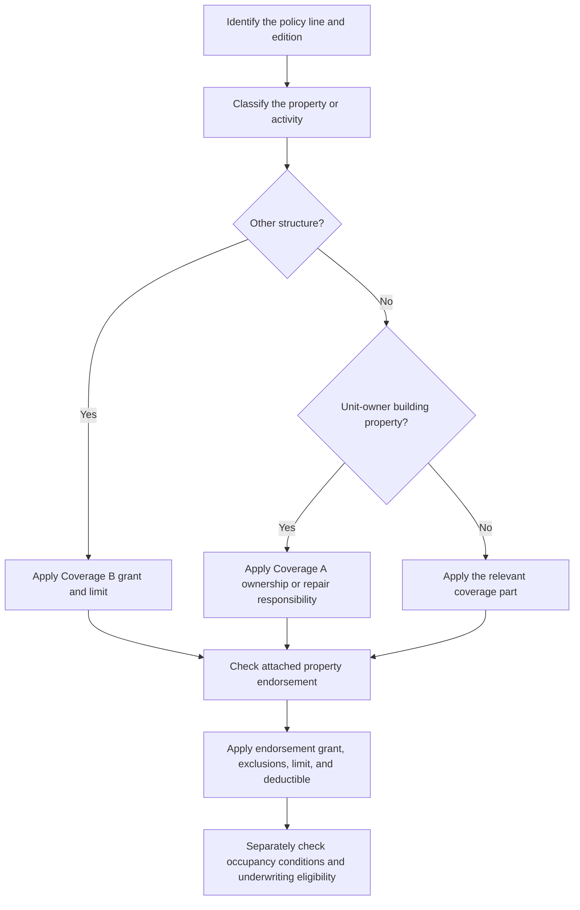

# Other Structures, Additional Interests, and Occupancy Endorsements

## Read the policy in layers

These provisions do different jobs. Coverage B classifies and limits building property. An **additional interest** receives a property-loss interest without becoming an insured. An **additional insured** receives stated liability insured status. An occupancy endorsement changes the treatment of a disclosed use; it is not, by itself, an underwriting approval. Start with the governing base-form edition and declarations, identify the attached endorsement that acts on the issue, and then apply that endorsement only to the extent its text changes the base policy.

*This flow separates property classification and endorsement application from the separate underwriting decision about whether the occupancy is acceptable.*

A reliable review uses this order:

1. Select the form edition from the policy record and read the declarations.
2. Classify the item as Coverage B, Coverage A unit-owner building property, Coverage C personal property, Coverage D loss of use, or liability exposure.
3. Name the acting endorsement before describing its effect: the endorsement **modifies** the attached policy within its stated scope and **preserves** nonconflicting base-form terms.
4. Apply the endorsement's grant, exclusions, conditions, limit, and deductible; do not treat a topic match or a base-form cross-reference as proof that the endorsement is attached.
5. Separately complete the occupancy, state, and underwriting review.

## Coverage B baseline: other structures

For **HO-3 2024-03**, Coverage B covers an “other structure” on the residence premises. It must be separated from the dwelling by clear space, or connected only by a fence, utility line, or similar connection. The base limit is **10% of Coverage A**. The structure must be owned by the insured or rented to the insured and used in connection with the residence premises. The base form excludes business use, business-property storage, farming, a structure used as a dwelling, land, and outdoor property. [HO-3 2024-03 B.1–B.11](repo://forms/HO/MS/HO-3/2024-03.md#L153-L177)

For **HO-6 2023-02**, Coverage B likewise requires a separate structure, but it covers only an other structure owned by an insured. The form excludes a rented or held-for-rental structure except a private garage, a structure from which business is conducted subject to its private-garage storage exception, and any structure owned by a condominium association, another person, or another entity. No Coverage B percentage is stated in the supplied section; use the applicable policy limit rather than importing the HO-3 10% rule. [HO-6 2023-02 B.1–B.9](repo://forms/HO/MS/HO-6/2023-02.md#L134-L152)

These are classification boundaries, not merely limit reductions. An endorsement can change a limit or provide a stated use or property grant, but it does not turn personal property, land, an attached structure, or otherwise excluded property into covered property unless the endorsement expressly changes that result.

## Acting property endorsements

### HO 04 48: increased Coverage B limit

**Acting endorsement and modification.** When attached to an HO-3 policy, **HO 04 48 (2026-06) modifies Coverage B's limit** to **20% of the Coverage A limit**, replacing the otherwise applicable limit. It applies to covered direct physical loss to qualifying Other Structures, remains separate from Coverage A, and is the most payable for all covered loss from an occurrence, regardless of the number of structures, insureds, claimants, or causes. [HO 04 48 attachment and scope](repo://forms/HO/MS/HO-04-48/2026-06.md#L13-L27) · [HO 04 48 W.2.1–W.2.7](repo://forms/HO/MS/HO-04-48/2026-06.md#L129-L143)

**What the limit does not do.** The endorsement's increased-limit provisions do not themselves change the property to which coverage applies or erase a cause-of-loss exclusion. Read the endorsement's own Coverage B grant and qualifications first, then its preserved exclusions and limitations; if an endorsement term conflicts with the base form, the endorsement controls only within that conflict. The 20% figure must not be applied to property that does not qualify for Coverage B. [HO 04 48 W.0 and W.1](repo://forms/HO/MS/HO-04-48/2026-06.md#L13-L49) · [HO 04 48 W.2.12–W.2.14 and W.4.1–W.4.14](repo://forms/HO/MS/HO-04-48/2026-06.md#L151-L157) · [HO 04 48 W.4.1–W.4.14](repo://forms/HO/MS/HO-04-48/2026-06.md#L221-L249)

**Limit and condition.** The 20% limit is collective for Coverage B; more than one interest does not increase it, and repair, replacement, rebuilding, debris removal, and other covered Coverage B expenses consume that limit. The applicable deductible still applies. [HO 04 48 W.2.5–W.2.10](repo://forms/HO/MS/HO-04-48/2026-06.md#L137-L149) · [HO 04 48 W.3.1–W.3.8](repo://forms/HO/MS/HO-04-48/2026-06.md#L179-L195)

### HO 04 40: structures rented to others

**Acting endorsement and modification.** The HO-3 2011-05 base form excludes an other structure rented or held for rental to a non-tenant, subject to its private-garage exception. When attached, **HO 04 40 (2011-05) modifies that rental-structure treatment** by providing a property grant for a separate structure on the residence premises that is rented or held for rental to another person. It covers the insured's interest in direct physical loss caused by a covered cause of loss, permanently installed fixtures and equipment, additions and alterations, and insured-owned repair materials. [HO-3 2011-05 B.1–B.10](repo://forms/HO/MS/HO-3/2011-05.md#L139-L163) · [HO 04 40 W.1.1–W.1.12](repo://forms/HO/MS/HO-04-40/2011-05.md#L41-L65)

**What it preserves.** The structure must remain on the residence premises. The endorsement does not cover the dwelling, ordinary personal property, liability, or loss-of-use claims. It preserves exclusions for unlawful use, flood and surface water, earth movement, sewer or sump backup, vacancy-related vandalism, tenant or occupant property, business pursuits, and repeated seepage or leakage. Tenant property does not become covered merely because it is in or near the rented structure. [HO 04 40 W.1.13–W.1.17 and W.1.34–W.1.37](repo://forms/HO/MS/HO-04-40/2011-05.md#L67-L75) · [HO 04 40 W.4.1–W.4.15 and W.4.29–W.4.42](repo://forms/HO/MS/HO-04-40/2011-05.md#L247-L277) · [HO 04 40 W.4.29–W.4.42](repo://forms/HO/MS/HO-04-40/2011-05.md#L303-L333)

**Limit and condition.** Landlord's furnishings have a **$5,000** limit for all covered loss from the same event; loss of use, loss of income, multiple items, and related property do not enlarge it. The insured must be able to show that the structure was rented or held for rental at the time of loss. [HO 04 40 W.2.1–W.2.8](repo://forms/HO/MS/HO-04-40/2011-05.md#L141-L165) · [HO 04 40 W.1.46–W.1.49](repo://forms/HO/MS/HO-04-40/2011-05.md#L131-L139)

## Property interests are not insured status

### HO 04 10: additional interest

**Acting endorsement and modification.** When attached, **HO 04 10 (2011-05) modifies the policy's treatment of an identified additional interest**. It recognizes a person or organization with a lawful financial interest in property at the residence premises when identified in an acceptable manner. It provides coverage only for that interest in covered property and only when the policyholder has an insurable interest at the time of loss. Recognition does **not** make the additional interest an insured, transfer ownership, or give it the policyholder's rights and duties. [HO 04 10 W.0.1–W.0.17](repo://forms/HO/MS/HO-04-10/2011-05.md#L13-L47) · [HO 04 10 W.1.1–W.1.6](repo://forms/HO/MS/HO-04-10/2011-05.md#L49-L61)

**What it preserves.** The additional interest cannot recover more than its lawful interest or recover for property, perils, liability, penalties, assessments, or obligations that are not otherwise covered for the policyholder. An invalid, unenforceable, fraudulent, fictitious, transferred-after-loss, or ended interest is not covered. [HO 04 10 W.1.17–W.1.24](repo://forms/HO/MS/HO-04-10/2011-05.md#L81-L97) · [HO 04 10 W.4.44–W.4.67](repo://forms/HO/MS/HO-04-10/2011-05.md#L415-L461)

**Limit and condition.** There is no separate limit unless expressly provided. Payment may be joint or direct once the interest is established, but every payment reduces the same applicable limit and the maximum is the lesser of the covered loss, that limit, or the additional interest's financial interest. The additional interest must cooperate, provide evidence, permit inspection, and preserve recovery rights. [HO 04 10 W.2.1–W.2.14](repo://forms/HO/MS/HO-04-10/2011-05.md#L161-L189) · [HO 04 10 W.1.7–W.1.16](repo://forms/HO/MS/HO-04-10/2011-05.md#L61-L81)

### HO 04 41: additional insured

**Acting endorsement and modification.** When attached, **HO 04 41 (2011-05) modifies the liability section** by giving the scheduled person or organization insured status only with respect to the residence premises. It provides coverage for covered bodily injury or property damage liability arising from ownership, maintenance, or use of that premises, including a defense to a covered suit. [HO 04 41 W.0](repo://forms/HO/MS/HO-04-41/2011-05.md#L13-L55) · [HO 04 41 W.1.1–W.1.8](repo://forms/HO/MS/HO-04-41/2011-05.md#L57-L73)

**What it preserves.** The endorsement does not provide property insurance for the additional insured. It also preserves boundaries for liability unrelated to the residence premises, business or professional services, intentional or criminal acts, vehicles, watercraft, aircraft, and damage to property owned by, occupied by, or in the custody or control of the relevant insured. The additional insured has no greater rights than the policy provides and cannot change, cancel, or direct the policy merely because it is scheduled. [HO 04 41 W.0.21–W.0.37](repo://forms/HO/MS/HO-04-41/2011-05.md#L99-L137) · [HO 04 41 W.1.57–W.1.60](repo://forms/HO/MS/HO-04-41/2011-05.md#L171-L177)

**Limit and condition.** The applicable liability limit is shared by all damages arising from the occurrence; adding an additional insured, adding claimants, or stating multiple theories does not increase it. The additional insured must give prompt notice, forward suit papers, cooperate, and report changes in ownership, use, or occupancy. [HO 04 41 W.2.1–W.2.10 and W.2.19–W.2.25](repo://forms/HO/MS/HO-04-41/2011-05.md#L215-L235) · [HO 04 41 W.1.41–W.1.57](repo://forms/HO/MS/HO-04-41/2011-05.md#L139-L171)

## HO 04 42: permitted incidental occupancies

**Acting endorsement and modification.** When attached, **HO 04 42 (2011-05) modifies liability and property treatment for a permitted incidental occupancy** conducted by an insured at premises used in connection with the residence. The occupancy must be subordinate to residential use, lawful, and not materially change the premises' residential character. The endorsement provides stated liability coverage for bodily injury, property damage, and personal injury arising from an occurrence connected with that occupancy, and its limit clause addresses covered property used in the occupancy. [HO 04 42 W.1.1–W.1.7](repo://forms/HO/MS/HO-04-42/2011-05.md#L35-L49) · [HO 04 42 W.2.1–W.2.10](repo://forms/HO/MS/HO-04-42/2011-05.md#L135-L155)

**What it preserves.** The endorsement does not cover an unpermitted, materially different, unlawful, non-residential, or off-premises occupancy, or a business other than the permitted occupancy. It also excludes many higher-hazard or specialized exposures, including professional and medical services, care for a fee, products and completed work, entrusted or customer property, vehicles, aircraft, watercraft, animals, food and alcohol, pollution, employment practices, and cyber or data risks. [HO 04 42 W.4.1–W.4.7](repo://forms/HO/MS/HO-04-42/2011-05.md#L257-L271) · [HO 04 42 W.4.13–W.4.44](repo://forms/HO/MS/HO-04-42/2011-05.md#L283-L345)

**Limit and condition.** The supplied endorsement text does not state a dollar amount for its “applicable limit”; it defines that limit as the most payable for covered property and says the limit is not increased by the number of insureds, claims, locations, or items. It also expressly does not increase the other-structures, contents, ALE, or debris-removal percentages. The insured must conduct only the activity described in the applicable schedule, maintain required licenses and approvals, notify material changes, keep records, and permit inspection. [HO 04 42 W.2.2–W.2.8](repo://forms/HO/MS/HO-04-42/2011-05.md#L137-L151) · [HO 04 42 W.4.8–W.4.12](repo://forms/HO/MS/HO-04-42/2011-05.md#L273-L281) · [HO 04 42 W.5.1–W.5.12](repo://forms/HO/MS/HO-04-42/2011-05.md#L377-L405) · [HO 04 42 W.6.1–W.6.8](repo://forms/HO/MS/HO-04-42/2011-05.md#L471-L489)

## HO-6 unit-owner arrangements

### Condominium master-policy gap: operational review, not a legal conclusion

The condominium training is useful for claim and underwriting fact-gathering, not for deciding coverage or ownership as a legal matter. Start with the association declaration, the association master policy, the unit-owner policy, and any written assessment or repair direction. Identify the damaged component, who owns it or must repair it under the governing documents, the cause of loss, and which policy is being asked to respond. A visible location inside the unit is not enough to classify the property, and a master-policy claim, repair decision, or assessment does not itself establish HO-6 coverage. [Condominium training L.2.2–L.2.8](repo://training/condo-master-policy-gap.md#L61-L91) · [Condominium training L.2.31–L.2.37](repo://training/condo-master-policy-gap.md#L181-L207) · [Condominium training L.2.51–L.2.63](repo://training/condo-master-policy-gap.md#L261-L311)

Separate the source of damage from the property damaged. A common element or shared pipe may cause damage inside a unit without making the association responsible for every affected item. Split common property, unit building property, improvements, personal property, tenant property, mitigation, and loss of use before applying policy language. Obtain the declaration, master-policy position, photographs, repair scope, invoices, association records, and assessment notice when those facts matter. [Condominium training L.2.13–L.2.20](repo://training/condo-master-policy-gap.md#L109-L139) · [Condominium training L.2.45–L.2.50](repo://training/condo-master-policy-gap.md#L237-L259) · [Condominium training L.2.57–L.2.66](repo://training/condo-master-policy-gap.md#L285-L323)

### Rental unit: HO 17 32

**Acting endorsement and modification.** When attached to the applicable HO-6 policy, **HO 17 32 (2014-04) modifies the unit-owner property treatment while the unit is rented or held available for rental**. It covers the owner's permanently installed property, appliances, furnishings, equipment, improvements, maintenance property, and qualifying property of others for which the owner is legally responsible. It also provides loss of rent when a covered loss makes the unit unfit, but tenant personal property is not covered merely because it is in the unit. [HO 17 32 W.0](repo://forms/HO/MS/HO-17-32/2014-04.md#L13-L39) · [HO 17 32 W.1.1–W.1.22](repo://forms/HO/MS/HO-17-32/2014-04.md#L41-L85)

**Limit and condition.** The landlord's-furnishings limit is **$5,000** for covered loss from the same event, with no increase for multiple items, loss of use, loss of income, or multiple interests. The insured must provide rental agreements, rent records, or tenant communications when reasonably requested to show that the unit was rented or held available at the time of loss. [HO 17 32 W.2.1–W.2.10](repo://forms/HO/MS/HO-17-32/2014-04.md#L139-L159) · [HO 17 32 W.1.47–W.1.48](repo://forms/HO/MS/HO-17-32/2014-04.md#L131-L137)

The endorsement does not replace the need to read the governing HO-6 edition and declarations. Its attachment modifies only the rental treatment stated in the endorsement and preserves the policy provisions it does not change.

### Unit-owner building property: Coverage A boundary

The HO-6 2023-02 base form covers building property the unit owner must insure under an agreement and excludes association- or third-party-owned property unless the insured is responsible under an agreement to repair or replace it. Its Coverage B separately excludes attached structures, rented structures other than a private garage, business structures, and structures not solely owned by an insured. [HO-6 2023-02 A.4–A.12](repo://forms/HO/MS/HO-6/2023-02.md#L86-L104) · [HO-6 2023-02 B.1–B.9](repo://forms/HO/MS/HO-6/2023-02.md#L134-L152)

Do not use Coverage B to solve a unit-owner building-property question. A unit's attached fixtures, improvements, and building property that the owner must insure belong in the Coverage A analysis, subject to the applicable edition, agreement, exclusions, limit, and deductible. The condominium training's ownership and repair questions help gather facts; the HO-6 wording controls the contractual result. [HO-6 2023-02 A.1–A.13](repo://forms/HO/MS/HO-6/2023-02.md#L78-L120) · [Condominium training L.2.31–L.2.42](repo://training/condo-master-policy-gap.md#L181-L223)

### HO 17 33: Coverage A special coverage

**Acting endorsement and modification.** When attached to the 2014-04 HO-6 policy, **HO 17 33 modifies Coverage A**, not Coverage B. It covers direct physical loss to eligible Coverage A property on a risk-of-direct-physical-loss basis and sets a **$25,000 Coverage A limit**, subject to its deductible, exclusions, and conditions. It does not make association master-policy property automatically covered. [HO 17 33 W.1.1–W.1.5 and W.1.6–W.1.22](repo://forms/HO/MS/HO-17-33/2014-04.md#L39-L81) · [HO 17 33 W.2.1–W.2.8](repo://forms/HO/MS/HO-17-33/2014-04.md#L137-L153)

The endorsement preserves exclusions for earth movement, flood or surface water, groundwater, and sewer or sump backup, among others. Its $25,000 Coverage A limit is not a master-policy limit and does not create Coverage B or loss-assessment coverage. [HO 17 33 W.1.6–W.1.10](repo://forms/HO/MS/HO-17-33/2014-04.md#L51-L59) · [HO 17 33 W.2.1–W.2.8](repo://forms/HO/MS/HO-17-33/2014-04.md#L137-L153)

## Occupancy coverage is not underwriting eligibility

HO 04 42 can modify the contract when attached, but it does not override internal appetite rules. The Texas homeowners guideline permits binding only when detached structures are safe, maintained, and incidental to residential use. [Texas homeowners appetite H.1.19–H.1.27](repo://guidelines/appetite/tx-homeowners.md#L97-L113) Internal underwriting guidance separately requires referral for business activity from the insured location and says not to classify activity as incidental without referral authority approval; it also requires confirmation that incidental business activity does not materially increase property or liability exposure. [Underwriting manual 310.Q](repo://manuals/underwriting/manual.md#L4505-L4515) · [Underwriting manual 510.11–510.12](repo://manuals/underwriting/manual.md#L6289-L6299)

For a detached structure used for business, the manual says to refer rather than assume that the structure is incidental to residential use. For professional services, client meetings, product storage, or business production, it likewise requires referral where the use is not incidental to residence. Those are eligibility and authority controls, not changes to what HO 04 42 means. [Underwriting manual 530.G–530.I](repo://manuals/underwriting/manual.md#L6893-L6909)

### Practical claim and underwriting checklist

1. Identify the HO-3 or HO-6 edition, declarations, deductible, and attached endorsements.
2. Classify the item: Coverage B other structure, Coverage A unit-owner building property, personal property, or liability exposure.
3. For Coverage B, test separation, ownership or responsibility, location, use, and the base exclusion before applying an increased-limit or rental endorsement.
4. For a condominium loss, obtain the declaration, master-policy position, repair responsibility, and assessment or repair records before classifying the damaged component.
5. For an additional interest, verify the lawful financial interest and its extent; for an additional insured, verify that the requested protection is liability status limited to the endorsed premises.
6. For an occupancy, compare the actual activity with the schedule and endorsement conditions, then apply the endorsement's exclusions and limits.
7. Separately complete the applicable state and underwriting referral review. Attachment of an endorsement does not waive referral, inspection, licensing, or appetite requirements.

## Related reading

- [HO-3 Special Form Editions](/openwiki/coverage/forms/ho-3.md)
- [HO-6 Unit-Owners Form Editions](/openwiki/coverage/forms/ho-6.md)
- [Loss Assessment Coverage](/openwiki/coverage/property/loss-assessment.md)
- [Manual Eligibility by Product Line](/openwiki/underwriting/manual/eligibility-and-product-lines.md)
- [Manual Liability, Loss History, and Occupancy Controls](/openwiki/underwriting/manual/liability-losses-and-occupancy.md)
