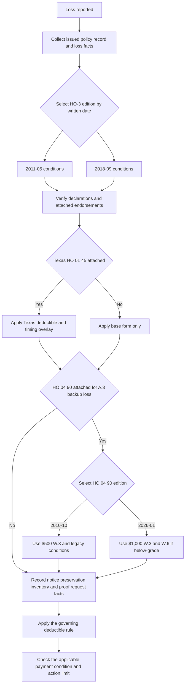

## Purpose and control boundary

This page documents the Section I claim-condition and deductible sequence for the issued HO-3 form and attached endorsements. It is a claims-handling reference, not a coverage grant: first confirm the issued policy record, then apply the controlling base form, then apply any attached endorsement or state overlay that actually governs the loss.

The controlling HO-3 edition is selected by policy written date. HO-3 2011-05 applies to policies written from 2011-05-01 through 2018-08-31 and remains controlling for losses under those policies even if reported later. HO-3 2018-09 applies to policies written on or after 2018-09-01. Do not import a later edition's inventory, payment, or deductible wording into an older issued policy unless the issued record supports that wording.

State amendments and endorsements are additional layers that must be verified in the policy record. An attached Texas amendatory endorsement governs conflicting base-form language, but a bulletin by itself is regulatory authority, not proof that the endorsement was attached.

### Claim-handling sequence

This sequence keeps the form edition, attached endorsement, claim-condition timing, payment trigger, and deductible path distinct.

## Claim conditions by controlling HO-3 edition

| Control | HO-3 2011-05 | HO-3 2018-09 | Handling consequence |
| --- | --- | --- | --- |
| Prompt notice | S.1 requires prompt notice to the insurer or its agent. | S.1 requires prompt notice to the insurer or its agent. | Record who received notice and when; the form does not set a fixed number of days for “prompt.” |
| Protect and preserve | S.1 requires protection from further damage. | S.1 requires protection from further damage and preparation of an inventory of damaged personal property. | Capture mitigation steps and the property's condition before and after loss. The neglect exclusion separately bars loss caused by failure to use all reasonable means to save and preserve property at and after loss. |
| Inventory | No separate inventory duty appears in S.1. | S.1 adds an inventory of damaged personal property. | Require and retain the inventory only under the 2018 wording or another issued term that imposes it. |
| Proof of loss | S.2 requires a signed, sworn proof within 60 days after the insurer requests it. | S.2 has the same request-triggered 60-day requirement. | The request date starts the clock. Record the request, the requested items, delivery, and cure communications. |
| Action limitation | S.3 requires full compliance with Section I conditions and suit within two years after loss. | S.4 imposes the same two-year limitation and compliance condition. | Preserve the loss date and governing edition; the section number changes by edition. |

The preservation duty is reinforced by the neglect exclusion in both editions. It does not make every later deterioration or emergency expense automatically covered.

## Payment timing and action limits

Only HO-3 2018-09 contains the base-form loss-payment clause in these sources. Under S.3, the insurer adjusts losses with the insured and pays the insured unless another payee is named. Payment is due 60 days after receipt of proof of loss and written agreement, an appraisal award, or a court judgment. Treat those as conjunctive resolution checkpoints, not as a universal 60-day deadline from notice alone.

HO-3 2011-05 does not contain that payment clause in its Section I conditions. Its Section I conditions stop at the deductible provision, so payment timing must be sourced from the governing edition and any separately attached endorsement.

For an attached Texas HO 01 45 endorsement, keep the claim-condition payment rule separate from the endorsement's carrier timing requirements:

- T.4 extends the action period from two years to two years and one day after loss, but only for the base form provision it names.
- T.5 requires acknowledgement within 15 days, a written approval or denial within 15 business days after receiving all reasonably requested items, and payment within five business days after approval.

Do not relabel T.5 as a rewrite of the base-form payment clause. Record the base-form trigger and the Texas milestones separately.

## Deductible decision rules

Start with the Declarations and the covered-loss path. A deductible is not an extra loss category: apply the governing provision to the portion of loss for which it speaks, and do not stack the ordinary deductible with a separate deductible where the form or endorsement selects one deductible only.

### Base-form ordinary deductible

- Under HO-3 2011-05 S.4, the deductible shown in the Declarations applies to each Section I loss.
- Under HO-3 2018-09 S.5, the Declarations deductible applies to each Section I loss. If a separate windstorm or hail deductible required by a state amendatory endorsement also applies, only the larger is deducted.

The deductible amount comes from the issued Declarations; neither base form fixes a dollar amount.

### Water-backup endorsement deductible and coverage path

The A.3 water-backup path is separate from the ordinary deductible. In both HO-3 editions, A.3 remains excluded unless HO 04 90 is attached. When a verified attached HO 04 90 applies, W.1 supplies the limited direct-physical-loss coverage for sewer/drain backup or sump overflow or discharge.

Select the attached HO 04 90 edition independently of the HO-3 edition:

- HO 04 90 2010-10 remains in force for policies written under it.
- HO 04 90 2026-01 replaces it for policies written on or after 2026-01-01.

W.3 is a contract payment-term modification of the selected endorsement loss, not a write-back of A.3. It displaces the base Section I deductible for covered endorsement loss and supplies one separate endorsement deductible. Do not stack the base deductible with W.3.

| Verified attached HO 04 90 edition | W.3 deductible for each covered endorsement loss | Additional eligibility check |
| --- | ---: | --- |
| 2010-10 | $500 | Verify W.1 coverage, W.4's retained exclusions, and W.5's known maintenance condition. |
| 2026-01 | $1,000 | Verify the same W.1, W.4, and W.5 controls, and also W.6 if the residence premises has a finished area below grade. |

The 2026-01 edition adds W.6's backflow-prevention requirement. Do not impose W.6 on a 2010-10 loss.

### Texas windstorm and hail deductible

For a Texas policy with HO 01 45 attached and effective on or after 2022-01-01, T.1 amends HO-3 2018-09 S.5. That endorsement and the Texas bulletin both treat windstorm or hail loss as subject to only the separate windstorm and hail deductible, with no additional all-other-perils deductible on the same loss.

The contract relationship and the regulatory source are separate:

- HO 01 45 T.1 is the policy term that controls an issued Texas policy where the endorsement is attached.
- Bulletin B-2021-08 is the regulatory requirement that supports the filing, disclosure, and application rules.

For a mixed-peril occurrence, if wind/hail damage and another covered peril can be separately determined, apply each deductible only to its own portion. If the damage cannot be separately determined, apply only the larger single deductible to the entire loss.

B.4 and T.2 also require renewal notice before a wind/hail deductible percentage increase takes effect, and T.3/B.5 define the named-storm period when the declarations select that basis. Those rules depend on the issued declarations and endorsement terms; they do not create a deductible by themselves.

## Focused review scenarios

Use these file-review checks before communicating a condition, deadline, payment expectation, or net-loss estimate:

1. **Older reported loss:** Select the HO-3 edition by written date, not report date, and do not import 2018 inventory or S.3 payment wording into a 2011 policy.
2. **Proof-of-loss clock:** Confirm a documented insurer request, then calculate 60 days from that request rather than from the loss report.
3. **Post-loss deterioration:** Preserve photographs, emergency invoices, and mitigation notes; evaluate the protection duty together with the neglect exclusion rather than assuming avoidable damage is part of the original loss.
4. **Attached water-backup loss:** Verify A.3 attachment and the actual HO 04 90 edition before calculating. Apply the selected endorsement deductible and, if the 2026-01 edition applies, also test W.6 when there is finished area below grade.
5. **Texas mixed-peril occurrence:** Determine whether wind/hail and other covered damage can be allocated. If not, use only the larger deductible; also verify endorsement attachment, effective date, declarations disclosure, and any renewal-increase notice.
6. **Texas deadlines:** Record receipt, completion of reasonably requested items, written decision, approval notice, payment, and the action deadline separately. Do not mistake the Texas prompt-payment milestones for the base-form payment condition.

The invariant across these scenarios is: select the issued form, verify the overlay, document the trigger, and apply the single deductible rule selected by the controlling language.
