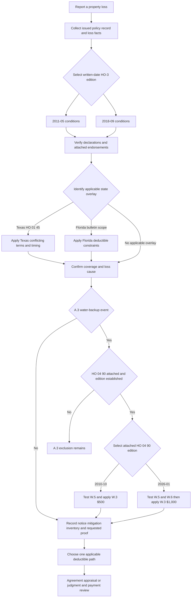

## Purpose and control boundary

This page is the Section I handling sequence for the synthetic homeowners forms: what an insured must do after loss, when a proof-of-loss deadline and payment trigger arise, and which deductible path applies. It is not a coverage grant or a substitute for the issued policy. Begin with the policy record—written date, effective date, state, declarations, and attached endorsements—rather than importing terms from a later edition or a regulatory bulletin.

The base-form selection is a hard control. **HO-3 2011-05** governs policies written from 2011-05-01 through 2018-08-31 and remains controlling for their losses even when reported later. **HO-3 2018-09** governs policies written on or after 2018-09-01. Therefore, the 2018 inventory, loss-payment, and S.5 deductible language does **not** supply an omitted term for a 2011 policy. See [Governing Form Editions and Policy Assembly](/openwiki/coverage/policy-editions-and-governing-forms.md) for the selection and attachment controls. [2011 applicability](repo://forms/HO/MS/HO-3/2011-05.md#L1-L7) · [2018 applicability](repo://forms/HO/MS/HO-3/2018-09.md#L1-L4)

State amendments and coverage endorsements are additional, conditional layers. An endorsement must be part of the issued policy; a bulletin may establish a regulatory constraint but does not by itself prove attachment. Where attached, the Texas amendatory endorsement expressly governs over a conflicting base-form provision. [Texas attachment and conflict rule](repo://forms/HO/TX/HO-01-45/2022-01.md#L1-L4) · [Texas filing rule](repo://bulletins/TX/2021-08-windstorm-deductible.md#L35-L37)

### Routing map

- **Coverage and water source:** decide whether the loss is covered before applying the handling conditions. For sewer/drain backup and sump events, use [Water Damage and Backup](/openwiki/coverage/property/water-damage-and-backup.md) and the issued HO 04 90 endorsement edition.
- **Roof settlement and roof deductibles:** use [Roof Settlement](/openwiki/coverage/coverage-a/roof-settlement.md) for the separate 2018 roof-surfacing settlement path and attached roof endorsements. Florida-specific roof terms belong in the [Florida overlay](/openwiki/state-overlays/florida.md).
- **Texas amendment:** use the [Texas overlay](/openwiki/state-overlays/texas.md) when HO 01 45 is attached and temporally applicable. It changes deductible application and adds its own action and prompt-payment language.
- **Operational handling:** use [Water-Loss Handling](/openwiki/operations/claims-water-loss-handling.md) for intake, mitigation, vendor, and documentation workflow; this page states the policy-condition controls that workflow must preserve.

## Claim lifecycle and required file record

*The handling sequence selects the issued base form and verified attachments first. For an A.3 water-backup event, it separately selects the attached HO 04 90 edition, applies that edition's conditions, and uses its W.3 modification of the base deductible; Texas and Florida layers remain separate.* [HO-3 2011-05, applicability and conditions](repo://forms/HO/MS/HO-3/2011-05.md#L3-L7) · [HO-3 2018-09, A.3 and conditions](repo://forms/HO/MS/HO-3/2018-09.md#L75-L77) [conditions](repo://forms/HO/MS/HO-3/2018-09.md#L101-L112) · [HO 04 90 2010-10, status and W.3-W.5](repo://forms/HO/MS/HO-04-90/2010-10.md#L1-L7) [W.3-W.5](repo://forms/HO/MS/HO-04-90/2010-10.md#L17-L29) · [HO 04 90 2026-01, status and W.3-W.6](repo://forms/HO/MS/HO-04-90/2026-01.md#L1-L4) [W.3-W.6](repo://forms/HO/MS/HO-04-90/2026-01.md#L20-L47) · [HO 01 45, conflict rule](repo://forms/HO/TX/HO-01-45/2022-01.md#L1-L4) · [OIR-2023-04, applicability and deductible controls](repo://bulletins/FL/2023-04-roof-age-nonrenewal.md#L1-L3) [F.4-F.6](repo://bulletins/FL/2023-04-roof-age-nonrenewal.md#L21-L33)

At first notice of loss, preserve an auditable record of the policy-written date, policy effective date, selected HO-3 edition, declarations limits and deductible values, state, verified attachment and edition of each endorsement, reported cause and loss date, notice recipient and date, mitigation steps, property inventory, insurer proof-of-loss request, and proof delivery date. For a claimed water-backup loss, also preserve the HO 04 90 edition-selection facts and, when the attached edition is 2026-01, whether there is a finished area below grade and the at-loss backflow-device evidence. These facts are the entrypoints for the provisions below: the base forms make duties and deductibles depend on the policy/declarations, the proof deadline depends on an insurer request, and Texas has a distinct endorsement effective-date trigger. [2011 conditions](repo://forms/HO/MS/HO-3/2011-05.md#L83-L92) · [2018 conditions](repo://forms/HO/MS/HO-3/2018-09.md#L101-L112) · [HO 04 90 2010-10, continuing force](repo://forms/HO/MS/HO-04-90/2010-10.md#L1-L7) · [HO 04 90 2026-01, replacement rule and W.6](repo://forms/HO/MS/HO-04-90/2026-01.md#L1-L4) [W.6](repo://forms/HO/MS/HO-04-90/2026-01.md#L42-L47) · [Texas effective-date trigger](repo://forms/HO/TX/HO-01-45/2022-01.md#L1-L4)

## Insured duties by controlling HO-3 edition

| Control | HO-3 2011-05 | HO-3 2018-09 | Handling consequence |
| --- | --- | --- | --- |
| **Prompt notice** | S.1 requires prompt notice to the insurer or its agent. | S.1 retains prompt notice to the insurer or its agent. | Log who received notice and when; neither form gives a fixed number of days for “prompt.” |
| **Protect and preserve** | S.1 requires protection from further damage. | S.1 requires protection from further damage. | Capture reasonable emergency mitigation and the condition of property before and after it. The neglect exclusion separately bars loss caused by failure to use all reasonable means to save and preserve property at and after loss. |
| **Inventory** | S.1 does not state an inventory requirement. | S.1 adds preparation of an inventory of damaged personal property. | Require and retain the inventory only under the 2018 wording (or another verified policy term); do not manufacture it as a 2011 S.1 duty. |
| **Sworn proof of loss** | S.2 requires a signed, sworn proof within 60 days **after the insurer requests it**. | S.2 has the same request-triggered 60-day requirement. | The request date starts the stated clock. Record the request, the requested materials, delivery, and any cure communications. |
| **Action limitation** | S.3 requires full compliance with Section I conditions and suit within two years after loss. | S.4 imposes the same two-year limitation and compliance condition. | Record the loss date and governing wording; the section number changes by edition. |

The table follows 2011-05 S.1-S.3 and 2018-09 S.1-S.4. The preservation control is reinforced by each edition's neglect exclusion; it does not justify treating every post-loss expense or every later deterioration as automatically covered. [2011 conditions and neglect exclusion](repo://forms/HO/MS/HO-3/2011-05.md#L71-L75) [2011 conditions](repo://forms/HO/MS/HO-3/2011-05.md#L83-L90) · [2018 conditions and neglect exclusion](repo://forms/HO/MS/HO-3/2018-09.md#L83-L87) [2018 conditions](repo://forms/HO/MS/HO-3/2018-09.md#L101-L109)

## Adjustment and payment checkpoints

Only **HO-3 2018-09 S.3** supplies the base-form loss-payment sequence in these sources: the insurer adjusts losses with the insured and pays the insured unless another payee is named; payment is due 60 days after receipt of proof of loss **and** written agreement, an appraisal award, or a court judgment. Treat those as conjunctive resolution checkpoints, not a universal 60-day deadline running from notice alone. The 2011-05 Section I conditions stop at its S.4 deductible provision and do not contain that 2018 S.3 payment clause. [2018 S.3](repo://forms/HO/MS/HO-3/2018-09.md#L107-L108) · [2011 S.1-S.4](repo://forms/HO/MS/HO-3/2011-05.md#L83-L92)

For an applicable **Texas HO 01 45** endorsement, keep the following changes separate from that base-form payment trigger:

- **Action period:** T.4 says the form's S.4 action period is extended from two years to **two years and one day** after loss.
- **Carrier prompt-payment milestones:** T.5 requires acknowledgement within 15 days; a written approval or denial within 15 business days after receiving all reasonably requested items; and payment within five business days after approval notice.

The endorsement does not describe T.5 as a rewrite of 2018 S.3. Track both the selected base payment clause and the applicable Texas milestones instead of relabeling either one. Also perform a compatibility check: T.4 expressly names an **S.4 action** provision, which matches 2018-09, whereas 2011-05 places its action limitation in S.3 and uses S.4 for the deductible. Do not silently transpose the Texas cross-reference onto a 2011 policy; resolve it from the issued policy record. [Texas T.4-T.5](repo://forms/HO/TX/HO-01-45/2022-01.md#L21-L27) · [2018 S.3-S.4](repo://forms/HO/MS/HO-3/2018-09.md#L107-L110) · [2011 S.3-S.4](repo://forms/HO/MS/HO-3/2011-05.md#L87-L92)

## Deductible decision rules

Start with the Declarations and the coverage path. A deductible is not an extra loss category: apply the controlling provision to the portion of loss for which it speaks, and do not stack the ordinary deductible with an alternate deductible where the form or bulletin selects one deductible.

### Base-form ordinary deductible

- Under **2011-05 S.4**, the deductible shown in the Declarations applies to each Section I loss.
- Under **2018-09 S.5**, the Declarations deductible also applies to each Section I loss, subject to a separate windstorm/hail deductible required by a state amendatory endorsement. Where both could apply under S.5, the form says only the larger is deducted.

The declaration value must be taken from the issued policy; neither base form fixes a dollar amount. [2011 S.4](repo://forms/HO/MS/HO-3/2011-05.md#L89-L92) · [2018 S.5](repo://forms/HO/MS/HO-3/2018-09.md#L109-L112)

### Water-backup W.3: edition-specific modification of the base deductible

The attachment-dependent coverage path and the deductible are separate steps. In either HO-3 edition, **A.3 remains excluded unless HO 04 90 is attached**; when a verified attached endorsement applies, **W.1** supplies the limited direct-physical-loss route for the stated sewer/drain backup or sump-related overflow/discharge. Select the attached **HO 04 90** edition independently of the HO-3 edition: 2010-10 remains in force for policies written under it, while 2026-01 replaces it for policies written on or after 2026-01-01. A repository form, a current handling guide, or the date of a reported loss is not a substitute for a verified attachment and selected endorsement edition. [HO-3 2011-05 A.3](repo://forms/HO/MS/HO-3/2011-05.md#L63-L66) · [HO-3 2018-09 A.3](repo://forms/HO/MS/HO-3/2018-09.md#L75-L77) · [HO 04 90 2010-10, status and W.1](repo://forms/HO/MS/HO-04-90/2010-10.md#L1-L11) · [HO 04 90 2026-01, replacement rule and W.1](repo://forms/HO/MS/HO-04-90/2026-01.md#L1-L11)

**W.3 is a contract payment-term modification of the selected base Section I deductible, not the A.3 write-back.** For a loss covered under the selected endorsement, it displaces the base deductible shown in the Declarations—**S.4** in HO-3 2011-05 or **S.5** in HO-3 2018-09—and supplies one separate endorsement deductible. Do not write the base deductible back into the calculation and do not stack it with W.3.

| Verified attached HO 04 90 edition | W.3 deductible for each covered endorsement loss | Separate eligibility and amount checks before applying W.3 |
| --- | ---: | --- |
| **2010-10** | **$500** | Verify W.1's A.3 backup/sump event, W.4's retained A.1/A.2 exclusions, W.5's known, causative, unremedied maintenance condition, and W.2's $5,000 policy-period sublimit unless the endorsement Declarations show a higher limit. No finished-below-grade/backflow-device condition appears in this edition. |
| **2026-01** | **$1,000** | Verify the same W.1, W.4, and W.5 controls, and W.2's $10,000 policy-period sublimit unless the endorsement Declarations show a higher limit. In addition, if the residence premises has a finished area below grade, W.6 requires an installed and operable backwater valve or equivalent backflow-prevention device on the serving sewer line at the time of loss. |

For both rows, W.3 says the Section I Declarations deductible does not apply to loss covered under the endorsement. Thus **$500 is the legacy 2010-10 result and $1,000 is the current 2026-01 result**; neither is a default selected from the HO-3 base-form date. The 2026 W.6 backflow condition is expressly new and must not be imposed on a 2010-10 loss. [HO-3 2011-05 S.4](repo://forms/HO/MS/HO-3/2011-05.md#L89-L92) · [HO-3 2018-09 S.5](repo://forms/HO/MS/HO-3/2018-09.md#L109-L112) · [HO 04 90 2010-10 W.2-W.5](repo://forms/HO/MS/HO-04-90/2010-10.md#L13-L29) · [HO 04 90 2026-01 W.2-W.6](repo://forms/HO/MS/HO-04-90/2026-01.md#L13-L47)

### Contract terms and internal handling guidance

The W.1 through W.6/W.7 controls above are policy terms from the selected, attached endorsement. The water-loss guide is **internal claims guidance**, is not part of any policy, and must not be quoted to an insured or claimant; its source-first investigation instruction can support a file record but cannot select the HO 04 90 edition, establish attachment, add the 2026 W.6 condition to a legacy endorsement, or change W.3's contractual deductible. [Guidance status and source-first instruction](repo://guidelines/claims/water-loss-handling.md#L1-L11) · [HO 04 90 2010-10, status and payment terms](repo://forms/HO/MS/HO-04-90/2010-10.md#L1-L19) · [HO 04 90 2026-01, status and payment terms](repo://forms/HO/MS/HO-04-90/2026-01.md#L1-L23)

### Texas windstorm and hail deductible

For a Texas policy with HO 01 45 attached and effective on or after 2022-01-01, **T.1 expressly amends HO-3 2018-09 S.5** and implements Texas Bulletin B-2021-08. S.5 is the base rule that applies the Declarations deductible to each Section I loss and, where its state-amendment wind/hail deductible and the ordinary deductible both apply, deducts only the larger. T.1 supplies the controlling Texas result for windstorm/hail loss: apply only the separate windstorm/hail deductible, not the all-other-perils deductible. It and B.3 also give the same mixed-peril allocation rule. The policy-specific result requires the attached endorsement; B.3 is the matching regulatory application requirement, not evidence of attachment. [HO-3 2018-09 S.5](repo://forms/HO/MS/HO-3/2018-09.md#L109-L112) · [HO 01 45 T.1](repo://forms/HO/TX/HO-01-45/2022-01.md#L5-L11) · [Bulletin B.3](repo://bulletins/TX/2021-08-windstorm-deductible.md#L15-L19)

The no-stacking and allocation controls under that relationship are:

1. A windstorm/hail loss receives **only** the windstorm/hail deductible; do not also deduct the all-other-perils amount.
2. For one occurrence involving wind/hail and another covered peril, use a deductible for each respective portion only when damages can be separately determined.
3. If those damages cannot be separately determined, apply only the **larger single deductible** to the entire loss.
4. A higher wind/hail percentage at renewal is ineffective for that renewal term without the required 30-day written notice; the prior percentage remains applicable.

T.1 states a percentage of Coverage A, generally from 1% through 5%, with a 10% ceiling in its stated seacoast territories. B.2 also permits a qualifying flat-dollar alternative no lower than the all-other-perils deductible; that regulatory permission is not text that T.1 inserts into an issued policy. The bulletin additionally requires Declarations disclosure in specified form and approved or deemed-approved filing of the amendatory endorsement and rate rule before application. Those regulatory facts support review and configuration controls, but they are not evidence that a particular policy has HO 01 45 attached. [HO 01 45 T.1-T.2 and T.6](repo://forms/HO/TX/HO-01-45/2022-01.md#L5-L15) [T.6](repo://forms/HO/TX/HO-01-45/2022-01.md#L29-L31) · [Bulletin B.2-B.4](repo://bulletins/TX/2021-08-windstorm-deductible.md#L9-L25) · [Bulletin B.7](repo://bulletins/TX/2021-08-windstorm-deductible.md#L35-L37)

When the declarations specify a per-named-storm Texas deductible, the named-storm period starts when the National Hurricane Center names the storm and ends 72 hours after its designation is discontinued; all wind/hail loss during that period is one occurrence for deductible purposes. If wind/hail is excluded because the insured obtained that coverage through the Texas Windstorm Insurance Association and the required exclusion endorsement and acknowledgement are in place, T.1 does not apply. [HO 01 45 T.3 and T.7](repo://forms/HO/TX/HO-01-45/2022-01.md#L17-L19) [HO 01 45 T.7](repo://forms/HO/TX/HO-01-45/2022-01.md#L33-L37)

### Florida roof and hurricane routing

For Florida residential policies issued or renewed with an effective date on or after 2023-07-01, **OIR-2023-04 F.4** constrains the offer and configuration of a separate roof deductible or ACV roof settlement schedule: the insured must also be offered a policy without that provision at a filed and approved rate, with the premium difference disclosed in writing at offer. F.4 also prohibits applying an ACV schedule to a roof under ten years old at the policy effective date. This regulatory control is separate from the contract route in HO-3 2018-09 A.4, which uses an ACV schedule for windstorm/hail roof surfacing only when that endorsement is attached; F.4 does not itself attach a schedule or choose a deductible. [Florida applicability and F.4](repo://bulletins/FL/2023-04-roof-age-nonrenewal.md#L1-L3) [F.4](repo://bulletins/FL/2023-04-roof-age-nonrenewal.md#L21-L25) · [HO-3 2018-09 A.3-A.4](repo://forms/HO/MS/HO-3/2018-09.md#L25-L34)

**F.6** separately constrains application when a hurricane deductible and a separate roof deductible would both apply to the same Florida loss: deduct only the larger. It leaves a hurricane deductible otherwise permitted by law unaffected and does not establish either deductible in an individual policy. The selected 2018 base form's S.5 supplies a separate general ordinary/state-amendment wind-hail deductible rule; verify the applicable law, Declarations, and issued endorsements rather than treating either source as proof of the other configuration. Apply these controls through the [Florida overlay](/openwiki/state-overlays/florida.md) alongside the selected base form and any issued roof endorsement. [Florida F.6](repo://bulletins/FL/2023-04-roof-age-nonrenewal.md#L31-L33) · [HO-3 2018-09 S.5](repo://forms/HO/MS/HO-3/2018-09.md#L109-L112)

## Focused review scenarios

Use these as file-review tests before communicating a condition, deadline, payment expectation, or net-loss estimate:

1. **Late-reported older policy:** Select 2011-05 from the written date; verify that the file does not use the 2018 inventory or S.3 payment language.
2. **Proof-of-loss clock:** Confirm a documented insurer request, then calculate 60 days from that request rather than from the loss report.
3. **Post-loss deterioration:** Preserve photographs, emergency invoices, and mitigation notes; evaluate the S.1 protection duty together with the neglect exclusion rather than presuming avoidable damage is part of the original loss.
4. **Attached water-backup loss:** Verify the A.3 attachment path and the actual HO 04 90 edition before calculating. For 2010-10, test W.5 and apply its $500 W.3 deductible; for 2026-01, also test W.6 when there is finished area below grade and apply its $1,000 W.3 deductible. In either case, exclude the ordinary Section I deductible from the covered endorsement loss.
5. **Texas mixed-peril occurrence:** Determine whether wind/hail and other covered damage can be allocated. If not, use only the larger deductible; also test endorsement attachment, effective date, declaration disclosure, and any renewal-increase notice.
6. **Texas deadlines:** Record receipt, completion of reasonably requested items, written decision, approval notice, payment, and the action deadline separately. Do not mistake the 15-day and five-business-day endorsement milestones for the 2018 S.3 proof-plus-resolution payment condition.
7. **Florida roof/hurricane loss:** Confirm the applicable bulletin period and roof product terms; never deduct both a separate roof deductible and hurricane deductible from the same loss.

The invariant across these scenarios is: **select the issued form, verify the overlay, document the trigger, and apply the single deductible rule that the controlling language selects.**
