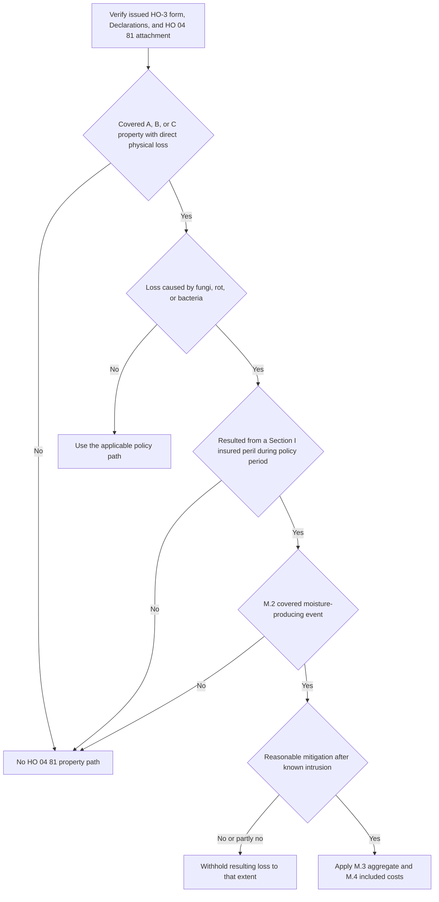

## Scope and issued-policy check

This page addresses the narrow **Section I property** path in **HO 04 81 Limited Fungi, Wet or Dry Rot, or Bacteria Coverage (2018-09)**. It is not a general mold or water-damage grant. Start with the issued policy: select the governing HO-3 edition by policy-written date, confirm the Declarations and endorsement schedule, and verify that a compatible HO 04 81 is attached. HO-3 2018-09 applies to policies written on or after September 1, 2018; HO-3 2011-05 continues to govern policies written under that form. A form in the repository or a mold observation does not prove attachment. [HO 04 81 attachment and scope](repo://forms/HO/MS/HO-04-81/2018-09.md#L1-L4) · [HO-3 2011-05 status](repo://forms/HO/MS/HO-3/2011-05.md#L1-L7) · [HO-3 2018-09 status](repo://forms/HO/MS/HO-3/2018-09.md#L1-L4)

The supplied HO 04 81 is a 2018-09 endorsement. Its M.2 expressly refers to the 2018 form's P.2 and C.3. The supplied 2011-05 form has neither a separately numbered P.2 perils-insured-against provision nor C.3's continuous-or-repeated-leakage wording. Do not transplant those 2018 references—or this endorsement's terms—onto a 2011-05 policy without compatible issued-policy support. [HO 04 81 M.2](repo://forms/HO/MS/HO-04-81/2018-09.md#L11-L17) · [HO-3 2011-05 exclusions](repo://forms/HO/MS/HO-3/2011-05.md#L57-L80) · [HO-3 2018-09 P.2 and C.3](repo://forms/HO/MS/HO-3/2018-09.md#L59-L64) · [HO-3 2018-09 C.3](repo://forms/HO/MS/HO-3/2018-09.md#L83-L90)

## The limited C.2 write-back

**HO-3 2018-09 Section I Exclusion C.2** excludes loss caused by, among other things, deterioration, mold, and wet or dry rot. When the compatible endorsement is attached, **HO 04 81 M.1** writes back that specific exclusion only to its stated extent: direct physical loss to property covered under Coverage A, B, or C caused by fungi, wet or dry rot, or bacteria **only when** the condition results from a Section I insured peril that occurred during the policy period. M.1 says that C.2 does not apply only “[t]o the extent of the coverage provided here.” [HO-3 2018-09 C.2](repo://forms/HO/MS/HO-3/2018-09.md#L83-L89) · [HO 04 81 M.1](repo://forms/HO/MS/HO-04-81/2018-09.md#L5-L10)

Thus, M.1 does not erase the base policy's other gates. The claimed property must be within the applicable A, B, or C coverage and suffer direct physical loss; for 2018 Coverage C, the relevant P.2 named-peril requirement also remains material. Other exclusions, conditions, settlement provisions, deductibles, and Declarations changes continue to apply. [HO-3 2018-09 A/B/C coverage](repo://forms/HO/MS/HO-3/2018-09.md#L23-L50) · [HO-3 2018-09 P.1–P.2](repo://forms/HO/MS/HO-3/2018-09.md#L59-L64) · [HO 04 81 M.1 and all-other-provisions clause](repo://forms/HO/MS/HO-04-81/2018-09.md#L5-L10) · [HO 04 81 M.6](repo://forms/HO/MS/HO-04-81/2018-09.md#L33-L37)

*The flow applies the limited M.1 write-back, then M.2's underlying-event requirement and M.5's allocation condition before amount accounting.* [HO 04 81 M.1–M.5](repo://forms/HO/MS/HO-04-81/2018-09.md#L5-L31)

## M.2: establish the underlying event before the condition

For fungi, rot, or bacteria produced by water or moisture, **M.2** requires that the water or moisture came from an event that was itself covered. The endorsement gives a sudden and accidental plumbing discharge described in 2018 P.2 as one example. The determination is about the source and covered status of the precipitating event, not simply the presence of water damage or a remediation estimate. [HO 04 81 M.2](repo://forms/HO/MS/HO-04-81/2018-09.md#L11-L17) · [HO-3 2018-09 P.2](repo://forms/HO/MS/HO-3/2018-09.md#L59-L64)

**M.2 separately preserves the relevant source and duration barriers.** It says coverage does not apply when moisture came from flood, surface water, or subsurface water because **HO-3 2018-09 A.1 and A.2** continue in full and remove the underlying loss. It also says coverage does not apply to moisture from continuous or repeated seepage or leakage over weeks, months, or years because **HO-3 2018-09 C.3** removes that underlying loss. M.1's C.2 write-back does not alter A.1, A.2, or C.3. [HO 04 81 M.1–M.2](repo://forms/HO/MS/HO-04-81/2018-09.md#L5-L17) · [HO-3 2018-09 A.1–A.2](repo://forms/HO/MS/HO-3/2018-09.md#L69-L75) · [HO-3 2018-09 C.2–C.3](repo://forms/HO/MS/HO-3/2018-09.md#L83-L90)

For a 2018-09 continuous-leakage issue, document source, onset, duration, knowledge, and remediation. C.3 retains loss that is sudden and accidental as Definition 5 defines it, but a condition that develops gradually or was known and not remedied is not sudden and accidental merely because its effects were discovered later. Physical indicators such as staining patterns, corrosion, and material degradation support the duration finding. [HO-3 2018-09 Definition 5](repo://forms/HO/MS/HO-3/2018-09.md#L19-L20) · [HO-3 2018-09 C.3](repo://forms/HO/MS/HO-3/2018-09.md#L83-L90) · [water-loss guidance on duration evidence](repo://guidelines/claims/water-loss-handling.md#L35-L41)

## Backup-related fungi: two independent endorsements

A sewer/drain backup or sump-related backup, overflow, or discharge follows a distinct two-endorsement path. **HO 04 90 W.1** supplies the limited water-backup route by writing back **HO-3 A.3** when HO 04 90 is attached; A.3 itself makes that exception attachment-dependent. Separately, **HO 04 81 M.1** writes back **HO-3 2018-09 C.2** for qualifying fungi, rot, or bacteria. M.2 identifies water backup covered by an attached water-backup endorsement as an example of a covered moisture-producing event. A backup-related fungi claim therefore requires both attachment determinations and both coverage analyses. [HO-3 2018-09 A.3](repo://forms/HO/MS/HO-3/2018-09.md#L75-L77) · [HO 04 90 attachment and W.1](repo://forms/HO/MS/HO-04-90/2010-10.md#L1-L8) · [HO-3 2018-09 C.2](repo://forms/HO/MS/HO-3/2018-09.md#L83-L89) · [HO 04 81 M.1–M.2](repo://forms/HO/MS/HO-04-81/2018-09.md#L5-L17)

Do **not** merge the endorsements' attachments, limits, deductibles, or mitigation/maintenance conditions. HO 04 90 has its own policy-period W.2 sublimit, W.3 separate deductible, and W.5 known-and-unremedied maintenance condition for the backup loss. HO 04 81 has its separate M.3 policy-period aggregate and M.5 post-intrusion mitigation condition for fungi, rot, or bacteria. W.4 also preserves A.1 and A.2 for the backup endorsement; M.2 independently preserves A.1, A.2, and C.3 for the fungi path. Record payments and costs against the applicable endorsement rather than treating one endorsement's limit or deductible as the other's term. [HO 04 90 W.2–W.5](repo://forms/HO/MS/HO-04-90/2010-10.md#L9-L25) · [HO 04 90 W.4](repo://forms/HO/MS/HO-04-90/2010-10.md#L17-L21) · [HO 04 81 M.2–M.5](repo://forms/HO/MS/HO-04-81/2018-09.md#L11-L31) · [HO-3 2018-09 A.1–A.3](repo://forms/HO/MS/HO-3/2018-09.md#L69-L77)

## M.3 aggregate and included costs

M.3 makes the most payable for **all loss under HO 04 81 in any one policy period** **$10,000**, unless the Declarations show a higher limit for the endorsement. This is a policy-period aggregate regardless of the number of occurrences, claims, or locations, and it is part of—not in addition to—the applicable Coverage A, B, and C limits. Maintain a single policy-period running total and determine the remaining aggregate before authorizing an additional payment. [HO 04 81 M.3](repo://forms/HO/MS/HO-04-81/2018-09.md#L19-L23)

The aggregate includes more than removal charges. Under M.4, it also includes necessary tear-out and replacement to gain access, post-removal testing to confirm absence, and any increase in Coverage D loss of use attributable to the fungi, rot, or bacteria. [HO 04 81 M.4](repo://forms/HO/MS/HO-04-81/2018-09.md#L25-L27)

The attributable Coverage D amount is not a freestanding additional-living-expense grant. Under HO-3 2018-09 D.1, a covered loss must make the residence premises unfit to live in; the benefit is the reasonable necessary increase in living expenses to maintain the normal standard of living for the shortest reasonably required repair-or-replacement time. Apply those D.1 prerequisites and the D.2 Coverage D limit, while also charging the attributable amount to M.3. [HO-3 2018-09 D.1–D.2](repo://forms/HO/MS/HO-3/2018-09.md#L51-L55) · [HO 04 81 M.3–M.4](repo://forms/HO/MS/HO-04-81/2018-09.md#L19-L27)

## M.5 mitigation condition

M.5 is a separate endorsement condition, not merely a restatement of the base neglect exclusion:

> We do not cover loss under this endorsement to the extent it results from an insured's failure to take reasonable steps to dry, clean, or otherwise mitigate water intrusion after the insured knew or reasonably should have known of it.

Apply the stated **“to the extent”** allocation. Document when the intrusion was known or reasonably knowable, reasonable available drying, cleaning, or other mitigation steps, actions taken, and the part of the fungi/rot/bacteria loss resulting from a failure. M.5 applies whether or not the general C.1 neglect exclusion also applies; C.1 separately addresses failure to use reasonable means to save and preserve property at and after a loss. [HO 04 81 M.5](repo://forms/HO/MS/HO-04-81/2018-09.md#L29-L31) · [HO-3 2018-09 C.1](repo://forms/HO/MS/HO-3/2018-09.md#L83-L87)

## Claim handling and underwriting are operational constraints

The internal water-loss guide directs adjusters to establish and document water source before evaluating damage. For a fungi file, retain the issued form and attachments, claimed property and condition, source/onset/duration evidence, covered-underlying-event analysis, mitigation timing, M.4 cost categories, and prior M.3 payments in the policy period. The guide requires specialist referral when the source cannot be established, multiple source categories are plausible, a foundation is involved, the loss exceeds $25,000, or a denial principally rests on duration; it directs a reservation of rights before investigating where coverage may turn on duration or HO 04 90 maintenance. This is handling guidance, not policy language and must not be quoted to an insured or claimant. [guidance status and source-first rule](repo://guidelines/claims/water-loss-handling.md#L1-L11) · [guidance referral and reservation rules](repo://guidelines/claims/water-loss-handling.md#L51-L59)

Underwriting rules constrain whether and at what limit the endorsement may be attached; they do not establish claim coverage, prove that a form was attached, or amend an issued policy. The authority matrix permits line underwriters to attach HO 04 81 at base limits and senior underwriters to bind mold limits up to $25,000. Florida guidance permits the base $10,000 M.3 aggregate without referral, but requires referral and a plumbing-age disclosure for a higher limit. Both guidance sources are operational underwriting controls, not contract terms. [authority matrix R.5](repo://guidelines/authority/referral-matrix.md#L41-L47) · [Florida guide status](repo://guidelines/appetite/fl-homeowners.md#L1-L5) · [Florida mold rule](repo://guidelines/appetite/fl-homeowners.md#L41-L45)

## Section II is unchanged

**HO 04 81 M.6 preserves the HO-3 Section II liability provisions.** The endorsement provides Section I property coverage only; it does not provide, extend, or modify Section II liability coverage for bodily injury or property damage arising out of fungi, rot, or bacteria. Analyze a related injury or third-party property-damage demand under the issued HO-3 Coverage E/F grants and Section II exclusions, not as an HO 04 81 payment, defense, or medical-payments benefit. [HO 04 81 M.6](repo://forms/HO/MS/HO-04-81/2018-09.md#L33-L37) · [HO-3 2018-09 Section II grants](repo://forms/HO/MS/HO-3/2018-09.md#L115-L124) · [HO-3 2018-09 Section II exclusions](repo://forms/HO/MS/HO-3/2018-09.md#L127-L133)

## Focused review tests

1. **Mold with no verified HO 04 81 attachment:** C.2 remains in force; do not infer the endorsement from a remediation estimate or an underwriting guide.
2. **Flood, surface water, subsurface water, or long-duration leakage followed by fungi:** apply M.2 with A.1, A.2, or C.3. The M.1 C.2 write-back does not cure the excluded underlying source or duration.
3. **Backup followed by fungi:** verify HO 04 90 for the A.3 backup path and HO 04 81 for the C.2 fungi path. Apply W.2/W.3/W.5 and M.3/M.5 separately.
4. **Multiple fungi claims in one term:** find all prior HO 04 81 payments across occurrences, claims, and locations before calculating the remaining M.3 aggregate.
5. **Delayed drying after a known intrusion:** determine the incremental loss caused by the failure and apply M.5 only to that extent, while separately considering C.1.
6. **Relocation or injury demand:** test attributable loss of use under D.1 and M.3/M.4; send bodily-injury and third-party-property-damage demands to the Section II analysis that M.6 leaves unchanged.

For adjacent analyses, see [Personal Property](/openwiki/coverage/coverage-c/personal-property.md), [Loss of Use](/openwiki/coverage/coverage-d/loss-of-use.md), [Liability and Medical Payments](/openwiki/coverage/coverage-e-f/liability-and-medical-payments.md), [Section I Property Perils and General Exclusions](/openwiki/coverage/property/perils-and-general-exclusions.md), [Water Damage and Backup](/openwiki/coverage/property/water-damage-and-backup.md), and [Water-Loss Handling](/openwiki/operations/claims-water-loss-handling.md).
