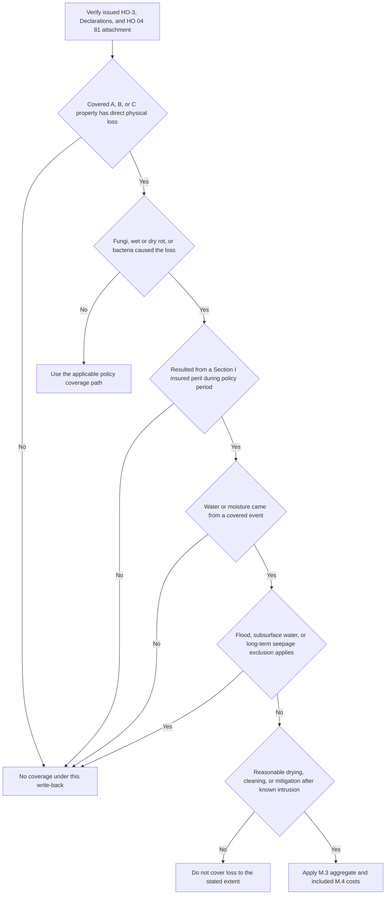

## Purpose and policy-assembly boundary

This page explains the limited **Section I property** write-back in **HO 04 81 Limited Fungi, Wet or Dry Rot, or Bacteria Coverage (2018-09)**. It is not a general mold or water-damage grant. Begin with the issued policy record: select the governing HO-3 edition by policy-written date, confirm the Declarations, and verify that **HO 04 81 is actually attached**. A form present in the repository or a reported mold condition does not establish attachment. The endorsement identifies itself as attaching to HO-3 and provides limited coverage for a cause otherwise excluded by Section I Exclusion C.2. [HO 04 81, attachment and scope](repo://forms/HO/MS/HO-04-81/2018-09.md#L1-L4) · [HO-3 2018-09, C.2](repo://forms/HO/MS/HO-3/2018-09.md#L83-L89) · [form-selection rule](repo://forms/HO/MS/HO-3/2011-05.md#L3-L7) · [2018 applicability](repo://forms/HO/MS/HO-3/2018-09.md#L1-L4)

The edition check is material. HO 04 81's M.2 uses the 2018 form's P.2 and C.3 cross-references; the supplied 2011-05 HO-3 does not have the 2018 perils-insured-against section or continuous-leakage provision. Do not transplant those 2018 cross-references to an older policy without compatible issued-policy support. [HO 04 81, M.2](repo://forms/HO/MS/HO-04-81/2018-09.md#L11-L17) · [HO-3 2011-05, Section I exclusions](repo://forms/HO/MS/HO-3/2011-05.md#L57-L79) · [HO-3 2018-09, P.1–P.2 and C.3](repo://forms/HO/MS/HO-3/2018-09.md#L59-L64) [HO-3 2018-09, C.3](repo://forms/HO/MS/HO-3/2018-09.md#L83-L90)

### What changes—and what does not

The base exclusion and the endorsement must be read together, and only after confirming that **HO 04 81 is attached**. **HO-3 2018-09 C.2** says: “We do not cover loss caused by wear and tear, marring, deterioration, inherent vice, latent defect, mechanical breakdown, rust, mold, wet or dry rot, or settling, cracking, shrinking, bulging, or expansion of pavements, patios, foundations, walls, floors, roofs, or ceilings.” **HO 04 81 M.1** then says: “We cover direct physical loss to property covered under Coverage A, Coverage B, and Coverage C caused by fungi, wet or dry rot, or bacteria, but only where that fungi, rot, or bacteria results from a peril insured against under Section I that occurred during the policy period.” It further provides: “To the extent of the coverage provided here, Section I — Exclusions C.2 does not apply.” [HO-3 2018-09, C.2](repo://forms/HO/MS/HO-3/2018-09.md#L83-L89) · [HO 04 81, M.1](repo://forms/HO/MS/HO-04-81/2018-09.md#L5-L10)

Accordingly, attachment supplies a narrow Section I write-back—not an erasure of C.2 or a grant for all moisture damage. It is limited to direct physical loss to covered **Coverage A, B, or C** property from the specified condition, resulting from a Section I insured peril during the policy period. All other policy provisions remain in force: attachment does not establish covered property, direct physical loss, or satisfaction of another Section I exclusion, condition, settlement rule, deductible, or state amendment. [HO 04 81, M.1 and all-other-provisions clause](repo://forms/HO/MS/HO-04-81/2018-09.md#L5-L10) [HO 04 81, M.6](repo://forms/HO/MS/HO-04-81/2018-09.md#L33-L37) · [HO-3 2018-09, A/B/C grants and Section I perils](repo://forms/HO/MS/HO-3/2018-09.md#L23-L64)

## Decision flow: establish the cause before the condition

*The flow tests the attached endorsement after the base-form C.2 exclusion and preserves the covered-underlying-event and mitigation gates before applying the endorsement aggregate.* [HO-3 2018-09, C.2–C.3](repo://forms/HO/MS/HO-3/2018-09.md#L83-L90) · [HO 04 81, M.1–M.5](repo://forms/HO/MS/HO-04-81/2018-09.md#L5-L31)

### Underlying-event gate

For a water- or moisture-produced condition, M.2 requires that the water or moisture came from an event that was itself covered. A sudden and accidental plumbing discharge is an example identified by the endorsement; for Coverage C, HO-3 P.2 lists accidental discharge or overflow from within plumbing, heating, or air-conditioning systems as an insured peril. This is a causation and coverage inquiry about the precipitating event, not a conclusion drawn merely from the presence of water damage or mold. [HO-3 2018-09, C.2](repo://forms/HO/MS/HO-3/2018-09.md#L83-L89) · [HO 04 81, M.1–M.2](repo://forms/HO/MS/HO-04-81/2018-09.md#L5-L17) · [HO-3 2018-09, P.2](repo://forms/HO/MS/HO-3/2018-09.md#L59-L64)

The three source findings that commonly stop this path are:

- **Flood, surface water, and related A.1 water:** HO-3 A.1 excludes flood, surface water, waves, tidal water, storm surge, and overflow of a body of water. The A.1–A.3 water exclusions apply regardless of another cause or event contributing concurrently or in sequence. HO 04 81 only displaces C.2 to its stated extent; it does not displace A.1. [HO-3 2018-09, A.1 and A.4](repo://forms/HO/MS/HO-3/2018-09.md#L69-L77) · [HO-3 2018-09, C.2](repo://forms/HO/MS/HO-3/2018-09.md#L83-L89) · [HO 04 81, M.1–M.2](repo://forms/HO/MS/HO-04-81/2018-09.md#L5-L17)
- **Subsurface water:** HO-3 A.2 excludes water below the ground surface, including water that exerts pressure on or seeps or leaks through a building, foundation, swimming pool, or other structure. That remains an excluded underlying event despite HO 04 81. [HO-3 2018-09, A.2 and C.2](repo://forms/HO/MS/HO-3/2018-09.md#L71-L89) · [HO 04 81, M.1–M.2](repo://forms/HO/MS/HO-04-81/2018-09.md#L5-L17)
- **Continuous or repeated leakage:** HO-3 C.3 excludes continuous or repeated water or steam seepage or leakage over weeks, months, or years from the specified systems or appliances. Because this removes the underlying loss, the fungi write-back does not respond. C.3's separate sudden-and-accidental proviso does not eliminate the requirement to establish M.1–M.2's covered peril and covered-water-source facts. [HO-3 2018-09, C.2–C.3](repo://forms/HO/MS/HO-3/2018-09.md#L83-L90) · [HO 04 81, M.1–M.2](repo://forms/HO/MS/HO-04-81/2018-09.md#L5-L17)

### Water backup is a two-endorsement path

Sewer/drain backup and sump-related backup, overflow, or discharge are excluded by HO-3 A.3 unless **HO 04 90 Water Backup and Sump Discharge or Overflow** is attached. M.2 identifies water backup covered by an attached water-backup endorsement as an example of a covered moisture-producing event. Thus, fungi following backup needs both the underlying water-backup coverage determination and the separate attached HO 04 81 determination; neither endorsement alone converts flood, surface water, or subsurface water into covered loss. [HO-3 2018-09, A.1–A.4 and C.2](repo://forms/HO/MS/HO-3/2018-09.md#L69-L89) · [HO 04 90, W.1 and W.4](repo://forms/HO/MS/HO-04-90/2010-10.md#L5-L8) [HO 04 90, W.4](repo://forms/HO/MS/HO-04-90/2010-10.md#L17-L21) · [HO 04 81, M.1–M.2](repo://forms/HO/MS/HO-04-81/2018-09.md#L5-L17)

For the backup leg, also retain HO 04 90's own policy-period sublimit, separate deductible, and known-unremedied-maintenance condition. Those terms govern that endorsement's water-backup coverage; HO 04 81 supplies its own aggregate and mitigation condition for the fungi, rot, or bacteria write-back. Keep the two coverage determinations and their supporting costs separately documented before applying the issued policy terms. [HO 04 90, W.2–W.5](repo://forms/HO/MS/HO-04-90/2010-10.md#L9-L25) · [HO-3 2018-09, A.3 and C.2](repo://forms/HO/MS/HO-3/2018-09.md#L69-L89) · [HO 04 81, M.1–M.5](repo://forms/HO/MS/HO-04-81/2018-09.md#L5-L31)

## Limit accounting and included costs

M.3 caps **all loss under HO 04 81 in any one policy period** at **$10,000**, unless a higher limit is shown for this endorsement in the Declarations. It is an aggregate: the endorsement expressly applies it regardless of the number of occurrences, claims, or locations. It is also **part of, not in addition to**, the applicable Coverage A, B, and C limits. Maintain one policy-period running total rather than treating the amount as a fresh per-claim or per-location allowance. [HO-3 2018-09, C.2](repo://forms/HO/MS/HO-3/2018-09.md#L83-L89) · [HO 04 81, M.1 and M.3](repo://forms/HO/MS/HO-04-81/2018-09.md#L5-L10) [HO 04 81, M.3](repo://forms/HO/MS/HO-04-81/2018-09.md#L19-L23)

The M.3 aggregate includes these M.4 categories, not just remediation invoices:

1. removal of the fungi, wet or dry rot, or bacteria;
2. tear-out and replacement of the part of the building necessary to gain access;
3. testing performed after removal to confirm its absence; and
4. any **increase in Coverage D loss of use attributable** to the fungi, rot, or bacteria.

The included Coverage D item is not an independent additional-living-expense grant. The ordinary HO-3 D.1 prerequisites still require a covered loss that makes the residence premises unfit to live in, and limit the benefit to the reasonable, necessary increase to maintain the normal standard of living for the shortest reasonably required repair-or-replacement time. Track the attributable increase against both the ordinary Coverage D analysis and the HO 04 81 aggregate. [HO-3 2018-09, C.2 and D.1](repo://forms/HO/MS/HO-3/2018-09.md#L51-L55) [HO-3 2018-09, C.2](repo://forms/HO/MS/HO-3/2018-09.md#L83-L89) · [HO 04 81, M.1 and M.3–M.4](repo://forms/HO/MS/HO-04-81/2018-09.md#L5-L10) [HO 04 81, M.3–M.4](repo://forms/HO/MS/HO-04-81/2018-09.md#L19-L27)

## Mitigation is a separate endorsement condition

M.5 applies independently of the HO-3 neglect exclusion. Apply the actual endorsement language to the documented loss allocation:

> “We do not cover loss under this endorsement to the extent it results from an insured's failure to take reasonable steps to dry, clean, or otherwise mitigate water intrusion after the insured knew or reasonably should have known of it.”

The operative consequence is **“to the extent”** of loss resulting from that failure. Establish when water intrusion was known or reasonably knowable, which reasonable drying, cleaning, or other mitigation steps were available, what was done, and what portion of the claimed fungi/rot/bacteria loss resulted from a failure. This does not replace the broader HO-3 C.1 neglect exclusion, which addresses failure to use reasonable means to save and preserve property at and after a loss; both controls can matter. [HO-3 2018-09, C.1–C.2](repo://forms/HO/MS/HO-3/2018-09.md#L83-L89) · [HO 04 81, M.1 and M.5](repo://forms/HO/MS/HO-04-81/2018-09.md#L5-L10) [HO 04 81, M.5](repo://forms/HO/MS/HO-04-81/2018-09.md#L29-L31)

## Claim-file controls and operating handoff

The useful file sequence is: preserve the issued HO-3 and endorsements; identify the property and claimed condition; establish and document the source, onset, and covered status of the underlying event; identify excluded flood, subsurface-water, or long-duration leakage alternatives; record notice and mitigation timing; then segregate M.4 costs and prior payments for the same policy period. Physical evidence of source and duration—such as staining patterns, corrosion, and material degradation—supports the cause determination. Internal claims guidance directs referral when the water source cannot be established, multiple source categories are plausible, the claim involves a foundation, the claimed loss exceeds $25,000, or a denial principally rests on duration; it also directs a reservation of rights before investigating a claim where coverage may turn on duration or the HO 04 90 maintenance condition. That guidance is operational only, not policy language to quote to an insured. [claims guidance, status and source-first rule](repo://guidelines/claims/water-loss-handling.md#L3-L11) · [claims guidance, duration evidence](repo://guidelines/claims/water-loss-handling.md#L35-L41) · [claims guidance, referral and reservation controls](repo://guidelines/claims/water-loss-handling.md#L51-L59)

At issuance, attachment is a deliberate underwriting configuration, not a claim-time remedy. The internal authority matrix allows line underwriters to attach HO 04 81 at its base limit and gives senior underwriters authority for mold limits up to $25,000; Florida guidance says the base $10,000 aggregate needs no referral there, while a higher limit requires referral and a plumbing-age disclosure. These are underwriting controls, not amendments to an issued policy or evidence that this endorsement is attached. [underwriting authority](repo://guidelines/authority/referral-matrix.md#L41-L47) · [Florida mold guidance and non-contractual status](repo://guidelines/appetite/fl-homeowners.md#L3-L5) [Florida mold guidance](repo://guidelines/appetite/fl-homeowners.md#L41-L45)

## Section II boundary and focused review tests

HO 04 81 is limited to Section I property coverage. It does **not** provide, extend, or modify Section II liability coverage for bodily injury or property damage arising out of fungi, rot, or bacteria. A liability demand remains a Coverage E/F and Section II-exclusions analysis under the governing HO-3; do not infer a defense, liability payment, or medical-payments benefit from this property endorsement. [HO-3 2018-09, C.2 and Section II grants](repo://forms/HO/MS/HO-3/2018-09.md#L83-L89) [HO-3 2018-09, Section II grants](repo://forms/HO/MS/HO-3/2018-09.md#L115-L124) · [HO 04 81, M.1 and M.6](repo://forms/HO/MS/HO-04-81/2018-09.md#L5-L10) [HO 04 81, M.6](repo://forms/HO/MS/HO-04-81/2018-09.md#L33-L36)

Before communicating a coverage position, test these failure-prone scenarios:

1. **Condition but no attachment:** C.2 remains controlling. Do not infer HO 04 81 from mold, a remediation estimate, or an underwriting guideline.
2. **Flood or below-grade intrusion followed by mold:** deny the fungi write-back path because the underlying A.1 or A.2 event remains excluded; do not characterize HO 04 81 as flood coverage.
3. **Pipe or appliance leak with disputed duration:** document onset and duration before treating it as sudden and accidental; a condition persisting weeks, months, or years triggers C.3's underlying-loss barrier.
4. **Backup followed by fungi:** verify both HO 04 90 for the backup and HO 04 81 for fungi/rot/bacteria. Apply each endorsement's own conditions and keep M.3 aggregate payments distinct from the water-backup sublimit and deductible.
5. **Multiple remediation claims in one term:** locate all prior HO 04 81 payments at every location and test the remaining aggregate rather than authorizing a second $10,000 amount.
6. **Delayed drying after known intrusion:** apply the quoted M.5 condition only to the extent the failure caused the claimed loss, while separately considering the HO-3 C.1 neglect exclusion.
7. **Fungi-related relocation or injury demand:** route attributable loss-of-use increase through both D.1 and M.4; route bodily-injury or third-party property-damage demands to Section II, not to HO 04 81.

For adjacent analyses, see [Loss of Use](/openwiki/coverage/coverage-d/loss-of-use.md), [Liability and Medical Payments](/openwiki/coverage/coverage-e-f/liability-and-medical-payments.md), [Water Damage and Backup](/openwiki/coverage/property/water-damage-and-backup.md), and [Claim Conditions and Deductibles](/openwiki/coverage/property/claim-conditions-and-deductibles.md).
