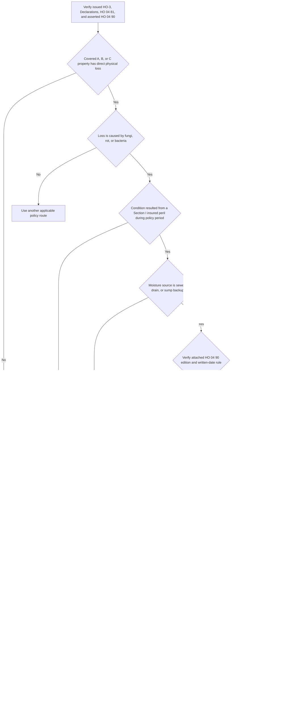

## Scope and issued-policy record

This page addresses the narrow **Section I property** route in **HO 04 81 Limited Fungi, Wet or Dry Rot, or Bacteria Coverage (2018-09)**. It is not a general mold or water-damage grant. Establish the issued policy record: the governing HO-3 edition, Declarations, endorsement schedule, and a compatible, attached HO 04 81. A repository form or a remediation observation does not establish attachment. HO 04 81 identifies itself as an HO-3 endorsement and expressly supplies limited coverage for a cause otherwise excluded by Section I Exclusions C.2. [HO 04 81 header](repo://forms/HO/MS/HO-04-81/2018-09.md#L1-L4)

The supplied HO 04 81 is a 2018-09 endorsement whose M.2 expressly refers to the 2018 form's P.2 and C.3. Do not apply those references, or the endorsement, to a 2011-05 policy without compatible issued-policy support: the supplied 2011-05 form does not contain the separately numbered P.2 or the C.3 continuous-or-repeated-leakage provision. [HO 04 81 M.2](repo://forms/HO/MS/HO-04-81/2018-09.md#L11-L17) · [HO-3 2011-05 exclusions](repo://forms/HO/MS/HO-3/2011-05.md#L57-L80) · [HO-3 2018-09 P.2 and C.3](repo://forms/HO/MS/HO-3/2018-09.md#L59-L64) [C.3](repo://forms/HO/MS/HO-3/2018-09.md#L83-L90)

## HO 04 81's limited C.2 write-back

**HO 04 81 M.1 writes back HO-3 2018-09 Section I Exclusions C.2** only to its stated extent. It supplies direct-physical-loss coverage for Coverage A, B, or C property caused by fungi, wet or dry rot, or bacteria only when that condition results from a Section I insured peril occurring during the policy period. It does not remove other gates: property scope, direct physical loss, the applicable cause-of-loss requirement (including P.2 for 2018 Coverage C), other exclusions, conditions, deductibles, settlement rules, and Declarations still apply. [HO 04 81 M.1 and all-other-provisions clause](repo://forms/HO/MS/HO-04-81/2018-09.md#L5-L10) · [HO-3 2018-09 A/B/C and D coverages](repo://forms/HO/MS/HO-3/2018-09.md#L23-L55) · [HO-3 2018-09 P.1-P.2](repo://forms/HO/MS/HO-3/2018-09.md#L59-L64)

**HO 04 81 M.2 preserves HO-3 2018-09 A.1, A.2, and C.3** for the fungi route. Moisture must have come from an event that was itself covered. M.2 gives a sudden-and-accidental plumbing discharge described in P.2, or water backup covered by an attached water-backup endorsement, as examples. It excludes this route when moisture came from flood, surface water, or subsurface water, and when it came from continuous or repeated leakage over weeks, months, or years. The observation of moisture, mold, or a remediation cost does not by itself establish the covered underlying event. [HO 04 81 M.2](repo://forms/HO/MS/HO-04-81/2018-09.md#L11-L17) · [HO-3 2018-09 A.1-A.2](repo://forms/HO/MS/HO-3/2018-09.md#L69-L74) · [HO-3 2018-09 C.3 and Definition 5](repo://forms/HO/MS/HO-3/2018-09.md#L19-L20) [C.3](repo://forms/HO/MS/HO-3/2018-09.md#L83-L90)

*The flow separates HO 04 81's C.2 write-back from the selected HO 04 90 A.3 write-back. A verified HO 04 90 edition can provide M.2's covered-backup example only after its own W.1 route and conditions are satisfied; W.6 applies only to the 2026-01 and 2027-01 branches when the premises has finished below-grade area.* [HO 04 81 M.1-M.5](repo://forms/HO/MS/HO-04-81/2018-09.md#L5-L31) · [HO 04 90 2010-10 W.1-W.5](repo://forms/HO/MS/HO-04-90/2010-10.md#L9-L29) · [HO 04 90 2026-01 W.1-W.6](repo://forms/HO/MS/HO-04-90/2026-01.md#L10-L51) · [HO 04 90 2027-01 W.1-W.6](repo://forms/HO/MS/HO-04-90/2027-01.md#L6-L48)

## Backup-related fungi: separate attachments and routes

A backup followed by fungi requires two independent attachment determinations and analyses. **HO 04 90 W.1 writes back HO-3 A.3** for the described sewer/drain backup or sump-related overflow/discharge direct physical loss. **HO 04 81 M.1 writes back HO-3 2018-09 C.2** for the resulting fungi condition. Neither write-back proves that the other endorsement is attached, and neither substitutes for its requirements. M.2's water-backup example applies only where the attached, selected HO 04 90 actually covers the backup. [HO-3 2018-09 A.3](repo://forms/HO/MS/HO-3/2018-09.md#L75-L77) · [HO 04 90 2010-10 W.1](repo://forms/HO/MS/HO-04-90/2010-10.md#L9-L12) · [HO 04 90 2026-01 W.1](repo://forms/HO/MS/HO-04-90/2026-01.md#L10-L15) · [HO 04 90 2027-01 W.1](repo://forms/HO/MS/HO-04-90/2027-01.md#L6-L11) · [HO-3 2018-09 C.2](repo://forms/HO/MS/HO-3/2018-09.md#L83-L89) · [HO 04 81 M.1-M.2](repo://forms/HO/MS/HO-04-81/2018-09.md#L5-L17)

Select a verified attached HO 04 90 independently from the HO-3 edition. The chain is prospective: 2010-10 remains in force for policies written under it but is replaced by 2026-01 from 2026-01-01; 2026-01 remains in force for policies written under it but is replaced by 2027-01 from 2027-01-01. Each selected edition governs loss adjustment under the policy written on its terms regardless of reporting date where its form says so. If attachment, edition, or policy-written date is unverified, do not use a repository copy to supply a backup route, deductible, limit, or condition. [HO 04 90 2010-10 status](repo://forms/HO/MS/HO-04-90/2010-10.md#L1-L7) · [HO 04 90 2026-01 status](repo://forms/HO/MS/HO-04-90/2026-01.md#L1-L8) · [HO 04 90 2027-01 replacement rule](repo://forms/HO/MS/HO-04-90/2027-01.md#L1-L4) · [policy assembly](../policy-editions-and-governing-forms.md#select-the-ho-04-90-endorsement-edition)

### Apply the selected HO 04 90 only to the backup route

Every verified HO 04 90 edition may supply the underlying backup route for M.2 **only after its own conditions are met**. W.4 preserves the HO-3 A.1 flood/surface-water and A.2 subsurface-water exclusions, and W.5 independently denies a backup that resulted from a known, unremedied failure to maintain the serving sewer line, drain, sump, or sump pump. Thus, a W.5 failure prevents the backup route; it is not an M.5 finding. Conversely, **HO 04 81 M.5** concerns the extent of fungi loss caused by failure to reasonably dry, clean, or otherwise mitigate a known or reasonably knowable intrusion; it does not replace W.5. [HO 04 90 2010-10 W.4-W.5](repo://forms/HO/MS/HO-04-90/2010-10.md#L21-L29) · [HO 04 90 2026-01 W.4-W.5](repo://forms/HO/MS/HO-04-90/2026-01.md#L29-L44) · [HO 04 90 2027-01 W.4-W.5](repo://forms/HO/MS/HO-04-90/2027-01.md#L25-L40) · [HO 04 81 M.5](repo://forms/HO/MS/HO-04-81/2018-09.md#L29-L31)

| Selected HO 04 90 edition | Backup-route controls and payment terms | Boundary from HO 04 81 |
| --- | --- | --- |
| **2010-10** | W.2 supplies a $5,000 default policy-period sublimit within the applicable A/B/C limits, W.3 supplies a $500 separate deductible, and W.6 states the A/B and Coverage C settlement rules. | These apply to loss under HO 04 90, not to HO 04 81's M.3 aggregate or M.5 allocation. |
| **2026-01** | W.2 supplies a $10,000 default policy-period sublimit and W.3 a $1,000 separate deductible. W.6 adds an eligibility condition when the premises has finished area below grade: an installed, operable backwater valve or equivalent device must be on the serving sewer line at loss. W.7 states settlement. | W.6 is not an HO 04 81 condition and does not apply to 2010-10. |
| **2027-01** | W.2 and W.3 retain the $10,000/$1,000 terms. W.6 retains the same conditional finished-below-grade device requirement, and W.7 states settlement. | Apply these terms only after selecting 2027-01; they do not alter the HO 04 81 fungi aggregate or mitigation rule. |

[HO 04 90 2010-10 W.2-W.6](repo://forms/HO/MS/HO-04-90/2010-10.md#L13-L35) · [HO 04 90 2026-01 W.2-W.7](repo://forms/HO/MS/HO-04-90/2026-01.md#L17-L58) · [HO 04 90 2027-01 W.2-W.7](repo://forms/HO/MS/HO-04-90/2027-01.md#L13-L55) · [HO 04 81 M.3-M.5](repo://forms/HO/MS/HO-04-81/2018-09.md#L19-L31)

## Aggregate, included costs, and mitigation

**HO 04 81 M.3** limits all loss under that endorsement in one policy period to **$10,000**, unless the Declarations show a higher limit. The limit is an aggregate across occurrences, claims, and locations and is part of—not additional to—the applicable A/B/C limits. Maintain one policy-period total for payments under HO 04 81 before authorizing additional fungi, rot, or bacteria amounts. **M.4** includes removal; necessary tear-out and replacement to gain access; post-removal testing to confirm absence; and attributable Coverage D loss of use within that aggregate. [HO 04 81 M.3-M.4](repo://forms/HO/MS/HO-04-81/2018-09.md#L19-L27)

Attributable Coverage D remains subject to the base Coverage D grant: the covered loss must make the residence premises unfit to live in, and payment is the reasonable necessary increase in living expenses for the shortest reasonably required repair-or-replacement time, within the Coverage D limit. It is not an additional living-expense grant outside M.3. [HO-3 2018-09 D.1-D.2](repo://forms/HO/MS/HO-3/2018-09.md#L51-L55) · [HO 04 81 M.3-M.4](repo://forms/HO/MS/HO-04-81/2018-09.md#L19-L27)

**M.5 applies a to-the-extent allocation.** Do not cover loss under the endorsement to the extent it resulted from the insured's failure to take reasonable steps to dry, clean, or otherwise mitigate water intrusion after the insured knew or reasonably should have known about it. Develop the knowledge date, reasonable available measures, actions taken, and incremental resulting loss. M.5 is separate from HO-3 C.1 neglect, which addresses reasonable means to save and preserve property at and after a loss. [HO 04 81 M.5](repo://forms/HO/MS/HO-04-81/2018-09.md#L29-L31) · [HO-3 2018-09 C.1](repo://forms/HO/MS/HO-3/2018-09.md#L83-L87)

## Operational file handling is not contract authority

The internal water-loss guide directs source-first documentation and specifies specialist-referral and reservation-of-rights practices. It is not part of a policy and must not be quoted to an insured or claimant; the issued policy and verified attachments govern contractual coverage. Use it as an operational workflow only. For a backup-related fungi file, retain source and entry-path evidence, issued forms and Declarations, each attachment and selected HO 04 90 edition, W.4/W.5 facts, later-edition W.6 evidence if triggered, the M.2 underlying-event analysis, mitigation timing, M.4 cost categories, and prior M.3 payments. [guide status and source-first instruction](repo://guidelines/claims/water-loss-handling.md#L1-L11) · [guide referral and reservation practices](repo://guidelines/claims/water-loss-handling.md#L51-L59)

## Focused review tests

1. **No verified HO 04 81:** C.2 remains applicable; do not infer the fungi endorsement from a mold estimate or an internal guide.
2. **Flood, subsurface water, or prolonged leakage followed by fungi:** apply M.2 and the preserved A.1, A.2, or C.3 barrier; M.1 does not cure the excluded underlying event.
3. **Backup followed by fungi:** independently verify HO 04 90 and HO 04 81. Select the HO 04 90 edition, complete its W.1, W.4, and W.5 analysis, and for 2026-01 or 2027-01 test W.6 when there is finished area below grade before relying on backup as M.2's covered event. Then apply M.3 and M.5 separately.
4. **Multiple fungi losses in one policy period:** locate all prior HO 04 81 payments across occurrences, claims, and locations before calculating the remaining M.3 aggregate.
5. **Known but delayed drying:** identify the incremental loss resulting from the failure and apply M.5 only to that extent; separately consider C.1.
6. **Injury or third-party property demand:** HO 04 81 M.6 preserves Section II; analyze the demand under the issued Section II grants and exclusions rather than as an M.1 payment. [HO 04 81 M.6](repo://forms/HO/MS/HO-04-81/2018-09.md#L33-L37) · [HO-3 2018-09 Section II](repo://forms/HO/MS/HO-3/2018-09.md#L115-L133)

For adjacent analyses, see [Loss of Use](../coverage-d/loss-of-use.md), [Water Damage and Backup](water-damage-and-backup.md), [Governing Form Editions and Policy Assembly](../policy-editions-and-governing-forms.md), and [Water-Loss Handling](../../operations/claims-water-loss-handling.md).
