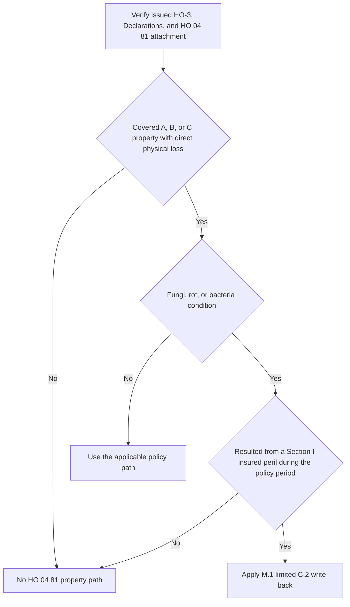
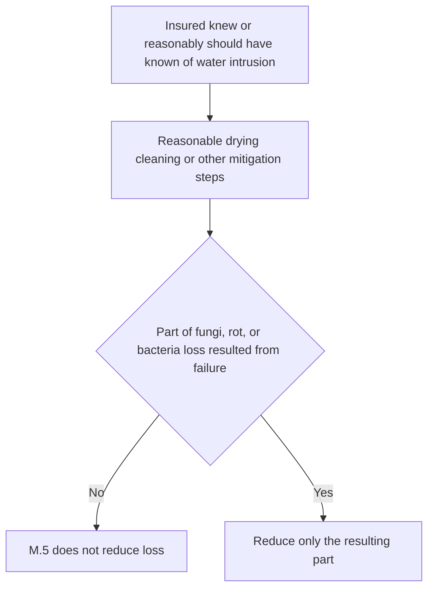

## Scope and attachment check

This page covers the narrow **Section I property** path in **HO 04 81 Limited Fungi, Wet or Dry Rot, or Bacteria Coverage (2018-09)**. It is not a stand-alone mold grant and it does not independently cover excluded water losses. Start with the issued policy: confirm the governing HO-3 edition, the Declarations, and the actual attached endorsement before treating HO 04 81 as available. The form attaches to HO-3 and provides limited coverage for a cause otherwise excluded by Section I — Exclusions C.2. [HO 04 81 attachment and scope](repo://forms/HO/MS/HO-04-81/2018-09.md#L1-L4) · [HO 04 81 M.1](repo://forms/HO/MS/HO-04-81/2018-09.md#L5-L10)

HO 04 81 is a write-back endorsement with its own conditions and limits. Its M.1 only removes C.2 **to the extent of the coverage provided here**; all other policy provisions still apply. Do not read the endorsement as a general override of the base policy, the Declarations, or other exclusions. [HO 04 81 M.1 and all-other-provisions clause](repo://forms/HO/MS/HO-04-81/2018-09.md#L5-L10) · [HO 04 81 M.6](repo://forms/HO/MS/HO-04-81/2018-09.md#L33-L37)

## Limited C.2 write-back

HO-3 2018-09 Section I Exclusion C.2 excludes loss caused by mold, wet or dry rot, deterioration, and related conditions. When HO 04 81 is attached, M.1 writes back that exclusion only for direct physical loss to property covered under Coverage A, B, or C caused by fungi, wet or dry rot, or bacteria, and only when the condition results from a Section I insured peril that occurred during the policy period. [HO-3 2018-09 C.2](repo://forms/HO/MS/HO-3/2018-09.md#L83-L89) · [HO 04 81 M.1](repo://forms/HO/MS/HO-04-81/2018-09.md#L5-L10)

That gate matters. The endorsement does not create independent coverage for a mold condition standing alone; the condition must trace back to a covered Section I peril within the policy period, and the claimed property must be within the applicable Coverage A, B, or C grant. For 2018 Coverage C, the named-peril requirement still matters. [HO-3 2018-09 A/B/C coverage](repo://forms/HO/MS/HO-3/2018-09.md#L23-L50) · [HO-3 2018-09 P.1–P.2](repo://forms/HO/MS/HO-3/2018-09.md#L59-L64) · [HO 04 81 M.1](repo://forms/HO/MS/HO-04-81/2018-09.md#L5-L10)

*The diagram shows the endorsement's limited property path and the required underlying-peril gate.* [HO 04 81 M.1](repo://forms/HO/MS/HO-04-81/2018-09.md#L5-L10)

## Underlying covered loss requirement and water-loss boundaries

For fungi, rot, or bacteria produced by water or moisture, M.2 requires that the water or moisture came from an event that was itself covered. The form gives a sudden and accidental plumbing discharge as one example, and also mentions water backup covered by an attached water-backup endorsement as another example of a covered moisture-producing event. The endorsement still does not independently cover flood, surface water, subsurface water, or long-duration leakage. [HO 04 81 M.2](repo://forms/HO/MS/HO-04-81/2018-09.md#L11-L17)

M.2 expressly preserves the water-loss exclusions that remove the underlying event from coverage entirely: flood or surface water under A.1, subsurface water under A.2, and continuous or repeated seepage or leakage over weeks, months, or years under C.3. HO 04 81 does not cure those exclusions; it only writes back C.2 to the stated extent and only after the underlying covered-loss requirement is satisfied. [HO 04 81 M.1–M.2](repo://forms/HO/MS/HO-04-81/2018-09.md#L5-L17) · [HO-3 2018-09 A.1–A.2](repo://forms/HO/MS/HO-3/2018-09.md#L69-L75) · [HO-3 2018-09 C.3](repo://forms/HO/MS/HO-3/2018-09.md#L83-L90)

For a leak or backup file, document source, onset, duration, knowledge, and remediation. A gradual or known-unremedied condition is not made covered simply because the mold was discovered later. The underlying event must still satisfy the base policy's insured-peril and exclusion analysis before the fungi condition can be evaluated under HO 04 81. [HO-3 2018-09 Definition 5](repo://forms/HO/MS/HO-3/2018-09.md#L19-L20) · [HO 04 81 M.2](repo://forms/HO/MS/HO-04-81/2018-09.md#L11-L17)

## Aggregate limit and included costs

M.3 sets the most payable for **all loss under HO 04 81 in any one policy period** at **$10,000**, unless the Declarations show a higher endorsement limit. This is a policy-period aggregate: it applies regardless of the number of occurrences, claims, or locations, and it is part of the Coverage A, B, and C limits rather than additional insurance. Keep a running policy-period total and determine the remaining aggregate before authorizing another payment. [HO 04 81 M.3](repo://forms/HO/MS/HO-04-81/2018-09.md#L19-L23)

That aggregate is broader than cleanup alone. M.4 says it includes the cost to remove the fungi, rot, or bacteria, the cost to tear out and replace building parts needed for access, post-removal testing to confirm absence, and any increase in Coverage D loss of use attributable to the fungi, rot, or bacteria. [HO 04 81 M.4](repo://forms/HO/MS/HO-04-81/2018-09.md#L25-L27)

The endorsement's aggregate is not the same as a per-occurrence payment rule. Even when a single occurrence generates several expenses, M.3 still operates as one policy-period cap for all HO 04 81 loss. When multiple claims or locations arise in the same term, accumulate prior payments against the aggregate before approving more. [HO 04 81 M.3](repo://forms/HO/MS/HO-04-81/2018-09.md#L19-L23)

## Coverage D interaction

HO 04 81 does not create a free-standing loss-of-use grant. Instead, M.4 adds any increase in Coverage D loss of use attributable to the fungi, rot, or bacteria to the endorsement limit, so the attributable amount is charged to M.3 as well as to the ordinary Coverage D analysis. [HO 04 81 M.4](repo://forms/HO/MS/HO-04-81/2018-09.md#L25-L27)

Coverage D still has to be satisfied on its own terms. Under HO-3 2018-09 D.1, a covered loss must make the residence premises not fit to live in, and the benefit is the reasonable increase in living expenses necessary to maintain the insured's normal standard of living for the shortest time reasonably required to repair or replace the premises. The D.2 limit also remains in force. HO 04 81 does not replace those gates; it only says an attributable D amount is included in the endorsement limit. [HO-3 2018-09 D.1–D.2](repo://forms/HO/MS/HO-3/2018-09.md#L51-L55) · [HO 04 81 M.4](repo://forms/HO/MS/HO-04-81/2018-09.md#L25-L27)

## Mitigation condition

M.5 is a separate endorsement condition. It denies loss under the endorsement to the extent it results from an insured's failure to take reasonable steps to dry, clean, or otherwise mitigate water intrusion after the insured knew or reasonably should have known of it. [HO 04 81 M.5](repo://forms/HO/MS/HO-04-81/2018-09.md#L29-L31)

Apply the stated **to the extent** allocation. Identify when the intrusion became known or reasonably knowable, what mitigation steps were available, what was done, and what part of the fungi, rot, or bacteria loss resulted from a failure. M.5 is distinct from the general neglect exclusion in C.1, which separately addresses failure to use reasonable means to save and preserve property at and after a loss. [HO 04 81 M.5](repo://forms/HO/MS/HO-04-81/2018-09.md#L29-L31) · [HO-3 2018-09 C.1](repo://forms/HO/MS/HO-3/2018-09.md#L83-L87)

*The diagram shows M.5's allocation rule, not a blanket denial.* [HO 04 81 M.5](repo://forms/HO/MS/HO-04-81/2018-09.md#L29-L31)

## Section II is unchanged

HO 04 81 provides Section I property coverage only. It does not provide, extend, or modify Section II liability coverage for bodily injury or property damage arising out of fungi, rot, or bacteria. Related injury or third-party property-damage demands must be analyzed under the issued HO-3 Section II grants and exclusions, not as an HO 04 81 benefit. [HO 04 81 M.6](repo://forms/HO/MS/HO-04-81/2018-09.md#L33-L37) · [HO-3 2018-09 Section II grants](repo://forms/HO/MS/HO-3/2018-09.md#L115-L124) · [HO-3 2018-09 Section II exclusions](repo://forms/HO/MS/HO-3/2018-09.md#L127-L133)

## Focused review tests

1. **Mold with no verified HO 04 81 attachment:** C.2 remains in force; do not infer the endorsement from a remediation estimate or other noncontract evidence.
2. **Flood, surface water, subsurface water, or long-duration leakage followed by fungi:** apply M.2 with A.1, A.2, or C.3. The M.1 C.2 write-back does not cure the excluded underlying source or duration.
3. **Backup followed by fungi:** verify the base HO-3 edition and the actual attached water-backup endorsement, then verify HO 04 81. Treat the backup claim and the resulting fungi claim as separate analyses with separate attachment and limit questions.
4. **Multiple fungi claims in one term:** find all prior HO 04 81 payments across occurrences, claims, and locations before calculating the remaining M.3 aggregate.
5. **Delayed drying after a known intrusion:** determine the incremental loss caused by the failure and apply M.5 only to that extent, while separately considering C.1.
6. **Relocation or injury demand:** test attributable loss of use under D.1 and M.4/M.3; send bodily-injury and third-party-property-damage demands to the Section II analysis that M.6 leaves unchanged.

For adjacent analyses, see [Coverage D — Loss of Use](/openwiki/coverage/coverage-d/loss-of-use.md), [Section I Property Perils and General Exclusions](/openwiki/coverage/property/perils-and-general-exclusions.md), [Water Damage Exclusions and Water Backup Write-Back](/openwiki/coverage/property/water-damage-and-backup.md), and [Water-Loss Handling](/openwiki/operations/claims-water-loss-handling.md).
