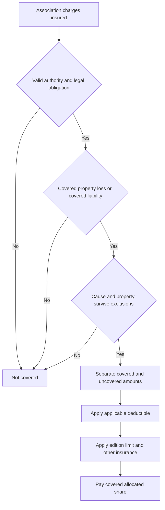

# Loss Assessment Coverage

## Scope and governing edition

**HO 04 35 is an endorsement, not a standalone policy.** It applies only while attached, and its terms control over a conflicting policy provision; nonconflicting policy terms and exclusions continue to apply. The endorsement is tagged to the **HO-6** line in both supplied editions. The 2014-04 form is marked superseded by the 2023-02 form for policies effective on or after February 1, 2023, but remains in force for policies written under it. Therefore:

- **HO 04 35 (2014-04)** governs an HO-6 policy written under the 2014-04 edition; its maximum is **$10,000**.
- **HO 04 35 (2023-02)** governs an HO-6 policy effective on or after **2023-02-01** when that endorsement is attached; its maximum is **$25,000**.
- Do not substitute the later form for an older policy. The governing form is the edition attached to the policy and applicable at the time of loss. [2014-04 attachment and supersession](repo://forms/HO/MS/HO-04-35/2014-04.md#L1-L9) [2023-02 attachment and effective date](repo://forms/HO/MS/HO-04-35/2023-02.md#L1-L7)

The source metadata identifies these HO 04 35 editions as HO-6 endorsements, not HO-3 endorsements. The HO-3 provisions below are therefore a comparison of base-form assessment and liability mechanics, not evidence that this particular endorsement automatically attaches to HO-3.

## How to evaluate an assessment

An assessment is not covered merely because an association issued it. First identify the policy and endorsement edition, then establish the association’s authority, the insured’s ownership or tenancy interest, the event and date, the property or liability involved, the covered portion, and the amount allocated to the insured. The endorsement then applies its limit, deductible, other-insurance, recovery, and exclusion rules.

*This flow summarizes the authority, trigger, exclusion, allocation, deductible, and limit sequence in HO 04 35.* [2014-04 coverage and payment rules](repo://forms/HO/MS/HO-04-35/2014-04.md#L35-L101) [2023-02 coverage and payment rules](repo://forms/HO/MS/HO-04-35/2023-02.md#L41-L139)

## Edition comparison

| Issue | 2014-04 | 2023-02 |
|---|---|---|
| Covered property trigger | The assessment must result from covered direct physical loss to association property, or from a liability claim against the association arising from an occurrence to which liability coverage applies. The assessment must be charged during the policy period. | The assessment may result from direct physical loss to **Collective Property**, including a master-policy deductible, or from association liability for **Property Damage** arising from a covered occurrence. |
| Limit | **$10,000** maximum for all amounts payable under Loss Assessment Coverage. The limit is not increased by multiple insureds or claims. | **$25,000** maximum for covered loss assessments. Payment reduces what remains available for later payment. |
| Deductible | The applicable policy deductible applies to a covered assessment and is applied once to an assessment arising from the same covered loss or liability claim. | The applicable policy deductible is subtracted from the covered loss assessment; it is applied only to the covered amount and before payment. No dollar amount is supplied by HO 04 35 itself. |
| Allocation and recovery | Payment is limited to the insured’s share; amounts recovered or recoverable elsewhere reduce payment. | Payment is limited to the amount properly allocated to the insured; other legally available recovery reduces payment, and payment does not increase the limit. |

The 2014-04 limit and aggregation rules are in its W.2 provision; its deductible rule is in W.3. [2014-04 limit](repo://forms/HO/MS/HO-04-35/2014-04.md#L135-L151) [2014-04 deductible](repo://forms/HO/MS/HO-04-35/2014-04.md#L193-L231)

The 2023-02 limit and aggregation rules are in its W.2 provision; its deductible rule is in W.3. [2023-02 limit](repo://forms/HO/MS/HO-04-35/2023-02.md#L141-L163) [2023-02 deductible](repo://forms/HO/MS/HO-04-35/2023-02.md#L203-L243)

## What is covered

### 2014-04

The 2014-04 endorsement covers the insured’s allocated share of an assessment imposed by an authorized association. It recognizes two independent routes: an assessment for covered direct physical loss to association-owned, controlled, or maintained property, and an assessment arising from a liability claim against the association. The assessment must be validly authorized, based on an actual rather than projected or speculative loss, and properly charged to the insured. The form also covers an association deductible when the deductible results from a covered loss and the association’s property insurance applies; it can cover a covered loss even when the association has no insurance, but the underlying cause must still be covered. [2014-04 W.1-W.16](repo://forms/HO/MS/HO-04-35/2014-04.md#L35-L67)

The 2014-04 form pays only the covered portion and only the insured’s share. It can pay the association, the insured, or another entitled person, and reduces payment for duplicate or available recovery. [2014-04 W.27-W.33](repo://forms/HO/MS/HO-04-35/2014-04.md#L87-L101)

### 2023-02

The 2023-02 endorsement covers an assessment legally charged to the insured as an owner or tenant. Its property route is tied to accidental direct physical loss to **Collective Property** caused by a Covered Cause of Loss. It expressly covers an assessment for a deductible under an association Master Policy when the deductible is charged to the insured. Its liability route covers the insured’s share of an assessment for Property Damage for which the association is legally liable, including an assessment arising from a judgment, settlement, or expense, when the damage results from a covered occurrence. [2023-02 W.1-W.14](repo://forms/HO/MS/HO-04-35/2023-02.md#L41-L69)

The 2023-02 form pays only the amount properly allocated to the insured, requires a lawful and enforceable assessment, and allows allocation of mixed covered and uncovered charges. An assessment must be formally imposed; an anticipated or speculative charge is not enough. [2023-02 W.15-W.16 and W.28-W.29](repo://forms/HO/MS/HO-04-35/2023-02.md#L71-L73) [2023-02 W.40-W.43](repo://forms/HO/MS/HO-04-35/2023-02.md#L115-L121)

The 2023-02 form separately addresses a master-policy deductible and permits payment to the association, the insured, or another legally entitled person. The deductible is applied only once to an assessment arising from the same covered loss or liability claim under that edition. [2023-02 deductible assessment provisions](repo://forms/HO/MS/HO-04-35/2023-02.md#L57-L69) [2023-02 payment and deductible provisions](repo://forms/HO/MS/HO-04-35/2023-02.md#L87-L101)

## Triggers, timing, and proof

For both editions, the trigger is the **assessment**, not merely the underlying damage. The association must have authority to assess, the charge must be enforceable against the insured, the insured’s ownership or tenancy interest must be the basis for the charge, and the charge must be connected to a covered loss or covered liability. Both editions require prompt notice and supporting assessment records. The 2014-04 form requires notice after learning of a potentially covered assessment and records showing its basis, amount, and allocation. [2014-04 notice and proof duties](repo://forms/HO/MS/HO-04-35/2014-04.md#L71-L81) [2014-04 special requirements](repo://forms/HO/MS/HO-04-35/2014-04.md#L487-L517)

The 2023-02 form requires prompt notice, the assessment statement and related records, proof of the association’s authority and allocation, and evidence connecting the assessment to a covered cause or covered liability. It also requires notice if the assessment is revised, withdrawn, reduced, increased, or reallocated. [2023-02 notice and proof duties](repo://forms/HO/MS/HO-04-35/2023-02.md#L109-L121) [2023-02 conditions](repo://forms/HO/MS/HO-04-35/2023-02.md#L367-L419)

The insured must protect association property from further damage when relevant, cooperate with investigation and settlement, preserve evidence, and avoid voluntary payment, assumption of obligation, or expense without consent except for reasonable protective measures. Those operational duties are contract conditions, not a promise that the assessment is covered. [2014-04 conditions](repo://forms/HO/MS/HO-04-35/2014-04.md#L355-L385) [2023-02 conditions](repo://forms/HO/MS/HO-04-35/2023-02.md#L367-L399)

## Deductible and payment calculation

Neither HO 04 35 edition states a numeric deductible. Each points to the applicable policy deductible. For 2014-04, the deductible applies to a covered assessment, is borne by the insured, applies once to the same covered loss or liability claim, and applies to the insured’s legally responsible amount. [2014-04 W.3](repo://forms/HO/MS/HO-04-35/2014-04.md#L193-L217)

For 2023-02, the deductible is applied after determining what is covered but before determining payment, only to the covered assessment amount. It is not applied to uncovered charges, does not disappear because someone else pays the assessment, and is applied to a revised assessment if the charge changes. [2023-02 W.3](repo://forms/HO/MS/HO-04-35/2023-02.md#L203-L231)

A practical calculation is: **covered assessment allocated to the insured − applicable deductible = payable amount, limited by the edition’s remaining limit and reduced by legally available recovery**. Do not deduct from an excluded or otherwise nonpayable charge, and do not treat the association’s master-policy deductible as automatically the insured’s HO 04 35 deductible. The two concepts are distinct: the 2023-02 form can cover the association’s master-policy deductible as an assessment, then separately applies the applicable policy deductible to the covered assessment. [2023-02 master-policy deductible and policy deductible](repo://forms/HO/MS/HO-04-35/2023-02.md#L57-L59) [2023-02 W.3](repo://forms/HO/MS/HO-04-35/2023-02.md#L203-L215)

## Exclusions and preserved base-form limits

Both editions exclude ordinary maintenance and improvement charges, wear or deterioration, defective design or workmanship, intentional or criminal conduct, fines and penalties, contractual-only obligations, and charges not tied to authorized association property or covered liability. The 2014-04 edition additionally states exclusions for excluded causes such as flood and surface water, earth movement, ordinance-or-law costs, pollutants, fungi and microbial matter, repeated seepage, sewer or drain backup, and association financial or insurance shortfalls. [2014-04 coverage exclusions](repo://forms/HO/MS/HO-04-35/2014-04.md#L103-L121) [2014-04 remaining exclusions](repo://forms/HO/MS/HO-04-35/2014-04.md#L235-L353)

The 2023-02 edition likewise excludes flood and surface water, earth movement, sewer or sump backup, below-ground water, freezing-related loss, utility failure, defective construction or maintenance, settling and structural movement, pollutants, microbial matter, animals, war, nuclear hazard, governmental action, collapse except as otherwise covered, ordinance or law, business and commercial use, land loss, repeated leakage, and other listed causes. It also excludes assessments for reserves, operating expenses, upgrades, association insurance failure, contractual obligations, governance disputes, fines, interest, and other non-loss charges. [2023-02 coverage exclusions](repo://forms/HO/MS/HO-04-35/2023-02.md#L77-L107) [2023-02 remaining exclusions](repo://forms/HO/MS/HO-04-35/2023-02.md#L245-L365)

**Acting-document-first relationship:** HO 04 35 (2014-04) **modifies** the attached policy’s assessment coverage by supplying its own assessment triggers, $10,000 limit, and deductible rule; the 2014-04 endorsement **preserves** policy exclusions unless it expressly provides otherwise. HO 04 35 (2023-02) **modifies** the attached policy’s assessment coverage by supplying its own Collective Property, master-policy-deductible, liability-assessment, $25,000-limit, and deductible provisions; the 2023-02 endorsement **preserves** policy exclusions unless it expressly provides otherwise. [2014-04 precedence and preserved provisions](repo://forms/HO/MS/HO-04-35/2014-04.md#L13-L33) [2023-02 precedence and preserved provisions](repo://forms/HO/MS/HO-04-35/2023-02.md#L13-L39)

## Base-form interaction: HO-6 and HO-3

### HO-6

The HO-6 2014-04 base form already provides a **$1,000** additional loss-assessment coverage for covered direct physical loss to association property, requires evidence, and excludes assessments imposed because of an insured’s liability or breach of contract. The HO-6 2014-04 base provision does not state a liability-assessment grant or a deductible for that base assessment. [HO-6 2014-04 E.25-E.31](repo://forms/HO/MS/HO-6/2014-04.md#L483-L495)

**Acting-document-first relationship:** HO 04 35 (2014-04) **modifies** HO-6 2014-04 E.25-E.31 by replacing the base $1,000 property-assessment treatment with the endorsement’s covered property and liability-assessment rules and its $10,000 limit; the endorsement **preserves** the other attached-policy terms except where they conflict. Do not use the HO-6 base $1,000 amount when HO 04 35 2014-04 is attached. [HO 04 35 2014-04 coverage and limit](repo://forms/HO/MS/HO-04-35/2014-04.md#L35-L69) [HO 04 35 2014-04 limit](repo://forms/HO/MS/HO-04-35/2014-04.md#L135-L149)

The HO-6 2023-02 base form provides a **$2,000** additional coverage for assessments arising from covered direct physical loss to association property and for liability arising from covered bodily injury or property damage, and says the coverage does not reduce Coverage C. It requires a lawful demand and supporting records and excludes maintenance, excluded causes, association fund shortages, fines, rule violations, and pre- or post-interest losses. [HO-6 2023-02 E.21-E.32](repo://forms/HO/MS/HO-6/2023-02.md#L410-L432)

**Acting-document-first relationship:** HO 04 35 (2023-02) **modifies** HO-6 2023-02 E.21-E.32 by replacing the base $2,000 assessment limit and base trigger wording with the endorsement’s $25,000 limit, Collective Property and master-policy-deductible treatment, and detailed property-damage liability route. The endorsement **preserves** the HO-6 policy’s other exclusions and conditions unless they conflict with the endorsement. [HO 04 35 2023-02 coverage and limit](repo://forms/HO/MS/HO-04-35/2023-02.md#L41-L69) [HO 04 35 2023-02 limit](repo://forms/HO/MS/HO-04-35/2023-02.md#L141-L149)

The endorsement’s liability-assessment coverage is not the same as the base policy’s ordinary Coverage E promise to pay an insured’s damages or defend a suit. HO-6 Coverage E addresses damages for which the insured is legally liable because of bodily injury or property damage caused by an occurrence; HO 04 35 addresses an association’s assessment charged to the insured. Payment under HO 04 35 does not create a duty to defend the association. [HO-6 2014-04 Coverage E](repo://forms/HO/MS/HO-6/2014-04.md#L1133-L1143) [HO-6 2023-02 Coverage E](repo://forms/HO/MS/HO-6/2023-02.md#L1004-L1018) [HO 04 35 2023-02 no association defense duty](repo://forms/HO/MS/HO-04-35/2023-02.md#L428-L432)

### HO-3 comparison

The supplied HO-3 2024-03 base form provides only **$2,000** of additional loss-assessment coverage, only for direct loss to property owned by the corporation or association, only when caused by a peril insured against under Coverage A, and applies the deductible for the direct property loss. [HO-3 2024-03 E.23-E.27](repo://forms/HO/MS/HO-3/2024-03.md#L457-L465)

HO-3 Coverage E separately pays an insured’s damages for bodily injury or property damage caused by an occurrence and provides a defense for a covered suit. That ordinary liability grant is not itself an assessment grant. [HO-3 2024-03 Coverage E](repo://forms/HO/MS/HO-3/2024-03.md#L1023-L1035)

**Acting-document-first relationship:** the applicable HO 04 35 edition would **modify** a conflicting base assessment provision by controlling its own assessment scope, limit, deductible, and conditions; it would **preserve** the HO-3 Coverage E exclusions and defense structure unless the endorsement expressly changed them. Because the supplied HO 04 35 metadata identifies the endorsement as HO-6, confirm the declarations and attached-form schedule before applying this comparison to an HO-3 policy.

## State-overlay interaction

State amendatory forms in the supplied corpus are separate **HO-3** documents, not HO-6 versions of HO 04 35. They may rename the policy field or limit used for assessment coverage and add documentation requirements, but their wording says the named limit applies only as stated in the policy. The state overlay therefore does not, by itself, supply the HO 04 35 2014-04 or 2023-02 dollar limit.

Examples:

- Florida HO 01 09 (2023-07) says the “loss assessment additional coverage limit” applies as stated in the policy and does not alter loss-assessment conditions. [Florida amendatory form identity and line](repo://forms/HO/FL/HO-01-09/2023-07.md#L1-L9) [Florida assessment provision](repo://forms/HO/FL/HO-01-09/2023-07.md#L695-L703)
- California HO 01 04 (2021-06) says the “special assessment limit” applies to covered assessments the insured is legally obligated to pay and requires assessment documents. [California amendatory form identity and line](repo://forms/HO/CA/HO-01-04/2021-06.md#L1-L9) [California assessment provision](repo://forms/HO/CA/HO-01-04/2021-06.md#L749-L757)
- Texas HO 01 45 (2022-01) limits the “special assessment limit” to a covered assessment arising from a covered loss and requires supporting information. [Texas amendatory form identity and line](repo://forms/HO/TX/HO-01-45/2022-01.md#L1-L9) [Texas assessment provision](repo://forms/HO/TX/HO-01-45/2022-01.md#L719-L727)
- Illinois HO 01 12 (2015-02) applies its “special assessment limit” only to a covered assessment imposed on an insured and requires supporting records. [Illinois amendatory form identity and line](repo://forms/HO/IL/HO-01-12/2015-02.md#L1-L9) [Illinois assessment provision](repo://forms/HO/IL/HO-01-12/2015-02.md#L675-L687)
- Louisiana HO 01 17 (2020-09) applies an “association assessment limit” only when the assessment results from a covered cause of loss and requires documentation. [Louisiana amendatory form identity and line](repo://forms/HO/LA/HO-01-17/2020-09.md#L1-L9) [Louisiana assessment provision](repo://forms/HO/LA/HO-01-17/2020-09.md#L733-L745)
- North Carolina HO 01 32 (2018-05) applies its “special assessment limit” to covered assessments imposed on an insured and requires records showing the assessment and obligation to pay. [North Carolina amendatory form identity and line](repo://forms/HO/NC/HO-01-32/2018-05.md#L1-L9) [North Carolina assessment provision](repo://forms/HO/NC/HO-01-32/2018-05.md#L733-L745)
- Colorado HO 01 05 (2022-10) applies its “association assessment limit” to a covered assessment imposed by an association and requires documents supporting the assessment and responsibility. [Colorado amendatory form identity and line](repo://forms/HO/CO/HO-01-05/2022-10.md#L1-L9) [Colorado assessment provision](repo://forms/HO/CO/HO-01-05/2022-10.md#L771-L783)

**Acting-document-first relationship:** the attached state amendatory form **modifies** the HO-3 policy’s applicable assessment terminology, conditions, or limit field only to the extent its text says so; it **preserves** HO 04 35’s edition-specific limit and trigger when HO 04 35 is the attached acting endorsement and the state form does not conflict. If a state form actually conflicts with an endorsement or mandatory law, use the attached policy assembly and applicable law; do not infer a state-specific dollar amount from the label alone.

## Claim-handling checklist

1. Identify the attached HO 04 35 edition and the base form line; do not assume 2023-02 applies to an older policy.
2. Obtain the association’s written assessment, governing authority, allocation method, property or liability basis, event date, and any master-policy deductible notice.
3. Separate covered direct physical loss, covered association liability, maintenance, betterment, reserves, fines, interest, and other excluded or nonpayable charges.
4. Confirm the applicable policy deductible, apply it only as the governing HO 04 35 edition requires, then apply the remaining edition limit and available recovery.
5. Preserve records, damaged property, and recovery rights; report promptly and do not make an unauthorized voluntary payment or settlement.

The customer FAQ’s operational guidance is consistent with this workflow: an association assessment is not automatically covered, and the reason for the assessment and property or loss involved must be identified before discussing payment. [Customer FAQ on association assessments](repo://training/customer-faq-homeowners.md#L729-L735) [Customer FAQ on claim records and cooperation](repo://training/customer-faq-homeowners.md#L121-L139)
