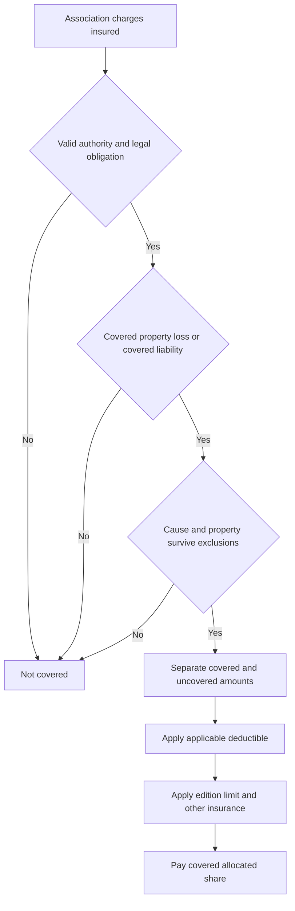

# Loss Assessment Coverage

## Scope and governing document

**HO 04 35 is an attached endorsement, not a standalone policy.** It modifies the policy only while attached. A conflicting endorsement provision controls, while nonconflicting policy terms, conditions, and exclusions continue to apply. The supplied editions are identified as **HO-6** endorsements: 2014-04 is superseded by 2023-02 for policies effective on or after **2023-02-01**, while 2014-04 remains applicable to policies written under it. Apply the form and endorsement actually attached to the policy and in force at the time of loss; do not backdate the later wording. [2014-04 attachment, line, and supersession](repo://forms/HO/MS/HO-04-35/2014-04.md#L1-L9) [2014-04 precedence and unchanged terms](repo://forms/HO/MS/HO-04-35/2014-04.md#L13-L33) [2023-02 attachment, line, and effective date](repo://forms/HO/MS/HO-04-35/2023-02.md#L1-L7) [2023-02 precedence and unchanged terms](repo://forms/HO/MS/HO-04-35/2023-02.md#L13-L39)

- **HO 04 35 (2014-04):** when attached to the applicable policy, its maximum Loss Assessment Coverage limit is **$10,000**. [2014-04 limit](repo://forms/HO/MS/HO-04-35/2014-04.md#L135-L151)
- **HO 04 35 (2023-02):** when attached to the applicable policy, its maximum is **$25,000**. The 2023-02 form is effective 2023-02-01, and payments reduce what remains available for later payment. [2023-02 limit](repo://forms/HO/MS/HO-04-35/2023-02.md#L141-L163)

## Four separate questions in a condominium gap

An association's assessment is not covered merely because the association issued a notice or because a master policy responded to damage. The condominium declaration, master policy, unit-owner policy, and assessment records may assign different responsibility for the same item. The training material is useful for recognizing that gap: it directs the reviewer to identify who owns the damaged property, who must repair it, which policy insures it, and whether a deductible or assessment creates a separate owner obligation. It is operational guidance, not a coverage grant. [Condominium gap learning objectives](repo://training/condo-master-policy-gap.md#L15-L39) [Condominium document-review guidance](repo://training/condo-master-policy-gap.md#L61-L71) [Condominium quick-reference warning](repo://training/condo-master-policy-gap.md#L755-L761)

Keep these questions separate:

1. **Association responsibility:** What do the declaration, governing documents, and master policy make the association own, insure, maintain, or repair? That question does not by itself establish the unit owner's HO-6 coverage. [Condominium responsibility guidance](repo://training/condo-master-policy-gap.md#L117-L139) [HO-6 2023-02 Coverage A boundary](repo://forms/HO/MS/HO-6/2023-02.md#L78-L120)
2. **Unit-owner property:** Is the damaged item property owned by the association or collectively owned, or is it owned solely by the unit owner? Under 2023-02 HO 04 35, loss to property that is not Collective Property, including property owned solely by the insured, is excluded; the 2014-04 endorsement likewise limits the covered loss to association property and excludes loss to property outside the association's responsibility. [2014-04 covered property and property boundary](repo://forms/HO/MS/HO-04-35/2014-04.md#L43-L55) [2014-04 property exclusion](repo://forms/HO/MS/HO-04-35/2014-04.md#L111-L121) [2023-02 Collective Property and property exclusion](repo://forms/HO/MS/HO-04-35/2023-02.md#L49-L55) [2023-02 property exclusion](repo://forms/HO/MS/HO-04-35/2023-02.md#L71-L77)
3. **Covered cause or liability:** Is there covered direct physical loss to the relevant association or collective property, or a covered association liability event? The assessment label cannot substitute for the cause-of-loss and exclusion analysis. [2014-04 covered loss and liability routes](repo://forms/HO/MS/HO-04-35/2014-04.md#L45-L67) [2023-02 covered loss and liability routes](repo://forms/HO/MS/HO-04-35/2023-02.md#L49-L69) [2023-02 exclusions](repo://forms/HO/MS/HO-04-35/2023-02.md#L245-L365)
4. **Assessment obligation:** Is the charge legally authorized, enforceable against this insured as an owner or tenant, and properly allocated to that insured? A demand, anticipated charge, voluntary contribution, or charge for another member does not satisfy the applicable form's obligation and allocation rules. [2014-04 authority, actual loss, and allocation](repo://forms/HO/MS/HO-04-35/2014-04.md#L55-L67) [2014-04 authority and ownership records](repo://forms/HO/MS/HO-04-35/2014-04.md#L487-L517) [2023-02 legal charge, allocation, and ownership interest](repo://forms/HO/MS/HO-04-35/2023-02.md#L43-L73) [2023-02 ownership and written-demand requirements](repo://forms/HO/MS/HO-04-35/2023-02.md#L461-L477)

*Caption: This assessment flow separates authority and obligation from property responsibility, covered cause, exclusions, allocation, deductible, limit, and recovery.* [2014-04 coverage and payment rules](repo://forms/HO/MS/HO-04-35/2014-04.md#L35-L101) [2023-02 coverage and payment rules](repo://forms/HO/MS/HO-04-35/2023-02.md#L41-L139)

The condominium training reinforces the investigation sequence but cannot change the contract. Use it to identify missing facts and request records; use the attached HO 04 35 and base form to decide coverage. [Guidance and contract distinction](repo://training/guidance-versus-contract.md#L15-L23) [Guidance cannot change the contract](repo://training/guidance-versus-contract.md#L73-L103) [Assessment-limit guidance](repo://training/guidance-versus-contract.md#L685-L691)

## Edition comparison

| Issue | HO 04 35 (2014-04) | HO 04 35 (2023-02) |
|---|---|---|
| Assessment trigger | An assessment charged during the policy period may arise from covered direct physical loss to association property or from an association liability claim arising from an occurrence to which liability coverage applies. | A Loss Assessment must arise from a covered cause of loss or covered liability. The property route is Direct Physical Loss to Collective Property; the liability route is Property Damage for which the Association is legally liable and that results from an applicable Occurrence. |
| Association deductible | Covers the insured's share of an association deductible when it results from a covered loss and the association's property insurance applies. | Expressly covers an assessment for a Deductible under a Master Policy insuring Collective Property when the covered loss causes the deductible and the Association charges it to the insured. |
| Limit | **$10,000** maximum; payments reduce the remaining amount, and the limit does not increase for multiple insureds, claims, or interests. | **$25,000** maximum; payment reduces the amount available for later payment and the limit does not increase for multiple insureds, claims, assessments, members, or Associations. |
| Deductible | The applicable policy deductible applies to a covered assessment, once for an assessment arising from the same covered loss or liability claim. | The applicable policy deductible is applied only to the covered Loss Assessment amount, before payment; the endorsement states no numeric deductible. |
| Allocation and recovery | Pays no more than the insured's covered share and reduces payment for amounts recovered or recoverable elsewhere. | Pays no more than the portion properly allocated to the insured and reduces payment for legally available recovery. |

The comparison table is a summary of the exact provisions, not a substitute for the attached endorsement. [2014-04 coverage and payment](repo://forms/HO/MS/HO-04-35/2014-04.md#L35-L101) [2014-04 limit](repo://forms/HO/MS/HO-04-35/2014-04.md#L135-L151) [2014-04 deductible](repo://forms/HO/MS/HO-04-35/2014-04.md#L193-L231) [2023-02 coverage and payment](repo://forms/HO/MS/HO-04-35/2023-02.md#L41-L139) [2023-02 limit](repo://forms/HO/MS/HO-04-35/2023-02.md#L141-L163) [2023-02 deductible](repo://forms/HO/MS/HO-04-35/2023-02.md#L203-L231)

## What each HO 04 35 edition covers

### 2014-04

The 2014-04 endorsement covers the insured's allocated share of an assessment imposed by an authorized association. It has two routes: covered direct physical loss to property owned, controlled, or maintained by the association, and an association liability claim arising from an occurrence during the policy period. It also covers an association deductible when the deductible results from a covered loss and the association's property insurance applies. The association's loss may be covered even if the association has no insurance, but the underlying cause must still be covered. [2014-04 W.1-W.16](repo://forms/HO/MS/HO-04-35/2014-04.md#L35-L67)

The assessment must be based on an actual loss, expense, obligation, or liability; it cannot be projected or speculative. The association must have authority to impose it, determine the amount chargeable to the insured, and allocate the insured's share. Mixed covered and uncovered charges are separated, and payment is limited to the covered portion and the insured's share. [2014-04 authority and actual-loss requirements](repo://forms/HO/MS/HO-04-35/2014-04.md#L55-L67) [2014-04 allocation and recovery](repo://forms/HO/MS/HO-04-35/2014-04.md#L87-L101)

### 2023-02

The 2023-02 endorsement covers a Loss Assessment legally charged to an owner or tenant. Its property route requires accidental Direct Physical Loss to Collective Property caused by a Covered Cause of Loss. It expressly covers an assessment for a Deductible under an Association Master Policy when that deductible is charged to the insured. Its liability route covers the insured's share of an assessment for Property Damage for which the Association is legally liable, including an assessment arising from a judgment, settlement, or expense, when the damage results from an applicable Occurrence. [2023-02 W.1-W.14](repo://forms/HO/MS/HO-04-35/2023-02.md#L41-L69)

The form pays only the amount properly allocated to the insured and requires a lawful, enforceable assessment. An anticipated or speculative charge is not enough: the assessment must be imposed against the insured, and the form requires a written demand before payment. Mixed charges must be separately identified so the covered property-loss portion can be determined. [2023-02 legal obligation and allocation](repo://forms/HO/MS/HO-04-35/2023-02.md#L71-L77) [2023-02 limit and allocation provisions](repo://forms/HO/MS/HO-04-35/2023-02.md#L141-L177) [2023-02 written-demand and mixed-charge provisions](repo://forms/HO/MS/HO-04-35/2023-02.md#L183-L199) [2023-02 special requirements](repo://forms/HO/MS/HO-04-35/2023-02.md#L461-L477)

## Condominium master-policy gaps

A master policy can respond to association or collective property while leaving a unit owner with a separate financial obligation. The training identifies the practical gap: the damaged property, repair responsibility, unit improvements, personal property, master-policy deductible, and owner assessment are related but not interchangeable questions. Review the declaration, bylaws, master policy, unit-owner policy, and written assessment together; do not infer a result from the word “master” or from the location of the damage. [Condominium gap concepts](repo://training/condo-master-policy-gap.md#L61-L95) [Condominium deductible and assessment concepts](repo://training/condo-master-policy-gap.md#L141-L179) [Condominium quick reference](repo://training/condo-master-policy-gap.md#L755-L761)

For a 2023-02 HO 04 35 review, a master-policy deductible is potentially within the endorsement only when it is charged to the insured by the Association and the underlying Direct Physical Loss to Collective Property was caused by a Covered Cause of Loss. The endorsement does not cover a deductible for property outside Collective Property, an excluded cause, or a charge that is not legally imposed on the insured. [2023-02 Master Policy deductible route](repo://forms/HO/MS/HO-04-35/2023-02.md#L49-L61) [2023-02 property and deductible exclusions](repo://forms/HO/MS/HO-04-35/2023-02.md#L71-L81) [2023-02 written assessment and ownership requirements](repo://forms/HO/MS/HO-04-35/2023-02.md#L461-L477)

For 2014-04, the association deductible route is narrower in wording: the deductible must result from a covered loss and the association's property insurance must apply. The endorsement also excludes an assessment attributable to an association's deductible or retained amount when the loss is not covered. [2014-04 association deductible grant](repo://forms/HO/MS/HO-04-35/2014-04.md#L61-L67) [2014-04 deductible and excluded-loss provisions](repo://forms/HO/MS/HO-04-35/2014-04.md#L193-L231) [2014-04 deductible exclusion](repo://forms/HO/MS/HO-04-35/2014-04.md#L235-L251)

Do not collapse the master-policy damage and the owner's assessment into one claim. Establish: (a) what the association owns or is responsible to insure; (b) what property is solely the unit owner's; (c) what cause or liability route is covered; and (d) what amount the governing documents legally allocate to this insured. The training's purpose is to expose those missing questions, while the HO 04 35 wording controls the result. [Condominium investigation objectives](repo://training/condo-master-policy-gap.md#L15-L39) [Condominium assessment review](repo://training/condo-master-policy-gap.md#L914-L924) [2014-04 records and allocation](repo://forms/HO/MS/HO-04-35/2014-04.md#L487-L517) [2023-02 records and allocation](repo://forms/HO/MS/HO-04-35/2023-02.md#L367-L419)

## Triggers, timing, proof, and payment controls

For both editions, the contract trigger is the assessment in addition to the underlying covered loss or liability—not merely visible damage or an association's internal decision to repair. The association must have authority, the charge must be enforceable against the insured, the insured's ownership or tenancy interest must support the charge, and the covered portion must be allocated to that insured. [2014-04 coverage and special requirements](repo://forms/HO/MS/HO-04-35/2014-04.md#L35-L67) [2014-04 special requirements](repo://forms/HO/MS/HO-04-35/2014-04.md#L487-L517) [2023-02 coverage and special requirements](repo://forms/HO/MS/HO-04-35/2023-02.md#L41-L77) [2023-02 conditions](repo://forms/HO/MS/HO-04-35/2023-02.md#L367-L419)

Both editions require prompt notice and supporting records. The 2014-04 form calls for evidence of the assessment's authority, basis, amount, allocation, ownership interest, damaged property, and the association's written explanation. The 2023-02 form requires notices, demands, assessment statements, governing instruments, repair proposals, records establishing the legal basis and allocation, and evidence of the covered loss or liability. It also requires notice when the assessment is revised, withdrawn, reduced, increased, or reallocated. [2014-04 notice and proof](repo://forms/HO/MS/HO-04-35/2014-04.md#L71-L81) [2014-04 records and special requirements](repo://forms/HO/MS/HO-04-35/2014-04.md#L487-L517) [2023-02 notice and proof](repo://forms/HO/MS/HO-04-35/2023-02.md#L109-L121) [2023-02 conditions](repo://forms/HO/MS/HO-04-35/2023-02.md#L367-L419)

The insured must protect property from further damage when relevant, cooperate with investigation and settlement, preserve physical and documentary evidence, protect recovery rights, and avoid voluntary payment, assumption of obligation, or expense without the consent required by the applicable edition. These are contract duties; meeting them does not establish that the assessment is covered. [2014-04 conditions](repo://forms/HO/MS/HO-04-35/2014-04.md#L355-L399) [2023-02 conditions](repo://forms/HO/MS/HO-04-35/2023-02.md#L367-L419)

## Deductible, limit, allocation, and recovery calculation

Neither HO 04 35 edition states a numeric deductible. Under 2014-04, the applicable policy deductible applies to the covered assessment, is borne by the insured, and applies once to an assessment arising from the same covered loss or liability claim. Under 2023-02, the deductible is applied after identifying the covered amount but before payment, only to the covered Loss Assessment; it is not applied to uncovered charges and is applied to a revised assessment when the charge changes. [2014-04 deductible](repo://forms/HO/MS/HO-04-35/2014-04.md#L193-L231) [2023-02 deductible](repo://forms/HO/MS/HO-04-35/2023-02.md#L203-L243)

A practical calculation is: **covered assessment allocated to the insured − applicable policy deductible = payable amount, limited by the edition's remaining Loss Assessment Coverage limit and reduced by legally available recovery**. Do not deduct from an excluded or otherwise nonpayable charge. Do not treat the association's master-policy deductible as automatically equal to the unit owner's HO 04 35 deductible: under 2023-02, the master-policy deductible can be the assessed loss component, while the applicable policy deductible is applied separately to the covered assessment. [2023-02 master-policy deductible](repo://forms/HO/MS/HO-04-35/2023-02.md#L57-L61) [2023-02 deductible](repo://forms/HO/MS/HO-04-35/2023-02.md#L203-L231)

Payment may be made to the Association, the insured, or another legally entitled person, but payment is limited to the covered allocated share and does not create a duty to pay later or duplicate assessments. The forms reduce payment for available recovery and preserve recovery or subrogation rights. [2014-04 payment and recovery](repo://forms/HO/MS/HO-04-35/2014-04.md#L87-L101) [2014-04 limit and recovery](repo://forms/HO/MS/HO-04-35/2014-04.md#L135-L189) [2023-02 payment and recovery](repo://forms/HO/MS/HO-04-35/2023-02.md#L121-L139) [2023-02 limit and recovery](repo://forms/HO/MS/HO-04-35/2023-02.md#L141-L201)

## Exclusions and preserved base-form boundaries

Both editions exclude assessments for ordinary maintenance, improvement or betterment, wear or deterioration, defective design or workmanship, intentional or criminal conduct, fines or penalties, contractual-only obligations, and losses or charges outside the endorsement's covered property and cause-of-loss boundaries. The 2014-04 edition expressly retains exclusions for flood and surface water, earth movement, ordinance or law, pollutants, fungi and microbial matter, repeated seepage, sewer or drain backup, association insurance failure, reserves, and operating or administrative shortfalls. [2014-04 coverage exclusions](repo://forms/HO/MS/HO-04-35/2014-04.md#L103-L121) [2014-04 remaining exclusions](repo://forms/HO/MS/HO-04-35/2014-04.md#L235-L353)

The 2023-02 edition expressly excludes flood and surface water, earth movement, sewer or sump backup, below-ground water, freezing-related loss, utility failure, defective construction or maintenance, settling and structural movement, pollutants, microbial matter, animals, war, nuclear hazard, governmental action, collapse except as otherwise covered, ordinance or law, business and commercial use, land loss, repeated leakage, reserves, operating expenses, upgrades, association insurance failure, contractual obligations, governance disputes, fines, interest, and other listed causes. [2023-02 coverage exclusions](repo://forms/HO/MS/HO-04-35/2023-02.md#L77-L107) [2023-02 remaining exclusions](repo://forms/HO/MS/HO-04-35/2023-02.md#L245-L365)

The preamble matters: each endorsement preserves applicable policy exclusions and unchanged policy provisions unless the endorsement expressly changes them. A coverage review must therefore read the attached HO-6 edition and HO 04 35 together. [2014-04 preserved provisions](repo://forms/HO/MS/HO-04-35/2014-04.md#L13-L33) [2023-02 preserved provisions](repo://forms/HO/MS/HO-04-35/2023-02.md#L13-L39)

## HO-6 base-form interaction

### HO-6 2014-04

The HO-6 2014-04 base form provides **$1,000** of additional loss-assessment coverage for a covered assessment arising from direct physical loss to association property. It requires a valid assessment and evidence of its basis, and excludes maintenance, repair, replacement, or improvement charges for property not damaged by a covered cause, excluded losses, assessments imposed because of an insured's liability, and breach of contract. The base provision does not state a liability-assessment grant or a deductible for that assessment coverage. [HO-6 2014-04 E.25-E.31](repo://forms/HO/MS/HO-6/2014-04.md#L483-L495)

When HO 04 35 (2014-04) is attached, its controlling endorsement provisions modify the base assessment treatment and replace the base **$1,000** limit with the endorsement's **$10,000** limit for the covered scope stated in the endorsement. Do not use the base $1,000 amount when the endorsement is attached. [2014-04 endorsement precedence and coverage](repo://forms/HO/MS/HO-04-35/2014-04.md#L13-L33) [2014-04 endorsement limit](repo://forms/HO/MS/HO-04-35/2014-04.md#L135-L149)

### HO-6 2023-02

The HO-6 2023-02 base form provides **$2,000** for assessments arising from covered direct physical loss to association property and for liability arising from covered bodily injury or property damage. The base coverage does not reduce Coverage C, requires prompt notice and supporting records, requires a lawful demand before payment, and excludes maintenance or defective work, excluded causes, association fund shortages, fines, rule violations, and losses before or after the insured's ownership interest. [HO-6 2023-02 E.21-E.32](repo://forms/HO/MS/HO-6/2023-02.md#L410-L432)

When HO 04 35 (2023-02) is attached, its controlling provisions modify the base assessment scope and replace the base **$2,000** limit with **$25,000** for the endorsement's covered Collective Property, master-policy-deductible, and association-liability routes. The endorsement preserves other HO-6 terms and exclusions unless they conflict. [2023-02 endorsement precedence and coverage](repo://forms/HO/MS/HO-04-35/2023-02.md#L13-L39) [2023-02 endorsement coverage and limit](repo://forms/HO/MS/HO-04-35/2023-02.md#L41-L69) [2023-02 endorsement limit](repo://forms/HO/MS/HO-04-35/2023-02.md#L141-L149)

HO 04 35 assessment coverage is not ordinary Section II Coverage E. Coverage E pays an insured's covered damages for bodily injury or property damage caused by an occurrence and may provide a defense for a covered suit; HO 04 35 pays an association assessment charged to the insured and does not create a duty to defend the Association. [HO-6 2014-04 Coverage E](repo://forms/HO/MS/HO-6/2014-04.md#L1133-L1143) [HO-6 2023-02 Coverage E](repo://forms/HO/MS/HO-6/2023-02.md#L1004-L1018) [HO-6 2023-02 base assessment and no-defense language](repo://forms/HO/MS/HO-6/2023-02.md#L410-L432)

## HO-3 comparison and state overlays

The supplied HO-3 2024-03 base form is a comparison only; the supplied HO 04 35 metadata identifies that endorsement as HO-6. The HO-3 base form provides **$2,000** for direct loss to corporation or association property caused by a peril insured against under Coverage A and applies the deductible for the direct property loss. Its ordinary Coverage E liability grant and defense are not themselves an assessment grant. [HO-3 assessment provision](repo://forms/HO/MS/HO-3/2024-03.md#L457-L465) [HO-3 Coverage E](repo://forms/HO/MS/HO-3/2024-03.md#L1023-L1035) [HO 04 35 HO-6 line metadata](repo://forms/HO/MS/HO-04-35/2023-02.md#L1-L7)

State amendatory forms in the supplied corpus are separate **HO-3** documents, not HO-6 versions of HO 04 35. They may change assessment terminology, a state-specific limit field, or documentation requirements, but the label alone does not supply an HO 04 35 dollar limit. Apply a state form only as its text modifies the assembled policy, and verify any conflict with the attached endorsement and applicable law. [Policy-assembly authority model](repo://openwiki/policy-assembly/editions-and-state-attachments.md#L36-L47) [Policy-assembly selection procedure](repo://openwiki/policy-assembly/editions-and-state-attachments.md#L75-L81)

Examples of the state-specific wording are:

- **Florida HO 01 09 (2023-07):** the “loss assessment additional coverage limit” applies as stated in the policy and does not itself alter loss-assessment conditions. [Florida form identity and line](repo://forms/HO/FL/HO-01-09/2023-07.md#L1-L9) [Florida assessment provision](repo://forms/HO/FL/HO-01-09/2023-07.md#L695-L703)
- **California HO 01 04 (2021-06):** the “special assessment limit” applies to covered assessments the insured is legally obligated to pay and requires assessment documents. [California form identity and line](repo://forms/HO/CA/HO-01-04/2021-06.md#L1-L9) [California assessment provision](repo://forms/HO/CA/HO-01-04/2021-06.md#L749-L757)
- **Texas HO 01 45 (2022-01):** the “special assessment limit” is limited to a covered assessment arising from a covered loss and requires supporting information. [Texas form identity and line](repo://forms/HO/TX/HO-01-45/2022-01.md#L1-L9) [Texas assessment provision](repo://forms/HO/TX/HO-01-45/2022-01.md#L719-L727)
- **Illinois HO 01 12 (2015-02):** the “special assessment limit” applies only to a covered assessment imposed on an insured and requires supporting records. [Illinois form identity and line](repo://forms/HO/IL/HO-01-12/2015-02.md#L1-L9) [Illinois assessment provision](repo://forms/HO/IL/HO-01-12/2015-02.md#L675-L687)
- **Louisiana HO 01 17 (2020-09):** the “association assessment limit” applies when the assessment results from a covered cause of loss and requires documentation. [Louisiana form identity and line](repo://forms/HO/LA/HO-01-17/2020-09.md#L1-L9) [Louisiana assessment provision](repo://forms/HO/LA/HO-01-17/2020-09.md#L733-L745)
- **North Carolina HO 01 32 (2018-05):** the “special assessment limit” applies to covered assessments imposed on an insured and requires records showing the assessment and obligation to pay. [North Carolina form identity and line](repo://forms/HO/NC/HO-01-32/2018-05.md#L1-L9) [North Carolina assessment provision](repo://forms/HO/NC/HO-01-32/2018-05.md#L733-L745)
- **Colorado HO 01 05 (2022-10):** the “association assessment limit” applies to a covered assessment imposed by an association and requires documents supporting the assessment and responsibility. [Colorado form identity and line](repo://forms/HO/CO/HO-01-05/2022-10.md#L1-L9) [Colorado assessment provision](repo://forms/HO/CO/HO-01-05/2022-10.md#L771-L783)

## Claim-handling checklist

1. **Assemble the contract:** identify the HO-6 edition, state, declarations, attached HO 04 35 edition, and any state amendatory form. Confirm attachment before applying endorsement wording. [2014-04 attachment](repo://forms/HO/MS/HO-04-35/2014-04.md#L13-L33) [2023-02 attachment](repo://forms/HO/MS/HO-04-35/2023-02.md#L13-L39)
2. **Establish association responsibility:** obtain the declaration, bylaws or governing instruments, master policy, association explanation, repair scope, and any master-policy deductible notice. Identify the property the association owns, collectively owns, insures, or must repair. [2014-04 association property and authority](repo://forms/HO/MS/HO-04-35/2014-04.md#L39-L57) [2023-02 Collective Property and Association](repo://forms/HO/MS/HO-04-35/2023-02.md#L45-L61)
3. **Establish unit-owner responsibility:** identify the insured's ownership or tenancy interest, unit-owned property, improvements, and the amount legally allocated to this insured. Keep the association's repair obligation separate from the owner's assessment obligation. [2014-04 insured interest and allocation](repo://forms/HO/MS/HO-04-35/2014-04.md#L39-L55) [2023-02 owner or tenant interest and allocation](repo://forms/HO/MS/HO-04-35/2023-02.md#L43-L73)
4. **Establish the covered route:** document the event, policy period, direct physical loss or liability, affected property, covered cause or occurrence, and every implicated exclusion. Separate covered loss, maintenance, betterment, reserves, operating expenses, fines, interest, and other nonpayable charges. [2014-04 triggers and exclusions](repo://forms/HO/MS/HO-04-35/2014-04.md#L45-L67) [2023-02 triggers and exclusions](repo://forms/HO/MS/HO-04-35/2023-02.md#L49-L107)
5. **Calculate:** determine the covered allocated share, apply the applicable policy deductible under the governing HO 04 35 edition, then apply the remaining edition limit and legally available recovery. Do not import a training number or another edition's limit. [2014-04 limit and deductible](repo://forms/HO/MS/HO-04-35/2014-04.md#L135-L151) [2014-04 deductible](repo://forms/HO/MS/HO-04-35/2014-04.md#L193-L231) [2023-02 limit and deductible](repo://forms/HO/MS/HO-04-35/2023-02.md#L141-L163) [2023-02 deductible](repo://forms/HO/MS/HO-04-35/2023-02.md#L203-L231)
6. **Preserve and communicate:** report promptly, provide assessment and allocation records, preserve damaged property and recovery rights, cooperate with inspection and investigation, and avoid unauthorized voluntary payment, assumption, or settlement. [2014-04 duties and records](repo://forms/HO/MS/HO-04-35/2014-04.md#L355-L399) [2023-02 duties and records](repo://forms/HO/MS/HO-04-35/2023-02.md#L367-L419)

The customer FAQ's operational warning is consistent with this workflow: an association assessment is not automatically covered, and the reason for the assessment and property or loss involved must be identified before discussing payment. [Customer FAQ on association assessments](repo://training/customer-faq-homeowners.md#L729-L735)
