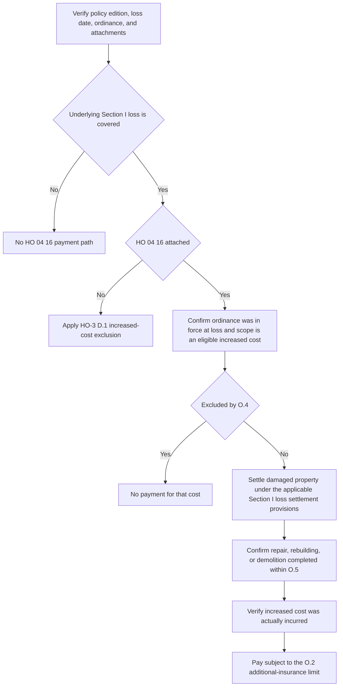

## Scope and governing forms

This page covers the multistate 2018-09 HO-3 Special Form, HO 04 16 Ordinance or Law Coverage, and HO 23 74 Actual Cash Value Loss Settlement — Roof Surfacing. HO-3 2018-09 applies to policies written on or after 2018-09-01. For any claim, verify the governing edition, the loss date, the ordinance or law in force at the time of loss, and whether HO 04 16 and HO 23 74 are actually attached. HO 04 16 and HO 23 74 are separate endorsements; neither attachment implies the other. [HO-3 2018-09, heading](repo://forms/HO/MS/HO-3/2018-09.md#L1-L4) · [HO 04 16 2018-09, heading](repo://forms/HO/MS/HO-04-16/2018-09.md#L1-L4) · [HO 23 74 2018-09, heading](repo://forms/HO/MS/HO-23-74/2018-09.md#L1-L4)

## Base rule and endorsement write-back

HO-3 Section I — Exclusions D.1 is the default rule: it excludes the increased cost of construction, demolition, or repair required by any ordinance or law regulating construction, repair, or demolition, unless an ordinance-or-law endorsement is attached. A code requirement does not become payable just because an estimate, contractor, or local authority identifies it. [HO-3 2018-09, D.1](repo://forms/HO/MS/HO-3/2018-09.md#L91-L94)

When HO 04 16 is attached, O.1 provides a limited write-back. It covers the increased cost incurred to repair, rebuild, or demolish the damaged dwelling or other structure because of an ordinance or law regulating construction, repair, or demolition, but only where the ordinance or law was in force at the time of loss and the underlying loss is covered under Section I. O.1 states that Section I — Exclusions D.1 does not apply to loss covered under the endorsement. This write-back is limited to the described increased cost; it does not create coverage for an otherwise excluded peril and does not remove the endorsement's limit, exclusions, completion requirement, or payment prerequisites. [HO 04 16 2018-09, O.1](repo://forms/HO/MS/HO-04-16/2018-09.md#L5-L9)

## Claim flow

This sequence reflects the endorsement's coverage gates: underlying covered loss, attachment, in-force ordinance, exclusions, completion timing, and post-settlement cost-incurrence. [HO 04 16 2018-09, O.1–O.6](repo://forms/HO/MS/HO-04-16/2018-09.md#L5-L37)

## Limit

O.2 caps payment at 10% of the Coverage A limit of liability shown in the Declarations, unless a higher percentage is shown for the endorsement. The amount is additional insurance and does not reduce the Coverage A or Coverage B limits. That means the endorsement sits on top of the dwelling or other-structures limits rather than transferring money out of them. [HO 04 16 2018-09, O.2](repo://forms/HO/MS/HO-04-16/2018-09.md#L11-L14)

## Undamaged portions and roof surfacing

O.3 covers two kinds of ordinance-driven work: the cost to demolish and clear the site of undamaged portions of the dwelling when an ordinance or law requires their removal to repair or rebuild the damaged portion, and the additional replacement of undamaged roof surfacing when an ordinance or law requires that replacement to repair the damaged portion. [HO 04 16 2018-09, O.3](repo://forms/HO/MS/HO-04-16/2018-09.md#L15-L19)

For roof claims, keep the roof-surfacing settlement path separate from the ordinance-or-law path. HO 23 74 changes the settlement basis for roof surfacing only, and R.6 preserves the HO-3 D.1 boundary for undamaged roof surfacing: the additional replacement cost is subject to D.1 and is not payable under the roof-schedule endorsement unless an ordinance-or-law endorsement is attached. HO 23 74 therefore does not itself grant coverage for code-required undamaged surfacing or prove that HO 04 16 is attached. When both endorsements are present, settle the damaged roof surfacing under HO 23 74 and evaluate any code-required undamaged surfacing under HO 04 16 separately. [HO 23 74 2018-09, R.1–R.2 and R.6](repo://forms/HO/MS/HO-23-74/2018-09.md#L5-L15) · [HO 23 74 2018-09, R.6](repo://forms/HO/MS/HO-23-74/2018-09.md#L37-L41) · [HO 04 16 2018-09, O.3](repo://forms/HO/MS/HO-04-16/2018-09.md#L15-L19)

## Exclusions that remain outside coverage

O.4 excludes three categories of claimed increment. First, it excludes the cost to test for, monitor, clean up, remove, or neutralize pollutants, contaminants, or hazardous substances, including asbestos and lead, except where the requirement is triggered solely by the covered loss and applies only to the damaged portion. Second, it excludes loss in value to an undamaged portion of a structure caused by ordinance or law enforcement. Third, it excludes compliance cost where the insured was required to comply before the loss and had not done so. [HO 04 16 2018-09, O.4](repo://forms/HO/MS/HO-04-16/2018-09.md#L21-L27)

## Timing and payment prerequisites

O.5 makes timing a coverage condition: the repair, rebuilding, or demolition must be completed as soon as reasonably possible after the loss and in no event more than two years after the date of loss, unless the insurer agrees in writing to extend that period. O.6 adds a separate settlement and incurred-cost gate: coverage applies only after the loss to the damaged property itself has been settled under the applicable Section I loss settlement provisions, and only to the increased cost actually incurred. A projected upgrade estimate is not itself the payment measure under O.6. [HO 04 16 2018-09, O.5–O.6](repo://forms/HO/MS/HO-04-16/2018-09.md#L29-L37)

## Focused review checks

1. No HO 04 16 attachment: apply HO-3 D.1 to the increased cost; do not create ordinance coverage from the code requirement or from HO 23 74.
2. HO 04 16 attached, but no covered underlying loss: the endorsement path fails at O.1.
3. Code-required undamaged roof surfacing: confirm HO 04 16 attachment, the ordinance in force at loss, and O.2, O.4, O.5, and O.6 before paying the increment.
4. Hazardous-material code work: confirm the requirement was solely triggered by the covered loss and applies only to the damaged portion; otherwise O.4 excludes it.
5. Late or incomplete work: compare completion to the loss date, require a written extension if work exceeds two years, and do not pay an estimated but unincurred increment before damaged-property settlement.
6. Limit integrity: apply 10% of Coverage A unless the endorsement shows a higher percentage, and keep the amount additional to Coverage A and Coverage B.
