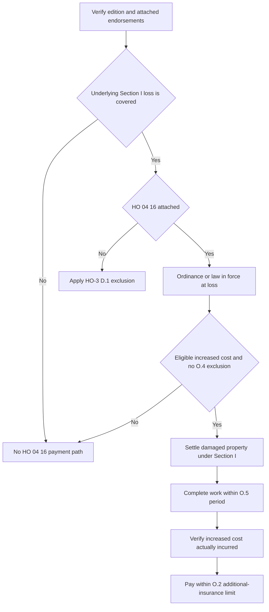

## Scope and controlling forms

This page covers the multistate **2018-09** HO-3 form, the HO 04 16 Ordinance or Law Coverage endorsement, and the HO 23 74 Actual Cash Value Loss Settlement — Roof Surfacing endorsement. HO-3 2018-09 applies to policies written on or after 2018-09-01. Always confirm the issued policy edition, loss date, cause of loss, Declarations Coverage A limit, applicable deductible, and whether HO 04 16 and HO 23 74 are actually attached. The roof schedule and ordinance-or-law endorsement are separate attachments with different jobs; neither one implies the other. [HO-3 2018-09, heading](repo://forms/HO/MS/HO-3/2018-09.md#L1-L4) · [HO 04 16 2018-09, heading](repo://forms/HO/MS/HO-04-16/2018-09.md#L1-L4) · [HO 23 74 2018-09, heading](repo://forms/HO/MS/HO-23-74/2018-09.md#L1-L4)

For the underlying covered-loss and exclusion analysis, see [Perils and General Exclusions](/openwiki/coverage/property/perils-and-general-exclusions.md). For the damaged roof-surfacing settlement path, see [Roof Settlement](/openwiki/coverage/coverage-a/roof-settlement.md). For claim-condition, payment, and deductible mechanics, see [Section I Claim Conditions, Payment, and Deductibles](/openwiki/coverage/property/claim-conditions-and-deductibles.md). Operational roof-loss handling is summarized in [Roof-Loss Handling](/openwiki/operations/claims-roof-loss-handling.md).

## Base rule: ordinance or law is excluded unless HO 04 16 is attached

HO-3 2018-09 Section I — Exclusions D.1 excludes the increased cost of construction, demolition, or repair required by any ordinance or law regulating construction, repair, or demolition. A code requirement by itself does not create coverage. If HO 04 16 is attached, O.1 writes back D.1 for the limited increased cost described by the endorsement, but only when the ordinance or law was in force at the time of loss and the underlying loss is covered under Section I. [HO-3 2018-09, D.1](repo://forms/HO/MS/HO-3/2018-09.md#L91-L94) · [HO 04 16 2018-09, O.1](repo://forms/HO/MS/HO-04-16/2018-09.md#L5-L9)

*The flow separates the base D.1 exclusion from the attached HO 04 16 write-back and shows the required sequence: covered loss, attached endorsement, ordinance in force, damaged-property settlement, completion, incurred cost, and limit check.* [HO-3 2018-09, D.1](repo://forms/HO/MS/HO-3/2018-09.md#L91-L94) · [HO 04 16 2018-09, O.1–O.6](repo://forms/HO/MS/HO-04-16/2018-09.md#L5-L37)

## The capped additional amount

HO 04 16 O.2 caps payment at **10% of the Coverage A limit of liability shown in the Declarations**, unless the endorsement itself shows a higher percentage. The endorsement amount is **additional insurance**; it does not reduce Coverage A or Coverage B. Use the issued Declarations and the endorsement wording to determine the applicable percentage, and do not treat the 10% figure as a deduction from the dwelling or other-structures limit. [HO 04 16 2018-09, O.2](repo://forms/HO/MS/HO-04-16/2018-09.md#L11-L14)

## Undamaged portions and roof-schedule boundary

HO 04 16 O.3 separately covers the cost to demolish and clear undamaged portions of a dwelling when an ordinance or law requires their removal to repair or rebuild the damaged portion. O.3 also covers the additional replacement of **undamaged roof surfacing** when an ordinance or law requires that replacement to repair the damaged portion. [HO 04 16 2018-09, O.3](repo://forms/HO/MS/HO-04-16/2018-09.md#L15-L19)

That undamaged roof-surfacing cost does **not** belong in HO 23 74's scheduled-roof payment. HO 23 74 R.6 says the additional replacement cost is subject to HO-3 D.1 and is not payable under the roof-schedule endorsement unless an ordinance or law endorsement is attached. In other words, the roof schedule defines the roof-surfacing settlement path, while HO 04 16 is the separate ordinance-or-law route for the code-driven undamaged increment. [HO 23 74 2018-09, R.6](repo://forms/HO/MS/HO-23-74/2018-09.md#L37-L41) · [HO 23 74 2018-09, R.1–R.2](repo://forms/HO/MS/HO-23-74/2018-09.md#L5-L15)

When both endorsements are attached, keep the two calculations separate: price and communicate the damaged roof surfacing under HO 23 74, then evaluate any code-required undamaged surfacing under HO 04 16. Do not collapse the ordinance write-back into roof-surfacing depreciation, and do not use the roof schedule as evidence that HO 04 16 is present. [HO 04 16 2018-09, O.1–O.6](repo://forms/HO/MS/HO-04-16/2018-09.md#L5-L37) · [HO 23 74 2018-09, R.6](repo://forms/HO/MS/HO-23-74/2018-09.md#L37-L41)

## Restrictions that keep the ordinance benefit narrow

O.4 excludes three material categories of cost:

1. compliance cost for testing, monitoring, cleanup, removal, or neutralization of pollutants, contaminants, or hazardous substances, including asbestos and lead, except when the requirement is triggered solely by the covered loss and applies only to the damaged portion;
2. loss in value to an undamaged portion of a structure caused by enforcement of an ordinance or law; and
3. compliance cost when the insured was already required to comply before the loss and had not done so.

Apply those restrictions to each claimed increment. A code label alone does not overcome them, and the hazardous-material exception does not expand to undamaged-property work that is not solely loss-triggered. [HO 04 16 2018-09, O.4](repo://forms/HO/MS/HO-04-16/2018-09.md#L21-L27)

## Timing and payment prerequisites

O.5 makes completion a payment condition: the repair, rebuilding, or demolition must be completed as soon as reasonably possible after the loss and no later than two years after the date of loss unless the insurer agrees in writing to extend that period. O.6 then adds a separate settlement and incurred-cost gate: coverage under the endorsement applies only after the damaged property itself has been settled under the applicable Section I loss settlement provisions, and only to the increased cost actually incurred. [HO 04 16 2018-09, O.5–O.6](repo://forms/HO/MS/HO-04-16/2018-09.md#L29-L37)

## Focused review tests

Use these review checks before authorizing or denying ordinance-or-law payment:

1. **No HO 04 16 attachment:** a covered roof loss includes a code requirement, but D.1 still excludes the increased cost.
2. **Attached HO 04 16, but no covered underlying loss:** O.1 blocks the endorsement path; code work is not standalone coverage.
3. **Code-required undamaged roof surfacing:** keep the undamaged portion out of HO 23 74, then verify HO 04 16 attachment, the in-force ordinance, O.2 limit, O.4 exclusions, O.5 completion timing, and O.6 settlement and incurred-cost requirements.
4. **Hazardous-material code work:** confirm whether the requirement was triggered solely by the covered loss and applies only to the damaged portion; otherwise O.4 excludes it.
5. **Late or incomplete work:** compare the completion date to the loss date, require a written extension for work beyond two years, and do not pay an estimated but unincurred increment before damaged-property settlement.
6. **Limit integrity:** calculate 10% of the issued Coverage A limit unless the endorsement shows a higher percentage, and keep the paid amount additional to Coverage A and Coverage B.
