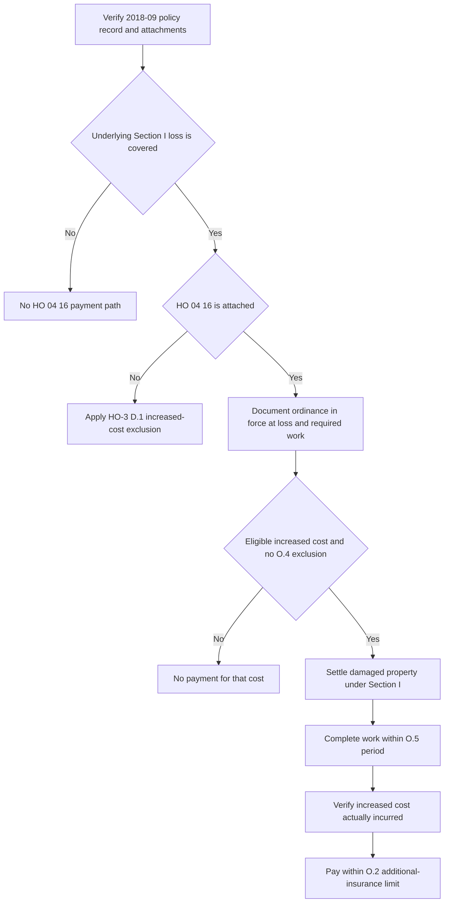

## Scope and controlling documents

This reference concerns the multistate **2018-09** forms: HO-3 Homeowners 3 — Special Form, HO 04 16 Ordinance or Law Coverage, and, where present, HO 23 74 Actual Cash Value Loss Settlement — Roof Surfacing. HO-3 2018-09 applies to policies written on or after 2018-09-01. Start with the issued policy record: verify the governing HO-3 edition, the Declarations Coverage A limit, the loss date and cause, the applicable ordinance, and whether HO 04 16 and HO 23 74 are actually attached. HO 04 16 and HO 23 74 are separate endorsements with different targets; neither attachment follows from the other. [HO-3 2018-09, heading](repo://forms/HO/MS/HO-3/2018-09.md#L1-L4) · [HO 04 16 2018-09, heading](repo://forms/HO/MS/HO-04-16/2018-09.md#L1-L4) · [HO 23 74 2018-09, heading](repo://forms/HO/MS/HO-23-74/2018-09.md#L1-L4)

This is a code-driven **increased-cost** path, not an initial grant for physical damage. The underlying loss must be covered under Section I before an attached HO 04 16 can apply. It also does not replace the ordinary damaged-property settlement path; the endorsement conditions payment on that settlement. [HO 04 16 2018-09, O.1 and O.6](repo://forms/HO/MS/HO-04-16/2018-09.md#L5-L9) [O.6](repo://forms/HO/MS/HO-04-16/2018-09.md#L33-L37)

<!-- openwiki: broken internal link [/openwiki/coverage/property/perils-and-general-exclusions] file "/openwiki/coverage/property/perils-and-general-exclusions" does not exist. Fix the href or restore the target, then delete this comment. -->
<!-- openwiki: broken internal link [/openwiki/coverage/coverage-a/roof-settlement] file "/openwiki/coverage/coverage-a/roof-settlement" does not exist. Fix the href or restore the target, then delete this comment. -->
<!-- openwiki: broken internal link [/openwiki/coverage/property/claim-conditions-and-deductibles] file "/openwiki/coverage/property/claim-conditions-and-deductibles" does not exist. Fix the href or restore the target, then delete this comment. -->
<!-- openwiki: broken internal link [/openwiki/operations/claims-roof-loss-handling] file "/openwiki/operations/claims-roof-loss-handling" does not exist. Fix the href or restore the target, then delete this comment. -->
For the base covered-loss and exclusion decision, see [Perils and General Exclusions](/openwiki/coverage/property/perils-and-general-exclusions). For the settlement of damaged roof surfacing, see [Roof Settlement](/openwiki/coverage/coverage-a/roof-settlement); for notice, proof, payment, and deductibles, see [Section I Claim Conditions, Payment, and Deductibles](/openwiki/coverage/property/claim-conditions-and-deductibles). Operational file handling is summarized in [Roof-Loss Handling](/openwiki/operations/claims-roof-loss-handling).

## Exclusion first; limited write-back only when attached

HO-3 2018-09 Section I — Exclusions D.1 is the default rule: it excludes “the increased cost of construction, demolition, or repair required by any ordinance or law regulating construction, repair, or demolition,” unless an ordinance-or-law endorsement is attached. Do not characterize code work as payable merely because an estimate, a contractor, or a local authority identifies it. [HO-3 2018-09, D.1](repo://forms/HO/MS/HO-3/2018-09.md#L91-L94)

**Only when HO 04 16 edition 2018-09 is attached**, read the base exclusion and endorsement together. O.1 covers increased cost incurred to repair, rebuild, or demolish the damaged dwelling or other structure because of an ordinance or law regulating construction, repair, or demolition, provided the ordinance or law was in force at loss and the loss itself is covered under Section I. O.1 then states that Section I — Exclusions D.1 does not apply to loss covered under the endorsement. This is a limited write-back for the described increased cost; it does not make an excluded cause of loss covered or dispense with the endorsement's limit, exclusions, completion requirement, and payment prerequisites. [HO-3 2018-09, D.1](repo://forms/HO/MS/HO-3/2018-09.md#L91-L94) · [HO 04 16 2018-09, O.1](repo://forms/HO/MS/HO-04-16/2018-09.md#L5-L9)

## Decision sequence and file controls

*This flow separates the base D.1 exclusion from the attached HO 04 16 write-back and sequences the endorsement's eligibility, settlement, completion, incurred-cost, and limit controls.* [HO-3 2018-09, D.1](repo://forms/HO/MS/HO-3/2018-09.md#L91-L94) · [HO 04 16 2018-09, O.1–O.6](repo://forms/HO/MS/HO-04-16/2018-09.md#L5-L37)

The record should identify the specific ordinance or law, show that it was in force at the date of loss, and isolate the incremental code-driven cost from the cost of repairing covered damaged property. For a roof claim, separately identify damaged surfacing, undamaged surfacing claimed because of code, and any structural, demolition, clearance, hazardous-material, or pre-existing compliance work. Retain the underlying Section I coverage decision, ordinance requirement, scope/estimate, damaged-property settlement, completion evidence, invoices or other incurred-cost evidence, and any written extension. These records test O.1's ordinance and covered-loss gates, O.4's exclusions, O.5's completion requirement, and O.6's settlement/incurrence requirements. [HO 04 16 2018-09, O.1–O.6](repo://forms/HO/MS/HO-04-16/2018-09.md#L5-L37)

## Limit: additional insurance, not a transfer from A or B

O.2 caps payment at **10% of the Coverage A limit of liability shown in the Declarations**, unless a higher percentage is shown for the endorsement. The amount is **additional insurance**: it does not reduce the Coverage A or Coverage B limits. Calculate the available endorsement amount from the issued Declarations and stated endorsement percentage; do not assume that a 10% figure is a reduction of the dwelling or other-structures limit, or that a higher percentage exists without policy support. [HO 04 16 2018-09, O.2](repo://forms/HO/MS/HO-04-16/2018-09.md#L11-L14)

## Undamaged portions and the roof-schedule boundary

HO 04 16 O.3 expressly covers the cost to demolish and clear the site of undamaged portions of a dwelling when an ordinance or law requires removal to repair or rebuild the damaged portion. It also expressly covers additional replacement of **undamaged roof surfacing** when an ordinance or law requires that replacement to repair the damaged portion. [HO 04 16 2018-09, O.3](repo://forms/HO/MS/HO-04-16/2018-09.md#L15-L19)

That HO 04 16 benefit must not be conflated with the roof schedule:

- **HO 23 74 R.6:** If that roof-surfacing schedule is attached, it says code-required replacement of undamaged roof surfacing is subject to HO-3 D.1 and is **not payable under the roof-schedule endorsement** unless an ordinance-or-law endorsement is attached. Thus, the schedule itself does not pay the undamaged surfacing. [HO 23 74 2018-09, R.6](repo://forms/HO/MS/HO-23-74/2018-09.md#L37-L41)
- **HO 04 16 O.3:** If HO 04 16 is attached and its conditions are met, it is the potential coverage path for the additional code-required undamaged surfacing. Its O.2 limit, O.4 exclusions, O.5 completion deadline, and O.6 post-settlement/actually-incurred condition still govern. [HO 04 16 2018-09, O.2–O.6](repo://forms/HO/MS/HO-04-16/2018-09.md#L11-L37)

The roof schedule is not a prerequisite stated by O.3. Conversely, attachment of HO 23 74 does not prove attachment of HO 04 16. When both are attached, price and communicate the damaged roof-surfacing settlement under the roof endorsement separately from the ordinance-driven undamaged-surfacing increased cost under HO 04 16. [HO 04 16 2018-09, O.3](repo://forms/HO/MS/HO-04-16/2018-09.md#L15-L19) · [HO 23 74 2018-09, R.1–R.2 and R.6](repo://forms/HO/MS/HO-23-74/2018-09.md#L5-L15) [R.6](repo://forms/HO/MS/HO-23-74/2018-09.md#L37-L41)

## Costs that remain outside the endorsement

O.4 has three material restrictions:

1. It excludes compliance cost for testing, monitoring, cleanup, removal, or neutralization of pollutants, contaminants, or hazardous substances—including asbestos and lead—**except** when the requirement is triggered solely by the covered loss and applies only to the damaged portion.
2. It excludes loss in value to an undamaged portion of a structure caused by enforcement of an ordinance or law.
3. It excludes the cost of complying with an ordinance or law when the insured was required to comply before the loss and had not done so.

Apply these restrictions to each claimed increment. A code label alone does not overcome them, and the hazardous-material exception does not extend to work beyond the damaged portion or to a requirement that was not solely loss-triggered. [HO 04 16 2018-09, O.4](repo://forms/HO/MS/HO-04-16/2018-09.md#L21-L27)

## Completion and payment prerequisites

The **2018-09** endorsement makes timing a payment condition. O.5 provides verbatim: **“We cover the increased cost only if the repair, rebuilding, or demolition is completed as soon as reasonably possible after the loss, and in no event more than two years after the date of loss unless we agree in writing to extend that period.”** A verbal expectation, an open estimate, or unfinished work does not satisfy this wording; preserve the completion date and any written extension in the claim file. [HO 04 16 2018-09, O.5](repo://forms/HO/MS/HO-04-16/2018-09.md#L29-L31)

O.6 provides the separate settlement and cost-incurrence gate verbatim: **“Coverage under this endorsement applies only after the loss to the damaged property itself has been settled under the applicable Section I loss settlement provisions, and only to the increased cost actually incurred.”** The order is therefore material: settle the damaged property under the applicable Section I provisions, then evaluate the completed, eligible, incremental code cost that the insured actually incurred. A projected upgrade estimate is not itself the payment measure under O.6. [HO 04 16 2018-09, O.6](repo://forms/HO/MS/HO-04-16/2018-09.md#L33-L37)

## Focused review tests

Use these file-review scenarios before authorizing or denying ordinance-or-law payment:

1. **No HO 04 16 attachment:** A covered roof loss includes a local code requirement. Confirm D.1 excludes the increased cost; do not create coverage from the requirement or from HO 23 74.
2. **Attached HO 04 16, but no covered underlying loss:** Confirm that O.1's covered-Section-I-loss condition blocks the endorsement path rather than treating code work as standalone coverage.
3. **Code-required undamaged roof surfacing:** If HO 23 74 is attached, keep the undamaged portion out of its scheduled-surfacing payment. Verify HO 04 16 attachment, the in-force ordinance, and O.2/O.4/O.5/O.6 before considering payment under HO 04 16.
4. **Hazardous-material code work:** Test whether the requirement was solely triggered by the covered loss and applies only to the damaged portion; otherwise apply O.4's exclusion.
5. **Late or incomplete work:** Compare the completion date to the loss date, require a written insurer extension for work beyond two years, and do not pay an estimated but unincurred increment before damaged-property settlement.
6. **Limit integrity:** Calculate 10% of the issued Coverage A limit unless the endorsement shows a higher percentage; keep the paid amount additional to, rather than deducted from, Coverage A or Coverage B.
