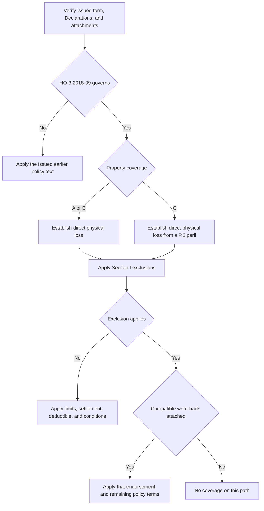

## Scope and controlling-policy check

This page is the starting point for a Section I property cause-of-loss review, not a substitute for the issued policy. Identify the policy-written date, issued HO-3 edition, Declarations, and endorsements actually attached before deciding coverage. **HO-3 2011-05** remains controlling for a policy written under that edition even if the loss is reported after it was superseded; **HO-3 2018-09** applies to policies written on or after 2018-09-01. A later form is not a retroactive patch for an earlier policy. [2011-05 applicability and continuing force](repo://forms/HO/MS/HO-3/2011-05.md#L1-L7) · [2018-09 applicability](repo://forms/HO/MS/HO-3/2018-09.md#L1-L4)

Use [Governing Form Editions and Policy Assembly](/openwiki/coverage/policy-editions-and-governing-forms.md) to select and assemble the policy, [Dwelling](/openwiki/coverage/coverage-a/dwelling.md) for Coverage A property and settlement, and [Personal Property](/openwiki/coverage/coverage-c/personal-property.md) for Coverage C property, limits, and settlement. A form's “if ... attached” language is a condition, not evidence that the form was attached to a particular policy. [2011-05 water-backup attachment condition](repo://forms/HO/MS/HO-3/2011-05.md#L59-L66) · [2018-09 water and roof attachment conditions](repo://forms/HO/MS/HO-3/2018-09.md#L25-L34) · [2018-09 water exclusions](repo://forms/HO/MS/HO-3/2018-09.md#L69-L77)

## 2018-09 cause-of-loss gates

The 2018-09 form uses two distinct Section I perils-insured-against paths:

| Property coverage | Initial 2018-09 test | Resulting control |
| --- | --- | --- |
| **Coverage A — Dwelling** and **Coverage B — Other Structures** | Is there **“direct physical loss”** to property described in A or B? | P.1 insures the loss unless a Section I exclusion applies. This is open-peril treatment subject to exclusions, not an unconditional payment promise. |
| **Coverage C — Personal Property** | Is **“direct physical loss”** caused by one of P.2's listed perils? | P.2 limits the grant to its named perils: fire or lightning; windstorm or hail; explosion; riot or civil commotion; aircraft; vehicles; smoke; vandalism or malicious mischief; theft; falling objects; weight of ice, snow, or sleet; accidental discharge or overflow of water or steam from specified internal systems; and sudden and accidental electrical-current damage. Section I exclusions still apply. |

P.1's controlling language is **“direct physical loss to property described in those coverages, except as excluded in Section I — Exclusions.”** P.2 insures Coverage C only for direct physical loss caused by its listed perils. Keep the property grant, applicable cause-of-loss gate, exclusions, and any verified write-back separate: an A/B open-peril result cannot bypass Coverage C's named-peril requirement. [HO-3 2018-09 P.1–P.2](repo://forms/HO/MS/HO-3/2018-09.md#L59-L64) · [2018-09 A/B/C property descriptions](repo://forms/HO/MS/HO-3/2018-09.md#L23-L50)

*The flow distinguishes the 2018-09 A/B and C entry gates before exclusions and verified write-backs; it does not resolve disputed facts.* [HO-3 2018-09 P.1–P.2 and exclusions](repo://forms/HO/MS/HO-3/2018-09.md#L59-L97)

### 2011-05 boundary

The supplied 2011-05 text contains Coverage A–D grants and Section I exclusions, but not a separately numbered perils-insured-against section corresponding to 2018-09 P.1/P.2. It also has no 2018-09 Definition 5, C.3 seepage provision, or D.1 ordinance-or-law exclusion. Resolve an older policy under its issued wording and compatible attached forms; do not label 2011 A/B as P.1 open peril or 2011 C as P.2 named peril merely because those provisions occur in the later edition. [2011-05 property coverages and exclusions](repo://forms/HO/MS/HO-3/2011-05.md#L25-L80) · [2018-09 perils and exclusions](repo://forms/HO/MS/HO-3/2018-09.md#L59-L97)

## General exclusions and their boundaries

The water and earth-movement clauses use the controlling causation phrase **“caused directly or indirectly.”** For 2018-09 water exclusions A.1–A.3, A.4 additionally states that they apply **“regardless of any other cause or event contributing concurrently or in any sequence to the loss.”** That anti-concurrent/sequential-causation direction is not in the supplied 2011-05 water wording. Source classification remains essential; route water-source and backup questions to the dedicated page rather than treating every water-related fact as the same exclusion. [2011-05 A.1–A.3](repo://forms/HO/MS/HO-3/2011-05.md#L59-L66) · [2018-09 A.1–A.4](repo://forms/HO/MS/HO-3/2018-09.md#L69-L77)

### Earth movement

Both editions exclude loss **“caused directly or indirectly”** by earthquake, landslide, mudflow, sinkhole collapse, subsidence, or any other earth movement. The 2018-09 wording further says **“whether combined with water or not.”** Preserve that added phrase as 2018-specific; it is not stated in the supplied 2011-05 provision. Neither base-form clause supplies an earth-movement coverage grant, so an asserted exception must come from the issued policy text. [2011-05 B.1](repo://forms/HO/MS/HO-3/2011-05.md#L67-L70) · [2018-09 B.1](repo://forms/HO/MS/HO-3/2018-09.md#L79-L82)

### Neglect: post-loss preservation duty and exclusion

In both editions, C.1 excludes loss caused by neglect: an insured's failure to use all reasonable means to save and preserve property **“at and after the time of a loss.”** This aligns with the Section I duty to protect property from further damage. Establish the initial covered event first, then record notice timing, available emergency protection, protection performed, and any incremental damage attributed to a claimed failure. [2011-05 C.1 and S.1](repo://forms/HO/MS/HO-3/2011-05.md#L71-L75) · [2011-05 conditions](repo://forms/HO/MS/HO-3/2011-05.md#L83-L86) · [2018-09 C.1 and S.1](repo://forms/HO/MS/HO-3/2018-09.md#L83-L87) · [2018-09 conditions](repo://forms/HO/MS/HO-3/2018-09.md#L101-L104)

### Deterioration, mold, and rot

Both editions' C.2 excludes loss caused by wear and tear, marring, deterioration, inherent vice, latent defect, mechanical breakdown, rust, mold, wet or dry rot, and specified settling or structural changes. A mold or rot observation alone therefore does not establish Section I coverage. On a **2018-09** policy, attached **HO 04 81 Limited Fungi, Wet or Dry Rot, or Bacteria Coverage M.1** writes back **HO-3 2018-09 Section I — Exclusions C.2** only to the stated extent: direct physical loss to covered A/B/C property caused by fungi, rot, or bacteria where the condition resulted from a Section I insured peril during the policy period. [2011-05 C.2](repo://forms/HO/MS/HO-3/2011-05.md#L71-L76) · [2018-09 C.2](repo://forms/HO/MS/HO-3/2018-09.md#L83-L88) · [HO 04 81 M.1](repo://forms/HO/MS/HO-04-81/2018-09.md#L5-L10)

**Preserved barriers:** **HO 04 81 M.2** separately preserves the applicable underlying source and duration barriers: it denies this route when the moisture came from flood or surface water (**HO-3 2018-09 A.1**), subsurface water (**A.2**), or continuous or repeated seepage or leakage over weeks, months, or years (**C.3**). M.1's C.2 write-back does not override those provisions, and M.6 leaves all other policy provisions applicable. [HO 04 81 M.1–M.2](repo://forms/HO/MS/HO-04-81/2018-09.md#L5-L17) · [HO-3 2018-09 A.1–A.2](repo://forms/HO/MS/HO-3/2018-09.md#L69-L75) · [HO-3 2018-09 C.3](repo://forms/HO/MS/HO-3/2018-09.md#L83-L90) · [HO 04 81 M.6](repo://forms/HO/MS/HO-04-81/2018-09.md#L33-L37)

**Write-back route:** [Fungi, Rot, and Bacteria](/openwiki/coverage/property/fungi-rot-and-bacteria.md) addresses HO 04 81 attachment, the covered underlying event, source restrictions, mitigation, and its aggregate limit. Do not use that 2018 endorsement's P.2/C.3 references to fill omissions in a 2011-05 policy. [HO 04 81 M.2](repo://forms/HO/MS/HO-04-81/2018-09.md#L11-L17) · [2011-05 exclusions](repo://forms/HO/MS/HO-3/2011-05.md#L57-L80)

### Long-term seepage or leakage — 2018-09 only

C.3 of **HO-3 2018-09** excludes loss caused by **“continuous or repeated seepage or leakage”** of water or steam over weeks, months, or years from the specified internal systems or a household appliance. It preserves loss that is **“sudden and accidental”** as Definition 5 defines that phrase: an event both **“abrupt in onset”** and **“unintended from the standpoint of the insured.”** A gradually developing condition, or one known to an insured and left unremedied, is not **“sudden and accidental”** merely because its effects appear later. Establish source, duration, onset, knowledge, and remediation; do not use discovery date as the event date. [HO-3 2018-09 Definition 5](repo://forms/HO/MS/HO-3/2018-09.md#L19-L20) · [HO-3 2018-09 C.3](repo://forms/HO/MS/HO-3/2018-09.md#L83-L90)

This C.3 exclusion and its defined **“sudden and accidental”** exception are not present in the supplied 2011-05 exclusions. For water source, backup, or seepage analysis—and any potential water-backup write-back—use [Water Damage and Backup](/openwiki/coverage/property/water-damage-and-backup.md) with the selected base form and verified attachment. When attached, **HO 04 90 W.1 writes back HO-3 Section I — Exclusions A.3** only for its stated sewer/drain-backup and sump overflow/discharge direct-physical-loss route. [2011-05 A.3](repo://forms/HO/MS/HO-3/2011-05.md#L63-L66) · [2018-09 A.3](repo://forms/HO/MS/HO-3/2018-09.md#L75-L77) · [HO 04 90 W.1](repo://forms/HO/MS/HO-04-90/2010-10.md#L5-L8)

**HO 04 90 W.4 separately preserves HO-3 Section I — Exclusions A.1 and A.2:** it does not provide coverage for the flood/surface-water category in A.1 or water below the surface of the ground in A.2. The W.1 A.3 write-back is not an override of either retained exclusion. [2011-05 A.1–A.2](repo://forms/HO/MS/HO-3/2011-05.md#L59-L64) · [2018-09 A.1–A.2](repo://forms/HO/MS/HO-3/2018-09.md#L69-L74) · [HO 04 90 W.4](repo://forms/HO/MS/HO-04-90/2010-10.md#L17-L21)

### Ordinance or law — 2018-09 only

Under **2018-09 D.1**, increased construction, demolition, or repair cost required by an ordinance or law regulating those activities is excluded unless an ordinance-or-law endorsement is attached. This is a cost-category exclusion, not an initial grant for physical damage. When compatible **HO 04 16 Ordinance or Law Coverage (2018-09)** is attached, **O.1 writes back HO-3 2018-09 Section I — Exclusions D.1** only for the stated increased cost caused by an ordinance in force at loss where the underlying Section I loss is covered. The O.1 write-back does not cover an excluded underlying loss. Under O.6, it applies only after damaged property has been settled and only to increased cost actually incurred. [HO-3 2018-09 D.1](repo://forms/HO/MS/HO-3/2018-09.md#L91-L94) · [HO 04 16 O.1](repo://forms/HO/MS/HO-04-16/2018-09.md#L5-L9) · [HO 04 16 O.6](repo://forms/HO/MS/HO-04-16/2018-09.md#L33-L37)

**Write-back route:** [Ordinance or Law Coverage and Undamaged Roof Portions](/openwiki/coverage/property/ordinance-or-law.md) covers attachment, limits, undamaged portions, exclusions, the completion deadline, and settlement/incurred-cost prerequisites. D.1 and HO 04 16 must not be projected backward: there is no separately stated ordinance-or-law exclusion in the supplied 2011-05 text. [HO 04 16 O.2–O.5](repo://forms/HO/MS/HO-04-16/2018-09.md#L11-L31) · [2011-05 exclusions](repo://forms/HO/MS/HO-3/2011-05.md#L57-L80)

### Intentional loss

Both forms exclude loss **“arising out of”** an act an insured commits or conspires to commit with intent to cause a loss. The 2018-09 E.1 adds the express consequence that the exclusion applies to all insureds whether or not a particular insured participated; 2011-05 D.1 does not state that expansion. Keep the edition distinction and establish the alleged act, intent, actor, and any conspiracy rather than importing the 2018 consequence into the older wording. [2011-05 D.1](repo://forms/HO/MS/HO-3/2011-05.md#L77-L80) · [2018-09 E.1](repo://forms/HO/MS/HO-3/2018-09.md#L95-L98)

## Focused file review

Before reaching a coverage position, preserve the issued base form and policy-written date; Declarations; attached endorsement list and edition; property coverage; claimed damage; asserted peril; and evidence of cause, source, onset, duration, and mitigation. Then apply this focused check:

1. **Choose the edition first.** A late report does not convert 2011-05 into 2018-09.
2. **Use the right 2018 gate.** A/B begins with **“direct physical loss”** subject to exclusions; C also requires a listed P.2 peril.
3. **Test the exclusion factually.** For earth movement, identify the movement; for neglect, identify the post-loss preservation opportunity; for deterioration or seepage, distinguish condition, source, duration, onset, and knowledge.
4. **Verify; do not presume; a write-back.** HO 04 81, HO 04 16, and HO 04 90 alter only their stated exclusions when actually attached and only under their own limits, conditions, and remaining exclusions.
5. **Finish under downstream terms.** Coverage remains subject to settlement, limits, deductibles, and Section I duties. Use [Section I Claim Conditions, Payment, and Deductibles](/openwiki/coverage/property/claim-conditions-and-deductibles.md) after the cause-of-loss analysis. [HO-3 2018-09 conditions and deductible](repo://forms/HO/MS/HO-3/2018-09.md#L101-L112) · [HO 04 81 M.3–M.5](repo://forms/HO/MS/HO-04-81/2018-09.md#L19-L31) · [HO 04 16 O.2–O.6](repo://forms/HO/MS/HO-04-16/2018-09.md#L11-L37) · [HO 04 90 W.2–W.6](repo://forms/HO/MS/HO-04-90/2010-10.md#L9-L31)
