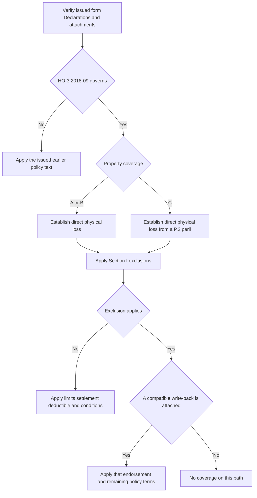

## Scope and controlling-policy check

This page is the starting point for a Section I property cause-of-loss review. It is not a substitute for the issued policy. First identify the policy-written date, the issued HO-3 edition, the Declarations, and the endorsements actually attached. **HO-3 2011-05** remains controlling for a policy written under that edition even if the loss is reported after it was superseded; **HO-3 2018-09** applies to policies written on or after 2018-09-01. A later form is not a retroactive patch for an earlier policy. [2011-05 applicability and continuing force](repo://forms/HO/MS/HO-3/2011-05.md#L1-L7) · [2018-09 applicability](repo://forms/HO/MS/HO-3/2018-09.md#L1-L4)

<!-- openwiki: broken internal link [/openwiki/coverage/policy-editions-and-governing-forms] file "/openwiki/coverage/policy-editions-and-governing-forms" does not exist. Fix the href or restore the target, then delete this comment. -->
<!-- openwiki: broken internal link [/openwiki/coverage/coverage-a/dwelling] file "/openwiki/coverage/coverage-a/dwelling" does not exist. Fix the href or restore the target, then delete this comment. -->
<!-- openwiki: broken internal link [/openwiki/coverage/coverage-c/personal-property] file "/openwiki/coverage/coverage-c/personal-property" does not exist. Fix the href or restore the target, then delete this comment. -->
Use [Governing Form Editions and Policy Assembly](/openwiki/coverage/policy-editions-and-governing-forms) to select and assemble the policy, [Dwelling](/openwiki/coverage/coverage-a/dwelling) for Coverage A property and settlement, and [Personal Property](/openwiki/coverage/coverage-c/personal-property) for Coverage C property, limits, and settlement. An endorsement is a conditional policy layer: language saying “if ... attached” does not prove that it was attached to a particular policy. [2011-05 water-backup attachment condition](repo://forms/HO/MS/HO-3/2011-05.md#L59-L66) · [2018-09 water and roof attachment conditions](repo://forms/HO/MS/HO-3/2018-09.md#L25-L34) [2018-09 water exclusions](repo://forms/HO/MS/HO-3/2018-09.md#L69-L77)

## 2018-09 cause-of-loss gates

The 2018-09 form has two different Section I perils-insured-against paths:

| Property coverage | Initial 2018-09 test | Resulting control |
| --- | --- | --- |
| **Coverage A — Dwelling** and **Coverage B — Other Structures** | Has there been **“direct physical loss”** to property described in A or B? | P.1 insures that loss unless a Section I exclusion applies. This is open-peril treatment subject to exclusions, not an unconditional payment promise. |
| **Coverage C — Personal Property** | Has **“direct physical loss”** been caused by one of P.2's listed perils? | P.2 limits the grant to the named perils: fire or lightning; windstorm or hail; explosion; riot or civil commotion; aircraft; vehicles; smoke; vandalism or malicious mischief; theft; falling objects; weight of ice, snow, or sleet; accidental discharge or overflow of water or steam from the specified internal systems; and sudden and accidental electrical-current damage. Apply Section I exclusions as well. |

P.1's controlling language is **“direct physical loss to property described in those coverages, except as excluded in Section I — Exclusions.”** P.2 says Coverage C is insured only for direct physical loss caused by its listed perils. The property grant, the applicable cause-of-loss gate, exclusions, and an attached write-back are separate questions; do not use a Coverage A/B open-peril result to bypass Coverage C's named-peril requirement. [HO-3 2018-09 P.1–P.2](repo://forms/HO/MS/HO-3/2018-09.md#L59-L64) · [2018-09 A/B/C property descriptions](repo://forms/HO/MS/HO-3/2018-09.md#L23-L50)

*This review flow shows the different 2018-09 A/B and C entry gates before exclusions and verified endorsement write-backs; it does not prescribe a finding on disputed facts.* [HO-3 2018-09 P.1–P.2 and exclusions](repo://forms/HO/MS/HO-3/2018-09.md#L59-L97)

### 2011-05 boundary

The supplied 2011-05 text contains Coverage A–D grants and Section I exclusions but does **not** contain a separately numbered perils-insured-against section corresponding to 2018-09 P.1/P.2. It also has no 2018-09 Definition 5, C.3 seepage provision, or D.1 ordinance-or-law exclusion. Resolve an older policy under its issued wording and compatible attached forms; do not label 2011 A/B as P.1 open peril or 2011 C as P.2 named peril merely because those provisions appear in the later edition. [2011-05 property coverages and exclusions](repo://forms/HO/MS/HO-3/2011-05.md#L25-L80) · [2018-09 perils, definition, and added exclusions](repo://forms/HO/MS/HO-3/2018-09.md#L19-L20) [2018-09 perils and exclusions](repo://forms/HO/MS/HO-3/2018-09.md#L59-L97)

## General exclusions and their boundaries

### Earth movement

Both editions exclude loss caused directly or indirectly by earthquake, landslide, mudflow, sinkhole collapse, subsidence, or any other earth movement. The 2018-09 wording further says that this applies **“whether combined with water or not.”** Preserve that added wording as a 2018-specific feature; it is not stated in the supplied 2011-05 provision. Neither base-form clause supplies an earth-movement coverage grant, so an asserted exception requires the issued policy text rather than an assumption from this page. [2011-05 B.1](repo://forms/HO/MS/HO-3/2011-05.md#L67-L70) · [2018-09 B.1](repo://forms/HO/MS/HO-3/2018-09.md#L79-L82)

### Neglect: post-loss preservation duty and exclusion

In both editions, C.1 excludes loss caused by neglect, defined as an insured's failure to use all reasonable means to save and preserve property **at and after the time of a loss**. This is aligned with each form's Section I duty to protect property from further damage. Record the time notice was given, the emergency protection available and performed, and the incremental damage attributed to a claimed failure; the wording is not a substitute for first identifying a covered initial event. [2011-05 C.1 and S.1](repo://forms/HO/MS/HO-3/2011-05.md#L71-L75) [2011-05 conditions](repo://forms/HO/MS/HO-3/2011-05.md#L83-L86) · [2018-09 C.1 and S.1](repo://forms/HO/MS/HO-3/2018-09.md#L83-L87) [2018-09 conditions](repo://forms/HO/MS/HO-3/2018-09.md#L101-L104)

### Deterioration, mold, and rot

Both editions' C.2 excludes loss caused by wear and tear, marring, deterioration, inherent vice, latent defect, mechanical breakdown, rust, mold, wet or dry rot, and the specified settling, cracking, shrinking, bulging, or expansion. Thus, a mold or rot observation alone does not establish Section I coverage. On a **2018-09** policy, an attached **HO 04 81 Limited Fungi, Wet or Dry Rot, or Bacteria Coverage** narrowly makes C.2 inapplicable only for direct physical loss to covered A/B/C property where the condition resulted from a Section I insured peril during the policy period; all other policy provisions still apply. [2011-05 C.2](repo://forms/HO/MS/HO-3/2011-05.md#L71-L76) · [2018-09 C.2](repo://forms/HO/MS/HO-3/2018-09.md#L83-L88) · [HO 04 81 M.1 and M.6](repo://forms/HO/MS/HO-04-81/2018-09.md#L5-L10) [HO 04 81 all-other-provisions clause](repo://forms/HO/MS/HO-04-81/2018-09.md#L33-L37)

<!-- openwiki: broken internal link [/openwiki/coverage/property/fungi-rot-and-bacteria] file "/openwiki/coverage/property/fungi-rot-and-bacteria" does not exist. Fix the href or restore the target, then delete this comment. -->
**Write-back route:** [Fungi, Rot, and Bacteria](/openwiki/coverage/property/fungi-rot-and-bacteria) addresses HO 04 81 attachment, the covered underlying event, source restrictions, mitigation, and its aggregate limit. Do not use that 2018 endorsement's P.2/C.3 references to fill omissions in a 2011-05 policy. [HO 04 81 M.2](repo://forms/HO/MS/HO-04-81/2018-09.md#L11-L17) · [2011-05 exclusions](repo://forms/HO/MS/HO-3/2011-05.md#L57-L80)

### Long-term seepage or leakage — 2018-09 only

C.3 of **HO-3 2018-09** excludes loss caused by **“continuous or repeated seepage or leakage”** of water or steam, over weeks, months, or years, from within a plumbing, heating, or air-conditioning system or from within a household appliance. The provision preserves loss that is **“sudden and accidental”** as Definition 5 defines it. That definition requires an event both abrupt in onset and unintended from the insured's standpoint, and says a gradually developing condition—or one known to the insured and left unremedied—is not sudden and accidental merely because its effects became apparent later. Establish source, duration, onset, knowledge, and remediation facts rather than treating discovery date as the event date. [HO-3 2018-09 Definition 5](repo://forms/HO/MS/HO-3/2018-09.md#L19-L20) · [HO-3 2018-09 C.3](repo://forms/HO/MS/HO-3/2018-09.md#L83-L90)

<!-- openwiki: broken internal link [/openwiki/coverage/property/water-damage-and-backup] file "/openwiki/coverage/property/water-damage-and-backup" does not exist. Fix the href or restore the target, then delete this comment. -->
This C.3 exclusion and its defined exception are not present in the supplied 2011-05 exclusions. For a water source, backup, or seepage analysis—and any potential water-backup write-back—use [Water Damage and Backup](/openwiki/coverage/property/water-damage-and-backup) together with the selected base form and attached endorsement. In particular, HO 04 90 modifies the sewer/drain-backup and sump-overflow exclusion only when attached; it retains the base flood/surface-water and subsurface-water exclusions. [2011-05 water exclusions](repo://forms/HO/MS/HO-3/2011-05.md#L59-L66) · [2018-09 water exclusions](repo://forms/HO/MS/HO-3/2018-09.md#L69-L77) · [HO 04 90 W.1 and W.4](repo://forms/HO/MS/HO-04-90/2010-10.md#L5-L8) [HO 04 90 retained exclusions](repo://forms/HO/MS/HO-04-90/2010-10.md#L17-L21)

### Ordinance or law — 2018-09 only

Under **2018-09 D.1**, increased construction, demolition, or repair cost required by an ordinance or law regulating those activities is excluded unless an ordinance-or-law endorsement is attached. This is a cost category exclusion, not an initial grant for physical damage. When compatible **HO 04 16 Ordinance or Law Coverage (2018-09)** is attached, it supplies a limited path for increased cost incurred because of an ordinance in force at loss, but only where the underlying Section I loss is covered. It pays only after damaged property has been settled and only for increased cost actually incurred. [HO-3 2018-09 D.1](repo://forms/HO/MS/HO-3/2018-09.md#L91-L94) · [HO 04 16 O.1](repo://forms/HO/MS/HO-04-16/2018-09.md#L5-L9) · [HO 04 16 O.6](repo://forms/HO/MS/HO-04-16/2018-09.md#L33-L37)

<!-- openwiki: broken internal link [/openwiki/coverage/property/ordinance-or-law] file "/openwiki/coverage/property/ordinance-or-law" does not exist. Fix the href or restore the target, then delete this comment. -->
**Write-back route:** [Ordinance or Law Coverage and Undamaged Roof Portions](/openwiki/coverage/property/ordinance-or-law) addresses attachment, the additional limit, undamaged portions, exclusions, completion deadline, and settlement/incurred-cost prerequisites. D.1 and its HO 04 16 target must not be projected backward: there is no separately stated ordinance-or-law exclusion in the supplied 2011-05 text. [HO 04 16 O.2–O.5](repo://forms/HO/MS/HO-04-16/2018-09.md#L11-L31) · [2011-05 exclusions](repo://forms/HO/MS/HO-3/2011-05.md#L57-L80)

### Intentional loss

Both forms exclude loss arising from an act that an insured commits or conspires to commit with intent to cause a loss. The 2018-09 E.1 adds an express all-insureds consequence: it applies whether or not a particular insured participated; the earlier 2011-05 D.1 does not state that expansion. Keep the edition distinction and preserve facts concerning the alleged act, intent, actor, and any conspiracy rather than inferring the 2018 result under the older wording. [2011-05 D.1](repo://forms/HO/MS/HO-3/2011-05.md#L77-L80) · [2018-09 E.1](repo://forms/HO/MS/HO-3/2018-09.md#L95-L98)

## Focused file review

Before reaching a coverage position, preserve the issued base form and policy-written date; Declarations; attached endorsement list and edition; property coverage; claimed damage; asserted peril and evidence of cause, source, onset, duration, and mitigation; and the specific exclusion and write-back facts. Then apply this focused check:

1. **Choose the edition first.** A late report does not convert 2011-05 into 2018-09.
2. **Use the right 2018 gate.** A/B starts with **“direct physical loss”** subject to exclusions; C also requires a listed P.2 peril.
3. **Test the exclusion factually.** For earth movement, identify the movement; for neglect, identify the preservation opportunity after loss; for deterioration or seepage, distinguish condition, source, duration, and onset.
4. **Verify, do not presume, a write-back.** HO 04 81, HO 04 16, and HO 04 90 each alter a stated exclusion only when actually attached and only under their own limits, conditions, and remaining exclusions.
<!-- openwiki: broken internal link [/openwiki/coverage/property/claim-conditions-and-deductibles] file "/openwiki/coverage/property/claim-conditions-and-deductibles" does not exist. Fix the href or restore the target, then delete this comment. -->
5. **Finish through the applicable downstream page.** Coverage still remains subject to settlement, limits, deductibles, and Section I duties; use [Section I Claim Conditions, Payment, and Deductibles](/openwiki/coverage/property/claim-conditions-and-deductibles) after the cause-of-loss analysis. [HO-3 2018-09 conditions and deductible](repo://forms/HO/MS/HO-3/2018-09.md#L101-L112) · [HO 04 81 M.3–M.5](repo://forms/HO/MS/HO-04-81/2018-09.md#L19-L31) · [HO 04 16 O.2–O.6](repo://forms/HO/MS/HO-04-16/2018-09.md#L11-L37) · [HO 04 90 W.2–W.6](repo://forms/HO/MS/HO-04-90/2010-10.md#L9-L31)
