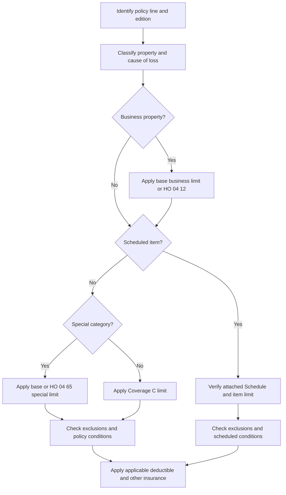

# Personal Property Limits and Scheduling

## Decision order

Coverage C decisions are made in layers. First identify the policy line and edition. Then classify the property and cause of loss, apply the base Coverage C limit and any category sublimit, and only then apply an attached endorsement or schedule. A limit modification does not by itself restore excluded property or an excluded cause of loss; the endorsement must expressly restore coverage to do that.

*This flow shows how classification, scheduling, sublimits, deductibles, and exclusions interact; an available limit is not a coverage grant.*

## Base Coverage C positions by form edition

### HO-3 2024-03

**Line and edition:** HO-3 · Edition 2024-03.

HO-3 2024-03 covers personal property owned or used by an insured anywhere in the world. The Coverage C limit is **50% of Coverage A**. Property of a guest or residence employee can be covered at the residence premises at the insured’s request, but the employee-property coverage does not increase Coverage C. The property remains subject to the form's exclusions, limitations, and covered-cause requirements. [HO-3 2024-03 C.1–C.8](repo://forms/HO/MS/HO-3/2024-03.md#L219-L229)

The base HO-3 special limits are: **$300** for money, bank notes, bullion, coins, medals, and precious metals; **$2,000** for theft of jewelry, watches, and precious stones; **$3,000** for theft of firearms and related equipment; **$1,500** for watercraft including trailers; **$3,000** for theft of silverware and similar plated ware; **$3,000** for business property on the residence premises; and **$1,500** for electronic apparatus in a motor vehicle. Each special limit is within, not additional to, Coverage C. [HO-3 2024-03 C.22–C.34](repo://forms/HO/MS/HO-3/2024-03.md#L261-L285)

The base HO-3 also provides separate additional-insurance coverage of **$1,500** for credit-card, fund-transfer-card, and forgery loss. The form requires compliance with the card issuer's conditions and excludes loss caused by dishonesty, voluntary transfer of the instrument, or failure to exercise reasonable care. This is not a Coverage C sublimit; it is separate Coverage E insurance. [HO-3 2024-03 E.14–E.15](repo://forms/HO/MS/HO-3/2024-03.md#L433-L435)

### HO-4 2021-10

**Line and edition:** HO-4 · Edition 2021-10.

HO-4 2021-10 covers an insured’s personal property at and away from the residence premises, including property temporarily removed when the cause is covered. The supplied Coverage C section does **not** state a Coverage C percentage or dollar amount; use the applicable limit shown by the policy and declarations rather than importing the HO-3 or HO-5 50% rule. Its C.26 provision covers business property while temporarily away from the residence premises, and C.27 addresses property used in a business subject to the applicable business-property limitation; do not describe the form as imposing a blanket away-from-premises business exclusion. [HO-4 2021-10 C.1–C.4](repo://forms/HO/MS/HO-4/2021-10.md#L198-L204) · [HO-4 2021-10 C.26–C.27](repo://forms/HO/MS/HO-4/2021-10.md#L245-L247)

Its stated special limits are **$1,500** for electronic apparatus in a motor vehicle, **$250** for money and precious metals, **$2,000** for theft of jewelry, watches, and precious stones, **$2,500** for theft of firearms, **$1,500** for watercraft including trailers, **$2,500** for theft of silverware, and **$3,000** for business property on the residence premises. The special limits are part of the applicable Coverage C limit. [HO-4 2021-10 C.19–C.25](repo://forms/HO/MS/HO-4/2021-10.md#L231-L243)

HO-4 also provides separate additional-insurance coverage of **$1,000** for credit-card, fund-transfer-card, and forgery loss. The form requires compliance with issuer terms and excludes dishonest or fraudulent acts, business instruments, and voluntary parting through fraud or deception; this coverage is not a Coverage C sublimit. [HO-4 2021-10 E.36–E.38](repo://forms/HO/MS/HO-4/2021-10.md#L429-L433) · [HO-4 2021-10 voluntary-parting exclusion](repo://forms/HO/MS/HO-4/2021-10.md#L745-L745)

### HO-5 2022-06

**Line and edition:** HO-5 · Edition 2022-06.

HO-5 2022-06 covers personal property anywhere in the world, including property of others in an insured’s care and certain guest, residence-employee, and student property. The Coverage C limit is **50% of Coverage A** and is not increased because covered property is located at more than one premises. [HO-5 2022-06 C.1–C.11](repo://forms/HO/MS/HO-5/2022-06.md#L259-L279)

The HO-5 special limits are: **$300** for money, bank notes, bullion, precious metals, and stored-value cards; **$3,000** for theft of jewelry, watches, and precious or semiprecious stones; **$3,500** for theft of firearms and related equipment; **$2,000** for watercraft including trailer and accessories; **$5,000** for theft of silverware, goldware, pewterware, platinumware, and plated articles; **$5,000** for business property on the residence premises; and **$2,000** for electronic apparatus in a motor vehicle. Acquired property remains subject to the Coverage C limit and special limits. [HO-5 2022-06 C.26–C.32](repo://forms/HO/MS/HO-5/2022-06.md#L309-L321)

HO-5 separately provides **$2,500** of additional-insurance coverage for credit-card, fund-transfer-card, and forgery loss. The form excludes authorized use, business transactions, failure to follow the device agreement, and dishonest or criminal acts. [HO-5 2022-06 E.22–E.26](repo://forms/HO/MS/HO-5/2022-06.md#L469-L477)

### HO-6 2023-02

**Line and edition:** HO-6 · Edition 2023-02.

HO-6 2023-02 covers personal property at or away from the residence premises, including certain guest, residence-employee, student, and temporarily occupied-residence property. It states that acquired property is subject to the applicable Coverage C limit, but the supplied Coverage C section does **not** state a percentage or dollar amount for that limit. Use the applicable policy/declarations limit; do not import the HO-3 or HO-5 50% rule. [HO-6 2023-02 C.1–C.6](repo://forms/HO/MS/HO-6/2023-02.md#L198-L208)

The HO-6 special limits are: **$250** for money, bank notes, bullion, gold other than goldware, silver other than silverware, platinum, coins, medals, and precious metals; **$2,000** for theft of jewelry, watches, and precious or semiprecious stones; **$2,500** for theft of firearms and related equipment; **$1,500** for watercraft including trailers and equipment; **$2,500** for theft of silverware and specified plated ware; **$3,000** for business property on the residence premises; and **$1,500** for electronic apparatus in a motor vehicle. Determine the covered loss and applicable special limit before subtracting the Section I deductible; the special limits do not increase Coverage C. [HO-6 2023-02 C.49–C.56](repo://forms/HO/MS/HO-6/2023-02.md#L294-L308) · [HO-6 2023-02 Section I deductible](repo://forms/HO/MS/HO-6/2023-02.md#L916-L918)

HO-6’s separate Section I Additional Coverage E protection for credit-card, fund-transfer-card, and forgery loss is **$1,000**. The form requires prompt notice, issuer compliance, and supporting evidence, and excludes entrusted-person use unless otherwise covered. [HO-6 2023-02 E.61–E.65](repo://forms/HO/MS/HO-6/2023-02.md#L486-L496)

### DP-3 2020-08 and DP-3 2026-01

**Line and editions:** DP-3 · Editions 2020-08 and 2026-01.

Both supplied DP-3 editions state a **zero-percent Coverage C limit**, so neither should be treated as an automatic HO-3 or HO-5 50%-of-Coverage-A form. DP-3 2020-08 covers personal property at the residence premises and temporarily away for personal purposes, while making business property subject to its business-property provisions; its C.2 limit is the most payable for all covered personal-property loss, subject to any more specific limit or other limitation. [DP-3 2020-08 C.1–C.3](repo://forms/DP/MS/DP-3/2020-08.md#L458-L475)

DP-3 2026-01 likewise states **zero percent of Coverage A** for Coverage C and covers property at the residence premises, with away-from-premises coverage only when otherwise provided by the policy. Its C provisions describe categories such as jewelry, precious stones, silverware, firearms, and collectibles, but the supplied C section does not state the HO-style dollar special limits listed above; do not import those HO limits into DP-3. [DP-3 2026-01 C.1–C.3](repo://forms/DP/MS/DP-3/2026-01.md#L410-L426) · [DP-3 2026-01 C.23–C.28](repo://forms/DP/MS/DP-3/2026-01.md#L522-L545)

The DP-3 edition change also matters for deductibles: DP-3 2020-08 states a **$1,000 minimum Section I deductible**, while DP-3 2026-01 states that the applicable deductible may not be less than **$1,500**. Use the policy records and any applicable cause-specific deductible, not an HO deductible or a rating schedule. [DP-3 2020-08 S.13–S.14](repo://forms/DP/MS/DP-3/2020-08.md#L1840-L1845) · [DP-3 2026-01 S.22–S.26](repo://forms/DP/MS/DP-3/2026-01.md#L1796-L1815)

## Valuation and payment ordering

The form’s valuation definitions are not themselves a promise that every personal-property loss is paid at replacement cost. First establish covered property and cause of loss, then determine the valuation basis that applies, apply the special or scheduled limit, and apply the deductible as the form or endorsement directs. **Actual cash value (ACV)** generally reflects the property’s value at loss with depreciation, age, condition, and/or obsolescence considered; **replacement cost (RC)** is the reasonable cost to repair or replace with like kind and quality without depreciation, excluding betterment. The exact definition varies by line and edition: HO-3 2024-03, HO-4 2021-10, HO-5 2022-06, and HO-6 2023-02 each define ACV and RC, while DP-3 2020-08 and DP-3 2026-01 do the same. [HO-3 2024-03 DEF.1–DEF.2](repo://forms/HO/MS/HO-3/2024-03.md#L41-L47) · [HO-4 2021-10 DEF.1–DEF.2](repo://forms/HO/MS/HO-4/2021-10.md#L41-L45) · [HO-5 2022-06 DEF.1–DEF.2](repo://forms/HO/MS/HO-5/2022-06.md#L35-L45) · [HO-6 2023-02 DEF.1–DEF.2](repo://forms/HO/MS/HO-6/2023-02.md#L35-L40) · [DP-3 2020-08 DEF.1–DEF.2](repo://forms/DP/MS/DP-3/2020-08.md#L55-L72) · [DP-3 2026-01 DEF.1–DEF.2](repo://forms/DP/MS/DP-3/2026-01.md#L62-L76)

For claim support, HO-3 2024-03 requires the proof of loss to state ACV and the amount of loss for each claimed item; HO-4 2021-10, HO-5 2022-06, and HO-6 2023-02 likewise require inventories or proofs that identify value and amount of loss, with HO-4 and HO-5 expressly calling for ACV and replacement-cost information. DP-3 2020-08 and DP-3 2026-01 require an inventory showing quantity, description, ACV, and amount of loss. These documentation requirements support valuation; they do not establish coverage or enlarge a limit. [HO-3 2024-03 S.13–S.16](repo://forms/HO/MS/HO-3/2024-03.md#L737-L743) · [HO-4 2021-10 S.12–S.15](repo://forms/HO/MS/HO-4/2021-10.md#L801-L807) · [HO-5 2022-06 S.13–S.14](repo://forms/HO/MS/HO-5/2022-06.md#L925-L927) · [HO-6 2023-02 S.12–S.17](repo://forms/HO/MS/HO-6/2023-02.md#L878-L888) · [DP-3 2020-08 S.21–S.22](repo://forms/DP/MS/DP-3/2020-08.md#L1871-L1877) · [DP-3 2026-01 S.5–S.6](repo://forms/DP/MS/DP-3/2026-01.md#L1728-L1734)

## Endorsements that modify Coverage C decisions

### HO 04 12 2018-09 — increased business-property limit

**Line and edition:** HO-3 · HO 04 12 · Edition 2018-09.

HO 04 12 (2018-09) modifies business-property coverage. It defines business property as property used in a trade, profession, occupation, or other activity for economic gain and covers qualifying business property owned or used by an insured, including property temporarily removed from the residence premises, subject to the endorsement’s terms. The endorsement does not create coverage for an otherwise excluded property or cause of loss. [HO 04 12 W.0–W.1](repo://forms/HO/MS/HO-04-12/2018-09.md#L15-L39) · [HO 04 12 W.1.1–W.1.12](repo://forms/HO/MS/HO-04-12/2018-09.md#L57-L81)

For business property on the **Residence Premises**, HO 04 12 sets a collective **$10,000** maximum for all business property. The amount is not increased by separate items, ownership, buildings, rooms, storage areas, or different business uses. The endorsement’s limit section does not state a separate dollar limit for property away from the residence premises; away-from-premises coverage remains subject to the endorsement and the underlying policy, including its theft and other limitations. [HO 04 12 W.2.1–W.2.9 and W.2.18–W.2.21](repo://forms/HO/MS/HO-04-12/2018-09.md#L171-L213) · [HO 04 12 W.1.3–W.1.5](repo://forms/HO/MS/HO-04-12/2018-09.md#L61-L69) · [HO 04 12 W.4.29–W.4.35](repo://forms/HO/MS/HO-04-12/2018-09.md#L385-L399)

The applicable policy deductible still applies to the total covered business-property loss from an occurrence. The endorsement gives no numeric deductible; it applies the policy’s applicable deductible before payment, including to covered emergency measures and whether the loss is settled at actual cash value or replacement cost. [HO 04 12 W.3.1–W.3.20](repo://forms/HO/MS/HO-04-12/2018-09.md#L269-L309)

### HO 04 65 2018-09 — increased Coverage C special limits

**Line and edition:** HO-3 · HO 04 65 · Edition 2018-09.

HO 04 65 (2018-09) **modifies** only the Coverage C special limits it expressly increases. It first requires the loss and property to be covered, then replaces the otherwise applicable category special limit; it does not alter exclusions, the cause of loss, the valuation method, or the property interest required for coverage. [HO 04 65 W.1.1–W.1.15](repo://forms/HO/MS/HO-04-65/2018-09.md#L45-L75)

The endorsement’s increased theft limits are **$5,000** for jewelry, watches, and precious stones; **$6,500** for firearms; and **$10,000** for silverware. Each limit is collective for covered loss in its category from the same occurrence, regardless of the number of items or insureds. The applicable policy deductible remains in force; the endorsement does not state a numeric deductible. [HO 04 65 W.2.1–W.2.9](repo://forms/HO/MS/HO-04-65/2018-09.md#L157-L177) · [HO 04 65 same-occurrence rule](repo://forms/HO/MS/HO-04-65/2018-09.md#L163-L165) · [HO 04 65 W.3 deductible](repo://forms/HO/MS/HO-04-65/2018-09.md#L211-L229)

### HO 04 61 — scheduled personal property

**Line and editions:** HO-3 · HO 04 61 · Editions 2012-02 and 2020-11.

Scheduled-property coverage is item-specific, not a general increase to Coverage C. The attached Schedule identifies the property, description, and applicable limit; property not described is not scheduled, and similar property is not pulled into coverage by resemblance. Changes are effective only when made part of the Schedule by the insurer. [HO 04 61 2012-02 W.0](repo://forms/HO/MS/HO-04-61/2012-02.md#L13-L49) · [HO 04 61 2020-11 W.0 and Schedule changes](repo://forms/HO/MS/HO-04-61/2020-11.md#L84-L89) · [HO 04 61 2020-11 W.70](repo://forms/HO/MS/HO-04-61/2020-11.md#L386-L391)

**2012-02 edition.** This edition is superseded by the 2020-11 edition for policies effective on or after November 1, 2020, but remains in force for policies written under it. It covers described scheduled property for direct physical loss anywhere in the world, including while worn, used, transported, stored, or temporarily in another person’s possession. It expressly covers theft, disappearance, accidental breakage, and accidental damage, subject to the endorsement’s exclusions. [HO 04 61 2012-02 preamble and W.1](repo://forms/HO/MS/HO-04-61/2012-02.md#L8-L9) · [HO 04 61 2012-02 W.1.1–W.1.12](repo://forms/HO/MS/HO-04-61/2012-02.md#L51-L75)

The 2012-02 Schedule limit is the most payable for the scheduled item or group and is not additional insurance. The scheduled-property deductible is **$0**, so it produces no deductible reduction. [HO 04 61 2012-02 W.2.1–W.2.8](repo://forms/HO/MS/HO-04-61/2012-02.md#L209-L225) · [HO 04 61 2012-02 W.3.1–W.3.3](repo://forms/HO/MS/HO-04-61/2012-02.md#L315-L321)

**2020-11 edition.** The current supplied edition requires an insured to have an ownership interest or legal responsibility and an insurable interest at the time of loss. It covers described property at or away from the residence, including while worn, used, stored, transported, displayed, or temporarily entrusted; it also covers theft, mysterious disappearance, breakage, and accidental damage when the endorsement’s requirements are met. Property acquired after the Schedule is issued is not covered unless the insurer agrees to add it. [HO 04 61 2020-11 W.0](repo://forms/HO/MS/HO-04-61/2020-11.md#L13-L53) · [HO 04 61 2020-11 W.1.1–W.1.10](repo://forms/HO/MS/HO-04-61/2020-11.md#L55-L75)

The 2020-11 Schedule’s applicable limit is the maximum for the described property and does not increase because of repair cost, scarcity, sentimental value, location, possession by another person, or another recovery. Its limit applies separately to each scheduled item, and separate item limits are not combined. Its deductible is **$250**. The endorsement applies that deductible after determining covered loss and after applicable exclusions or limitations. The endorsement requires prompt notice of material changes in ownership, location, condition, or use, and additions or removals take effect only when recorded in the Schedule. [HO 04 61 2020-11 W.2.1–W.2.23](repo://forms/HO/MS/HO-04-61/2020-11.md#L213-L261) · [HO 04 61 2020-11 W.2.1–W.2.4](repo://forms/HO/MS/HO-04-61/2020-11.md#L423-L443) · [HO 04 61 2020-11 W.3.1–W.3.7](repo://forms/HO/MS/HO-04-61/2020-11.md#L695-L717) · [HO 04 61 2020-11 W.67–W.70](repo://forms/HO/MS/HO-04-61/2020-11.md#L374-L391)

### HO 05 24 2018-09 — special personal property coverage

**Line and edition:** HO-3 · HO 05 24 · Edition 2018-09.

HO 05 24 (2018-09) **modifies** the peril treatment for eligible personal property: it covers direct physical loss caused by a peril not otherwise excluded or limited, while retaining policy exclusions and conditions. It is not scheduled-property coverage and does not give a blanket limit separate from the policy; the applicable Coverage C limit and deductible continue to govern unless the form expressly changes them. [HO 05 24 W.0](repo://forms/HO/MS/HO-05-24/2018-09.md#L13-L35) · [HO 05 24 W.1.1–W.1.16](repo://forms/HO/MS/HO-05-24/2018-09.md#L41-L73)

This form keeps a **$2,500** theft limit for jewelry, watches, and precious stones. It excludes property held for sale, buildings and construction materials, most business property away from the residence premises except property an insured personally carries or uses, and other listed property categories. Its general limit is the applicable policy Coverage C limit; the form’s deductible section supplies no numeric amount and applies the policy deductible to each covered occurrence. [HO 05 24 W.1.17–W.1.28](repo://forms/HO/MS/HO-05-24/2018-09.md#L75-L97) · [HO 05 24 W.2.1–W.2.18](repo://forms/HO/MS/HO-05-24/2018-09.md#L141-L177) · [HO 05 24 W.3.1–W.3.10](repo://forms/HO/MS/HO-05-24/2018-09.md#L209-L229)

### HO 04 53 2013-06 — credit card, fund transfer card, and forgery

**Line and edition:** HO-3 · HO 04 53 · Edition 2013-06.

HO 04 53 (2013-06) **modifies** the separate credit-card, fund-transfer-card, forgery, and counterfeit-money coverage. It covers direct financial loss from theft or unauthorized use of qualifying cards and access information, unauthorized transfers, forgery or alteration of checks and negotiable instruments, and good-faith acceptance of counterfeit paper currency, subject to its exclusions and recovery conditions. [HO 04 53 W.1.1–W.1.32](repo://forms/HO/MS/HO-04-53/2013-06.md#L57-L121)

The endorsement limit is **$10,000** for all covered loss under that coverage, collectively for all insureds, cards, accounts, instruments, transactions, and related acts. It treats related theft, unauthorized use, forgery, alteration, or counterfeit-currency acts as one occurrence for the limit. The endorsement applies its deductible to each covered loss after covered loss is determined; it does not state a numeric deductible. [HO 04 53 W.2.1–W.2.6](repo://forms/HO/MS/HO-04-53/2013-06.md#L171-L183) · [HO 04 53 W.3.1–W.3.4](repo://forms/HO/MS/HO-04-53/2013-06.md#L273-L281)

This endorsement does not turn Coverage C into card or forgery coverage. It excludes, among other things, insured or entrusted-person acts, business activity, voluntary parting after deceit, and loss reimbursed by an issuer or another source. [HO 04 53 W.1.40–W.1.52](repo://forms/HO/MS/HO-04-53/2013-06.md#L137-L161)

### HO 04 55 2017-01 — identity-fraud expenses

**Line and edition:** HO-3 · HO 04 55 · Edition 2017-01.

HO 04 55 (2017-01) provides a separate identity-fraud-expense coverage, not reimbursement for the stolen money, property, securities, income, unauthorized charges, or debt itself. A covered expense must be reasonable, necessary, actually incurred by an insured, and directly caused by identity fraud; examples include reports, records, replacement identification, account restoration, fraud alerts, approved identity-restoration services, certain legal fees with prior consent, and lost wages supported by records. The event must occur during the policy period and the expense may be incurred afterward if the endorsement’s requirements are met. [HO 04 55 W.0](repo://forms/HO/MS/HO-04-55/2017-01.md#L13-L53) · [HO 04 55 W.1.1–W.1.32](repo://forms/HO/MS/HO-04-55/2017-01.md#L55-L119)

The identity-fraud-expense limit is **$15,000**. The endorsement’s deductible section says the deductible applies to covered Identity Fraud Expense after other policy conditions, but it states no numeric deductible; use the deductible applicable under the policy. The insured must give prompt notice, preserve records, mitigate further expense, pursue available reimbursement, and obtain consent before seeking legal-fee or court-cost reimbursement. [HO 04 55 W.2.1–W.2.6](repo://forms/HO/MS/HO-04-55/2017-01.md#L213-L231) · [HO 04 55 W.3.1–W.3.8](repo://forms/HO/MS/HO-04-55/2017-01.md#L287-L303) · [HO 04 55 W.1.49–W.1.60](repo://forms/HO/MS/HO-04-55/2017-01.md#L153-L175)

## Claim-handling controls

For any personal-property claim, confirm the exact base-form edition, Coverage C limit shown in the policy, applicable category sublimit, attached endorsements, schedule description and limit, cause of loss, deductible, and other insurance before calculating payment. A special or scheduled limit caps covered loss; it does not establish that the property or peril is covered. The base forms require prompt notice, protection from further damage, retention or inspection of damaged property when reasonably possible, and records supporting ownership, condition, value, and loss. [HO-3 2024-03 S.4–S.8](repo://forms/HO/MS/HO-3/2024-03.md#L719-L727) · [HO-3 2024-03 S.14–S.18 and S.65–S.66](repo://forms/HO/MS/HO-3/2024-03.md#L809-L821) · [HO-3 2024-03 S.65–S.66](repo://forms/HO/MS/HO-3/2024-03.md#L915-L917) · [Customer FAQ L.2.13–L.2.18](repo://training/customer-faq-homeowners.md#L109-L131)

Training reinforces the operational expectation to explain limits and deductibles without promising full payment, ask what happened and what property was damaged, preserve records, and refer an unclear or claim-specific question for review. It is guidance, not authority for a limit or deductible; the form edition and attached endorsement control the number. [Customer FAQ L.1.6–L.1.12](repo://training/customer-faq-homeowners.md#L25-L37) · [Customer FAQ L.2.6–L.2.8](repo://training/customer-faq-homeowners.md#L81-L91) · [Customer FAQ L.2.52–L.2.59](repo://training/customer-faq-homeowners.md#L265-L295)
