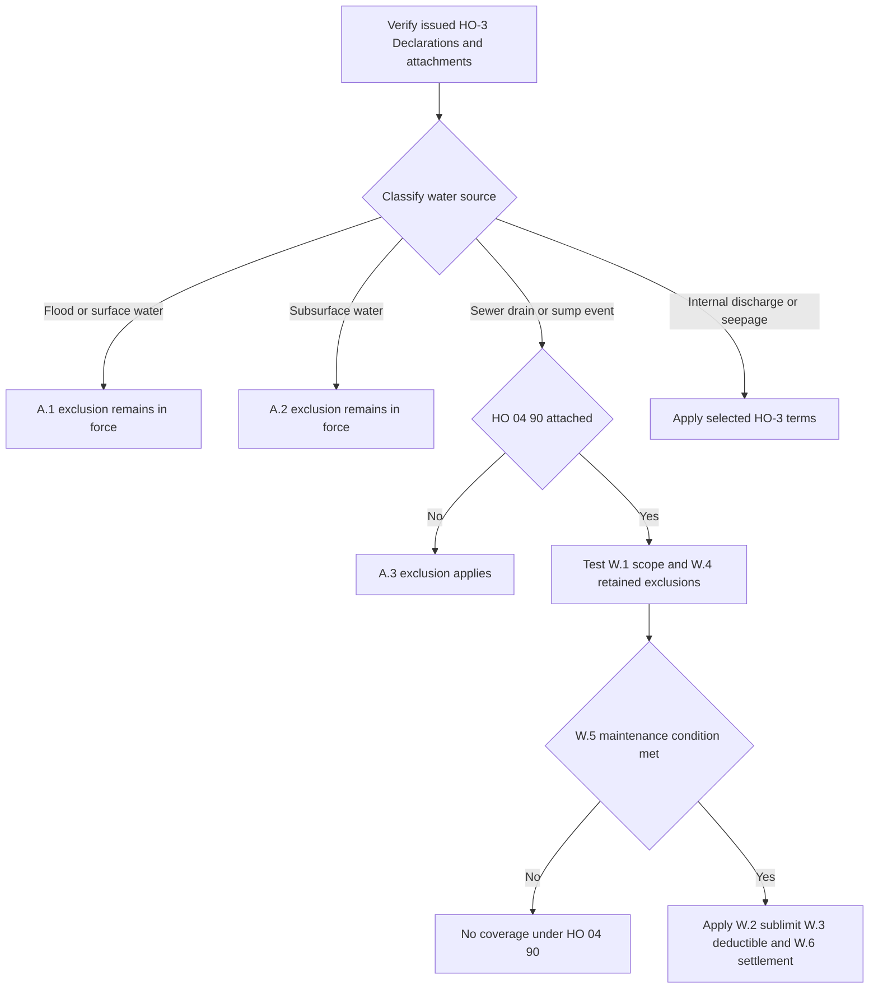

## Start with the issued policy

This is a Section I property-coverage analysis, not flood insurance and not a presumption that a water-backup endorsement exists. Before classifying water, retain the policy-written date, issued HO-3 edition, Declarations, and endorsement schedule. **HO-3 2011-05** remains controlling for policies written under that edition regardless of when a loss is reported; **HO-3 2018-09** applies to policies written on or after 2018-09-01. A later form does not supply omitted terms for an earlier issued policy. [2011-05 applicability](repo://forms/HO/MS/HO-3/2011-05.md#L1-L7) · [2018-09 applicability](repo://forms/HO/MS/HO-3/2018-09.md#L1-L4)

Both supplied forms exclude the A.3 sewer/drain-backup and sump-event category unless **HO 04 90 Water Backup and Sump Discharge or Overflow** is attached. The 2018-09 base form also says that an attached endorsement provides coverage to the sublimit stated in that endorsement. HO 04 90 (2010-10) identifies itself as an HO-3 endorsement that modifies Section I Exclusions A.3; it is not an automatic component of either base form. [HO-3 2011-05 A.3](repo://forms/HO/MS/HO-3/2011-05.md#L59-L66) · [HO-3 2018-09 A.3](repo://forms/HO/MS/HO-3/2018-09.md#L69-L77) · [HO 04 90 attachment and scope](repo://forms/HO/MS/HO-04-90/2010-10.md#L1-L8)

For the broader Section I entry gates and exclusions, see [Section I Property Perils and General Exclusions](/openwiki/coverage/property/perils-and-general-exclusions.md). In the 2018-09 form, Coverage A/B begins with direct physical loss subject to exclusions, while Coverage C also has the P.2 named-peril gate. Neither an endorsement sublimit nor a settlement term independently establishes a covered loss. [HO-3 2018-09 P.1–P.2](repo://forms/HO/MS/HO-3/2018-09.md#L59-L64)

## Classify the water source before the damage

“Flooding,” “backup,” or “leak” in a first report is not the contractual conclusion. Establish the source and entry path before applying amount or settlement terms. The classifications below are related but not interchangeable.

| Source and controlling provision | Contract boundary | Facts and edition boundary |
| --- | --- | --- |
| **Flood, surface water, waves, tidal water, storm surge, or overflow of a body of water** — A.1 | Both forms exclude loss caused directly or indirectly by this category **“whether or not driven by wind.”** HO 04 90 W.4 says it does not cover this loss and that A.1 **“continues to apply in full.”** It is not flood coverage. [2011 A.1 and A.3](repo://forms/HO/MS/HO-3/2011-05.md#L59-L66) · [2018 A.1 and A.3](repo://forms/HO/MS/HO-3/2018-09.md#L69-L77) · [HO 04 90 W.4](repo://forms/HO/MS/HO-04-90/2010-10.md#L17-L21) | Establish whether water reached the property across ground or came from an A.1-listed source. **Only 2018-09** adds A.4: A.1–A.3 apply **“regardless of any other cause or event contributing concurrently or in any sequence to the loss.”** Do not add that anti-concurrent-causation wording to a 2011-05 analysis. |
| **Water below the surface of the ground** — A.2 | Both forms exclude loss caused directly or indirectly by this category, including water that exerts pressure on or seeps or leaks through a building, foundation, swimming pool, or other structure. HO 04 90 W.4 expressly preserves A.2. [2011 A.2 and A.3](repo://forms/HO/MS/HO-3/2011-05.md#L61-L66) · [2018 A.2 and A.3](repo://forms/HO/MS/HO-3/2018-09.md#L71-L77) · [HO 04 90 W.4](repo://forms/HO/MS/HO-04-90/2010-10.md#L19-L21) | Establish the entry path. Water found in a basement, or the presence of a sump, does not by itself prove either subsurface water or a W.1 sump event. The quoted 2018 A.4 concurrent/sequential-cause rule applies to A.2; it is not in the supplied 2011-05 wording. |
| **Water or waterborne material backing up through a sewer or drain, or overflowing or discharging from a sump, sump pump, or related equipment** — A.3 | Without attached HO 04 90, both base forms exclude this category. With the endorsement attached, W.1 supplies the limited A/B/C direct-physical-loss route. The 2018 A.3 exclusion and W.1 each expressly address an event resulting from mechanical breakdown of the equipment. [2011 A.3](repo://forms/HO/MS/HO-3/2011-05.md#L63-L66) · [2018 A.3–A.4](repo://forms/HO/MS/HO-3/2018-09.md#L75-L77) · [HO 04 90 W.1](repo://forms/HO/MS/HO-04-90/2010-10.md#L5-L8) | Verify actual attachment and edition, then test the W.1 event, W.4 retained exclusions, W.5 maintenance condition, and W.2/W.3/W.6 payment terms. On 2018-09, preserve A.4’s quoted concurrent/sequential-cause language; do not attribute it to 2011-05. |
| **Accidental internal discharge or overflow** | This is not A.3 simply because the damage involves water. In 2018-09, P.2 lists accidental discharge or overflow of water or steam **“from within a plumbing, heating, or air conditioning system”** as a Coverage C named peril; A/B use P.1’s direct-physical-loss grant subject to exclusions. [2018 P.1–P.2](repo://forms/HO/MS/HO-3/2018-09.md#L59-L64) | P.2 does not name household appliances in that listed internal-discharge peril. Identify the property coverage, source, system, onset, and other exclusions rather than treating every appliance or moisture condition as this peril. The supplied 2011-05 text has no separately numbered P.1/P.2 provision; do not import the 2018 gate into it. [2011 property coverages and exclusions](repo://forms/HO/MS/HO-3/2011-05.md#L25-L80) |
| **Continuous or repeated seepage or leakage** — 2018-09 C.3 | The 2018-09 form excludes water or steam seepage/leakage over weeks, months, or years from within a plumbing, heating, or air-conditioning system or a household appliance. It does not exclude loss that is **“sudden and accidental”** as Definition 5 defines it. [2018 C.3](repo://forms/HO/MS/HO-3/2018-09.md#L83-L90) | Definition 5 requires an event both abrupt in onset and unintended from the insured’s standpoint. A condition that develops gradually, or was known and not remedied, is not sudden and accidental merely because effects appear later. C.3 and Definition 5 are absent from the supplied 2011-05 form; keep them out of a 2011-05 analysis. [2018 Definition 5](repo://forms/HO/MS/HO-3/2018-09.md#L19-L20) · [2011 exclusions](repo://forms/HO/MS/HO-3/2011-05.md#L57-L80) |

### Source-to-coverage decision path

*The flow separates A.1/A.2 exclusions from the attachment-dependent A.3 route, then applies the endorsement’s remaining conditions and payment terms.* [HO-3 2018-09 A.1–A.4](repo://forms/HO/MS/HO-3/2018-09.md#L69-L77) · [HO 04 90 W.1–W.6](repo://forms/HO/MS/HO-04-90/2010-10.md#L5-L31)

## HO 04 90: narrow A.3 write-back

When **HO 04 90 (2010-10) is actually attached**, W.1 covers direct physical loss to property described in Coverage A, B, and C caused by the described sewer/drain backup or sump-related overflow or discharge, **“whether or not the backup, overflow, or discharge results from mechanical breakdown of that equipment.”** This conclusion follows the base A.3 exception and the attached endorsement together; it is a defined backup/sump route, not a general water-damage grant. [HO-3 2011-05 A.3](repo://forms/HO/MS/HO-3/2011-05.md#L63-L66) · [HO-3 2018-09 A.3](repo://forms/HO/MS/HO-3/2018-09.md#L75-L77) · [HO 04 90 W.1](repo://forms/HO/MS/HO-04-90/2010-10.md#L5-L8)

The write-back has hard retained boundaries. W.4 says that it does not provide coverage for the A.1 flood/surface-water category and that A.1 **“continues to apply in full.”** It separately says it does not provide coverage for A.2 water below the surface of the ground and that A.2 **“continues to apply in full.”** Read each retained exclusion with the selected base form: on 2018-09, A.4 says A.1–A.3 apply **“regardless of any other cause or event contributing concurrently or in any sequence to the loss.”** [2011 A.1–A.3](repo://forms/HO/MS/HO-3/2011-05.md#L59-L66) · [2018 A.1–A.4](repo://forms/HO/MS/HO-3/2018-09.md#L69-L77) · [HO 04 90 W.4](repo://forms/HO/MS/HO-04-90/2010-10.md#L17-L21)

### Amount, deductible, and settlement controls

| Term | Required application under attached HO 04 90 |
| --- | --- |
| **Policy-period sublimit** | The most payable for **all loss under the endorsement in any one policy period** is **$5,000**, unless a higher limit is shown for the endorsement in the Declarations. It is **“part of, and not in addition to”** the Coverage A/B/C limits. Track prior payments against the same policy-period allowance; do not add a new $5,000 layer above an underlying limit. [HO 04 90 W.2](repo://forms/HO/MS/HO-04-90/2010-10.md#L9-L12) |
| **Deductible** | A separate **$500** deductible applies to **each loss under the endorsement**. The Section I deductible in the Declarations does not apply to loss covered under HO 04 90; do not stack it with W.3’s deductible. [HO 04 90 W.3](repo://forms/HO/MS/HO-04-90/2010-10.md#L13-L15) |
| **Coverage A/B settlement** | Settle under the basis stated in the policy to which the endorsement attaches. W.6 does not create a new A/B settlement formula. [HO 04 90 W.6](repo://forms/HO/MS/HO-04-90/2010-10.md#L27-L31) |
| **Coverage C settlement** | Settle at **actual cash value** despite a replacement-cost personal-property endorsement, unless the Declarations state otherwise for HO 04 90. This W.6 route controls the endorsement loss. [HO 04 90 W.6](repo://forms/HO/MS/HO-04-90/2010-10.md#L27-L31) |

These are coverage-route terms, not post-coverage administrative options. For underlying property scope and general terms, see [Dwelling](/openwiki/coverage/coverage-a/dwelling.md), [Other Structures](/openwiki/coverage/coverage-b/other-structures.md), [Personal Property](/openwiki/coverage/coverage-c/personal-property.md), and [Section I Claim Conditions, Payment, and Deductibles](/openwiki/coverage/property/claim-conditions-and-deductibles.md).

### Maintenance condition

W.5 provides:

> “We do not cover loss under this endorsement if the backup, overflow, or discharge resulted from an insured's failure to maintain the sewer line, drain, sump, or sump pump serving the residence premises, where that failure was known to the insured before the loss and a reasonable person would have remedied it.”

Document each stated element: the serving line or equipment, the maintenance failure, causation between that failure and the event, pre-loss insured knowledge, and the reasonable-person/remedy facts. This is distinct from base-form C.1 neglect, which concerns failure to save and preserve property at and after a loss. W.5 is a pre-loss, known-and-unremedied condition for coverage under this endorsement. [HO 04 90 W.5](repo://forms/HO/MS/HO-04-90/2010-10.md#L23-L25) · [2011 C.1](repo://forms/HO/MS/HO-3/2011-05.md#L71-L75) · [2018 C.1](repo://forms/HO/MS/HO-3/2018-09.md#L83-L87)

All other policy provisions apply. Therefore, W.1 does not bypass the selected property scope, applicable cause-of-loss gate, retained A.1/A.2 exclusions, other exclusions, Declarations changes, or Section I duties. [HO 04 90 W.1 and W.6](repo://forms/HO/MS/HO-04-90/2010-10.md#L5-L8) · [HO 04 90 all-other-provisions clause](repo://forms/HO/MS/HO-04-90/2010-10.md#L27-L31)

## Adjacent write-back and operating boundaries

### Resulting fungi, rot, or bacteria is a separate path

Fungi, wet/dry rot, or bacteria following a backup requires a separate analysis. When attached, HO 04 81 displaces C.2 only to its stated extent: the condition must result from a Section I insured peril during the policy period. Its M.2 identifies water backup covered by an attached water-backup endorsement as an example of a covered moisture-producing event. Thus a backup-related condition may require both endorsements and both sets of terms; neither writes back flood, surface water, subsurface water, or the 2018 C.3 long-duration-leakage barrier. [HO-3 2018-09 C.2–C.3](repo://forms/HO/MS/HO-3/2018-09.md#L83-L90) · [HO 04 81 M.1–M.2](repo://forms/HO/MS/HO-04-81/2018-09.md#L5-L17) · [HO 04 90 W.1 and W.4](repo://forms/HO/MS/HO-04-90/2010-10.md#L5-L8) [HO 04 90 W.4](repo://forms/HO/MS/HO-04-90/2010-10.md#L17-L21)

See [Fungi, Rot, and Bacteria](/openwiki/coverage/property/fungi-rot-and-bacteria.md) for the separate trigger, aggregate, included-cost, and mitigation analysis.

### Claim handling is operational, not contract language

The internal water-loss guidance instructs adjusters to establish and document source before evaluating damaged property; it expressly says the guidance is not policy language and must not be quoted to an insured or claimant. Preserve the selected form, Declarations, verified endorsement attachment and edition, source/entry-path evidence, onset and duration evidence, maintenance/service history, damage inventory, and prior HO 04 90 payments in the policy period. [guidance status and source-first rule](repo://guidelines/claims/water-loss-handling.md#L1-L11) · [water-backup documentation](repo://guidelines/claims/water-loss-handling.md#L25-L33)

The guide directs technical referral where physical evidence cannot establish source, two or more source categories are plausible, a foundation is involved, the insured has a public adjuster or counsel, loss exceeds $25,000, or a denial would rest primarily on duration. It directs a reservation of rights before investigation where coverage may turn on 2018 duration or W.5 maintenance. These are escalation controls, not extra policy conditions or coverage-letter language. [referral triggers](repo://guidelines/claims/water-loss-handling.md#L51-L55) · [reservation-of-rights direction](repo://guidelines/claims/water-loss-handling.md#L57-L59) · [2018 Definition 5 and C.3](repo://forms/HO/MS/HO-3/2018-09.md#L19-L20) [2018 C.3](repo://forms/HO/MS/HO-3/2018-09.md#L83-L90) · [HO 04 90 W.5](repo://forms/HO/MS/HO-04-90/2010-10.md#L23-L25)

For intake, mitigation, evidence, vendor, escalation, and communication workflow, see [Water-Loss Handling](/openwiki/operations/claims-water-loss-handling.md).

### Underwriting configuration is not claim coverage

HO 04 90 is optional coverage written by attachment. Florida guidance permits binding the base W.2 sublimit without referral, requires a battery-backed sump pump above $10,000 where any finished area is below grade, and puts risks with two or more water claims of any type in five years outside appetite for the endorsement. Texas guidance permits up to $25,000 without referral where there has been no water-backup claim in five years, requires a battery-backed sump pump for a finished below-grade basement above $10,000, and places risks with two or more water-backup claims in five years outside appetite for the endorsement. [Florida H.4](repo://guidelines/appetite/fl-homeowners.md#L27-L33) · [Texas G.3](repo://guidelines/appetite/tx-homeowners.md#L23-L29)

Neither guide changes an issued policy, proves attachment, or permits representing the endorsement as flood coverage. For their binding and authority context, see [Florida Appetite](/openwiki/underwriting/florida-appetite.md) and [Texas Appetite](/openwiki/underwriting/texas-appetite.md). [Florida guidance status](repo://guidelines/appetite/fl-homeowners.md#L1-L4) · [Texas guidance status](repo://guidelines/appetite/tx-homeowners.md#L1-L4)

## Focused file-review tests

1. **Wind-driven surface water reaches a dwelling, then a drain backs up.** Preserve A.1’s **“whether or not driven by wind”** wording and, for 2018-09, A.4’s concurrent/sequential-cause wording. HO 04 90 W.4 does not write back the A.1 source.
2. **Groundwater enters through a foundation near a sump.** Establish the actual entry path. The sump’s presence does not itself establish a W.1 event; A.2 remains in force under W.4.
3. **A sump pump mechanically fails and overflows.** Verify the A.3 exception and HO 04 90 attachment, then test W.1’s mechanical-breakdown wording, W.4, W.5, W.2 policy-period sublimit, W.3 deductible, and W.6 settlement.
4. **A slow plumbing leak is discovered after months.** On 2018-09, determine duration, onset, knowledge, and remediation under C.3 and Definition 5 rather than treating discovery as sudden and accidental. Do not impose these 2018-only provisions on the supplied 2011-05 form.
5. **Damaged personal property has a replacement-cost endorsement.** For a loss under HO 04 90, W.6 requires Coverage C actual-cash-value settlement unless the endorsement Declarations state otherwise.
6. **A slow-drain report predates a backup.** Do not equate the report with a W.5 result. Determine whether a known failure to maintain the serving line/drain/sump/pump caused the event and whether a reasonable person would have remedied it.
7. **Backup is followed by mold.** Keep the water-backup and fungi analyses separate: verify HO 04 90 for the backup and HO 04 81 for fungi/rot/bacteria, then apply their separate limits and conditions.
