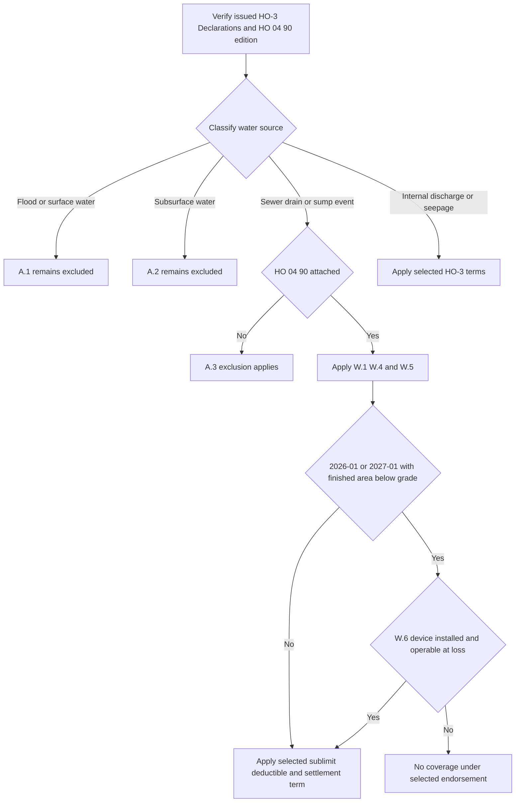

## Start with the issued policy and endorsement edition

This is Section I property analysis, not flood insurance and not a presumption that water-backup coverage exists. Preserve the policy-written date, selected HO-3 edition, complete Declarations, endorsement schedule, and exact attached HO 04 90 edition before stating a coverage, deductible, limit, condition, or settlement result.

The base-form and endorsement selections are separate. HO-3 2011-05 remains in force for policies written under it regardless of later reporting, while 2018-09 applies to policies written on or after 2018-09-01. Both forms make the A.3 exception attachment-dependent: **“This exclusion does not apply if endorsement HO 04 90 Water Backup and Sump Discharge or Overflow is attached to this policy.”** [HO-3 2011-05 status and A.3](repo://forms/HO/MS/HO-3/2011-05.md#L1-L7) [A.3](repo://forms/HO/MS/HO-3/2011-05.md#L59-L66) · [HO-3 2018-09 status and A.3](repo://forms/HO/MS/HO-3/2018-09.md#L1-L4) [A.3](repo://forms/HO/MS/HO-3/2018-09.md#L69-L77)

Select a verified attached HO 04 90 separately:

| Verified attached endorsement and policy-written date | Governing rule | Do not substitute |
| --- | --- | --- |
| **2010-10, before 2026-01-01** | The form says it remains in force for policies written under it and governs adjustment “regardless of when that loss is reported.” | Do not apply the later $10,000 sublimit, $1,000 deductible, or W.6 device condition. [2010-10 status](repo://forms/HO/MS/HO-04-90/2010-10.md#L1-L7) |
| **2026-01, 2026-01-01 through 2026-12-31** | 2026-01 replaced 2010-10 from 2026-01-01. It is now superseded only for policies written on or after 2027-01-01, and expressly remains in force for policies written under it regardless of report date. | Do not use 2010-10’s $5,000/$500/W.6 numbering or treat 2027-01 as retroactive. [2026-01 status](repo://forms/HO/MS/HO-04-90/2026-01.md#L1-L8) |
| **2027-01, on or after 2027-01-01** | 2027-01 replaces 2026-01 for policies written on or after 2027-01-01. | Do not select this edition from the base-form edition or a report date. [2027-01 header and replacement rule](repo://forms/HO/MS/HO-04-90/2027-01.md#L1-L4) |
| **Attachment, edition, or written date unverified** | Obtain the issued endorsement and Declarations before reaching an endorsement coverage or payment conclusion. | A repository form, internal guide, report date, or water-damage label does not prove attachment or select an edition. [HO-3 2011-05 A.3](repo://forms/HO/MS/HO-3/2011-05.md#L63-L66) · [HO-3 2018-09 A.3](repo://forms/HO/MS/HO-3/2018-09.md#L75-L77) |

HO 04 90 attaches to HO-3 and modifies Section I Exclusions A.3; it is not an automatic part of either supplied base form. A later form supplies no omitted term for an earlier issued policy. See [Governing Form Editions and Policy Assembly](/openwiki/coverage/policy-editions-and-governing-forms.md). [2010-10 header](repo://forms/HO/MS/HO-04-90/2010-10.md#L1-L7) · [2026-01 header](repo://forms/HO/MS/HO-04-90/2026-01.md#L1-L8) · [2027-01 header](repo://forms/HO/MS/HO-04-90/2027-01.md#L1-L4)

## Classify the water source before the damage

“Flooding,” “backup,” and “leak” in a first report are not contractual conclusions. Establish the source and entry path before applying a sublimit, deductible, or settlement provision.

| Source and controlling provision | Contract boundary | Edition-specific point |
| --- | --- | --- |
| **Flood, surface water, waves, tidal water, storm surge, or overflow of a body of water — A.1** | Both HO-3 forms exclude this category, whether or not wind-driven. **Each HO 04 90 edition’s W.4 acts separately and says “Section I — Exclusions A.1 continues to apply in full.”** Thus W.1 is not flood coverage. [2011 A.1](repo://forms/HO/MS/HO-3/2011-05.md#L59-L63) · [2018 A.1](repo://forms/HO/MS/HO-3/2018-09.md#L69-L72) · [2010-10 W.4](repo://forms/HO/MS/HO-04-90/2010-10.md#L21-L25) · [2026-01 W.4](repo://forms/HO/MS/HO-04-90/2026-01.md#L29-L37) · [2027-01 W.4](repo://forms/HO/MS/HO-04-90/2027-01.md#L25-L33) | Only 2018-09 adds A.4, applying A.1–A.3 regardless of another cause or event contributing concurrently or in sequence. [2018 A.4](repo://forms/HO/MS/HO-3/2018-09.md#L75-L77) |
| **Water below the surface of the ground — A.2** | Both HO-3 forms exclude the stated pressure, seepage, or leakage through a building, foundation, pool, or other structure. **Each HO 04 90 edition’s W.4 acts separately and says “Section I — Exclusions A.2 continues to apply in full.”** [2011 A.2](repo://forms/HO/MS/HO-3/2011-05.md#L61-L64) · [2018 A.2](repo://forms/HO/MS/HO-3/2018-09.md#L71-L74) · [2010-10 W.4](repo://forms/HO/MS/HO-04-90/2010-10.md#L21-L25) · [2026-01 W.4](repo://forms/HO/MS/HO-04-90/2026-01.md#L29-L37) · [2027-01 W.4](repo://forms/HO/MS/HO-04-90/2027-01.md#L25-L33) | A basement, foundation, or sump does not alone establish a subsurface source or a W.1 sump event. |
| **Sewer/drain backup or sump-related overflow/discharge — A.3** | Without attached HO 04 90, A.3 excludes this category. **Each HO 04 90 edition’s W.1 acts narrowly:** “We cover direct physical loss” to Coverage A/B/C property from the stated backup, overflow, or discharge, including one resulting from mechanical breakdown. [2011 A.3](repo://forms/HO/MS/HO-3/2011-05.md#L63-L66) · [2018 A.3](repo://forms/HO/MS/HO-3/2018-09.md#L75-L77) · [2010-10 W.1](repo://forms/HO/MS/HO-04-90/2010-10.md#L9-L12) · [2026-01 W.1](repo://forms/HO/MS/HO-04-90/2026-01.md#L10-L15) · [2027-01 W.1](repo://forms/HO/MS/HO-04-90/2027-01.md#L6-L11) | Test W.4 retained exclusions and W.5; then apply the selected edition’s payment terms and, for 2026-01/2027-01 only, W.6. |
| **Accidental internal discharge or overflow** | Water damage is not automatically A.3. In 2018-09, A/B use P.1’s direct-physical-loss grant subject to exclusions, while P.2 lists accidental discharge or overflow from within plumbing, heating, or air-conditioning systems as a Coverage C named peril. [2018 P.1–P.2](repo://forms/HO/MS/HO-3/2018-09.md#L59-L64) | P.2 does not name household appliances. The supplied 2011-05 text has no separately numbered P.1/P.2 provision; do not import the 2018 gate. [2011 property coverage and exclusions](repo://forms/HO/MS/HO-3/2011-05.md#L25-L80) |
| **Continuous or repeated seepage or leakage — 2018-09 C.3** | 2018-09 excludes water/steam seepage or leakage over “weeks, months, or years” from the listed systems or a household appliance, except loss “sudden and accidental” as Definition 5 defines it. [2018 C.3](repo://forms/HO/MS/HO-3/2018-09.md#L83-L90) | Definition 5 requires an event “abrupt in onset and unintended” and rejects a gradual or known-unremedied condition regardless of discovery date. Those provisions are absent from the supplied 2011-05 text. [2018 Definition 5](repo://forms/HO/MS/HO-3/2018-09.md#L19-L20) · [2011 exclusions](repo://forms/HO/MS/HO-3/2011-05.md#L57-L80) |

### Source-to-coverage decision path

*The flow isolates W.1’s A.3 route from W.4’s separate preservation of A.1 and A.2, and introduces the W.6 device test only for the two later endorsement editions when its finished-below-grade trigger exists.* [2010-10 W.1 and W.4–W.5](repo://forms/HO/MS/HO-04-90/2010-10.md#L9-L29) · [2026-01 W.1 and W.4–W.6](repo://forms/HO/MS/HO-04-90/2026-01.md#L10-L51) · [2027-01 W.1 and W.4–W.6](repo://forms/HO/MS/HO-04-90/2027-01.md#L6-L48)

## HO 04 90 is a narrow A.3 write-back

**W.1 writes back A.3, not every water exclusion.** In each edition, W.1 covers the described direct physical loss to Coverage A, B, or C property caused by sewer/drain backup or sump-related overflow/discharge, “whether or not” mechanical breakdown caused the event. [2010-10 W.1](repo://forms/HO/MS/HO-04-90/2010-10.md#L9-L12) · [2026-01 W.1](repo://forms/HO/MS/HO-04-90/2026-01.md#L10-L15) · [2027-01 W.1](repo://forms/HO/MS/HO-04-90/2027-01.md#L6-L11)

**W.4 separately preserves A.1 and A.2.** It says the endorsement “does not provide coverage” for the listed flood/surface-water sources and that A.1 “continues to apply in full”; it separately does the same for water below ground and A.2. A sewer or sump label cannot turn either excluded source into a W.1 event. [2010-10 W.4](repo://forms/HO/MS/HO-04-90/2010-10.md#L21-L25) · [2026-01 W.4](repo://forms/HO/MS/HO-04-90/2026-01.md#L29-L37) · [2027-01 W.4](repo://forms/HO/MS/HO-04-90/2027-01.md#L25-L33)

**W.5 is a distinct, shared pre-loss condition.** It says, “We do not cover loss under this endorsement” if the event resulted from an insured’s failure to maintain the serving sewer line, drain, sump, or sump pump, the failure was known before loss, and a reasonable person would have remedied it. Develop the asserted maintenance failure, service item, causation, pre-loss knowledge, and reasonable-remedy facts. This differs from base C.1 neglect, which addresses reasonable efforts to save and preserve property at and after a loss. [2010-10 W.5](repo://forms/HO/MS/HO-04-90/2010-10.md#L27-L29) · [2026-01 W.5](repo://forms/HO/MS/HO-04-90/2026-01.md#L39-L44) · [2027-01 W.5](repo://forms/HO/MS/HO-04-90/2027-01.md#L35-L40) · [2011 C.1](repo://forms/HO/MS/HO-3/2011-05.md#L71-L75) · [2018 C.1](repo://forms/HO/MS/HO-3/2018-09.md#L83-L87)

“All other provisions of the policy apply.” W.1 therefore does not bypass selected property scope, an applicable cause-of-loss gate, retained water exclusions, other exclusions, Declarations, or Section I conditions. [2010-10 all-other-provisions clause](repo://forms/HO/MS/HO-04-90/2010-10.md#L31-L35) · [2026-01 all-other-provisions clause](repo://forms/HO/MS/HO-04-90/2026-01.md#L53-L60) · [2027-01 all-other-provisions clause](repo://forms/HO/MS/HO-04-90/2027-01.md#L50-L57)

## Payment and eligibility: retain the selected edition

| Term after a covered W.1 event | HO 04 90 2010-10 legacy | HO 04 90 2026-01 and 2027-01 |
| --- | --- | --- |
| **W.2 policy-period sublimit** | “The most we will pay” is **$5,000** for all endorsement loss in one policy period unless a higher limit is in the Declarations; it is part of, not in addition to, A/B/C limits. [2010-10 W.2](repo://forms/HO/MS/HO-04-90/2010-10.md#L13-L15) | The same outcome-determinative wording sets **$10,000**, subject to a higher declared limit and the same within-limit treatment. [2026-01 W.2](repo://forms/HO/MS/HO-04-90/2026-01.md#L17-L22) · [2027-01 W.2](repo://forms/HO/MS/HO-04-90/2027-01.md#L13-L18) |
| **W.3 deductible** | A separate **$500** deductible applies to each endorsement loss, and the Section I Declarations deductible “does not apply to loss covered here.” [2010-10 W.3](repo://forms/HO/MS/HO-04-90/2010-10.md#L17-L19) | A separate **$1,000** deductible applies on the same basis. [2026-01 W.3](repo://forms/HO/MS/HO-04-90/2026-01.md#L24-L27) · [2027-01 W.3](repo://forms/HO/MS/HO-04-90/2027-01.md#L20-L23) |
| **Finished area below grade** | No backflow-prevention requirement appears. Its W.6 is the settlement provision. [2010-10 W.5–W.6](repo://forms/HO/MS/HO-04-90/2010-10.md#L27-L33) | W.6 says coverage applies “only if” an equivalent device was installed and operable on the serving sewer line “at the time of loss.” 2026-01 calls the requirement new; 2027-01 says it is carried unchanged. [2026-01 W.6](repo://forms/HO/MS/HO-04-90/2026-01.md#L46-L51) · [2027-01 W.6](repo://forms/HO/MS/HO-04-90/2027-01.md#L42-L48) |
| **A/B and C settlement** | W.6 leaves A/B on the attached policy’s basis; C is actual cash value despite a replacement-cost personal-property endorsement unless the HO 04 90 Declarations state otherwise. [2010-10 W.6](repo://forms/HO/MS/HO-04-90/2010-10.md#L31-L33) | W.7 gives the same A/B and C results. [2026-01 W.7](repo://forms/HO/MS/HO-04-90/2026-01.md#L53-L58) · [2027-01 W.7](repo://forms/HO/MS/HO-04-90/2027-01.md#L50-L55) |

W.2, W.3, W.6, and W.7 alter the route’s amount, deductible, eligibility, or settlement mechanics; none is a separate coverage write-back. Use one selected W.3 deductible, rather than stacking it with the base Section I deductible that otherwise appears in the Declarations. [2011 S.4](repo://forms/HO/MS/HO-3/2011-05.md#L89-L92) · [2018 S.5](repo://forms/HO/MS/HO-3/2018-09.md#L109-L112) · [2010-10 W.3](repo://forms/HO/MS/HO-04-90/2010-10.md#L17-L19) · [2026-01 W.3](repo://forms/HO/MS/HO-04-90/2026-01.md#L24-L27) · [2027-01 W.3](repo://forms/HO/MS/HO-04-90/2027-01.md#L20-L23)

### Apply W.6 precisely in 2026-01 and 2027-01

First establish that the **residence premises has a finished area below grade**. Only then does W.6 require an installed and operable **“backwater valve or equivalent backflow prevention device”** on the serving sewer line at loss. A loss near a basement or a sump pump’s presence does not satisfy the trigger or device test. If the trigger is absent, W.6 does not add a device condition; if 2010-10 governs, do not import this condition at all. [2026-01 W.6](repo://forms/HO/MS/HO-04-90/2026-01.md#L46-L51) · [2027-01 W.6](repo://forms/HO/MS/HO-04-90/2027-01.md#L42-L48) · [2010-10 W.5–W.6](repo://forms/HO/MS/HO-04-90/2010-10.md#L27-L33)

A battery-backed sump-pump requirement in the Florida or Texas appetite guide is an underwriting rule, not contract language. Those guides expressly are not policy contracts; their higher-limit/below-grade criteria neither prove attachment nor satisfy, replace, or add W.6. [Florida guide status and H.4](repo://guidelines/appetite/fl-homeowners.md#L1-L4) [H.4](repo://guidelines/appetite/fl-homeowners.md#L27-L33) · [Texas guide status and G.3](repo://guidelines/appetite/tx-homeowners.md#L1-L4) [G.3](repo://guidelines/appetite/tx-homeowners.md#L23-L29) · [2026-01 W.6](repo://forms/HO/MS/HO-04-90/2026-01.md#L46-L51) · [2027-01 W.6](repo://forms/HO/MS/HO-04-90/2027-01.md#L42-L48)

For underlying property scope and Section I conditions, see [Other Structures](/openwiki/coverage/coverage-b/other-structures.md), [Personal Property](/openwiki/coverage/coverage-c/personal-property.md), and [Section I Claim Conditions, Payment, and Deductibles](/openwiki/coverage/property/claim-conditions-and-deductibles.md).

## Resulting fungi, rot, or bacteria is a separate path

Fungi, wet/dry rot, or bacteria following a backup requires a separately verified HO 04 81 attachment. For the supplied 2018-09 form, M.1 writes back C.2 only to its stated extent: covered A/B/C property damaged by fungi, rot, or bacteria resulting from a Section I insured peril in the policy period. M.2 independently requires an underlying covered moisture event, identifies backup covered by an attached water-backup endorsement as an example, and preserves the A.1, A.2, and C.3 barriers. [HO-3 2018-09 C.2–C.3](repo://forms/HO/MS/HO-3/2018-09.md#L83-L90) · [HO 04 81 M.1–M.2](repo://forms/HO/MS/HO-04-81/2018-09.md#L5-L17)

A backup-related fungi claim can require both the selected HO 04 90 analysis and HO 04 81 analysis. For either later HO 04 90 edition, complete the triggered W.6 device test before treating backup as the covered M.2 underlying event. Keep the endorsements’ limits, deductibles, settlement terms, conditions, and mitigation requirements separate. See [Fungi, Rot, and Bacteria](/openwiki/coverage/property/fungi-rot-and-bacteria.md).

## Claim handling boundary and focused file-review tests

The internal water-loss guide requires source-first documentation, technical referral for its stated unresolved-source, competing-source, foundation, representation, large-loss, and duration-denial triggers, and a reservation of rights before investigation where duration or W.5 may control. It is not policy language and must not be quoted to an insured or claimant. Its $5,000/$500/W.6 description is legacy guidance and cannot select an edition or override the 2026-01/2027-01 $10,000/$1,000/W.6/W.7 terms. [guidance status and source-first direction](repo://guidelines/claims/water-loss-handling.md#L1-L11) · [guide’s backup terms](repo://guidelines/claims/water-loss-handling.md#L25-L33) · [referral and reservation direction](repo://guidelines/claims/water-loss-handling.md#L51-L59)

Preserve the issued policy and selected endorsement edition; Declarations limit; source and entry-path evidence; maintenance/service history; damage allocation; prior endorsement payments in the policy period; and, if a later-edition W.6 trigger applies, below-grade status plus device type, location, installation, and at-loss operability evidence. For intake, mitigation, evidence, escalation, and communication workflow, see [Water-Loss Handling](/openwiki/operations/claims-water-loss-handling.md).

Use these focused tests before communicating a coverage or payment position:

1. **Wind-driven surface water reaches the property, then a drain backs up.** Keep A.1 separate. W.4 preserves it; W.1 does not convert the loss to flood coverage. Apply 2018-09 A.4 only if that base form governs.
2. **Groundwater enters through a foundation near a sump.** Establish the actual entry path. A sump’s presence does not itself establish W.1, and W.4 separately preserves A.2.
3. **A sump pump mechanically fails and overflows.** Verify attachment and edition; test W.1, W.4, and W.5. For 2026-01 or 2027-01, test W.6 only if there is finished area below grade, then apply that edition’s W.2/W.3/W.7 terms.
4. **A finished basement is below grade under 2026-01 or 2027-01.** Document whether an installed and operable backwater valve or equivalent device was on the serving sewer line at loss. Do not replace that contract test with a battery-backed-sump underwriting criterion.
5. **A slow plumbing leak is discovered after months.** On 2018-09, evaluate C.3 and Definition 5 using onset, duration, knowledge, and remediation—not discovery alone. Do not impose those provisions on the supplied 2011-05 text.
6. **A backup is followed by mold.** Independently verify HO 04 90 and HO 04 81, complete the selected water-backup route first, then apply HO 04 81’s separate trigger, limit, and mitigation terms.
