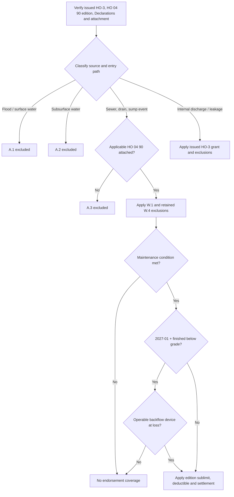

## Select the issued forms first

This is Section I property coverage, not flood insurance and not a presumption that water-backup coverage was purchased. Retain the policy-written date, issued HO-3 edition, Declarations, and endorsement schedule before deciding coverage. **HO-3 2011-05** remains governing for policies written under it regardless of report date; **HO-3 2018-09** applies to policies written on or after 2018-09-01. [HO-3 2011-05, heading](repo://forms/HO/MS/HO-3/2011-05.md#L1-L7) · [HO-3 2018-09, heading](repo://forms/HO/MS/HO-3/2018-09.md#L1-L4)

Likewise, **HO 04 90 2010-10** remains in force for policies written under that edition regardless of when a loss is reported. **HO 04 90 2027-01** applies to policies written on or after 2027-01-01. The 2010-10 endorsement identifies itself as superseded by 2027-01 for that cohort; neither edition supplies changed payment terms or conditions to a policy issued with the other edition. [HO 04 90 2010-10, heading](repo://forms/HO/MS/HO-04-90/2010-10.md#L1-L7) · [HO 04 90 2027-01, heading](repo://forms/HO/MS/HO-04-90/2027-01.md#L1-L4)

For either supplied HO-3 edition, A.3 excludes water or waterborne material that backs up through sewers or drains or overflows or discharges from a sump, sump pump, or related equipment unless HO 04 90 is attached. **HO-3 2018-09** also says the attached endorsement supplies coverage only to its stated sublimit and expressly includes mechanically caused backup/overflow in A.3. [HO-3 2011-05 §A.3](repo://forms/HO/MS/HO-3/2011-05.md#L59-L66) · [HO-3 2018-09 §A.3](repo://forms/HO/MS/HO-3/2018-09.md#L69-L77)

## Source classification controls the route

Establish source and entry path before evaluating damage or payment terms. The internal guide requires that sequence and is not policy language that may be quoted to an insured or claimant. [Water Loss Claim Handling Guidance §C.1](repo://guidelines/claims/water-loss-handling.md#L1-L11)

| Source | Edition-specific coverage boundary |
| --- | --- |
| **Flood, surface water, waves, tidal water, storm surge, or overflow of a body of water** | **HO-3 2011-05 A.1** and **HO-3 2018-09 A.1** exclude this loss, **“whether or not driven by wind.”** Both HO 04 90 editions preserve A.1 in full; their backup write-back is not flood coverage. [2011-05 §A.1](repo://forms/HO/MS/HO-3/2011-05.md#L59-L63) · [2018-09 §A.1](repo://forms/HO/MS/HO-3/2018-09.md#L69-L72) · [2010-10 §W.4](repo://forms/HO/MS/HO-04-90/2010-10.md#L21-L25) · [2027-01 §W.4](repo://forms/HO/MS/HO-04-90/2027-01.md#L25-L33) |
| **Water below the surface of the ground** | **HO-3 2011-05 A.2** and **HO-3 2018-09 A.2** exclude the stated pressure, seepage, or leakage through a building, foundation, pool, or other structure. Both HO 04 90 editions preserve A.2 in full. Water found near a sump is not, without the specified backup/overflow/discharge event, a covered backup. [2011-05 §A.2](repo://forms/HO/MS/HO-3/2011-05.md#L61-L64) · [2018-09 §A.2](repo://forms/HO/MS/HO-3/2018-09.md#L71-L74) · [2010-10 §W.4](repo://forms/HO/MS/HO-04-90/2010-10.md#L23-L25) · [2027-01 §W.4](repo://forms/HO/MS/HO-04-90/2027-01.md#L31-L33) |
| **Sewer/drain backup or sump-related overflow/discharge** | This is the A.3 category. With the applicable HO 04 90 attached, W.1 provides the limited direct-physical-loss route described below. Apply retained exclusions, conditions, sublimit, deductible, and settlement terms afterward. |
| **Internal discharge or long-duration leakage** | For **HO-3 2018-09**, A/B has the direct-physical-loss grant subject to exclusions, while Coverage C has named perils including accidental discharge/overflow **“from within a plumbing, heating, or air conditioning system.”** C.3 excludes listed-system or appliance seepage/leakage over weeks, months, or years, except loss that is **“sudden and accidental.”** Definition 5 requires an abrupt, unintended onset and rejects gradually developing or known-unremedied conditions regardless of when effects appear. Do not import those numbered 2018-09 provisions into the supplied **HO-3 2011-05** form. [2018-09 §P.1–P.2](repo://forms/HO/MS/HO-3/2018-09.md#L59-L64) · [2018-09 Definition 5](repo://forms/HO/MS/HO-3/2018-09.md#L19-L20) · [2018-09 §C.3](repo://forms/HO/MS/HO-3/2018-09.md#L83-L90) · [2011-05 property/exclusion sections](repo://forms/HO/MS/HO-3/2011-05.md#L25-L80) |

For **HO-3 2018-09 only**, A.4 applies A.1–A.3 **“regardless of any other cause or event contributing concurrently or in any sequence to the loss.”** The supplied **HO-3 2011-05** language has no A.4; use the issued edition rather than importing that rule. [2018-09 §A.1–A.4](repo://forms/HO/MS/HO-3/2018-09.md#L69-L77) · [2011-05 water-damage exclusion](repo://forms/HO/MS/HO-3/2011-05.md#L57-L66)

## The HO 04 90 write-back

**HO 04 90 2010-10 W.1** and **HO 04 90 2027-01 W.1** each modify the selected HO-3 A.3 exclusion for direct physical loss to Coverage A, B, or C property caused by the described sewer/drain backup or sump-related overflow/discharge, whether or not mechanical breakdown caused it. The endorsement does not create a general water-damage grant. [2010-10 §W.1](repo://forms/HO/MS/HO-04-90/2010-10.md#L7-L11) · [2027-01 §W.1](repo://forms/HO/MS/HO-04-90/2027-01.md#L3-L11) · [HO-3 2018-09 §A.3](repo://forms/HO/MS/HO-3/2018-09.md#L75-L77)

**HO 04 90 2010-10 W.4** and **HO 04 90 2027-01 W.4** preserve the selected HO-3 A.1 flood/surface-water and A.2 subsurface-water exclusions. Thus, a claim satisfying W.1 still fails on an A.1 or A.2 source that causes the loss; for HO-3 2018-09, also apply its A.4 concurrent/sequential-cause wording. [2010-10 §W.4](repo://forms/HO/MS/HO-04-90/2010-10.md#L21-L25) · [2027-01 §W.4](repo://forms/HO/MS/HO-04-90/2027-01.md#L25-L33) · [HO-3 2018-09 §A.4](repo://forms/HO/MS/HO-3/2018-09.md#L75-L77)

### Edition-specific payment terms

| Term | HO 04 90 2010-10 | HO 04 90 2027-01 |
| --- | --- | --- |
| **Policy-period sublimit** | W.2: $5,000 for all endorsement loss in one policy period unless the Declarations show a higher limit. | W.2: $10,000 for all endorsement loss in one policy period unless the Declarations show a higher limit. |
| **Relationship to underlying limits** | W.2 makes the sublimit **“part of, and not in addition to”** Coverage A/B/C limits. | W.2 uses the same **“part of, and not in addition to”** limitation. |
| **Deductible** | W.3 applies a separate $500 deductible to each endorsement loss; the Section I Declarations deductible does not apply. | W.3 applies a separate $1,000 deductible to each endorsement loss; the Section I Declarations deductible does not apply. |
| **Settlement** | W.6 keeps A/B on the attached policy basis and settles covered C property at ACV despite a replacement-cost personal-property endorsement, unless the endorsement Declarations say otherwise. | W.7 has the same A/B and Coverage C settlement rule. |

[HO 04 90 2010-10 §§W.2–W.3, W.6](repo://forms/HO/MS/HO-04-90/2010-10.md#L13-L19) · [HO 04 90 2010-10 §W.6](repo://forms/HO/MS/HO-04-90/2010-10.md#L31-L35) · [HO 04 90 2027-01 §§W.2–W.3](repo://forms/HO/MS/HO-04-90/2027-01.md#L13-L23) · [HO 04 90 2027-01 §W.7](repo://forms/HO/MS/HO-04-90/2027-01.md#L50-L57)

Track prior endorsement payments against the applicable edition's one-policy-period allowance. Do not stack its separate deductible with the base Section I deductible. For either edition, the C settlement term governs a covered endorsement loss notwithstanding an attached replacement-cost personal-property endorsement, unless that endorsement's Declarations say otherwise. [HO 04 90 2010-10 §§W.2–W.3, W.6](repo://forms/HO/MS/HO-04-90/2010-10.md#L13-L19) · [HO 04 90 2010-10 §W.6](repo://forms/HO/MS/HO-04-90/2010-10.md#L31-L35) · [HO 04 90 2027-01 §§W.2–W.3](repo://forms/HO/MS/HO-04-90/2027-01.md#L13-L23) · [HO 04 90 2027-01 §W.7](repo://forms/HO/MS/HO-04-90/2027-01.md#L50-L57)

### Conditions

Both editions' W.5 deny endorsement coverage if the event resulted from an insured's failure to maintain the serving sewer line, drain, sump, or sump pump, **“where that failure was known to the insured before the loss and a reasonable person would have remedied it.”** Document the serving equipment, maintenance failure, causation, pre-loss knowledge, and reasonable-remedy facts. This differs from **HO-3 2011-05 C.1** and **HO-3 2018-09 C.1**, which concern preserving property at and after a loss. [2010-10 §W.5](repo://forms/HO/MS/HO-04-90/2010-10.md#L27-L29) · [2027-01 §W.5](repo://forms/HO/MS/HO-04-90/2027-01.md#L35-L40) · [2011-05 §C.1](repo://forms/HO/MS/HO-3/2011-05.md#L71-L75) · [2018-09 §C.1](repo://forms/HO/MS/HO-3/2018-09.md#L83-L87)

**HO 04 90 2027-01 W.6 adds a separate below-grade condition.** Where the residence premises has a finished area below grade, endorsement coverage applies only if a backwater valve or equivalent backflow-prevention device was installed and operable on the serving sewer line at the time of loss. This condition is absent from **HO 04 90 2010-10**; do not impose it on that live cohort. [2027-01 §W.6](repo://forms/HO/MS/HO-04-90/2027-01.md#L42-L48) · [2010-10 §§W.5–W.6](repo://forms/HO/MS/HO-04-90/2010-10.md#L27-L35)

Both endorsements state that all other policy provisions apply. The write-back therefore does not bypass property scope, other exclusions, Declarations, or Section I duties. [HO 04 90 2010-10 §W.6](repo://forms/HO/MS/HO-04-90/2010-10.md#L31-L35) · [HO 04 90 2027-01 §W.7](repo://forms/HO/MS/HO-04-90/2027-01.md#L50-L57)

## Operational review and adjacent coverage

For an uncertain/competing source, foundation loss, public-adjuster or counsel involvement, loss above $25,000, or a duration-based denial, the internal guide directs technical referral. It directs a reservation of rights before investigating where **HO-3 2018-09** duration or the applicable HO 04 90 maintenance condition may control. These are internal escalation controls, not policy conditions. [Water Loss Claim Handling Guidance §§C.7–C.8](repo://guidelines/claims/water-loss-handling.md#L51-L59) · [HO-3 2018-09 §C.3](repo://forms/HO/MS/HO-3/2018-09.md#L83-L90) · [HO 04 90 2027-01 §W.5](repo://forms/HO/MS/HO-04-90/2027-01.md#L35-L40)

Fungi, rot, or bacteria after a backup requires separate coverage analysis and a verified fungi endorsement. For **HO-3 2018-09**, HO 04 81 M.1 modifies C.2 only to its stated extent, while M.2 preserves the A.1, A.2, and C.3 barriers and identifies backup covered by an attached water-backup endorsement as a covered-moisture example. See [Fungi, Rot, and Bacteria](/openwiki/coverage/property/fungi-rot-and-bacteria.md). [HO 04 81 2018-09 §§M.1–M.2](repo://forms/HO/MS/HO-04-81/2018-09.md#L5-L17) · [HO-3 2018-09 §§A.1–A.3, C.2–C.3](repo://forms/HO/MS/HO-3/2018-09.md#L69-L77) · [HO-3 2018-09 §C.2–C.3](repo://forms/HO/MS/HO-3/2018-09.md#L83-L90)

## Focused review tests

1. **2010-10 sump-pump mechanical failure:** verify attachment, W.1 event, W.4 retained exclusions, and W.5. Apply the $5,000 policy-period sublimit and $500 separate deductible.
2. **2027-01 sewer backup in a finished basement:** after the same W.1/W.4/W.5 analysis, establish whether an equivalent backflow device was installed and operable at loss. If it was, apply the $10,000 policy-period sublimit and $1,000 separate deductible.
3. **Wind-driven surface water and drain backup:** A.1 remains excluded **“whether or not driven by wind”**; on HO-3 2018-09 also apply A.4. The endorsement does not convert flood/surface water into backup coverage.
4. **Groundwater through a foundation near a sump:** establish entry path; the sump's presence does not displace the A.2 exclusion.
5. **Personal property with replacement-cost coverage:** a covered backup loss uses the applicable HO 04 90 C-property ACV term unless its Declarations say otherwise.
