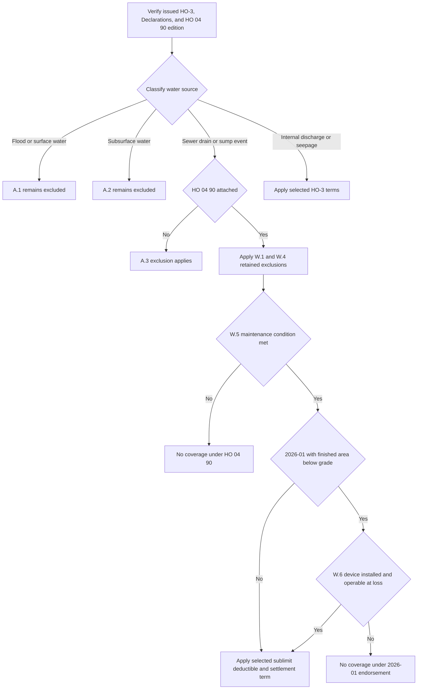

## Start with the issued policy and endorsement edition

This is Section I property analysis, not flood insurance and not a presumption that water-backup coverage exists. Retain the policy-written date, selected HO-3 edition, Declarations, endorsement schedule, and the exact attached HO 04 90 edition before classifying a loss or stating a deductible, limit, condition, or settlement result.

The base-form selection is separate from the water-backup-endorsement selection. **HO-3 2011-05** remains controlling for policies written under it even if loss is reported later; **HO-3 2018-09** applies to policies written on or after **2018-09-01**. Both base forms exclude the A.3 sewer/drain-backup and sump-event category unless HO 04 90 is attached. A later base form or endorsement does not supply an omitted term for an earlier issued policy. [HO-3 2011-05 status and A.3](repo://forms/HO/MS/HO-3/2011-05.md#L1-L7) [A.3](repo://forms/HO/MS/HO-3/2011-05.md#L59-L66) · [HO-3 2018-09 status and A.3](repo://forms/HO/MS/HO-3/2018-09.md#L1-L4) [A.3](repo://forms/HO/MS/HO-3/2018-09.md#L69-L77)

Select a verified attached HO 04 90 independently:

| Verified attached endorsement | Governing rule | Do not substitute |
| --- | --- | --- |
| **HO 04 90 2010-10** | It was superseded for policies written on or after **2026-01-01**, but remains in force for policies written under it and governs loss adjustment regardless of reporting date. [2010-10 status](repo://forms/HO/MS/HO-04-90/2010-10.md#L1-L7) | Do not apply the later $10,000 sublimit, $1,000 deductible, or W.6 device condition. |
| **HO 04 90 2026-01** | It replaces 2010-10 for policies written on or after **2026-01-01**. [2026-01 status](repo://forms/HO/MS/HO-04-90/2026-01.md#L1-L4) | Do not use the legacy $5,000, $500, or legacy W.6 settlement numbering. |
| **Attachment, edition, or written date unverified** | Obtain the issued endorsement and Declarations before reaching an endorsement coverage or payment conclusion. The base A.3 exception itself is attachment-dependent. [HO-3 2011-05 A.3](repo://forms/HO/MS/HO-3/2011-05.md#L63-L66) · [HO-3 2018-09 A.3](repo://forms/HO/MS/HO-3/2018-09.md#L75-L77) | A repository form, current internal guide, reported-loss date, or water-damage label does not prove attachment or select an edition. |

For policy assembly and cross-form compatibility, see [Governing Form Editions and Policy Assembly](/openwiki/coverage/policy-editions-and-governing-forms.md). The endorsement attaches to HO-3 and modifies Section I Exclusions A.3; it is not an automatic part of either supplied base form. [2010-10 header](repo://forms/HO/MS/HO-04-90/2010-10.md#L1-L8) · [2026-01 header](repo://forms/HO/MS/HO-04-90/2026-01.md#L1-L5)

## Classify the water source before the damage

“Flooding,” “backup,” and “leak” in a first report are not contractual conclusions. Establish the source and entry path before applying a sublimit, deductible, or settlement provision.

| Source and controlling provision | Contract boundary | Edition-specific point |
| --- | --- | --- |
| **Flood, surface water, waves, tidal water, storm surge, or overflow of a body of water** — A.1 | Both supplied HO-3 forms exclude loss caused directly or indirectly by this category, whether or not driven by wind. In **both HO 04 90 editions**, W.4 separately preserves A.1 in full. The endorsement is not flood coverage. [2011 A.1](repo://forms/HO/MS/HO-3/2011-05.md#L59-L63) · [2018 A.1](repo://forms/HO/MS/HO-3/2018-09.md#L69-L72) · [2010-10 W.4](repo://forms/HO/MS/HO-04-90/2010-10.md#L21-L25) · [2026-01 W.4](repo://forms/HO/MS/HO-04-90/2026-01.md#L25-L33) | Only **2018-09** adds A.4, which applies A.1–A.3 regardless of another contributing cause or event concurrently or in sequence. Do not add that wording to a 2011-05 analysis. [2018 A.4](repo://forms/HO/MS/HO-3/2018-09.md#L75-L77) |
| **Water below the surface of the ground** — A.2 | Both forms exclude the stated pressure, seepage, or leakage through a building, foundation, pool, or other structure. Both HO 04 90 editions’ W.4 separately preserve A.2 in full. [2011 A.2](repo://forms/HO/MS/HO-3/2011-05.md#L61-L64) · [2018 A.2](repo://forms/HO/MS/HO-3/2018-09.md#L71-L74) · [2010-10 W.4](repo://forms/HO/MS/HO-04-90/2010-10.md#L23-L25) · [2026-01 W.4](repo://forms/HO/MS/HO-04-90/2026-01.md#L31-L33) | A basement location, foundation, or sump does not alone establish a subsurface source or a W.1 sump event. |
| **Water or waterborne material backing up through a sewer or drain, or overflowing or discharging from a sump, sump pump, or related equipment** — A.3 | Without HO 04 90, A.3 excludes this category. When the verified attached edition applies, W.1 writes back this narrow A.3 route for direct physical loss to Coverage A, B, or C property, including an event resulting from mechanical breakdown. [2011 A.3](repo://forms/HO/MS/HO-3/2011-05.md#L63-L66) · [2018 A.3](repo://forms/HO/MS/HO-3/2018-09.md#L75-L77) · [2010-10 W.1](repo://forms/HO/MS/HO-04-90/2010-10.md#L9-L12) · [2026-01 W.1](repo://forms/HO/MS/HO-04-90/2026-01.md#L6-L11) | Test W.4’s retained exclusions, W.5, the selected edition’s payment terms, and—only in 2026-01—the W.6 below-grade device condition. |
| **Accidental internal discharge or overflow** | Water damage is not automatically A.3. In 2018-09, P.2 lists accidental discharge or overflow from within a plumbing, heating, or air-conditioning system as a Coverage C named peril, while A/B use P.1’s direct-physical-loss grant subject to exclusions. [2018 P.1–P.2](repo://forms/HO/MS/HO-3/2018-09.md#L59-L64) | P.2 does not name household appliances in that listed discharge peril. The supplied 2011-05 text has no separately numbered P.1/P.2 provision; do not import the 2018 gate. [2011 property coverage and exclusions](repo://forms/HO/MS/HO-3/2011-05.md#L25-L80) |
| **Continuous or repeated seepage or leakage** — 2018-09 C.3 | 2018-09 excludes water or steam seepage/leakage over weeks, months, or years from the stated systems or a household appliance, except loss that is sudden and accidental as Definition 5 defines it. [2018 C.3](repo://forms/HO/MS/HO-3/2018-09.md#L83-L90) | Definition 5 requires an event abrupt in onset and unintended from the insured’s standpoint, and rejects a gradual or known-unremedied condition regardless of discovery date. These provisions are absent from the supplied 2011-05 text. [2018 Definition 5](repo://forms/HO/MS/HO-3/2018-09.md#L19-L20) · [2011 exclusions](repo://forms/HO/MS/HO-3/2011-05.md#L57-L80) |

### Source-to-coverage decision path

*The flow distinguishes W.1’s A.3 write-back from W.4’s separate preservation of A.1 and A.2. It introduces the W.6 device test only for a 2026-01 endorsement with a finished area below grade.* [2010-10 W.1 and W.4–W.5](repo://forms/HO/MS/HO-04-90/2010-10.md#L9-L29) · [2026-01 W.1 and W.4–W.6](repo://forms/HO/MS/HO-04-90/2026-01.md#L6-L47)

## HO 04 90: a narrow A.3 write-back

For either verified attached edition, **W.1 writes back A.3**, not every water exclusion. It covers the described direct physical loss to Coverage A, B, or C property caused by sewer/drain backup or sump-related overflow/discharge, whether or not mechanical breakdown of that equipment caused the event. It is a defined backup/sump route, not a general water-damage grant. [2010-10 W.1](repo://forms/HO/MS/HO-04-90/2010-10.md#L9-L12) · [2026-01 W.1](repo://forms/HO/MS/HO-04-90/2026-01.md#L6-L11)

**W.4 separately preserves A.1 and A.2.** In each edition, it says A.1 continues in full for flood and surface-water sources and says A.2 continues in full for subsurface-water sources. A sewer or sump label does not turn either source into a W.1 event. [2010-10 W.4](repo://forms/HO/MS/HO-04-90/2010-10.md#L21-L25) · [2026-01 W.4](repo://forms/HO/MS/HO-04-90/2026-01.md#L25-L33)

**W.5 is another coverage condition, shared by both editions.** The endorsement does not cover a backup, overflow, or discharge that resulted from the insured’s failure to maintain the serving sewer line, drain, sump, or sump pump when that failure was known before loss and a reasonable person would have remedied it. Develop the asserted maintenance failure, service item, causation, pre-loss knowledge, and reasonable-remedy facts. W.5 is distinct from base-form C.1 neglect, which concerns reasonable efforts to save and preserve property at and after a loss. [2010-10 W.5](repo://forms/HO/MS/HO-04-90/2010-10.md#L27-L29) · [2026-01 W.5](repo://forms/HO/MS/HO-04-90/2026-01.md#L35-L40) · [2011 C.1](repo://forms/HO/MS/HO-3/2011-05.md#L71-L75) · [2018 C.1](repo://forms/HO/MS/HO-3/2018-09.md#L83-L87)

All other policy provisions apply. W.1 therefore does not bypass the selected property scope, applicable cause-of-loss gate, retained water exclusions, other exclusions, Declarations, or Section I duties. [2010-10 all-other-provisions clause](repo://forms/HO/MS/HO-04-90/2010-10.md#L31-L35) · [2026-01 all-other-provisions clause](repo://forms/HO/MS/HO-04-90/2026-01.md#L49-L56)

## Payment terms and the 2026-01 eligibility change

The two editions have the same basic W.1, W.4, and W.5 framework, but their payment terms and W.6/W.7 functions must not be mixed.

| Term after a covered W.1 event | HO 04 90 2010-10 | HO 04 90 2026-01 |
| --- | --- | --- |
| **W.2 policy-period sublimit** | The most payable for all loss under the endorsement in one policy period is **$5,000**, unless a higher endorsement limit is in the Declarations. It is part of, not in addition to, the A/B/C limits. [2010-10 W.2](repo://forms/HO/MS/HO-04-90/2010-10.md#L13-L15) | The most payable is **$10,000** on the same policy-period and within-limit basis, unless a higher endorsement limit is in the Declarations. [2026-01 W.2](repo://forms/HO/MS/HO-04-90/2026-01.md#L13-L18) |
| **W.3 deductible** | A separate **$500** deductible applies to each covered endorsement loss; the Section I deductible in the Declarations does not apply. [2010-10 W.3](repo://forms/HO/MS/HO-04-90/2010-10.md#L17-L19) | A separate **$1,000** deductible applies to each covered endorsement loss; the Section I deductible in the Declarations does not apply. [2026-01 W.3](repo://forms/HO/MS/HO-04-90/2026-01.md#L20-L23) |
| **Finished area below grade** | No backflow-prevention requirement appears in this edition. [2010-10 W.5–W.6](repo://forms/HO/MS/HO-04-90/2010-10.md#L27-L33) | **W.6 is an additional coverage gate.** If the residence premises has a finished area below grade, coverage applies only when a backwater valve or equivalent backflow-prevention device was installed and operable on the serving sewer line at the time of loss. The form says this requirement is new to the edition. [2026-01 W.6](repo://forms/HO/MS/HO-04-90/2026-01.md#L42-L47) |
| **A/B settlement** | W.6 leaves Coverage A/B loss on the settlement basis in the attached policy. [2010-10 W.6](repo://forms/HO/MS/HO-04-90/2010-10.md#L31-L33) | W.7 leaves Coverage A/B loss on the settlement basis in the attached policy. [2026-01 W.7](repo://forms/HO/MS/HO-04-90/2026-01.md#L49-L54) |
| **C settlement** | W.6 settles Coverage C at actual cash value despite a replacement-cost personal-property endorsement, unless the HO 04 90 Declarations state otherwise. [2010-10 W.6](repo://forms/HO/MS/HO-04-90/2010-10.md#L31-L33) | W.7 produces the same stated Coverage C actual-cash-value result, subject to a contrary HO 04 90 Declarations term. [2026-01 W.7](repo://forms/HO/MS/HO-04-90/2026-01.md#L49-L54) |

W.2, W.3, W.6, and W.7 modify the route’s amount, deductible, eligibility, or settlement mechanics; none is a coverage write-back. In particular, use one selected W.3 deductible rather than stacking it with the base Section I deductible. The base deductible is in the Declarations under 2011-05 S.4 or 2018-09 S.5, but each HO 04 90 W.3 expressly displaces it for loss covered under that endorsement. [2011 S.4](repo://forms/HO/MS/HO-3/2011-05.md#L89-L92) · [2018 S.5](repo://forms/HO/MS/HO-3/2018-09.md#L109-L112) · [2010-10 W.3](repo://forms/HO/MS/HO-04-90/2010-10.md#L17-L19) · [2026-01 W.3](repo://forms/HO/MS/HO-04-90/2026-01.md#L20-L23)

### Apply the 2026-01 W.6 condition precisely

W.6 does not apply merely because a loss is near a basement or because a sump pump is present. First establish that the **residence premises has a finished area below grade**. If it does, preserve evidence that the serving sewer line had a **backwater valve or equivalent backflow-prevention device**, and that it was both **installed and operable at the time of loss**. If there is no finished area below grade, the condition’s stated trigger is absent; if the selected endorsement is 2010-10, do not import the condition at all. [2026-01 W.6](repo://forms/HO/MS/HO-04-90/2026-01.md#L42-L47) · [2010-10 W.5–W.6](repo://forms/HO/MS/HO-04-90/2010-10.md#L27-L33)

A battery-backed sump-pump requirement in a Florida or Texas appetite guide is an underwriting rule, not this contract condition. Those guides use their own higher-limit/below-grade criteria and expressly are not policy contracts; they neither prove attachment nor satisfy, replace, or add 2026-01 W.6. [Florida guide status and H.4](repo://guidelines/appetite/fl-homeowners.md#L1-L4) [H.4](repo://guidelines/appetite/fl-homeowners.md#L27-L33) · [Texas guide status and G.3](repo://guidelines/appetite/tx-homeowners.md#L1-L4) [G.3](repo://guidelines/appetite/tx-homeowners.md#L23-L29) · [2026-01 W.6](repo://forms/HO/MS/HO-04-90/2026-01.md#L42-L47)

For underlying property scope and Section I conditions, see [Other Structures](/openwiki/coverage/coverage-b/other-structures.md), [Personal Property](/openwiki/coverage/coverage-c/personal-property.md), and [Section I Claim Conditions, Payment, and Deductibles](/openwiki/coverage/property/claim-conditions-and-deductibles.md).

## Resulting fungi, rot, or bacteria is a separate path

Fungi, wet/dry rot, or bacteria following a backup requires separate analysis and a separately verified HO 04 81 attachment. For the supplied 2018-09 form, HO 04 81 M.1 writes back HO-3 C.2 only to its stated extent: direct physical loss to covered A/B/C property from fungi, rot, or bacteria resulting from a Section I insured peril during the policy period. M.2 separately preserves the A.1 flood/surface-water, A.2 subsurface-water, and C.3 long-duration-leakage barriers, while identifying backup covered by an attached water-backup endorsement as an example of a covered moisture event. [HO-3 2018-09 C.2–C.3](repo://forms/HO/MS/HO-3/2018-09.md#L83-L90) · [HO 04 81 M.1–M.2](repo://forms/HO/MS/HO-04-81/2018-09.md#L5-L17)

A backup-related fungi claim can therefore require both the selected HO 04 90 analysis and the HO 04 81 analysis. For a 2026-01 backup route with finished area below grade, complete the W.6 device test before treating the backup as the covered underlying event for M.2. Keep the endorsements’ limits, deductibles, settlement terms, and conditions separate. See [Fungi, Rot, and Bacteria](/openwiki/coverage/property/fungi-rot-and-bacteria.md).

## Claim handling boundary and focused file-review tests

The internal water-loss guide requires source-first documentation, technical referral for the stated uncertain/competing-source, foundation, representation, large-loss, and duration-denial triggers, and a reservation of rights before investigation where duration or W.5 may control. It is not policy language and must not be quoted to an insured or claimant. It identifies the legacy $5,000/$500/W.6 structure, so it cannot select an endorsement edition or override 2026-01’s $10,000/$1,000/W.6/W.7 terms. [guidance status and source-first direction](repo://guidelines/claims/water-loss-handling.md#L1-L11) · [guide’s backup terms](repo://guidelines/claims/water-loss-handling.md#L25-L33) · [referral and reservation direction](repo://guidelines/claims/water-loss-handling.md#L51-L59)

Preserve the issued policy and selected endorsement edition; Declarations limit; source and entry-path evidence; maintenance and service history; damage allocation; prior endorsement payments in the policy period; and, for 2026-01 with finished area below grade, device type, location, installation, and at-loss operability evidence. For intake, mitigation, evidence, escalation, and communication workflow, see [Water-Loss Handling](/openwiki/operations/claims-water-loss-handling.md).

Use these focused tests before communicating a coverage or payment position:

1. **Wind-driven surface water reaches the property, then a drain backs up.** Keep A.1 separate. W.4 preserves it, and W.1 does not turn the loss into flood coverage; apply 2018-09 A.4 only when that base form governs.
2. **Groundwater enters through a foundation near a sump.** Establish the actual entry path. A sump’s presence does not itself establish W.1, and W.4 separately preserves A.2.
3. **A sump pump mechanically fails and overflows.** Verify attachment and edition; test W.1, W.4, and W.5. For 2026-01, test W.6 only if there is finished area below grade, then apply that edition’s W.2/W.3/W.7 terms.
4. **A 2026-01 policy has a finished basement below grade.** Document whether an installed and operable backwater valve or equivalent device was on the serving sewer line at loss. Do not replace that test with a battery-backed-sump underwriting criterion.
5. **A slow plumbing leak is discovered after months.** On 2018-09, evaluate C.3 and Definition 5 using onset, duration, knowledge, and remediation—not discovery alone. Do not impose those provisions on the supplied 2011-05 text.
6. **A backup is followed by mold.** Independently verify HO 04 90 and HO 04 81, complete the selected water-backup route first, then apply HO 04 81’s separate trigger, limit, and mitigation terms.
