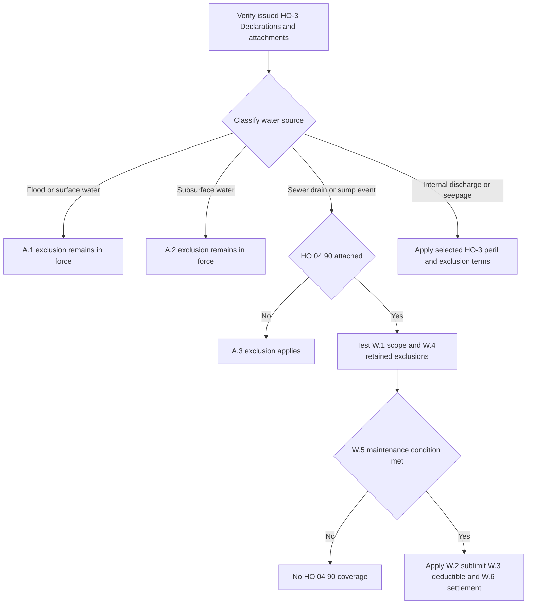

## Scope: assemble the issued contract first

This is a Section I property-coverage analysis, not flood insurance and not a presumption that a water-backup endorsement exists. Identify the policy-written date, issued HO-3 edition, Declarations, and attached endorsements before classifying the water source. **HO-3 2011-05** remains controlling for a policy written under that edition even if its loss is reported after the form was superseded; **HO-3 2018-09** applies to policies written on or after 2018-09-01. [2011-05 applicability and continuing force](repo://forms/HO/MS/HO-3/2011-05.md#L1-L7) · [2018-09 applicability](repo://forms/HO/MS/HO-3/2018-09.md#L1-L4)

Both supplied HO-3 editions exclude the A.3 sewer/drain-backup and sump-event category **unless HO 04 90 is attached**. HO 04 90 (2010-10) identifies itself as an HO-3 endorsement that modifies Section I — Exclusions A.3; it is not an automatic part of either base form. In the 2018-09 wording, attachment also routes coverage to the endorsement’s stated sublimit. Treat the A.3 exclusion and the endorsement as one proposition: the write-back is available only after attachment is verified and only to W.1–W.6’s extent. [2011-05 A.3](repo://forms/HO/MS/HO-3/2011-05.md#L59-L66) · [2018-09 A.3–A.4](repo://forms/HO/MS/HO-3/2018-09.md#L69-L77) · [HO 04 90 introduction and W.1](repo://forms/HO/MS/HO-04-90/2010-10.md#L1-L8)

<!-- openwiki: broken internal link [/openwiki/coverage/property/perils-and-general-exclusions] file "/openwiki/coverage/property/perils-and-general-exclusions" does not exist. Fix the href or restore the target, then delete this comment. -->
For the broader property entry gates, see [Section I Property Perils and General Exclusions](/openwiki/coverage/property/perils-and-general-exclusions). Under 2018-09, Coverage A/B begins with direct physical loss subject to exclusions, while Coverage C also has the P.2 named-peril gate. A settlement clause or endorsement sublimit does not itself establish a covered loss. [HO-3 2018-09 P.1–P.2](repo://forms/HO/MS/HO-3/2018-09.md#L59-L64)

## Classify the water source before the damage

The source classifications below are mutually important but not interchangeable. “Flooding” or “backup” in a first report is a description, not the contractual conclusion.

| Source and controlling provision | Contract result | Edition boundary and fact to establish |
| --- | --- | --- |
| **Flood, surface water, waves, tidal water, storm surge, or overflow of a body of water** — A.1 | Both forms exclude loss caused directly or indirectly by this category **“whether or not driven by wind.”** HO 04 90 W.4 retains A.1 in full, so it does not write back flood or surface-water loss. | For **2018-09**, A.4 adds that A.1–A.3 apply regardless of any other cause or event contributing concurrently or in any sequence. That anti-concurrent-causation wording is not stated in the supplied 2011-05 form. Establish whether water reached the property across the ground or came from an enumerated body-of-water/flood source. |
| **Water below the surface of the ground** — A.2 | Both forms exclude loss caused directly or indirectly by subsurface water, including water exerting pressure on or seeping or leaking through a building, foundation, swimming pool, or other structure. HO 04 90 W.4 retains A.2 in full. | In 2018-09, the same A.4 concurrent/sequential-cause wording applies. Establish the entry path; water found in a basement is not, by itself, proof of either subsurface water or a covered sump event. |
| **Water or waterborne material that backs up through sewers or drains, or overflows or is discharged from a sump, sump pump, or related equipment** — A.3 | Absent attached HO 04 90, both forms exclude the loss directly or indirectly caused by this category. With the endorsement attached, W.1 supplies the limited A/B/C direct-physical-loss coverage described below. | 2018-09 expressly includes the exclusion even when the backup or overflow results from mechanical breakdown; W.1 correspondingly covers its defined backup, overflow, or discharge whether or not it results from mechanical breakdown. The 2018 A.4 anti-concurrent-causation rule applies before the attachment-dependent A.3 exception. |
| **Sudden discharge or overflow from an internal system** | This is not A.3 merely because the damage is water damage. In 2018-09, P.2 lists accidental discharge or overflow of water or steam from within plumbing, heating, or air-conditioning systems as a Coverage C named peril; A/B use P.1’s direct-physical-loss grant subject to exclusions. | Do not treat every appliance, leak, or discovered moisture condition as this P.2 peril: P.2’s quoted internal-system category does not name household appliances. Test the particular property coverage, source, onset, and exclusions. |
| **Continuous or repeated seepage or leakage** — 2018-09 C.3 | 2018-09 excludes water or steam seepage/leakage over weeks, months, or years from within a plumbing, heating, or air-conditioning system or from within a household appliance. The C.3 provision does not exclude loss that is “sudden and accidental” as Definition 5 defines it. | Definition 5 requires an event both abrupt in onset and unintended from the insured’s standpoint; a gradually developing condition, or one known to the insured and left unremedied, is not sudden and accidental merely because effects appear later. C.3 and Definition 5 do **not** appear in the supplied 2011-05 form, so do not import this exclusion or definition into an older issued policy. |

The A.1–A.3 wording and 2018-only A.4 anti-concurrent-causation clause control the first three rows. The 2018 P.1/P.2 property gates, C.3 duration rule, and Definition 5 control the later rows. [HO-3 2011-05 A.1–A.3](repo://forms/HO/MS/HO-3/2011-05.md#L57-L66) · [HO-3 2018-09 Definition 5 and P.1–P.2](repo://forms/HO/MS/HO-3/2018-09.md#L19-L20) [HO-3 2018-09 P.1–P.2](repo://forms/HO/MS/HO-3/2018-09.md#L59-L64) · [HO-3 2018-09 A.1–A.4 and C.3](repo://forms/HO/MS/HO-3/2018-09.md#L69-L77) [HO-3 2018-09 C.3](repo://forms/HO/MS/HO-3/2018-09.md#L83-L90) · [HO 04 90 W.4](repo://forms/HO/MS/HO-04-90/2010-10.md#L17-L21)

### Source-to-coverage decision path

*This is the contract-analysis sequence for the supplied forms: it separates retained A.1/A.2 exclusions from the A.3 write-back and then applies the endorsement’s own conditions and payment terms.* [HO-3 2018-09 A.1–A.4](repo://forms/HO/MS/HO-3/2018-09.md#L69-L77) · [HO 04 90 W.1–W.6](repo://forms/HO/MS/HO-04-90/2010-10.md#L5-L31)

## HO 04 90: the limited A.3 write-back

When **HO 04 90 edition 2010-10 is actually attached**, W.1 covers direct physical loss to property described in **Coverage A, B, and C** caused by water or waterborne material that backs up through sewers or drains, or overflows or is discharged from a sump, sump pump, or related equipment. The grant includes the stated event **“whether or not the backup, overflow, or discharge results from mechanical breakdown of that equipment.”** It is a defined backup/sump coverage route, not a general water-damage grant. [HO 04 90 W.1](repo://forms/HO/MS/HO-04-90/2010-10.md#L5-L8)

W.4 expressly preserves the boundary. It does not provide coverage for flood, surface water, waves, tidal water, storm surge, or overflow of a body of water, **“whether or not driven by wind,”** and says A.1 continues in full. Nor does it provide coverage for water below ground, including water pressure or water that seeps or leaks through a building, foundation, or swimming pool; A.2 continues in full. On a 2018-09 policy, also give effect to A.4’s direction that A.1 through A.3 apply regardless of another cause or event contributing concurrently or in any sequence; attachment does not erase that wording for A.1 or A.2. [HO 04 90 W.4](repo://forms/HO/MS/HO-04-90/2010-10.md#L17-L21) · [HO-3 2018-09 A.1–A.4](repo://forms/HO/MS/HO-3/2018-09.md#L69-L77)

### Amount, deductible, and settlement invariants

| Term | Required application under attached HO 04 90 (2010-10) |
| --- | --- |
| **Policy-period sublimit** | The most payable for **all loss under the endorsement in any one policy period** is **$5,000**, unless a higher limit is shown for the endorsement in the Declarations. It is a sublimit **part of, and not in addition to**, the limits applying to Coverage A, B, and C. Track payments against the same policy-period endorsement allowance; do not add a new $5,000 layer on top of an underlying A/B/C limit. |
| **Deductible** | A separate **$500** deductible applies to **each loss under the endorsement**. The Section I deductible shown in the Declarations does **not** apply to loss covered here; do not stack the ordinary Section I deductible on the W.3 deductible. |
| **Coverage A and B settlement** | Settle using the basis stated in the policy to which the endorsement attaches. W.6 does not establish a new A/B settlement formula, so preserve the selected HO-3’s applicable settlement terms and conditions. |
| **Coverage C settlement** | Settle at **actual cash value**, regardless of a replacement-cost personal-property endorsement, unless the Declarations state otherwise for HO 04 90. This W.6 rule controls the endorsement loss rather than the ordinary Coverage C replacement-cost exception. |

<!-- openwiki: broken internal link [/openwiki/coverage/coverage-a/dwelling] file "/openwiki/coverage/coverage-a/dwelling" does not exist. Fix the href or restore the target, then delete this comment. -->
<!-- openwiki: broken internal link [/openwiki/coverage/coverage-b/other-structures] file "/openwiki/coverage/coverage-b/other-structures" does not exist. Fix the href or restore the target, then delete this comment. -->
<!-- openwiki: broken internal link [/openwiki/coverage/coverage-c/personal-property] file "/openwiki/coverage/coverage-c/personal-property" does not exist. Fix the href or restore the target, then delete this comment. -->
<!-- openwiki: broken internal link [/openwiki/coverage/property/claim-conditions-and-deductibles] file "/openwiki/coverage/property/claim-conditions-and-deductibles" does not exist. Fix the href or restore the target, then delete this comment. -->
These W.2–W.6 terms are part of the attached coverage route, not post-coverage administrative options. For the underlying A/B/C scope and general settlement rules, see [Dwelling](/openwiki/coverage/coverage-a/dwelling), [Other Structures](/openwiki/coverage/coverage-b/other-structures), [Personal Property](/openwiki/coverage/coverage-c/personal-property), and [Section I Claim Conditions, Payment, and Deductibles](/openwiki/coverage/property/claim-conditions-and-deductibles). [HO 04 90 W.2–W.3](repo://forms/HO/MS/HO-04-90/2010-10.md#L9-L15) · [HO 04 90 W.6](repo://forms/HO/MS/HO-04-90/2010-10.md#L27-L31) · [HO-3 2018-09 Coverage A and C settlement](repo://forms/HO/MS/HO-3/2018-09.md#L25-L33) [HO-3 2018-09 Coverage C settlement](repo://forms/HO/MS/HO-3/2018-09.md#L43-L49)

### Maintenance is an endorsement condition

W.5 says:

> “We do not cover loss under this endorsement if the backup, overflow, or discharge resulted from an insured's failure to maintain the sewer line, drain, sump, or sump pump serving the residence premises, where that failure was known to the insured before the loss and a reasonable person would have remedied it.”

Apply every stated element: a qualifying maintenance failure; the failure caused the backup, overflow, or discharge; it served the residence premises; the insured knew of it before loss; and a reasonable person would have remedied it. This is not the base-form C.1 neglect wording, which addresses failure to save and preserve property at and after a loss. W.5 is a pre-loss, known-and-unremedied maintenance condition specific to the endorsement, and its stated consequence is that loss under the endorsement is not covered. [HO 04 90 W.5](repo://forms/HO/MS/HO-04-90/2010-10.md#L23-L25) · [HO-3 2018-09 C.1](repo://forms/HO/MS/HO-3/2018-09.md#L83-L87) · [HO-3 2011-05 C.1](repo://forms/HO/MS/HO-3/2011-05.md#L71-L75)

All other provisions of the policy apply. Thus W.1 does not bypass the selected property scope, applicable cause-of-loss gate, retained A.1/A.2 exclusions, other exclusions, Declarations changes, or Section I duties. [HO 04 90 W.1 and all-other-provisions clause](repo://forms/HO/MS/HO-04-90/2010-10.md#L5-L8) [HO 04 90 all-other-provisions clause](repo://forms/HO/MS/HO-04-90/2010-10.md#L27-L31)

## Related write-backs and operating boundaries

<!-- openwiki: broken internal link [/openwiki/coverage/property/fungi-rot-and-bacteria] file "/openwiki/coverage/property/fungi-rot-and-bacteria" does not exist. Fix the href or restore the target, then delete this comment. -->
Fungi, wet/dry rot, or bacteria following water backup is a separate analysis. HO 04 81, if attached, only displaces C.2 to its limited extent when the condition resulted from a Section I insured peril during the policy period; its M.2 identifies water backup covered by an attached water-backup endorsement as an example. A backup-related condition therefore may require both attachments and both sets of conditions. HO 04 81 does not transform flood, surface water, subsurface water, or C.3 long-duration leakage into a covered underlying event. See [Fungi, Rot, and Bacteria](/openwiki/coverage/property/fungi-rot-and-bacteria). [HO 04 81 M.1–M.2](repo://forms/HO/MS/HO-04-81/2018-09.md#L5-L17) · [HO-3 2018-09 A.1–A.2 and C.3](repo://forms/HO/MS/HO-3/2018-09.md#L69-L75) [HO-3 2018-09 C.3](repo://forms/HO/MS/HO-3/2018-09.md#L83-L90)

### Internal claim-handling workflow — not contract language

The internal water-loss guidance instructs adjusters to establish and document source before evaluating damaged property; it expressly says the guidance is not part of a policy and must not be quoted to an insured or claimant. Preserve the issued forms, Declarations, endorsement attachment and edition, source/entry path, onset and duration evidence, relevant equipment/service history, damage inventory, and prior HO 04 90 payments in the policy period. For an uncertain source, plausible competing source categories, a foundation loss, public adjuster/counsel involvement, a loss above $25,000, or a denial principally based on duration, it directs referral to a technical claims specialist. It also directs a reservation of rights before investigating a claim where coverage may turn on duration or W.5 maintenance. These are internal escalation controls, not extra coverage requirements or denial language. [internal guidance status and source-first rule](repo://guidelines/claims/water-loss-handling.md#L1-L11) · [internal guidance on evidence and referral](repo://guidelines/claims/water-loss-handling.md#L35-L41) [internal referral and reservation controls](repo://guidelines/claims/water-loss-handling.md#L51-L59)

### Issuance and underwriting configuration — not contract language

At underwriting, HO 04 90 is optional coverage written by attaching the endorsement. Florida guidance permits binding its base W.2 sublimit without referral, requires a battery-backed sump pump above $10,000 where any finished area is below grade, and places risks with two or more water claims in five years outside appetite for the endorsement. Texas guidance permits up to $25,000 without referral when there is no water-backup claim in five years, and likewise requires a battery-backed sump pump for a finished below-grade basement above $10,000. Neither guide changes an issued policy, proves that HO 04 90 was attached, or permits describing it as flood coverage. [Florida H.4](repo://guidelines/appetite/fl-homeowners.md#L27-L33) · [Texas G.3](repo://guidelines/appetite/tx-homeowners.md#L23-L29) · [authority matrix, endorsement authority](repo://guidelines/authority/referral-matrix.md#L41-L47)

## Focused file-review tests

1. **Wind-driven surface water reaches a dwelling, then a drain backs up.** On 2018-09, retain A.1’s “whether or not driven by wind” language and A.4’s concurrent/sequential-cause rule; HO 04 90 W.4 does not write back the A.1 source.
2. **Groundwater enters through a foundation near a sump.** Establish the entry path rather than treating the sump’s presence as a W.1 event. A.2 remains in force under W.4.
3. **Sump pump mechanical failure produces an overflow.** Verify attachment, then recognize that W.1 expressly includes mechanical-breakdown-caused backup, overflow, or discharge; apply the W.2 policy-period sublimit, W.3 $500 deductible, W.5 condition, and W.6 settlement.
4. **Slow plumbing leak discovered after months.** For 2018-09, determine duration, onset, knowledge, and remediation against C.3 and Definition 5 rather than treating the discovery date as sudden and accidental. Do not impose C.3/Definition 5 on the supplied 2011-05 form.
5. **Damaged personal property has a replacement-cost endorsement.** If the loss is under HO 04 90, settle Coverage C at W.6 actual cash value unless its Declarations provide otherwise; the ordinary replacement-cost personal-property endorsement does not control that route.
6. **Prior slow-drain report before a backup.** Determine whether a known failure to maintain the serving line/drain/sump/pump resulted in the event and whether a reasonable person would have remedied it; do not substitute generic post-loss neglect for W.5’s specified condition.
7. **Backup followed by mold.** Do not merge the water-backup and fungi limits. Verify HO 04 90 for the backup and HO 04 81 for fungi/rot/bacteria, then apply their separate triggers, limits, deductibles/mitigation conditions, and retained exclusions.
