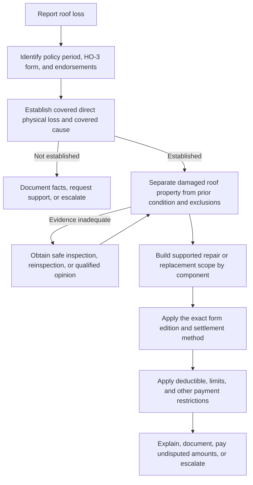

# Roof Surfacing Settlement and Roof Claims

## The controlling sequence

Handle a roof claim in this order: **coverage and cause, damaged scope, valuation, then deductible and limits**. An age threshold or an ACV schedule answers a valuation question; it does not establish that a loss is covered.

*This flow shows the operational order for deciding coverage, scope, valuation, and payment; it does not turn an investigation result into coverage.*

The base HO-3 grant requires direct physical loss to covered property caused by a covered peril. For wind or hail roof claims under HO-3 2024-03, cosmetic alteration that does not impair water shedding is excluded, while direct physical loss that impairs that function may be covered; the schedule trigger age does not itself establish coverage. [HO-3 2024-03, AGR.3](repo://forms/HO/MS/HO-3/2024-03.md#L15-L20) [HO-3 2024-03, P.40–P.41](repo://forms/HO/MS/HO-3/2024-03.md#L631-L639)

After coverage and cause, identify the physically damaged property. Separate storm-created or otherwise covered damage from pre-existing damage, wear, deterioration, defective installation, faulty maintenance, repeated leakage, cosmetic condition, and unrelated upgrades. Interior staining is evidence to investigate, not proof that a covered roof opening caused it. Then construct a supported scope before selecting ACV or replacement cost. This is the same separation required by the roof-claim guidance and claims manual. [Roof Claim Handling Guidance, H.0.1–H.0.9](repo://guidelines/claims/roof-claim-handling.md#L13-L31) [Claims Manual, Chapter 4, 4.12–4.25](repo://manuals/claims/manual.md#L1199-L1281)

## Which terms control

Identify the policy period, the HO-3 edition, the attached HO 23 74 edition, declarations, deductibles, exclusions, and any other applicable endorsement. Do not substitute a later schedule merely because the claim is adjusted later. HO 23 74 2018-09 states that 2025-05 supersedes it for policies effective on or after May 1, 2025, while the 2018-09 edition remains in force for policies written under it. [HO 23 74 2018-09, edition marker](repo://forms/HO/MS/HO-23-74/2018-09.md#L2-L9)

Without an ACV roof-schedule endorsement, HO-3 2024-03 settles covered roof surfacing at replacement cost, subject to the base form's conditions and limits. The base form also excludes replacement of undamaged property solely because like-kind materials are unavailable. [HO-3 2024-03, A.19–A.25](repo://forms/HO/MS/HO-3/2024-03.md#L135-L147)

HO 23 74 **modifies** that base-form roof-surfacing settlement basis when it is attached: the endorsement acts on the base form's roof settlement provision and changes valuation to ACV for the covered roof surfacing described by the endorsement. It does not broaden the covered peril or override other applicable exclusions, conditions, limits, or deductibles. [HO-3 2024-03, A.22](repo://forms/HO/MS/HO-3/2024-03.md#L141-L147) [HO 23 74 2018-09, W.0](repo://forms/HO/MS/HO-23-74/2018-09.md#L13-L27) [HO 23 74 2025-05, W.0](repo://forms/HO/MS/HO-23-74/2025-05.md#L15-L47)

## Replacement cost and ACV

Replacement cost is the reasonable cost to repair or replace damaged property with like kind and quality, without depreciation. ACV is the value at the time of loss after the applicable depreciation and condition adjustments. Under an HO 23 74 schedule, the insurer may settle covered roof surfacing at ACV whether or not the insured repairs or replaces it; payment does not become replacement cost merely because work is completed. [HO-3 2024-03, DEF.1–DEF.2](repo://forms/HO/MS/HO-3/2024-03.md#L41-L48) [HO 23 74 2018-09, W.1.1–W.1.10](repo://forms/HO/MS/HO-23-74/2018-09.md#L45-L67) [HO 23 74 2025-05, W.1.3–W.1.10](repo://forms/HO/MS/HO-23-74/2025-05.md#L59-L77)

### HO 23 74 2018-09

* **Trigger and age evidence:** ACV treatment applies when roof surfacing has reached **15 years of age at the time of loss**. Determine age from reliable evidence; if reliable evidence does not establish it, the endorsement permits use of available condition, construction, material, and roof-history information. [HO 23 74 2018-09, W.1.1–W.1.2 and W.1.16–W.1.18](repo://forms/HO/MS/HO-23-74/2018-09.md#L45-L55) [HO 23 74 2018-09, W.1.16–W.1.18](repo://forms/HO/MS/HO-23-74/2018-09.md#L75-L81)
* **Composition shingles:** For composition shingle roof surfacing subject to the applicable age classification, the payable percentage is **25%**. The deductible is applied after the payable amount is determined. This is not a universal percentage for every roof material or every state. [HO 23 74 2018-09, W.3.1–W.3.5](repo://forms/HO/MS/HO-23-74/2018-09.md#L233-L247)
* **Labor:** The endorsement permits depreciation of labor when labor is necessary to repair or replace roof surfacing. Depreciation must be reasonable and consistent with the damaged property's condition, and it cannot reduce payment for damage caused solely by the covered loss. [HO 23 74 2018-09, W.1.3–W.1.8](repo://forms/HO/MS/HO-23-74/2018-09.md#L49-L61)

### HO 23 74 2025-05

* **Trigger and age evidence:** ACV treatment applies when **Roof Age is 12 years or greater**. Roof Age is the age of the damaged roof surfacing at loss. Use installation records, permits, invoices, inspections, photographs, statements, or other reliable evidence. A limited-area replacement does not establish the age of surrounding surfacing unless evidence shows one installation. [HO 23 74 2025-05, W.1.4–W.1.8](repo://forms/HO/MS/HO-23-74/2025-05.md#L63-L77)
* **Composition shingles and the unresolved floor:** For composition shingle subject to an age-based adjustment, W.3 states a **20% payable percentage**, applied before the deductible. Separately, W.4 says covered roof-surfacing payment will not be less than **30% of applicable replacement cost**. The form also repeats malformed floor language in W.1.35–W.1.37. Treat these as an apparent internal drafting conflict: do not choose 20% or 30% by assumption; preserve the issue and obtain controlling legal, filing, compliance, or state-specific direction. [HO 23 74 2025-05, W.1.35–W.1.37](repo://forms/HO/MS/HO-23-74/2025-05.md#L123-L135) [HO 23 74 2025-05, W.3.3–W.3.5](repo://forms/HO/MS/HO-23-74/2025-05.md#L327-L337) [HO 23 74 2025-05, W.4.1–W.4.4](repo://forms/HO/MS/HO-23-74/2025-05.md#L415-L425)
* **Labor:** Do not depreciate labor unless the law applicable to the loss permits it. If permitted, labor depreciation must be reasonable and consistent with the damaged property's condition. [HO 23 74 2025-05, W.1.38–W.1.39](repo://forms/HO/MS/HO-23-74/2025-05.md#L133-L135)

The calculation should show the supported covered scope first, the applicable material and labor basis, the edition-specific adjustment, the unresolved floor issue if relevant, and then the deductible and limits. Training material is an operational aid for separating surfacing, labor, debris, permits, code work, and unrelated scope; it is not a substitute for the form. [Roof Claims and the ACV Schedule, L.2.16–L.2.27](repo://training/roof-claims-and-the-schedule.md#L121-L167) [Roof Claims and the ACV Schedule, L.2.33–L.2.40](repo://training/roof-claims-and-the-schedule.md#L189-L219)

## Components, scope, and matching

Roof surfacing is the exterior material forming the weather-resistant covering. Decking, underlayment, flashing, fasteners, vents, drainage, framing, skylights, mounted equipment, and interior finishes require their own coverage and scope analysis. The 2025 endorsement addresses related flashing, underlayment, fasteners, vents, and components when they are covered, damaged by the covered loss, and necessary to complete covered repairs; that treatment does not make every roof-system component scheduled roof surfacing. [HO 23 74 2025-05, W.1.2 and W.1.40–W.1.42](repo://forms/HO/MS/HO-23-74/2025-05.md#L59-L63) [HO 23 74 2025-05, W.1.40–W.1.42](repo://forms/HO/MS/HO-23-74/2025-05.md#L137-L141)

Replacement is not automatic because a contractor recommends it, materials look different, or the roof is old. Evaluate whether the damaged material can be repaired without impairing function, whether replacement is necessary, and whether proposed tear-off, access, disposal, code work, or adjoining-area work is tied to covered physical damage. Claims guidance directs the reviewer to distinguish directly damaged materials from undamaged materials claimed for access, matching, or appearance. [Roof Claim Handling Guidance, H.1.17–H.1.20](repo://guidelines/claims/roof-claim-handling.md#L81-L87) [Claims Manual, Chapter 4, 4.21–4.22](repo://manuals/claims/manual.md#L1253-L1263)

Matching is therefore a **scope question before it is a valuation question**. The base form does not pay for undamaged property solely because like-kind material is unavailable. The 2025 endorsement allows matching only to the extent needed to repair direct physical damage with like-kind-and-quality materials, and appearance difference alone does not make undamaged surfacing payable. [HO-3 2024-03, A.23–A.25](repo://forms/HO/MS/HO-3/2024-03.md#L143-L147) [HO 23 74 2025-05, W.1.24–W.1.26](repo://forms/HO/MS/HO-23-74/2025-05.md#L101-L109)

Age, wear, deterioration, installation defects, maintenance, repeated leakage, defective flashing or underlayment, excluded water, settling, and cosmetic condition must not be reclassified as covered damage merely because they appear during a covered event. Conversely, an aged roof is not automatically a denial: investigate whether a covered peril caused separate direct physical loss and pay only the supported covered portion. [HO 23 74 2025-05, W.4.1–W.4.14 and W.4.22–W.4.28](repo://forms/HO/MS/HO-23-74/2025-05.md#L417-L467) [HO 23 74 2025-05, W.4.49–W.4.53](repo://forms/HO/MS/HO-23-74/2025-05.md#L513-L523) [Roof Claim Handling Guidance, H.2.21–H.2.29](repo://guidelines/claims/roof-claim-handling.md#L183-L199)

## Deductibles, investigation, and payment controls

Apply the applicable deductible only after determining covered loss and the edition-specific roof adjustment. The 2018-09 form applies the deductible after the payable amount; the 2025-05 form applies the roof-surfacing adjustment before the deductible and applies the deductible only to covered loss. A deductible cannot create coverage for excluded, pre-existing, or undamaged property. [HO 23 74 2018-09, W.3.1–W.3.8](repo://forms/HO/MS/HO-23-74/2018-09.md#L233-L249) [HO 23 74 2025-05, W.3.1–W.3.12](repo://forms/HO/MS/HO-23-74/2025-05.md#L327-L351)

If HO 23 77 is attached, verify its windstorm-or-hail percentage deductible separately. It may apply to a covered wind or hail loss, but it is a deductible endorsement, not a roof valuation schedule and not a grant of otherwise excluded coverage. [HO 23 77 2022-07, W.0 and W.1.1–W.1.10](repo://forms/HO/MS/HO-23-77/2022-07.md#L13-L53) [HO 23 77 2022-07, W.1.21–W.1.25](repo://forms/HO/MS/HO-23-77/2022-07.md#L95-L105)

The claim file should preserve the reported date and cause, policy and endorsement review, safe inspection findings, photographs of damaged and representative undamaged areas, roof material and component identification, weather information, prior-loss and repair history, age evidence, samples when necessary, estimates, invoices, code evidence, matching analysis, valuation calculation, deductible and limit treatment, communications, and unresolved disputes. Investigation evidence helps establish cause, scope, age, condition, and value; it does not itself create coverage. [Roof Claim Handling Guidance, H.2.1–H.2.18](repo://guidelines/claims/roof-claim-handling.md#L141-L179) [Claims Manual, Chapter 4, 4.27–4.30 and 4.53–4.61](repo://manuals/claims/manual.md#L1289-L1311) [Claims Manual, Chapter 4, 4.53–4.61](repo://manuals/claims/manual.md#L1445-L1497)

Operational handling remains distinct from contract interpretation. The claims manual permits emergency repair expense up to **$5,000 without prior approval** when immediate action is needed to protect covered property, while requiring review above available authority or for unrelated work. Roof guidance separately calls for referral before final payment when incurred amount exceeds **$10,000**, and for prompt undisputed payment when coverage and amount are established. These are internal handling controls, not coverage grants or settlement percentages. [Claims Manual, Chapter 4, 4.5–4.8](repo://manuals/claims/manual.md#L1157-L1179) [Roof Claim Handling Guidance, H.5.24–H.5.30](repo://guidelines/claims/roof-claim-handling.md#L425-L437) [Claims Manual, Chapter 4, 4.57–4.61](repo://manuals/claims/manual.md#L1469-L1497)

## Underwriting and state overlays are not contract terms

The Personal Lines Underwriting Manual is internal risk-selection direction. It says not to use the manual to alter coverage. Rule 210 requires inspection findings before binding when roof age is at least 15 years, declines a risk at or above 25 years, and requires reliable age and condition evidence. Those controls govern acceptance, referral, and documentation; they do not authorize denying a covered claim or replacing the attached HO 23 74 rule with an underwriting threshold. [Personal Lines Underwriting Manual, Rule 100.B and Rule 100.D](repo://manuals/underwriting/manual.md#L21-L35) [Personal Lines Underwriting Manual, Rule 210.A–Rule 210.D](repo://manuals/underwriting/manual.md#L2211-L2235)

Florida bulletins constrain underwriting, notice, and disclosure practice rather than silently rewriting the contract:

* OIR-2019-11 is the superseded historical bulletin; OIR-2023-04 supersedes it for actions on or after April 11, 2023. The current bulletin distinguishes roof age from condition, says an ACV schedule must be authorized by the policy form, and requires a roof inspection before binding coverage for a 15-year-old roof. The bulletin does not replace the attached claim-settlement endorsement. [Florida Bulletin OIR-2019-11, supersession marker](repo://bulletins/FL/oir-2019-11-roof-age.md#L2-L9) [Florida Bulletin OIR-2023-04, B.1 and B.2.5–B.2.10](repo://bulletins/FL/oir-2023-04-roof-age-nonrenewal.md#L13-L29) [Florida Bulletin OIR-2023-04, B.2.5–B.2.10](repo://bulletins/FL/oir-2023-04-roof-age-nonrenewal.md#L69-L79) [Florida Bulletin OIR-2023-04, B.3.1–B.3.3](repo://bulletins/FL/oir-2023-04-roof-age-nonrenewal.md#L161-L167)
* Colorado DOI-2022-08 requires clear roof-settlement disclosures covering method, depreciation, materials, labor, deductibles, exclusions, and age basis. It states a 15-year schedule trigger and a 25% minimum in its disclosure requirements. Treat that bulletin as a regulatory communication and administration constraint. If it appears to conflict with a filed form or the 2025-05 12-year, 20%-versus-30% language, preserve the conflict and obtain state-specific legal or compliance direction instead of silently changing the policy. [Colorado Bulletin DOI-2022-08, B.1.1–B.1.8](repo://bulletins/CO/doi-2022-08-roof-settlement.md#L13-L31) [Colorado Bulletin DOI-2022-08, B.2.2–B.2.16](repo://bulletins/CO/doi-2022-08-roof-settlement.md#L59-L91) [Colorado Bulletin DOI-2022-08, B.2.19–B.2.34](repo://bulletins/CO/doi-2022-08-roof-settlement.md#L97-L127)

When a form, bulletin, underwriting record, contractor estimate, inspection opinion, or state-specific rule points in different directions, record the competing evidence and the exact provision at issue. Do not use an underwriting rule as a coverage exclusion, a bulletin as a replacement for policy language, or an estimate as proof of cause. Escalate unresolved contract, regulatory, or safety questions through the appropriate claims, legal, compliance, or supervisory path.
