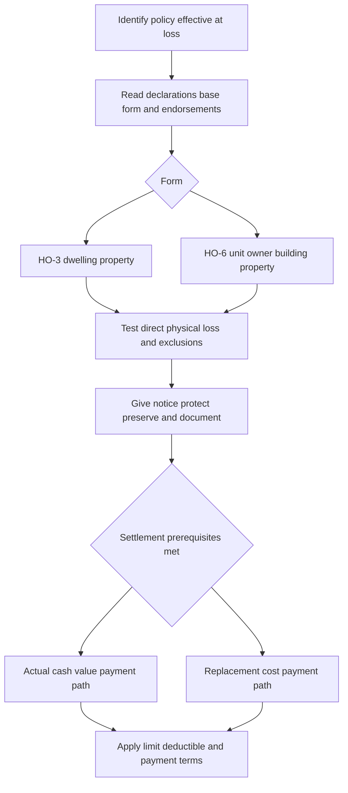

# Coverage A — Dwelling, Limits, and Base Loss Settlement

## Scope and governing policy

This page describes the reviewed manuscript forms, not a generic homeowners rule and not a coverage determination for a particular loss. Start with the policy in force on the loss date: the HO-3 (2018-09) agreement says the policy consists of its provisions, endorsements, and Declarations, and its Declarations identify the residence premises, limits, and deductible. [HO-3 (2018-09), AGR.1–AGR.4](repo://forms/HO/MS/HO-3/2018-09.md#L15-L22) An applicable amendatory endorsement can change that result. For example, the Florida HO 01 09 (2023-07) says it is part of the policy and, verbatim, “**If a provision of this endorsement conflicts with a provision of your policy, this endorsement controls.**” [HO 01 09 (2023-07), T.1–T.3](repo://forms/HO/FL/HO-01-09/2023-07.md#L15-L20)

Coverage A answers two separate questions in order:

1. **Is the damaged building property within the applicable form’s Coverage A grant, and is direct physical loss caused by a covered peril or risk?**
2. **If so, what limit, deductible, settlement basis, conditions, and attached endorsements constrain payment?**

This is the form-level Coverage A decision sequence: choose the governing policy record, classify the property under the correct form, establish covered direct physical loss, complete applicable post-loss duties, and then apply the distinct valuation and payment rules. [HO-3 (2024-03), I.A A.1–A.4 and I.S S.4–S.18](repo://forms/HO/MS/HO-3/2024-03.md#L97-L105) [HO-6 (2023-02), I.A A.1–A.9 and I.S S.3–S.18](repo://forms/HO/MS/HO-6/2023-02.md#L78-L96) [HO-3 (2024-03), I.S S.29–S.35](repo://forms/HO/MS/HO-3/2024-03.md#L859-L871)

## What each form insures

### HO-3 (2024-03): the dwelling form

The HO-3 (2024-03) begins with the dwelling shown in the Declarations and structures attached to it. It also covers materials and supplies on or next to the residence premises when intended to construct, alter, or repair the dwelling, plus permanently installed fixtures, machinery, equipment servicing the dwelling, and permanently connected outdoor equipment. [HO-3 (2024-03), I.A A.1–A.3](repo://forms/HO/MS/HO-3/2024-03.md#L97-L103) Its operative cause-of-loss wording is: “**We cover direct physical loss to \"covered property\" caused by a risk of direct physical loss, subject to the terms of this policy.**” [HO-3 (2024-03), I.A A.4](repo://forms/HO/MS/HO-3/2024-03.md#L105-L105)

<!-- openwiki: broken internal link [/openwiki/coverages/coverage-b/other-structures] file "/openwiki/coverages/coverage-b/other-structures" does not exist. Fix the href or restore the target, then delete this comment. -->
That broad grant does not make every item at the premises a dwelling item. The same edition excludes land, property used primarily for business, property held for sale, and separately insured property; it separately excludes ordinance-or-law loss and increased compliance cost at the Coverage A level. [HO-3 (2024-03), I.A A.5–A.8](repo://forms/HO/MS/HO-3/2024-03.md#L107-L113) A building that is separated by clear space or connected only by a fence, utility line, or similar connection is addressed as Coverage B rather than silently included in Coverage A. See [Coverage B — Other Structures](/openwiki/coverages/coverage-b/other-structures). [HO-3 (2024-03), I.B B.1–B.2](repo://forms/HO/MS/HO-3/2024-03.md#L153-L157)

### HO-6 (2023-02): unit-owner building responsibility

HO-6 does **not** insure an HO-3-style whole dwelling. Its Coverage A applies to the dwelling unit the insured owns and occupies, shown as the residence premises. [HO-6 (2023-02), I.A A.1–A.3](repo://forms/HO/MS/HO-6/2023-02.md#L78-L84) The grant reaches alterations, appliances, fixtures, and improvements inside the unit only when they are the insured’s responsibility under an agreement with the building owner or association; it also reaches owned attached property used principally for residential purposes, materials and supplies for covered A property, building property the insured is required by agreement to insure, and property in exclusive-use areas when it is the insured’s responsibility. [HO-6 (2023-02), I.A A.4–A.8](repo://forms/HO/MS/HO-6/2023-02.md#L86-L94)

The responsibility allocation is decisive. HO-6 (2023-02) expressly says: “**We do not cover property that is owned by a building owner, association, or other person unless you are responsible for that property under an agreement.**” [HO-6 (2023-02), I.A A.12](repo://forms/HO/MS/HO-6/2023-02.md#L100-L102) It also excludes land and foundations, patios, walkways, driveways, and other property not part of the insured’s unit. [HO-6 (2023-02), I.A A.10–A.11](repo://forms/HO/MS/HO-6/2023-02.md#L98-L100) Therefore, obtain the condominium declaration, bylaws, or maintenance agreement before treating building components as Coverage A property; do not import the HO-3 attached-structure analysis into an HO-6 claim.

## Limits and base settlement

### Limit mechanics

* **HO-3 (2024-03).** The policy’s applicable limit is “the most we will pay for a covered loss,” and payment does not increase it. [HO-3 (2024-03), AGR.3 and AGR.7](repo://forms/HO/MS/HO-3/2024-03.md#L19-L27) More specifically for the dwelling, “**The applicable Limit of Liability is the most we will pay for all covered loss arising from the same occurrence.**” [HO-3 (2024-03), I.A A.26](repo://forms/HO/MS/HO-3/2024-03.md#L147-L151) Read the dollar amount from the Declarations.
* **HO-6 (2023-02).** Unless the policy shows another Coverage A amount, the stated default is **$10,000**, and it is the most paid for a covered Coverage A loss. [HO-6 (2023-02), I.A A.2–A.3](repo://forms/HO/MS/HO-6/2023-02.md#L82-L84) This is a unit-owner limit for the insured’s defined responsibility, not the building’s replacement value.
* **Material HO-3 edition difference.** HO-3 (2018-09) says the Coverage A limit is the most for direct physical loss and that payment “**reduces the available limit of liability for the remainder of the policy period.**” [HO-3 (2018-09), I.A A.38](repo://forms/HO/MS/HO-3/2018-09.md#L159-L161) The reviewed HO-3 (2024-03) instead states the per-occurrence maximum in A.26. Do not report the 2018 erosion wording as though it were the 2024 provision.

### HO-3 settlement is not HO-6 settlement

| Form and edition | Replacement-cost condition | If repair or replacement is not complete | Ceiling and insurer options |
| --- | --- | --- | --- |
| **HO-3 (2018-09)** | Replacement cost without depreciation applies only if Coverage A is at least 80% of the dwelling’s full replacement cost when loss occurs. [I.A A.20](repo://forms/HO/MS/HO-3/2018-09.md#L125-L125) | The form expressly withholds replacement cost until repair or replacement; it may pay ACV first, and the insured may later claim the additional amount with records. [I.A A.23–A.24](repo://forms/HO/MS/HO-3/2018-09.md#L131-L133) | It pays no more than like-kind-and-quality repair or replacement cost and may pay value instead. [I.A A.22](repo://forms/HO/MS/HO-3/2018-09.md#L129-L129) |
| **HO-3 (2024-03)** | Replacement cost without depreciation applies if the dwelling limit equals or exceeds 80% of its full replacement cost immediately before loss. [I.A A.19](repo://forms/HO/MS/HO-3/2024-03.md#L135-L135) | If that condition is not met, settlement is ACV **until** repair or replacement is complete. [I.A A.20](repo://forms/HO/MS/HO-3/2024-03.md#L137-L137) | Payment cannot exceed the amount actually and necessarily spent; an ACV payment may be made before completion, and the insurer may repair, rebuild, replace with like kind and quality, or pay. [I.A A.21–A.23](repo://forms/HO/MS/HO-3/2024-03.md#L139-L143) |
| **HO-6 (2023-02)** | Replacement cost without depreciation requires a Coverage A limit of at least 80% of the replacement cost of the **covered property**, and the property must be repaired or replaced before replacement cost is paid. [I.A A.22](repo://forms/HO/MS/HO-6/2023-02.md#L122-L122) | If it is not repaired or replaced, payment is no more than ACV at the time of loss. [I.A A.23](repo://forms/HO/MS/HO-6/2023-02.md#L124-L124) | Payment is capped at the amount actually and necessarily spent for like-kind-and-quality work; the insurer may pay value, repair, rebuild, or replace. [I.A A.24–A.25](repo://forms/HO/MS/HO-6/2023-02.md#L126-L128) |

“Actual cash value” also has form-specific language: HO-3 (2024-03) uses value at loss with appropriate depreciation and obsolescence, while HO-6 (2023-02) defines it as replacement cost less depreciation reflecting age, condition, and expected useful life. [HO-3 (2024-03), DEF.1](repo://forms/HO/MS/HO-3/2024-03.md#L43-L43) [HO-6 (2023-02), DEF.1](repo://forms/HO/MS/HO-6/2023-02.md#L37-L37) In both reviewed forms, replacement cost means like-kind-and-quality repair or replacement without depreciation, but the property definition and prerequisites in the table remain different. [HO-3 (2024-03), DEF.2](repo://forms/HO/MS/HO-3/2024-03.md#L47-L47) [HO-6 (2023-02), DEF.2](repo://forms/HO/MS/HO-6/2023-02.md#L40-L40)

## Claim lifecycle, deductible, and dispute controls

For HO-3 (2024-03), prompt notice, protection against further damage, expense records, preservation of damaged property, access, requested records, examination under oath, a requested sworn proof of loss within 90 days, and cooperation are affirmative post-loss duties. [HO-3 (2024-03), I.S S.4–S.18](repo://forms/HO/MS/HO-3/2024-03.md#L809-L839) HO-6 (2023-02) imposes parallel but not identical duties and calls for a requested sworn proof within 60 days. [HO-6 (2023-02), I.S S.4–S.18](repo://forms/HO/MS/HO-6/2023-02.md#L850-L878) Do not dispose of damage merely because emergency mitigation is necessary: both editions require preservation where reasonably possible. [HO-3 (2024-03), I.S S.6–S.8](repo://forms/HO/MS/HO-3/2024-03.md#L813-L817) [HO-6 (2023-02), I.S S.6–S.8](repo://forms/HO/MS/HO-6/2023-02.md#L854-L858)

The ordinary deductible reduces covered loss rather than enlarging the limit. HO-3 (2024-03) says the insured recovers only the amount remaining after the deductible and permits the insurer to deduct it from payment; its Section I deductible floor is $1,000. [HO-3 (2024-03), I.S S.29–S.33](repo://forms/HO/MS/HO-3/2024-03.md#L859-L867) HO-6 (2023-02) applies its Section I deductible to each covered loss unless otherwise provided, has a $500 floor, and subtracts the applicable deductible from covered loss. [HO-6 (2023-02), I.S S.31–S.32](repo://forms/HO/MS/HO-6/2023-02.md#L904-L906)

A state amendment can supply a separate wind/hail deductible. If Florida HO 01 09 (2023-07) is part of the policy, its windstorm-and-hail deductible ranges from 2% to 15%, applies only to covered wind/hail loss, is determined from the applicable limit for damaged property, and is applied before the payable amount. [HO 01 09 (2023-07), T.1–T.14](repo://forms/HO/FL/HO-01-09/2023-07.md#L57-L85) If Texas HO 01 45 (2022-01) is part of the policy, its declared wind/hail deductible ranges from 1% to 10%, is calculated using the applicable damaged-property limit, applies to Coverage A, and is applied before payment. [HO 01 45 (2022-01), T.1–T.7](repo://forms/HO/TX/HO-01-45/2022-01.md#L59-L74) These are endorsement-specific rules, not default rules for every HO-3 or HO-6 policy.

For the reviewed HO-3 (2024-03), either party may demand written appraisal when they cannot agree on amount of loss; appraisers decide amount of loss and, if applicable, ACV, but appraisal does not decide coverage, interpretation, or condition compliance. [HO-3 (2024-03), I.S S.42–S.47](repo://forms/HO/MS/HO-3/2024-03.md#L885-L895) The same edition makes covered loss payable after agreement, final judgment, or an appraisal award and calls for payment within 60 days after that event. [HO-3 (2024-03), I.S S.35](repo://forms/HO/MS/HO-3/2024-03.md#L871-L871) HO-6 (2023-02) likewise limits appraisal to amount of loss rather than coverage and provides 60-day payment after agreement, award, or judgment, subject to policy conditions. [HO-6 (2023-02), I.S S.48–S.55](repo://forms/HO/MS/HO-6/2023-02.md#L938-L952)

## Boundaries: route the specialized question

### Ordinance or law

Coverage A should not be used to assume a code-upgrade payment. HO-3 (2024-03) Coverage A excludes ordinance-or-law loss and increased compliance cost, but its Additional Coverages provision separately supplies up to 15% of Coverage A as **additional insurance** for qualifying ordinance work and demolition of undamaged building portions. [HO-3 (2024-03), I.A A.8](repo://forms/HO/MS/HO-3/2024-03.md#L113-L113) [HO-3 (2024-03), I.E E.36–E.39](repo://forms/HO/MS/HO-3/2024-03.md#L483-L489) The earlier HO-3 (2018-09) provides 10% of Coverage A for its reviewed ordinance additional coverage, a material edition difference. [HO-3 (2018-09), I.E E.69–E.79](repo://forms/HO/MS/HO-3/2018-09.md#L555-L575) HO-6 (2023-02) instead states a separate 15%-of-Coverage-A additional coverage that does not reduce Coverage A and requires an ordinance caused by covered direct physical loss. [HO-6 (2023-02), I.E E.33–E.42](repo://forms/HO/MS/HO-6/2023-02.md#L434-L452)

<!-- openwiki: broken internal link [/openwiki/coverages/coverage-a/ordinance-or-law] file "/openwiki/coverages/coverage-a/ordinance-or-law" does not exist. Fix the href or restore the target, then delete this comment. -->
Use [Coverage A — Ordinance or Law](/openwiki/coverages/coverage-a/ordinance-or-law) for the endorsement, governmental-order, undamaged-property, permit, and incremental-cost analysis.

### Roof damage and roof settlement

For HO-3 (2024-03), roof surfacing is settled at replacement cost unless an actual-cash-value roof schedule endorsement is attached. [HO-3 (2024-03), I.A A.22](repo://forms/HO/MS/HO-3/2024-03.md#L141-L141) That is an HO-3 (2024-03) provision; it is not a statement that the HO-6 settles roofs the same way. HO-6 (2023-02) separately restricts roof-covering loss caused by wear, deterioration, mechanical damage, or defective installation, covers specified roof-surfacing perils, and excludes cosmetic damage that does not impair intended function. [HO-6 (2023-02), I.P P.60–P.62](repo://forms/HO/MS/HO-6/2023-02.md#L634-L638)

<!-- openwiki: broken internal link [/openwiki/coverages/coverage-a/roof-settlement] file "/openwiki/coverages/coverage-a/roof-settlement" does not exist. Fix the href or restore the target, then delete this comment. -->
Use [Coverage A — Roof Settlement](/openwiki/coverages/coverage-a/roof-settlement) for roof-age schedules, surfacing-versus-system distinctions, cosmetic-damage rules, and attached roof endorsements.

### Water damage and water backup

Do not answer a water claim only from the Coverage A property description. HO-3 (2024-03) covers direct physical loss from accidental discharge or overflow from listed internal systems but excludes the system or appliance from which water escaped; it separately excludes backup through sewers, drains, or sump systems unless a water-backup endorsement is attached. [HO-3 (2024-03), I.P P.30](repo://forms/HO/MS/HO-3/2024-03.md#L617-L617) [HO-3 (2024-03), I.X X.8–X.11](repo://forms/HO/MS/HO-3/2024-03.md#L683-L691) HO-6 (2023-02) likewise differentiates accidental discharge damage to other covered property from damage to the source system, and separately excludes sewer/drain/sump backup and underground water. [HO-6 (2023-02), I.P P.30–P.32](repo://forms/HO/MS/HO-6/2023-02.md#L574-L578)

<!-- openwiki: broken internal link [/openwiki/coverages/coverage-a/water-damage-and-water-backup] file "/openwiki/coverages/coverage-a/water-damage-and-water-backup" does not exist. Fix the href or restore the target, then delete this comment. -->
<!-- openwiki: broken internal link [/openwiki/policy-assembly/assembling-the-governing-policy] file "/openwiki/policy-assembly/assembling-the-governing-policy" does not exist. Fix the href or restore the target, then delete this comment. -->
Use [Coverage A — Water Damage and Water Backup](/openwiki/coverages/coverage-a/water-damage-and-water-backup) to determine the water mechanism, source-property treatment, seepage, backup, and endorsement issues. For a particular claim, begin by [assembling the governing policy](/openwiki/policy-assembly/assembling-the-governing-policy) before applying any of these form-level descriptions.
