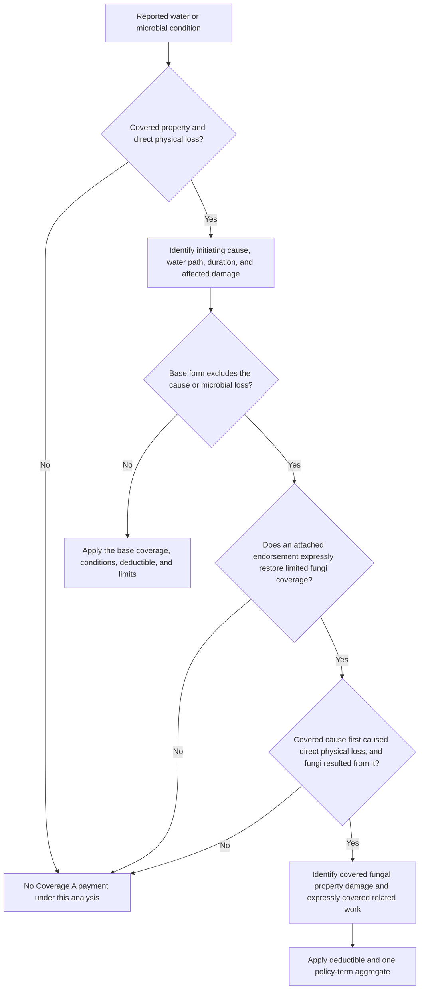

## Scope: a property-coverage issue, not a remediation protocol

This page concerns **Coverage A / Section I property loss**. The analysis starts with direct physical loss to covered property and the cause that produced it; the presence of mold, wet or dry rot, or bacteria is not, by itself, a coverage grant. The applicable declarations, base form, endorsements, and state amendments must be read together. An endorsement controls if it conflicts with the policy, but it changes only what it expressly changes.

The form record uses *fungi* broadly. In the limited-fungi endorsement, it includes fungi, wet or dry rot, bacteria, and substances they produce; the Louisiana amendment separately defines fungi to include mold, mildew, yeast, spores, mycotoxins, scents, and byproducts, and defines wet and dry rot. See **HO 04 81 (2018-09), W.1.1** and **HO 01 17 LA (2020-09), T.9.37–T.9.38**.

> **Do not infer coverage from a moisture finding or a remediation recommendation.** The water-loss handling guide is operational guidance, expressly not contract language. It can guide evidence collection and handling sequence, but cannot create, expand, limit, or waive coverage. The policy and applicable endorsements decide the coverage result.

## Contractual decision sequence

*Decision flow for testing Coverage A fungal loss under the applicable base form and endorsement.*

The sequence is important. A fungi aggregate is a ceiling on a loss that is otherwise within the endorsement; it is not a stand-alone grant for a pre-existing moisture condition, a non-covered water source, or routine maintenance. Likewise, calculating a sublimit does not answer whether the initiating event or the claimed work is covered.

### 1. Establish the initiating cause before classifying the resulting condition

For the Mississippi HO-3 (2018-09), sudden and accidental means abrupt, unintended, and unexpected, illustrated by an unforeseen pipe rupture; gradual seepage, leakage, and deterioration are outside that definition. That form covers sudden and accidental escape of water or steam from listed building systems, but not damage to the failed system or appliance itself. It separately excludes repeated seepage or leakage over time, flood and surface water, groundwater, sewer/drain/sump backup, and mold, fungus, wet rot, dry rot, and bacteria. **HO-3 MS (2018-09), DEF.12; P.20–P.23; X.3–X.7.**

Accordingly, a sudden plumbing discharge can support an initial water-damage analysis, while microbial damage that follows it remains subject to the separate fungi exclusion and any attached limited-fungi endorsement. Discovery of damage after the fact does not itself prove that the water event was sudden or that the moisture was caused by a covered event.

Other base-form variants in the repository retain the same need to identify the actual source and pathway, while their wording differs:

- **HO-3 MS (2024-03)** excludes flood/surface water, groundwater, and sewer or sump backup unless the relevant water-backup endorsement is attached. It also excludes fungi, wet rot, dry rot, bacteria, dampness, humidity, condensation, repeated seepage, and loss involving plumbing-system discharge or leakage as stated in its Section I exclusions. **X.7–X.10; X.28–X.35.**
- **HO-6 MS (2023-02)** is a unit-owner form, not a Coverage A dwelling form. It excludes fungi and costs above the fungi-and-bacteria aggregate, as well as dampness/humidity/condensation and over-time leakage or seepage; its separate water exclusions include backup, flood/surface water, and groundwater. **X.3–X.8; X.22–X.24; X.82–X.85.** Do not transpose its unit-owner terms or limit terminology to a dwelling claim.

### 2. Apply the microbial exclusion independently

The initial water event and the later microbial condition can be separate coverage questions. The 2018 Mississippi HO-3 expressly excludes loss caused by mold, fungus, wet rot, dry rot, or bacteria, including their presence, growth, proliferation, spread, or discharge. A potentially covered discharge does not by itself erase that later exclusion. **HO-3 MS (2018-09), P.21–P.23.**

The 2024 Mississippi HO-3 similarly states that fungi, wet rot, dry rot, and bacteria are excluded except as provided by a limited-fungi endorsement, and it says that its microbial remediation limit does not create coverage for an excluded loss. **HO-3 MS (2024-03), X.28–X.29.**

### 3. Determine whether the limited-fungi endorsement is attached and its trigger is satisfied

HO 04 81 (2018-09) is the repository's express limited-fungi endorsement. It modifies, rather than replaces, the policy and leaves unaffected provisions in force. It covers direct physical loss caused by fungi only when:

1. the fungi results from a **covered cause of loss**;
2. that cause first causes direct physical loss to covered property; and
3. the fungal damage results from that earlier direct physical loss.

The endorsement specifically does **not** cover fungal loss arising from constant or repeated seepage/leakage or discharge/overflow from the listed systems, or from flood. **HO 04 81 (2018-09), W.0.15–W.0.27; W.1.2–W.1.9.** A water-backup or flood endorsement, if any, must be read on its own terms; the HO 04 81 wording does not generally restore otherwise excluded water causes.

This is a causal chain, not merely a chronology. A covered event must cause direct physical loss, and fungi must result from that loss. A pre-existing microbial condition, deterioration, defective maintenance, or a non-covered water source remains outside the limited grant. **HO 04 81 (2018-09), W.1.23–W.1.29; W.4.5–W.4.16; W.4.25–W.4.34.**

## What the HO 04 81 limited grant can include

When the causal trigger is met, the HO 04 81 wording includes more than visible fungal material. It provides, within the applicable aggregate, for:

- direct physical loss to covered property caused by covered fungi;
- reasonable and necessary fungi removal and remediation;
- reasonable and necessary tear-out and replacement needed to gain access to fungi or repair covered fungi damage; and
- post-work air or property testing when there is reason to believe fungi remain after covered removal, repair, replacement, restoration, or remediation.

**HO 04 81 (2018-09), W.1.10–W.1.16; W.1.40–W.1.41.**

The phrasing matters. Testing is not automatically payable just because it was performed, and remediation is not automatically payable merely because it was recommended. The endorsement excludes monitoring without covered direct physical loss, preventive maintenance, routine cleaning, and work not necessary because of covered direct physical loss. It also retains exclusions for pre-existing fungi, deterioration, inadequate maintenance, and faulty work. **HO 04 81 (2018-09), W.1.22–W.1.29.**

### Resulting-loss language is not a fungi exception

Some variants preserve coverage for a distinct covered peril that results from an excluded condition. For example, the North Carolina amendment says it does not cover faulty work, wear and tear, mechanical breakdown, or dry rot, but does cover *direct loss caused by a covered peril* resulting from those conditions. **HO 01 32 NC (2018-05), T.8.23–T.8.25.** That language does not convert the excluded microbial condition itself into covered loss. The claimant still must identify a separate covered peril and satisfy the fungi provision or an express limited-fungi coverage grant for the microbial component.

## Aggregate limit and deductible mechanics

### HO 04 81 (2018-09): $10,000 per policy term

The endorsement's fungi, wet or dry rot, or bacteria aggregate is **$10,000 for all covered loss during the policy term**. It applies to direct physical loss and to covered related costs; it is not a separate limit for the dwelling, personal property, each room, each cause, each claim, each insured, or each location. Payments reduce what remains available, and prior payment does not restore the limit. **HO 04 81 (2018-09), W.2.1–W.2.19; W.1.47–W.1.52.**

The applicable deductible applies to covered fungal loss and its covered remediation, removal, testing, cleaning, repair, and replacement expenses. The endorsement says limitations are applied before the deductible and that the deductible does not increase a limitation. **HO 04 81 (2018-09), W.3.1–W.3.8; W.3.28.** Thus, identify the covered amount, apply the aggregate cap, and then apply the applicable deductible according to the form's stated mechanics. Do not treat the deductible as additional fungi coverage.

### North Carolina state-form variant: $5,000

The North Carolina HO 01 32 amendment is materially different: it caps all loss caused by “fungi, wet or dry rot, or bacteria” at **$5,000**, regardless of the number of insureds, claims, damaged properties, or occurrences; it also says fungal loss is not covered unless coverage is expressly provided. **HO 01 32 NC (2018-05), T.8.8–T.8.9.** Do not use the HO 04 81 $10,000 figure for a North Carolina policy governed by this amendment without confirming the complete policy and attached forms.

## Louisiana and other form variations

The Louisiana HO 01 17 amendment does not, in the cited fungi definition, supply a standalone fungi aggregate or replace the base fungi coverage grant. It establishes that the endorsement controls on conflict, preserves policy exclusions and limitations unless changed, and defines fungi, wet rot, and dry rot. **HO 01 17 LA (2020-09), T.0.15–T.0.33; T.9.37–T.9.38.** The actual Louisiana outcome therefore requires the full attached policy and any limited-fungi endorsement—not an assumed $5,000 or $10,000 limit.

HO 04 41 (2011-05) is not a fungi endorsement or Coverage A property endorsement. It extends limited **liability** insured status for an additional insured in connection with the residence premises and expressly does not provide property insurance. It does not alter this Coverage A fungi analysis. **HO 04 41 (2011-05), W.0.15–W.0.37.**

## Investigation and mitigation: process evidence, not contract authority

The water-loss handling guide calls for cause-and-duration investigation, documentation of water path and pre-existing conditions, preservation of relevant components where practical, and separation of microbial remediation from water extraction and structural repair. It also says to refer fungi concerns for limitation/exclusion review. Those practices can help establish the facts needed for the policy analysis; they do **not** establish a moisture threshold, prescribe covered remediation, or decide the aggregate limit. **Water Loss Claim Handling Guidance, H.0.15–H.0.16; H.1.4–H.1.9; H.1.19–H.1.26; H.4.21.**

Policy duties may independently require prompt notice, reasonable protection against further damage, preservation of property for inspection where reasonable, cooperation, and records supporting the claimed work. Under HO 04 81, emergency protective measures remain limited to measures related to a covered fungi loss or covered cause, and nonemergency work should not deprive the insurer of a reasonable inspection opportunity. **HO 04 81 (2018-09), W.1.17–W.1.21; W.1.45–W.1.46; W.5.2–W.5.16; W.6.15–W.6.18.**

## File-level checklist

1. Identify the exact policy form, state amendment, declarations, deductibles, and all attached endorsements.
2. Classify the affected property and confirm direct physical loss to property covered by the relevant coverage part.
3. Establish the initiating source, pathway, timing, duration, and whether an exclusion applies to the water event.
4. Separate initial water damage, pre-existing damage, maintenance/defect issues, fungal damage, testing, mitigation, and permanent repair in the scope and estimate.
5. If HO 04 81 or another limited-fungi grant is attached, test its causal prerequisites before pricing removal, tear-out, remediation, or testing.
6. Track all prior fungi-limit payments in the same policy term, apply the aggregate once across covered categories, then apply the deductible as the form directs.
7. Explain the result using the actual controlling form language. Do not cite handling guidance as the source of a coverage denial, grant, dollar limit, or remediation obligation.
