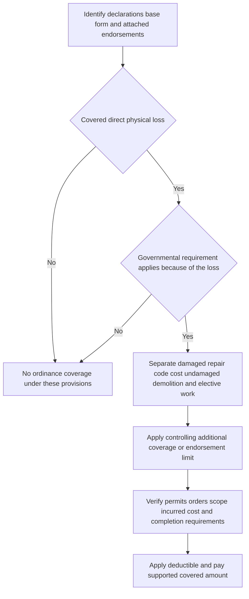

# Ordinance or Law Coverage

## Scope: assemble the actual policy before calculating a code upgrade

Ordinance-or-law coverage is not a generic payment for bringing a building up to current code. It is an additional, edition- and endorsement-specific property coverage that must be read with the declarations, governing base form, attached endorsements, the covered-loss determination, and the governmental requirement. An amendment controls only to the extent of a conflict and does not create coverage unless its terms do so. [Florida HO 01 09 (2023-07), T.0](repo://forms/HO/FL/HO-01-09/2023-07.md#L13-L25) [Louisiana HO 01 17 (2020-09), T.0](repo://forms/HO/LA/HO-01-17/2020-09.md#L13-L35)

This page concerns the reviewed HO-3 and HO-6 manuscript forms and the HO 04 16 endorsement. It does not establish coverage for a particular jurisdiction or loss. In particular, do not derive an upgrade amount from a claim guideline, an estimate template, or a training percentage: use the exact applicable contract provision.

*The contract-driven sequence for a code-upgrade claim: coverage for the direct physical loss and enforced governmental requirement come before cost allocation, limits, and payment.* [HO 04 16 (2023-11), W.0–W.2](repo://forms/HO/MS/HO-04-16/2023-11.md#L15-L43) [HO 04 16 (2023-11), W.1.1–W.1.17](repo://forms/HO/MS/HO-04-16/2023-11.md#L47-L79)

## The base-form exclusion and limited additional coverage

### HO-3 (2018-09): 10% additional coverage

The reviewed HO-3 (2018-09) says that increased costs caused by enforcement of an ordinance or law are not payable **unless coverage for those costs applies**. Its Additional Coverages then grant qualifying costs to comply with an applicable ordinance or law regulating repair of damaged covered property, repair and demolition/clearing of an undamaged building part when required because of covered direct physical loss, and increased rebuilding cost. The coverage is capped at **10% of Coverage A** for all covered ordinance-or-law expense; a deductible applies. [HO-3 (2018-09), I.A A.25](repo://forms/HO/MS/HO-3/2018-09.md#L135-L135) [HO-3 (2018-09), I.E E.69–E.80](repo://forms/HO/MS/HO-3/2018-09.md#L555-L577)

This is a 2018-edition rule. It also requires permits before repair or replacement and permits proof of the amount and necessity of the expense; it excludes pollutant-related ordinance costs and costs where no covered direct physical loss occurred. [HO-3 (2018-09), I.E E.73–E.80](repo://forms/HO/MS/HO-3/2018-09.md#L563-L577)

### HO-3 (2024-03): 15% additional coverage

The reviewed HO-3 (2024-03) states the Coverage A exclusion directly: it does not cover enforcement of an ordinance or law regulating construction, repair, demolition, or use of covered property, or the increased cost of compliance. Its Additional Coverages separately provide qualifying ordinance-or-law coverage for increased construction, repair, or demolition cost on damaged building portions; loss to an undamaged building portion that must be demolished; and reasonable debris-removal expense from that required demolition. The stated maximum is **15% of the Coverage A limit**, as **additional insurance**. [HO-3 (2024-03), I.A A.8](repo://forms/HO/MS/HO-3/2024-03.md#L113-L113) [HO-3 (2024-03), I.E E.36–E.39](repo://forms/HO/MS/HO-3/2024-03.md#L483-L489)

The 2024 provision does not pay costs attributable to pre-loss noncompliance by an insured, prior owner, or another person, or costs associated with land-use enforcement. Additional coverages remain subject to policy terms, conditions, limitations, exclusions, post-loss duties, documentation, reasonable-necessary expense requirements, and the applicable deductible unless the policy says otherwise. [HO-3 (2024-03), I.E E.39](repo://forms/HO/MS/HO-3/2024-03.md#L489-L491) [HO-3 (2024-03), I.E E.53–E.58](repo://forms/HO/MS/HO-3/2024-03.md#L517-L527)

### HO-6 (2023-02): unit-owner property and 15% of Coverage A

For the reviewed HO-6 (2023-02), the additional coverage applies to an ordinance or law regulating construction, repair, or demolition of **damaged covered property** because of a covered direct physical loss. It also encompasses loss in value and demolition/removal cost for an undamaged part only where an ordinance requires demolition because of direct damage caused by an insured peril. The limit is **15% of the Coverage A limit** and does **not** reduce Coverage A. [HO-6 (2023-02), I.E E.33–E.36](repo://forms/HO/MS/HO-6/2023-02.md#L434-L440)

Because HO-6 Coverage A is limited to the unit owner's building responsibility, verify the condominium declaration or other agreement before treating a building component or code work as the insured's covered property. The form excludes building-owner or association property unless the insured is responsible under an agreement. [HO-6 (2023-02), I.A A.4–A.8](repo://forms/HO/MS/HO-6/2023-02.md#L86-L94) [HO-6 (2023-02), I.A A.12](repo://forms/HO/MS/HO-6/2023-02.md#L100-L102)

The HO-6 requires records of the ordinance or law, plans, permits, estimates, and invoices on request. It excludes costs where the underlying loss was not caused by an insured peril, pre-loss requirements not triggered by the loss, land-use/occupancy/environmental or material-handling requirements, and unreasonable cost; repairs, replacement, or demolition must begin within a reasonable time. [HO-6 (2023-02), I.E E.37–E.42](repo://forms/HO/MS/HO-6/2023-02.md#L442-L452)

## HO 04 16 (2023-11): attached endorsement treatment

### What the endorsement grants

HO 04 16 (2023-11) forms part of the insurance agreement and changes the insurance for enforcement-of-ordinance-or-law loss. It applies only when the ordinance or law affects property **because of a covered loss**; the endorsement controls a conflict for this coverage, while other policy provisions remain unchanged. An applicable requirement must be in force and enforced by the governmental authority having jurisdiction. A requirement can be reflected in an order, notice, permit requirement, inspection requirement, or similar governmental action. [HO 04 16 (2023-11), W.0](repo://forms/HO/MS/HO-04-16/2023-11.md#L15-L43) [HO 04 16 (2023-11), W.1.1–W.1.4](repo://forms/HO/MS/HO-04-16/2023-11.md#L47-L53)

For a qualifying covered direct physical loss during the policy period, its grant has three material components:

1. **Undamaged portion:** loss in value when the authority requires demolition of the undamaged part of a covered building because of the covered loss, with valuation under the building's valuation provisions.
2. **Demolition and debris:** reasonable demolition cost for damaged property or an undamaged portion when required, including necessary debris removal from that required demolition.
3. **Increased cost of construction:** the incremental cost to repair or replace covered property damaged by the covered loss in compliance with the requirement—not an improvement that the requirement does not mandate.

[HO 04 16 (2023-11), W.1.5–W.1.13](repo://forms/HO/MS/HO-04-16/2023-11.md#L55-L71) [HO 04 16 (2023-11), W.1.32–W.1.35](repo://forms/HO/MS/HO-04-16/2023-11.md#L109-L115)

The endorsement does not make enforcement alone a covered cause. It preserves the need for a covered underlying direct physical loss and does not create coverage for property or causes otherwise excluded. Its exclusions also specifically retain exclusions for losses related to excluded causes, including mold/rot and microorganisms, and associated ordinance-or-law costs. [HO 04 16 (2023-11), W.0](repo://forms/HO/MS/HO-04-16/2023-11.md#L23-L29) [HO 04 16 (2023-11), W.1.49–W.1.50](repo://forms/HO/MS/HO-04-16/2023-11.md#L143-L145) [HO 04 16 (2023-11), W.4.16–W.4.17 and W.4.63–W.4.67](repo://forms/HO/MS/HO-04-16/2023-11.md#L379-L381) [HO 04 16 (2023-11), W.4.63–W.4.67](repo://forms/HO/MS/HO-04-16/2023-11.md#L473-L481)

### Limit and deductible

For Coverage A property, HO 04 16 sets one limit of **25% of the Coverage A limit applicable to the covered loss**. That is additional insurance and does not reduce the Coverage A limit. It is one aggregate ceiling for all covered increased costs from the loss: it is not multiplied by the number of buildings, portions, governmental authorities, ordinances, insureds, or claims. Payments reduce the remaining endorsement limit. [HO 04 16 (2023-11), W.2.1–W.2.8](repo://forms/HO/MS/HO-04-16/2023-11.md#L179-L193) [HO 04 16 (2023-11), W.2.45–W.2.47](repo://forms/HO/MS/HO-04-16/2023-11.md#L263-L271)

For this endorsement, the payable code-upgrade amount is therefore the supported covered increment—rather than the whole repair—subject to the single remaining 25%-of-applicable-Coverage-A limit and the other contract constraints. The endorsement pays only the portion caused by enforcement, not cost that would have been incurred without enforcement, voluntary or elective work, unincurred cost, duplicate recovery, or unreasonable/nonnecessary cost. [HO 04 16 (2023-11), W.2.13–W.2.25](repo://forms/HO/MS/HO-04-16/2023-11.md#L203-L227)

The endorsement applies the applicable deductible to the covered ordinance-or-law portion after covered loss and valuation are determined and before payment; it does not increase the limit or create coverage. Urgency does not waive it. The applicable deductible remains policy- and endorsement-specific. [HO 04 16 (2023-11), W.3.1–W.3.6](repo://forms/HO/MS/HO-04-16/2023-11.md#L285-L295) [HO 04 16 (2023-11), W.3.27–W.3.31](repo://forms/HO/MS/HO-04-16/2023-11.md#L337-L345)

Florida provides a concrete example of why a state amendment must be checked rather than presumed: when the Florida HO 01 09 (2023-07) is attached, it says the windstorm-and-hail deductible applies to a **covered** ordinance-or-law loss arising from windstorm or hail. The amendment does not make an excluded loss covered. [Florida HO 01 09 (2023-07), T.1.29–T.1.35](repo://forms/HO/FL/HO-01-09/2023-07.md#L111-L127) Texas HO 01 45 (2022-01) similarly states that an ordinance-or-law percentage applies only when the policy provides such coverage; it supplies no universal percentage. [Texas HO 01 45 (2022-01), T.8.33](repo://forms/HO/TX/HO-01-45/2022-01.md#L721-L725)

### Payment prerequisites and boundaries

Increased construction cost under HO 04 16 is payable only when the covered building is repaired or replaced, ordinarily at the same residence premises unless the insurer agrees to another location because the requirement prohibits repair or replacement there. Payment is limited to reasonable expenses actually incurred for compliant repair or replacement; the insurer may pay as work progresses with satisfactory proof and may withhold payment for uncompleted work. [HO 04 16 (2023-11), W.1.13–W.1.14](repo://forms/HO/MS/HO-04-16/2023-11.md#L71-L73) [HO 04 16 (2023-11), W.1.33–W.1.35](repo://forms/HO/MS/HO-04-16/2023-11.md#L111-L115) [HO 04 16 (2023-11), W.1.64](repo://forms/HO/MS/HO-04-16/2023-11.md#L173-L175)

Important boundaries include pre-loss compliance or code violations, age/condition/location/occupancy-based requirements not resulting directly from the loss, land-use requirements, loss of use or market value, fines and penalties, pollutants, and nonrequired betterment. The detailed "What Remains Excluded" provision also excludes voluntary compliance, voluntary demolition of undamaged property, and corrective work for deferred maintenance, wear, deterioration, or unrelated conditions. [HO 04 16 (2023-11), W.1.15–W.1.29](repo://forms/HO/MS/HO-04-16/2023-11.md#L75-L105) [HO 04 16 (2023-11), W.4.27–W.4.37](repo://forms/HO/MS/HO-04-16/2023-11.md#L401-L421)

## Code-upgrade proof and claim handling

The policyholder should promptly give the carrier the governmental notice, order, citation, permit condition, or other direction; preserve the written communication and evidence of how and when it was received; and give a reasonable opportunity to inspect before demolition, removal, repair, or reconstruction, except for action immediately necessary to protect people or property. Required permits and their supporting applications, plans, and approvals must be provided on request. [HO 04 16 (2023-11), W.6.1–W.6.8](repo://forms/HO/MS/HO-04-16/2023-11.md#L637-L651)

The proof must do more than show that work was performed. It should establish the enforceable requirement and link it to the covered loss, then separate work required solely by the ordinance from direct-damage repair, voluntary improvement, and work on any undamaged part. For the claimed amount, retain and provide photographs, measurements, plans, specifications, contracts, estimates, invoices, receipts, and proof of payment that distinguish covered from noncovered work; if no written order exists, other reliable evidence of the requirement is required. [HO 04 16 (2023-11), W.6.10–W.6.14](repo://forms/HO/MS/HO-04-16/2023-11.md#L655-L663) [HO 04 16 (2023-11), W.6.25–W.6.27](repo://forms/HO/MS/HO-04-16/2023-11.md#L685-L689)

The endorsement also allows the insurer to request plans, specifications, permits, orders, notices, estimates, contracts, invoices, and other supporting records; it requires reasonable efforts to obtain available waiver, variance, exception, or other relief, and excludes avoidable cost that such relief could have avoided. An authority's later modification, withdrawal, suspension, or decision not to enforce can change the analysis and must be reported. [HO 04 16 (2023-11), W.2.26–W.2.31](repo://forms/HO/MS/HO-04-16/2023-11.md#L229-L239) [HO 04 16 (2023-11), W.6.27](repo://forms/HO/MS/HO-04-16/2023-11.md#L687-L689)

<!-- openwiki: broken internal link [/openwiki/claims-guidance/claim-intake-investigation-and-documentation] file "/openwiki/claims-guidance/claim-intake-investigation-and-documentation" does not exist. Fix the href or restore the target, then delete this comment. -->
For the common claim file controls—preserving the governing policy, separating cause and scope, retaining evidence, and communicating a coverage decision—see [Claims Guidance — Intake, Investigation, Duties, and Payment Handling](/openwiki/claims-guidance/claim-intake-investigation-and-documentation). That guidance is operational; the provisions cited here control the entitlement, percentage, deductible, and proof for an ordinance-or-law claim.

## Focused review checklist

- Identify the form edition, Coverage A limit in force at loss, declarations, and every attached endorsement before using a percentage.
- Establish a covered direct physical loss before treating a government requirement as an ordinance-or-law claim.
- Obtain the governmental authority's enforceable order, notice, permit condition, inspection record, or other reliable proof; identify the code provision and the property it affects.
- Divide the scope and estimate into direct covered damage, required code increment, required demolition/debris for an undamaged portion, pre-existing condition, and elective betterment.
- Apply the correct edition-specific limit—10% under the reviewed HO-3 (2018-09), 15% under the reviewed HO-3 (2024-03) or HO-6 (2023-02), or 25% only when HO 04 16 (2023-11) is attached and controlling—and then apply the governing deductible.
- Preserve permits, plans, estimates, contracts, invoices, receipts, proof of payment, inspection access, completed-work proof, waiver/variance correspondence, and any other-source recovery information.
